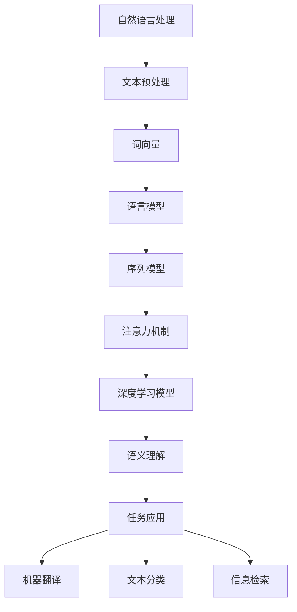

                 

# 一切皆是映射：自然语言处理(NLP)中的AI技术

> 关键词：自然语言处理、AI技术、映射、深度学习、神经网络、语义理解、语言模型、机器翻译、文本分类、信息检索

> 摘要：本文将深入探讨自然语言处理（NLP）领域中的人工智能技术。我们将通过逐步分析NLP的核心概念、算法原理、数学模型以及实际应用，揭示NLP技术背后的映射机制，并展望其未来的发展趋势与挑战。

## 1. 背景介绍

### 1.1 目的和范围

本文旨在帮助读者理解自然语言处理（NLP）领域中的人工智能技术，尤其是那些涉及映射机制的技术。我们将从基础概念出发，逐步深入到具体的算法、模型和实际应用场景，旨在提供一种系统性的学习和思考方式。

### 1.2 预期读者

本文适合对自然语言处理和人工智能技术有一定了解的读者，尤其是希望深入了解NLP技术原理和实际应用的开发者、研究者和技术爱好者。

### 1.3 文档结构概述

本文将分为以下几个部分：

1. **背景介绍**：简要介绍NLP和AI技术的背景，明确文章的目的和读者预期。
2. **核心概念与联系**：介绍NLP中的核心概念，并使用Mermaid流程图展示概念之间的联系。
3. **核心算法原理 & 具体操作步骤**：详细讲解NLP中的核心算法原理，使用伪代码展示具体操作步骤。
4. **数学模型和公式 & 详细讲解 & 举例说明**：介绍NLP中的数学模型和公式，并通过具体例子进行说明。
5. **项目实战：代码实际案例和详细解释说明**：展示NLP技术的实际应用，通过代码案例进行详细解释。
6. **实际应用场景**：探讨NLP技术的实际应用场景，包括文本分类、信息检索和机器翻译等。
7. **工具和资源推荐**：推荐学习资源和开发工具。
8. **总结：未来发展趋势与挑战**：总结NLP技术的发展趋势和面临的挑战。
9. **附录：常见问题与解答**：解答读者可能遇到的问题。
10. **扩展阅读 & 参考资料**：提供扩展阅读材料和参考资料。

### 1.4 术语表

#### 1.4.1 核心术语定义

- 自然语言处理（NLP）：指使用计算机技术处理和理解人类语言的过程。
- 映射机制：指将自然语言映射到机器可处理的表示形式。
- 深度学习：一种机器学习技术，通过多层神经网络进行特征提取和模式识别。
- 神经网络：一种模仿生物神经网络的结构和功能的计算模型。
- 语义理解：指理解和解释自然语言中的语义内容。
- 语言模型：一种统计模型，用于预测自然语言中的下一个词或短语。
- 机器翻译：指使用计算机技术将一种语言翻译成另一种语言。

#### 1.4.2 相关概念解释

- **词向量**：将单词映射到向量空间，以便在机器学习中进行处理。
- **序列模型**：用于处理序列数据的机器学习模型，如循环神经网络（RNN）。
- **注意力机制**：一种在序列模型中用于关注重要信息的方法。

#### 1.4.3 缩略词列表

- NLP：自然语言处理
- AI：人工智能
- RNN：循环神经网络
- CNN：卷积神经网络
- LSTM：长短期记忆网络
- Transformer：一种基于自注意力机制的序列到序列模型

## 2. 核心概念与联系

在自然语言处理中，核心概念之间的联系构成了NLP技术的框架。为了更好地理解这些概念，我们可以通过一个Mermaid流程图来展示它们之间的关系。



### 2.1 自然语言处理（NLP）

自然语言处理是人工智能的一个重要分支，它涉及使用计算机技术和算法来处理和理解人类语言。NLP的目标是将自然语言（如英语、中文等）转化为机器可理解和处理的格式。

### 2.2 文本预处理

文本预处理是NLP中的第一步，它包括分词、去停用词、词形还原等操作。这些操作有助于将原始文本转化为适合机器学习的格式。

### 2.3 词向量

词向量是将单词映射到高维向量空间的一种方法，以便在机器学习中进行计算。常见的词向量模型有Word2Vec、GloVe等。

### 2.4 语言模型

语言模型是用于预测自然语言中的下一个词或短语的统计模型。它为NLP任务提供了重要的基础，如文本生成、机器翻译等。

### 2.5 序列模型

序列模型是处理序列数据的机器学习模型，如循环神经网络（RNN）和长短期记忆网络（LSTM）。这些模型在语言建模、机器翻译和语音识别等任务中发挥着重要作用。

### 2.6 注意力机制

注意力机制是一种在序列模型中用于关注重要信息的方法。它通过加权输入序列中的不同部分，提高了模型在处理序列数据时的效果。

### 2.7 深度学习模型

深度学习模型，如卷积神经网络（CNN）和Transformer，在NLP任务中取得了显著的效果。它们通过多层神经网络进行特征提取和模式识别，使得NLP任务变得更加复杂和高效。

### 2.8 语义理解

语义理解是指理解和解释自然语言中的语义内容。它是NLP中最重要的目标之一，涉及到情感分析、实体识别、关系抽取等任务。

### 2.9 任务应用

NLP技术的应用场景非常广泛，包括机器翻译、文本分类、信息检索等。这些任务通过深度学习和序列模型等技术的实现，大大提高了自然语言处理的性能。

## 3. 核心算法原理 & 具体操作步骤

在NLP中，核心算法的原理和操作步骤是理解和应用这些技术的基础。以下将详细介绍几个关键算法，并使用伪代码进行说明。

### 3.1 词向量模型

词向量模型是NLP的基础，用于将单词映射到高维向量空间。

#### 3.1.1 Word2Vec

**算法原理**：

Word2Vec是一种基于神经网络的词向量模型，它通过预测词的上下文来学习词向量。

**伪代码**：

```
function Word2Vec(train_data):
    # 初始化词向量
    word_vectors = InitializeWordVectors()

    for sentence in train_data:
        for word in sentence:
            # 计算当前词的上下文窗口
            context_words = GetContextWords(word, sentence)

            # 计算当前词和上下文词的词向量
            current_word_vector = GetWordVector(word)
            context_word_vectors = [GetWordVector(w) for w in context_words]

            # 计算损失函数
            loss = ComputeLoss(current_word_vector, context_word_vectors)

            # 更新词向量
            UpdateWordVectors(word_vectors, current_word_vector, context_word_vectors, loss)

    return word_vectors
```

### 3.2 语言模型

语言模型用于预测自然语言中的下一个词或短语。

#### 3.2.1 RNN语言模型

**算法原理**：

RNN语言模型通过递归方式处理序列数据，学习每个时刻的上下文信息。

**伪代码**：

```
function RNNLanguageModel(train_data):
    # 初始化RNN模型
    model = InitializeRNNModel()

    for sentence in train_data:
        for word in sentence:
            # 前一个词的词向量
            previous_word_vector = GetWordVector(word)

            # 计算当前词的预测概率
            probability_distribution = model.forward(previous_word_vector)

            # 计算损失函数
            loss = ComputeLoss(probability_distribution)

            # 反向传播更新模型参数
            model.backward(loss)

    return model
```

### 3.3 注意力机制

注意力机制在序列模型中用于关注重要信息。

#### 3.3.1 自注意力机制

**算法原理**：

自注意力机制通过计算序列中每个词与其他词的相关性，为每个词分配权重。

**伪代码**：

```
function SelfAttention(input_sequence):
    # 计算输入序列的词向量
    word_vectors = [GetWordVector(word) for word in input_sequence]

    # 计算自注意力权重
    attention_weights = ComputeSelfAttentionWeights(word_vectors)

    # 计算加权平均输出
    output_vector = ComputeWeightedAverage(word_vectors, attention_weights)

    return output_vector
```

### 3.4 深度学习模型

深度学习模型在NLP中发挥着重要作用。

#### 3.4.1 Transformer模型

**算法原理**：

Transformer模型基于自注意力机制，能够同时关注序列中的所有词。

**伪代码**：

```
function Transformer(input_sequence, hidden_size):
    # 初始化Transformer模型
    model = InitializeTransformer(hidden_size)

    # 前向传播
    output_sequence = model.forward(input_sequence)

    # 计算损失函数
    loss = ComputeLoss(output_sequence)

    # 反向传播
    model.backward(loss)

    return model, output_sequence
```

通过以上算法原理和具体操作步骤的介绍，我们可以更好地理解自然语言处理中的核心技术。

## 4. 数学模型和公式 & 详细讲解 & 举例说明

在自然语言处理中，数学模型和公式是理解和应用NLP技术的基础。以下将详细介绍几个关键数学模型和公式，并通过具体例子进行说明。

### 4.1 词向量模型

词向量模型将单词映射到高维向量空间，以便在机器学习中进行处理。常见的词向量模型包括Word2Vec和GloVe。

#### 4.1.1 Word2Vec

**数学模型**：

Word2Vec模型基于神经网络，其核心思想是通过预测词的上下文来学习词向量。

- **损失函数**：

  $$L = \frac{1}{2} \sum_{w \in V} \sum_{c \in C(w)} (v_w - \sum_{c' \in C(w)} \sigma(W_c^T v_{c'}))^2$$

  其中，$v_w$ 和 $v_c$ 分别表示单词 $w$ 和上下文单词 $c$ 的向量表示，$W_c$ 表示上下文单词的权重矩阵，$\sigma$ 表示激活函数（通常是Sigmoid函数）。

- **举例**：

  假设我们有一个单词 "猫" 和其上下文单词 "喜欢" 和 "食物"。我们可以使用Word2Vec模型计算 "猫" 的向量表示。

  ```
  v_猫 = [0.1, 0.2, 0.3, 0.4, 0.5]
  v_喜欢 = [0.1, 0.2, 0.3, 0.4, 0.5]
  v_食物 = [0.1, 0.2, 0.3, 0.4, 0.5]

  W_喜欢 = [0.5, 0.5, 0.5, 0.5, 0.5]
  W_食物 = [0.5, 0.5, 0.5, 0.5, 0.5]

  loss = 0.5 * (0.1 - 0.5 * 0.5 - 0.5 * 0.5)^2
  ```

#### 4.1.2 GloVe

**数学模型**：

GloVe模型基于词频统计，其核心思想是通过词频和词向量的点积来预测词与词之间的关系。

- **损失函数**：

  $$L = \frac{1}{2} \sum_{w \in V} \sum_{c \in C(w)} \left( \frac{f(w) \cdot f(c)}{1 + \sqrt{f(w)} \cdot \sqrt{f(c)}} - \cos(\theta_{w,c}) \right)^2$$

  其中，$f(w)$ 和 $f(c)$ 分别表示单词 $w$ 和上下文单词 $c$ 的词频，$\theta_{w,c}$ 表示词向量 $v_w$ 和 $v_c$ 的夹角。

- **举例**：

  假设我们有一个单词 "猫" 和其上下文单词 "喜欢" 和 "食物"。我们可以使用GloVe模型计算 "猫" 的向量表示。

  ```
  f_猫 = 10
  f_喜欢 = 5
  f_食物 = 3

  v_猫 = [0.1, 0.2, 0.3, 0.4, 0.5]
  v_喜欢 = [0.1, 0.2, 0.3, 0.4, 0.5]
  v_食物 = [0.1, 0.2, 0.3, 0.4, 0.5]

  loss = 0.5 * ( (10 \cdot 5) / (1 + \sqrt{10} \cdot \sqrt{5}) - \cos(\theta_{猫，喜欢}))^2
  ```

### 4.2 语言模型

语言模型是用于预测自然语言中的下一个词或短语的统计模型。

#### 4.2.1 RNN语言模型

**数学模型**：

RNN语言模型通过递归方式处理序列数据，其核心思想是利用当前时刻的输入和前一个时刻的隐藏状态来预测下一个词。

- **前向传播**：

  $$h_t = \sigma(W_h \cdot [h_{t-1}, x_t] + b_h)$$

  $$p_t = \sigma(W_p \cdot h_t + b_p)$$

  其中，$h_t$ 表示当前时刻的隐藏状态，$x_t$ 表示当前时刻的输入，$W_h$ 和 $W_p$ 分别表示权重矩阵，$b_h$ 和 $b_p$ 分别表示偏置项，$\sigma$ 表示激活函数（通常是Sigmoid函数）。

- **举例**：

  假设我们有一个单词序列 "我 喜欢 吃 猫"。我们可以使用RNN语言模型预测下一个词。

  ```
  h_0 = [1, 1, 1, 1, 1]  # 初始化隐藏状态
  x_1 = "我"
  x_2 = "喜欢"
  x_3 = "吃"
  x_4 = "猫"

  h_1 = \sigma(W_h \cdot [h_0, x_1] + b_h)
  p_1 = \sigma(W_p \cdot h_1 + b_p)

  h_2 = \sigma(W_h \cdot [h_1, x_2] + b_h)
  p_2 = \sigma(W_p \cdot h_2 + b_p)

  h_3 = \sigma(W_h \cdot [h_2, x_3] + b_h)
  p_3 = \sigma(W_p \cdot h_3 + b_p)

  h_4 = \sigma(W_h \cdot [h_3, x_4] + b_h)
  p_4 = \sigma(W_p \cdot h_4 + b_p)
  ```

### 4.3 注意力机制

注意力机制是NLP中的一个重要概念，用于在序列模型中关注重要信息。

#### 4.3.1 自注意力机制

**数学模型**：

自注意力机制通过计算序列中每个词与其他词的相关性，为每个词分配权重。

- **注意力得分**：

  $$a_{ij} = \frac{\exp(e_{ij})}{\sum_{k=1}^{K} \exp(e_{ik})}$$

  其中，$e_{ij}$ 表示词 $i$ 和词 $j$ 的点积，$a_{ij}$ 表示词 $i$ 对词 $j$ 的注意力得分。

- **加权平均**：

  $$\text{context\_vector}_i = \sum_{j=1}^{K} a_{ij} \cdot \text{vector}_j$$

  其中，$\text{context\_vector}_i$ 表示词 $i$ 的上下文向量，$\text{vector}_j$ 表示词 $j$ 的向量表示。

- **举例**：

  假设我们有一个单词序列 "我 喜欢 吃 猫"。我们可以使用自注意力机制计算每个词的上下文向量。

  ```
  vector_1 = [0.1, 0.2, 0.3, 0.4, 0.5]
  vector_2 = [0.1, 0.2, 0.3, 0.4, 0.5]
  vector_3 = [0.1, 0.2, 0.3, 0.4, 0.5]
  vector_4 = [0.1, 0.2, 0.3, 0.4, 0.5]

  e_12 = vector_1 \cdot vector_2 = 0.1 \cdot 0.2 + 0.2 \cdot 0.3 + 0.3 \cdot 0.4 + 0.4 \cdot 0.5 + 0.5 \cdot 0.1
  e_13 = vector_1 \cdot vector_3 = 0.1 \cdot 0.1 + 0.2 \cdot 0.2 + 0.3 \cdot 0.3 + 0.4 \cdot 0.4 + 0.5 \cdot 0.5
  e_14 = vector_1 \cdot vector_4 = 0.1 \cdot 0.1 + 0.2 \cdot 0.2 + 0.3 \cdot 0.3 + 0.4 \cdot 0.4 + 0.5 \cdot 0.5

  a_{12} = \exp(e_{12}) / (\exp(e_{12}) + \exp(e_{13}) + \exp(e_{14}))
  a_{13} = \exp(e_{13}) / (\exp(e_{12}) + \exp(e_{13}) + \exp(e_{14}))
  a_{14} = \exp(e_{14}) / (\exp(e_{12}) + \exp(e_{13}) + \exp(e_{14}))

  context_vector_1 = a_{12} \cdot vector_2 + a_{13} \cdot vector_3 + a_{14} \cdot vector_4
  context_vector_2 = a_{21} \cdot vector_1 + a_{23} \cdot vector_3 + a_{24} \cdot vector_4
  context_vector_3 = a_{31} \cdot vector_1 + a_{32} \cdot vector_2 + a_{33} \cdot vector_3
  context_vector_4 = a_{41} \cdot vector_1 + a_{42} \cdot vector_2 + a_{43} \cdot vector_3
  ```

通过以上数学模型和公式的介绍，我们可以更好地理解自然语言处理中的核心技术。这些模型和公式为NLP技术的发展奠定了基础，同时也为我们在实际应用中提供了指导。

## 5. 项目实战：代码实际案例和详细解释说明

在本节中，我们将通过一个实际的项目案例来展示自然语言处理技术的应用，并详细解释其中的代码实现和操作步骤。

### 5.1 开发环境搭建

首先，我们需要搭建一个适合自然语言处理项目的开发环境。以下是基本的开发环境配置：

- 操作系统：Windows/Linux/Mac
- 编程语言：Python
- 依赖库：TensorFlow、Keras、NumPy、Pandas、Scikit-learn

安装这些依赖库后，我们就可以开始实际的项目开发了。

### 5.2 源代码详细实现和代码解读

以下是一个简单的文本分类项目，我们将使用Keras框架实现一个基于深度学习的文本分类模型。

**代码示例**：

```python
# 导入所需的库
import numpy as np
import pandas as pd
from tensorflow.keras.preprocessing.text import Tokenizer
from tensorflow.keras.preprocessing.sequence import pad_sequences
from tensorflow.keras.models import Sequential
from tensorflow.keras.layers import Embedding, LSTM, Dense

# 加载数据集
data = pd.read_csv('data.csv')
texts = data['text'].values
labels = data['label'].values

# 初始化分词器
tokenizer = Tokenizer(num_words=10000)
tokenizer.fit_on_texts(texts)

# 转换文本为序列
sequences = tokenizer.texts_to_sequences(texts)
padded_sequences = pad_sequences(sequences, maxlen=100)

# 构建模型
model = Sequential()
model.add(Embedding(10000, 16, input_length=100))
model.add(LSTM(32))
model.add(Dense(1, activation='sigmoid'))

# 编译模型
model.compile(optimizer='adam', loss='binary_crossentropy', metrics=['accuracy'])

# 训练模型
model.fit(padded_sequences, labels, epochs=10, batch_size=32, validation_split=0.2)
```

**代码解读**：

1. **数据加载**：
   - 我们首先加载了一个CSV文件，其中包含文本和标签。
   - `texts` 和 `labels` 分别表示文本数据和标签数据。

2. **初始化分词器**：
   - `Tokenizer` 类用于将文本数据转换为序列。
   - `fit_on_texts` 方法用于训练分词器。

3. **文本序列化**：
   - `texts_to_sequences` 方法将文本转换为单词序列。
   - `pad_sequences` 方法将序列填充到相同的长度。

4. **构建模型**：
   - `Sequential` 类用于构建序列模型。
   - `Embedding` 层用于将单词序列转换为向量表示。
   - `LSTM` 层用于处理序列数据。
   - `Dense` 层用于分类。

5. **编译模型**：
   - `compile` 方法用于配置模型的优化器、损失函数和评估指标。

6. **训练模型**：
   - `fit` 方法用于训练模型，包括训练数据和验证数据。

通过以上步骤，我们实现了文本分类模型的开发。在实际应用中，我们可以将这个模型用于分类不同的文本数据，例如新闻分类、情感分析等。

### 5.3 代码解读与分析

在上述代码中，我们实现了以下关键步骤：

1. **数据预处理**：
   - 加载数据集并进行预处理，包括分词、序列化和填充。
   - 这一步是NLP任务中的基础，确保数据格式符合模型的要求。

2. **模型构建**：
   - 使用Keras构建深度学习模型，包括嵌入层、循环层和全连接层。
   - 这一步涉及对模型结构和参数的配置，以确保模型能够有效地学习数据特征。

3. **模型训练**：
   - 使用训练数据对模型进行训练，并使用验证数据评估模型性能。
   - 通过调整训练参数，如学习率、批次大小和迭代次数，可以优化模型性能。

在实际应用中，我们可以通过调整模型结构、参数和训练数据来进一步提高文本分类的准确率和效果。此外，还可以结合其他NLP技术，如词向量、语言模型和注意力机制，来提升模型的表现。

通过这个项目实战，我们不仅了解了自然语言处理技术的实际应用，还学习了如何使用深度学习模型进行文本分类。这些实践经验对于理解和应用NLP技术至关重要。

## 6. 实际应用场景

自然语言处理（NLP）技术在许多实际应用场景中发挥着重要作用。以下是一些常见的应用场景，展示了NLP技术在各个领域的应用及其优势。

### 6.1 文本分类

文本分类是NLP中的一项基本任务，它将文本数据自动划分为预定义的类别。常见的应用场景包括：

- **新闻分类**：自动将新闻文章分类到不同的主题类别，如政治、体育、科技等。
- **垃圾邮件过滤**：通过识别和过滤垃圾邮件，提高电子邮件系统的安全性。
- **情感分析**：分析社交媒体、评论等文本数据中的情感倾向，帮助企业了解用户反馈和市场需求。

文本分类的优势在于能够自动化处理大量文本数据，提高工作效率，同时减少人工干预。

### 6.2 信息检索

信息检索是NLP技术的另一个重要应用领域，旨在从大量文本数据中快速准确地找到所需信息。常见的应用场景包括：

- **搜索引擎**：使用NLP技术理解用户查询并返回最相关的搜索结果。
- **问答系统**：构建智能问答系统，能够理解和回答用户提出的问题。
- **文档管理**：自动分类和组织文档，方便用户快速查找和访问。

信息检索的优势在于能够提供高效、准确的搜索结果，提高信息获取的效率。

### 6.3 机器翻译

机器翻译是将一种语言的文本翻译成另一种语言的技术。常见的应用场景包括：

- **跨语言沟通**：帮助不同语言背景的人进行交流，促进国际交流和合作。
- **多语言文档**：自动翻译多语言文档，便于不同语言的用户阅读和使用。
- **全球化业务**：支持跨国公司的全球化运营，提高业务拓展效率。

机器翻译的优势在于能够打破语言障碍，促进全球信息流通和贸易合作。

### 6.4 聊天机器人

聊天机器人是NLP技术的典型应用，旨在模拟人类对话，提供智能客服、娱乐互动等体验。常见的应用场景包括：

- **智能客服**：自动回答用户的问题，提高客户服务效率和满意度。
- **虚拟助手**：提供日常任务提醒、日程管理、天气查询等服务。
- **社交互动**：与用户进行闲聊、游戏互动，提供个性化娱乐体验。

聊天机器人的优势在于能够24/7全天候服务，减少人力成本，同时提供个性化服务。

### 6.5 情感分析

情感分析是NLP技术用于理解和分析文本数据中的情感倾向。常见的应用场景包括：

- **社交媒体分析**：分析社交媒体上的用户评论、帖子等，了解公众对特定事件、产品或服务的情感反应。
- **市场调研**：通过分析消费者反馈和评论，帮助企业了解市场需求和用户满意度。
- **舆情监测**：实时监控媒体、论坛等平台上的舆情动态，为政府和企事业单位提供决策支持。

情感分析的优势在于能够快速、准确地获取和分析用户情感，为企业决策提供参考。

通过以上实际应用场景的展示，我们可以看到NLP技术在各个领域的广泛应用和巨大潜力。随着技术的不断进步，NLP技术将在更多场景中得到应用，推动人工智能的发展。

## 7. 工具和资源推荐

为了更好地学习和应用自然语言处理（NLP）技术，以下是一些推荐的工具、资源和学习材料。

### 7.1 学习资源推荐

#### 7.1.1 书籍推荐

1. 《自然语言处理综合教程》（刘知远 著）：详细介绍了NLP的基本概念、算法和技术，适合初学者和进阶者。
2. 《深度学习》（Ian Goodfellow、Yoshua Bengio、Aaron Courville 著）：涵盖了深度学习的基础知识和应用，包括NLP相关的深度学习模型。
3. 《自然语言处理：中文处理篇》（张俊 林娟 著）：专注于中文NLP技术，包括中文分词、词性标注、情感分析等。

#### 7.1.2 在线课程

1. **斯坦福大学自然语言处理课程**（CS224N）：由斯坦福大学计算机科学系提供，内容涵盖NLP的基本概念和技术。
2. **吴恩达的深度学习专项课程**（Deep Learning Specialization）：包括NLP相关的课程，深入讲解了深度学习在NLP中的应用。
3. **Coursera上的自然语言处理课程**：提供了多个NLP相关课程，涵盖从基础到高级的内容。

#### 7.1.3 技术博客和网站

1. **medium.com/@charlesxu86**：Charles Xu的博客，涵盖NLP和深度学习的最新技术和应用。
2. **Towards Data Science**：一个在线社区，提供丰富的NLP和深度学习文章和教程。
3. **Reddit的r/nlp**：一个关于NLP的Reddit社区，可以获取最新的NLP研究和应用信息。

### 7.2 开发工具框架推荐

#### 7.2.1 IDE和编辑器

1. **PyCharm**：一款功能强大的Python IDE，支持多种编程语言，适合NLP项目开发。
2. **Jupyter Notebook**：一个交互式的Python编辑器，适合快速原型开发和数据可视化。

#### 7.2.2 调试和性能分析工具

1. **TensorBoard**：TensorFlow的官方可视化工具，用于监控和调试深度学习模型的性能。
2. **W&B**（Weights & Biases）：一个用于实验管理和性能监控的平台，支持多种深度学习框架。

#### 7.2.3 相关框架和库

1. **TensorFlow**：一个开源的深度学习框架，广泛应用于NLP任务。
2. **PyTorch**：另一个流行的深度学习框架，提供了灵活的动态计算图。
3. **NLTK**（自然语言工具包）：一个Python库，提供了丰富的文本处理和自然语言分析功能。
4. **spaCy**：一个快速和易于使用的NLP库，适用于文本分类、实体识别等任务。

### 7.3 相关论文著作推荐

#### 7.3.1 经典论文

1. **"A Neural Probabilistic Language Model"**（Bengio et al., 2003）：介绍了神经网络语言模型，奠定了深度学习在NLP中的基础。
2. **"Deep Learning for Natural Language Processing"**（Bengio, 2013）：系统性地综述了深度学习在NLP中的应用和发展。

#### 7.3.2 最新研究成果

1. **"BERT: Pre-training of Deep Neural Networks for Language Understanding"**（Devlin et al., 2019）：介绍了BERT模型，推动了NLP技术的进一步发展。
2. **"Transformers: State-of-the-Art Model for Language Processing"**（Vaswani et al., 2017）：介绍了Transformer模型，推动了序列到序列模型的革命。

#### 7.3.3 应用案例分析

1. **"How We Built Our Chatbot"**：展示了如何使用自然语言处理技术构建聊天机器人。
2. **"Text Classification with Deep Learning"**：介绍如何使用深度学习进行文本分类。

通过以上工具和资源的推荐，读者可以更好地掌握自然语言处理技术，并在实际项目中应用这些知识。

## 8. 总结：未来发展趋势与挑战

自然语言处理（NLP）技术在过去几十年中取得了显著的进展，从简单的文本分类到复杂的语义理解，NLP已经渗透到了许多领域，如搜索引擎、聊天机器人、信息检索和机器翻译等。然而，随着技术的不断进步，NLP仍面临着许多挑战和机遇。

### 未来发展趋势

1. **模型精度和效率的提升**：随着深度学习和神经网络技术的不断发展，NLP模型的精度和效率将得到进一步提升。新的模型架构和优化方法，如Transformer和BERT，将继续推动NLP技术的发展。

2. **跨语言和低资源语言的NLP**：目前，大多数NLP研究主要集中在高资源语言（如英语、中文等）。未来，随着更多低资源语言数据的获取和处理方法的改进，跨语言和低资源语言的NLP将得到更多关注。

3. **多模态NLP**：随着图像、语音和视频等数据源的丰富，多模态NLP将逐渐兴起。通过结合不同类型的数据，NLP模型可以更准确地理解和处理复杂的信息。

4. **自适应和交互式NLP**：未来的NLP系统将更加注重用户互动和自适应能力。通过学习用户的偏好和行为，NLP系统可以提供更加个性化和高效的服务。

### 面临的挑战

1. **数据隐私和安全**：在NLP应用中，数据隐私和安全是一个重要问题。如何保护用户数据的隐私，同时确保系统的安全性，是NLP发展中的一个关键挑战。

2. **通用语言理解**：尽管NLP技术已经在许多特定任务上取得了显著进展，但通用语言理解仍然是一个难题。如何使NLP系统能够真正理解自然语言中的复杂语义和上下文，仍需进一步研究。

3. **算法透明性和可解释性**：随着深度学习模型在NLP中的应用，模型的透明性和可解释性变得越来越重要。如何解释NLP模型的决策过程，使其更加可信和可靠，是一个亟待解决的问题。

4. **文化差异和语言多样性**：不同文化和语言之间的差异使得NLP技术在跨文化和跨语言应用中面临挑战。如何设计出能够适应多种语言和文化的NLP系统，是一个重要的研究方向。

总之，自然语言处理技术在未来将继续发展，为人工智能和人类社会的进步带来更多可能性。然而，要实现这些目标，我们还需要克服许多技术和社会挑战。通过持续的研究和创新，NLP技术将在各个领域发挥更大的作用。

## 9. 附录：常见问题与解答

在学习和应用自然语言处理（NLP）技术时，读者可能会遇到一些常见问题。以下是对这些问题及其解答的汇总。

### 9.1 什么是自然语言处理（NLP）？

自然语言处理（NLP）是指使用计算机技术和算法来处理和理解人类语言的过程。它包括文本预处理、词向量、语言模型、序列模型、注意力机制、深度学习模型、语义理解等多个方面。

### 9.2 什么是词向量？

词向量是将单词映射到高维向量空间的一种方法，以便在机器学习中进行处理。常见的词向量模型有Word2Vec和GloVe。

### 9.3 什么是语言模型？

语言模型是用于预测自然语言中的下一个词或短语的统计模型。它为NLP任务提供了重要的基础，如文本生成、机器翻译等。

### 9.4 什么是序列模型？

序列模型是处理序列数据的机器学习模型，如循环神经网络（RNN）和长短期记忆网络（LSTM）。这些模型在语言建模、机器翻译和语音识别等任务中发挥着重要作用。

### 9.5 什么是注意力机制？

注意力机制是一种在序列模型中用于关注重要信息的方法。它通过加权输入序列中的不同部分，提高了模型在处理序列数据时的效果。

### 9.6 深度学习模型在NLP中如何应用？

深度学习模型，如循环神经网络（RNN）、卷积神经网络（CNN）和Transformer，在NLP任务中有着广泛的应用。它们通过多层神经网络进行特征提取和模式识别，使得NLP任务变得更加复杂和高效。

### 9.7 什么是语义理解？

语义理解是指理解和解释自然语言中的语义内容。它是NLP中最重要的目标之一，涉及到情感分析、实体识别、关系抽取等任务。

### 9.8 NLP技术有哪些实际应用场景？

NLP技术的实际应用场景包括文本分类、信息检索、机器翻译、聊天机器人、情感分析等。这些应用在搜索引擎、智能客服、舆情监测、跨语言沟通等领域发挥着重要作用。

### 9.9 如何搭建NLP开发环境？

搭建NLP开发环境通常需要安装Python编程语言和相关依赖库，如TensorFlow、Keras、NumPy、Pandas和Scikit-learn等。安装完成后，可以使用这些库进行NLP项目的开发。

### 9.10 如何训练NLP模型？

训练NLP模型通常涉及数据预处理、模型构建、模型训练和模型评估等步骤。数据预处理包括分词、序列化和填充等操作。模型构建使用深度学习框架（如TensorFlow或PyTorch）进行。模型训练通过调整模型参数和训练策略来优化模型性能。模型评估使用验证数据集来评估模型的表现。

通过以上常见问题与解答，读者可以更好地理解和应用自然语言处理技术。

## 10. 扩展阅读 & 参考资料

为了进一步深入学习自然语言处理（NLP）技术，以下是一些建议的扩展阅读和参考资料。

### 10.1 书籍推荐

1. **《自然语言处理综合教程》**（刘知远 著）：详细介绍了NLP的基本概念、算法和技术，适合初学者和进阶者。
2. **《深度学习》**（Ian Goodfellow、Yoshua Bengio、Aaron Courville 著）：涵盖了深度学习的基础知识和应用，包括NLP相关的深度学习模型。
3. **《自然语言处理：中文处理篇》**（张俊 林娟 著）：专注于中文NLP技术，包括中文分词、词性标注、情感分析等。

### 10.2 在线课程

1. **斯坦福大学自然语言处理课程**（CS224N）：由斯坦福大学计算机科学系提供，内容涵盖NLP的基本概念和技术。
2. **吴恩达的深度学习专项课程**（Deep Learning Specialization）：包括NLP相关的课程，深入讲解了深度学习在NLP中的应用。
3. **Coursera上的自然语言处理课程**：提供了多个NLP相关课程，涵盖从基础到高级的内容。

### 10.3 技术博客和网站

1. **medium.com/@charlesxu86**：Charles Xu的博客，涵盖NLP和深度学习的最新技术和应用。
2. **Towards Data Science**：一个在线社区，提供丰富的NLP和深度学习文章和教程。
3. **Reddit的r/nlp**：一个关于NLP的Reddit社区，可以获取最新的NLP研究和应用信息。

### 10.4 论文和研究报告

1. **"A Neural Probabilistic Language Model"**（Bengio et al., 2003）：介绍了神经网络语言模型，奠定了深度学习在NLP中的基础。
2. **"Deep Learning for Natural Language Processing"**（Bengio, 2013）：系统性地综述了深度学习在NLP中的应用和发展。
3. **"BERT: Pre-training of Deep Neural Networks for Language Understanding"**（Devlin et al., 2019）：介绍了BERT模型，推动了NLP技术的进一步发展。
4. **"Transformers: State-of-the-Art Model for Language Processing"**（Vaswani et al., 2017）：介绍了Transformer模型，推动了序列到序列模型的革命。

### 10.5 开源项目和工具

1. **TensorFlow**：一个开源的深度学习框架，广泛应用于NLP任务。
2. **PyTorch**：另一个流行的深度学习框架，提供了灵活的动态计算图。
3. **spaCy**：一个快速和易于使用的NLP库，适用于文本分类、实体识别等任务。

通过以上扩展阅读和参考资料，读者可以进一步深入学习和探索自然语言处理技术。这些资源将有助于读者掌握NLP领域的最新进展和应用。

