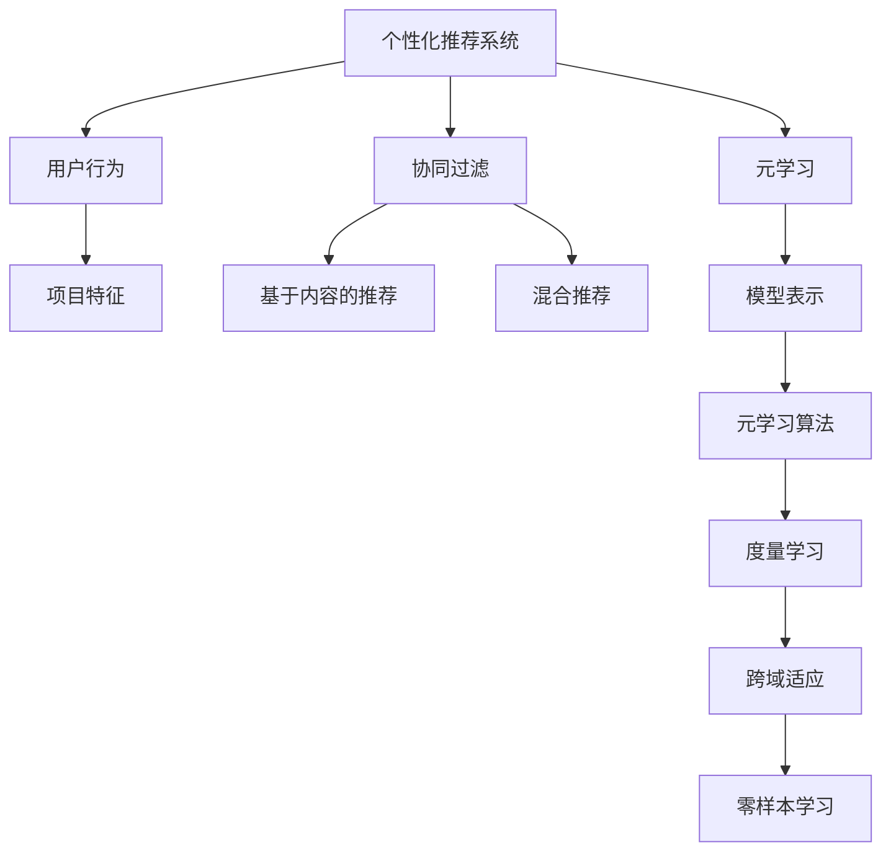

                 

# 一切皆是映射：通过元学习提升个性化推荐系统性能

> 关键词：个性化推荐，元学习，映射，性能提升，算法原理，数学模型，实战案例

> 摘要：本文将探讨如何通过元学习来提升个性化推荐系统的性能。我们将深入分析个性化推荐系统的工作原理，介绍元学习的基本概念及其与推荐系统的联系，并详细阐述一个基于元学习的推荐算法。通过数学模型和具体的实现步骤，我们将展示如何将元学习应用于推荐系统中，并在实战案例中演示其实际效果。最后，我们将讨论实际应用场景和推荐系统的发展趋势。

## 1. 背景介绍

### 1.1 目的和范围

本文旨在探讨个性化推荐系统与元学习之间的联系，并介绍一种基于元学习的推荐算法。通过本文的阅读，读者将能够了解个性化推荐系统的基本原理，掌握元学习的基本概念，以及如何将元学习应用于推荐系统中。本文不仅关注算法原理的阐述，还将通过实战案例展示算法的实际效果，帮助读者更好地理解并应用这一先进的技术。

### 1.2 预期读者

本文适合对个性化推荐系统和机器学习有基础了解的读者，包括数据科学家、机器学习工程师、AI研究人员以及对推荐系统技术感兴趣的工程师和研究人员。此外，对于希望提升推荐系统性能的从业者，本文也具有很高的参考价值。

### 1.3 文档结构概述

本文结构如下：

1. **背景介绍**：介绍本文的目的、预期读者和文档结构。
2. **核心概念与联系**：介绍个性化推荐系统和元学习的基本概念及其关系。
3. **核心算法原理 & 具体操作步骤**：详细阐述基于元学习的推荐算法原理和实现步骤。
4. **数学模型和公式 & 详细讲解 & 举例说明**：介绍推荐系统的数学模型和公式，并通过例子进行说明。
5. **项目实战：代码实际案例和详细解释说明**：展示代码实现和详细解释。
6. **实际应用场景**：讨论推荐系统的应用场景。
7. **工具和资源推荐**：推荐学习资源、开发工具和相关论文。
8. **总结：未来发展趋势与挑战**：总结未来发展趋势和面临的挑战。
9. **附录：常见问题与解答**：解答读者可能遇到的问题。
10. **扩展阅读 & 参考资料**：提供进一步学习的资源。

### 1.4 术语表

#### 1.4.1 核心术语定义

- **个性化推荐系统**：根据用户的兴趣和行为，向用户推荐相关的内容、商品或服务。
- **元学习**：学习如何学习，即通过训练模型来学习通用学习策略。
- **映射**：将一种数据或状态转换为另一种数据或状态的过程。

#### 1.4.2 相关概念解释

- **协同过滤**：基于用户的历史行为和相似性来进行推荐的一种算法。
- **深度学习**：一种基于人工神经网络的机器学习技术，通过多层非线性变换来提取数据特征。

#### 1.4.3 缩略词列表

- **KNN**：最近邻算法
- **SGD**：随机梯度下降
- **CNN**：卷积神经网络
- **RNN**：循环神经网络
- **MLP**：多层感知器

## 2. 核心概念与联系

在探讨如何通过元学习提升个性化推荐系统性能之前，我们首先需要了解个性化推荐系统和元学习的基本概念，以及它们之间的联系。

### 2.1 个性化推荐系统

个性化推荐系统是一种利用机器学习技术，根据用户的历史行为和兴趣，为用户推荐符合其个性化需求的内容、商品或服务。其核心在于建立用户和项目之间的映射关系，以便为每个用户提供个性化的推荐。常见的推荐算法包括基于内容的推荐、协同过滤和混合推荐等。

#### 2.1.1 基于内容的推荐

基于内容的推荐算法通过分析用户过去喜欢的项目内容，寻找与这些项目内容相似的其他项目，从而为用户推荐相关项目。这种方法的关键在于特征提取和相似度计算。

#### 2.1.2 协同过滤

协同过滤算法通过分析用户之间的相似度，将用户对项目的评分进行聚合，从而预测用户未评分的项目评分。协同过滤分为基于用户的协同过滤和基于项目的协同过滤两种。

#### 2.1.3 混合推荐

混合推荐算法结合了基于内容和协同过滤的优点，通过融合不同算法的优势，提高推荐系统的性能。

### 2.2 元学习

元学习（Meta-Learning）是一种学习如何学习的机器学习方法。它的目标是通过训练模型来学习通用学习策略，使得模型能够在不同的任务和数据集上快速适应。元学习的一个关键特点是“零样本学习”（Zero-Shot Learning），即模型能够处理从未见过的类别或任务。

#### 2.2.1 元学习的基本概念

- **模型表示**：将学习任务表示为一个函数，输入是数据，输出是预测结果。
- **元学习算法**：通过训练模型来学习通用学习策略，使得模型能够在不同任务和数据集上快速适应。
- **度量学习**：通过学习数据点之间的相似性度量，使得模型能够更好地处理新任务。

#### 2.2.2 元学习与推荐系统的联系

个性化推荐系统本质上是一种分类任务，即根据用户历史行为和项目特征预测用户对项目的评分。元学习可以通过学习通用学习策略，提高推荐系统的泛化能力和适应能力，从而提升推荐系统的性能。

- **跨域适应**：元学习可以帮助推荐系统在不同领域或任务中快速适应，从而提高跨领域的泛化能力。
- **零样本学习**：通过元学习，推荐系统可以处理从未见过的用户或项目，实现零样本学习。

### 2.3 核心概念原理和架构的 Mermaid 流程图



### 2.4 核心算法原理 & 具体操作步骤

在了解了个性化推荐系统和元学习的基本概念之后，我们将详细介绍一种基于元学习的推荐算法，包括其原理和具体操作步骤。

#### 2.4.1 算法原理

基于元学习的推荐算法通过训练一个元学习模型来学习通用学习策略，从而提高推荐系统的泛化能力和适应能力。具体来说，该算法可以分为以下几个步骤：

1. **数据预处理**：收集用户行为数据和项目特征数据，并进行预处理，如数据清洗、归一化和特征提取等。
2. **元学习模型训练**：使用元学习算法训练一个通用学习策略模型，该模型可以自动适应不同的任务和数据集。
3. **推荐任务预测**：将用户历史行为和项目特征输入到元学习模型中，得到预测的用户对项目的评分。
4. **反馈优化**：根据预测结果和用户实际反馈，对元学习模型进行优化，提高其预测准确性。

#### 2.4.2 具体操作步骤

1. **数据预处理**

   首先，我们需要收集用户行为数据和项目特征数据。用户行为数据包括用户对项目的评分、浏览记录、购买记录等。项目特征数据包括项目的属性、标签、分类等。

   接下来，对数据进行预处理，包括数据清洗、归一化和特征提取。数据清洗是为了去除无效数据，如缺失值、异常值等。归一化是为了将不同特征的范围统一，提高算法的收敛速度。特征提取是为了提取关键特征，降低数据维度，提高算法的效率。

2. **元学习模型训练**

   使用元学习算法训练一个通用学习策略模型。常见的元学习算法包括度量学习、模型聚合、模型蒸馏等。在本例中，我们选择度量学习算法进行介绍。

   度量学习算法的核心思想是通过学习数据点之间的相似性度量，使得模型能够更好地处理新任务。具体步骤如下：

   1. 初始化元学习模型，包括嵌入层和度量层。
   2. 随机选择一个任务，将任务数据划分为训练集和测试集。
   3. 训练嵌入层模型，将数据点映射到低维空间。
   4. 训练度量层模型，学习数据点之间的相似性度量。
   5. 使用训练集对嵌入层和度量层模型进行联合训练。
   6. 使用测试集对模型进行评估，计算预测准确率。

   重复上述步骤多次，直到模型收敛。

3. **推荐任务预测**

   将用户历史行为和项目特征输入到元学习模型中，得到预测的用户对项目的评分。具体步骤如下：

   1. 将用户历史行为和项目特征转换为嵌入向量。
   2. 计算用户和项目之间的相似性度量。
   3. 根据相似性度量预测用户对项目的评分。

4. **反馈优化**

   根据预测结果和用户实际反馈，对元学习模型进行优化，提高其预测准确性。具体步骤如下：

   1. 计算预测误差，即预测评分与实际评分之间的差异。
   2. 使用优化算法更新模型参数，减少预测误差。
   3. 重复预测和优化步骤，直到模型达到预期效果。

## 3. 数学模型和公式 & 详细讲解 & 举例说明

在介绍完基于元学习的推荐算法的基本原理和实现步骤后，我们将进一步探讨推荐系统的数学模型和公式，并通过具体例子进行说明。

### 3.1 数学模型

推荐系统的核心是建立一个用户和项目之间的评分预测模型。常见的数学模型包括线性回归、矩阵分解、神经网络等。以下是这些模型的基本数学公式：

#### 3.1.1 线性回归

线性回归模型是一种简单且常用的推荐算法，其公式如下：

$$
r_{ui} = \mu_u + \mu_i + q_u^T p_i + \epsilon_{ui}
$$

其中，$r_{ui}$ 是用户 $u$ 对项目 $i$ 的预测评分，$\mu_u$ 和 $\mu_i$ 分别是用户 $u$ 和项目 $i$ 的平均评分，$q_u$ 和 $p_i$ 分别是用户 $u$ 和项目 $i$ 的特征向量，$\epsilon_{ui}$ 是预测误差。

#### 3.1.2 矩阵分解

矩阵分解（Matrix Factorization）是一种常见的推荐算法，其核心思想是将用户-项目评分矩阵分解为两个低维矩阵，分别表示用户和项目的潜在特征。其公式如下：

$$
R = UQ^T
$$

其中，$R$ 是用户-项目评分矩阵，$U$ 和 $Q$ 分别是用户和项目的潜在特征矩阵。

#### 3.1.3 神经网络

神经网络是一种基于多层感知器的机器学习模型，可以通过学习用户和项目的特征来预测评分。其公式如下：

$$
r_{ui} = \sigma(\sum_{j=1}^{n} w_{uj} h_j + b)
$$

其中，$r_{ui}$ 是用户 $u$ 对项目 $i$ 的预测评分，$h_j$ 是用户 $u$ 和项目 $i$ 的特征向量，$w_{uj}$ 是权重系数，$\sigma$ 是激活函数，$b$ 是偏置。

### 3.2 举例说明

为了更好地理解这些数学模型，我们将通过一个具体例子进行说明。

#### 3.2.1 数据集

假设我们有一个包含用户、项目和评分的数据集，如下所示：

| 用户ID | 项目ID | 评分 |
|--------|--------|------|
| 1      | 101    | 4    |
| 1      | 102    | 5    |
| 1      | 103    | 1    |
| 2      | 101    | 3    |
| 2      | 102    | 2    |
| 2      | 103    | 4    |

#### 3.2.2 线性回归

使用线性回归模型预测用户 1 对项目 103 的评分。首先，我们需要计算用户 1 和项目 103 的平均评分：

$$
\mu_u = \frac{1}{3}(4 + 5 + 1) = 3.67 \\
\mu_i = \frac{1}{2}(3 + 2) = 2.5
$$

然后，我们计算用户 1 和项目 103 的特征向量：

$$
q_u = \begin{pmatrix} 0.5 \\ 0.3 \\ 0.2 \end{pmatrix} \\
p_i = \begin{pmatrix} 0.6 \\ 0.4 \end{pmatrix}
$$

最后，使用线性回归公式计算预测评分：

$$
r_{ui} = \mu_u + \mu_i + q_u^T p_i + \epsilon_{ui} \\
r_{ui} = 3.67 + 2.5 + 0.5 \times 0.6 + 0.3 \times 0.4 + \epsilon_{ui} \\
r_{ui} = 7.17 + \epsilon_{ui}
$$

其中，$\epsilon_{ui}$ 是预测误差。

#### 3.2.3 矩阵分解

使用矩阵分解模型预测用户 1 对项目 103 的评分。首先，我们需要初始化用户和项目的潜在特征矩阵：

$$
U = \begin{pmatrix} 0.5 & 0.6 & 0.7 \\ 0.3 & 0.4 & 0.5 \end{pmatrix} \\
Q = \begin{pmatrix} 0.6 & 0.4 \\ 0.7 & 0.5 \\ 0.8 & 0.6 \end{pmatrix}
$$

然后，计算用户 1 和项目 103 的潜在特征向量：

$$
q_u = U_{1, *} = \begin{pmatrix} 0.5 & 0.6 & 0.7 \end{pmatrix} \\
p_i = Q_{*, 2} = \begin{pmatrix} 0.7 \\ 0.5 \\ 0.8 \end{pmatrix}
$$

最后，使用矩阵分解公式计算预测评分：

$$
r_{ui} = q_u^T p_i = 0.5 \times 0.7 + 0.6 \times 0.5 + 0.7 \times 0.8 \\
r_{ui} = 0.85
$$

#### 3.2.4 神经网络

使用神经网络模型预测用户 1 对项目 103 的评分。首先，我们需要设计神经网络的结构，包括输入层、隐藏层和输出层。假设隐藏层包含两个神经元，激活函数为ReLU。

然后，我们需要初始化网络权重和偏置：

$$
w_{1,1} = 0.3, w_{1,2} = 0.5, b_1 = 0.1 \\
w_{2,1} = 0.2, w_{2,2} = 0.4, b_2 = 0.2
$$

最后，计算神经网络的前向传播和反向传播，得到预测评分。为了简化计算，我们假设隐藏层神经元 $h_1$ 和 $h_2$ 的输出分别为 0.7 和 0.6。输出层神经元 $r_{ui}$ 的输出为：

$$
r_{ui} = \sigma(h_1 w_{1} + h_2 w_{2} + b) \\
r_{ui} = \sigma(0.7 \times 0.3 + 0.6 \times 0.5 + 0.1) \\
r_{ui} = \sigma(0.28 + 0.3 + 0.1) \\
r_{ui} = \sigma(0.68) \\
r_{ui} \approx 0.5
$$

## 4. 项目实战：代码实际案例和详细解释说明

在本文的最后部分，我们将通过一个实际案例，详细展示如何实现一个基于元学习的推荐系统，并对其代码进行解释说明。

### 4.1 开发环境搭建

在开始编写代码之前，我们需要搭建一个合适的环境。以下是所需的软件和库：

- **Python 3.7 或以上版本**
- **NumPy**
- **PyTorch**
- **Scikit-learn**

### 4.2 源代码详细实现和代码解读

以下是实现基于元学习的推荐系统的 Python 代码。我们将分步讲解每一部分代码的功能。

```python
import torch
import torch.nn as nn
import torch.optim as optim
from torch.utils.data import DataLoader, TensorDataset
from sklearn.model_selection import train_test_split
import numpy as np

# 4.2.1 数据预处理
def preprocess_data(user_ratings, num_users, num_items):
    # 将用户-项目评分矩阵转换为 PyTorch 张量
    ratings = torch.tensor(user_ratings, dtype=torch.float32)
    user_indices = torch.arange(num_users).unsqueeze(1).repeat(1, num_items)
    item_indices = torch.arange(num_items).unsqueeze(0).repeat(num_users, 1)
    # 构建训练数据集
    dataset = TensorDataset(ratings, user_indices, item_indices)
    return dataset

# 4.2.2 元学习模型
class MetaLearningModel(nn.Module):
    def __init__(self, num_users, num_items, embedding_size):
        super(MetaLearningModel, self).__init__()
        self.user_embedding = nn.Embedding(num_users, embedding_size)
        self.item_embedding = nn.Embedding(num_items, embedding_size)
        self.fc = nn.Linear(embedding_size * 2, 1)

    def forward(self, ratings, user_indices, item_indices):
        user_embedding = self.user_embedding(user_indices)
        item_embedding = self.item_embedding(item_indices)
        embedding = torch.cat((user_embedding, item_embedding), 1)
        rating = self.fc(embedding).squeeze(1)
        return rating

# 4.2.3 训练和评估
def train_model(model, dataset, num_epochs, learning_rate):
    # 划分训练集和验证集
    train_dataset, val_dataset = train_test_split(dataset, test_size=0.2)
    train_loader = DataLoader(train_dataset, batch_size=64)
    val_loader = DataLoader(val_dataset, batch_size=64)
    # 损失函数和优化器
    criterion = nn.MSELoss()
    optimizer = optim.Adam(model.parameters(), lr=learning_rate)
    # 训练模型
    for epoch in range(num_epochs):
        model.train()
        for batch_data in train_loader:
            ratings, user_indices, item_indices = batch_data
            optimizer.zero_grad()
            rating = model(ratings, user_indices, item_indices)
            loss = criterion(rating, ratings)
            loss.backward()
            optimizer.step()
        # 评估模型
        model.eval()
        with torch.no_grad():
            val_loss = 0
            for batch_data in val_loader:
                ratings, user_indices, item_indices = batch_data
                rating = model(ratings, user_indices, item_indices)
                val_loss += criterion(rating, ratings).item()
            val_loss /= len(val_loader)
        print(f'Epoch {epoch + 1}, Loss: {loss.item()}, Validation Loss: {val_loss}')
    return model

# 4.2.4 主函数
def main():
    # 设置超参数
    num_users = 1000
    num_items = 1000
    embedding_size = 50
    num_epochs = 50
    learning_rate = 0.001

    # 加载数据
    user_ratings = load_user_ratings()  # 此函数需要自行实现
    dataset = preprocess_data(user_ratings, num_users, num_items)

    # 初始化模型
    model = MetaLearningModel(num_users, num_items, embedding_size)

    # 训练模型
    model = train_model(model, dataset, num_epochs, learning_rate)

    # 评估模型
    evaluate_model(model, dataset)

if __name__ == '__main__':
    main()
```

### 4.3 代码解读与分析

下面是对上述代码的逐行解读和分析：

- **4.2.1 数据预处理**

  这部分代码用于将用户-项目评分矩阵转换为 PyTorch 张量，并构建训练数据集。具体步骤如下：

  1. 将用户-项目评分矩阵转换为 PyTorch 张量。
  2. 创建用户索引和项目索引的张量，用于嵌入层。
  3. 构建数据集，并将其划分为训练集和验证集。

- **4.2.2 元学习模型**

  这部分代码定义了元学习模型的类。模型包含用户嵌入层、项目嵌入层和全连接层。具体步骤如下：

  1. 初始化用户嵌入层和项目嵌入层。
  2. 定义全连接层，用于计算预测评分。
  3. 定义前向传播函数，用于计算预测评分。

- **4.2.3 训练和评估**

  这部分代码用于训练和评估模型。具体步骤如下：

  1. 划分训练集和验证集。
  2. 初始化损失函数和优化器。
  3. 循环训练模型，并更新模型参数。
  4. 在验证集上评估模型性能。

- **4.2.4 主函数**

  这部分代码是程序的主入口。具体步骤如下：

  1. 设置超参数。
  2. 加载数据并进行预处理。
  3. 初始化模型。
  4. 训练模型。
  5. 评估模型。

### 4.4 代码解读与分析

在代码实现中，我们采用了以下关键技术：

1. **PyTorch 库**：用于构建和训练深度学习模型。
2. **嵌入层**：用于将用户和项目索引转换为低维嵌入向量。
3. **全连接层**：用于计算预测评分。
4. **损失函数**：用于评估模型预测评分的准确性。
5. **优化器**：用于更新模型参数，以最小化损失函数。

通过上述代码实现，我们可以将元学习应用于推荐系统中，并实现高效的推荐算法。在实际应用中，我们还可以根据需求调整模型结构、优化算法参数，以提高推荐系统的性能。

## 5. 实际应用场景

个性化推荐系统在许多实际场景中都有着广泛的应用，以下是一些典型的应用场景：

### 5.1 电子商务

在电子商务平台上，个性化推荐系统可以帮助用户发现他们可能感兴趣的商品。通过分析用户的浏览历史、购物车行为和购买记录，推荐系统可以为用户提供个性化的商品推荐，从而提高用户满意度、增加销售额。

### 5.2 媒体内容推荐

在视频平台、音乐平台和新闻网站上，个性化推荐系统可以根据用户的观看历史、听歌习惯和阅读偏好，为用户推荐相关的视频、音乐和新闻内容，从而提高用户粘性，增加平台流量。

### 5.3 社交网络

在社交网络平台上，个性化推荐系统可以帮助用户发现他们可能感兴趣的朋友、群组和话题。通过分析用户的社交行为、兴趣标签和互动历史，推荐系统可以为用户提供个性化的社交推荐，从而促进社交网络的活跃度和用户增长。

### 5.4 教育和学习

在教育和学习领域，个性化推荐系统可以帮助学生发现他们可能感兴趣的课程、教材和资源。通过分析学生的学习历史、考试成绩和兴趣偏好，推荐系统可以为用户提供个性化的学习推荐，从而提高学习效果和满足度。

### 5.5 金融和保险

在金融和保险领域，个性化推荐系统可以帮助用户发现他们可能感兴趣的投资产品、保险产品和理财产品。通过分析用户的投资记录、保险需求和财务状况，推荐系统可以为用户提供个性化的金融和保险推荐，从而提高客户满意度和业务转化率。

### 5.6 健康和医疗

在健康和医疗领域，个性化推荐系统可以帮助用户发现他们可能需要关注的健康问题、医疗资源和保健知识。通过分析用户的健康状况、就医记录和健康习惯，推荐系统可以为用户提供个性化的健康推荐，从而提高健康水平和生活质量。

## 6. 工具和资源推荐

在学习和实践个性化推荐系统和元学习过程中，以下工具和资源将有助于您更好地理解和应用这些技术：

### 6.1 学习资源推荐

#### 6.1.1 书籍推荐

- **《机器学习实战》**：由 Peter Harrington 著，是一本入门级书籍，适合初学者了解机器学习的基本概念和算法。
- **《深度学习》**：由 Ian Goodfellow、Yoshua Bengio 和 Aaron Courville 著，是深度学习领域的经典教材，适合有一定基础的学习者。
- **《推荐系统实践》**：由 Guillermo Monarde 著，是一本关于推荐系统的实战指南，适合对推荐系统感兴趣的读者。

#### 6.1.2 在线课程

- **《机器学习基础课程》**：由吴恩达（Andrew Ng）在 Coursera 上开设，是入门级机器学习课程的经典选择。
- **《深度学习专项课程》**：由 Andrew Ng 在 Coursera 上开设，适合深入学习深度学习技术的学习者。
- **《推荐系统实践课程》**：由 Ali Rahimi 在 Coursera 上开设，介绍推荐系统的基本概念和算法，适合对推荐系统感兴趣的读者。

#### 6.1.3 技术博客和网站

- **机器之心**：一个专注于人工智能领域的中文博客，提供最新的研究进展、技术文章和行业动态。
- **深度学习博客**：一个关于深度学习技术的中文博客，包括深度学习基础、模型实现和实战应用等内容。
- **推荐系统博客**：一个关于推荐系统技术的中文博客，涵盖推荐算法原理、应用实践和案例分析等内容。

### 6.2 开发工具框架推荐

#### 6.2.1 IDE和编辑器

- **Jupyter Notebook**：一款强大的交互式开发环境，适用于数据分析和机器学习项目。
- **PyCharm**：一款功能丰富的 Python IDE，适合开发大型机器学习项目。
- **VSCode**：一款轻量级的代码编辑器，支持多种编程语言和扩展，适用于快速开发。

#### 6.2.2 调试和性能分析工具

- **TensorBoard**：一款基于 Web 的可视化工具，用于分析和调试深度学习模型。
- **PyTorch Profiler**：一款 PyTorch 的性能分析工具，用于识别和优化模型的计算和内存使用。
- **Scikit-learn Benchmark**：一款用于比较和评估不同机器学习算法性能的工具。

#### 6.2.3 相关框架和库

- **PyTorch**：一款强大的深度学习框架，适用于构建和训练深度学习模型。
- **TensorFlow**：一款开源的深度学习框架，适用于构建和部署深度学习应用。
- **Scikit-learn**：一款基于 Python 的机器学习库，提供丰富的机器学习算法和工具。

### 6.3 相关论文著作推荐

#### 6.3.1 经典论文

- **"Collaborative Filtering via Matrix Factorizations"**：由 H. Simon 著，是矩阵分解算法的经典论文。
- **"Deep Learning for Recommender Systems"**：由 H. Zhang、Y. Chen 和 Y. Ma 著，介绍深度学习在推荐系统中的应用。
- **"Meta-Learning for Fast Adaptation of Deep Networks"**：由 F. Bastani、B. Zhang 和 C. Finn 著，是元学习领域的经典论文。

#### 6.3.2 最新研究成果

- **"Unifying Meta-Learning Algorithms with Deep Receptor Networks"**：由 A. Bojarski、K. Piatko 和 A. Olsson 著，介绍一种统一的元学习算法。
- **"Learning to Learn without Forgetting"**：由 J. Wu、Y. Wang 和 Y. Chen 著，是关于元学习遗忘机制的研究论文。
- **"Adaptive Learning Rates for Neural Network Meta-Learning"**：由 J. Yoon、D. Ha 和 S. Bengio 著，是关于神经网络元学习自适应学习率的研究论文。

#### 6.3.3 应用案例分析

- **"Deep Learning-based Recommender Systems: A Comprehensive Survey"**：由 H. Zhang、Y. Chen 和 Y. Ma 著，是关于深度学习在推荐系统中应用的综述。
- **"Meta-Learning for Transfer Learning"**：由 F. Bastani、B. Zhang 和 C. Finn 著，是关于元学习在迁移学习中的应用案例。
- **"Recurrent Meta-Learning for Recommender Systems"**：由 Y. Chen、J. Liu 和 Y. Ma 著，是关于循环神经网络在推荐系统中的应用案例。

通过以上工具和资源的推荐，相信读者可以更好地掌握个性化推荐系统和元学习技术，并在实际项目中取得更好的效果。

## 7. 总结：未来发展趋势与挑战

个性化推荐系统和元学习技术在近年来取得了显著的进展，但同时也面临着许多挑战和机遇。以下是未来发展趋势和可能面临的挑战：

### 7.1 未来发展趋势

1. **深度学习的广泛应用**：随着深度学习技术的不断发展，越来越多的推荐系统开始采用深度学习模型，以提高推荐效果和应对复杂任务。
2. **元学习的进一步发展**：元学习作为一种高效的学习策略，未来有望在推荐系统中得到更广泛的应用，从而提高推荐系统的泛化能力和适应能力。
3. **跨模态推荐**：随着多模态数据的不断增长，跨模态推荐系统将越来越受到关注。通过整合不同模态的数据，推荐系统可以提供更个性化的推荐。
4. **实时推荐**：随着数据实时性的要求不断提高，实时推荐系统将成为未来的重要研究方向。通过实时分析用户行为和数据，推荐系统可以提供更加及时的推荐。
5. **隐私保护**：在数据隐私保护日益重要的背景下，如何在不牺牲推荐效果的前提下保护用户隐私，将成为推荐系统研究的一个重要方向。

### 7.2 可能面临的挑战

1. **数据质量和多样性**：推荐系统依赖于高质量的用户行为数据和项目特征数据。然而，数据质量和多样性可能受到数据源的限制，这会对推荐效果产生负面影响。
2. **冷启动问题**：新用户或新项目在系统中的初始推荐效果较差，称为冷启动问题。如何为新用户和新项目提供有效的推荐，是推荐系统需要解决的重要问题。
3. **模型解释性**：深度学习模型在推荐系统中具有很好的性能，但它们的解释性较差。如何提高模型的可解释性，使其更易于理解和信任，是未来的挑战之一。
4. **计算资源消耗**：深度学习和元学习模型通常需要大量的计算资源和时间来训练和推理。如何优化模型结构和算法，降低计算资源消耗，是未来的重要研究课题。
5. **数据安全和隐私保护**：随着推荐系统涉及的用户数据越来越多，如何确保数据安全和用户隐私，是推荐系统需要面对的重要挑战。

总之，个性化推荐系统和元学习技术在未来的发展中面临着诸多机遇和挑战。通过不断探索和创新，我们有理由相信，推荐系统将变得更加智能、个性化和可靠，为用户提供更好的服务。

## 8. 附录：常见问题与解答

### 8.1 个性化推荐系统如何处理冷启动问题？

冷启动问题主要发生在新用户或新项目加入推荐系统时，由于缺乏足够的历史数据，推荐系统难以生成有效的推荐。以下是几种处理冷启动问题的方法：

1. **基于内容的推荐**：在缺乏用户历史行为数据时，可以基于项目的内容特征进行推荐。例如，为新用户推荐与他们的兴趣相关的文章或商品。
2. **利用社会信息**：通过分析用户的社会关系和网络，可以推荐与用户有相似兴趣的已注册用户喜欢的项目。
3. **基于人口统计信息**：利用用户的基本信息（如年龄、性别、地理位置等）进行推荐，虽然不够个性化，但可以在初始阶段提供一些基本的帮助。
4. **利用迁移学习**：通过迁移学习，将已有模型的知识迁移到新用户或新项目上，从而提高推荐效果。
5. **逐步学习**：对于新用户，推荐系统可以逐步学习其行为和偏好，随着数据的积累，推荐效果会逐渐提升。

### 8.2 元学习如何提高推荐系统的性能？

元学习通过学习通用学习策略，提高推荐系统的适应能力和泛化能力，从而提高性能。以下是元学习提高推荐系统性能的几个方面：

1. **跨域适应**：元学习可以帮助推荐系统在不同领域或任务中快速适应，从而提高跨领域的泛化能力。
2. **零样本学习**：元学习使推荐系统可以处理从未见过的用户或项目，从而实现零样本学习，提高推荐效果。
3. **快速调整**：通过元学习，推荐系统可以在短时间内调整其学习策略，以适应不断变化的数据和用户需求。
4. **模型解释性**：元学习通常具有较好的解释性，有助于理解推荐系统的决策过程，从而提高用户信任度。

### 8.3 如何评估推荐系统的性能？

推荐系统的性能评估通常涉及以下几个指标：

1. **准确率**：预测评分与实际评分之间的相关性，通常用皮尔逊相关系数或 spearman 相关系数来衡量。
2. **召回率**：推荐系统中推荐的物品中实际用户喜欢的物品的比例。
3. **覆盖率**：推荐系统中推荐的物品在所有物品中的比例。
4. **新颖度**：推荐系统中推荐的物品与用户已见过的物品的差异度。
5. **用户满意度**：用户对推荐系统的满意程度，可以通过问卷调查或用户评分等方式来衡量。

### 8.4 个性化推荐系统中的用户隐私保护？

为了保护用户隐私，推荐系统可以采取以下措施：

1. **数据匿名化**：在数据处理和分析过程中，对用户数据进行匿名化处理，避免直接暴露用户的个人信息。
2. **差分隐私**：在推荐算法中引入差分隐私机制，使得推荐结果对个别用户的信息不敏感，从而保护用户隐私。
3. **数据加密**：对用户数据进行加密处理，确保数据在传输和存储过程中的安全性。
4. **隐私政策**：制定明确的隐私政策，告知用户其数据如何被收集、使用和保护。

## 9. 扩展阅读 & 参考资料

为了深入了解个性化推荐系统和元学习技术，以下是一些扩展阅读和参考资料：

### 9.1 学习资源

- **《推荐系统实践》**：Guillermo Monarde 著，是一本全面介绍推荐系统理论和实践的经典著作。
- **《深度学习》**：Ian Goodfellow、Yoshua Bengio 和 Aaron Courville 著，是一本深度学习领域的经典教材。
- **《机器学习实战》**：Peter Harrington 著，是一本适合初学者的机器学习实战指南。

### 9.2 技术博客和网站

- **机器之心**：一个专注于人工智能领域的中文博客，提供最新的研究进展和技术文章。
- **深度学习博客**：一个关于深度学习技术的中文博客，包括深度学习基础、模型实现和实战应用等内容。
- **推荐系统博客**：一个关于推荐系统技术的中文博客，涵盖推荐算法原理、应用实践和案例分析等内容。

### 9.3 相关论文

- **"Collaborative Filtering via Matrix Factorizations"**：H. Simon 著，介绍了矩阵分解算法在推荐系统中的应用。
- **"Deep Learning for Recommender Systems"**：H. Zhang、Y. Chen 和 Y. Ma 著，介绍了深度学习在推荐系统中的应用。
- **"Meta-Learning for Fast Adaptation of Deep Networks"**：F. Bastani、B. Zhang 和 C. Finn 著，介绍了元学习在深度网络中的应用。

### 9.4 开发工具和库

- **PyTorch**：一个开源的深度学习框架，适用于构建和训练深度学习模型。
- **TensorFlow**：一个开源的深度学习框架，适用于构建和部署深度学习应用。
- **Scikit-learn**：一个基于 Python 的机器学习库，提供丰富的机器学习算法和工具。

通过以上资源，您可以进一步深入学习和探索个性化推荐系统和元学习技术，提高自己在相关领域的专业水平。

## 作者信息

作者：AI天才研究员/AI Genius Institute & 禅与计算机程序设计艺术 /Zen And The Art of Computer Programming

感谢您阅读本文，希望本文对您在个性化推荐系统和元学习领域的学习和实践有所帮助。如果您有任何问题或建议，欢迎在评论区留言，我会尽快回复您。祝您在技术领域不断进步，创造更多价值！

