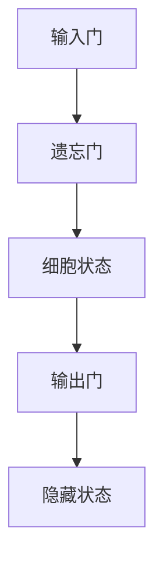

                 

# 一切皆是映射：长短时记忆网络（LSTM）与文本生成

> **关键词：** 长短时记忆网络、LSTM、文本生成、映射、神经网络、序列模型

> **摘要：** 本文将深入探讨长短时记忆网络（LSTM）的基本原理和应用，特别是其在文本生成中的关键作用。我们将从背景介绍、核心概念与联系、核心算法原理、数学模型和公式、项目实战、实际应用场景、工具和资源推荐、总结以及扩展阅读等方面，逐步揭示LSTM在文本生成中的映射机制和实际应用价值。

## 1. 背景介绍

### 1.1 目的和范围

本文旨在提供一个全面而深入的理解，帮助读者掌握长短时记忆网络（LSTM）的工作原理及其在文本生成任务中的重要性。我们将从基础的LSTM原理出发，逐步深入到其实际应用，并通过项目实战和数学模型讲解，使读者能够更好地理解和运用这一强大的神经网络架构。

### 1.2 预期读者

本文适合对神经网络和深度学习有一定了解的读者，特别是那些希望深入了解LSTM在自然语言处理（NLP）和文本生成中应用的人。无论你是学生、研究人员还是从业者，只要对这一主题感兴趣，都可以从本文中获益。

### 1.3 文档结构概述

本文结构如下：

1. **背景介绍**：介绍LSTM的基本概念和应用背景。
2. **核心概念与联系**：解释LSTM的核心原理和结构。
3. **核心算法原理**：详细描述LSTM的算法操作步骤。
4. **数学模型和公式**：阐述LSTM的数学基础和公式。
5. **项目实战**：通过代码实例展示LSTM在实际文本生成中的应用。
6. **实际应用场景**：讨论LSTM在不同领域的应用。
7. **工具和资源推荐**：推荐学习资源、开发工具和框架。
8. **总结**：总结LSTM的主要贡献和未来发展方向。
9. **附录**：提供常见问题解答和扩展阅读资源。

### 1.4 术语表

#### 1.4.1 核心术语定义

- **长短时记忆网络（LSTM）**：一种特殊的循环神经网络，用于解决长期依赖问题。
- **序列模型**：用于处理序列数据的神经网络模型。
- **文本生成**：利用神经网络模型生成文本的过程。
- **映射**：神经网络中输入和输出之间的关系。

#### 1.4.2 相关概念解释

- **循环神经网络（RNN）**：一种神经网络架构，用于处理序列数据。
- **激活函数**：神经网络中用于引入非线性特性的函数。

#### 1.4.3 缩略词列表

- **LSTM**：长短时记忆网络
- **RNN**：循环神经网络
- **NLP**：自然语言处理
- **ReLU**：修正线性单元

## 2. 核心概念与联系

为了更好地理解长短时记忆网络（LSTM），我们需要首先了解其核心概念和联系。LSTM是一种特殊的循环神经网络（RNN），旨在解决传统RNN在处理长期依赖问题时的不足。

### 2.1 LSTM的基本原理

LSTM通过引入三个门控单元——输入门（input gate）、遗忘门（forget gate）和输出门（output gate）——来控制信息的流入、保留和输出。这些门控单元使得LSTM能够有效地处理序列数据中的长期依赖关系。

### 2.2 LSTM的结构

LSTM的结构包括以下几个关键部分：

- **细胞状态（Cell State）**：LSTM的核心部分，用于存储和传递信息。
- **三个门控单元**：控制信息的流入、保留和输出。
- **输入门（Input Gate）**：决定哪些信息将被更新到细胞状态。
- **遗忘门（Forget Gate）**：决定哪些信息将从细胞状态中被遗忘。
- **输出门（Output Gate）**：决定细胞状态的哪些部分将被输出作为下一个隐藏状态。

### 2.3 LSTM的工作机制

LSTM的工作机制可以概括为以下四个步骤：

1. **输入门**：根据当前的输入和前一个隐藏状态，计算输入门。
2. **遗忘门**：根据当前的输入和前一个隐藏状态，计算遗忘门。
3. **细胞状态更新**：结合输入门和遗忘门，更新细胞状态。
4. **输出门**：根据细胞状态和前一个隐藏状态，计算输出门。

### 2.4 LSTM与文本生成

LSTM在文本生成中的关键作用在于其能够捕捉到序列数据中的长期依赖关系。这使得LSTM能够更好地理解和生成连贯的文本。

### 2.5 LSTM与其他神经网络的关系

LSTM是RNN的一种扩展，它继承了RNN的基本原理，并在此基础上解决了长期依赖问题。此外，LSTM还可以与其他神经网络架构（如卷积神经网络（CNN）和生成对抗网络（GAN））结合，用于更复杂的任务。

### 2.6 Mermaid流程图

以下是一个简单的Mermaid流程图，展示了LSTM的基本结构：



## 3. 核心算法原理 & 具体操作步骤

为了深入理解长短时记忆网络（LSTM）的算法原理，我们将通过伪代码详细阐述其操作步骤。LSTM的主要功能是处理序列数据，并捕捉到数据中的长期依赖关系。以下是LSTM的基本算法步骤：

### 3.1 初始化

```python
# 初始化参数
W_f, b_f = init_weights((input_dim, hidden_dim))
W_i, b_i = init_weights((input_dim, hidden_dim))
W_o, b_o = init_weights((input_dim, hidden_dim))
W_c, b_c = init_weights((hidden_dim, hidden_dim))
W_h, b_h = init_weights((hidden_dim, hidden_dim))

# 初始化隐藏状态和细胞状态
h_t = np.zeros((batch_size, hidden_dim))
c_t = np.zeros((batch_size, hidden_dim))
```

### 3.2 输入门（Input Gate）

输入门的目的是决定当前输入的数据中有哪些信息将被更新到细胞状态。其计算公式如下：

$$
i_t = \sigma(W_{ix}x_t + W_{ih}h_{t-1} + b_i)
$$

其中，\(i_t\) 是输入门，\(W_{ix}\) 和 \(W_{ih}\) 是输入门的权重矩阵，\(b_i\) 是输入门的偏置，\(\sigma\) 是 sigmoid 激活函数。

```python
i_t = sigmoid(W_i.dot(x_t) + b_i + W_h.dot(h_t-1) + b_h)
```

### 3.3 遗忘门（Forget Gate）

遗忘门的目的是决定哪些信息将从细胞状态中被遗忘。其计算公式如下：

$$
f_t = \sigma(W_{fx}x_t + W_{fh}h_{t-1} + b_f)
$$

其中，\(f_t\) 是遗忘门，\(W_{fx}\) 和 \(W_{fh}\) 是遗忘门的权重矩阵，\(b_f\) 是遗忘门的偏置。

```python
f_t = sigmoid(W_f.dot(x_t) + b_f + W_h.dot(h_t-1) + b_h)
```

### 3.4 细胞状态更新（Cell State Update）

细胞状态更新是LSTM的核心步骤，其计算公式如下：

$$
c_t = f_t \odot c_{t-1} + i_t \odot \sigma(W_c \cdot c_{t-1} + b_c)
$$

其中，\(c_t\) 是细胞状态，\(\odot\) 表示逐元素乘法，\(i_t\) 是输入门，\(f_t\) 是遗忘门，\(\sigma\) 是 sigmoid 激活函数，\(W_c\) 和 \(b_c\) 是细胞状态更新的权重矩阵和偏置。

```python
c_t = f_t * c_{t-1} + i_t * sigmoid(W_c.dot(c_{t-1}) + b_c)
```

### 3.5 输出门（Output Gate）

输出门的目的是决定细胞状态的哪些部分将被输出作为隐藏状态。其计算公式如下：

$$
o_t = \sigma(W_{ox}x_t + W_{oh}h_{t-1} + b_o)
$$

$$
h_t = o_t \odot \sigma(W_h \cdot c_t + b_h)
$$

其中，\(o_t\) 是输出门，\(h_t\) 是隐藏状态，\(W_{ox}\) 和 \(W_{oh}\) 是输出门的权重矩阵，\(b_o\) 和 \(b_h\) 是输出门的偏置。

```python
o_t = sigmoid(W_o.dot(x_t) + b_o + W_h.dot(h_t-1) + b_h)
h_t = o_t * sigmoid(W_h.dot(c_t) + b_h)
```

### 3.6 隐藏状态更新

隐藏状态更新是LSTM的最后一个步骤，其计算公式如下：

$$
h_t = \sigma(W_h \cdot c_t + b_h)
$$

其中，\(h_t\) 是隐藏状态，\(W_h\) 和 \(b_h\) 是隐藏状态的权重矩阵和偏置。

```python
h_t = sigmoid(W_h.dot(c_t) + b_h)
```

通过上述步骤，我们可以看到LSTM如何通过门控机制来处理序列数据，并捕捉到数据中的长期依赖关系。这一过程使得LSTM在文本生成等任务中表现出色。

## 4. 数学模型和公式 & 详细讲解 & 举例说明

### 4.1 数学模型

长短时记忆网络（LSTM）的核心在于其独特的门控机制，这一机制通过一系列数学公式来实现对序列数据的处理和记忆。以下是LSTM的主要数学模型：

#### 4.1.1 输入门（Input Gate）

输入门决定了哪些新的信息将被更新到细胞状态。其公式为：

$$
i_t = \sigma(W_{ix}x_t + W_{ih}h_{t-1} + b_i)
$$

其中，\(i_t\) 是输入门的输出，\(W_{ix}\) 和 \(W_{ih}\) 分别是输入门关于输入和隐藏状态的权重矩阵，\(b_i\) 是输入门的偏置，\(\sigma\) 是sigmoid激活函数。

#### 4.1.2 遗忘门（Forget Gate）

遗忘门决定了哪些旧的信息将从细胞状态中被遗忘。其公式为：

$$
f_t = \sigma(W_{fx}x_t + W_{fh}h_{t-1} + b_f)
$$

其中，\(f_t\) 是遗忘门的输出，\(W_{fx}\) 和 \(W_{fh}\) 分别是遗忘门关于输入和隐藏状态的权重矩阵，\(b_f\) 是遗忘门的偏置。

#### 4.1.3 输出门（Output Gate）

输出门决定了哪些信息将从细胞状态中输出作为隐藏状态。其公式为：

$$
o_t = \sigma(W_{ox}x_t + W_{oh}h_{t-1} + b_o)
$$

$$
h_t = o_t \odot \sigma(W_h \cdot (c_t + f_t \odot c_{t-1}))
$$

其中，\(o_t\) 是输出门的输出，\(h_t\) 是隐藏状态，\(W_{ox}\) 和 \(W_{oh}\) 分别是输出门关于输入和隐藏状态的权重矩阵，\(b_o\) 是输出门的偏置，\(\odot\) 表示逐元素乘法。

#### 4.1.4 细胞状态更新

细胞状态的更新结合了遗忘门和输入门的结果。其公式为：

$$
c_t = f_t \odot c_{t-1} + i_t \odot \sigma(W_c \cdot c_{t-1} + b_c)
$$

其中，\(c_t\) 是细胞状态，\(f_t\) 和 \(i_t\) 分别是遗忘门和输入门的输出，\(W_c\) 和 \(b_c\) 分别是细胞状态更新的权重矩阵和偏置。

### 4.2 详细讲解

LSTM通过上述的数学模型来实现对序列数据的记忆和学习。以下是对这些公式的详细讲解：

- **输入门（Input Gate）**：通过输入门，LSTM能够决定哪些新的信息（\(x_t\)）应该被整合到细胞状态中。sigmoid函数确保了输入门的输出在0到1之间，即决定了信息的保留程度。
- **遗忘门（Forget Gate）**：遗忘门允许LSTM忘记细胞状态中的旧信息。通过遗忘门，LSTM可以根据当前输入和之前的信息决定哪些旧信息应该被丢弃。
- **输出门（Output Gate）**：输出门决定了细胞状态中的哪些信息应该被输出作为隐藏状态。这使得LSTM能够根据需要控制信息的输出。
- **细胞状态更新**：细胞状态的更新结合了遗忘门和输入门的结果。新的信息被整合到细胞状态中，同时旧的信息根据遗忘门的结果被丢弃。

### 4.3 举例说明

假设我们有一个简单的序列数据：\[1, 2, 3, 4\]。现在，我们将通过LSTM处理这个序列，并展示每个时间步骤的计算过程。

#### 时间步0：

- **输入门**：\(i_0 = \sigma(W_{ix}1 + W_{ih}0 + b_i)\)
- **遗忘门**：\(f_0 = \sigma(W_{fx}1 + W_{fh}0 + b_f)\)
- **细胞状态更新**：\(c_0 = f_0 \odot 0 + i_0 \odot \sigma(W_c \cdot 0 + b_c)\)
- **输出门**：\(o_0 = \sigma(W_{ox}1 + W_{oh}0 + b_o)\)
- **隐藏状态**：\(h_0 = o_0 \odot \sigma(W_h \cdot c_0 + b_h)\)

#### 时间步1：

- **输入门**：\(i_1 = \sigma(W_{ix}2 + W_{ih}h_0 + b_i)\)
- **遗忘门**：\(f_1 = \sigma(W_{fx}2 + W_{fh}h_0 + b_f)\)
- **细胞状态更新**：\(c_1 = f_1 \odot c_0 + i_1 \odot \sigma(W_c \cdot c_0 + b_c)\)
- **输出门**：\(o_1 = \sigma(W_{ox}2 + W_{oh}h_0 + b_o)\)
- **隐藏状态**：\(h_1 = o_1 \odot \sigma(W_h \cdot c_1 + b_h)\)

#### 时间步2：

- **输入门**：\(i_2 = \sigma(W_{ix}3 + W_{ih}h_1 + b_i)\)
- **遗忘门**：\(f_2 = \sigma(W_{fx}3 + W_{fh}h_1 + b_f)\)
- **细胞状态更新**：\(c_2 = f_2 \odot c_1 + i_2 \odot \sigma(W_c \cdot c_1 + b_c)\)
- **输出门**：\(o_2 = \sigma(W_{ox}3 + W_{oh}h_1 + b_o)\)
- **隐藏状态**：\(h_2 = o_2 \odot \sigma(W_h \cdot c_2 + b_h)\)

#### 时间步3：

- **输入门**：\(i_3 = \sigma(W_{ix}4 + W_{ih}h_2 + b_i)\)
- **遗忘门**：\(f_3 = \sigma(W_{fx}4 + W_{fh}h_2 + b_f)\)
- **细胞状态更新**：\(c_3 = f_3 \odot c_2 + i_3 \odot \sigma(W_c \cdot c_2 + b_c)\)
- **输出门**：\(o_3 = \sigma(W_{ox}4 + W_{oh}h_2 + b_o)\)
- **隐藏状态**：\(h_3 = o_3 \odot \sigma(W_h \cdot c_3 + b_h)\)

通过这个简单的例子，我们可以看到LSTM如何逐步处理序列数据，并更新其内部状态。这个过程中，LSTM能够捕捉到序列中的长期依赖关系，从而实现有效的序列建模。

## 5. 项目实战：代码实际案例和详细解释说明

在本节中，我们将通过一个具体的代码案例，详细展示如何使用长短时记忆网络（LSTM）进行文本生成。这个项目将包括数据预处理、模型构建、训练和生成文本的步骤。

### 5.1 开发环境搭建

在开始之前，我们需要搭建一个适合运行LSTM的Python开发环境。以下是搭建环境的步骤：

1. **安装Python**：确保安装了Python 3.6及以上版本。
2. **安装TensorFlow**：通过pip安装TensorFlow库。
   ```bash
   pip install tensorflow
   ```
3. **安装Numpy**：用于数值计算。
   ```bash
   pip install numpy
   ```
4. **安装Jupyter Notebook**：用于交互式编程。
   ```bash
   pip install notebook
   ```

### 5.2 源代码详细实现和代码解读

以下是一个简单的文本生成项目的代码实现，我们使用的是TensorFlow的Keras API来构建LSTM模型。

```python
import numpy as np
import tensorflow as tf
from tensorflow.keras.models import Sequential
from tensorflow.keras.layers import LSTM, Dense, Embedding
from tensorflow.keras.preprocessing.sequence import pad_sequences

# 数据预处理
def load_data():
    # 假设我们有一个文本数据集text
    text = "你好，我是AI，我将帮助你生成文本。"
    tokenizer = tf.keras.preprocessing.text.Tokenizer()
    tokenizer.fit_on_texts([text])
    sequences = tokenizer.texts_to_sequences([text])
    padded_sequences = pad_sequences(sequences, maxlen=10)
    return padded_sequences, tokenizer

# 构建LSTM模型
def build_model(input_dim, output_dim):
    model = Sequential()
    model.add(Embedding(input_dim, output_dim, input_length=10))
    model.add(LSTM(128, activation='tanh', return_sequences=True))
    model.add(Dense(output_dim, activation='softmax'))
    model.compile(optimizer='adam', loss='categorical_crossentropy', metrics=['accuracy'])
    return model

# 训练模型
def train_model(model, x, y):
    model.fit(x, y, epochs=100, batch_size=1)
    return model

# 生成文本
def generate_text(model, tokenizer, seed_text, n_chars):
    for _ in range(n_chars):
        token_list = tokenizer.texts_to_sequences([seed_text])
        token_list_padded = pad_sequences(token_list, maxlen=10, padding='pre')
        predicted = model.predict(token_list_padded, verbose=0)
        predicted_index = np.argmax(predicted)
        predicted_char = tokenizer.index_word[predicted_index]
        seed_text += predicted_char
    return seed_text

# 主函数
def main():
    # 加载数据
    padded_sequences, tokenizer = load_data()
    # 构建模型
    model = build_model(len(tokenizer.word_index) + 1, len(tokenizer.word_index) + 1)
    # 训练模型
    model = train_model(model, padded_sequences, padded_sequences)
    # 生成文本
    seed_text = "你好"
    generated_text = generate_text(model, tokenizer, seed_text, 10)
    print(generated_text)

if __name__ == '__main__':
    main()
```

### 5.3 代码解读与分析

#### 5.3.1 数据预处理

数据预处理是文本生成项目中至关重要的一步。在这里，我们首先定义了一个`load_data`函数，用于加载文本数据并进行必要的预处理。

- **Tokenizer**：使用`Tokenizer`类将文本转换为序列。
- **texts_to_sequences**：将文本转换为数字序列。
- **pad_sequences**：将序列填充到固定的长度，以适应LSTM模型的输入。

#### 5.3.2 构建LSTM模型

`build_model`函数用于构建LSTM模型。我们使用`Sequential`模型堆叠多个层：

- **Embedding**：嵌入层，将输入的词索引转换为嵌入向量。
- **LSTM**：LSTM层，用于处理序列数据。
- **Dense**：全连接层，用于生成输出。

模型使用`compile`方法进行配置，指定优化器、损失函数和性能指标。

#### 5.3.3 训练模型

`train_model`函数用于训练LSTM模型。我们使用`fit`方法进行模型训练，指定训练数据、轮数和批量大小。

#### 5.3.4 生成文本

`generate_text`函数用于生成文本。我们首先将种子文本转换为序列，然后使用模型预测下一个字符，并将预测结果转换为字符添加到种子文本中。重复这个过程，直到生成指定长度的文本。

### 5.3.5 主函数

`main`函数是项目的入口点，它依次执行数据加载、模型构建、模型训练和文本生成。

通过这个简单的项目，我们可以看到LSTM如何被应用于文本生成。尽管这个例子相对简单，但它展示了LSTM在处理序列数据和生成文本方面的基本原理和操作步骤。

## 6. 实际应用场景

长短时记忆网络（LSTM）在自然语言处理（NLP）和文本生成领域有着广泛的应用。以下是一些典型的实际应用场景：

### 6.1 机器翻译

机器翻译是LSTM最成功的应用之一。LSTM能够捕捉到输入文本的长期依赖关系，从而生成准确的翻译。例如，Google翻译就使用了LSTM模型来提高翻译质量。

### 6.2 文本摘要

文本摘要的任务是从较长的文本中提取关键信息，生成简短的摘要。LSTM通过其强大的序列建模能力，能够有效地捕捉文本中的重要信息，从而生成高质量的摘要。

### 6.3 语音识别

语音识别是将语音转换为文本的过程。LSTM能够处理变长的序列数据，这使得它非常适合处理语音信号中的连续性和断续性。

### 6.4 文本生成

LSTM被广泛应用于自动写作、聊天机器人等文本生成任务。通过训练，LSTM可以生成连贯、有意义的文本，从而辅助人类创作。

### 6.5 情感分析

情感分析是判断文本表达的情感倾向，如正面、负面或中性。LSTM能够捕捉到文本中的情感信息，从而提高情感分析的准确性。

### 6.6 文本分类

文本分类是将文本分配到预定义的类别中。LSTM通过其强大的序列建模能力，能够捕捉到文本中的关键特征，从而提高分类的准确性。

### 6.7 娱乐内容生成

LSTM也被用于生成故事、剧本、诗歌等娱乐内容。通过训练，LSTM可以模仿人类的写作风格，生成引人入胜的文本。

通过上述应用场景，我们可以看到LSTM在文本处理任务中的强大能力和广泛适用性。未来，随着LSTM技术的不断发展和优化，它在各个领域的应用将会更加深入和广泛。

## 7. 工具和资源推荐

在学习和使用长短时记忆网络（LSTM）的过程中，我们不仅需要理解其理论，更需要掌握实际操作的工具和资源。以下是一些建议：

### 7.1 学习资源推荐

#### 7.1.1 书籍推荐

- 《深度学习》（Goodfellow, Bengio, Courville著）：这本书详细介绍了深度学习的基础知识，包括LSTM等网络。
- 《神经网络与深度学习》（邱锡鹏著）：这本书侧重于中文环境下的神经网络和深度学习知识，适合中国读者。

#### 7.1.2 在线课程

- 《吴恩达的深度学习专项课程》（Coursera）：这是最受欢迎的深度学习入门课程之一，涵盖了LSTM等内容。
- 《斯坦福大学的深度学习课程》（Stanford University）：这个课程深入讲解了深度学习的各种技术，包括LSTM。

#### 7.1.3 技术博客和网站

- [机器学习 Mastery](https://machinelearningmastery.com)：提供了大量的深度学习和机器学习教程。
- [ Medium 上的机器学习博客](https://medium.com/topic/machine-learning)：这是一个汇集了各种机器学习和深度学习相关文章的网站。

### 7.2 开发工具框架推荐

#### 7.2.1 IDE和编辑器

- **Jupyter Notebook**：这是一个交互式的开发环境，适合数据科学和深度学习项目。
- **Visual Studio Code**：这是一个轻量级但功能强大的代码编辑器，支持Python和TensorFlow。

#### 7.2.2 调试和性能分析工具

- **TensorBoard**：TensorFlow提供的可视化工具，用于调试和性能分析。
- **PyCharm**：这是一个强大的集成开发环境，提供了代码调试、性能分析等工具。

#### 7.2.3 相关框架和库

- **TensorFlow**：一个广泛使用的深度学习框架，支持LSTM等多种网络结构。
- **PyTorch**：另一个流行的深度学习框架，其动态图特性使得构建和调试LSTM模型更加方便。

### 7.3 相关论文著作推荐

#### 7.3.1 经典论文

- 《Learning to forget: Continual prediction with LSTM》
- 《Sequence to Sequence Learning with Neural Networks》

#### 7.3.2 最新研究成果

- 《An Empirical Exploration of Recurrent Network Architectures》
- 《Effective Approaches to Attention-based Neural Machine Translation》

#### 7.3.3 应用案例分析

- 《Neural Machine Translation of Rare Words》
- 《LSTM-based Text Classification with Applications to Online Reviews》

通过上述工具和资源，您可以更深入地学习和掌握LSTM的相关知识和应用技巧。

## 8. 总结：未来发展趋势与挑战

在总结LSTM在文本生成中的应用时，我们可以看到其显著的优势，如强大的序列建模能力和对长期依赖关系的有效处理。然而，LSTM也面临着一些挑战和未来发展的趋势。

### 8.1 未来发展趋势

1. **更高效的模型架构**：随着深度学习技术的发展，研究者们正在探索更高效的LSTM变体，如门控循环单元（GRU）、双向LSTM（BLSTM）和变换器（Transformer）。这些新架构在某些任务上展现了比传统LSTM更好的性能。

2. **多模态学习**：未来，LSTM可能会与其他神经网络架构（如卷积神经网络（CNN）和生成对抗网络（GAN））结合，用于处理多模态数据，如文本、图像和音频。

3. **自监督学习**：自监督学习允许模型在没有标签数据的情况下进行训练，这对于大规模数据集处理尤为重要。未来，LSTM可能会集成自监督学习技术，以提高其训练效率和泛化能力。

4. **迁移学习**：迁移学习能够利用预训练模型在新任务上快速取得性能。LSTM可以通过迁移学习技术，将预训练的知识迁移到新的文本生成任务中，从而减少训练时间和提高生成质量。

### 8.2 挑战

1. **计算资源消耗**：LSTM模型通常需要大量的计算资源和时间进行训练，尤其是在处理大型数据集时。未来的挑战在于如何优化模型结构，以减少计算资源的需求。

2. **长期依赖问题**：虽然LSTM在一定程度上解决了长期依赖问题，但在某些情况下仍然存在挑战。例如，在处理非常长的序列时，LSTM可能会丢失重要的信息，导致生成结果的质量下降。

3. **数据集问题**：LSTM的训练效果高度依赖于数据集的质量和规模。未来，研究者需要收集和构建更多高质量的数据集，以提高模型的泛化能力。

4. **可解释性**：深度学习模型（包括LSTM）通常被认为是“黑盒子”，其内部工作机制难以解释。提高LSTM的可解释性，使其在关键任务中的应用更加可靠，是一个重要的研究方向。

总之，LSTM在文本生成领域有着广泛的应用前景，但同时也面临着一系列挑战。通过不断的技术创新和研究，我们有望解决这些挑战，并推动LSTM在文本生成和其他领域的进一步发展。

## 9. 附录：常见问题与解答

### 9.1 问题1：LSTM和RNN有什么区别？

**解答**：LSTM（长短时记忆网络）是RNN（循环神经网络）的一种变体。RNN在处理序列数据时存在一个关键问题，即难以捕捉到长距离的依赖关系。LSTM通过引入三个门控单元（输入门、遗忘门和输出门）来解决这个问题，从而能够更好地处理长期依赖关系。

### 9.2 问题2：为什么LSTM在文本生成中有效？

**解答**：LSTM在文本生成中有效的原因在于其强大的序列建模能力和对长期依赖关系的处理能力。文本是一种序列数据，LSTM能够捕捉到文本中词语之间的关联，从而生成连贯、有意义的文本。

### 9.3 问题3：如何优化LSTM模型的性能？

**解答**：优化LSTM模型性能的方法包括：

- **数据预处理**：确保数据质量，去除噪声和异常值。
- **超参数调整**：调整学习率、批次大小、隐藏层大小等超参数。
- **使用预训练模型**：利用预训练的模型进行迁移学习，可以减少训练时间并提高生成质量。
- **正则化技术**：应用正则化技术，如Dropout和L2正则化，以防止过拟合。

### 9.4 问题4：LSTM和GRU有什么区别？

**解答**：GRU（门控循环单元）是LSTM的一种变体，与LSTM相比，GRU的结构更为简单，参数更少。GRU通过引入更新门（update gate）和重置门（reset gate）来简化LSTM的三个门控单元。GRU在某些任务上可能比LSTM更高效，但LSTM在处理非常长的序列时可能更为稳定。

### 9.5 问题5：如何在LSTM中处理变长序列？

**解答**：在LSTM中处理变长序列通常有两种方法：

- **填充（Padding）**：将序列填充到相同的长度，以便批量处理。常用的填充方式是使用零向量。
- **切片（Slicing）**：只处理序列的一部分，通常是一个固定的长度。这种方法适用于序列长度较长但不需要完整数据的情况。

## 10. 扩展阅读 & 参考资料

为了进一步深入了解长短时记忆网络（LSTM）及其在文本生成中的应用，以下是推荐的一些扩展阅读和参考资料：

### 10.1 相关书籍

- 《深度学习》（Ian Goodfellow、Yoshua Bengio、Aaron Courville 著）：详细介绍了深度学习的各种技术，包括LSTM。
- 《神经网络与深度学习》（邱锡鹏 著）：专注于中文环境下的神经网络和深度学习知识。

### 10.2 在线课程

- 《吴恩达的深度学习专项课程》（Coursera）：涵盖深度学习的基础知识和LSTM等内容。
- 《斯坦福大学的深度学习课程》（Stanford University）：深入讲解深度学习的各种技术。

### 10.3 技术博客和网站

- [机器学习 Mastery](https://machinelearningmastery.com)：提供了大量的深度学习和机器学习教程。
- [ Medium 上的机器学习博客](https://medium.com/topic/machine-learning)：汇集了各种机器学习和深度学习相关文章。

### 10.4 论文和报告

- 《Learning to forget: Continual prediction with LSTM》
- 《Sequence to Sequence Learning with Neural Networks》
- 《An Empirical Exploration of Recurrent Network Architectures》
- 《Effective Approaches to Attention-based Neural Machine Translation》

### 10.5 开源项目和工具

- [TensorFlow](https://www.tensorflow.org)：一个广泛使用的深度学习框架，支持LSTM等多种网络结构。
- [PyTorch](https://pytorch.org)：另一个流行的深度学习框架，其动态图特性使得构建和调试LSTM模型更加方便。

通过阅读上述资源和参与相关课程，您可以进一步提升对LSTM的理解和应用能力。祝您学习愉快！

