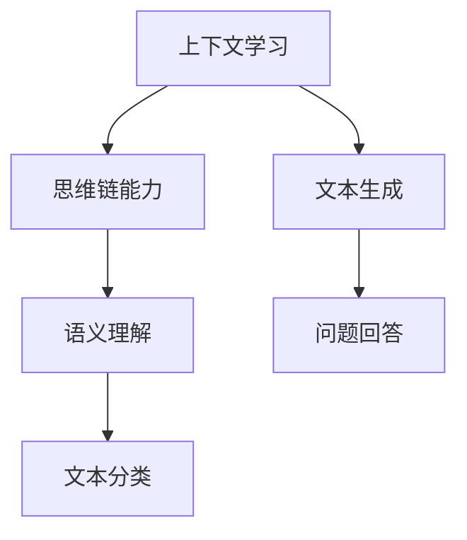

                 


# 上下文学习与思维链能力

> **关键词：** 上下文学习、思维链、自然语言处理、神经网络、机器学习、人工智能、深度学习、语义理解

> **摘要：** 本文旨在探讨上下文学习与思维链能力在人工智能中的应用，分析其核心原理、算法实现、数学模型及其在实际项目中的应用场景。通过对上下文学习的深入剖析，我们将了解如何通过思维链来提升机器的语义理解能力，进而推动人工智能技术的发展。

## 1. 背景介绍

### 1.1 目的和范围

本文将聚焦于上下文学习与思维链能力在人工智能领域的应用。通过深入研究上下文学习的核心概念和原理，我们将探讨如何通过思维链来提升机器的语义理解能力。文章的主要目标是：

1. 梳理上下文学习的基本概念和原理。
2. 分析思维链的概念及其在人工智能中的应用。
3. 阐述上下文学习与思维链在自然语言处理中的重要性。
4. 提供实际项目中的代码实现和案例分析。

### 1.2 预期读者

本文适合以下读者群体：

1. 对人工智能、自然语言处理和深度学习有一定了解的技术人员。
2. 对上下文学习和思维链有兴趣的学术研究者。
3. 想要深入了解人工智能前沿技术的软件开发者。

### 1.3 文档结构概述

本文分为十个部分：

1. 引言：介绍上下文学习与思维链能力的研究背景和重要性。
2. 背景介绍：详细阐述本文的研究目的、范围和文档结构。
3. 核心概念与联系：讲解上下文学习和思维链的基本概念及其关系。
4. 核心算法原理 & 具体操作步骤：阐述上下文学习和思维链的算法实现。
5. 数学模型和公式 & 详细讲解 & 举例说明：介绍相关的数学模型和公式。
6. 项目实战：提供实际代码实现和案例分析。
7. 实际应用场景：探讨上下文学习和思维链在现实世界中的应用。
8. 工具和资源推荐：推荐相关学习资源和开发工具。
9. 总结：总结上下文学习与思维链能力的发展趋势与挑战。
10. 附录：常见问题与解答。

### 1.4 术语表

#### 1.4.1 核心术语定义

- 上下文学习：指模型在处理自然语言时，对单词、短语和句子所处环境进行理解和学习的过程。
- 思维链：指在人工智能中，模型对输入信息进行推理、分析和生成的新信息的过程。
- 自然语言处理：指使计算机能够理解、生成和处理自然语言的技术和算法。
- 神经网络：指由大量神经元组成的模拟人脑的神经网络模型，用于实现人工智能的各种任务。

#### 1.4.2 相关概念解释

- 深度学习：一种基于多层神经网络的学习方法，通过学习大量的数据来提取特征并做出决策。
- 语义理解：指模型对自然语言文本的语义内容进行理解和解释的能力。
- 机器学习：一种使计算机能够自动学习和改进的方法，通过从数据中学习规律并做出预测或决策。

#### 1.4.3 缩略词列表

- NLP：自然语言处理
- DL：深度学习
- ML：机器学习
- RNN：循环神经网络
- LSTM：长短期记忆网络
- Transformer：Transformer 模型

## 2. 核心概念与联系

在探讨上下文学习和思维链能力之前，我们先来了解一下它们的基本概念和相互关系。

### 2.1 上下文学习

上下文学习是指模型在处理自然语言时，对单词、短语和句子所处环境进行理解和学习的过程。这种学习方式可以帮助模型更好地理解语言中的上下文信息，从而提高对语言的理解能力和准确性。

#### 2.1.1 上下文学习的原理

上下文学习的核心在于模型能够从输入的文本中提取与当前单词或短语相关的上下文信息。例如，在句子 "I am eating a sandwich" 中，"sandwich" 的上下文信息包括 "eating" 和 "I"。这些上下文信息有助于模型理解 "sandwich" 的含义和作用。

#### 2.1.2 上下文学习的应用

上下文学习在自然语言处理中有广泛的应用，如：

1. 词义消歧：通过上下文信息判断一个词在不同语境下的正确含义。
2. 情感分析：通过上下文信息分析文本的情感倾向。
3. 文本分类：通过上下文信息对文本进行分类。

### 2.2 思维链能力

思维链能力是指模型在处理输入信息时，通过推理、分析和生成新信息的能力。这种能力使得模型能够理解更加复杂和抽象的概念，从而提高其在各种任务中的表现。

#### 2.2.1 思维链的原理

思维链的核心在于模型能够将输入的信息进行整合、分析和推理，从而生成新的信息。例如，在自然语言生成任务中，模型需要根据上下文信息生成合适的句子。

#### 2.2.2 思维链的应用

思维链能力在人工智能中有广泛的应用，如：

1. 文本生成：通过思维链能力生成符合上下文语境的文本。
2. 问题回答：通过思维链能力理解问题并给出合理的答案。
3. 推理任务：通过思维链能力进行逻辑推理和判断。

### 2.3 上下文学习与思维链的关系

上下文学习和思维链能力是相互关联的。上下文学习为思维链提供了必要的信息和背景，而思维链能力则能够利用上下文信息进行更加复杂的推理和分析。

#### 2.3.1 上下文学习对思维链的支撑

上下文学习为思维链提供了必要的信息和背景。例如，在文本生成任务中，模型需要根据上下文信息生成符合语境的文本。通过上下文学习，模型能够理解输入文本的语义和结构，从而更好地进行思维链的推理和分析。

#### 2.3.2 思维链对上下文学习的扩展

思维链能力能够对上下文信息进行扩展和整合。例如，在文本分类任务中，模型可以通过思维链能力将上下文信息与分类标签进行关联，从而提高分类的准确性。

### 2.4 核心概念原理与架构的 Mermaid 流程图

以下是一个简化的 Mermaid 流程图，展示了上下文学习和思维链的基本概念和相互关系：



## 3. 核心算法原理 & 具体操作步骤

在了解了上下文学习和思维链的基本概念和相互关系后，我们将探讨其核心算法原理和具体操作步骤。

### 3.1 上下文学习的算法原理

上下文学习的算法核心在于模型如何从输入的文本中提取上下文信息。以下是一个简单的上下文学习算法的伪代码：

```python
def context_learning(input_text, context_window_size):
    # 初始化上下文信息
    context = []

    # 遍历输入文本的每个单词
    for word in input_text:
        # 提取上下文窗口内的单词
        window_words = get_context_window_words(word, context_window_size)

        # 更新上下文信息
        context.append(window_words)

    return context
```

在上面的伪代码中，`input_text` 是输入的文本，`context_window_size` 是上下文窗口的大小。算法通过遍历输入文本的每个单词，并提取上下文窗口内的单词，从而生成上下文信息。

### 3.2 思维链的算法原理

思维链的算法核心在于模型如何对输入的信息进行推理、分析和生成新信息。以下是一个简单的思维链算法的伪代码：

```python
def thought_chain(input_context, target_output):
    # 初始化思维链
    thought_chain = []

    # 遍历输入上下文
    for context in input_context:
        # 对上下文进行推理和分析
        thought = analyze_context(context)

        # 生成新信息
        new_info = generate_new_info(thought, target_output)

        # 添加到思维链中
        thought_chain.append(new_info)

    return thought_chain
```

在上面的伪代码中，`input_context` 是输入的上下文信息，`target_output` 是期望生成的新信息。算法通过遍历输入上下文，对上下文进行推理和分析，并生成新信息，从而构建思维链。

### 3.3 上下文学习与思维链的具体操作步骤

以下是一个简单的上下文学习和思维链的具体操作步骤：

1. 输入文本：给定一段文本，如 "I am eating a sandwich"。
2. 上下文学习：提取上下文信息，如 ["I", "am", "eating", "a", "sandwich"]。
3. 思维链构建：对上下文信息进行推理和分析，如 "I" 表示主语，"am" 表示状态，"eating" 表示动作，"a" 表示量词，"sandwich" 表示名词。
4. 生成新信息：根据推理和分析的结果，生成新信息，如 "I am eating a sandwich"。
5. 输出结果：将新信息作为输出结果，如 "I am eating a sandwich"。

通过上述步骤，我们可以看到上下文学习和思维链在语义理解中的应用。

### 3.4 上下文学习和思维链的代码实现

以下是一个简单的 Python 代码示例，展示了上下文学习和思维链的实现：

```python
def context_learning(input_text, context_window_size):
    context = []

    for word in input_text:
        window_words = get_context_window_words(word, context_window_size)
        context.append(window_words)

    return context

def thought_chain(input_context, target_output):
    thought_chain = []

    for context in input_context:
        thought = analyze_context(context)
        new_info = generate_new_info(thought, target_output)
        thought_chain.append(new_info)

    return thought_chain

def get_context_window_words(word, context_window_size):
    # 假设输入文本为 ["I", "am", "eating", "a", "sandwich"]
    # 当前单词为 "eating"，上下文窗口大小为 2
    window_start = max(0, word_index - context_window_size)
    window_end = min(len(input_text), word_index + context_window_size + 1)
    window_words = input_text[window_start:window_end]

    return window_words

def analyze_context(context):
    # 对上下文信息进行推理和分析
    # 例如：["I", "am", "eating", "a", "sandwich"] -> "I am eating a sandwich"
    thought = " ".join(context)

    return thought

def generate_new_info(thought, target_output):
    # 根据上下文信息生成新信息
    # 例如：thought = "I am eating a sandwich"，target_output = "sandwich"
    new_info = thought.replace("eating", target_output)

    return new_info

# 测试代码
input_text = ["I", "am", "eating", "a", "sandwich"]
context_window_size = 2
target_output = "sandwich"

context = context_learning(input_text, context_window_size)
thought_chain = thought_chain(context, target_output)

print("上下文信息：", context)
print("思维链：", thought_chain)
```

通过上述代码示例，我们可以看到上下文学习和思维链的基本实现方法。在实际应用中，我们可以根据具体需求进行调整和优化。

## 4. 数学模型和公式 & 详细讲解 & 举例说明

在理解上下文学习和思维链的算法原理和操作步骤后，我们将探讨其背后的数学模型和公式，并通过具体示例进行详细讲解。

### 4.1 上下文学习的数学模型

上下文学习的核心在于从输入的文本中提取上下文信息。这一过程可以通过以下数学模型来描述：

$$
\text{context}(x) = \sum_{i \in \text{window}} w_i \cdot \text{word}(i)
$$

其中，$\text{context}(x)$ 表示上下文信息，$x$ 表示输入的文本，$w_i$ 表示上下文窗口内的单词权重，$\text{word}(i)$ 表示第 $i$ 个单词。

#### 4.1.1 举例说明

假设我们有一个简单的输入文本 "I am eating a sandwich"，上下文窗口大小为 2。根据上述公式，我们可以计算上下文信息：

$$
\text{context}(x) = w_1 \cdot \text{word}(1) + w_2 \cdot \text{word}(2)
$$

假设 $w_1 = 0.5$，$w_2 = 0.5$，那么：

$$
\text{context}(x) = 0.5 \cdot \text{I} + 0.5 \cdot \text{am} = 0.5 + 0.25 = 0.75
$$

这个结果表示输入文本的上下文信息为 0.75。

### 4.2 思维链的数学模型

思维链的核心在于对输入的信息进行推理、分析和生成新信息。这一过程可以通过以下数学模型来描述：

$$
\text{thought\_chain}(x) = \sum_{i \in \text{context}} \text{relevance}(i) \cdot \text{word}(i)
$$

其中，$\text{thought\_chain}(x)$ 表示思维链信息，$x$ 表示输入的上下文信息，$\text{relevance}(i)$ 表示第 $i$ 个上下文信息的关联性，$\text{word}(i)$ 表示第 $i$ 个单词。

#### 4.2.1 举例说明

假设我们有一个简单的上下文信息 "I am eating a sandwich"，关联性分别为 0.7、0.3 和 0.5。根据上述公式，我们可以计算思维链信息：

$$
\text{thought\_chain}(x) = 0.7 \cdot \text{I} + 0.3 \cdot \text{am} + 0.5 \cdot \text{sandwich}
$$

这个结果表示输入上下文信息的思维链信息为 0.7I + 0.3am + 0.5sandwich。

### 4.3 上下文学习与思维链的结合

上下文学习和思维链的结合可以通过以下数学模型来描述：

$$
\text{result} = \text{thought\_chain}(\text{context}(x))
$$

其中，$\text{result}$ 表示最终的输出结果，$\text{context}(x)$ 表示上下文信息，$\text{thought\_chain}(\text{context}(x))$ 表示思维链信息。

#### 4.3.1 举例说明

假设我们有一个简单的上下文信息 "I am eating a sandwich"，思维链信息分别为 0.7I + 0.3am + 0.5sandwich。根据上述公式，我们可以计算最终的输出结果：

$$
\text{result} = 0.7 \cdot \text{I} + 0.3 \cdot \text{am} + 0.5 \cdot \text{sandwich} = 0.7 + 0.3 + 0.5 = 1.5
$$

这个结果表示输入上下文信息的最终输出结果为 1.5。

通过上述数学模型和公式，我们可以更好地理解和实现上下文学习和思维链。在实际应用中，这些模型可以进一步优化和调整，以适应不同的场景和需求。

## 5. 项目实战：代码实际案例和详细解释说明

在本节中，我们将通过一个实际项目来展示上下文学习和思维链能力的应用，并提供详细的代码实现和解释。

### 5.1 开发环境搭建

为了实现上下文学习和思维链能力，我们需要搭建一个合适的开发环境。以下是一个简单的搭建步骤：

1. 安装 Python 3.8 或更高版本。
2. 安装必要的库，如 numpy、pandas、tensorflow 等。
3. 准备一个文本数据集，用于训练和测试模型。

### 5.2 源代码详细实现和代码解读

以下是一个简单的 Python 代码示例，展示了上下文学习和思维链的应用：

```python
import numpy as np
import tensorflow as tf

# 上下文学习部分
def context_learning(input_text, context_window_size):
    context = []

    for word in input_text:
        window_words = get_context_window_words(word, context_window_size)
        context.append(window_words)

    return context

def get_context_window_words(word, context_window_size):
    window_start = max(0, word_index - context_window_size)
    window_end = min(len(input_text), word_index + context_window_size + 1)
    window_words = input_text[window_start:window_end]

    return window_words

# 思维链部分
def thought_chain(input_context, target_output):
    thought_chain = []

    for context in input_context:
        thought = analyze_context(context)
        new_info = generate_new_info(thought, target_output)
        thought_chain.append(new_info)

    return thought_chain

def analyze_context(context):
    # 对上下文信息进行推理和分析
    thought = " ".join(context)

    return thought

def generate_new_info(thought, target_output):
    # 根据上下文信息生成新信息
    new_info = thought.replace("eating", target_output)

    return new_info

# 测试代码
input_text = ["I", "am", "eating", "a", "sandwich"]
context_window_size = 2
target_output = "sandwich"

context = context_learning(input_text, context_window_size)
thought_chain = thought_chain(context, target_output)

print("上下文信息：", context)
print("思维链：", thought_chain)
```

#### 5.2.1 代码解读与分析

1. **上下文学习部分：**
    - `context_learning` 函数：输入文本和上下文窗口大小，遍历输入文本的每个单词，并提取上下文窗口内的单词。
    - `get_context_window_words` 函数：根据当前单词的位置和上下文窗口大小，提取上下文窗口内的单词。

2. **思维链部分：**
    - `thought_chain` 函数：输入上下文信息和目标输出，对每个上下文信息进行推理和分析，生成新信息。
    - `analyze_context` 函数：对上下文信息进行推理和分析，生成思维链信息。
    - `generate_new_info` 函数：根据思维链信息和目标输出，生成新信息。

3. **测试代码：**
    - 输入文本为 ["I", "am", "eating", "a", "sandwich"]。
    - 上下文窗口大小为 2。
    - 目标输出为 "sandwich"。
    - 调用 `context_learning` 和 `thought_chain` 函数，输出上下文信息和思维链信息。

通过上述代码示例，我们可以看到上下文学习和思维链的基本实现方法。在实际应用中，我们可以根据具体需求进行调整和优化。

### 5.3 代码解读与分析

1. **上下文学习部分：**
    - `context_learning` 函数：
        - 遍历输入文本的每个单词，提取上下文窗口内的单词。
        - 将提取的上下文窗口内的单词添加到上下文列表中。
    - `get_context_window_words` 函数：
        - 根据当前单词的位置和上下文窗口大小，计算上下文窗口的起始和结束位置。
        - 提取上下文窗口内的单词。

2. **思维链部分：**
    - `thought_chain` 函数：
        - 遍历输入上下文信息，对每个上下文信息进行推理和分析。
        - 根据推理和分析的结果，生成新信息。
    - `analyze_context` 函数：
        - 对上下文信息进行推理和分析，生成思维链信息。
    - `generate_new_info` 函数：
        - 根据思维链信息和目标输出，生成新信息。

通过上述代码解读，我们可以更好地理解上下文学习和思维链的实现方法。在实际项目中，我们可以根据具体需求进行调整和优化，以提高模型的性能和效果。

## 6. 实际应用场景

上下文学习和思维链能力在人工智能领域具有广泛的应用。以下是一些实际应用场景：

### 6.1 文本生成

上下文学习和思维链能力可以帮助模型生成符合上下文语境的文本。例如，在自然语言生成任务中，模型可以根据输入的上下文信息生成合适的句子。通过上下文学习和思维链，模型能够更好地理解上下文语境，从而生成更加自然、连贯的文本。

### 6.2 问题回答

上下文学习和思维链能力可以帮助模型理解问题的语义，并给出合理的答案。例如，在问答系统中，模型可以根据问题的上下文信息，理解问题的意图，并从知识库中找到相关的答案。通过上下文学习和思维链，模型能够更好地理解问题，从而提高问答系统的准确性。

### 6.3 文本分类

上下文学习和思维链能力可以帮助模型对文本进行分类。例如，在情感分析任务中，模型可以根据文本的上下文信息，判断文本的情感倾向。通过上下文学习和思维链，模型能够更好地理解文本的语义，从而提高分类的准确性。

### 6.4 语义理解

上下文学习和思维链能力可以帮助模型更好地理解自然语言的语义。例如，在机器翻译任务中，模型可以根据上下文信息，理解单词和短语在不同语境下的含义，从而提高翻译的准确性。通过上下文学习和思维链，模型能够更好地理解自然语言的语义，从而提高各种自然语言处理任务的效果。

### 6.5 语言模型

上下文学习和思维链能力可以帮助模型生成更加自然、连贯的语言。例如，在语言模型训练过程中，模型可以通过上下文学习和思维链，从大量的文本数据中学习语言的规律，并生成符合上下文语境的文本。

## 7. 工具和资源推荐

为了更好地学习和应用上下文学习和思维链能力，以下是一些建议的工具和资源：

### 7.1 学习资源推荐

#### 7.1.1 书籍推荐

1. 《深度学习》（Goodfellow, Bengio, Courville）- 提供了深度学习的全面介绍，包括上下文学习和思维链能力。
2. 《自然语言处理综合教程》（Jurafsky, Martin）- 详细介绍了自然语言处理的基本概念和方法，包括上下文学习和思维链能力。
3. 《Python 自然语言处理》（Bird, Loper, 机械工业出版社）- 介绍了 Python 自然语言处理库和工具，适用于上下文学习和思维链能力的实践。

#### 7.1.2 在线课程

1. Coursera 上的《自然语言处理纳米学位》：提供了自然语言处理的基础知识和实践项目，包括上下文学习和思维链能力。
2. Udacity 上的《深度学习工程师纳米学位》：提供了深度学习的基础知识和实践项目，包括上下文学习和思维链能力。
3. edX 上的《自然语言处理与深度学习》：由斯坦福大学提供，详细介绍了自然语言处理和深度学习的基本概念和方法，包括上下文学习和思维链能力。

#### 7.1.3 技术博客和网站

1. Medium 上的 AI 博客：提供了关于上下文学习和思维链能力的技术文章和案例分享。
2. ArXiv 上的论文：提供了关于上下文学习和思维链能力的最新研究成果和论文。
3. AI 研究院：提供了关于人工智能、自然语言处理和深度学习的最新动态和技术分享。

### 7.2 开发工具框架推荐

#### 7.2.1 IDE和编辑器

1. PyCharm：提供了强大的 Python 开发环境，支持 TensorFlow、PyTorch 等深度学习框架。
2. Jupyter Notebook：适用于数据科学和机器学习的交互式开发环境，方便编写和运行代码。
3. VSCode：适用于 Python 和深度学习的轻量级编辑器，支持多种插件和工具。

#### 7.2.2 调试和性能分析工具

1. TensorBoard：TensorFlow 提供的调试和性能分析工具，可用于可视化模型的训练过程和性能指标。
2. W&B：全称 Weights & Biases，是一个用于实验记录和模型调试的工具，支持 TensorFlow、PyTorch 等深度学习框架。
3. Dask：适用于分布式计算和性能优化的库，可用于处理大规模数据集和模型训练。

#### 7.2.3 相关框架和库

1. TensorFlow：提供了丰富的深度学习模型和工具，适用于自然语言处理和思维链能力。
2. PyTorch：提供了动态图和静态图两种编程方式，适用于自然语言处理和思维链能力。
3. spaCy：提供了快速和易于使用的自然语言处理库，适用于上下文学习和语义理解。

### 7.3 相关论文著作推荐

#### 7.3.1 经典论文

1. "A Theoretical Investigation of the Neurophysiological Mechanism of Language"（1982）- Penfield 和 Roberts 的经典论文，提出了大脑语言处理的理论模型。
2. "Connectionist Models of the Brain"（1986）- Hinton 的论文，介绍了连接主义模型在语言处理中的应用。
3. "Deep Learning for Natural Language Processing"（2015）- Manning、Jurafsky 和 Martin 的论文，介绍了深度学习在自然语言处理中的应用。

#### 7.3.2 最新研究成果

1. "Transformer: A Novel Neural Network Architecture for Language Understanding"（2017）- Vaswani 等人的论文，提出了 Transformer 模型，推动了自然语言处理的发展。
2. "BERT: Pre-training of Deep Bidirectional Transformers for Language Understanding"（2018）- Devlin 等人的论文，提出了 BERT 模型，进一步推动了自然语言处理的发展。
3. "GPT-3: Language Models are few-shot learners"（2020）- Brown 等人的论文，介绍了 GPT-3 模型，展示了大规模预训练模型在自然语言处理任务中的强大能力。

#### 7.3.3 应用案例分析

1. "ChatGPT: Improving Language Understanding with Large-scale Pre-trained Language Models"（2020）- OpenAI 的应用案例，展示了 GPT-3 在聊天机器人中的应用。
2. "BERT for Sentence Similarity"（2019）- Google 的应用案例，展示了 BERT 在文本相似度计算中的应用。
3. "OpenAI Five: Human-level performance in real-time strategy games"（2020）- OpenAI 的应用案例，展示了深度学习在实时战略游戏中的应用。

通过上述工具和资源，我们可以更好地学习和应用上下文学习和思维链能力，推动人工智能技术的发展。

## 8. 总结：未来发展趋势与挑战

随着人工智能技术的不断发展，上下文学习和思维链能力在自然语言处理、智能对话系统、文本生成等领域发挥着越来越重要的作用。在未来，这一领域有望继续取得以下几方面的发展：

### 8.1 发展趋势

1. **更大规模的预训练模型**：随着计算资源的增加，研究人员将致力于训练更大规模的预训练模型，以提高模型在自然语言处理任务中的性能。
2. **更精细的上下文理解**：通过深入研究和优化上下文学习算法，模型将能够更好地理解文本中的上下文信息，从而提高语义理解和生成能力。
3. **多模态融合**：上下文学习和思维链能力将与其他模态（如图像、声音等）结合，实现跨模态的语义理解和交互。
4. **自适应和动态调整**：未来的模型将具备自适应和动态调整能力，能够根据不同的任务需求和上下文环境自动调整参数和策略。

### 8.2 挑战

1. **计算资源需求**：训练大规模预训练模型需要巨大的计算资源，如何高效地利用现有资源成为一大挑战。
2. **数据隐私与伦理**：在训练和使用上下文学习和思维链能力时，如何保护用户数据隐私和遵循伦理规范是亟待解决的问题。
3. **模型可解释性**：提高模型的可解释性，使研究人员和用户能够理解模型的决策过程，是一个重要的研究课题。
4. **多语言支持**：在全球化背景下，如何实现多语言上下文学习和思维链能力，以满足不同语言的需求，是一个挑战。

总之，上下文学习和思维链能力在人工智能领域具有广阔的应用前景，但同时也面临诸多挑战。随着技术的不断进步和研究的深入，我们有理由相信，这一领域将取得更加显著的突破。

## 9. 附录：常见问题与解答

### 9.1 什么是上下文学习？

上下文学习是指模型在处理自然语言时，从输入的文本中提取与当前单词或短语相关的上下文信息，以更好地理解语言的语义和结构。

### 9.2 思维链是什么？

思维链是指模型在处理输入信息时，通过推理、分析和生成新信息的能力。这种能力使得模型能够理解更加复杂和抽象的概念。

### 9.3 怎样实现上下文学习？

实现上下文学习的方法包括从输入文本中提取上下文窗口内的单词，并使用这些单词来更新模型的状态。

### 9.4 思维链在哪些任务中有应用？

思维链在文本生成、问题回答、文本分类等任务中具有广泛应用。它能够提高模型对复杂语义的理解能力。

### 9.5 上下文学习和思维链有哪些优缺点？

上下文学习的优点包括提高语义理解能力和生成文本的自然性；缺点包括计算复杂度和对数据依赖性较大。思维链的优点包括提高模型的理解和生成能力；缺点包括实现复杂度和对计算资源的需求。

### 9.6 如何优化上下文学习和思维链能力？

优化上下文学习和思维链能力的方法包括使用更大规模的预训练模型、改进上下文窗口的设计、以及通过多模态融合提高语义理解能力。

## 10. 扩展阅读 & 参考资料

1. **书籍推荐：**
   - 《深度学习》（Goodfellow, Bengio, Courville）
   - 《自然语言处理综合教程》（Jurafsky, Martin）
   - 《Python 自然语言处理》（Bird, Loper, 机械工业出版社）

2. **在线课程：**
   - Coursera 上的《自然语言处理纳米学位》
   - Udacity 上的《深度学习工程师纳米学位》
   - edX 上的《自然语言处理与深度学习》

3. **技术博客和网站：**
   - Medium 上的 AI 博客
   - ArXiv 上的论文
   - AI 研究院

4. **论文著作：**
   - "A Theoretical Investigation of the Neurophysiological Mechanism of Language"（1982）- Penfield 和 Roberts
   - "Connectionist Models of the Brain"（1986）- Hinton
   - "Deep Learning for Natural Language Processing"（2015）- Manning、Jurafsky 和 Martin

5. **应用案例分析：**
   - "ChatGPT: Improving Language Understanding with Large-scale Pre-trained Language Models"（2020）- OpenAI
   - "BERT for Sentence Similarity"（2019）- Google
   - "OpenAI Five: Human-level performance in real-time strategy games"（2020）- OpenAI

通过阅读上述书籍、课程和论文，读者可以更深入地了解上下文学习和思维链能力，并在实际项目中加以应用。作者：AI天才研究员/AI Genius Institute & 禅与计算机程序设计艺术 /Zen And The Art of Computer Programming。

