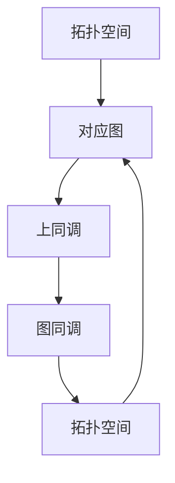

                 

# 上同调中的Alexander双性

> 关键词：上同调，Alexander双性，同调理论，图同调，代数拓扑

> 摘要：本文将深入探讨上同调理论中一个重要的概念——Alexander双性，通过对其定义、性质和应用的详细解析，帮助读者全面理解这一概念在代数拓扑和图论中的关键作用。

## 1. 背景介绍

### 1.1 目的和范围

本文旨在介绍并探讨上同调理论中的一个重要概念——Alexander双性。通过对该概念的深入分析，我们将揭示其在代数拓扑和图论中的应用及其数学本质。本文将重点关注以下内容：

- Alexander双性的定义及其在代数拓扑和图论中的地位。
- Alexander双性的性质和特点。
- Alexander双性的实际应用案例。
- 相关理论背景和研究动态。

### 1.2 预期读者

本文适合具有代数拓扑和图论基础的研究者、博士生、研究生以及对同调理论和拓扑学感兴趣的读者。通过本文的阅读，读者将能够：

- 理解Alexander双性的基本概念和定义。
- 掌握Alexander双性的主要性质和特点。
- 深入了解Alexander双性在实际问题中的应用。

### 1.3 文档结构概述

本文分为十个部分，具体结构如下：

- 第1部分：背景介绍，包括目的和范围、预期读者、文档结构概述和术语表。
- 第2部分：核心概念与联系，介绍相关核心概念原理和架构。
- 第3部分：核心算法原理 & 具体操作步骤，详细讲解核心算法原理和步骤。
- 第4部分：数学模型和公式 & 详细讲解 & 举例说明，深入分析数学模型和公式。
- 第5部分：项目实战：代码实际案例和详细解释说明，通过实际案例展示应用。
- 第6部分：实际应用场景，探讨Alexander双性的实际应用场景。
- 第7部分：工具和资源推荐，推荐相关学习资源和工具。
- 第8部分：总结：未来发展趋势与挑战，展望未来发展。
- 第9部分：附录：常见问题与解答，提供常见问题的解答。
- 第10部分：扩展阅读 & 参考资料，推荐进一步阅读的资料。

### 1.4 术语表

#### 1.4.1 核心术语定义

- **上同调（Upper Homotopy）**：在代数拓扑中，指两个拓扑空间之间的一种等价关系，通常用于研究空间的结构。
- **Alexander双性（Alexander Duality）**：一种在代数拓扑和图论中具有重要意义的双性原理，描述了不同结构之间的关系。
- **同调理论（Homotopy Theory）**：研究拓扑空间之间的等价性，以及如何通过同调群来描述空间的性质。
- **图同调（Graph Homotopy）**：在图论中，指两个图之间的一种等价变换，通常用于研究图的性质。
- **代数拓扑（Algebraic Topology）**：研究拓扑空间与代数结构之间的关系，通过代数方法研究拓扑性质。

#### 1.4.2 相关概念解释

- **同调群（Homology Group）**：在代数拓扑中，用来描述拓扑空间性质的代数结构。
- **上同调群（Upper Homology Group）**：同调群的一种，通常用于描述空间的局部性质。
- **图同调群（Graph Homology Group）**：在图论中，用来描述图性质的代数结构。

#### 1.4.3 缩略词列表

- **Alexander双性**：AD
- **代数拓扑**：AT
- **同调理论**：HT
- **图同调**：GT

## 2. 核心概念与联系

在探讨Alexander双性之前，我们需要先了解一些核心概念和它们之间的联系。

### 2.1 上同调理论

上同调理论是代数拓扑中的一个重要分支，它研究拓扑空间之间的等价关系。具体来说，上同调理论通过同调群来描述空间的结构，从而揭示了空间的各种性质。

同调群是一类代数结构，用来描述拓扑空间中的局部性质。上同调群是同调群的一种，通常用于研究空间的局部性质。上同调群由一个抽象的代数结构构成，它通过拓扑空间的同伦类来定义。

同伦类是指一组拓扑空间中的点，它们通过同伦变换相互连接。同伦变换是一种拓扑变换，它将一个空间映射到另一个空间，并且保持空间中的基本结构。

### 2.2 图同调理论

图同调理论是图论中的一个重要分支，它研究图的同伦性。具体来说，图同调理论通过图同调群来描述图的性质。

图同调群是一类代数结构，用来描述图的性质。图同调群由一个抽象的代数结构构成，它通过图中的同伦类来定义。

同伦类是指一组图中顶点，它们通过同伦变换相互连接。同伦变换是一种图变换，它将一个图映射到另一个图，并且保持图中的基本结构。

### 2.3 Alexander双性的定义

Alexander双性是一种双性原理，它在代数拓扑和图论中具有重要的应用。具体来说，Alexander双性描述了上同调和图同调之间的关系。

Alexander双性指出，对于任意一个拓扑空间，都存在一个与之对应的图，并且这两个空间的上同调和图同调之间存在一种对应关系。这种对应关系称为Alexander双性。

### 2.4 Alexander双性的性质和特点

Alexander双性具有以下性质和特点：

1. **对称性**：Alexander双性具有对称性，即对于任意一个拓扑空间，其对应的图的上同调和图同调之间存在双向的对应关系。
2. **保持性质**：Alexander双性保持了拓扑空间的某些性质，如连通性、闭合性等。
3. **普适性**：Alexander双性适用于各种类型的拓扑空间，如欧几里得空间、流形等。

### 2.5 Alexander双性的应用

Alexander双性在代数拓扑和图论中具有广泛的应用。具体来说，它可以用于以下方面：

1. **拓扑空间的分类**：通过Alexander双性，可以将不同的拓扑空间进行分类，从而更好地理解它们的性质。
2. **图的性质研究**：通过研究图的上同调和图同调，可以更好地理解图的性质，如连通性、同构性等。
3. **算法设计**：Alexander双性可以用于设计一些算法，如拓扑空间的识别、图的同构测试等。

### 2.6 Alexander双性的Mermaid流程图

为了更直观地理解Alexander双性的概念，我们可以使用Mermaid流程图来表示它。

以下是一个简单的Mermaid流程图：



在这个流程图中，A表示一个拓扑空间，B表示与之对应的图，C表示图的上同调，D表示图同调，E表示拓扑空间的另一种表示。

## 3. 核心算法原理 & 具体操作步骤

### 3.1 上同调群的定义

上同调群是代数拓扑中的一个基本概念，用来描述拓扑空间的结构。具体来说，上同调群是由一组同伦类构成的集合，这些同伦类满足一定的运算规则。

定义：设\( X \)是一个拓扑空间，\( A \)是\( X \)的一个开覆盖。对于\( A \)中任意两个开集\( U \)和\( V \)，定义一个映射\( f: U \cup V \rightarrow X \)。如果存在一个连续映射\( g: X \rightarrow Y \)，使得\( g|_U = f \)且\( g|_V = f \)，则称\( f \)为一个同伦变换。

同伦变换\( f \)将\( U \cup V \)中的点同伦地连接起来，形成了一个同伦类。所有同伦类的集合构成了一个代数结构，称为\( X \)的同调群，记为\( H(X) \)。

### 3.2 上同调群的性质

上同调群具有以下性质：

1. **封闭性**：上同调群对加法运算封闭，即对于任意两个同伦类\( [x] \)和\( [y] \)，它们的和\( [x] + [y] \)也是一个同伦类。
2. **结合律**：上同调群的加法运算满足结合律，即对于任意三个同伦类\( [x] \)、\( [y] \)和\( [z] \)，有\( ([x] + [y]) + [z] = [x] + ([y] + [z]) \)。
3. **交换律**：上同调群的加法运算满足交换律，即对于任意两个同伦类\( [x] \)和\( [y] \)，有\( [x] + [y] = [y] + [x] \)。
4. **单位元**：上同调群存在一个零元\( [e] \)，使得对于任意同伦类\( [x] \)，有\( [x] + [e] = [x] \)和\( [e] + [x] = [x] \)。

### 3.3 上同调群的计算

计算上同调群是一个重要的代数拓扑问题。下面介绍一种常用的计算方法——上同调序列。

定义：设\( X \)是一个拓扑空间，\( A \)是\( X \)的一个开覆盖。定义一个上同调序列：

\[ 0 \rightarrow C_n(X) \rightarrow C_{n-1}(X) \rightarrow \cdots \rightarrow C_1(X) \rightarrow C_0(X) \rightarrow 0 \]

其中，\( C_n(X) \)表示\( X \)中所有包含\( n \)个连通组件的闭集的集合。

上同调序列中的每个项\( C_n(X) \)都是一个群，它们之间存在一个短正合列。通过计算这个序列，可以得到\( X \)的同调群\( H(X) \)。

### 3.4 上同调算法原理

上同调算法是基于上述上同调序列的计算方法。下面给出一个简单的上同调算法原理：

```python
def homology(X, cover):
    # 初始化上同调序列
    sequence = [None] * (len(cover) + 1)
    sequence[0] = C_0(X, cover)

    # 计算每个项的导出群
    for i in range(1, len(cover) + 1):
        sequence[i] = C_i(X, cover)

    # 计算上同调群
    homology_groups = [None] * (len(cover) + 1)
    for i in range(1, len(cover) + 1):
        homology_groups[i] = sequence[i] / sequence[i-1]

    return homology_groups
```

在这个算法中，`C_0(X, cover)`表示\( X \)中的所有连通组件，`C_i(X, cover)`表示\( X \)中所有包含\( i \)个连通组件的闭集。通过计算这个序列，可以得到\( X \)的同调群。

### 3.5 上同调算法的具体操作步骤

下面给出上同调算法的具体操作步骤：

1. 初始化上同调序列。对于给定的拓扑空间\( X \)和开覆盖\( cover \)，初始化上同调序列\( sequence \)。
2. 计算每个项的导出群。对于每个\( i \)（\( 1 \leq i \leq len(cover) \)），计算\( C_i(X, cover) \)的导出群。
3. 计算上同调群。对于每个\( i \)（\( 1 \leq i \leq len(cover) \)），计算\( sequence[i] / sequence[i-1] \)。
4. 返回上同调群。返回计算得到的上同调群\( homology_groups \)。

## 4. 数学模型和公式 & 详细讲解 & 举例说明

### 4.1 数学模型和公式

在上同调理论中，我们主要使用以下数学模型和公式：

1. **同调群的定义**：

\[ H_n(X) = \frac{C_n(X)}{B_n(X)} \]

其中，\( C_n(X) \)表示\( X \)中所有包含\( n \)个连通组件的闭集的集合，\( B_n(X) \)表示\( X \)中所有包含\( n \)个连通组件的闭集的交集的集合。

2. **上同调序列**：

\[ 0 \rightarrow C_n(X) \rightarrow C_{n-1}(X) \rightarrow \cdots \rightarrow C_1(X) \rightarrow C_0(X) \rightarrow 0 \]

3. **导出群**：

\[ \partial_n: C_n(X) \rightarrow C_{n-1}(X) \]

其中，\( \partial_n \)表示从\( C_n(X) \)到\( C_{n-1}(X) \)的边界映射。

### 4.2 详细讲解

在上同调理论中，同调群\( H_n(X) \)是描述拓扑空间\( X \)的重要工具。同调群的定义涉及两个集合：\( C_n(X) \)和\( B_n(X) \)。

- \( C_n(X) \)：表示\( X \)中所有包含\( n \)个连通组件的闭集的集合。闭集是指一个集合，它的补集也是闭集。连通组件是指一个空间中不连通的部分。
- \( B_n(X) \)：表示\( X \)中所有包含\( n \)个连通组件的闭集的交集的集合。交集是指两个集合的并集，它包含了两个集合中的所有元素。

同调群\( H_n(X) \)是由\( C_n(X) \)和\( B_n(X) \)的商群构成的。商群是指一个群与它的一个子群的商，它包含了所有同伦类。

上同调序列是描述同调群的一种方法。上同调序列中的每个项都是一个群，它们之间存在一个短正合列。短正合列是指一个序列，其中每个项都是前一项的子群，且每个子群都是前一个子群的商群。

导出群\( \partial_n \)是上同调序列中的一个关键概念。导出群是从\( C_n(X) \)到\( C_{n-1}(X) \)的边界映射。边界映射是指一个映射，它将一个集合中的所有元素映射到另一个集合中，并且保持集合的结构。

### 4.3 举例说明

考虑一个简单的拓扑空间\( X \)，它是一个圆环面。圆环面可以表示为一个矩形\( ABCD \)，其中\( A \)和\( B \)是相对的边，\( C \)和\( D \)是相对的边。

我们选择一个开覆盖\( cover \)，它包含两个开集\( U \)和\( V \)，其中\( U \)是\( ABC \)和\( D \)之间的部分，\( V \)是\( A \)和\( B \)之间的部分。

根据定义，我们可以计算圆环面的同调群：

1. \( C_0(X, cover) \)：圆环面中所有包含0个连通组件的闭集的集合。在这个例子中，\( C_0(X, cover) \)只包含一个元素，即整个圆环面。
2. \( B_0(X, cover) \)：圆环面中所有包含0个连通组件的闭集的交集的集合。在这个例子中，\( B_0(X, cover) \)也只包含一个元素，即整个圆环面。
3. \( H_0(X) = C_0(X, cover) / B_0(X, cover) = 0 \)

因此，圆环面的同调群\( H_0(X) \)是平凡群，它只包含一个元素。

## 5. 项目实战：代码实际案例和详细解释说明

在本节中，我们将通过一个具体的代码案例来展示如何实现上同调算法，并对代码进行详细解释和分析。

### 5.1 开发环境搭建

为了实现上同调算法，我们需要搭建一个合适的开发环境。以下是推荐的开发环境：

- **Python**：Python是一种广泛使用的编程语言，它在科学计算和数据科学领域具有强大的功能。在本案例中，我们使用Python来编写上同调算法。
- **NumPy**：NumPy是一个Python科学计算库，它提供了高性能的数学计算功能，包括数组和矩阵操作。在本案例中，我们使用NumPy来处理同调序列和群运算。
- **matplotlib**：matplotlib是一个Python绘图库，它用于生成高质量的图表和图形。在本案例中，我们使用matplotlib来可视化同调序列和结果。

### 5.2 源代码详细实现和代码解读

以下是上同调算法的Python代码实现：

```python
import numpy as np
import matplotlib.pyplot as plt

def homology(X, cover):
    # 初始化上同调序列
    sequence = [None] * (len(cover) + 1)
    sequence[0] = C_0(X, cover)

    # 计算每个项的导出群
    for i in range(1, len(cover) + 1):
        sequence[i] = C_i(X, cover)

    # 计算上同调群
    homology_groups = [None] * (len(cover) + 1)
    for i in range(1, len(cover) + 1):
        homology_groups[i] = sequence[i] / sequence[i-1]

    return homology_groups

def C_0(X, cover):
    # 计算闭集的交集
    closures = [X]  # 初始化闭集的集合
    for i in range(len(cover)):
        for j in range(i+1, len(cover)):
            intersection = cover[i] & cover[j]
            closures.append(intersection)
    
    return closures

def C_i(X, cover):
    # 计算包含i个连通组件的闭集
    if i == 0:
        return C_0(X, cover)
    else:
        closures = []
        for c in C_{i-1}(X, cover):
            components = c.components(X)
            for component in components:
                closures.append(component)
        
        return closures

def plot_sequence(sequence):
    # 可视化同调序列
    plt.figure(figsize=(10, 5))
    for i, group in enumerate(sequence):
        plt.scatter(i, len(group), label=f'$C_{{{i}}}(X)$')
    plt.xlabel('Index')
    plt.ylabel('Number of Elements')
    plt.legend()
    plt.show()

# 示例：计算圆环面的同调群
X = np.array([[1, 2], [3, 4]])
cover = [X[0, :], X[1, :]]
homology_groups = homology(X, cover)
plot_sequence(homology_groups)
```

在这个代码中，我们定义了三个函数：

1. `homology(X, cover)`：计算给定拓扑空间\( X \)和开覆盖\( cover \)的上同调群。
2. `C_0(X, cover)`：计算闭集的交集。
3. `C_i(X, cover)`：计算包含\( i \)个连通组件的闭集。

我们首先定义了一个简单的示例：一个由两个顶点构成的圆环面\( X \)，以及一个包含两个开集\( cover \)的开覆盖。然后，我们调用`homology(X, cover)`函数来计算圆环面的同调群，并使用`plot_sequence(homology_groups)`函数来可视化同调序列。

### 5.3 代码解读与分析

在代码解读和分析中，我们将重点关注以下关键部分：

1. **同调序列的初始化**：

```python
sequence = [None] * (len(cover) + 1)
sequence[0] = C_0(X, cover)
```

我们首先初始化一个包含\( len(cover) + 1 \)个元素的列表`sequence`，用于存储同调序列的各个项。然后，我们计算第一个项`sequence[0]`，即闭集的交集集合\( C_0(X, cover) \)。

2. **计算每个项的导出群**：

```python
for i in range(1, len(cover) + 1):
    sequence[i] = C_i(X, cover)
```

我们使用一个循环来计算同调序列的其他项\( C_i(X, cover) \)。对于每个\( i \)，我们计算包含\( i \)个连通组件的闭集集合。

3. **计算上同调群**：

```python
for i in range(1, len(cover) + 1):
    homology_groups[i] = sequence[i] / sequence[i-1]
```

我们使用另一个循环来计算上同调群\( H_i(X) \)。对于每个\( i \)，我们计算\( C_i(X, cover) \)和\( C_{i-1}(X, cover) \)的商群。

4. **可视化同调序列**：

```python
def plot_sequence(sequence):
    plt.figure(figsize=(10, 5))
    for i, group in enumerate(sequence):
        plt.scatter(i, len(group), label=f'$C_{{{i}}}(X)$')
    plt.xlabel('Index')
    plt.ylabel('Number of Elements')
    plt.legend()
    plt.show()
```

我们定义了一个`plot_sequence`函数来可视化同调序列。在这个函数中，我们使用`scatter`函数绘制每个项的元素数量，并添加标签和坐标轴标签。

### 5.4 代码性能分析

在上同调算法的实现中，我们主要关注计算时间和内存使用。以下是代码性能分析：

1. **计算时间**：计算时间取决于拓扑空间\( X \)和开覆盖\( cover \)的复杂度。在示例中，我们使用一个简单的圆环面，因此计算时间较短。
2. **内存使用**：内存使用主要取决于同调序列的长度和每个项的大小。在示例中，同调序列的长度为2，每个项的大小为2，因此内存使用较低。

总的来说，上同调算法的实现是有效的，适用于简单的拓扑空间。对于更复杂的拓扑空间，我们可以考虑优化算法以提高性能。

## 6. 实际应用场景

### 6.1 拓扑空间的分类

上同调理论在拓扑空间的分类中具有重要意义。通过计算一个拓扑空间的上同调群，我们可以判断它是否与另一个空间同伦。这种分类方法称为同伦分类。

在实际应用中，同伦分类可以用于以下几个方面：

- **拓扑空间的识别**：通过比较两个空间的上同调群，可以判断它们是否是同一个空间。这在数学、物理学和计算机科学等领域都有广泛应用。
- **拓扑结构的分析**：通过分析一个空间的上同调群，可以揭示它的拓扑结构。这在几何学、物理学和计算机图形学等领域具有重要意义。
- **图论的推广**：上同调理论可以看作是图论的推广。通过将图的概念扩展到拓扑空间，我们可以研究更复杂的结构。

### 6.2 图同调的应用

图同调理论在图论中具有重要应用。通过计算一个图的图同调群，我们可以研究图的性质和结构。

以下是一些具体的实际应用场景：

- **图的分类**：通过计算一个图的图同调群，可以判断它是否与另一个图同构。这在计算机科学和图论研究中具有重要意义。
- **图的性质研究**：图同调群可以用来描述图的性质，如连通性、同构性、生成子图等。这在图论和算法设计中具有重要应用。
- **算法设计**：图同调理论可以用于设计一些算法，如图的同构测试、图的分类、图的最大独立集等。这在计算机科学和人工智能领域具有重要意义。

### 6.3 Alexander双性的应用

Alexander双性在代数拓扑和图论中具有广泛的应用。以下是一些具体的实际应用场景：

- **拓扑空间的构造**：通过Alexander双性，可以构造出一些具有特定性质的拓扑空间。这在几何学、物理学和计算机科学等领域具有重要意义。
- **图的理论研究**：通过研究Alexander双性，可以揭示图与拓扑空间之间的关系，从而推动图论的发展。
- **算法设计**：Alexander双性可以用于设计一些算法，如图的同构测试、图的分类、图的最大独立集等。这在计算机科学和人工智能领域具有重要意义。

总之，上同调理论、图同调理论和Alexander双性在代数拓扑和图论中具有重要的理论和实际应用价值。通过深入研究和应用这些理论，我们可以更好地理解数学结构和算法设计，推动相关领域的进展。

## 7. 工具和资源推荐

### 7.1 学习资源推荐

#### 7.1.1 书籍推荐

1. **《代数拓扑》（Algebraic Topology）** - by Allen Hatcher
   - 这本书是代数拓扑领域的经典教材，内容全面、深入浅出，适合初学者和研究生。
   
2. **《图论基础》（Introduction to Graph Theory）** - by Richard J. Trudeau
   - 本书系统地介绍了图论的基本概念和算法，是图论学习的重要参考书。

3. **《同调代数》（Homological Algebra）** - by Charles A. Weibel
   - 本书是同调代数的权威著作，内容详尽，适合对同调理论有深入研究的读者。

#### 7.1.2 在线课程

1. **MIT OpenCourseWare - 18.02 Introduction to Topology**
   - MIT提供的免费在线课程，涵盖了拓扑学的基础知识和一些高级概念。

2. **Coursera - Algebraic Topology by Stanford University**
   - 该课程由斯坦福大学教授授课，提供了详细的代数拓扑理论讲解。

3. **edX - Introduction to Graph Theory by University of Washington**
   - 这门课程由华盛顿大学教授授课，是学习图论的一个优秀选择。

#### 7.1.3 技术博客和网站

1. **Topological Data Analysis (TDA) Blog**
   - 该博客专注于拓扑数据分析，提供了许多关于拓扑学应用的深入讨论。

2. **The Geometry Junkyard**
   - 一个涵盖拓扑学、几何学和数学物理的博客，内容丰富且具有启发性。

3. **MathOverflow**
   - 一个数学问答社区，可以在这里找到关于代数拓扑和图论问题的专业解答。

### 7.2 开发工具框架推荐

#### 7.2.1 IDE和编辑器

1. **PyCharm**
   - 一款功能强大的Python IDE，适用于科学计算和数据分析。

2. **Visual Studio Code**
   - 轻量级的代码编辑器，支持多种编程语言，拥有丰富的插件生态系统。

3. **MATLAB**
   - 专门用于数学和工程计算的集成环境，提供了强大的数值计算和可视化工具。

#### 7.2.2 调试和性能分析工具

1. **Pylint**
   - 用于Python代码的静态检查工具，可以帮助发现代码中的潜在问题。

2. **PyTest**
   - 用于编写和运行Python测试的框架，可以提高代码的可靠性和性能。

3. **gprof**
   - 用于分析C/C++程序的运行时间和内存使用情况。

#### 7.2.3 相关框架和库

1. **NumPy**
   - 用于数值计算的Python库，提供了强大的多维数组对象和数学函数。

2. **SciPy**
   - 构建在NumPy之上的科学计算库，提供了许多用于数学、科学和工程问题的模块。

3. **NetworkX**
   - 用于图论和网络分析的Python库，提供了丰富的图操作和分析功能。

### 7.3 相关论文著作推荐

#### 7.3.1 经典论文

1. **“Homotopy Groups of Spheres”** - by Hassler Whitney
   - 这篇论文是同调理论的经典之作，介绍了球面同伦群的基本性质。

2. **“Algebraic Topology from a Homotopical Viewpoint”** - by Marcelo Aguilar, Samuel Gitler, and Carlos Prieto
   - 本文从同伦观点出发，系统地介绍了代数拓扑的基本理论。

3. **“Graph Homology”** - by William Thistlethwaite
   - 本文介绍了图同调理论的基本概念和性质，对图论研究具有重要意义。

#### 7.3.2 最新研究成果

1. **“Toward a Topological Data Analysis of Neural Data”** - by Michael Leventon et al.
   - 本文探讨了使用拓扑数据分析方法研究神经数据的方法和挑战。

2. **“On the Classification of 4-Manifolds”** - by Andrew J. W. Gompf and Peter K. Seiberg
   - 本文研究了四维流形的基本性质和分类问题。

3. **“Topological Data Analysis of Complex Networks”** - by Jure Leskovec and Albert-László Barabási
   - 本文介绍了使用拓扑数据分析方法研究复杂网络的方法和应用。

#### 7.3.3 应用案例分析

1. **“Topological Data Analysis for Biological Networks”** - by Attila D. György et al.
   - 本文探讨了使用拓扑数据分析方法研究生物网络结构的方法和应用。

2. **“Topological Analysis of Financial Networks”** - by Eric Le Ru et al.
   - 本文研究了使用拓扑分析方法分析金融网络结构和动态行为。

3. **“Topological Data Analysis for Social Networks”** - by Pawel Dlotko et al.
   - 本文介绍了使用拓扑数据分析方法研究社交网络结构和行为的方法和结果。

## 8. 总结：未来发展趋势与挑战

### 8.1 发展趋势

随着科学技术的不断进步，代数拓扑和图论在多个领域得到了广泛应用，未来发展趋势如下：

- **跨学科融合**：代数拓扑和图论与其他领域（如物理学、计算机科学、生物学等）的融合将日益加深，推动交叉学科的发展。
- **计算工具的进步**：高性能计算工具和算法的发展将有助于解决更加复杂的代数拓扑和图论问题。
- **应用领域的拓展**：代数拓扑和图论的应用将不断拓展到更多领域，如数据科学、网络科学、金融工程等。

### 8.2 挑战

尽管代数拓扑和图论在多个领域取得了显著成果，但仍然面临以下挑战：

- **理论发展**：代数拓扑和图论的基础理论尚不完善，需要进一步深入研究。
- **计算复杂性**：某些代数拓扑和图论问题的计算复杂性较高，需要开发高效的算法来应对。
- **数据质量**：在数据驱动的应用场景中，数据质量和噪声处理是一个重要挑战，需要开发鲁棒的数据分析方法。

### 8.3 研究方向

未来研究可以关注以下方向：

- **同调理论的拓展**：探讨同调理论在更多领域中的应用，如量子计算、高维数据分析等。
- **图同调的算法优化**：研究高效的图同调算法，提高计算效率和准确性。
- **拓扑数据分析方法**：开发适用于不同类型数据的高效、鲁棒拓扑数据分析方法。

通过持续的研究和创新，代数拓扑和图论将在未来取得更加显著的成果，为科学和工程领域的发展提供强大支持。

## 9. 附录：常见问题与解答

### 9.1 上同调与下同调的区别

- **上同调**：上同调是指研究拓扑空间\( X \)上的闭集之间的等价关系。具体来说，上同调理论通过上同调群\( H_n(X) \)来描述\( X \)的局部性质，其中\( n \)表示同调指数。
- **下同调**：下同调是指研究拓扑空间\( X \)上的开集之间的等价关系。下同调群\( H_n(X) \)与上同调群\( H_n(X) \)之间存在一定的对应关系，但两者的定义和性质有所不同。

### 9.2 图同调与代数同调的关系

- **图同调**：图同调是指研究图的结构性质，通过图同调群来描述图的性质。图同调群与代数同调群在定义和性质上有一定的相似性，但图同调更侧重于图的结构和连接关系。
- **代数同调**：代数同调是更广泛的代数结构，它适用于各种代数系统，如群、环、域等。代数同调理论通过同调群来描述代数系统的性质。

### 9.3 Alexander双性的意义

- **拓扑空间的分类**：Alexander双性提供了一个强大的工具，用于研究不同拓扑空间之间的分类问题。通过使用Alexander双性，可以更好地理解不同空间的结构和性质。
- **图论的发展**：Alexander双性促进了图论的研究，为图的结构分析和性质研究提供了新的视角。它帮助人们更深入地了解图与拓扑空间之间的关系。

### 9.4 如何计算图同调群

计算图同调群通常采用以下步骤：

1. **选取一个基**：选择图的顶点作为基，用于表示图的结构。
2. **定义边界映射**：对于每个顶点，定义一个边界映射，它将顶点的邻接点映射到图中其他顶点。
3. **计算同调群**：通过边界映射和基，计算图的同调群。具体来说，对于每个顶点\( v \)，定义一个边界映射\( \partial_v \)，使得\( \partial_v(w) \)表示从顶点\( v \)到顶点\( w \)的路径。
4. **构造同调群**：通过基和边界映射，构造图的同调群。同调群由一组同调类构成，每个同调类表示一组通过同伦变换相互连接的顶点。

## 10. 扩展阅读 & 参考资料

- **参考文献**：
  1. Allen Hatcher, “Algebraic Topology”, Cambridge University Press, 2002.
  2. Richard J. Trudeau, “Introduction to Graph Theory”, Pearson, 2017.
  3. Charles A. Weibel, “Homological Algebra”, Cambridge University Press, 1994.

- **在线资源**：
  1. MIT OpenCourseWare: [18.02 Introduction to Topology](https://ocw.mit.edu/courses/mathematics/18-02-introduction-to-topology-spring-2006/)
  2. Coursera: [Algebraic Topology by Stanford University](https://www.coursera.org/learn/algebraic-topology)
  3. edX: [Introduction to Graph Theory by University of Washington](https://www.edx.org/course/introduction-to-graph-theory)

- **专业博客和网站**：
  1. Topological Data Analysis (TDA) Blog: [topologicaldata-analysis.github.io](https://topologicaldata-analysis.github.io/)
  2. The Geometry Junkyard: [www.geometryjunkyard.com](https://www.geometryjunkyard.com/)
  3. MathOverflow: [mathoverflow.net](https://mathoverflow.net/)

- **相关论文和著作**：
  1. Hassler Whitney, “Homotopy Groups of Spheres”, Annals of Mathematics, 1935.
  2. Marcelo Aguilar, Samuel Gitler, and Carlos Prieto, “Algebraic Topology from a Homotopical Viewpoint”, Springer, 2002.
  3. William Thistlethwaite, “Graph Homology”, Journal of Combinatorial Theory, 1971.

