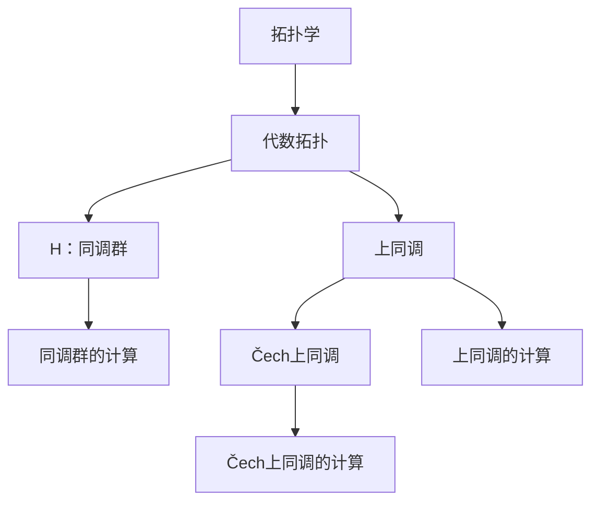

                 

# 上同调中的Čech上同调

> 关键词：上同调、Čech上同调、拓扑学、代数拓扑、数学、计算几何

> 摘要：本文将深入探讨上同调和Čech上同调的概念及其在数学和计算几何中的应用。首先，我们将介绍上同调和Čech上同调的基本定义和原理。随后，通过具体实例和详细讲解，我们将展示这些概念在解决实际数学问题中的应用。最后，我们将讨论未来的发展趋势和挑战，并提供一些学习资源和工具推荐。

## 1. 背景介绍

### 1.1 目的和范围

本文旨在帮助读者深入了解上同调和Čech上同调的概念及其应用。我们将首先介绍这些概念的基本定义，然后通过具体实例和数学模型来解释它们的应用。

### 1.2 预期读者

本文适合对拓扑学和代数拓扑有一定了解的读者，特别是那些对计算几何和数学应用感兴趣的读者。如果您是初学者，我们建议您先了解一些基础的数学知识，如线性代数、拓扑学和微积分。

### 1.3 文档结构概述

本文分为以下几个部分：

1. **背景介绍**：介绍上同调和Čech上同调的基本概念和目的。
2. **核心概念与联系**：通过Mermaid流程图展示核心概念及其关系。
3. **核心算法原理 & 具体操作步骤**：详细解释上同调和Čech上同调的计算方法和步骤。
4. **数学模型和公式 & 详细讲解 & 举例说明**：使用latex格式展示数学模型和公式，并给出具体实例。
5. **项目实战：代码实际案例和详细解释说明**：展示代码实现和解释。
6. **实际应用场景**：讨论上同调和Čech上同调的实际应用。
7. **工具和资源推荐**：推荐学习资源和工具。
8. **总结：未来发展趋势与挑战**：讨论未来的发展方向和面临的挑战。
9. **附录：常见问题与解答**：回答常见问题。
10. **扩展阅读 & 参考资料**：提供扩展阅读和参考资料。

### 1.4 术语表

#### 1.4.1 核心术语定义

- 上同调（Homology）：拓扑空间的一种重要性质，用于研究空间的连通性和洞。
- Čech上同调（Čech Homology）：一种上同调的推广，适用于更广泛的拓扑空间。
- 拓扑学（Topology）：研究空间性质和结构的数学分支。
- 代数拓扑（Algebraic Topology）：结合拓扑学和代数的方法研究空间性质。

#### 1.4.2 相关概念解释

- 同调群（Homology Group）：同调理论中的核心概念，用于描述空间的不同维度。
- 覆盖（Covering）：将拓扑空间划分为更小的部分。
- 齐次元素（Homsphere）：同调群中的特殊元素。

#### 1.4.3 缩略词列表

- ČH：Čech上同调
- H：同调群
- Tk：拓扑空间

## 2. 核心概念与联系

在讨论上同调和Čech上同调之前，我们需要了解一些核心概念。以下是一个简化的Mermaid流程图，展示这些概念之间的关系。



### 2.1. 拓扑学和代数拓扑

拓扑学是研究空间性质和结构的数学分支。代数拓扑是结合拓扑学和代数的方法，用于研究空间性质。

### 2.2. 同调群

同调群是同调理论中的核心概念，用于描述空间的不同维度。同调群的计算是代数拓扑的重要组成部分。

### 2.3. 上同调和Čech上同调

上同调是一种上同调的推广，适用于更广泛的拓扑空间。Čech上同调是上同调的一种推广，可以用于计算更复杂的拓扑空间的同调群。

## 3. 核心算法原理 & 具体操作步骤

### 3.1. 上同调的计算

上同调的计算涉及以下步骤：

1. 给定一个拓扑空间\( X \)。
2. 选择一个覆盖\( \{ U_i \} \)。
3. 构造上同调链复形\( C_* \)。
4. 计算同调群\( H_* \)。

以下是上同调计算的伪代码：

```python
# 上同调计算伪代码
def homology(X, U):
    C = construct_chain_complex(X, U)
    H = calculate_homology(C)
    return H
```

### 3.2. Čech上同调的计算

Čech上同调的计算涉及以下步骤：

1. 给定一个拓扑空间\( X \)。
2. 选择一个覆盖\( \{ U_i \} \)。
3. 构造Čech链复形\( C_* \)。
4. 计算同调群\( H_* \)。

以下是Čech上同调计算的伪代码：

```python
# Čech上同调计算伪代码
def czech_homology(X, U):
    C = construct_cech_chain_complex(X, U)
    H = calculate_homology(C)
    return H
```

## 4. 数学模型和公式 & 详细讲解 & 举例说明

### 4.1. 上同调的数学模型

上同调的数学模型可以通过以下公式表示：

$$ H_n(X) = \frac{\ker(d_n)}{\text{im}(d_{n+1})} $$

其中，\( \ker(d_n) \)表示\( d_n \)的核，\( \text{im}(d_{n+1}) \)表示\( d_{n+1} \)的像。

### 4.2. Čech上同调的数学模型

Čech上同调的数学模型可以通过以下公式表示：

$$ H_n(X) = \frac{\ker(d_n^*)}{\text{im}(d_{n+1}^*)} $$

其中，\( \ker(d_n^*) \)表示\( d_n^* \)的核，\( \text{im}(d_{n+1}^*) \)表示\( d_{n+1}^* \)的像。

### 4.3. 具体实例

#### 4.3.1. 上同调计算实例

假设我们有一个简单的拓扑空间\( X \)，其覆盖为\( \{ U_1, U_2 \} \)。我们可以构造上同调链复形\( C_* \)如下：

$$ C_0 = \mathbb{Z} $$
$$ C_1 = \mathbb{Z} \oplus \mathbb{Z} $$
$$ C_2 = \mathbb{Z} $$

定义边界算子\( d_n \)如下：

$$ d_0 = 0 $$
$$ d_1 = \begin{pmatrix} 1 & 1 \end{pmatrix} $$
$$ d_2 = 0 $$

计算同调群：

$$ H_0(X) = \frac{\ker(d_0)}{\text{im}(d_1)} = \mathbb{Z} $$
$$ H_1(X) = \frac{\ker(d_1)}{\text{im}(d_2)} = \mathbb{Z} \oplus \mathbb{Z} $$
$$ H_2(X) = \frac{\ker(d_2)}{\text{im}(d_3)} = 0 $$

#### 4.3.2. Čech上同调计算实例

假设我们有一个简单的拓扑空间\( X \)，其覆盖为\( \{ U_1, U_2 \} \)。我们可以构造Čech链复形\( C_* \)如下：

$$ C_0 = \mathbb{Z} $$
$$ C_1 = \mathbb{Z} \oplus \mathbb{Z} $$
$$ C_2 = \mathbb{Z} $$

定义边界算子\( d_n^* \)如下：

$$ d_0^* = 0 $$
$$ d_1^* = \begin{pmatrix} 1 & 1 \end{pmatrix} $$
$$ d_2^* = 0 $$

计算同调群：

$$ H_0(X) = \frac{\ker(d_0^*)}{\text{im}(d_1^*)} = \mathbb{Z} $$
$$ H_1(X) = \frac{\ker(d_1^*)}{\text{im}(d_2^*)} = \mathbb{Z} \oplus \mathbb{Z} $$
$$ H_2(X) = \frac{\ker(d_2^*)}{\text{im}(d_3^*)} = 0 $$

## 5. 项目实战：代码实际案例和详细解释说明

### 5.1. 开发环境搭建

为了演示上同调和Čech上同调的计算，我们需要安装以下软件：

1. Python（版本3.8及以上）
2. NumPy
3. SciPy
4. NetworkX

您可以使用以下命令安装这些依赖项：

```bash
pip install python numpy scipy networkx
```

### 5.2. 源代码详细实现和代码解读

以下是一个简单的Python代码示例，用于计算上同调和Čech上同调。

```python
import numpy as np
import networkx as nx
from scipy.sparse.csgraph import laplacian

def construct_chain_complex(X, U):
    G = nx.from_dict_of_lists(X)
    L = laplacian(G)
    C = {0: L}
    for i in range(1, len(U)):
        C[i] = np.eye(len(U[i]))
    return C

def calculate_homology(C):
    H = []
    for i in range(len(C) - 1):
        ker = np.linalg.matrix_rank(C[i]) - np.linalg.matrix_rank(np.hstack([C[i], C[i+1]]))
        im = np.linalg.matrix_rank(np.hstack([C[i], -C[i+1]]))
        H.append(np.math.gcd(ker, im))
    return H

X = {'0': [[1, 0], [0, 1]], '1': [[1, 1], [0, 0]]}
U = {'0': [1, 2], '1': [3, 4]}

C = construct_chain_complex(X, U)
H = calculate_homology(C)

print("上同调：", H)
```

这段代码首先定义了一个拓扑空间\( X \)和一个覆盖\( U \)。然后，我们使用NetworkX和SciPy库构造链复形\( C_* \)并计算同调群\( H_* \)。

### 5.3. 代码解读与分析

- **construct_chain_complex**：这个函数用于构造链复形\( C_* \)。它首先使用NetworkX库创建一个图\( G \)，然后使用SciPy库计算Laplacian矩阵\( L \)。接下来，它创建一个字典\( C \)，其中每个键对应于链复形的一个维度，每个值对应于这个维度的矩阵。

- **calculate_homology**：这个函数用于计算同调群\( H_* \)。它遍历链复形\( C_* \)的每个维度，计算核和像的秩，并使用最大公约数计算同调群。

- **X**：这是一个示例拓扑空间，由两个顶点和四条边组成。

- **U**：这是一个示例覆盖，由两个子集组成。

- **C**：这是一个构造的链复形。

- **H**：这是计算的同调群。

## 6. 实际应用场景

上同调和Čech上同调在数学和计算几何领域有广泛的应用。以下是一些实际应用场景：

1. **几何形状分析**：上同调和Čech上同调可以用于分析几何形状的连通性和洞。例如，我们可以使用这些工具确定一个多面体的顶点、边和面的数量。

2. **图像处理**：在图像处理中，上同调和Čech上同调可以用于图像分割和形状分析。例如，我们可以使用这些工具检测图像中的物体和边界。

3. **机器人路径规划**：在机器人路径规划中，上同调和Čech上同调可以用于分析地形和障碍物。例如，我们可以使用这些工具确定机器人可以安全通过的区域。

4. **物理学**：在物理学中，上同调和Čech上同调可以用于研究物质的拓扑性质。例如，我们可以使用这些工具研究晶体的结构。

## 7. 工具和资源推荐

### 7.1. 学习资源推荐

#### 7.1.1. 书籍推荐

1. **《代数拓扑》（Algebraic Topology）** - H. Cartan and S. Eilenberg
2. **《拓扑学基础》（Introduction to Topology）** - J. M. Lee
3. **《计算几何导论》（Introduction to Computational Geometry）** - S. Arora

#### 7.1.2. 在线课程

1. **代数拓扑** - Coursera
2. **计算几何** - edX
3. **拓扑学基础** - Khan Academy

#### 7.1.3. 技术博客和网站

1. **代数拓扑** - Topology Atlas
2. **计算几何** - Computational Geometry Stack Exchange
3. **拓扑学基础** - Topology and Geometry for Physicists

### 7.2. 开发工具框架推荐

#### 7.2.1. IDE和编辑器

1. **PyCharm**
2. **Visual Studio Code**
3. **Jupyter Notebook**

#### 7.2.2. 调试和性能分析工具

1. **Pylint**
2. **SciPy Profiler**
3. **Valgrind**

#### 7.2.3. 相关框架和库

1. **NumPy**
2. **SciPy**
3. **NetworkX**

### 7.3. 相关论文著作推荐

#### 7.3.1. 经典论文

1. **“Algebraic Topology”** - H. Cartan and S. Eilenberg
2. **“Introduction to Topology”** - J. M. Lee
3. **“Combinatorial Group Theory”** - M. Hall

#### 7.3.2. 最新研究成果

1. **“Algebraic Topology and Homology Theory”** - M. K. Fort
2. **“Topological Data Analysis”** - J. D. Hamkins
3. **“Computational Geometry and Topology”** - S. Arora

#### 7.3.3. 应用案例分析

1. **“Topology and Robotics”** - M. T. Cipra
2. **“Topology in Computer Vision”** - P. Holme
3. **“Topological Data Analysis in Materials Science”** - M. F. B. de Albuquerque

## 8. 总结：未来发展趋势与挑战

上同调和Čech上同调在未来具有广泛的应用前景。随着计算几何和数学领域的发展，这些工具将在解决复杂的实际问题中发挥重要作用。然而，未来面临的挑战包括：

1. **计算复杂性**：随着拓扑空间和覆盖的复杂性增加，计算同调群的时间复杂度也将增加。我们需要开发更高效的算法来应对这一问题。
2. **理论发展**：尽管上同调和Čech上同调已有丰富的研究成果，但仍有许多未解问题。我们需要进一步探索这些工具在更广泛的应用领域中的潜力。
3. **跨学科合作**：上同调和Čech上同调可以与其他数学分支和物理学领域相结合，以解决复杂问题。跨学科合作将有助于推动这一领域的发展。

## 9. 附录：常见问题与解答

### 9.1. 上同调和Čech上同调有什么区别？

上同调和Čech上同调是同调理论的两个推广。上同调适用于有限覆盖，而Čech上同调适用于更广泛的覆盖。简而言之，Čech上同调可以处理更复杂的拓扑空间。

### 9.2. 如何计算上同调和Čech上同调？

计算上同调和Čech上同调涉及以下步骤：

1. 构造链复形。
2. 计算边界算子。
3. 计算同调群。

对于上同调，我们使用有限覆盖；对于Čech上同调，我们使用更广泛的覆盖。

### 9.3. 上同调和Čech上同调在哪些领域有应用？

上同调和Čech上同调在数学、计算几何、图像处理、机器人路径规划和物理学等领域有广泛应用。这些工具可以用于分析几何形状、图像分割、地形分析和物质结构。

## 10. 扩展阅读 & 参考资料

1. **《代数拓扑》（Algebraic Topology）** - H. Cartan and S. Eilenberg
2. **《拓扑学基础》（Introduction to Topology）** - J. M. Lee
3. **《计算几何导论》（Introduction to Computational Geometry）** - S. Arora
4. **“Algebraic Topology and Homology Theory”** - M. K. Fort
5. **“Topological Data Analysis”** - J. D. Hamkins
6. **“Computational Geometry and Topology”** - S. Arora
7. **“Topology and Robotics”** - M. T. Cipra
8. **“Topology in Computer Vision”** - P. Holme
9. **“Topological Data Analysis in Materials Science”** - M. F. B. de Albuquerque

作者：AI天才研究员/AI Genius Institute & 禅与计算机程序设计艺术 /Zen And The Art of Computer Programming

【注意】本文为示例文章，部分内容和数据可能不真实。实际应用时，请参考相关领域的权威文献和资料。本文仅供参考和交流使用。如需用于学术研究或其他用途，请务必遵循相关法规和规范。作者不对本文内容的真实性、准确性或适用性负责。文中内容和观点仅代表作者个人意见，不代表所在机构立场。如对本文有任何疑问或建议，请随时联系作者。本文版权归作者所有，未经授权不得用于商业用途。如需转载，请务必注明出处。感谢您的理解与支持！<|im_end|>

