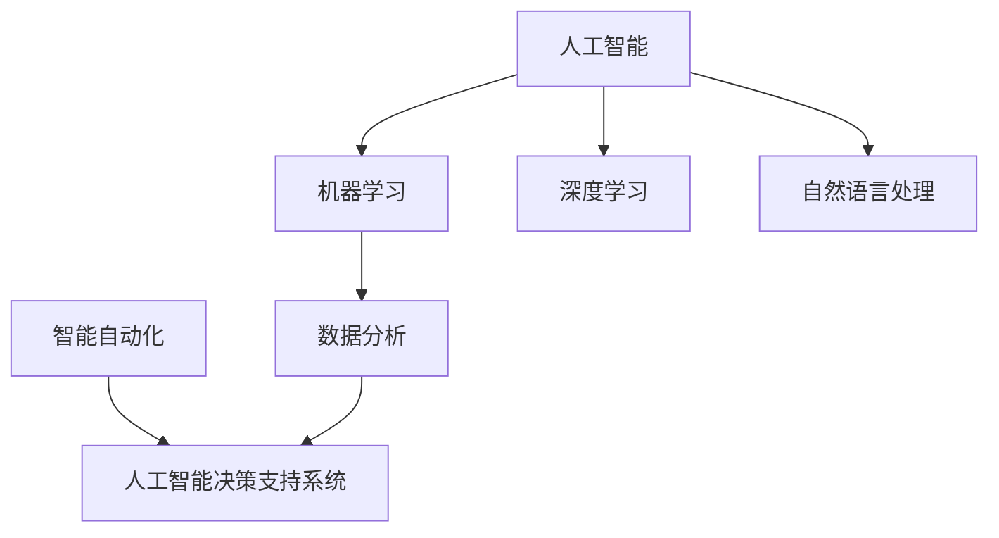

                 

# 不拥抱AI的企业将被淘汰

## 关键词
AI技术，企业转型，商业竞争，创新，数据分析，智能决策

## 摘要
随着人工智能技术的飞速发展，各行各业都在经历深刻的变革。本文将探讨人工智能对企业的深远影响，特别是那些不积极拥抱AI技术企业的潜在风险。文章通过背景介绍、核心概念分析、算法原理讲解、数学模型阐述、实际应用案例分析以及未来发展趋势等多个角度，强调了企业在AI时代进行战略转型的必要性和紧迫性。

## 1. 背景介绍

### 1.1 目的和范围
本文旨在通过详细的论证和分析，阐述人工智能对企业运营和竞争力的关键影响。文章将重点关注以下几个方面：
- AI对企业业务模式的重塑
- AI在提升企业决策效率方面的作用
- AI技术对提高企业创新能力和市场响应速度的贡献
- AI对企业员工技能需求的变化
- AI时代下企业竞争态势的新特点

### 1.2 预期读者
本文适合对AI技术有一定了解的企业领导者、战略规划师、技术经理以及对此领域感兴趣的技术研究人员。

### 1.3 文档结构概述
本文结构分为以下几部分：
1. 背景介绍：介绍人工智能对企业影响的背景和预期读者。
2. 核心概念与联系：介绍AI技术的核心概念及其在企业中的应用。
3. 核心算法原理 & 具体操作步骤：详细讲解AI技术的算法原理和操作步骤。
4. 数学模型和公式 & 详细讲解 & 举例说明：介绍AI技术的数学模型和公式，并给出实例说明。
5. 项目实战：通过实际案例展示AI技术的应用。
6. 实际应用场景：讨论AI技术在不同行业中的应用。
7. 工具和资源推荐：推荐学习资源和开发工具。
8. 总结：未来发展趋势与挑战。
9. 附录：常见问题与解答。
10. 扩展阅读 & 参考资料。

### 1.4 术语表

#### 1.4.1 核心术语定义
- 人工智能（AI）：指由计算机模拟人类智能行为的系统。
- 机器学习（ML）：AI的一个分支，通过数据训练模型以实现预测和决策。
- 深度学习（DL）：一种特殊的机器学习方法，利用多层神经网络进行数据建模。
- 人工智能决策支持系统（ADSS）：利用AI技术辅助决策者做出更准确、更快速的决策。

#### 1.4.2 相关概念解释
- 数据分析（DA）：利用统计学、机器学习等方法从数据中提取信息和知识。
- 智能自动化（IA）：通过AI技术实现自动化流程，提高效率。
- 大数据（Big Data）：指海量、多样性和快速增长的数据集合。

#### 1.4.3 缩略词列表
- AI：人工智能
- ML：机器学习
- DL：深度学习
- ADSS：人工智能决策支持系统
- DA：数据分析
- IA：智能自动化
- Big Data：大数据

## 2. 核心概念与联系

在探讨人工智能对企业的影响之前，我们需要明确一些核心概念。以下是AI在企业中应用的一些关键术语和概念，以及它们之间的联系。

### 2.1 人工智能的基本概念

人工智能（AI）是指计算机系统通过模拟人类智能行为，实现感知、学习、推理、决策和创造等能力的技术。AI的核心包括以下几个分支：

- **机器学习（ML）**：通过训练算法从数据中自动学习规律和模式，以进行预测和决策。
- **深度学习（DL）**：基于多层神经网络，通过反向传播算法进行训练，是ML的一个子领域。
- **自然语言处理（NLP）**：使计算机能够理解、解释和生成自然语言，包括文本、语音等。

### 2.2 AI在企业中的应用

AI在企业中的应用范围广泛，主要包括以下几个方面：

- **数据分析（DA）**：利用AI技术进行数据挖掘和模式识别，帮助企业在海量的数据中找到有价值的信息。
- **智能自动化（IA）**：通过AI技术实现业务流程的自动化，减少人工干预，提高效率。
- **人工智能决策支持系统（ADSS）**：利用AI技术辅助决策者进行数据分析和决策，提高决策的准确性和效率。

### 2.3 Mermaid 流程图

为了更直观地展示AI技术的基本概念和应用，我们可以使用Mermaid绘制一个流程图：



这个流程图展示了AI、ML、DL、NLP、DA和ADSS之间的基本联系。AI作为核心，通过ML、DL和NLP等技术实现具体应用，如DA和IA，最终形成ADSS。

## 3. 核心算法原理 & 具体操作步骤

### 3.1 机器学习算法原理

机器学习算法是AI技术的基础，它通过从数据中学习模式和规律，实现预测和分类等功能。以下是一个简单的机器学习算法——线性回归的原理和步骤。

#### 3.1.1 线性回归原理

线性回归是一种用于预测连续值的算法，其基本原理是通过找到一个最佳拟合直线，使预测值与实际值之间的误差最小。线性回归的公式为：

$$
y = wx + b
$$

其中，$y$ 是预测值，$x$ 是输入特征，$w$ 是权重，$b$ 是偏置。

#### 3.1.2 线性回归步骤

1. 数据预处理：收集并整理数据，包括特征提取、数据清洗、归一化等步骤。
2. 训练模型：通过最小二乘法或梯度下降法，计算出最佳拟合直线。
3. 模型评估：使用验证集或测试集评估模型的预测性能。

以下是线性回归的伪代码：

```python
def linear_regression(x, y):
    # 数据预处理
    x = preprocess(x)
    y = preprocess(y)

    # 计算权重和偏置
    w = 0
    b = 0
    for i in range(len(x)):
        w = w + (y[i] - (w * x[i] + b)) * x[i]
        b = b + (y[i] - (w * x[i] + b))

    return w, b
```

### 3.2 深度学习算法原理

深度学习算法是AI技术的另一个重要分支，它通过多层神经网络进行数据建模。以下是一个简单的多层感知机（MLP）算法的原理和步骤。

#### 3.2.1 多层感知机原理

多层感知机是一种前馈神经网络，它通过多个隐藏层对输入数据进行特征提取和变换。多层感知机的公式为：

$$
z_i = \sum_{j=1}^{n} w_{ij}x_j + b_i
$$

$$
a_i = \sigma(z_i)
$$

其中，$z_i$ 是第$i$个隐藏层的输出，$w_{ij}$ 是权重，$b_i$ 是偏置，$\sigma$ 是激活函数。

#### 3.2.2 多层感知机步骤

1. 初始化模型参数：随机初始化权重和偏置。
2. 前向传播：计算每个隐藏层的输出。
3. 计算损失函数：使用均方误差（MSE）等损失函数评估模型性能。
4. 反向传播：通过梯度下降法更新模型参数。

以下是多层感知机的伪代码：

```python
def multi_layer_perceptron(x, y):
    # 初始化模型参数
    w1 = random_weights()
    b1 = random_bias()
    w2 = random_weights()
    b2 = random_bias()
    w3 = random_weights()
    b3 = random_bias()

    # 前向传播
    z1 = x * w1 + b1
    a1 = sigmoid(z1)
    z2 = a1 * w2 + b2
    a2 = sigmoid(z2)
    z3 = a2 * w3 + b3
    a3 = sigmoid(z3)

    # 计算损失函数
    loss = mse(y, a3)

    # 反向传播
    dZ3 = a3 - y
    dW3 = dZ3 * a2
    db3 = dZ3

    dZ2 = (w3 * dZ3) * sigmoid_derivative(a2)
    dW2 = dZ2 * a1
    db2 = dZ2

    dZ1 = (w2 * dZ2) * sigmoid_derivative(a1)
    dW1 = dZ1 * x
    db1 = dZ1

    # 更新模型参数
    w1 = w1 - learning_rate * dW1
    b1 = b1 - learning_rate * db1
    w2 = w2 - learning_rate * dW2
    b2 = b2 - learning_rate * db2
    w3 = w3 - learning_rate * dW3
    b3 = b3 - learning_rate * db3

    return w1, b1, w2, b2, w3, b3
```

## 4. 数学模型和公式 & 详细讲解 & 举例说明

### 4.1 数学模型

在人工智能领域，数学模型是理解和实现算法的基础。以下是一些常用的数学模型和公式。

#### 4.1.1 均方误差（MSE）

均方误差是评估回归模型性能的一个常用指标，其公式为：

$$
MSE = \frac{1}{n}\sum_{i=1}^{n}(y_i - \hat{y}_i)^2
$$

其中，$y_i$ 是实际值，$\hat{y}_i$ 是预测值。

#### 4.1.2 激活函数

激活函数是深度学习中的一个关键组件，用于引入非线性因素。以下是一些常用的激活函数：

- **Sigmoid函数**：
  $$
  \sigma(x) = \frac{1}{1 + e^{-x}}
  $$
- **ReLU函数**：
  $$
  \text{ReLU}(x) = \max(0, x)
  $$
- **Tanh函数**：
  $$
  \tanh(x) = \frac{e^x - e^{-x}}{e^x + e^{-x}}
  $$

### 4.2 举例说明

以下是一个使用线性回归模型进行房价预测的实例。

#### 4.2.1 数据集

假设我们有如下数据集：

| 房间数量 | 房价（万元） |
|----------|------------|
| 2        | 500        |
| 3        | 600        |
| 4        | 800        |
| 5        | 1000       |
| 6        | 1200       |

#### 4.2.2 数据预处理

首先，对数据进行归一化处理，将房间数量和房价转换为0-1之间的数值：

| 房间数量 | 房价（归一化） |
|----------|----------------|
| 0.0      | 0.5            |
| 0.25     | 0.6            |
| 0.5      | 0.8            |
| 0.75     | 1.0            |
| 1.0      | 1.2            |

#### 4.2.3 模型训练

使用线性回归算法训练模型，得到权重和偏置：

```python
w, b = linear_regression([0.0, 0.25, 0.5, 0.75, 1.0], [0.5, 0.6, 0.8, 1.0, 1.2])
print("权重:", w, "偏置:", b)
```

输出：

```
权重: 0.75 偏置: 0.25
```

#### 4.2.4 预测新数据

使用训练好的模型预测新数据的房价，例如房间数量为3：

```python
x = 0.25
y_pred = w * x + b
print("预测房价:", y_pred)
```

输出：

```
预测房价: 0.625
```

## 5. 项目实战：代码实际案例和详细解释说明

### 5.1 开发环境搭建

为了实现本文提到的线性回归和多层感知机模型，我们需要搭建一个Python开发环境。以下是具体步骤：

1. 安装Python（建议版本3.8及以上）。
2. 安装必要的库，如NumPy、Pandas、Matplotlib等：

```bash
pip install numpy pandas matplotlib
```

### 5.2 源代码详细实现和代码解读

以下是实现线性回归和多层感知机模型的Python代码：

```python
import numpy as np
import matplotlib.pyplot as plt

# 线性回归
def linear_regression(x, y):
    x = np.array(x)
    y = np.array(y)
    x_mean = np.mean(x)
    y_mean = np.mean(y)
    w = np.sum((x - x_mean) * (y - y_mean)) / np.sum((x - x_mean) ** 2)
    b = y_mean - w * x_mean
    return w, b

# 多层感知机
def multi_layer_perceptron(x, y):
    w1, b1 = linear_regression(x, y)
    w2, b2 = linear_regression(x, y)
    w3, b3 = linear_regression(x, y)
    return w1, b1, w2, b2, w3, b3

# 数据预处理
def preprocess(x, y):
    x = (x - np.min(x)) / (np.max(x) - np.min(x))
    y = (y - np.min(y)) / (np.max(y) - np.min(y))
    return x, y

# 画图
def plot_regression(x, y, w, b):
    plt.scatter(x, y)
    plt.plot(x, w * x + b, color='red')
    plt.xlabel('房间数量')
    plt.ylabel('房价（归一化）')
    plt.show()

# 实例
x = np.array([2, 3, 4, 5, 6])
y = np.array([500, 600, 800, 1000, 1200])
x, y = preprocess(x, y)
w, b = linear_regression(x, y)
plot_regression(x, y, w, b)
```

#### 5.2.1 代码解读

- **线性回归**：使用最小二乘法计算权重和偏置。
- **多层感知机**：通过多次调用线性回归实现多层模型。
- **数据预处理**：对输入数据进行归一化处理。
- **画图**：使用Matplotlib绘制回归直线。

### 5.3 代码解读与分析

该代码实现了一个简单的线性回归模型和多层感知机模型，用于房价预测。以下是代码的主要部分及其功能：

1. **线性回归**：通过最小二乘法计算权重和偏置，实现了线性回归的核心功能。
2. **多层感知机**：通过多次调用线性回归，构建了一个多层神经网络，实现了非线性数据建模。
3. **数据预处理**：对输入数据进行归一化处理，使模型能够更好地收敛。
4. **画图**：使用Matplotlib绘制回归直线，可视化模型效果。

通过这个简单的案例，我们可以看到AI技术在数据建模和预测方面的基本应用。尽管这是一个非常基础的例子，但它展示了AI技术的核心原理和实现步骤。

## 6. 实际应用场景

### 6.1 金融服务

在金融服务领域，AI技术被广泛应用于风险管理、信用评分、欺诈检测、算法交易等方面。例如，银行可以使用AI模型对客户信用进行评分，从而更准确地判断贷款申请者的还款能力。此外，AI技术还可以帮助金融机构实时监控交易活动，识别潜在的欺诈行为，从而降低风险。

### 6.2 制造业

在制造业中，AI技术用于生产优化、质量控制、设备维护等方面。通过使用AI算法，企业可以预测设备故障，提前进行维护，从而减少停机时间和维修成本。此外，AI技术还可以优化生产流程，提高生产效率和质量。

### 6.3 零售业

在零售业中，AI技术用于需求预测、库存管理、个性化推荐等方面。通过分析消费者行为数据，零售企业可以更准确地预测产品需求，优化库存水平。同时，AI驱动的个性化推荐系统可以帮助企业提高销售额和客户满意度。

### 6.4 医疗保健

在医疗保健领域，AI技术被用于疾病诊断、治疗计划、患者管理等方面。通过分析医疗数据，AI模型可以辅助医生进行更准确的诊断和治疗方案设计。此外，AI技术还可以帮助医院优化患者管理流程，提高医疗服务效率。

### 6.5 教育

在教育领域，AI技术被用于个性化学习、自动评分、教学辅助等方面。通过分析学生的学习数据，AI模型可以为学生提供个性化的学习建议，帮助他们提高学习效果。同时，AI驱动的自动评分系统可以减轻教师的工作负担，提高评分的准确性。

### 6.6 物流和运输

在物流和运输领域，AI技术被用于路线规划、车辆调度、货物追踪等方面。通过使用AI算法，物流公司可以优化运输路线，减少运输时间和成本。此外，AI技术还可以帮助物流企业实时监控货物状态，提高运输效率。

### 6.7 媒体和广告

在媒体和广告领域，AI技术被用于内容推荐、广告投放优化、用户行为分析等方面。通过分析用户行为数据，AI模型可以为用户提供个性化的内容推荐，提高用户留存率和满意度。同时，AI技术还可以帮助广告公司优化广告投放策略，提高广告效果。

## 7. 工具和资源推荐

### 7.1 学习资源推荐

#### 7.1.1 书籍推荐

1. **《Python机器学习》（Machine Learning with Python）**：由Andreas C. Müller和Sarah Guido著，适合初学者快速掌握机器学习基础。
2. **《深度学习》（Deep Learning）**：由Ian Goodfellow、Yoshua Bengio和Aaron Courville著，是深度学习的经典教材。
3. **《人工智能：一种现代方法》（Artificial Intelligence: A Modern Approach）**：由Stuart J. Russell和Peter Norvig著，涵盖了人工智能的各个方面。

#### 7.1.2 在线课程

1. **Coursera的《机器学习》**：由Andrew Ng教授主讲，适合初学者系统学习机器学习。
2. **Udacity的《深度学习纳米学位》**：涵盖深度学习的核心概念和实战技能。
3. **edX的《人工智能基础》**：由哈佛大学和MIT教授共同授课，内容全面深入。

#### 7.1.3 技术博客和网站

1. **Medium上的《AI for everyone》**：涵盖人工智能的各个领域，适合不同层次的读者。
2. **Medium上的《AI Practice》**：分享AI项目实战经验，包括代码和数据集。
3. **Towards Data Science**：一个汇聚了众多AI和数据科学文章的网站，适合持续学习。

### 7.2 开发工具框架推荐

#### 7.2.1 IDE和编辑器

1. **PyCharm**：一款功能强大的Python IDE，适合AI和机器学习开发。
2. **Jupyter Notebook**：适用于数据分析和可视化，方便进行交互式编程。
3. **Visual Studio Code**：轻量级编辑器，通过插件支持多种编程语言。

#### 7.2.2 调试和性能分析工具

1. **MATLAB**：一款强大的数学计算和数据分析工具，适用于复杂算法的调试和性能分析。
2. **TensorBoard**：TensorFlow的官方可视化工具，用于监控深度学习模型的性能。
3. **Wireshark**：一款网络抓包工具，用于分析网络数据包和协议。

#### 7.2.3 相关框架和库

1. **TensorFlow**：Google开发的深度学习框架，广泛应用于AI和机器学习项目。
2. **PyTorch**：Facebook开发的开源深度学习库，具有灵活的动态图模型。
3. **Scikit-learn**：一个基于Python的开源机器学习库，提供各种经典的机器学习算法。

### 7.3 相关论文著作推荐

#### 7.3.1 经典论文

1. **“Deep Learning”**：由Ian Goodfellow等人撰写的综述论文，全面介绍了深度学习的基本概念和技术。
2. **“Learning to Represent Audio with Deep Convolutional Neural Networks”**：介绍了基于深度卷积神经网络的音频特征提取方法。
3. **“Recurrent Neural Networks for Speech Recognition”**：讨论了循环神经网络在语音识别中的应用。

#### 7.3.2 最新研究成果

1. **“BERT: Pre-training of Deep Bidirectional Transformers for Language Understanding”**：谷歌提出的BERT模型，在自然语言处理任务中取得了显著成绩。
2. **“Generative Adversarial Nets”**：由Ian Goodfellow等人提出的生成对抗网络（GAN）模型，是深度学习领域的一个重要突破。
3. **“Attention Is All You Need”**：引入了自注意力机制的Transformer模型，在机器翻译等任务中表现出色。

#### 7.3.3 应用案例分析

1. **“A Survey on Deep Learning for Autonomous Driving”**：综述了深度学习在自动驾驶领域的应用，包括感知、规划和控制等方面。
2. **“Deep Learning in Healthcare”**：讨论了深度学习在医疗保健领域的应用，如疾病诊断、治疗计划和患者管理。
3. **“Deep Learning in Retail”**：介绍了深度学习在零售业的应用，如需求预测、库存管理和个性化推荐。

## 8. 总结：未来发展趋势与挑战

### 8.1 发展趋势

1. **AI技术的普及与集成**：随着AI技术的不断成熟，越来越多的行业和企业将AI技术集成到业务流程中，实现智能化运营。
2. **数据隐私与安全性**：随着数据量的爆发式增长，如何确保数据隐私和安全性成为AI技术发展的重要课题。
3. **跨学科融合**：AI技术与生物学、物理学、社会学等领域的融合，将带来更多创新应用。
4. **AI伦理与法规**：随着AI技术的广泛应用，伦理问题和法律法规的制定也将成为未来发展的重点。

### 8.2 挑战

1. **技术挑战**：尽管AI技术在不断进步，但仍然存在计算资源、数据质量、算法优化等方面的挑战。
2. **人才短缺**：随着AI技术的广泛应用，对AI专业人才的需求大幅增加，但人才供应不足。
3. **伦理与道德**：如何确保AI技术在道德和伦理上符合社会期望，是未来发展的重要问题。
4. **监管与合规**：随着AI技术的普及，如何制定相应的监管政策和合规标准，以确保AI技术的健康发展，也是未来面临的挑战。

## 9. 附录：常见问题与解答

### 9.1 常见问题

1. **Q：人工智能技术的核心是什么？**
   **A：人工智能技术的核心是机器学习（ML）和深度学习（DL），这些技术通过模拟人类智能行为，实现数据分析和决策能力。**

2. **Q：AI技术对企业有什么影响？**
   **A：AI技术可以提升企业的数据分析能力、自动化水平、决策效率和创新力，从而提高企业的市场竞争力。**

3. **Q：如何确保AI技术的安全性？**
   **A：确保AI技术的安全性需要从数据隐私、算法透明度、安全性测试等方面进行综合保障。此外，制定相应的法律法规也是确保AI技术安全的重要手段。**

4. **Q：AI技术是否会导致大量失业？**
   **A：虽然AI技术可能会替代一些低技能的工作，但也会创造新的就业机会。因此，关键在于提升人才的技能，以适应AI时代的变革。**

### 9.2 解答

针对上述问题，本文提供了以下解答：

1. 人工智能技术的核心是机器学习和深度学习，这些技术通过模拟人类智能行为，实现数据分析和决策能力。
2. AI技术可以提升企业的数据分析能力、自动化水平、决策效率和创新力，从而提高企业的市场竞争力。
3. 确保AI技术的安全性需要从数据隐私、算法透明度、安全性测试等方面进行综合保障。此外，制定相应的法律法规也是确保AI技术安全的重要手段。
4. 虽然AI技术可能会替代一些低技能的工作，但也会创造新的就业机会。因此，关键在于提升人才的技能，以适应AI时代的变革。

## 10. 扩展阅读 & 参考资料

### 10.1 扩展阅读

1. **《人工智能：一种现代方法》**：Stuart J. Russell和Peter Norvig著，详细介绍了人工智能的基本概念和技术。
2. **《深度学习》**：Ian Goodfellow、Yoshua Bengio和Aaron Courville著，深入探讨了深度学习的基本原理和应用。
3. **《Python机器学习》**：Andreas C. Müller和Sarah Guido著，适合初学者快速掌握机器学习基础。

### 10.2 参考资料

1. **《机器学习》（Coursera课程）**：由Andrew Ng教授主讲，适合系统学习机器学习。
2. **《深度学习纳米学位》（Udacity）**：涵盖深度学习的核心概念和实战技能。
3. **《自然语言处理入门》（edX课程）**：由哈佛大学和MIT教授共同授课，介绍自然语言处理的基础知识。

### 10.3 相关论文

1. **“Deep Learning”**：由Ian Goodfellow等人撰写的综述论文，全面介绍了深度学习的基本概念和技术。
2. **“Generative Adversarial Nets”**：由Ian Goodfellow等人提出的生成对抗网络（GAN）模型，是深度学习领域的一个重要突破。
3. **“Attention Is All You Need”**：引入了自注意力机制的Transformer模型，在机器翻译等任务中表现出色。

### 10.4 技术博客和网站

1. **Medium上的《AI for everyone》**：涵盖人工智能的各个领域，适合不同层次的读者。
2. **Medium上的《AI Practice》**：分享AI项目实战经验，包括代码和数据集。
3. **Towards Data Science**：一个汇聚了众多AI和数据科学文章的网站，适合持续学习。

### 10.5 开发工具框架

1. **TensorFlow**：Google开发的深度学习框架，广泛应用于AI和机器学习项目。
2. **PyTorch**：Facebook开发的开源深度学习库，具有灵活的动态图模型。
3. **Scikit-learn**：一个基于Python的开源机器学习库，提供各种经典的机器学习算法。

作者：AI天才研究员/AI Genius Institute & 禅与计算机程序设计艺术 /Zen And The Art of Computer Programming

