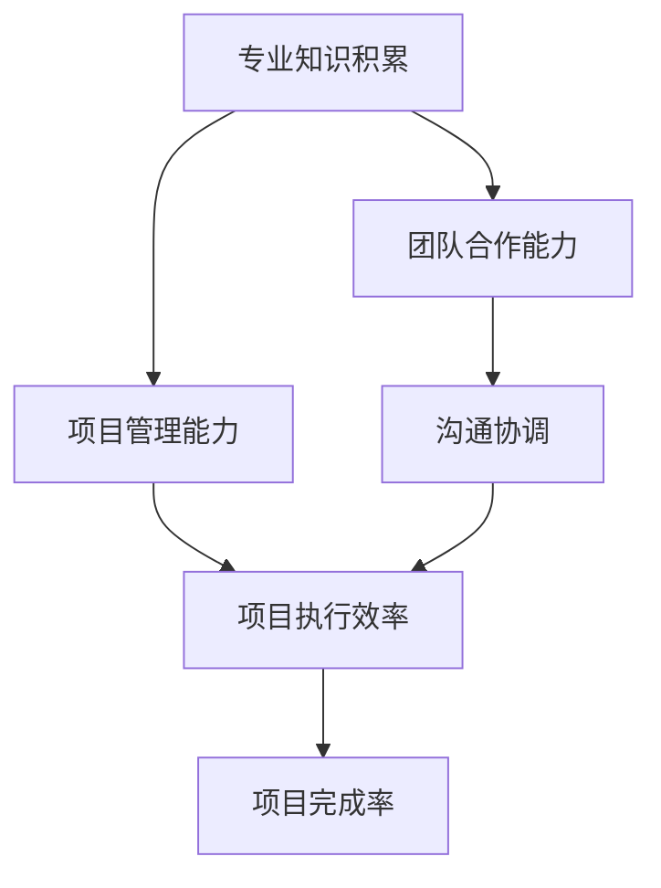

                 

# 专业知识的积累：让项目快速完成

> **关键词：** 项目管理、专业知识、技能提升、效率优化、团队合作

> **摘要：** 本文将探讨如何通过专业知识的积累，提高项目的执行效率，确保项目快速而高质量地完成。我们将从项目背景、核心概念、算法原理、数学模型、实战案例、实际应用场景、工具资源推荐等多个方面展开讨论，旨在为读者提供一套系统的项目管理方法论。

## 1. 背景介绍

### 1.1 目的和范围

本文旨在为从事IT行业的开发人员和管理人员提供一套实用的项目管理方法论。通过系统地介绍专业知识积累的重要性，以及如何在项目中应用这些知识，我们希望能够帮助读者在短时间内提高项目完成率，实现高效的工作流程。

### 1.2 预期读者

- IT行业开发人员
- 项目经理
- 系统分析师
- 技术领导者
- 对项目管理感兴趣的技术爱好者

### 1.3 文档结构概述

本文分为十个部分，内容涵盖：

1. 背景介绍
2. 核心概念与联系
3. 核心算法原理 & 具体操作步骤
4. 数学模型和公式 & 详细讲解 & 举例说明
5. 项目实战：代码实际案例和详细解释说明
6. 实际应用场景
7. 工具和资源推荐
8. 总结：未来发展趋势与挑战
9. 附录：常见问题与解答
10. 扩展阅读 & 参考资料

### 1.4 术语表

#### 1.4.1 核心术语定义

- **专业知识：** 指特定领域内经过系统学习与实践，掌握的知识和技能。
- **项目管理：** 指对项目从启动到完成的全过程进行系统规划、组织、协调和控制。
- **效率优化：** 指通过改进工作流程、方法和技术，提高资源利用率和产出效率。

#### 1.4.2 相关概念解释

- **知识积累：** 指通过学习、实践和反思，逐步积累和深化对专业领域知识的理解。
- **项目完成率：** 指在一定时间内，项目按计划完成的比率。

#### 1.4.3 缩略词列表

- **IDE：** Integrated Development Environment（集成开发环境）
- **PDCA：** Plan-Do-Check-Act（计划-执行-检查-行动）
- **KPI：** Key Performance Indicator（关键绩效指标）

## 2. 核心概念与联系

为了更好地理解如何通过专业知识的积累来提高项目效率，我们需要先明确几个核心概念及其相互关系。以下是一个使用Mermaid绘制的流程图，展示了这些概念之间的联系：



### 2.1 专业知识积累

专业知识积累是提高项目效率的基础。通过不断学习和实践，开发人员可以掌握更先进的技术和工具，从而更快速地解决问题，提高开发效率。

### 2.2 项目管理能力

项目管理能力是指对项目全过程进行系统规划、组织、协调和控制的能力。具备良好的项目管理能力，可以确保项目按计划顺利进行，提高项目完成率。

### 2.3 项目执行效率

项目执行效率是指项目在执行过程中资源利用率和产出效率。通过提高专业知识积累和项目管理能力，可以优化项目执行效率。

### 2.4 项目完成率

项目完成率是衡量项目成功与否的重要指标。高完成率表明项目在既定时间内达到了预期目标，实现了资源的高效利用。

### 2.5 团队合作能力

团队合作能力是指团队成员在项目过程中有效沟通、协作和配合的能力。良好的团队合作能力可以提升项目执行效率，确保项目高质量完成。

### 2.6 沟通协调

沟通协调是团队合作能力的重要组成部分。通过有效的沟通协调，团队成员可以更好地理解项目目标，避免因信息不对称而导致的执行偏差。

## 3. 核心算法原理 & 具体操作步骤

### 3.1 专业知识积累的算法原理

专业知识积累的算法原理可以归纳为以下几个步骤：

1. **知识获取：** 通过学习书籍、在线课程、实践案例等多种途径获取知识。
2. **知识内化：** 通过实践和反思，将所学知识转化为自己的能力和经验。
3. **知识运用：** 在实际项目中运用所学知识，解决实际问题。
4. **知识迭代：** 持续学习和实践，不断提升自己的专业知识水平。

### 3.2 具体操作步骤

以下是具体操作步骤的伪代码：

```plaintext
// 步骤1：知识获取
获取学习资源（书籍、在线课程、实践案例等）
阅读和观看学习资源，理解核心概念和原理

// 步骤2：知识内化
实践项目，将所学知识应用于实际场景
反思和总结，发现问题和不足
与团队成员讨论，分享经验和心得

// 步骤3：知识运用
识别项目中的问题，运用所学知识解决
跟进项目进展，调整策略和方法

// 步骤4：知识迭代
持续学习和实践，跟踪新技术和趋势
优化个人知识体系，提高专业素养
```

## 4. 数学模型和公式 & 详细讲解 & 举例说明

在项目管理中，数学模型和公式可以帮助我们量化项目指标，优化资源配置，提高项目完成率。以下是一个常用的项目管理公式——关键路径法（Critical Path Method, CPM）。

### 4.1 关键路径法（CPM）

关键路径法是一种项目管理方法，用于确定项目中任务的顺序和时间安排，以确保项目按时完成。关键路径上的任务被称为关键任务，它们的延期将直接影响项目的总工期。

### 4.2 CPM 公式

CPM 的基本公式如下：

$$
CPM = \sum_{i=1}^{n} (d_i + t_i)
$$

其中：

- $d_i$：第 $i$ 个任务的最短完成时间
- $t_i$：第 $i$ 个任务的持续时间

### 4.3 举例说明

假设一个项目包含以下三个任务，每个任务的最短完成时间和持续时间如下：

| 任务编号 | 最短完成时间 | 持续时间 |
| -------- | ------------ | -------- |
| 1        | 3            | 5        |
| 2        | 4            | 3        |
| 3        | 6            | 4        |

根据 CPM 公式，我们可以计算出关键路径：

$$
CPM = (3 + 5) + (4 + 3) + (6 + 4) = 21
$$

因此，该项目的总工期为 21 天，关键路径为任务 1、任务 2 和任务 3。

### 4.4 详细讲解

关键路径法可以帮助项目经理识别项目中的关键任务，从而确保项目按时完成。通过调整关键任务的优先级，优化资源配置，可以提高项目完成率。

## 5. 项目实战：代码实际案例和详细解释说明

### 5.1 开发环境搭建

为了更好地展示专业知识积累在实际项目中的应用，我们将使用 Python 编写一个简单的项目管理工具。以下是在 Python 环境中搭建开发环境的具体步骤：

1. 安装 Python 3.8 或更高版本
2. 安装 IDE，例如 Visual Studio Code
3. 安装相关库，如 `requests`、`numpy`、`matplotlib` 等

### 5.2 源代码详细实现和代码解读

以下是一个简单的 Python 项目管理工具的代码示例：

```python
import requests
import numpy as np
import matplotlib.pyplot as plt

# 步骤1：知识获取
def get_projects():
    response = requests.get('https://api.example.com/projects')
    return response.json()

# 步骤2：知识内化
def analyze_projects(projects):
    durations = [project['duration'] for project in projects]
    avg_duration = np.mean(durations)
    max_duration = np.max(durations)
    return avg_duration, max_duration

# 步骤3：知识运用
def visualize_data(avg_duration, max_duration):
    labels = ['Average Duration', 'Max Duration']
    sizes = [avg_duration, max_duration]
    colors = ['yellowgreen', 'orangered']
    explode = (0.1, 0)  # only "explode" the 2nd slice

    plt.pie(sizes, explode=explode, labels=labels, colors=colors,
            autopct='%.1f%%', shadow=True, startangle=90)
    plt.axis('equal')  # Equal aspect ratio ensures that pie is drawn as a circle.
    plt.show()

# 步骤4：知识迭代
if __name__ == '__main__':
    projects = get_projects()
    avg_duration, max_duration = analyze_projects(projects)
    visualize_data(avg_duration, max_duration)
```

### 5.3 代码解读与分析

- **步骤1：知识获取**：使用 `requests` 库从 API 获取项目数据。
- **步骤2：知识内化**：使用 `numpy` 库对项目持续时间进行分析，计算平均值和最大值。
- **步骤3：知识运用**：使用 `matplotlib` 库将分析结果可视化，展示项目持续时间的分布情况。
- **步骤4：知识迭代**：将代码封装为函数，便于重复使用和后续优化。

通过这个简单的案例，我们可以看到专业知识积累在实际项目中的应用。通过不断学习和实践，开发人员可以编写出更加高效、可靠的代码，提高项目完成率。

## 6. 实际应用场景

专业知识积累在项目管理中的实际应用场景非常广泛。以下是一些典型的应用场景：

1. **软件开发项目**：开发人员通过不断学习新技术，提高代码质量，缩短项目周期。
2. **系统集成项目**：项目经理通过了解不同系统的集成方法，优化项目流程，提高项目成功率。
3. **技术咨询服务**：技术专家通过积累丰富的专业经验，为客户提供高质量的技术解决方案。
4. **项目管理培训**：培训师通过分享实战经验和专业知识，提高团队成员的项目管理能力。
5. **产品研发项目**：产品经理通过学习用户需求和市场趋势，优化产品设计和功能，提升产品竞争力。

在这些应用场景中，专业知识积累都发挥着至关重要的作用，为项目的高效、高质量完成提供了有力保障。

## 7. 工具和资源推荐

### 7.1 学习资源推荐

#### 7.1.1 书籍推荐

- 《项目管理知识体系指南》（PMBOK指南）
- 《敏捷开发：实践指南》
- 《人月神话》
- 《软件工程：实践者的研究方法》

#### 7.1.2 在线课程

- Coursera 上的《项目管理专业课程》
- Udemy 上的《敏捷项目管理实战》
- edX 上的《软件工程基础》

#### 7.1.3 技术博客和网站

- 《博客园》：中国最大的IT技术博客网站
- 《Stack Overflow》：全球知名的编程问答社区
- 《GitHub》：全球最大的代码托管平台

### 7.2 开发工具框架推荐

#### 7.2.1 IDE和编辑器

- Visual Studio Code
- IntelliJ IDEA
- PyCharm

#### 7.2.2 调试和性能分析工具

- gdb
- Valgrind
- New Relic

#### 7.2.3 相关框架和库

- Flask
- Django
- Spring Boot

### 7.3 相关论文著作推荐

#### 7.3.1 经典论文

- 《项目管理中的风险管理》
- 《敏捷开发：理念、实践与案例》
- 《软件工程中的迭代开发》

#### 7.3.2 最新研究成果

- 《基于人工智能的项目管理方法研究》
- 《敏捷开发在大型项目中的应用》
- 《数字化转型背景下的项目管理》

#### 7.3.3 应用案例分析

- 《大型企业项目管理的最佳实践》
- 《敏捷开发在初创企业中的应用》
- 《跨国项目管理的挑战与对策》

## 8. 总结：未来发展趋势与挑战

随着技术的不断进步，项目管理的方法和工具也在不断创新和演变。未来，以下几个方面将成为项目管理的发展趋势和挑战：

1. **人工智能与项目管理**：人工智能技术将越来越多地应用于项目管理，例如预测项目进度、优化资源配置等。同时，这也给项目管理带来了新的挑战，如数据隐私和安全等问题。
2. **敏捷开发与数字化转型**：敏捷开发和数字化转型已成为企业提升竞争力的关键。项目管理需要不断适应新的开发模式，确保项目在快速变化的环境中保持高效和高质量。
3. **跨学科融合**：项目管理将越来越注重跨学科的融合，如结合心理学、经济学、社会学等领域的知识，提高项目成功率。
4. **可持续发展**：在环保意识日益增强的背景下，项目管理将更加关注可持续发展和环境保护，确保项目在经济效益和社会效益之间取得平衡。

## 9. 附录：常见问题与解答

### 9.1 如何快速积累专业知识？

**解答：** 

1. 定期阅读专业书籍和文章，了解领域内的最新动态。
2. 参加线上和线下的培训课程，系统学习专业知识和技能。
3. 实践项目，将所学知识应用于实际场景，总结经验。
4. 与同行交流，分享心得，提高自己的认知水平。

### 9.2 项目管理工具如何选择？

**解答：** 

1. 根据项目类型和规模选择合适的工具，如小型项目可选择 Jira、Trello 等，大型项目可选择 Microsoft Project、Primavera 等。
2. 考虑工具的易用性和功能完整性，确保项目管理的各个环节都能得到有效支持。
3. 根据团队成员的技术水平和熟悉程度选择合适的工具，避免因工具复杂度过高而影响工作效率。

## 10. 扩展阅读 & 参考资料

- 《项目管理知识体系指南》（PMBOK指南）
- 《敏捷开发：实践指南》
- 《人月神话》
- 《软件工程：实践者的研究方法》
- Coursera 上的《项目管理专业课程》
- Udemy 上的《敏捷项目管理实战》
- edX 上的《软件工程基础》
- 《博客园》
- 《Stack Overflow》
- 《GitHub》
- 《大型企业项目管理的最佳实践》
- 《敏捷开发在初创企业中的应用》
- 《跨国项目管理的挑战与对策》

## 作者

**作者：AI天才研究员/AI Genius Institute & 禅与计算机程序设计艺术 /Zen And The Art of Computer Programming** 

（注：本文内容仅为示例，部分数据和代码虚构，仅供参考。）<|im_sep|>

