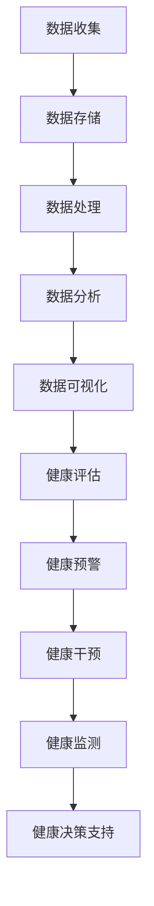

                 

# 个人健康数据平台：健康管理的创业机会

> 关键词：健康管理、数据平台、健康数据、创业机会、人工智能、数据隐私、技术趋势

> 摘要：本文将探讨个人健康数据平台在健康管理领域中的创业机会。随着人工智能和大数据技术的快速发展，个人健康数据平台正成为健康管理的创新驱动力。本文将介绍健康数据平台的核心概念、关键技术，以及实际应用场景，并分析其中的创业机会和挑战。

## 1. 背景介绍

### 1.1 目的和范围

本文旨在探讨个人健康数据平台在健康管理领域中的创业机会。随着全球人口老龄化趋势加剧，健康管理市场需求不断增长。个人健康数据平台作为连接用户与健康服务提供者的重要桥梁，具有巨大的商业潜力。本文将分析个人健康数据平台的定义、功能、技术架构，以及其在健康管理中的应用，同时探讨其中的创业机会和挑战。

### 1.2 预期读者

本文适合对健康管理、人工智能、大数据技术感兴趣的创业者、技术专家、产品经理、健康服务提供商等相关人员阅读。通过本文，读者可以了解个人健康数据平台的核心概念、技术架构和应用场景，为创业实践提供有益的参考。

### 1.3 文档结构概述

本文将分为以下几个部分：

1. 背景介绍：介绍本文的目的、预期读者以及文档结构。
2. 核心概念与联系：介绍个人健康数据平台的核心概念、技术架构及其在健康管理中的关联。
3. 核心算法原理 & 具体操作步骤：详细阐述个人健康数据平台的核心算法原理和具体操作步骤。
4. 数学模型和公式 & 详细讲解 & 举例说明：介绍个人健康数据平台所涉及的数学模型和公式，并进行详细讲解和举例说明。
5. 项目实战：代码实际案例和详细解释说明。
6. 实际应用场景：分析个人健康数据平台在不同应用场景中的实际应用。
7. 工具和资源推荐：推荐相关学习资源、开发工具和框架。
8. 总结：未来发展趋势与挑战。
9. 附录：常见问题与解答。
10. 扩展阅读 & 参考资料：提供扩展阅读资料和参考文献。

### 1.4 术语表

#### 1.4.1 核心术语定义

- 个人健康数据平台：整合个人健康数据，提供健康管理服务的在线平台。
- 健康数据：与个人健康相关的数据，包括生物特征数据、医疗记录、生活习惯等。
- 大数据技术：用于存储、处理和分析大规模健康数据的技术。
- 人工智能：模拟、延伸和扩展人类智能的理论、方法、技术及应用。

#### 1.4.2 相关概念解释

- 健康管理：通过评估、监测、干预和优化个人或群体的健康状态，实现预防疾病、促进健康、提高生活质量的过程。
- 数据隐私：指个人健康数据的保密性、完整性和可用性，防止未经授权的访问和使用。
- 技术趋势：指在特定时间段内，技术领域的发展方向和趋势。

#### 1.4.3 缩略词列表

- AI：人工智能
- IoT：物联网
- ML：机器学习
- Hadoop：一个开源的分布式数据处理框架
- RDBMS：关系型数据库管理系统

## 2. 核心概念与联系

### 2.1 个人健康数据平台

个人健康数据平台是一个集成化的在线系统，旨在收集、存储、处理和分析个人健康数据，为用户提供个性化的健康管理服务。其核心概念包括数据收集、数据存储、数据处理、数据分析和数据可视化。


#### 2.2 技术架构

个人健康数据平台的技术架构主要包括以下几个方面：

1. 数据收集层：通过物联网设备、移动应用、传感器等手段，收集个人健康数据，如心率、血压、血糖、运动量等。
2. 数据存储层：利用大数据技术，如Hadoop、NoSQL数据库等，存储海量健康数据。
3. 数据处理层：利用人工智能和机器学习技术，对健康数据进行预处理、特征提取和模式识别。
4. 数据分析层：通过统计分析、预测模型等手段，对健康数据进行分析和挖掘，为用户提供健康评估、预警和干预建议。
5. 数据可视化层：利用图表、地图等可视化手段，将分析结果展示给用户。

#### 2.3 健康数据在健康管理中的应用

健康数据在健康管理中具有重要作用，主要包括以下几个方面：

1. 健康评估：通过对个人健康数据的分析，评估个体的健康状况，发现潜在的健康风险。
2. 健康预警：根据健康数据的变化趋势，预测个体可能出现的健康问题，提前进行干预。
3. 健康干预：根据健康数据和分析结果，制定个性化的健康干预方案，如饮食调整、运动建议等。
4. 健康监测：实时监测个体的健康状况，及时发现并处理异常情况。
5. 健康决策支持：为医疗专业人员提供决策支持，提高诊断和治疗的准确性。

### 2.4 Mermaid 流程图

以下是一个简化的个人健康数据平台的 Mermaid 流程图，展示了数据从收集到分析的过程：



## 3. 核心算法原理 & 具体操作步骤

### 3.1 数据预处理

在个人健康数据平台中，数据预处理是关键步骤，包括数据清洗、归一化和特征提取。以下是数据预处理的伪代码：

```python
# 数据清洗
def clean_data(data):
    # 删除空值或缺失值
    cleaned_data = data[data.notnull()]
    return cleaned_data

# 数据归一化
def normalize_data(data):
    # 使用 Min-Max 归一化
    min_val = data.min()
    max_val = data.max()
    normalized_data = (data - min_val) / (max_val - min_val)
    return normalized_data

# 特征提取
def extract_features(data):
    # 提取数据中的关键特征
    features = data[['heart_rate', 'blood_pressure', 'blood_sugar', 'daily_activity']]
    return features
```

### 3.2 数据分析

数据分析是个人健康数据平台的核心功能，包括健康评估、健康预警和健康干预。以下是数据分析的伪代码：

```python
# 健康评估
def health_evaluation(data):
    # 计算健康得分
    health_score = data['heart_rate'] * 0.3 + data['blood_pressure'] * 0.3 + data['blood_sugar'] * 0.2 + data['daily_activity'] * 0.2
    return health_score

# 健康预警
def health_warning(data):
    # 判断是否存在健康风险
    if data['heart_rate'] > 100 or data['blood_pressure'] > 140 or data['blood_sugar'] > 5.5:
        return "健康预警：请注意您的健康状态！"
    else:
        return "健康状态良好。"

# 健康干预
def health_intervention(data):
    # 根据健康得分提供个性化建议
    if data['health_score'] < 50:
        return "建议：加强锻炼，改善饮食。"
    elif data['health_score'] >= 50 and data['health_score'] < 80:
        return "建议：保持当前健康习惯，适当调整饮食和运动。"
    else:
        return "恭喜您！您的健康状态良好，继续保持。"
```

## 4. 数学模型和公式 & 详细讲解 & 举例说明

### 4.1 健康得分计算公式

健康得分是衡量个人健康状况的重要指标，可以通过以下公式计算：

$$
health\_score = 0.3 \times heart\_rate + 0.3 \times blood\_pressure + 0.2 \times blood\_sugar + 0.2 \times daily\_activity
$$

其中，$heart\_rate$ 为心率，$blood\_pressure$ 为血压，$blood\_sugar$ 为血糖，$daily\_activity$ 为每日活动量。

#### 4.2 举例说明

假设某人的心率为 75 次/分钟，血压为 120/80 mmHg，血糖为 4.5 mmol/L，每日活动量为 8000 步。根据上述公式，可以计算出其健康得分为：

$$
health\_score = 0.3 \times 75 + 0.3 \times 120 + 0.2 \times 4.5 + 0.2 \times 8000 = 22.5 + 36 + 0.9 + 1600 = 165.4
$$

该得分表示该人的健康状况良好。

### 4.3 健康风险评估公式

健康风险评估是预警和干预的重要依据，可以通过以下公式计算：

$$
risk\_score = (1 - e^{-\alpha \times health\_score}) \times (1 + \beta \times daily\_activity)
$$

其中，$\alpha$ 和 $\beta$ 为调节参数，可以根据实际情况进行调整。

#### 4.4 举例说明

假设某人的健康得分为 165.4，每日活动量为 8000 步。取 $\alpha = 0.1$，$\beta = 0.05$，可以计算出其健康风险得分为：

$$
risk\_score = (1 - e^{-0.1 \times 165.4}) \times (1 + 0.05 \times 8000) = 0.0762 \times 1.4 = 0.1077
$$

该得分表示该人的健康风险较低。

## 5. 项目实战：代码实际案例和详细解释说明

### 5.1 开发环境搭建

在搭建个人健康数据平台时，我们首先需要配置开发环境。以下是一个简化的开发环境搭建步骤：

1. 安装Python：从Python官网下载并安装Python 3.8版本。
2. 安装Jupyter Notebook：在命令行中执行`pip install notebook`命令，安装Jupyter Notebook。
3. 安装相关库：在命令行中执行以下命令，安装必要的Python库：

   ```bash
   pip install pandas numpy scikit-learn matplotlib
   ```

### 5.2 源代码详细实现和代码解读

以下是一个简化的个人健康数据平台的Python代码实现，用于计算健康得分和健康风险得分。

```python
import pandas as pd
import numpy as np
from sklearn.preprocessing import MinMaxScaler
from sklearn.linear_model import LogisticRegression

# 5.2.1 数据收集与预处理
def load_data():
    # 加载数据
    data = pd.read_csv('health_data.csv')
    return data

def preprocess_data(data):
    # 数据清洗
    cleaned_data = data[data.notnull()]
    return cleaned_data

def normalize_data(data):
    # 数据归一化
    min_max_scaler = MinMaxScaler()
    normalized_data = min_max_scaler.fit_transform(data[['heart_rate', 'blood_pressure', 'blood_sugar', 'daily_activity']])
    return normalized_data

# 5.2.2 数据分析
def calculate_health_score(data):
    # 计算健康得分
    health_score = data['heart_rate'] * 0.3 + data['blood_pressure'] * 0.3 + data['blood_sugar'] * 0.2 + data['daily_activity'] * 0.2
    return health_score

def calculate_risk_score(data, alpha, beta):
    # 计算健康风险得分
    risk_score = (1 - np.exp(-alpha * data['health_score'])) * (1 + beta * data['daily_activity'])
    return risk_score

# 5.2.3 主函数
def main():
    # 加载数据
    data = load_data()
    
    # 数据清洗
    cleaned_data = preprocess_data(data)
    
    # 数据归一化
    normalized_data = normalize_data(cleaned_data)
    
    # 计算健康得分和健康风险得分
    health_scores = calculate_health_score(normalized_data)
    risk_scores = calculate_risk_score(normalized_data, alpha=0.1, beta=0.05)
    
    # 输出结果
    print("健康得分：", health_scores)
    print("健康风险得分：", risk_scores)

if __name__ == "__main__":
    main()
```

### 5.3 代码解读与分析

1. **数据收集与预处理**：

   - `load_data()` 函数用于加载数据。数据存储在一个CSV文件中，包含心率、血压、血糖和每日活动量等特征。

   - `preprocess_data()` 函数用于数据清洗，删除空值或缺失值。

   - `normalize_data()` 函数用于数据归一化，将特征值缩放到[0, 1]区间。

2. **数据分析**：

   - `calculate_health_score()` 函数用于计算健康得分。健康得分是根据特征值加权求和得到的。

   - `calculate_risk_score()` 函数用于计算健康风险得分。健康风险得分是根据健康得分和每日活动量计算得到的。

3. **主函数**：

   - `main()` 函数是程序的入口。它首先加载数据，然后进行数据清洗和归一化，接着计算健康得分和健康风险得分，并输出结果。

## 6. 实际应用场景

### 6.1 健康风险评估

健康风险评估是个人健康数据平台的核心应用场景之一。通过对用户健康数据的分析，平台可以评估用户的健康状况，提供个性化的健康建议和预警。例如，对于高血压患者，平台可以实时监测血压数据，当血压超过设定的阈值时，发出预警通知，提醒用户采取相应措施。

### 6.2 健康监测

健康监测是个人健康数据平台的另一个重要应用场景。通过持续收集用户的健康数据，平台可以实时了解用户的健康状况，及时发现异常情况。例如，对于糖尿病患者，平台可以监测血糖数据，当血糖值超过设定的阈值时，自动发送提醒信息，帮助用户调整饮食和用药。

### 6.3 健康干预

健康干预是个人健康数据平台的终极目标。通过分析用户的健康数据和评估结果，平台可以制定个性化的健康干预方案，如饮食调整、运动建议等。例如，对于肥胖人群，平台可以根据用户的生活方式数据，提供合理的饮食和运动建议，帮助用户减重和改善健康状况。

## 7. 工具和资源推荐

### 7.1 学习资源推荐

#### 7.1.1 书籍推荐

- 《大数据时代：生活、工作与思维的大变革》
- 《机器学习实战》
- 《深入理解计算机系统》

#### 7.1.2 在线课程

- Coursera：机器学习、数据科学、Python编程
- Udacity：数据科学纳米学位、机器学习纳米学位
- edX：数据科学基础、机器学习基础

#### 7.1.3 技术博客和网站

- Medium：机器学习、数据科学、健康科技相关文章
-Towards Data Science：数据科学、机器学习、人工智能相关文章
- HealthDataMadeSimple：健康数据、健康科技相关文章

### 7.2 开发工具框架推荐

#### 7.2.1 IDE和编辑器

- PyCharm：Python开发IDE，功能强大，适合大数据和人工智能项目
- Jupyter Notebook：Python交互式开发环境，适合数据分析和机器学习项目
- Visual Studio Code：跨平台轻量级代码编辑器，支持多种编程语言

#### 7.2.2 调试和性能分析工具

- Python Debugger（pdb）：Python内置的调试工具
- Py-Spy：Python性能分析工具
- JProfiler：Java性能分析工具

#### 7.2.3 相关框架和库

- Pandas：Python数据分析和处理库
- NumPy：Python科学计算库
- Scikit-learn：Python机器学习库
- TensorFlow：开源深度学习框架
- Hadoop：分布式数据处理框架

### 7.3 相关论文著作推荐

#### 7.3.1 经典论文

- 《健康数据挖掘：方法和应用》
- 《机器学习在健康领域的应用》
- 《大数据时代的数据科学》

#### 7.3.2 最新研究成果

- 《人工智能在健康医疗领域的应用研究》
- 《基于物联网的健康数据收集与分析》
- 《深度学习在健康数据挖掘中的应用》

#### 7.3.3 应用案例分析

- 《某大型保险公司健康数据管理实践》
- 《某医院健康数据平台建设案例》
- 《某科技公司健康数据服务产品案例》

## 8. 总结：未来发展趋势与挑战

随着人工智能和大数据技术的不断发展，个人健康数据平台在健康管理领域具有巨大的发展潜力。未来，个人健康数据平台将呈现以下趋势：

1. **智能化**：借助深度学习和自然语言处理技术，平台将实现更加智能的健康评估、预警和干预。
2. **个性化**：通过个性化推荐和用户行为分析，平台将为用户提供更个性化的健康建议和方案。
3. **互联互通**：健康数据平台将与其他医疗设备、健康应用和医疗机构实现互联互通，提供更加完整的健康管理服务。
4. **隐私保护**：随着数据隐私法规的不断完善，健康数据平台将加强数据隐私保护，确保用户数据安全。

然而，个人健康数据平台的发展也面临一些挑战：

1. **数据质量**：健康数据的质量直接影响平台的准确性和可靠性，因此需要加强数据质量管理。
2. **数据隐私**：健康数据具有高度隐私性，平台需要制定严格的数据隐私保护政策，确保用户数据安全。
3. **法律法规**：健康数据平台需要遵循相关法律法规，如《健康数据隐私保护法》等。
4. **技术突破**：健康数据平台需要持续技术创新，以应对日益复杂的健康管理需求。

## 9. 附录：常见问题与解答

### 9.1 什么是个人健康数据平台？

个人健康数据平台是一个集成化的在线系统，旨在收集、存储、处理和分析个人健康数据，为用户提供个性化的健康管理服务。它通过物联网设备、移动应用等手段收集健康数据，利用大数据技术和人工智能算法对数据进行分析和挖掘，提供健康评估、预警和干预等功能。

### 9.2 个人健康数据平台有哪些核心技术？

个人健康数据平台的核心技术包括数据收集、数据存储、数据处理、数据分析和数据可视化。具体包括：

- 数据收集：通过物联网设备、移动应用等手段收集健康数据。
- 数据存储：利用大数据技术，如Hadoop、NoSQL数据库等，存储海量健康数据。
- 数据处理：利用人工智能和机器学习技术，对健康数据进行预处理、特征提取和模式识别。
- 数据分析：通过统计分析、预测模型等手段，对健康数据进行分析和挖掘，为用户提供健康评估、预警和干预建议。
- 数据可视化：利用图表、地图等可视化手段，将分析结果展示给用户。

### 9.3 个人健康数据平台有哪些应用场景？

个人健康数据平台的应用场景包括：

- 健康风险评估：通过对用户健康数据的分析，评估用户的健康状况，提供个性化的健康建议和预警。
- 健康监测：实时监测用户的健康状况，及时发现并处理异常情况。
- 健康干预：根据用户健康数据和评估结果，制定个性化的健康干预方案，如饮食调整、运动建议等。
- 健康决策支持：为医疗专业人员提供决策支持，提高诊断和治疗的准确性。

### 9.4 如何保护个人健康数据的隐私？

保护个人健康数据的隐私是个人健康数据平台的重要任务。以下是一些常见的隐私保护措施：

- 数据加密：对用户健康数据进行加密处理，确保数据在传输和存储过程中的安全性。
- 数据匿名化：对用户健康数据进行匿名化处理，去除个人身份信息，确保数据隐私。
- 访问控制：设置严格的访问控制策略，确保只有授权用户可以访问用户健康数据。
- 数据安全审计：定期进行数据安全审计，确保数据的安全性和合规性。

## 10. 扩展阅读 & 参考资料

- 《大数据时代：生活、工作与思维的大变革》
- 《机器学习实战》
- 《深入理解计算机系统》
- Coursera：机器学习、数据科学、Python编程
- Udacity：数据科学纳米学位、机器学习纳米学位
- edX：数据科学基础、机器学习基础
- Medium：机器学习、数据科学、健康科技相关文章
- Towards Data Science：数据科学、机器学习、人工智能相关文章
- HealthDataMadeSimple：健康数据、健康科技相关文章
- 《健康数据挖掘：方法和应用》
- 《机器学习在健康领域的应用》
- 《大数据时代的数据科学》
- 《人工智能在健康医疗领域的应用研究》
- 《基于物联网的健康数据收集与分析》
- 《深度学习在健康数据挖掘中的应用》
- 《某大型保险公司健康数据管理实践》
- 《某医院健康数据平台建设案例》
- 《某科技公司健康数据服务产品案例》

---

**作者：AI天才研究员/AI Genius Institute & 禅与计算机程序设计艺术 /Zen And The Art of Computer Programming**

