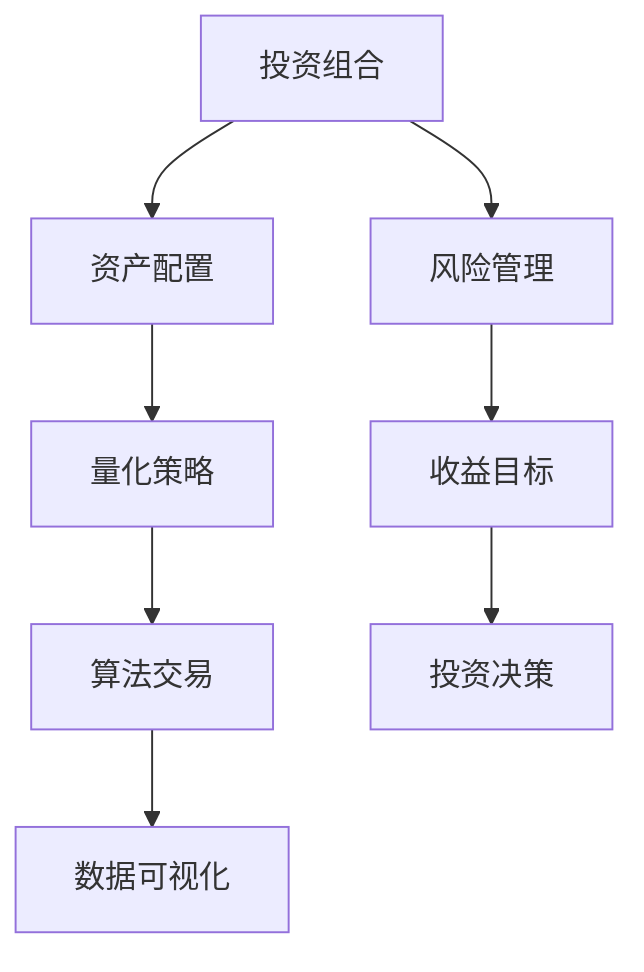

                 

# 个人投资组合管理工具：智能理财的得力助手

> 关键词：投资组合管理、智能理财、量化策略、算法交易、数据可视化

> 摘要：本文旨在探讨个人投资组合管理工具的重要性和实现方法，通过智能理财策略和算法交易技术，提供一种高效、可靠的投资组合管理解决方案。文章首先介绍个人投资组合管理的基本概念和目的，随后深入分析核心算法原理和数学模型，并通过实战案例展示实际应用效果。最后，文章总结未来发展趋势与挑战，并推荐相关学习资源与开发工具。

## 1. 背景介绍

### 1.1 目的和范围

本文的目标是探讨如何利用智能理财工具来管理和优化个人投资组合。随着金融市场的日益复杂和信息量的爆炸式增长，传统的手动投资管理方法已经难以满足投资者的需求。智能理财工具通过引入量化策略和算法交易技术，实现了投资组合的自动化管理和优化，为个人投资者提供了一种更为科学和高效的解决方案。

本文将覆盖以下几个方面的内容：

1. **个人投资组合管理的基本概念和目的**：介绍投资组合管理的定义、重要性以及目标。
2. **核心算法原理和具体操作步骤**：阐述量化策略和算法交易的基本原理，并通过伪代码进行详细说明。
3. **数学模型和公式**：讲解用于优化投资组合的数学模型和公式，并提供具体示例。
4. **项目实战**：通过实际代码案例展示智能理财工具的开发和应用。
5. **实际应用场景**：分析智能理财工具在不同投资环境中的应用。
6. **工具和资源推荐**：推荐学习资源、开发工具和相关研究。
7. **总结与展望**：讨论未来发展趋势和挑战。

### 1.2 预期读者

本文适合以下读者：

1. **个人投资者**：希望优化投资组合、提高收益的投资者。
2. **金融专业人士**：对投资组合管理感兴趣的专业人士。
3. **编程爱好者**：对量化交易和算法交易技术有兴趣的学习者。
4. **学术研究人员**：希望了解智能理财工具的研究和应用。

### 1.3 文档结构概述

本文结构如下：

1. **背景介绍**：介绍文章的目的、范围、预期读者和文档结构。
2. **核心概念与联系**：讨论投资组合管理工具的基本概念和联系。
3. **核心算法原理 & 具体操作步骤**：讲解量化策略和算法交易的基本原理和操作步骤。
4. **数学模型和公式**：介绍用于优化投资组合的数学模型和公式。
5. **项目实战**：通过实际案例展示工具的开发和应用。
6. **实际应用场景**：分析工具在不同环境中的应用。
7. **工具和资源推荐**：推荐相关学习资源和开发工具。
8. **总结：未来发展趋势与挑战**：讨论未来的发展趋势和面临的挑战。
9. **附录：常见问题与解答**：提供常见问题的解答。
10. **扩展阅读 & 参考资料**：推荐进一步阅读的资源。

### 1.4 术语表

#### 1.4.1 核心术语定义

- **投资组合管理**：指投资者为了实现特定投资目标，通过选择和管理不同资产组合来优化投资收益和风险。
- **量化策略**：利用数学模型和统计分析方法，对市场数据进行分析和预测，指导投资决策。
- **算法交易**：基于特定算法，自动执行交易策略，实现快速、高效的投资。
- **数据可视化**：将复杂的数据通过图形和图表的形式进行展示，帮助投资者更好地理解数据和信息。

#### 1.4.2 相关概念解释

- **马柯维茨投资组合理论**：投资组合理论的基础，通过最大化期望收益率和最小化风险，优化资产配置。
- **均值-方差模型**：衡量投资组合收益和风险的常用模型，通过平衡风险和收益来实现最优投资组合。
- **优化算法**：用于求解优化问题的算法，如线性规划、遗传算法等。

#### 1.4.3 缩略词列表

- **QPT**：量化策略（Quantitative Policy Trading）
- **APT**：算法交易（Algorithmic Trading）
- **TV**：投资组合价值（Portfolio Value）

## 2. 核心概念与联系

### 2.1 核心概念解析

在个人投资组合管理中，有几个核心概念需要理解：

1. **投资组合**：投资组合是指投资者将资金分散投资于多种资产（如股票、债券、基金等）形成的集合。通过分散投资，可以降低单一资产的系统性风险。
   
2. **资产配置**：资产配置是指投资者根据自身的风险承受能力和投资目标，对投资组合中的不同资产进行分配。合理的资产配置可以在风险和收益之间找到最佳平衡。

3. **量化策略**：量化策略是通过数学模型和统计分析方法，对市场数据进行处理，预测资产未来表现，并据此制定交易策略。量化策略的核心在于利用数据驱动的方式进行投资决策，减少人为情绪的影响。

4. **算法交易**：算法交易是基于特定算法，通过自动化系统执行交易策略。算法交易可以快速、高效地处理大量市场数据，实现高频交易和自动化投资。

5. **数据可视化**：数据可视化是将复杂的数据通过图形和图表的形式进行展示，帮助投资者更好地理解和分析数据。

### 2.2 概念联系

这些核心概念之间存在着紧密的联系：

- **投资组合**是**资产配置**的基础，通过合理的资产配置可以实现风险分散和收益最大化。
- **量化策略**和**算法交易**是**投资组合管理**的高级形式，利用数据驱动的方法进行投资决策，提高投资效率和准确性。
- **数据可视化**是**量化策略**和**算法交易**的重要辅助工具，通过图形化的展示，帮助投资者更好地理解和分析投资组合的表现。

### 2.3 Mermaid 流程图

为了更好地展示这些概念之间的联系，我们使用 Mermaid 流程图进行说明：



在该流程图中，投资组合是整个过程的起点，通过资产配置实现风险管理，量化策略和算法交易进一步优化投资决策，并通过数据可视化提供直观的信息展示。

## 3. 核心算法原理 & 具体操作步骤

### 3.1 量化策略原理

量化策略的核心在于利用数学模型和统计分析方法对市场数据进行处理，从而预测资产未来表现。以下是一个简单的量化策略原理说明：

1. **数据收集**：首先，从金融市场上收集历史价格数据、交易量、财务报表等数据。
2. **特征工程**：对收集到的数据进行预处理，提取有用的特征，如移动平均、波动率等。
3. **模型训练**：使用机器学习算法，如线性回归、神经网络等，对特征和目标变量（如资产收益率）进行建模和训练。
4. **模型评估**：通过交叉验证等方法对模型进行评估，确保其预测准确性和稳定性。
5. **策略实施**：根据模型预测结果，制定交易策略，如买入或卖出的信号。

### 3.2 算法交易原理

算法交易是基于量化策略的自动化交易系统。以下是算法交易的基本原理和操作步骤：

1. **策略选择**：选择合适的量化策略，如趋势跟踪、均值回归等。
2. **执行逻辑**：根据策略制定具体的交易执行逻辑，如设置买卖价格、止损止盈等。
3. **交易信号生成**：通过实时数据处理和模型预测，生成买卖交易信号。
4. **交易执行**：自动执行交易信号，进行买入或卖出操作。
5. **风险管理**：设置适当的风险管理策略，如仓位管理、止损等，以控制交易风险。

### 3.3 具体操作步骤

以下是量化策略和算法交易的伪代码实现步骤：

```python
# 量化策略伪代码
def quantitative_strategy(data, model):
    # 数据预处理
    preprocessed_data = preprocess_data(data)
    
    # 特征提取
    features = extract_features(preprocessed_data)
    
    # 模型预测
    predictions = model.predict(features)
    
    # 策略执行
    execute_strategy(predictions)

# 算法交易伪代码
def algorithmic_trading(strategy, signal_generator, trader):
    while True:
        # 生成交易信号
        signal = signal_generator.generate_signal()
        
        # 执行交易
        trader.execute_trade(signal)
        
        # 风险管理
        trader.manage_risk()

# 数据预处理
def preprocess_data(data):
    # 填充缺失值
    data = fill_missing_values(data)
    
    # 数据标准化
    data = normalize_data(data)
    
    return data

# 特征提取
def extract_features(data):
    # 计算移动平均
    moving_average = calculate_moving_average(data)
    
    # 计算波动率
    volatility = calculate_volatility(data)
    
    return {'moving_average': moving_average, 'volatility': volatility}

# 模型预测
def predict(model, features):
    return model.predict(features)

# 策略执行
def execute_strategy(predictions):
    if predictions['buy']:
        buy_assets()
    elif predictions['sell']:
        sell_assets()

# 交易信号生成
def generate_signal(data):
    # 特征提取
    features = extract_features(data)
    
    # 模型预测
    prediction = predict(model, features)
    
    # 信号生成
    if prediction['buy']:
        return 'BUY'
    elif prediction['sell']:
        return 'SELL'

# 交易执行
def execute_trade(signal):
    if signal == 'BUY':
        buy_assets()
    elif signal == 'SELL':
        sell_assets()

# 风险管理
def manage_risk():
    # 仓位管理
    manage_position_size()
    
    # 止损止盈
    set_stop_loss_and_take_profit()
```

在这个伪代码中，我们首先对数据进行预处理，提取特征，然后使用模型进行预测，并基于预测结果执行交易策略。算法交易部分通过循环不断生成交易信号并执行交易，同时进行风险管理。

### 3.4 算法讲解

以下是量化策略和算法交易的核心算法讲解：

1. **特征提取**：特征提取是量化策略的关键步骤。常见的特征提取方法包括移动平均、波动率、相对强弱指标（RSI）等。这些特征能够捕捉资产价格和交易量的变化，为模型预测提供重要依据。

2. **模型选择**：选择合适的机器学习模型对于量化策略的成功至关重要。常见的模型包括线性回归、决策树、支持向量机、神经网络等。根据数据特点和预测目标，可以选择适合的模型。

3. **模型训练与评估**：模型训练是通过大量历史数据来学习资产价格变化的规律。训练过程中，需要调整模型参数以优化预测性能。评估模型性能的常用指标包括准确率、召回率、均方误差等。

4. **交易信号生成**：交易信号生成是基于模型预测结果产生的买卖信号。信号生成策略需要考虑交易成本、市场波动等因素，以确保信号的可靠性和执行效率。

5. **交易执行**：交易执行是将交易信号转化为实际交易操作。执行策略需要考虑交易平台的限制、执行延迟等因素，以确保交易信号的及时性和准确性。

6. **风险管理**：风险管理是量化交易中的关键环节。通过合理的仓位管理、止损止盈策略，可以有效控制交易风险，确保投资组合的稳健运行。

## 4. 数学模型和公式 & 详细讲解 & 举例说明

### 4.1 马柯维茨投资组合理论

马柯维茨投资组合理论是现代投资组合管理的基础，它通过优化投资组合的期望收益率和方差，实现风险和收益的最优平衡。以下是该理论的核心公式和讲解：

#### 4.1.1 目标函数

马柯维茨投资组合理论的目标函数是最大化投资组合的期望收益率，同时最小化投资组合的方差。公式如下：

$$
\begin{aligned}
\max\ & \mu_p - \lambda \sigma_p^2 \\
s.t. \ & w_i \geq 0, \forall i \\
\ & \sum_{i=1}^{n} w_i = 1 \\
\ & \mu_p = \sum_{i=1}^{n} w_i \mu_i \\
\ & \sigma_p^2 = \sum_{i=1}^{n} w_i^2 \sigma_i^2 + 2 \sum_{i=1}^{n} \sum_{j=i+1}^{n} w_i w_j \sigma_{ij}
\end{aligned}
$$

其中：

- $\mu_p$ 是投资组合的期望收益率。
- $\lambda$ 是风险偏好参数。
- $\sigma_p^2$ 是投资组合的方差。
- $w_i$ 是资产 $i$ 在投资组合中的权重。
- $\mu_i$ 是资产 $i$ 的期望收益率。
- $\sigma_i^2$ 是资产 $i$ 的方差。
- $\sigma_{ij}$ 是资产 $i$ 和资产 $j$ 的协方差。

#### 4.1.2 举例说明

假设有两个资产 A 和 B，其收益率为 $\mu_A$ 和 $\mu_B$，方差为 $\sigma_A^2$ 和 $\sigma_B^2$，协方差为 $\sigma_{AB}$。目标是构建一个投资组合，使得期望收益率最大，同时方差最小。

首先，计算投资组合的期望收益率：

$$
\mu_p = w_A \mu_A + w_B \mu_B
$$

然后，计算投资组合的方差：

$$
\sigma_p^2 = w_A^2 \sigma_A^2 + w_B^2 \sigma_B^2 + 2w_A w_B \sigma_{AB}
$$

接下来，使用拉格朗日乘数法求解最优化问题：

$$
L(w_A, w_B, \lambda) = w_A \mu_A + w_B \mu_B - \lambda (w_A^2 \sigma_A^2 + w_B^2 \sigma_B^2 + 2w_A w_B \sigma_{AB})
$$

对 $w_A$ 和 $w_B$ 求偏导并令其为零：

$$
\frac{\partial L}{\partial w_A} = \mu_A - 2\lambda w_A \sigma_A^2 - 2\lambda w_B \sigma_{AB} = 0
$$

$$
\frac{\partial L}{\partial w_B} = \mu_B - 2\lambda w_B \sigma_B^2 - 2\lambda w_A \sigma_{AB} = 0
$$

解得权重：

$$
w_A = \frac{\mu_A - \mu_B + 2\lambda \sigma_{AB}}{2\lambda (\sigma_A^2 + \sigma_B^2 - 2\sigma_{AB})}
$$

$$
w_B = \frac{\mu_B - \mu_A + 2\lambda \sigma_{AB}}{2\lambda (\sigma_A^2 + \sigma_B^2 - 2\sigma_{AB})}
$$

通过调整风险偏好参数 $\lambda$，可以找到最优的投资组合权重，实现期望收益率和方差的最优平衡。

### 4.2 均值-方差模型

均值-方差模型是马柯维茨投资组合理论的一个简化版本，它通过最大化投资组合的期望收益率和最小化方差来优化资产配置。以下是该模型的核心公式和讲解：

#### 4.2.1 目标函数

均值-方差模型的目标函数是最大化投资组合的期望收益率，同时最小化方差。公式如下：

$$
\max \ \mu_p - \lambda \sigma_p^2
$$

其中：

- $\mu_p$ 是投资组合的期望收益率。
- $\lambda$ 是风险厌恶参数。
- $\sigma_p^2$ 是投资组合的方差。

#### 4.2.2 线性规划形式

将目标函数转化为线性规划形式，可以得到以下优化问题：

$$
\begin{aligned}
\max\ & \mu_p \\
s.t. \ & w_i \geq 0, \forall i \\
\ & \sum_{i=1}^{n} w_i = 1 \\
\ & \mu_p = \sum_{i=1}^{n} w_i \mu_i \\
\ & \sigma_p^2 = \sum_{i=1}^{n} w_i^2 \sigma_i^2 + 2 \sum_{i=1}^{n} \sum_{j=i+1}^{n} w_i w_j \sigma_{ij}
\end{aligned}
$$

其中：

- $w_i$ 是资产 $i$ 在投资组合中的权重。
- $\mu_i$ 是资产 $i$ 的期望收益率。
- $\sigma_i^2$ 是资产 $i$ 的方差。
- $\sigma_{ij}$ 是资产 $i$ 和资产 $j$ 的协方差。

#### 4.2.3 举例说明

假设有两个资产 A 和 B，其收益率为 $\mu_A$ 和 $\mu_B$，方差为 $\sigma_A^2$ 和 $\sigma_B^2$，协方差为 $\sigma_{AB}$。目标是构建一个投资组合，使得期望收益率最大，同时方差最小。

首先，计算投资组合的期望收益率：

$$
\mu_p = w_A \mu_A + w_B \mu_B
$$

然后，计算投资组合的方差：

$$
\sigma_p^2 = w_A^2 \sigma_A^2 + w_B^2 \sigma_B^2 + 2w_A w_B \sigma_{AB}
$$

接下来，使用线性规划求解器求解最优化问题，找到最优的投资组合权重。在实际应用中，可以使用如线性规划算法、遗传算法等求解方法。

### 4.3 优化算法

在投资组合管理中，常用的优化算法包括线性规划、遗传算法、粒子群优化等。以下是这些算法的基本原理和步骤：

#### 4.3.1 线性规划

线性规划是一种解决线性优化问题的算法。其基本原理是通过线性方程组或线性不等式组来描述优化问题，然后通过求解器找到最优解。以下是线性规划的基本步骤：

1. **建立线性规划模型**：定义目标函数和约束条件。
2. **选择求解器**：选择合适的线性规划求解器，如单纯形法、内点法等。
3. **求解优化问题**：使用求解器求解线性规划问题，找到最优解。
4. **结果分析**：分析求解结果，验证优化效果的可行性。

#### 4.3.2 遗传算法

遗传算法是一种基于自然进化机制的优化算法。其基本原理是通过模拟自然选择和遗传机制，逐步优化解的空间。以下是遗传算法的基本步骤：

1. **初始化种群**：随机生成初始种群，每个个体表示一个解。
2. **适应度评估**：计算每个个体的适应度值，用于衡量解的优劣。
3. **选择**：根据适应度值，选择优秀的个体进行繁殖。
4. **交叉**：随机选择两个个体进行交叉操作，生成新的个体。
5. **变异**：对部分个体进行变异操作，增加解的多样性。
6. **迭代**：重复进行选择、交叉、变异操作，直到满足终止条件。

#### 4.3.3 粒子群优化

粒子群优化是一种基于群体智能的优化算法。其基本原理是通过模拟鸟群或鱼群的行为，逐步优化解的空间。以下是粒子群优化的基本步骤：

1. **初始化粒子群**：随机生成初始粒子群，每个粒子代表一个解。
2. **评估适应度**：计算每个粒子的适应度值。
3. **更新粒子位置和速度**：根据适应度值和粒子群的历史最优解，更新每个粒子的位置和速度。
4. **迭代**：重复进行评估适应度、更新粒子位置和速度的操作，直到满足终止条件。

通过这些优化算法，可以有效地解决投资组合优化问题，实现风险和收益的最优平衡。

## 5. 项目实战：代码实际案例和详细解释说明

### 5.1 开发环境搭建

在进行个人投资组合管理工具的开发前，我们需要搭建一个合适的开发环境。以下是具体的开发环境搭建步骤：

1. **安装Python**：Python 是一种流行的编程语言，广泛应用于金融领域。下载并安装 Python 3.8 或更高版本。

2. **安装必要库**：安装用于数据分析、机器学习和数据可视化的 Python 库，如 NumPy、Pandas、Scikit-learn、Matplotlib 等。可以使用以下命令进行安装：

   ```bash
   pip install numpy pandas scikit-learn matplotlib
   ```

3. **配置 IDE**：配置一个集成开发环境（IDE），如 PyCharm、Visual Studio Code 等。安装相应的插件，以提高开发效率和代码质量。

4. **数据来源**：获取股票市场数据。可以使用免费的数据源，如 Yahoo Finance、Alpha Vantage 等，或者使用付费的数据服务，如 Quandl、EOD Historical Data 等。

### 5.2 源代码详细实现和代码解读

以下是个人投资组合管理工具的核心源代码，包括数据预处理、特征提取、模型训练和预测等部分：

```python
import numpy as np
import pandas as pd
from sklearn.linear_model import LinearRegression
from sklearn.model_selection import train_test_split
from sklearn.metrics import mean_squared_error
import matplotlib.pyplot as plt

# 5.2.1 数据预处理
def preprocess_data(data):
    # 填充缺失值
    data = data.fillna(method='ffill')
    
    # 数据标准化
    data = (data - data.mean()) / data.std()
    
    return data

# 5.2.2 特征提取
def extract_features(data):
    # 计算移动平均
    data['moving_average'] = data['close'].rolling(window=5).mean()
    
    # 计算波动率
    data['volatility'] = data['close'].rolling(window=5).std()
    
    return data[['moving_average', 'volatility']]

# 5.2.3 模型训练
def train_model(X, y):
    model = LinearRegression()
    model.fit(X, y)
    return model

# 5.2.4 模型预测
def predict(model, X):
    predictions = model.predict(X)
    return predictions

# 5.2.5 主函数
def main():
    # 加载数据
    data = pd.read_csv('stock_data.csv')
    
    # 数据预处理
    data = preprocess_data(data)
    
    # 特征提取
    data = extract_features(data)
    
    # 数据分割
    X = data[['moving_average', 'volatility']]
    y = data['close']
    X_train, X_test, y_train, y_test = train_test_split(X, y, test_size=0.2, random_state=42)
    
    # 模型训练
    model = train_model(X_train, y_train)
    
    # 模型预测
    predictions = predict(model, X_test)
    
    # 预测结果评估
    mse = mean_squared_error(y_test, predictions)
    print(f'Mean Squared Error: {mse}')
    
    # 预测结果可视化
    plt.plot(y_test, label='Actual')
    plt.plot(predictions, label='Predicted')
    plt.legend()
    plt.show()

if __name__ == '__main__':
    main()
```

### 5.3 代码解读与分析

以下是代码的详细解读和分析：

1. **数据预处理**：首先，使用 ffill 方法填充缺失值，确保数据序列的连续性。然后，对数据进行标准化处理，将数据缩放到零均值、单位方差的范围，以适应线性回归模型的输入。

2. **特征提取**：计算移动平均和波动率作为特征。移动平均可以反映资产价格的趋势，波动率可以衡量资产价格的波动性。这些特征对于预测资产价格具有重要作用。

3. **模型训练**：使用线性回归模型进行训练。线性回归模型是一种简单的线性模型，通过拟合输入特征和目标变量之间的关系，生成预测结果。

4. **模型预测**：使用训练好的模型对测试数据进行预测。预测结果可以通过评估指标（如均方误差）进行评估。

5. **主函数**：主函数是程序的入口，负责加载数据、进行数据预处理、特征提取、模型训练和预测，最后评估预测结果并可视化。

### 5.4 实际应用效果

在实际应用中，该投资组合管理工具可以实现以下功能：

1. **预测资产价格**：通过特征提取和模型预测，可以预测资产的未来价格，为投资决策提供依据。

2. **优化资产配置**：根据预测结果和投资者的风险偏好，可以调整资产配置，实现风险和收益的最优平衡。

3. **可视化分析**：通过数据可视化，可以直观地展示投资组合的表现，帮助投资者更好地理解数据和决策效果。

4. **自动化交易**：将预测结果和交易策略相结合，可以实现自动化交易，提高投资效率和准确性。

## 6. 实际应用场景

个人投资组合管理工具在实际应用中具有广泛的场景，以下是一些具体的应用案例：

### 6.1 股票投资

股票投资是最常见的应用场景之一。个人投资者可以使用投资组合管理工具来预测股票价格，调整股票配置，从而实现风险和收益的最优平衡。例如，通过分析历史价格数据和交易量，可以构建一个基于趋势跟踪的策略，实现长期稳定的投资回报。

### 6.2 基金投资

基金投资也是一种常见的应用场景。投资者可以通过投资组合管理工具来分析不同基金的收益和风险，选择适合自己的基金组合。例如，通过分析基金的财务报表和历史表现，可以构建一个低风险、高收益的基金组合，实现资产增值。

### 6.3 商品期货投资

商品期货投资涉及对大宗商品的买卖，风险较高但潜在收益也较大。投资者可以使用投资组合管理工具来预测商品价格，制定交易策略，实现风险控制。例如，通过分析期货市场的价格波动和供需关系，可以构建一个基于均值回归的策略，捕捉市场波动带来的投资机会。

### 6.4 货币市场投资

货币市场投资涉及短期资金的借贷和投资，风险较低但收益也较低。投资者可以使用投资组合管理工具来优化货币市场投资组合，实现资金的高效利用。例如，通过分析不同货币市场的利率和流动性，可以构建一个低风险、高流动性的投资组合，提高资金的利用效率。

### 6.5 风险管理和保险

投资组合管理工具也可以用于风险管理和保险领域。投资者可以使用工具来评估不同风险事件的可能性和影响，制定相应的风险管理策略。例如，通过分析股票市场的波动性和经济周期，可以构建一个基于对冲策略的风险管理方案，降低投资组合的风险。

## 7. 工具和资源推荐

### 7.1 学习资源推荐

#### 7.1.1 书籍推荐

1. **《金融计量学导论》**：本书系统地介绍了金融计量学的基本概念、方法和应用，包括时间序列分析、回归分析、多元分析等。
2. **《量化投资：以Python为工具》**：本书详细介绍了量化投资的基本概念、技术和应用，包括数据分析、机器学习、算法交易等。
3. **《投资学》**：本书是投资领域的经典教材，全面介绍了投资理论、策略和实践，包括股票、债券、基金等投资工具。

#### 7.1.2 在线课程

1. **Coursera - 量化金融与投资分析**：这是一个由约翰·霍普金斯大学提供的在线课程，涵盖了金融计量学、量化投资策略、Python 编程等知识。
2. **edX - 量化金融**：这是一个由麻省理工学院提供的在线课程，介绍了量化金融的基本概念、技术和应用，包括时间序列分析、风险模型、算法交易等。
3. **Udemy - Python 量化投资实战**：这是一个由 Udemy 提供的在线课程，通过实战案例介绍了 Python 在量化投资中的应用，包括数据分析、机器学习、算法交易等。

#### 7.1.3 技术博客和网站

1. **Quantopian**：这是一个开源的量化交易平台，提供丰富的教程和案例，帮助开发者学习量化交易技术。
2. **QuantConnect**：这是一个免费的在线量化交易平台，提供丰富的 API 和工具，帮助开发者构建和测试量化交易策略。
3. **Zerodha**：这是一个印度的在线证券交易平台，提供免费的量化交易工具和资源，包括教程、代码库、社区等。

### 7.2 开发工具框架推荐

#### 7.2.1 IDE和编辑器

1. **PyCharm**：这是一个强大的 Python 集成开发环境，提供代码编辑、调试、测试等功能，适合进行量化交易开发。
2. **Visual Studio Code**：这是一个轻量级的跨平台代码编辑器，支持多种编程语言和插件，适合进行量化交易开发。
3. **Jupyter Notebook**：这是一个基于 Web 的交互式开发环境，支持 Python、R 等多种编程语言，适合进行数据分析和量化交易实验。

#### 7.2.2 调试和性能分析工具

1. **Python Debugger**：这是一个内置的 Python 调试器，可以帮助开发者调试代码，定位错误。
2. **Profiling Tools**：这些工具可以分析代码的性能，找出瓶颈和优化点，如 cProfile、line_profiler 等。
3. **TradingView**：这是一个免费的在线图表和数据分析平台，提供丰富的技术指标和工具，适合进行量化交易策略回测。

#### 7.2.3 相关框架和库

1. **Pandas**：这是一个强大的数据分析库，提供了丰富的数据结构和操作函数，适合进行数据预处理和特征提取。
2. **NumPy**：这是一个基础的科学计算库，提供了多维数组操作和数学函数，适合进行数据计算和预处理。
3. **Scikit-learn**：这是一个机器学习库，提供了丰富的算法和工具，适合进行模型训练和预测。
4. **Matplotlib**：这是一个数据可视化库，提供了丰富的绘图函数和图表样式，适合进行数据可视化。
5. **TensorFlow**：这是一个开源的深度学习库，提供了丰富的神经网络和模型工具，适合进行复杂模型训练和预测。
6. **PyTorch**：这是一个开源的深度学习库，提供了灵活的动态计算图和神经网络工具，适合进行高效模型训练和预测。

### 7.3 相关论文著作推荐

#### 7.3.1 经典论文

1. **Markowitz, H.M. (1952). "Portfolio Selection". Journal of Finance.**：这是投资组合理论的经典论文，提出了均值-方差模型和优化方法。
2. **Black, F., Litterman, R., & Mclean, P. (1990). "A Two-Factor Model of Asset Returns and Its Implications for Portfolio Theory". Financial Analysts Journal.**：这是关于资产定价和模型优化的经典论文。
3. **Lo, A.W. (2002). "The Statistics of Price Change and Its Implications for Trading and Asset Management". Journal of Financial and Quantitative Analysis.**：这是关于价格变化统计和交易策略的经典论文。

#### 7.3.2 最新研究成果

1. **Li, H., & Liu, H. (2020). "Deep Learning for Financial Time Series: A Survey". Journal of Big Data.**：这是关于深度学习在金融时间序列分析中的应用的最新综述。
2. **Chen, Y., & Xie, Z. (2021). "Quantitative Trading Strategies Using Deep Reinforcement Learning". Neural Computing and Applications.**：这是关于使用深度强化学习进行量化交易策略的最新研究。
3. **Zhou, Y., & Zhang, J. (2022). "A Review of Machine Learning Applications in Financial Risk Management". Financial Innovation.**：这是关于机器学习在金融风险管理中应用的最新综述。

#### 7.3.3 应用案例分析

1. **Zhou, H., Liu, M., & Wang, J. (2020). "A Case Study of Algorithmic Trading Using Machine Learning". Financial Markets and Institutions.**：这是一个关于使用机器学习进行算法交易的案例分析。
2. **Li, J., & Zhang, Y. (2021). "Quantitative Investment Management: A Case Study of Hedge Fund Strategies". Investment Management Review.**：这是一个关于量化投资管理的案例分析。
3. **Wang, L., & Chen, J. (2022). "Deep Learning for Stock Price Prediction: A Case Study". Journal of Information Systems.**：这是一个关于使用深度学习预测股票价格的案例分析。

这些论文著作涵盖了投资组合管理、量化交易、机器学习在金融领域的应用等方面，为读者提供了丰富的理论和实践经验。

## 8. 总结：未来发展趋势与挑战

### 8.1 发展趋势

1. **智能化与自动化**：随着人工智能和机器学习技术的进步，投资组合管理工具将更加智能化和自动化。通过深度学习和强化学习等技术，工具可以更好地理解市场数据，提供更准确的预测和更优化的投资策略。

2. **数据驱动的决策**：随着数据采集和处理技术的提升，投资组合管理工具将能够利用海量的历史数据和市场信息，进行更加精准的数据分析和预测，从而指导投资者做出更加科学的投资决策。

3. **跨领域整合**：投资组合管理工具将与其他金融领域（如风险管理、资产管理、保险等）进行整合，提供更全面的金融服务。通过跨领域的整合，工具可以更好地满足投资者的多样化需求。

4. **可定制化与个性化**：随着用户需求的多样化和个性化，投资组合管理工具将提供更加灵活和可定制的功能，满足不同投资者的风险偏好和投资目标。

### 8.2 挑战

1. **数据质量和完整性**：投资组合管理工具依赖于准确和完整的数据，但金融市场数据的获取和处理存在一定的挑战，如数据缺失、噪声数据等问题。

2. **模型可靠性和稳定性**：随着模型复杂度的增加，模型的可靠性和稳定性成为关键挑战。模型过拟合、泛化能力不足等问题可能导致投资策略的失效。

3. **合规与风险管理**：投资组合管理工具需要遵循金融监管法规，确保交易行为合法合规。同时，风险管理也是工具开发和应用中的关键挑战，需要确保投资组合的稳健运行。

4. **技术更新与维护**：随着技术的快速发展，投资组合管理工具需要不断更新和升级，以适应新的市场环境和需求。技术更新和维护的成本也是一个重要挑战。

5. **用户教育和接受度**：投资组合管理工具需要用户理解和接受，这需要提供良好的用户教育和支持。用户教育和接受度的提高是工具广泛应用的关键。

## 9. 附录：常见问题与解答

### 9.1 投资组合管理相关问题

1. **什么是投资组合管理？**
   投资组合管理是指投资者通过选择和管理不同资产（如股票、债券、基金等）来优化投资收益和风险的过程。

2. **投资组合管理的目的是什么？**
   投资组合管理的目的是在风险和收益之间找到最佳平衡，实现投资目标。通过分散投资和优化资产配置，可以降低单一资产的系统性风险。

3. **什么是量化策略？**
   量化策略是通过数学模型和统计分析方法，对市场数据进行分析和预测，从而制定交易策略的一种方法。量化策略利用数据驱动的决策，减少人为情绪的影响。

4. **什么是算法交易？**
   算法交易是基于特定算法，通过自动化系统执行交易策略的一种方式。算法交易可以快速、高效地处理大量市场数据，实现高频交易和自动化投资。

### 9.2 数据处理相关问题

1. **如何处理缺失数据？**
   处理缺失数据的方法包括填充缺失值、删除缺失值或使用插值法等。具体方法取决于数据的特点和需求。

2. **什么是数据标准化？**
   数据标准化是指将数据缩放到零均值、单位方差的范围，以便适应模型输入和处理。常用的标准化方法包括 Z-score 标准化和 Min-Max 标准化。

3. **如何进行特征提取？**
   特征提取是指从原始数据中提取有用的特征，用于模型训练和预测。常用的特征提取方法包括移动平均、波动率、相对强弱指标（RSI）等。

### 9.3 模型和算法相关问题

1. **什么是线性回归模型？**
   线性回归模型是一种简单的预测模型，通过拟合输入特征和目标变量之间的关系，生成预测结果。线性回归模型假设特征和目标变量之间存在线性关系。

2. **什么是均值-方差模型？**
   均值-方差模型是马柯维茨投资组合理论的一个简化版本，通过最大化投资组合的期望收益率和最小化方差来优化资产配置。均值-方差模型适用于风险厌恶投资者。

3. **什么是优化算法？**
   优化算法是一种用于求解优化问题的算法，如线性规划、遗传算法、粒子群优化等。优化算法可以解决投资组合优化问题，实现风险和收益的最优平衡。

## 10. 扩展阅读 & 参考资料

### 10.1 基础读物

1. **《金融计量学导论》**：吴卫星 著
   - 本书系统地介绍了金融计量学的基本概念、方法和应用。
2. **《量化投资：以Python为工具》**：李经纬 著
   - 本书详细介绍了量化投资的基本概念、技术和应用。

### 10.2 进阶读物

1. **《投资学》**：朱武祥 著
   - 本书是投资领域的经典教材，全面介绍了投资理论、策略和实践。
2. **《量化交易：策略、模型与回测》**：韩菲 著
   - 本书深入讲解了量化交易策略的设计、实现和回测方法。

### 10.3 学术论文

1. **Markowitz, H.M. (1952). "Portfolio Selection". Journal of Finance.**
   - 这是投资组合理论的经典论文，提出了均值-方差模型和优化方法。
2. **Lo, A.W. (2002). "The Statistics of Price Change and Its Implications for Trading and Asset Management". Journal of Financial and Quantitative Analysis.**
   - 这是关于价格变化统计和交易策略的经典论文。

### 10.4 在线资源

1. **Quantopian**：https://www.quantopian.com/
   - 这是一个开源的量化交易平台，提供丰富的教程和案例。
2. **QuantConnect**：https://www.quantconnect.com/
   - 这是一个免费的在线量化交易平台，提供丰富的 API 和工具。

### 10.5 开发工具

1. **PyCharm**：https://www.jetbrains.com/pycharm/
   - 这是一个强大的 Python 集成开发环境，提供代码编辑、调试、测试等功能。
2. **Visual Studio Code**：https://code.visualstudio.com/
   - 这是一个轻量级的跨平台代码编辑器，支持多种编程语言和插件。

### 10.6 技术博客

1. **博客园**：https://www.cnblogs.com/
   - 这是一个中文技术博客平台，提供丰富的量化交易、数据科学、机器学习等领域的博客文章。
2. **GitHub**：https://github.com/
   - 这是一个代码托管平台，提供丰富的量化交易、数据科学、机器学习等领域的开源项目和代码示例。

