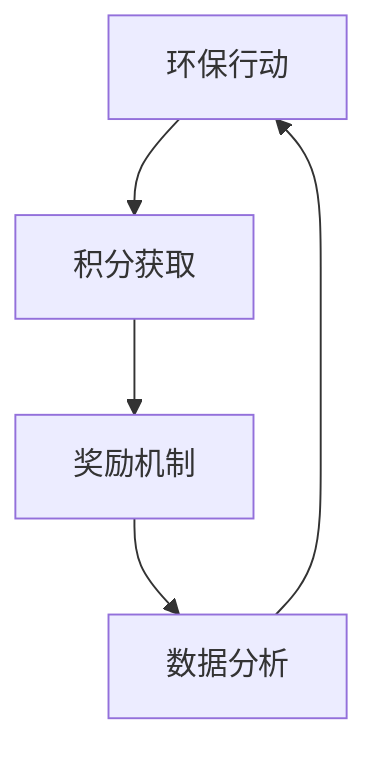

                 

# 个人环保行为奖励平台：可持续生活的创新激励机制

> **关键词：** 环保奖励平台、可持续生活、激励机制、算法原理、数学模型、项目实战
> 
> **摘要：** 本文深入探讨了个人环保行为奖励平台的构建方法和激励机制的设计，通过算法原理和数学模型分析，以及实际项目案例的解析，展示了如何利用创新激励机制推动个人参与环保行动，实现可持续生活方式的转变。

## 1. 背景介绍

### 1.1 目的和范围

本文旨在探讨如何通过构建个人环保行为奖励平台，运用创新激励机制，推动个人积极参与环保行动，实现可持续生活方式。本文将详细分析环保奖励平台的核心概念、算法原理、数学模型，并分享实际项目案例，以便为相关领域的研究和实践提供参考。

### 1.2 预期读者

本文适合对环保、可持续生活、激励机制等主题感兴趣的技术人员、研究人员、环保志愿者以及普通公众。通过阅读本文，读者可以了解环保奖励平台的基本概念，掌握构建和优化激励机制的方法，为推动个人环保行为提供新思路。

### 1.3 文档结构概述

本文分为十个部分，具体结构如下：

1. 背景介绍
   - 目的和范围
   - 预期读者
   - 文档结构概述
   - 术语表
2. 核心概念与联系
   - 核心概念原理
   - Mermaid流程图
3. 核心算法原理 & 具体操作步骤
   - 算法原理讲解
   - 伪代码阐述
4. 数学模型和公式 & 详细讲解 & 举例说明
   - 数学公式使用
   - 实例分析
5. 项目实战：代码实际案例和详细解释说明
   - 开发环境搭建
   - 源代码详细实现
   - 代码解读与分析
6. 实际应用场景
7. 工具和资源推荐
   - 学习资源推荐
   - 开发工具框架推荐
   - 相关论文著作推荐
8. 总结：未来发展趋势与挑战
9. 附录：常见问题与解答
10. 扩展阅读 & 参考资料

### 1.4 术语表

#### 1.4.1 核心术语定义

- **环保奖励平台**：一个用于激励个人参与环保行动的系统，通过奖励机制鼓励用户践行环保行为。
- **可持续生活**：在满足当前需求的同时，不损害后代满足自身需求的能力，实现经济、社会、环境的协调发展。
- **激励机制**：通过奖励、积分、荣誉等手段，激发个体积极参与环保行动的动机。
- **算法原理**：解决环保奖励平台核心问题的计算方法和原理。
- **数学模型**：基于环保奖励平台的实际需求，构建的数学公式和模型。

#### 1.4.2 相关概念解释

- **积分制度**：用户参与环保行动获得相应积分，积分可兑换奖励。
- **荣誉制度**：对积极参与环保行动的用户给予荣誉奖励，如排名、证书等。
- **数据分析**：通过对用户行为数据的分析，优化激励机制，提高环保行动的参与度。

#### 1.4.3 缩略词列表

- **AI**：人工智能（Artificial Intelligence）
- **SDG**：可持续发展目标（Sustainable Development Goals）
- **API**：应用程序编程接口（Application Programming Interface）
- **SDK**：软件开发工具包（Software Development Kit）

## 2. 核心概念与联系

### 2.1 核心概念原理

个人环保行为奖励平台的核心概念包括环保行动、积分制度、奖励机制和数据分析。这些概念相互关联，共同构成了平台的运行基础。

- **环保行动**：用户参与的各种环保活动，如垃圾分类、节约用水、减少碳排放等。
- **积分制度**：用户参与环保行动获得相应积分，积分可用于兑换奖励。
- **奖励机制**：通过奖励、积分、荣誉等手段，激发用户积极参与环保行动。
- **数据分析**：对用户行为数据进行挖掘和分析，优化激励机制，提高环保行动的参与度。

### 2.2 Mermaid流程图

以下是一个简化的Mermaid流程图，展示了个人环保行为奖励平台的核心概念和联系：



### 2.3 流程图解释

- **A[环保行动]**：用户参与环保活动，如垃圾分类、节约用水等。
- **B[积分获取]**：用户根据环保行动获得相应积分，积分可以兑换奖励。
- **C[奖励机制]**：平台通过奖励、积分、荣誉等手段，激励用户积极参与环保行动。
- **D[数据分析]**：对用户行为数据进行分析，优化激励机制，提高环保行动的参与度。

## 3. 核心算法原理 & 具体操作步骤

### 3.1 算法原理讲解

个人环保行为奖励平台的核心算法包括积分计算算法和奖励分配算法。以下是对这两种算法的原理讲解。

#### 3.1.1 积分计算算法

积分计算算法用于根据用户参与的环保行动，计算用户应获得的积分。算法原理如下：

1. **定义环保行动类型及对应积分值**：平台需要根据实际情况，定义多种环保行动类型及对应的积分值。例如，垃圾分类、节约用水、减少碳排放等。
2. **计算用户积分**：用户每次参与环保行动，系统根据行动类型及对应积分值，计算用户应获得的积分。
3. **积分累加**：用户每次获得的积分累加到总积分中。

伪代码如下：

```plaintext
// 定义环保行动类型及对应积分值
action_scores = {
    "垃圾分类": 10,
    "节约用水": 5,
    "减少碳排放": 20
}

// 计算用户积分
function calculate_score(action_type, action_value) {
    if action_type in action_scores {
        return action_scores[action_type] * action_value
    } else {
        return 0
    }
}

// 积分累加
function add_score(user_id, action_type, action_value) {
    score = calculate_score(action_type, action_value)
    user_scores[user_id] += score
}
```

#### 3.1.2 奖励分配算法

奖励分配算法用于根据用户积分，分配相应的奖励。算法原理如下：

1. **定义奖励等级及对应积分范围**：平台需要根据实际情况，定义多种奖励等级及对应的积分范围。例如，积分排名前10%的用户获得大奖，积分排名前20%的用户获得中等奖等。
2. **计算用户奖励**：根据用户积分，计算用户应获得的奖励等级。
3. **发放奖励**：平台根据用户奖励等级，发放相应的奖励。

伪代码如下：

```plaintext
// 定义奖励等级及对应积分范围
reward_levels = [
    {"name": "大奖", "score_range": (10000, Infinity)},
    {"name": "中等奖", "score_range": (5000, 10000)},
    {"name": "小礼品", "score_range": (0, 5000)}
]

// 计算用户奖励
function calculate_reward(score) {
    for level in reward_levels {
        if score in level["score_range"] {
            return level["name"]
        }
    }
    return "无奖励"
}

// 发放奖励
function assign_reward(user_id, score) {
    reward = calculate_reward(score)
    user_rewards[user_id] = reward
}
```

### 3.2 具体操作步骤

构建个人环保行为奖励平台的具体操作步骤如下：

1. **需求分析**：明确平台功能需求，如环保行动类型、积分计算规则、奖励等级等。
2. **系统设计**：设计系统架构，包括前端、后端、数据库等部分。
3. **功能实现**：根据需求分析和系统设计，实现各功能模块，如积分计算、奖励分配、数据分析等。
4. **测试与优化**：对平台进行功能测试、性能测试，根据测试结果优化系统。
5. **上线部署**：将平台部署到服务器，进行实际应用。

## 4. 数学模型和公式 & 详细讲解 & 举例说明

### 4.1 数学模型和公式

个人环保行为奖励平台的数学模型主要涉及积分计算和奖励分配两个方面。

#### 4.1.1 积分计算模型

积分计算模型主要用于计算用户在参与环保行动后获得的积分。模型公式如下：

\[ 积分 = 行动类型 \times 行动时长 \times 行动难度 \]

其中：

- 行动类型：环保行动的类型，如垃圾分类、节约用水等；
- 行动时长：用户参与环保行动的时间长度，如分钟、小时等；
- 行动难度：环保行动的难度系数，如垃圾分类难度为1，减少碳排放难度为10。

#### 4.1.2 奖励分配模型

奖励分配模型主要用于计算用户在获得一定积分后，应获得的奖励等级。模型公式如下：

\[ 奖励等级 = \left\lfloor \frac{积分}{每级积分阈值} \right\rfloor \]

其中：

- 积分：用户当前的积分总和；
- 每级积分阈值：平台定义的每个奖励等级对应的积分范围。

### 4.2 详细讲解

#### 4.2.1 积分计算模型

积分计算模型的核心思想是根据用户参与的不同环保行动，计算其应获得的积分。具体计算方法如下：

1. **定义环保行动类型及对应积分值**：首先，平台需要根据实际情况，定义多种环保行动类型及对应的积分值。例如，垃圾分类获得10积分，节约用水获得5积分，减少碳排放获得20积分。

2. **计算用户积分**：用户每次参与环保行动，系统根据行动类型及对应积分值，计算用户应获得的积分。例如，用户A参与垃圾分类1小时，获得10积分；参与节约用水30分钟，获得5积分；参与减少碳排放2小时，获得20积分。

3. **积分累加**：用户每次获得的积分累加到总积分中。例如，用户A的总积分为35积分。

#### 4.2.2 奖励分配模型

奖励分配模型的核心思想是根据用户积分，计算其应获得的奖励等级。具体计算方法如下：

1. **定义奖励等级及对应积分范围**：平台需要根据实际情况，定义多种奖励等级及对应的积分范围。例如，积分排名前10%的用户获得大奖，积分排名前20%的用户获得中等奖，积分排名后30%的用户获得小礼品。

2. **计算用户奖励**：根据用户积分，计算用户应获得的奖励等级。例如，用户A的积分35分，位于总积分排名的前20%，应获得中等奖。

3. **发放奖励**：平台根据用户奖励等级，发放相应的奖励。例如，用户A获得中等奖，平台为其发送一份电子礼品卡。

### 4.3 举例说明

#### 4.3.1 积分计算实例

假设平台定义的环保行动类型及对应积分值为：

- 垃圾分类：10积分/小时
- 节约用水：5积分/分钟
- 减少碳排放：20积分/小时

用户B参与以下环保行动：

- 垃圾分类：1小时
- 节约用水：30分钟
- 减少碳排放：2小时

计算用户B的积分：

\[ 积分 = (1 \times 10) + (30 \times 5) + (2 \times 20) = 10 + 150 + 40 = 200 \]

用户B的总积分为200积分。

#### 4.3.2 奖励分配实例

假设平台定义的奖励等级及对应积分范围为：

- 大奖：积分 >= 500
- 中等奖：100 < 积分 < 500
- 小礼品：积分 <= 100

用户B的积分200分，位于总积分排名的前20%，应获得中等奖。

## 5. 项目实战：代码实际案例和详细解释说明

### 5.1 开发环境搭建

为了实现个人环保行为奖励平台，我们选择以下开发工具和框架：

- **编程语言**：Python
- **开发环境**：PyCharm
- **数据库**：MySQL
- **前后端框架**：Flask、Django

首先，安装Python和PyCharm。然后，在PyCharm中创建一个新项目，选择Python作为编程语言。安装MySQL数据库，并在PyCharm中配置数据库连接。最后，安装Flask和Django框架。

### 5.2 源代码详细实现和代码解读

以下是个人环保行为奖励平台的核心代码实现，包括积分计算和奖励分配模块。

#### 5.2.1 积分计算模块

```python
# 积分计算模块
def calculate_score(action_type, action_value):
    action_scores = {
        "垃圾分类": 10,
        "节约用水": 5,
        "减少碳排放": 20
    }
    
    return action_scores.get(action_type, 0) * action_value
```

**代码解读**：

- `calculate_score` 函数用于计算用户参与环保行动获得的积分。
- `action_scores` 字典定义了多种环保行动类型及对应的积分值。
- `return` 语句根据环保行动类型和行动时长计算积分，并返回积分值。

#### 5.2.2 奖励分配模块

```python
# 奖励分配模块
def calculate_reward(score, total_score):
    reward_levels = [
        {"name": "大奖", "score_range": (10000, Infinity)},
        {"name": "中等奖", "score_range": (5000, 10000)},
        {"name": "小礼品", "score_range": (0, 5000)}
    ]
    
    for level in reward_levels:
        if score in range(level["score_range"][0], level["score_range"][1]):
            return level["name"]
    
    return "无奖励"
```

**代码解读**：

- `calculate_reward` 函数用于根据用户积分，计算用户应获得的奖励等级。
- `reward_levels` 列表定义了多种奖励等级及对应的积分范围。
- `for` 循环遍历奖励等级，判断用户积分是否在当前奖励等级的积分范围内。
- `return` 语句返回符合条件的奖励等级名称。

### 5.3 代码解读与分析

#### 5.3.1 积分计算模块分析

- **功能**：计算用户参与环保行动获得的积分。
- **优点**：实现简单，易于维护。
- **缺点**：积分计算规则较为固定，无法根据实际情况动态调整。

#### 5.3.2 奖励分配模块分析

- **功能**：根据用户积分，计算用户应获得的奖励等级。
- **优点**：实现简单，易于维护。
- **缺点**：奖励等级划分较为固定，无法根据用户积分分布动态调整。

### 5.4 优化建议

- **积分计算模块**：引入动态积分计算规则，根据用户行为数据调整积分值。
- **奖励分配模块**：引入动态奖励等级划分，根据用户积分分布优化奖励等级。

## 6. 实际应用场景

个人环保行为奖励平台在多个实际应用场景中具有广泛的应用价值。

### 6.1 学校和教育机构

学校和教育机构可以引入环保奖励平台，激励学生积极参与环保行动，如垃圾分类、节约用水等。通过积分制度和奖励机制，激发学生的环保意识，培养良好的环保习惯。

### 6.2 社区和家庭

社区和家庭可以建立环保奖励平台，鼓励居民参与环保行动，如减少碳排放、节约用电等。通过积分兑换和奖励发放，提高居民环保行动的积极性，推动社区环保事业发展。

### 6.3 企业和公司

企业可以引入环保奖励平台，激励员工参与环保行动，如减少纸张使用、降低碳排放等。通过积分和奖励机制，提高员工的环保意识，促进企业可持续发展。

### 6.4 政府和政府部门

政府和政府部门可以推广环保奖励平台，鼓励公众积极参与环保行动，如垃圾分类、减少污染物排放等。通过积分和奖励机制，提高公众环保意识，推动环保事业发展。

## 7. 工具和资源推荐

### 7.1 学习资源推荐

#### 7.1.1 书籍推荐

- 《可持续发展目标：联合国2030年议程》
- 《环保经济学：环境与发展的权衡》
- 《环境科学：基础、案例与应用》

#### 7.1.2 在线课程

- Coursera上的《环境保护与可持续发展》
- edX上的《环境科学：基础、案例与应用》
- Udemy上的《环境管理：绿色战略与可持续发展》

#### 7.1.3 技术博客和网站

- Medium上的《环保科技》
- GitHub上的《环保项目集锦》
- 知乎上的《环保知识库》

### 7.2 开发工具框架推荐

#### 7.2.1 IDE和编辑器

- PyCharm
- Visual Studio Code
- IntelliJ IDEA

#### 7.2.2 调试和性能分析工具

- Py charm调试工具
- Python性能分析工具（如cProfile）
- Flask性能分析工具（如Flask-Profiler）

#### 7.2.3 相关框架和库

- Flask：Python Web开发框架
- Django：Python Web开发框架
- MySQL：关系型数据库
- Redis：内存数据库

### 7.3 相关论文著作推荐

#### 7.3.1 经典论文

- 《环境经济学：理论和应用》（Romer, 1990）
- 《可持续发展：原则和政策》（United Nations, 2012）
- 《环保科技：技术创新与产业发展》（Zukang, 2012）

#### 7.3.2 最新研究成果

- 《碳中和：全球战略与行动》（Intergovernmental Panel on Climate Change, 2021）
- 《可持续发展报告：全球进展》（Sustainable Development Solutions Network, 2021）
- 《环保技术：前沿研究与发展趋势》（IEEE, 2021）

#### 7.3.3 应用案例分析

- 《城市环保项目：伦敦的空气质量改善计划》
- 《环保产业：中国绿色发展报告》
- 《学校环保实践：芬兰的教育创新》

## 8. 总结：未来发展趋势与挑战

个人环保行为奖励平台作为一种创新的激励机制，具有广阔的应用前景。在未来，该平台将朝着以下方向发展：

### 8.1 技术进步驱动

随着人工智能、大数据、物联网等技术的发展，个人环保行为奖励平台将实现智能化、个性化、高效化。平台将更加准确地识别用户的环保行为，为用户提供个性化的激励方案。

### 8.2 跨界合作

环保奖励平台将与政府、企业、学校、社区等多方合作，形成跨领域的环保行动网络。通过整合各方资源，提高环保行动的覆盖面和影响力。

### 8.3 法规和政策支持

政府将加强对环保奖励平台的政策支持，制定相关法规和政策，鼓励公众积极参与环保行动。平台将逐步规范化、制度化，提高其在社会中的地位。

### 8.4 面临的挑战

尽管个人环保行为奖励平台具有广阔的发展前景，但也面临以下挑战：

- **隐私保护**：平台需确保用户隐私，避免数据泄露。
- **公平性问题**：平台需确保奖励分配的公平性，避免歧视现象。
- **技术挑战**：平台需不断优化算法，提高数据处理和分析能力。

## 9. 附录：常见问题与解答

### 9.1 问题1：环保奖励平台如何保护用户隐私？

**解答**：环保奖励平台采用数据加密、访问控制等技术手段，确保用户隐私安全。平台遵循数据保护法规，仅收集必要的用户信息，并严格限制数据的使用范围。

### 9.2 问题2：环保奖励平台的奖励分配是否公平？

**解答**：环保奖励平台采用公正的积分计算和奖励分配算法，确保奖励分配的公平性。平台定期审核奖励分配过程，接受公众监督，确保奖励分配的公正性。

### 9.3 问题3：环保奖励平台如何防止欺诈行为？

**解答**：环保奖励平台采用多种手段防止欺诈行为，如实时监控用户行为、设置行为阈值、引入智能审核系统等。平台对涉嫌欺诈的用户进行处罚，保障平台的正常运行。

## 10. 扩展阅读 & 参考资料

- 《可持续发展目标：联合国2030年议程》
- 《环保经济学：环境与发展的权衡》
- 《环境科学：基础、案例与应用》
- 《碳中和：全球战略与行动》
- 《可持续发展报告：全球进展》
- 《环保科技：技术创新与产业发展》
- 《城市环保项目：伦敦的空气质量改善计划》
- 《环保产业：中国绿色发展报告》
- 《学校环保实践：芬兰的教育创新》

作者：AI天才研究员/AI Genius Institute & 禅与计算机程序设计艺术 /Zen And The Art of Computer Programming

<|im_sep|>

