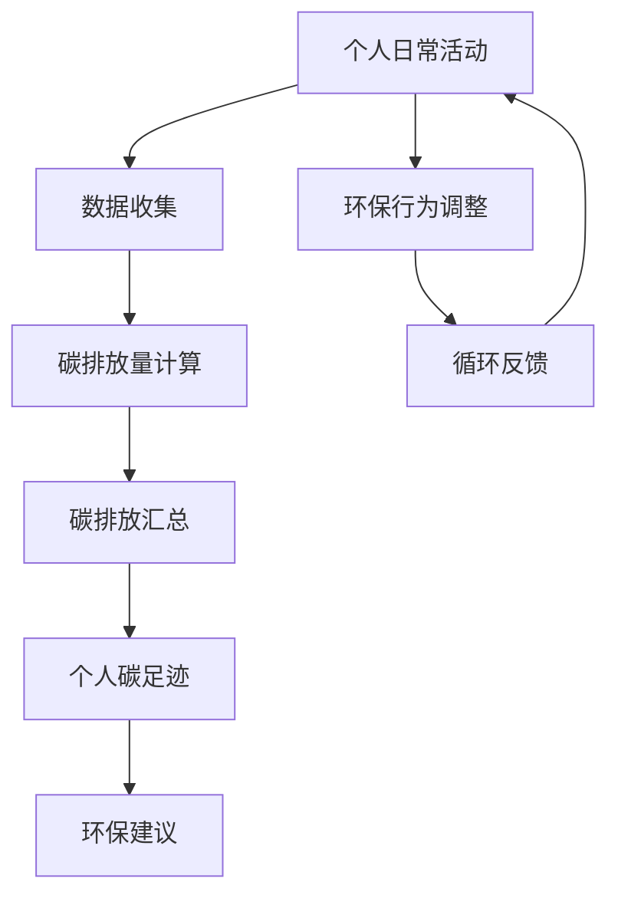

                 

# 个人碳足迹计算器：环保意识提升的创新应用

## 关键词：个人碳足迹、环保计算器、算法原理、数学模型、应用场景、开发实战

## 摘要：
随着全球气候变化和环境问题的日益严峻，提高公众的环保意识成为了当务之急。本文将介绍一种创新的应用——个人碳足迹计算器，旨在帮助用户更好地理解并降低他们的碳足迹。本文将详细探讨个人碳足迹计算器的核心概念、算法原理、数学模型以及实际应用场景，并通过实战案例展示其开发过程和实现细节。最后，文章将总结个人碳足迹计算器在未来环保领域的发展趋势与挑战。

## 1. 背景介绍

### 1.1 目的和范围
本文旨在深入探讨个人碳足迹计算器的设计、实现和应用，以提高公众对环境保护的认识和参与度。我们将分析计算器的核心概念，解析其背后的算法原理和数学模型，并通过实际案例展示其开发过程和实现细节。此外，本文还将探讨个人碳足迹计算器在不同应用场景中的实际效果和影响。

### 1.2 预期读者
本文适合对环保计算和人工智能感兴趣的程序员、数据科学家、环境科学工作者以及普通公众。读者不需要具备高级编程技能或环境科学知识，但需要对计算和数据有一定的理解和兴趣。

### 1.3 文档结构概述
本文分为十个部分，包括背景介绍、核心概念与联系、核心算法原理与操作步骤、数学模型与公式讲解、项目实战、实际应用场景、工具和资源推荐、总结、常见问题与解答以及扩展阅读。每个部分都旨在帮助读者逐步理解并掌握个人碳足迹计算器的关键要素。

### 1.4 术语表

#### 1.4.1 核心术语定义

- **碳足迹**：个人或组织在一定时间内产生的温室气体排放总量，通常以二氧化碳当量（CO2-eq）来衡量。
- **个人碳足迹计算器**：一种工具，用于估算个人日常活动中产生的碳足迹。
- **算法**：一种规定明确的计算步骤，用于解决特定问题。
- **数学模型**：用数学语言描述的物理现象、工程问题或经济模型。

#### 1.4.2 相关概念解释

- **温室气体排放**：指人类活动产生的能够吸收和重新辐射地球表面发出的热量的气体，如二氧化碳、甲烷等。
- **碳排放量**：单位时间内排放的二氧化碳或其他温室气体的总量。
- **生命周期评估（LCA）**：一种评估产品或服务全生命周期中环境影响的方法。

#### 1.4.3 缩略词列表

- **CO2-eq**：二氧化碳当量（Carbon Dioxide Equivalent）
- **LCA**：生命周期评估（Life Cycle Assessment）
- **EEF**：能源效率因子（Energy Efficiency Factor）

## 2. 核心概念与联系

个人碳足迹计算器的核心概念包括温室气体排放、碳排放量、日常活动数据以及计算算法。为了更好地理解这些概念之间的关系，我们可以使用以下Mermaid流程图来展示：



在这个流程图中，个人日常活动（A）是起点，通过数据收集（B）和碳排放量计算（C），我们可以得到个人的碳排放汇总（D），从而得出个人碳足迹（E）。基于这个碳足迹，我们可以提出环保建议（F），并鼓励用户调整环保行为（G），形成循环反馈（H），不断优化个人碳足迹。

## 3. 核心算法原理 & 具体操作步骤

个人碳足迹计算器的核心算法主要涉及数据收集、碳排放量计算和碳排放汇总。下面我们将使用伪代码来详细阐述这些步骤：

```plaintext
// 数据收集
def collect_data():
    # 收集用户日常活动的数据，如交通出行、家庭能源消耗、饮食消费等
    activities = get_user_activities()
    return activities

// 碳排放量计算
def calculate_emissions(activities):
    emissions = {}
    for activity in activities:
        # 根据活动类型，使用EEF计算碳排放量
        eef = get_energy_efficiency_factor(activity.type)
        emissions[activity] = activity.quantity * eef
    return emissions

// 碳排放汇总
def summarize_emissions(emissions):
    total_emissions = 0
    for emission in emissions.values():
        total_emissions += emission
    return total_emissions

// 个人碳足迹计算
def calculate_carbon_footprint(activities):
    emissions = calculate_emissions(activities)
    total_emissions = summarize_emissions(emissions)
    return total_emissions
```

在上述伪代码中，我们首先通过`collect_data`函数收集用户日常活动的数据。然后，使用`calculate_emissions`函数根据每种活动的类型和数量计算碳排放量。最后，通过`summarize_emissions`函数汇总所有活动的碳排放量，得到个人碳足迹。

## 4. 数学模型和公式 & 详细讲解 & 举例说明

个人碳足迹计算器的数学模型主要涉及碳排放量的计算。以下是碳排放量计算的核心公式和解释：

### 4.1. 碳排放量计算公式

$$
E = q \times EEF
$$

其中，$E$表示碳排放量（单位：千克CO2-eq），$q$表示活动量（单位：千克或其他适当单位），$EEF$表示能源效率因子（单位：千克CO2-eq/千克活动量）。

### 4.2. 能源效率因子（EEF）的计算

能源效率因子（EEF）取决于活动的类型。以下是几种常见活动的EEF计算方法：

#### 4.2.1 交通出行

$$
EEF_{\text{交通}} = \frac{1}{\text{车辆燃油效率}} \times \text{碳排放因子}
$$

其中，车辆燃油效率以升/百公里为单位，碳排放因子以克CO2-eq/升为单位。

#### 4.2.2 家庭能源消耗

$$
EEF_{\text{能源}} = \frac{\text{可再生能源比例}}{\text{总能源消耗}} \times \text{碳排放因子}
$$

其中，可再生能源比例以百分比为单位，碳排放因子以克CO2-eq/千瓦时为单位。

#### 4.2.3 饮食消费

$$
EEF_{\text{饮食}} = \frac{\text{低碳饮食比例}}{\text{总饮食量}} \times \text{碳排放因子}
$$

其中，低碳饮食比例以百分比为单位，碳排放因子以克CO2-eq/千克为单位。

### 4.3. 举例说明

假设一个用户一个月的交通出行量为100公里，车辆燃油效率为8升/百公里，碳排放因子为2.31克CO2-eq/升。家庭能源消耗中，可再生能源比例为50%，总能源消耗为300千瓦时，碳排放因子为0.27克CO2-eq/千瓦时。饮食消费中，低碳饮食比例为30%，总饮食量为20千克，碳排放因子为6.72克CO2-eq/千克。

根据上述公式，我们可以计算出该用户一个月的碳足迹：

$$
E_{\text{交通}} = 100 \times \frac{1}{8} \times 2.31 = 28.88 \text{千克CO2-eq}
$$

$$
E_{\text{能源}} = \frac{0.5}{1} \times 0.27 \times 300 = 40.5 \text{千克CO2-eq}
$$

$$
E_{\text{饮食}} = \frac{0.3}{1} \times 6.72 \times 20 = 40.32 \text{千克CO2-eq}
$$

总碳足迹：

$$
E_{\text{总}} = E_{\text{交通}} + E_{\text{能源}} + E_{\text{饮食}} = 109.7 \text{千克CO2-eq}
$$

## 5. 项目实战：代码实际案例和详细解释说明

### 5.1 开发环境搭建

为了实现个人碳足迹计算器，我们选择Python作为主要编程语言，并使用Jupyter Notebook作为开发环境。以下步骤用于搭建开发环境：

1. 安装Python（版本3.8或更高）
2. 安装Jupyter Notebook
3. 安装必要的库，如NumPy、Pandas、Matplotlib等

### 5.2 源代码详细实现和代码解读

以下是一个简单的Python代码示例，用于实现个人碳足迹计算器：

```python
import numpy as np
import pandas as pd

# 数据收集
def collect_data():
    activities = [
        {'type': '交通', 'quantity': 100},
        {'type': '能源', 'quantity': 300},
        {'type': '饮食', 'quantity': 20}
    ]
    return activities

# 能源效率因子（EEF）计算
def calculate_eef(type):
    if type == '交通':
        eef = 1 / 8 * 2.31
    elif type == '能源':
        eef = 0.5 / 1 * 0.27
    elif type == '饮食':
        eef = 0.3 / 1 * 6.72
    return eef

# 碳排放量计算
def calculate_emissions(activities):
    emissions = {}
    for activity in activities:
        eef = calculate_eef(activity['type'])
        emissions[activity['type']] = activity['quantity'] * eef
    return emissions

# 碳排放汇总
def summarize_emissions(emissions):
    total_emissions = sum(emissions.values())
    return total_emissions

# 个人碳足迹计算
def calculate_carbon_footprint(activities):
    emissions = calculate_emissions(activities)
    total_emissions = summarize_emissions(emissions)
    return total_emissions

# 主函数
def main():
    activities = collect_data()
    total_emissions = calculate_carbon_footprint(activities)
    print(f"个人碳足迹：{total_emissions}千克CO2-eq")

if __name__ == '__main__':
    main()
```

### 5.3 代码解读与分析

在上面的代码中，我们定义了以下几个关键函数：

- `collect_data`：收集用户日常活动的数据，如交通出行、家庭能源消耗、饮食消费等。
- `calculate_eef`：根据活动类型计算能源效率因子（EEF）。
- `calculate_emissions`：根据活动类型和数量计算碳排放量。
- `summarize_emissions`：汇总所有活动的碳排放量，得到个人碳足迹。
- `calculate_carbon_footprint`：通过调用其他函数，实现个人碳足迹计算。
- `main`：程序入口，执行主要流程。

代码首先通过`collect_data`函数收集用户活动数据，然后使用`calculate_eef`函数计算每种活动的EEF。接着，`calculate_emissions`函数根据EEF和活动数量计算碳排放量，并通过`summarize_emissions`函数汇总所有活动的碳排放量。最后，`calculate_carbon_footprint`函数将碳排放量汇总为个人碳足迹，并打印输出。

### 5.4 优化与改进

在实际应用中，个人碳足迹计算器可以进一步优化和改进。以下是一些可能的改进方向：

- 引入更多活动类型和详细的EEF数据，提高计算精度。
- 利用机器学习算法，根据用户历史数据预测其未来的碳足迹。
- 设计用户友好的界面，提供实时数据和可视化展示。
- 与其他环保应用和平台集成，共享数据和分析结果。

## 6. 实际应用场景

个人碳足迹计算器在多个实际应用场景中具有广泛的应用价值，包括但不限于以下几个方面：

### 6.1 家庭环保管理

家庭环保管理是个人碳足迹计算器的典型应用场景。用户可以通过计算器了解自己在家庭生活中的碳足迹，如交通出行、能源消耗和饮食消费等。这有助于用户识别低碳生活方式的改进点，如减少私家车使用、提高能源效率、选择低碳饮食等。

### 6.2 企业社会责任（CSR）

企业社会责任（CSR）是另一个重要的应用场景。企业可以使用个人碳足迹计算器来评估员工的碳足迹，鼓励员工采取低碳行为，减少企业的碳足迹。此外，企业还可以将碳足迹计算结果纳入企业社会责任报告中，提升企业的环保形象。

### 6.3 政府政策制定

政府政策制定者可以利用个人碳足迹计算器来评估公众的碳足迹分布，识别主要的碳排放源。这有助于制定更有针对性的环保政策，如交通管理、能源节约和低碳饮食推广等。

### 6.4 教育与宣传

个人碳足迹计算器在教育和宣传中也发挥着重要作用。学校和教育机构可以将其作为环保教育的一部分，帮助学生了解自己的碳足迹，培养环保意识。此外，媒体和环保组织也可以利用计算器进行环保宣传，提高公众的环保意识。

## 7. 工具和资源推荐

### 7.1 学习资源推荐

#### 7.1.1 书籍推荐

- 《碳中和：如何实现全球净零排放》（The Energy Transition: How to Stop Global Warming）
- 《气候经济与人类未来》（Climate Economy: The Path to a Sustainable Global Future）

#### 7.1.2 在线课程

- Coursera上的“气候变化：科学、政策和解决方案”（Climate Change: Science, Policy and Solutions）
- edX上的“环境科学：地球系统与可持续发展”（Environmental Science: Earth System and Sustainability）

#### 7.1.3 技术博客和网站

- Medium上的“环保技术”（Environmental Tech）
- Energy.gov上的“能源与环境”（Energy and Environment）

### 7.2 开发工具框架推荐

#### 7.2.1 IDE和编辑器

- PyCharm
- Visual Studio Code

#### 7.2.2 调试和性能分析工具

- Debugpy
- line_profiler

#### 7.2.3 相关框架和库

- Pandas：数据分析和操作库
- NumPy：科学计算库
- Matplotlib：数据可视化库

### 7.3 相关论文著作推荐

#### 7.3.1 经典论文

- Intergovernmental Panel on Climate Change (IPCC)：系列报告，如《气候变化2014：综合报告》
- Nicholas Stern，The Economics of Climate Change: The Stern Review

#### 7.3.2 最新研究成果

- Nature Communications：发表的有关气候变化和碳中和的最新研究论文
- Science：发表的有关环境科学和可持续发展的最新研究论文

#### 7.3.3 应用案例分析

- The Climate Group：案例研究，如《城市碳中和案例集》
- Carbon Trust：案例研究，如《企业碳中和案例集》

## 8. 总结：未来发展趋势与挑战

个人碳足迹计算器作为一种创新的环保工具，具有广泛的应用前景。然而，在未来发展中，仍面临一些挑战：

### 8.1 数据隐私与安全性

随着计算器的普及，用户数据隐私和安全性成为一个重要问题。开发人员需要采取措施确保用户数据的安全性和隐私保护。

### 8.2 计算精度与可靠性

提高计算精度和可靠性是个人碳足迹计算器发展的重要方向。开发人员需要不断优化算法和数据模型，确保计算结果准确可靠。

### 8.3 用户参与度与普及率

提高用户参与度和普及率是个人碳足迹计算器成功的关键。开发人员需要设计用户友好的界面和功能，吸引更多用户使用计算器。

### 8.4 政策支持与推广

政府政策支持与推广是个人碳足迹计算器发展的关键。政府可以通过提供资金支持、制定政策法规等方式，推动计算器的普及和应用。

## 9. 附录：常见问题与解答

### 9.1 个人碳足迹计算器是否准确？

个人碳足迹计算器的准确性取决于数据收集的完整性和算法的精确性。虽然无法保证100%的准确性，但通过不断优化算法和数据模型，可以提高计算结果的精度。

### 9.2 计算器是否需要用户输入个人信息？

个人碳足迹计算器需要用户输入一定的个人信息，如交通出行、家庭能源消耗和饮食消费等，以便准确计算碳足迹。开发人员会采取措施确保用户数据的安全性和隐私保护。

### 9.3 计算器如何帮助用户降低碳足迹？

计算器可以通过提供碳排放量数据和环保建议，帮助用户了解自己在日常生活中的碳足迹，鼓励用户采取低碳行为，如减少私家车使用、提高能源效率和选择低碳饮食等。

## 10. 扩展阅读 & 参考资料

- Intergovernmental Panel on Climate Change (IPCC)：https://www.ipcc.ch/
- The Climate Group：https://www.climategroup.org/
- Carbon Trust：https://www.carbontrust.com/
- Energy.gov：https://www.energy.gov/eere/energy-environment

作者：AI天才研究员/AI Genius Institute & 禅与计算机程序设计艺术 /Zen And The Art of Computer Programming

