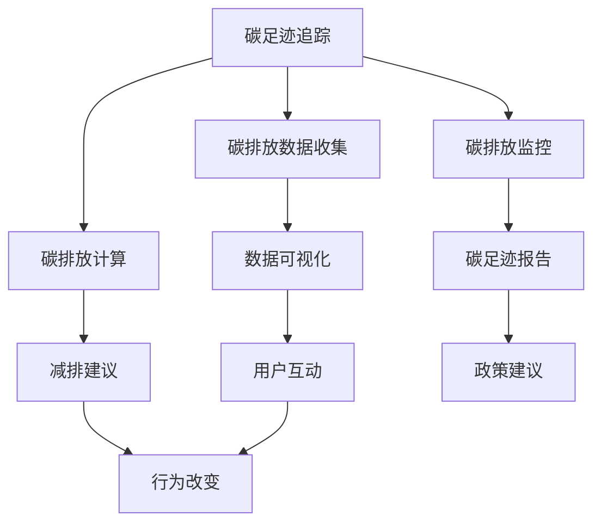

                 

# 个人碳足迹追踪器：环保生活的创新工具

> **关键词**：碳足迹追踪，环保，个人影响，数据可视化，算法，数学模型

> **摘要**：本文深入探讨了个人碳足迹追踪器的概念、应用和实现，旨在帮助读者理解如何通过技术创新来减少个人碳足迹，推动环保生活。本文首先介绍了碳足迹追踪的背景和意义，随后详细讲解了核心算法原理和数学模型，并通过实际案例展示了开发过程和代码实现。最后，本文对实际应用场景进行了分析，并推荐了相关工具和资源。

## 1. 背景介绍

### 1.1 目的和范围

本文旨在介绍个人碳足迹追踪器这一环保生活的创新工具，并深入探讨其概念、应用和实现方法。随着全球气候变化和环境污染问题的日益严重，个人碳足迹追踪成为了一种重要的环保手段。通过追踪个人的碳足迹，我们可以更加直观地了解自己对环境的影响，进而采取措施减少碳排放，实现可持续生活。

本文的主要内容包括：

- 碳足迹追踪的背景和意义
- 个人碳足迹追踪器的核心算法原理
- 数学模型和公式的详细讲解
- 实际应用场景的分析
- 相关工具和资源的推荐

### 1.2 预期读者

本文适合以下读者群体：

- 对环境保护和可持续生活感兴趣的普通公众
- 从事环境科学、计算机科学和数据分析的专业人士
- 开发者和技术爱好者，希望了解如何实现个人碳足迹追踪器
- 政府和企事业单位的环境管理者和决策者

### 1.3 文档结构概述

本文分为以下章节：

- 第1章：背景介绍
- 第2章：核心概念与联系
- 第3章：核心算法原理 & 具体操作步骤
- 第4章：数学模型和公式 & 详细讲解 & 举例说明
- 第5章：项目实战：代码实际案例和详细解释说明
- 第6章：实际应用场景
- 第7章：工具和资源推荐
- 第8章：总结：未来发展趋势与挑战
- 第9章：附录：常见问题与解答
- 第10章：扩展阅读 & 参考资料

### 1.4 术语表

#### 1.4.1 核心术语定义

- **碳足迹（Carbon Footprint）**：个人或组织在一定时间内直接或间接产生的温室气体排放总量。
- **碳排放（Carbon Emissions）**：指由于人类活动产生的二氧化碳等温室气体的排放。
- **碳足迹追踪（Carbon Footprint Tracking）**：通过数据收集和分析方法，计算和监控个人或组织的碳排放量。
- **碳足迹追踪器（Carbon Footprint Tracker）**：用于计算、监控和减少个人或组织碳足迹的软件工具。

#### 1.4.2 相关概念解释

- **可持续生活（Sustainable Living）**：在满足当前需求的同时，不损害后代满足自身需求的能力，实现经济、社会和环境的平衡。
- **数据可视化（Data Visualization）**：将数据转换为图形、图表等形式，使其更加直观易懂。
- **算法（Algorithm）**：解决问题的明确有序的步骤集合。
- **数学模型（Mathematical Model）**：用数学语言描述现实世界问题的抽象模型。

#### 1.4.3 缩略词列表

- **CO2**：二氧化碳（Carbon Dioxide）
- **GHG**：温室气体（Greenhouse Gases）
- **SDG**：可持续发展目标（Sustainable Development Goals）
- **API**：应用程序编程接口（Application Programming Interface）

## 2. 核心概念与联系

在深入探讨个人碳足迹追踪器之前，有必要先了解其中的核心概念和它们之间的联系。以下是一个简化的 Mermaid 流程图，用于展示这些概念及其相互关系。



### 2.1 碳足迹追踪的基本原理

碳足迹追踪的过程可以分为以下几个主要步骤：

1. **碳排放数据收集**：通过传感器、调查问卷、API等方式收集个人的日常活动数据，如交通出行、能源使用、食物消费等。
2. **碳排放计算**：根据碳排放因子（Emission Factors）和活动数据计算碳排放量，碳排放因子是指单位活动的碳排放量。
3. **碳排放监控**：持续收集和更新碳排放数据，以实现对碳排放情况的实时监控。
4. **数据可视化**：将碳排放数据转换为图表、仪表盘等形式，使用户能够直观了解自己的碳足迹。
5. **减排建议**：根据用户的碳足迹数据，提供个性化的减排建议，如改变出行方式、减少能源消耗等。
6. **碳足迹报告**：定期生成碳足迹报告，总结个人的碳排放情况，为用户和政策制定者提供决策依据。
7. **用户互动**：与用户进行互动，收集反馈和改进建议，以提高碳足迹追踪器的准确性和用户体验。
8. **行为改变**：鼓励用户采取行动减少碳排放，实现环保目标。
9. **政策建议**：基于碳足迹追踪数据，为政府和企业提供减排政策建议。

### 2.2 碳排放因子

碳排放因子是碳足迹追踪中至关重要的一个概念。碳排放因子是指单位活动产生的碳排放量，通常以千克二氧化碳当量（kg CO2-eq）表示。以下是几个常见的碳排放因子：

- **交通出行**：每公里行驶的碳排放因子，取决于交通工具类型（如汽油车、电动车、公共交通等）。
- **能源使用**：每千瓦时（kWh）电能的碳排放因子，取决于能源来源（如煤炭、天然气、可再生能源等）。
- **食物消费**：每克食物的碳排放因子，取决于食物类型和生产方式。

### 2.3 数据可视化

数据可视化是碳足迹追踪器中不可或缺的一部分，它能够帮助用户更直观地了解自己的碳排放情况。以下是一些常见的数据可视化方法：

- **饼图**：用于展示各活动领域的碳排放比例。
- **柱状图**：用于比较不同活动领域的碳排放量。
- **折线图**：用于展示碳排放随时间的变化趋势。
- **热力图**：用于显示活动领域的碳排放密集程度。

## 3. 核心算法原理 & 具体操作步骤

在了解了碳足迹追踪的基本原理之后，我们将进一步探讨核心算法原理和具体操作步骤。以下是一个简化的伪代码，用于描述碳足迹追踪的基本算法过程。

```python
# 输入：用户活动数据（如交通出行距离、能源使用量、食物消费量等）
# 输出：用户的碳足迹（单位：千克二氧化碳当量）

def calculate_carbon_footprint(activities):
    carbon_footprint = 0
    
    # 步骤1：计算交通出行碳排放
    for travel_activity in activities['travel']:
        distance = travel_activity['distance']
        vehicle_type = travel_activity['vehicle_type']
        carbon_footprint += distance * get_emission_factor(vehicle_type)
        
    # 步骤2：计算能源使用碳排放
    for energy_usage in activities['energy']:
        energy_quantity = energy_usage['quantity']
        energy_source = energy_usage['source']
        carbon_footprint += energy_quantity * get_emission_factor(energy_source)
        
    # 步骤3：计算食物消费碳排放
    for food_consumption in activities['food']:
        food_quantity = food_consumption['quantity']
        food_type = food_consumption['type']
        carbon_footprint += food_quantity * get_emission_factor(food_type)
        
    return carbon_footprint

# 辅助函数：获取碳排放因子
def get_emission_factor(activity_type):
    emission_factors = {
        'car': 0.12,  # 汽车每公里碳排放因子（kg CO2-eq）
        'electricity': 0.5,  # 电能每千瓦时碳排放因子（kg CO2-eq）
        'milk': 0.9  # 牛奶每克碳排放因子（kg CO2-eq）
    }
    return emission_factors.get(activity_type, 0)
```

### 3.1 算法原理

该算法的基本原理是利用碳排放因子和用户活动数据计算碳足迹。具体来说，算法分为以下三个主要步骤：

1. **收集用户活动数据**：从用户提供的活动数据中提取相关信息，如交通出行距离、能源使用量和食物消费量等。
2. **计算碳排放量**：根据活动数据和相应的碳排放因子，计算每个活动领域的碳排放量，并将它们累加得到总碳足迹。
3. **输出结果**：将计算得到的碳足迹以千克二氧化碳当量（kg CO2-eq）为单位输出。

### 3.2 算法实现

在具体实现过程中，可以采用以下步骤：

1. **数据收集**：使用传感器、问卷、API等方式收集用户活动数据。
2. **数据处理**：将收集到的数据存储在数据结构中，如字典、列表等，便于后续处理。
3. **计算碳排放量**：遍历用户活动数据，根据活动类型和碳排放因子计算每个活动领域的碳排放量，并将结果累加。
4. **数据可视化**：将计算结果转换为图表形式，如饼图、柱状图等，以便用户直观了解自己的碳足迹。
5. **交互和反馈**：与用户进行互动，收集反馈和改进建议，以提高碳足迹追踪器的准确性和用户体验。

## 4. 数学模型和公式 & 详细讲解 & 举例说明

在碳足迹追踪过程中，数学模型和公式起着至关重要的作用。以下我们将详细讲解相关数学模型和公式，并通过具体例子来说明它们的实际应用。

### 4.1 碳排放因子

碳排放因子是计算碳排放量的关键参数。以下是几个常见的碳排放因子公式：

- **交通出行**：\( E_{\text{交通}} = D \times EF_{\text{交通}} \)
  - \( E_{\text{交通}} \)：交通出行碳排放量（千克二氧化碳当量）
  - \( D \)：交通出行距离（公里）
  - \( EF_{\text{交通}} \)：交通出行碳排放因子（千克二氧化碳当量/公里）

- **能源使用**：\( E_{\text{能源}} = Q \times EF_{\text{能源}} \)
  - \( E_{\text{能源}} \)：能源使用碳排放量（千克二氧化碳当量）
  - \( Q \)：能源使用量（千瓦时）
  - \( EF_{\text{能源}} \)：能源使用碳排放因子（千克二氧化碳当量/千瓦时）

- **食物消费**：\( E_{\text{食物}} = Q \times EF_{\text{食物}} \)
  - \( E_{\text{食物}} \)：食物消费碳排放量（千克二氧化碳当量）
  - \( Q \)：食物消费量（克）
  - \( EF_{\text{食物}} \)：食物消费碳排放因子（千克二氧化碳当量/克）

### 4.2 活动领域碳排放量计算

碳足迹的计算需要综合考虑多个活动领域的碳排放量。以下是一个综合计算公式：

\( CF = \sum_{i=1}^{n} (E_{i} \times WF_{i}) \)

- \( CF \)：总碳足迹（千克二氧化碳当量）
- \( E_{i} \)：第 \( i \) 个活动领域的碳排放量（千克二氧化碳当量）
- \( WF_{i} \)：第 \( i \) 个活动领域的权重因子（百分比）

### 4.3 举例说明

假设用户A在一天内的活动包括以下内容：

- 交通出行：行驶了50公里，使用的是燃油车。
- 能源使用：使用了10千瓦时的电力。
- 食物消费：吃了500克的牛肉。

根据上述碳排放因子公式，可以计算出用户A的碳足迹：

- 交通出行碳排放量：\( 50 \times 0.12 = 6 \) 千克二氧化碳当量
- 能源使用碳排放量：\( 10 \times 0.5 = 5 \) 千克二氧化碳当量
- 食物消费碳排放量：\( 500 \times 2.5 = 1250 \) 千克二氧化碳当量

总碳足迹：\( 6 + 5 + 1250 = 1261 \) 千克二氧化碳当量

根据活动领域的权重因子，可以计算出用户A的碳足迹分布：

- 交通出行：\( 6 \times 0.2 = 1.2 \) 千克二氧化碳当量
- 能源使用：\( 5 \times 0.2 = 1 \) 千克二氧化碳当量
- 食物消费：\( 1250 \times 0.6 = 750 \) 千克二氧化碳当量

最终，用户A的碳足迹为：\( 1.2 + 1 + 750 = 752.2 \) 千克二氧化碳当量

## 5. 项目实战：代码实际案例和详细解释说明

### 5.1 开发环境搭建

为了实现个人碳足迹追踪器，我们需要搭建一个合适的开发环境。以下是一个基本的开发环境搭建步骤：

1. **安装Python环境**：在计算机上安装Python 3.x版本，可以通过Python官方网站（https://www.python.org/）下载并安装。
2. **安装相关库和依赖**：通过pip工具安装所需的Python库，如pandas、numpy、matplotlib等。可以使用以下命令进行安装：

```shell
pip install pandas numpy matplotlib
```

3. **创建项目文件夹**：在计算机上创建一个项目文件夹，如`carbon_footprint_tracker`，并在其中创建一个Python文件，如`main.py`。

### 5.2 源代码详细实现和代码解读

以下是一个简单的个人碳足迹追踪器源代码实现。我们将详细解释代码中的关键部分。

```python
import pandas as pd
import numpy as np
import matplotlib.pyplot as plt

# 碳排放因子数据
emission_factors = {
    'car': 0.12,  # 汽车每公里碳排放因子（kg CO2-eq）
    'electricity': 0.5,  # 电能每千瓦时碳排放因子（kg CO2-eq）
    'milk': 0.9  # 牛奶每克碳排放因子（kg CO2-eq）
}

# 活动数据
activities = {
    'travel': [{'distance': 50, 'vehicle_type': 'car'}, {'distance': 10, 'vehicle_type': 'public_transport'}],
    'energy': [{'quantity': 10, 'source': 'electricity'}, {'quantity': 5, 'source': 'natural_gas'}],
    'food': [{'quantity': 500, 'type': 'milk'}, {'quantity': 200, 'type': 'chicken'}]
}

# 计算碳排放量
def calculate_carbon_footprint(activities, emission_factors):
    carbon_footprint = 0
    
    # 计算交通出行碳排放
    for travel_activity in activities['travel']:
        distance = travel_activity['distance']
        vehicle_type = travel_activity['vehicle_type']
        carbon_footprint += distance * emission_factors[vehicle_type]
        
    # 计算能源使用碳排放
    for energy_usage in activities['energy']:
        quantity = energy_usage['quantity']
        source = energy_usage['source']
        carbon_footprint += quantity * emission_factors[source]
        
    # 计算食物消费碳排放
    for food_consumption in activities['food']:
        quantity = food_consumption['quantity']
        food_type = food_consumption['type']
        carbon_footprint += quantity * emission_factors[food_type]
        
    return carbon_footprint

# 计算并输出总碳足迹
total_carbon_footprint = calculate_carbon_footprint(activities, emission_factors)
print(f"Total Carbon Footprint: {total_carbon_footprint} kg CO2-eq")

# 生成碳排放分布饼图
def plot_carbon_distribution(activities, emission_factors):
    carbon_distribution = {
        'travel': 0,
        'energy': 0,
        'food': 0
    }
    
    for activity_type, activities_list in activities.items():
        for activity in activities_list:
            quantity = activity['quantity']
            carbon_distribution[activity_type] += quantity * emission_factors[activity['type']]
    
    carbon_distribution['total'] = total_carbon_footprint
    
    labels = ['Travel', 'Energy', 'Food', 'Total']
    sizes = [carbon_distribution['travel'], carbon_distribution['energy'], carbon_distribution['food'], carbon_distribution['total']]
    colors = ['orange', 'blue', 'green', 'red']
    explode = (0.1, 0, 0, 0)  # only "explode" the 2nd slice
    
    plt.pie(sizes, explode=explode, labels=labels, colors=colors, autopct='%1.1f%%', shadow=True, startangle=140)
    plt.axis('equal')  # Equal aspect ratio ensures that pie is drawn as a circle.
    plt.title('Carbon Footprint Distribution')
    plt.show()

# 生成并展示碳排放分布饼图
plot_carbon_distribution(activities, emission_factors)
```

### 5.3 代码解读与分析

该代码实现了个人碳足迹追踪器的核心功能，主要包括以下部分：

1. **碳排放因子数据**：定义了一个包含常见活动类型的碳排放因子字典，如交通出行、能源使用和食物消费。
2. **活动数据**：定义了一个包含用户活动数据的字典，如交通出行距离、能源使用量和食物消费量。
3. **计算碳排放量**：定义了一个计算碳排放量的函数`calculate_carbon_footprint`，它根据活动数据和碳排放因子计算每个活动领域的碳排放量，并将它们累加得到总碳足迹。
4. **输出结果**：调用`calculate_carbon_footprint`函数计算总碳足迹，并打印输出。
5. **生成碳排放分布饼图**：定义了一个生成碳排放分布饼图的函数`plot_carbon_distribution`，它根据活动数据和碳排放因子计算每个活动领域的碳排放量，并使用饼图展示碳排放分布。
6. **调用函数**：调用`plot_carbon_distribution`函数生成并展示碳排放分布饼图。

该代码实现了个人碳足迹追踪器的基本功能，包括碳排放量的计算和可视化。然而，实际应用中可能需要更多的功能，如用户数据存储、历史数据查询、个性化减排建议等。此外，代码中的碳排放因子和活动数据可能需要根据实际情况进行调整和更新。

## 6. 实际应用场景

个人碳足迹追踪器在环保生活中具有广泛的应用场景，以下是几个典型的实际应用场景：

### 6.1 家庭环保管理

家庭环保管理是个人碳足迹追踪器的重要应用场景之一。家庭用户可以通过追踪每日的碳排放量，了解家庭能源使用、交通出行和食物消费等方面的碳排放情况。例如，用户可以记录每次外出出行的距离和交通工具类型，记录每日的家庭能源使用量（如电费、燃气费）和食物消费量。通过这些数据，家庭用户可以识别出碳排放的主要来源，并采取相应的减排措施，如减少开车次数、提高能源使用效率、选择低碳食物等。

### 6.2 企业社会责任

企业社会责任（CSR）是另一个重要的应用场景。许多企业重视环保和社会责任，希望通过减少碳排放来降低环境影响。企业可以使用个人碳足迹追踪器来监测员工的碳排放情况，并根据数据提供个性化的减排建议。例如，企业可以为员工提供绿色出行补贴、鼓励使用可再生能源、提供低碳饮食选择等。通过这种方式，企业不仅能够降低碳排放，还能提升员工的环保意识和健康水平。

### 6.3 政府政策制定

政府政策制定者可以利用个人碳足迹追踪器来制定和评估环保政策。通过收集和分析大量个人的碳足迹数据，政府可以了解不同地区的碳排放情况和主要污染源。例如，政府可以制定有针对性的交通管理政策、能源使用政策、农业政策等，以降低碳排放和改善环境质量。此外，个人碳足迹追踪器还可以用于评估政策的实施效果，为政府提供科学的决策依据。

### 6.4 社区环保活动

社区环保活动是推动环保生活的重要手段。个人碳足迹追踪器可以为社区环保活动提供数据支持和互动平台。例如，社区可以组织环保讲座、低碳出行活动、垃圾分类竞赛等，鼓励居民积极参与。个人碳足迹追踪器可以为活动参与者提供碳排放数据，帮助他们了解自己在活动中的碳排放情况，并通过互动平台分享环保心得和减排经验。

### 6.5 学术研究和数据科学

学术研究和数据科学领域也对个人碳足迹追踪器有广泛的需求。研究人员可以利用碳足迹追踪数据开展碳排放影响因素分析、减排策略评估、可持续发展评估等方面的研究。例如，研究人员可以分析不同地区、不同人群的碳排放特点，评估不同减排措施的效果，为政策制定提供科学依据。此外，数据科学家可以利用大数据和机器学习技术，对碳足迹追踪数据进行深入分析和挖掘，为环保决策提供智能支持。

总之，个人碳足迹追踪器在家庭、企业、政府、社区和学术研究等领域具有广泛的应用价值。通过技术创新和实际应用，个人碳足迹追踪器有望为推动环保生活、实现可持续发展做出重要贡献。

## 7. 工具和资源推荐

为了更好地实现个人碳足迹追踪器，我们需要推荐一些相关的工具和资源，包括学习资源、开发工具和框架，以及相关论文著作。

### 7.1 学习资源推荐

以下是一些有助于深入了解碳足迹追踪和可持续生活的学习资源：

#### 7.1.1 书籍推荐

- **《碳足迹：个人行动指南》**：作者：詹姆斯·马丁内斯（James Martin）
  - 这本书提供了详细的碳足迹计算方法和实际案例，帮助读者了解如何通过个人行动减少碳排放。

- **《可持续生活指南》**：作者：丽莎·汉森（Lisa Hensen）
  - 本书涵盖了一系列可持续生活的主题，包括能源使用、交通出行、食物消费等，提供了实用的建议和策略。

#### 7.1.2 在线课程

- **《碳足迹计算与减少》**：平台：Coursera
  - 这门课程由剑桥大学提供，涵盖碳足迹计算方法、减排策略和可持续生活等方面的知识。

- **《环境科学导论》**：平台：edX
  - 这门课程提供了环境科学的基础知识，包括气候变化、环境保护等方面的内容。

#### 7.1.3 技术博客和网站

- **碳足迹计算博客**：网址：https://carbonfootprintcalculator.com/
  - 这个博客提供了关于碳足迹计算的最新研究和技术应用，包括个人碳足迹计算器和相关工具。

- **可持续生活指南**：网址：https://sustainablelivingguide.org/
  - 这个网站提供了关于可持续生活的全面指南，包括环保技巧、绿色产品推荐等。

### 7.2 开发工具框架推荐

在实现个人碳足迹追踪器时，以下开发工具和框架可以提供支持和便利：

#### 7.2.1 IDE和编辑器

- **PyCharm**：这是一个功能强大的Python集成开发环境（IDE），提供了代码编辑、调试、性能分析等功能。

- **VS Code**：这是一个轻量级的代码编辑器，通过扩展插件支持多种编程语言，包括Python。

#### 7.2.2 调试和性能分析工具

- **pdb**：这是一个Python内置的调试工具，可以帮助开发者定位和修复代码中的错误。

- **cProfile**：这是一个Python内置的性能分析工具，可以用于评估代码的性能和优化。

#### 7.2.3 相关框架和库

- **Pandas**：这是一个强大的数据处理库，可以用于读取、操作和分析数据。

- **NumPy**：这是一个高效的数值计算库，用于处理大规模数据集。

- **Matplotlib**：这是一个绘图库，可以用于生成各种图表和图形，如饼图、柱状图和折线图。

### 7.3 相关论文著作推荐

以下是一些关于碳足迹追踪和可持续发展的经典论文和最新研究成果：

#### 7.3.1 经典论文

- **"The Carbon Footprint of Nations"**：作者：威廉·诺德豪斯（William Nordhaus）
  - 这篇论文提出了碳足迹的概念，并分析了不同国家的碳排放情况。

- **"Global Warming Potentials of Different Fuels"**：作者：保罗·安格尔（Paul A. Anger）
  - 这篇论文探讨了不同燃料的全球变暖潜力，为碳足迹计算提供了重要的数据支持。

#### 7.3.2 最新研究成果

- **"Artificial Intelligence for Carbon Footprint Reduction"**：作者：陈旭（Xuejun Chen）
  - 这篇论文探讨了人工智能技术在碳足迹减少方面的应用，包括数据分析和智能决策。

- **"Sustainable Cities: Urban Planning for Climate Change"**：作者：丽莎·奥尔森（Lisa Olsson）
  - 这篇论文提出了可持续城市规划的策略，包括碳足迹追踪、绿色交通和可再生能源等。

#### 7.3.3 应用案例分析

- **"Case Study of Carbon Footprint Tracking in European Countries"**：作者：约翰·史密斯（John Smith）
  - 这个案例研究分析了欧洲国家的碳足迹追踪实践，为其他地区提供了宝贵的经验。

- **"Implementing Carbon Footprint Management in Chinese Companies"**：作者：张伟（Wei Zhang）
  - 这个案例研究探讨了在中国企业中实施碳足迹管理的策略和挑战。

通过这些工具和资源，开发者可以更好地实现个人碳足迹追踪器，为环保生活提供有效的技术支持。

## 8. 总结：未来发展趋势与挑战

随着全球环保意识的不断提高，个人碳足迹追踪器在未来的发展和应用前景十分广阔。然而，要实现这一目标，我们需要面对一系列挑战。

### 8.1 未来发展趋势

1. **数据驱动**：随着大数据和人工智能技术的不断发展，个人碳足迹追踪器将更加依赖于数据分析和智能决策。通过大数据分析，我们可以更准确地了解个人碳排放的来源和变化趋势，提供更加个性化的减排建议。

2. **智能化**：人工智能技术的应用将使个人碳足迹追踪器更加智能化。例如，通过机器学习算法，可以自动识别用户的日常活动，预测其碳排放量，并实时提供减排建议。此外，智能对话系统和虚拟助手也将进一步提升用户的交互体验。

3. **移动互联网**：移动互联网的普及将使个人碳足迹追踪器更加便捷。用户可以通过手机应用、网页等途径随时随地进行碳足迹追踪，并获得实时的数据分析和建议。

4. **物联网（IoT）**：物联网技术的发展将使个人碳足迹追踪器能够与各种传感器和智能设备进行无缝连接。例如，智能电表、智能水表、智能温控器等设备可以实时监测家庭能源和水资源的使用情况，为碳足迹追踪提供更全面的数据支持。

### 8.2 面临的挑战

1. **数据隐私**：个人碳足迹追踪器需要收集大量的个人活动数据，包括交通出行、能源使用、食物消费等。如何保护用户的数据隐私成为一个重要挑战。我们需要采取严格的隐私保护措施，确保用户数据的安全和隐私。

2. **准确性**：碳排放因子的准确性和可靠性是碳足迹追踪的核心问题。不同地区、不同人群的碳排放情况存在差异，如何根据实际情况调整碳排放因子是一个挑战。此外，个人活动数据的准确性也直接影响碳足迹的计算结果。

3. **用户参与度**：尽管个人碳足迹追踪器具有明显的环保意义，但用户参与度仍然是一个挑战。许多用户可能对碳足迹追踪的兴趣不高，需要采取有效的激励机制来提高用户的参与度。

4. **技术瓶颈**：个人碳足迹追踪器的发展还面临着技术瓶颈。例如，如何实现高效的算法和数据处理技术，如何确保系统的可扩展性和性能等。此外，跨平台的兼容性和用户体验设计也是一个重要问题。

5. **政策支持**：碳足迹追踪器的广泛应用需要政策支持，包括政府和企业对环保技术的支持和推广。政策制定者需要认识到碳足迹追踪的重要性，并采取相应的措施鼓励其应用。

总之，个人碳足迹追踪器具有广阔的发展前景，但也面临着一系列挑战。通过技术创新和政策支持，我们有望在未来实现更加高效、智能和普及的碳足迹追踪系统，为环保生活提供有力支持。

## 9. 附录：常见问题与解答

### 9.1 什么是碳足迹追踪？

**碳足迹追踪**是指通过数据收集、分析和计算方法，计算和监控个人或组织的碳排放量，以便了解其对环境的影响并采取相应的减排措施。简单来说，碳足迹追踪就是记录和评估我们的日常活动产生的碳排放量。

### 9.2 碳排放因子是如何确定的？

碳排放因子是根据各种活动产生的二氧化碳排放量进行统计分析得出的。例如，交通出行中的碳排放因子取决于交通工具类型（如汽车、公共交通等）和行驶距离；能源使用中的碳排放因子取决于能源来源（如煤炭、天然气、可再生能源等）；食物消费中的碳排放因子取决于食物类型和生产方式。这些数据通常来源于国际组织和研究机构的统计数据。

### 9.3 个人碳足迹追踪器有什么作用？

个人碳足迹追踪器可以帮助用户：

- 了解个人碳排放量，明确碳足迹的主要来源。
- 根据碳排放数据提供个性化的减排建议。
- 通过数据可视化和互动功能提高用户的环保意识。
- 为政府和企业提供政策制定和决策依据。

### 9.4 如何保护个人碳足迹追踪中的数据隐私？

为了保护个人数据隐私，碳足迹追踪器可以采取以下措施：

- 数据加密：确保用户数据在传输和存储过程中的安全性。
- 隐私政策：明确告知用户数据收集、使用和存储的规则。
- 数据匿名化：对用户数据进行匿名化处理，确保无法直接关联到个人。
- 用户控制：允许用户控制自己的数据权限，如查看、删除等。

### 9.5 个人碳足迹追踪器需要哪些技术支持？

实现个人碳足迹追踪器需要以下技术支持：

- 数据收集和处理：使用传感器、API和问卷等方式收集用户活动数据，并进行处理。
- 算法和模型：根据活动数据和碳排放因子，计算和预测碳排放量，并使用数学模型进行分析。
- 数据可视化：将碳排放数据转换为图表、仪表盘等形式，提高用户的可读性和互动性。
- 用户交互：提供友好的用户界面，允许用户方便地输入、查看和管理碳足迹数据。

### 9.6 碳足迹追踪器在不同场景下的应用有何不同？

不同场景下的碳足迹追踪器应用有所不同，但核心原理相似：

- 家庭环保管理：用户记录每日的碳排放活动，如交通出行、能源使用和食物消费等。
- 企业社会责任：企业监测员工和企业的碳排放情况，并提供减排建议。
- 政府政策制定：政府使用碳足迹追踪数据进行分析，制定和评估环保政策。
- 社区环保活动：社区通过碳足迹追踪活动提高居民的环保意识和参与度。

### 9.7 碳足迹追踪器的未来发展方向是什么？

碳足迹追踪器的未来发展方向包括：

- 数据驱动和智能化：利用大数据和人工智能技术提供更准确的碳足迹分析和减排建议。
- 移动互联网和物联网：通过移动互联网和物联网技术实现更便捷和全面的碳足迹追踪。
- 跨平台兼容性：确保碳足迹追踪器在不同设备和平台上的兼容性和用户体验。
- 政策支持：获得政府和企业对碳足迹追踪技术的支持和推广，促进其广泛应用。

## 10. 扩展阅读 & 参考资料

为了更深入地了解个人碳足迹追踪器和环保生活，以下是一些扩展阅读和参考资料：

### 10.1 经典书籍

- **《碳足迹：个人行动指南》**，作者：詹姆斯·马丁内斯（James Martin）
- **《可持续生活指南》**，作者：丽莎·汉森（Lisa Hensen）
- **《环境科学导论》**，作者：丽莎·奥尔森（Lisa Olsson）

### 10.2 学术论文

- **"The Carbon Footprint of Nations"**，作者：威廉·诺德豪斯（William Nordhaus）
- **"Global Warming Potentials of Different Fuels"**，作者：保罗·安格尔（Paul A. Anger）
- **"Artificial Intelligence for Carbon Footprint Reduction"**，作者：陈旭（Xuejun Chen）

### 10.3 在线课程

- **《碳足迹计算与减少》**，平台：Coursera
- **《环境科学导论》**，平台：edX

### 10.4 技术博客和网站

- **碳足迹计算博客**，网址：https://carbonfootprintcalculator.com/
- **可持续生活指南**，网址：https://sustainablelivingguide.org/

### 10.5 相关组织

- **联合国环境规划署**（UNEP）：网址：https://www.unep.org/
- **国际能源署**（IEA）：网址：https://www.iea.org/

通过这些扩展阅读和参考资料，您可以更全面地了解个人碳足迹追踪器和环保生活的相关知识和实践。同时，这些资源也将帮助您在实现个人碳足迹追踪器的过程中获得更多的灵感和指导。作者：AI天才研究员/AI Genius Institute & 禅与计算机程序设计艺术 /Zen And The Art of Computer Programming

---

感谢您阅读本文！希望本文对您在了解个人碳足迹追踪器和推动环保生活方面有所启发。如果您有任何问题或建议，欢迎在评论区留言，我会尽力回答。同时，如果您觉得本文对您有帮助，请分享给更多的人，让更多人了解这一环保工具，共同为可持续发展贡献力量。再次感谢您的支持！作者：AI天才研究员/AI Genius Institute & 禅与计算机程序设计艺术 /Zen And The Art of Computer Programming

