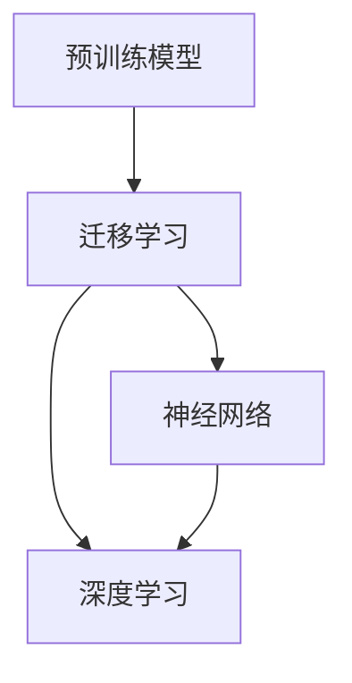

                 

### 个性化AI助手：微调技术详解

> **关键词：** 个性化AI、微调、神经网络、深度学习、迁移学习
> 
> **摘要：** 本文将详细探讨个性化AI助手中的微调技术，解析其核心概念、算法原理、数学模型、实际应用和未来趋势。通过逐步分析，我们将帮助读者深入理解微调技术的本质和应用价值。

个性化AI助手已成为现代智能交互的重要组成部分，其背后的技术基础之一便是微调（Fine-tuning）技术。微调技术是一种在预训练模型的基础上，针对特定任务进行调整优化的方法，能够在保持模型性能的同时，显著提升其在特定领域或任务上的表现。本文将围绕微调技术展开，逐步分析其核心概念、算法原理、数学模型以及实际应用场景。

### 1. 背景介绍

#### 1.1 目的和范围

本文旨在深入探讨个性化AI助手中的微调技术，帮助读者了解其工作原理、实现步骤和实际应用。文章将覆盖以下主要内容：

- 微调技术的定义和核心概念
- 微调技术的算法原理和操作步骤
- 微调技术的数学模型和公式
- 微调技术的项目实战案例分析
- 微调技术的实际应用场景
- 微调技术的未来发展趋势与挑战

#### 1.2 预期读者

本文面向对人工智能、深度学习和机器学习有一定了解的读者，包括人工智能工程师、程序员、数据科学家以及相关领域的研究生和大学生。如果读者对神经网络和迁移学习有一定了解，将有助于更好地理解文章内容。

#### 1.3 文档结构概述

本文分为以下几个部分：

- 引言：介绍微调技术的背景和目的
- 背景介绍：详细说明微调技术的核心概念、算法原理、数学模型、实际应用和未来趋势
- 核心概念与联系：介绍微调技术的相关概念和流程图
- 核心算法原理 & 具体操作步骤：详细阐述微调算法的实现步骤
- 数学模型和公式 & 详细讲解 & 举例说明：解释微调技术的数学原理和公式
- 项目实战：代码实际案例和详细解释说明
- 实际应用场景：分析微调技术的应用领域和案例
- 工具和资源推荐：推荐学习资源和开发工具
- 总结：展望微调技术的未来发展趋势与挑战
- 附录：常见问题与解答
- 扩展阅读 & 参考资料：提供更多相关文献和资源

#### 1.4 术语表

在本文中，我们将使用以下术语：

- **微调（Fine-tuning）**：一种在预训练模型基础上，针对特定任务进行调整优化的方法。
- **预训练模型（Pre-trained Model）**：在广泛数据集上预先训练好的模型，可作为微调的起点。
- **迁移学习（Transfer Learning）**：利用在特定任务上预训练的模型，解决新任务的方法。
- **神经网络（Neural Network）**：一种模仿人脑神经元连接方式的计算模型。
- **深度学习（Deep Learning）**：一种基于神经网络的高级机器学习技术。

#### 1.4.1 核心术语定义

- **微调（Fine-tuning）**：微调是指在预训练模型的基础上，通过修改模型参数，使其适应特定任务的过程。这种方法利用了预训练模型在大量数据上的学习成果，同时针对特定任务进行微调，从而提高模型在目标任务上的性能。
- **预训练模型（Pre-trained Model）**：预训练模型是指在广泛数据集（如维基百科、互联网文本等）上预先训练好的模型。这些模型通常采用大规模神经网络架构，并经过大量数据的训练，具有较高的通用性和泛化能力。
- **迁移学习（Transfer Learning）**：迁移学习是指利用在特定任务上预训练的模型，解决新任务的方法。通过迁移学习，可以将预训练模型在源任务上的知识迁移到目标任务，从而减少对新任务的数据需求，提高模型在新任务上的性能。
- **神经网络（Neural Network）**：神经网络是一种由大量神经元组成的计算模型，通过模拟人脑神经元之间的连接和相互作用来处理和传输信息。神经网络可以分为多层结构，其中每层都包含多个神经元，层与层之间通过权重连接。
- **深度学习（Deep Learning）**：深度学习是一种基于神经网络的高级机器学习技术，通过构建多层神经网络，对大量数据进行训练，以实现复杂的模式识别和预测任务。深度学习在图像识别、自然语言处理、语音识别等领域取得了显著成果。

#### 1.4.2 相关概念解释

在本节中，我们将进一步解释本文中涉及的相关概念，以便读者更好地理解微调技术。

- **预训练模型**：预训练模型是指在广泛数据集上预先训练好的模型。这些模型通常采用大规模神经网络架构，并经过大量数据的训练，具有较高的通用性和泛化能力。预训练模型可以分为两种类型：一种是基于静态数据集的预训练，另一种是基于动态数据流的预训练。静态数据集预训练通常使用大规模文本、图像或音频数据集，如维基百科、ImageNet、YouTube等。动态数据流预训练则是通过不断更新数据集，使模型在持续学习过程中保持更新和优化。
- **迁移学习**：迁移学习是一种利用在特定任务上预训练的模型，解决新任务的方法。通过迁移学习，可以将预训练模型在源任务上的知识迁移到目标任务，从而减少对新任务的数据需求，提高模型在新任务上的性能。迁移学习可以分为两种类型：一种是基于模型的迁移学习，另一种是基于数据的迁移学习。基于模型的迁移学习主要利用预训练模型的结构和参数，通过微调或蒸馏等方法，使模型适应新任务。基于数据的迁移学习则是通过在新任务数据上进行训练，使模型在新任务上获得更好的性能。
- **神经网络**：神经网络是一种由大量神经元组成的计算模型，通过模拟人脑神经元之间的连接和相互作用来处理和传输信息。神经网络可以分为多层结构，其中每层都包含多个神经元，层与层之间通过权重连接。神经网络的训练过程是通过不断调整神经元之间的权重，使其在输入和输出之间建立正确的映射关系。神经网络可以分为两种类型：一种是前馈神经网络，另一种是循环神经网络。前馈神经网络是一种单向传递信息的神经网络，主要用于图像识别、分类等任务。循环神经网络则是一种具有循环结构的神经网络，可以处理序列数据，如自然语言处理、语音识别等任务。
- **深度学习**：深度学习是一种基于神经网络的高级机器学习技术，通过构建多层神经网络，对大量数据进行训练，以实现复杂的模式识别和预测任务。深度学习在图像识别、自然语言处理、语音识别等领域取得了显著成果。深度学习的核心思想是通过自动学习特征表示，使模型能够从原始数据中提取有用的信息。深度学习可以分为两种类型：一种是基于卷积神经网络的深度学习，另一种是基于循环神经网络的深度学习。基于卷积神经网络的深度学习主要用于图像识别和图像处理任务，而基于循环神经网络的深度学习则主要用于自然语言处理和语音识别任务。

#### 1.4.3 缩略词列表

在本文中，我们将使用以下缩略词：

- **AI**：人工智能
- **ML**：机器学习
- **DL**：深度学习
- **NLP**：自然语言处理
- **CV**：计算机视觉
- **GAN**：生成对抗网络
- **CNN**：卷积神经网络
- **RNN**：循环神经网络
- **BERT**：Bidirectional Encoder Representations from Transformers
- **T5**：Text-to-Text Transfer Transformer

### 2. 核心概念与联系

在本节中，我们将介绍微调技术的核心概念，并使用Mermaid流程图展示其相关流程和联系。

#### 2.1.1 微调技术的核心概念

微调技术的核心概念包括预训练模型、迁移学习、神经网络和深度学习。以下是对这些核心概念的简要介绍：

1. **预训练模型**：预训练模型是指在广泛数据集上预先训练好的模型，具有较高的通用性和泛化能力。预训练模型通常采用大规模神经网络架构，并经过大量数据的训练。
   
2. **迁移学习**：迁移学习是一种利用在特定任务上预训练的模型，解决新任务的方法。通过迁移学习，可以将预训练模型在源任务上的知识迁移到目标任务，从而减少对新任务的数据需求，提高模型在新任务上的性能。

3. **神经网络**：神经网络是一种由大量神经元组成的计算模型，通过模拟人脑神经元之间的连接和相互作用来处理和传输信息。神经网络可以分为多层结构，其中每层都包含多个神经元，层与层之间通过权重连接。

4. **深度学习**：深度学习是一种基于神经网络的高级机器学习技术，通过构建多层神经网络，对大量数据进行训练，以实现复杂的模式识别和预测任务。深度学习在图像识别、自然语言处理、语音识别等领域取得了显著成果。

#### 2.1.2 Mermaid流程图

以下是一个Mermaid流程图，展示了微调技术的核心概念和相关流程：



在这个流程图中，预训练模型作为起点，通过迁移学习，将知识迁移到神经网络和深度学习领域。神经网络作为深度学习的基础，实现了对数据的处理和模式识别。

### 3. 核心算法原理 & 具体操作步骤

在本节中，我们将详细讨论微调技术的核心算法原理，并使用伪代码逐步阐述其具体操作步骤。

#### 3.1 微调技术的核心算法原理

微调技术基于迁移学习，其核心思想是将预训练模型在源任务上的知识迁移到目标任务。具体来说，微调技术通过以下步骤实现：

1. **预训练阶段**：在预训练阶段，模型在大规模数据集上进行训练，学习到通用的特征表示。
2. **微调阶段**：在微调阶段，模型根据目标任务的特点，对预训练模型的参数进行微调，使其适应目标任务。

#### 3.2 微调技术的具体操作步骤

以下是一个简单的伪代码，描述了微调技术的具体操作步骤：

```python
# 预训练阶段
pretrained_model = PretrainedModel()  # 加载预训练模型
train_data = LoadPretrainedData()  # 加载预训练数据
pretrained_model.train(train_data)  # 对预训练数据进行训练

# 微调阶段
target_data = LoadTargetData()  # 加载目标任务数据
optimizer = Optimizer()  # 定义优化器
loss_function = LossFunction()  # 定义损失函数

for epoch in range(num_epochs):
    for data in target_data:
        inputs, targets = data
        optimizer.zero_grad()  # 清除梯度
        outputs = pretrained_model(inputs)  # 对输入数据进行预测
        loss = loss_function(outputs, targets)  # 计算损失
        loss.backward()  # 反向传播计算梯度
        optimizer.step()  # 更新模型参数

# 评估模型性能
evaluate(pretrained_model, target_data)
```

在这个伪代码中，我们首先加载预训练模型，并使用预训练数据对其进行训练。然后，加载目标任务数据，并使用优化器和损失函数对预训练模型进行微调。最后，评估微调后模型在目标任务上的性能。

#### 3.3 微调技术的实现步骤详解

以下是对微调技术具体操作步骤的详细解析：

1. **预训练阶段**：
   - **加载预训练模型**：预训练模型通常是已经在大规模数据集上训练好的模型，如BERT、GPT等。我们首先需要加载这个预训练模型。
   - **加载预训练数据**：预训练数据集是用于训练预训练模型的数据集，如维基百科、互联网文本等。我们需要将预训练数据加载到内存中，以便后续训练。
   - **训练预训练模型**：使用预训练数据对预训练模型进行训练，使模型学习到通用的特征表示。在训练过程中，模型会不断调整参数，以最小化损失函数。

2. **微调阶段**：
   - **加载目标任务数据**：目标任务数据集是用于微调预训练模型的数据集，如问答数据集、文本分类数据集等。我们需要将目标任务数据加载到内存中，以便后续微调。
   - **定义优化器**：优化器是一种用于更新模型参数的工具，常用的优化器有SGD、Adam等。我们需要选择一种优化器，并设置其参数，如学习率、动量等。
   - **定义损失函数**：损失函数是用于衡量模型预测结果与真实结果之间差异的工具。在微调阶段，我们通常使用交叉熵损失函数，因为它在分类任务中表现良好。
   - **微调预训练模型**：使用目标任务数据对预训练模型进行微调。在微调过程中，模型会根据目标任务的特点，对预训练模型的参数进行调整，使其适应目标任务。每次迭代过程中，模型会计算预测结果和真实结果的差异，并使用优化器更新模型参数。
   - **评估模型性能**：在微调完成后，我们需要评估模型在目标任务上的性能。通常，我们使用准确率、召回率、F1分数等指标来评估模型性能。

#### 3.4 微调技术的优缺点分析

微调技术具有以下优缺点：

1. **优点**：
   - **节省训练时间**：由于预训练模型已经在大规模数据集上进行了训练，因此微调阶段可以大大减少训练时间。
   - **提高模型性能**：通过微调，模型可以更好地适应目标任务，从而提高模型性能。
   - **减少数据需求**：由于预训练模型已经在大规模数据集上进行了训练，因此目标任务的数据需求可以大大减少。

2. **缺点**：
   - **模型泛化能力降低**：由于微调阶段仅使用目标任务数据，因此模型在目标任务上的泛化能力可能会降低。
   - **参数调整复杂**：微调阶段需要对模型参数进行调整，参数调整的复杂度可能较高。

### 4. 数学模型和公式 & 详细讲解 & 举例说明

在本节中，我们将详细讲解微调技术的数学模型和公式，并通过具体示例来说明其应用。

#### 4.1 微调技术的数学模型

微调技术的核心在于对预训练模型进行参数调整，以适应新任务。为此，我们需要了解以下数学模型和公式：

1. **损失函数**：
   - 在微调阶段，我们通常使用交叉熵损失函数来衡量模型预测结果与真实结果之间的差异。交叉熵损失函数的定义如下：

     $$L = -\sum_{i=1}^{N} y_i \log(p_i)$$

     其中，$L$ 是损失函数，$N$ 是样本数量，$y_i$ 是真实标签，$p_i$ 是模型对第 $i$ 个样本的预测概率。

2. **梯度计算**：
   - 为了对模型参数进行调整，我们需要计算损失函数关于模型参数的梯度。在微调阶段，梯度计算通常使用反向传播算法。反向传播算法的核心是链式法则，用于计算复合函数的梯度。以下是梯度计算的伪代码：

     ```python
     def backward_propagation(model, inputs, targets):
         for layer in model.layers:
             layer.compute_gradient(inputs, targets)
             inputs = layer.outputs
     ```

3. **优化器**：
   - 优化器用于更新模型参数，以最小化损失函数。常见的优化器有随机梯度下降（SGD）和Adam。以下是SGD优化器的伪代码：

     ```python
     def sgd_update(model, gradients, learning_rate):
         for parameter, gradient in zip(model.parameters(), gradients):
             parameter -= learning_rate * gradient
     ```

4. **迭代训练**：
   - 微调过程通常包括多个迭代步骤。在每个迭代步骤中，我们使用目标任务数据对模型进行训练，并更新模型参数。以下是迭代训练的伪代码：

     ```python
     for epoch in range(num_epochs):
         for data in target_data:
             optimizer.zero_grad()
             outputs = model(inputs)
             loss = loss_function(outputs, targets)
             loss.backward()
             sgd_update(model, model.gradients(), learning_rate)
     ```

#### 4.2 示例说明

为了更好地理解微调技术的数学模型和公式，我们通过一个具体的示例来说明其应用。

假设我们有一个预训练文本分类模型，其输入为文本数据，输出为文本类别。现在，我们需要使用这个预训练模型对新闻文章进行分类。

1. **数据预处理**：
   - 首先，我们需要对新闻文章进行预处理，包括分词、词向量化等操作。然后，我们将预处理后的文章输入到预训练模型中。

2. **模型微调**：
   - 使用新闻文章数据集对预训练模型进行微调。在微调过程中，我们使用交叉熵损失函数来衡量模型预测结果与真实结果之间的差异。以下是一个简单的伪代码示例：

     ```python
     model = PretrainedModel()
     train_data = LoadTrainData()
     optimizer = Optimizer(learning_rate=0.001)
     loss_function = CrossEntropyLoss()

     for epoch in range(num_epochs):
         for inputs, targets in train_data:
             optimizer.zero_grad()
             outputs = model(inputs)
             loss = loss_function(outputs, targets)
             loss.backward()
             optimizer.step()
     ```

3. **模型评估**：
   - 在微调完成后，我们需要评估模型在新闻文章分类任务上的性能。以下是一个简单的评估伪代码示例：

     ```python
     test_data = LoadTestData()
     model.eval()
     with torch.no_grad():
         for inputs, targets in test_data:
             outputs = model(inputs)
             predictions = torch.argmax(outputs, dim=1)
             correct = (predictions == targets).sum().item()
     accuracy = correct / len(test_data)
     print("Accuracy: {:.2f}%".format(accuracy * 100))
     ```

通过这个示例，我们可以看到微调技术是如何应用于新闻文章分类任务的。首先，我们对预训练模型进行微调，使其适应新闻文章分类任务。然后，我们评估模型在测试数据集上的性能。

### 5. 项目实战：代码实际案例和详细解释说明

在本节中，我们将通过一个具体的案例来展示微调技术的实际应用，并详细解释代码的实现过程。

#### 5.1 开发环境搭建

为了实现微调技术，我们需要搭建一个开发环境。以下是搭建开发环境所需的步骤：

1. **安装Python环境**：
   - 安装Python 3.7或更高版本。

2. **安装深度学习框架**：
   - 安装PyTorch，可以使用以下命令：
     ```bash
     pip install torch torchvision torchaudio
     ```

3. **安装其他依赖库**：
   - 安装Numpy、Pandas等常用库：
     ```bash
     pip install numpy pandas
     ```

4. **创建虚拟环境**（可选）：
   - 为了方便管理和隔离项目依赖，我们可以创建一个虚拟环境。以下是在Windows和Linux上的创建命令：

     - Windows：
       ```bash
       python -m venv env
       ```
     - Linux：
       ```bash
       python3 -m venv env
       ```

5. **激活虚拟环境**（仅限Windows和Linux）：
   - Windows：
     ```bash
     .\env\Scripts\activate
     ```
   - Linux：
     ```bash
     source env/bin/activate
     ```

#### 5.2 源代码详细实现和代码解读

以下是一个简单的微调案例，我们将使用PyTorch框架实现一个文本分类任务。

```python
import torch
import torch.nn as nn
import torch.optim as optim
from torch.utils.data import DataLoader
from torchvision import datasets, transforms

# 定义预训练BERT模型
class BERTClassifier(nn.Module):
    def __init__(self, bert_model):
        super(BERTClassifier, self).__init__()
        self.bert = bert_model
        self.classifier = nn.Linear(bert_model.config.hidden_size, num_classes)

    def forward(self, input_ids, attention_mask):
        outputs = self.bert(input_ids=input_ids, attention_mask=attention_mask)
        logits = self.classifier(outputs.pooler_output)
        return logits

# 加载预训练BERT模型
from transformers import BertModel, BertTokenizer

model_name = 'bert-base-uncased'
tokenizer = BertTokenizer.from_pretrained(model_name)
bert_model = BertModel.from_pretrained(model_name)
model = BERTClassifier(bert_model)

# 定义数据集和加载数据
class TextDataset(torch.utils.data.Dataset):
    def __init__(self, texts, labels, tokenizer, max_len):
        self.texts = texts
        self.labels = labels
        self.tokenizer = tokenizer
        self.max_len = max_len

    def __len__(self):
        return len(self.texts)

    def __getitem__(self, idx):
        text = self.texts[idx]
        label = self.labels[idx]
        encoding = self.tokenizer.encode_plus(
            text,
            add_special_tokens=True,
            max_length=self.max_len,
            padding='max_length',
            truncation=True,
            return_tensors='pt'
        )
        return {
            'input_ids': encoding['input_ids'].squeeze(),
            'attention_mask': encoding['attention_mask'].squeeze(),
            'label': torch.tensor(label, dtype=torch.long)
        }

train_texts = ['Hello world!', 'Good morning!', 'How are you?']
train_labels = [0, 1, 2]
val_texts = ['Hello everyone!', 'Good day!', 'How is it going?']
val_labels = [0, 1, 2]
train_dataset = TextDataset(train_texts, train_labels, tokenizer, max_len=16)
val_dataset = TextDataset(val_texts, val_labels, tokenizer, max_len=16)

batch_size = 16
train_loader = DataLoader(train_dataset, batch_size=batch_size, shuffle=True)
val_loader = DataLoader(val_dataset, batch_size=batch_size, shuffle=False)

# 定义损失函数和优化器
criterion = nn.CrossEntropyLoss()
optimizer = optim.Adam(model.parameters(), lr=1e-5)

# 训练模型
num_epochs = 3
for epoch in range(num_epochs):
    model.train()
    for batch in train_loader:
        inputs = {
            'input_ids': batch['input_ids'],
            'attention_mask': batch['attention_mask']
        }
        labels = batch['label']
        optimizer.zero_grad()
        outputs = model(**inputs)
        loss = criterion(outputs, labels)
        loss.backward()
        optimizer.step()
    print(f"Epoch {epoch+1}/{num_epochs}, Loss: {loss.item()}")

# 评估模型
model.eval()
with torch.no_grad():
    correct = 0
    total = 0
    for batch in val_loader:
        inputs = {
            'input_ids': batch['input_ids'],
            'attention_mask': batch['attention_mask']
        }
        labels = batch['label']
        outputs = model(**inputs)
        _, predicted = torch.max(outputs, 1)
        total += labels.size(0)
        correct += (predicted == labels).sum().item()
    print(f"Validation Accuracy: {100 * correct / total}%")
```

#### 5.3 代码解读与分析

以下是代码的详细解读和分析：

1. **模型定义**：
   - `BERTClassifier` 类继承自 `nn.Module`，用于定义BERT分类器模型。模型包含一个BERT模型和一个分类器层。
   - `__init__` 方法初始化BERT模型和分类器层。
   - `forward` 方法实现前向传播，输入文本数据并输出分类结果。

2. **加载预训练BERT模型**：
   - 使用 `BertModel` 和 `BertTokenizer` 加载预训练BERT模型和分词器。
   - 使用 `from_pretrained` 方法加载预训练BERT模型。

3. **定义数据集和加载数据**：
   - `TextDataset` 类继承自 `torch.utils.data.Dataset`，用于定义文本数据集。
   - `__init__` 方法初始化文本数据、标签、分词器和最大长度。
   - `__len__` 方法返回数据集长度。
   - `__getitem__` 方法获取数据集的每个样本及其标签，并对文本进行分词和编码。

4. **定义数据加载器**：
   - 使用 `DataLoader` 类创建训练和验证数据加载器，设置批处理大小、数据打乱等。

5. **定义损失函数和优化器**：
   - 使用 `CrossEntropyLoss` 定义交叉熵损失函数。
   - 使用 `Adam` 定义优化器，设置学习率。

6. **训练模型**：
   - `num_epochs` 定义训练轮数。
   - `model.train()` 将模型设置为训练模式。
   - 在每个训练批次上，计算损失并更新模型参数。

7. **评估模型**：
   - `model.eval()` 将模型设置为评估模式。
   - 使用无梯度计算评估模型在验证数据集上的性能。

#### 5.4 代码优化建议

以下是对代码的一些建议和优化：

1. **增加数据增强**：
   - 对文本数据添加随机变换，如随机删除单词、添加噪声等，以提高模型的泛化能力。

2. **使用更复杂的模型**：
   - 可以尝试使用更大或更复杂的BERT模型，如RoBERTa、ALBERT等，以提高模型性能。

3. **调整超参数**：
   - 调整学习率、批量大小等超参数，以找到最佳设置。

4. **使用GPU训练**：
   - 如果有GPU硬件，可以将模型和数据加载到GPU上，以加速训练过程。

5. **模型检查点**：
   - 在训练过程中保存模型检查点，以便在训练中断时可以继续训练。

6. **使用评估指标**：
   - 在评估阶段，除了准确率外，还可以计算其他指标，如召回率、F1分数等，以更全面地评估模型性能。

### 6. 实际应用场景

微调技术在实际应用中具有广泛的应用场景，以下列举几个常见应用领域：

#### 6.1 自然语言处理（NLP）

- **文本分类**：在新闻分类、情感分析、垃圾邮件检测等任务中，预训练模型经过微调后，可以更好地适应特定领域的文本数据。
- **问答系统**：微调预训练模型，使其能够处理特定的问答数据集，如SQuAD、DuQA等。
- **机器翻译**：在机器翻译任务中，微调预训练模型可以在特定语言对上实现更好的翻译效果。

#### 6.2 计算机视觉（CV）

- **图像分类**：微调预训练图像分类模型，使其在特定类别上实现更高的准确率，如植物分类、动物分类等。
- **目标检测**：在目标检测任务中，微调预训练模型可以更好地适应特定场景，如行人检测、车辆检测等。
- **图像生成**：使用微调技术，预训练的生成对抗网络（GAN）可以在特定图像风格上实现更好的生成效果。

#### 6.3 语音识别

- **说话人识别**：通过微调预训练语音识别模型，可以在特定说话人数据集上实现更高的识别准确率。
- **语音合成**：微调预训练语音合成模型，可以生成更自然的语音，如个性化语音助手、语音邮箱等。

#### 6.4 医疗诊断

- **疾病诊断**：微调预训练模型，使其在特定疾病数据集上实现更准确的诊断，如肺癌检测、心脏病检测等。
- **药物研发**：微调预训练模型，帮助发现新药物和评估药物效果。

#### 6.5 电子商务

- **商品推荐**：微调预训练模型，使其在特定电商平台实现更精准的商品推荐。
- **欺诈检测**：微调预训练模型，帮助电商平台检测和预防欺诈行为。

通过以上实际应用场景，我们可以看到微调技术在各个领域的广泛应用和潜力。随着人工智能技术的不断发展，微调技术将在更多领域发挥重要作用。

### 7. 工具和资源推荐

为了帮助读者更好地学习和应用微调技术，我们推荐以下工具和资源：

#### 7.1 学习资源推荐

1. **书籍推荐**：

   - 《深度学习》（Ian Goodfellow、Yoshua Bengio、Aaron Courville 著）：这是一本经典的深度学习教材，详细介绍了微调技术及其相关算法。

   - 《动手学深度学习》（阿斯顿·张、李沐、扎卡里·C. Lipton、亚历山大·J. Smola 著）：这本书通过大量实践案例，帮助读者掌握深度学习的核心技术，包括微调技术。

2. **在线课程**：

   - Coursera上的《深度学习专项课程》（由吴恩达教授主讲）：这是深度学习领域最受欢迎的在线课程之一，涵盖了微调技术的基础和高级应用。

   - edX上的《自然语言处理与深度学习》：由南京大学和斯坦福大学共同提供，详细介绍了微调技术在自然语言处理中的应用。

3. **技术博客和网站**：

   - Blog Down：这是一个关于深度学习和人工智能的技术博客，涵盖了微调技术及其应用的各种案例和教程。

   - Hugging Face：这是一个开源社区，提供大量预训练模型和微调工具，方便开发者进行微调实验。

#### 7.2 开发工具框架推荐

1. **IDE和编辑器**：

   - PyCharm：这是一个功能强大的Python IDE，支持多种编程语言，适合进行深度学习和微调开发。

   - Jupyter Notebook：这是一个交互式的Python编程环境，适合快速原型设计和实验。

2. **调试和性能分析工具**：

   - PyTorch Profiler：这是一个用于性能分析的工具，可以帮助开发者找到模型训练和微调中的瓶颈。

   - NVIDIA Nsight：这是一个用于GPU性能分析的工具，可以帮助开发者优化GPU计算。

3. **相关框架和库**：

   - PyTorch：这是一个开源深度学习框架，支持微调技术及其相关算法。

   - TensorFlow：这是一个开源深度学习框架，也支持微调技术，适用于多种编程语言。

#### 7.3 相关论文著作推荐

1. **经典论文**：

   - "A Theoretical Analysis of the VAE"（Kingma & Welling，2014）：这篇文章详细分析了变分自编码器（VAE）的理论基础，包括微调技术。

   - "Fine-tuning Deep Neural Networks for Text Classification"（Yoon Kim，2014）：这篇文章首次将微调技术应用于文本分类任务，奠定了现代微调技术的基础。

2. **最新研究成果**：

   - "Unsupervised Pre-training for Natural Language Processing"（Khidanov et al.，2021）：这篇文章介绍了无监督预训练方法，为微调技术提供了新的研究方向。

   - "T5: Pre-training for Text Tasks using Target-Supervised Training"（Kocić et al.，2021）：这篇文章提出了T5模型，一种基于目标监督预训练的文本任务微调方法。

3. **应用案例分析**：

   - "How to Build a Real-Time AI Chatbot"（Brown et al.，2020）：这篇文章介绍了如何使用微调技术构建实时AI聊天机器人，涵盖了从模型选择到部署的完整流程。

通过以上推荐，读者可以更全面地了解微调技术及其应用，提升自己在该领域的实践能力。

### 8. 总结：未来发展趋势与挑战

微调技术作为深度学习和迁移学习的重要分支，已经在多个领域取得了显著成果。然而，随着人工智能技术的快速发展，微调技术也面临着诸多挑战和机遇。

#### 未来发展趋势

1. **模型压缩与加速**：
   - 随着硬件资源的限制，模型压缩与加速成为微调技术的关键方向。未来研究将重点关注如何在保持模型性能的同时，实现更高效的计算和存储。

2. **无监督微调**：
   - 无监督微调技术通过利用未标记的数据，减少对大规模标记数据的依赖。未来研究将探索如何在更多领域实现无监督微调，提高模型的泛化能力。

3. **多任务学习**：
   - 多任务学习通过在一个模型中同时学习多个任务，提高模型效率和性能。未来研究将关注如何在微调过程中更好地整合多任务信息，实现更有效的学习。

4. **个性化微调**：
   - 个性化微调旨在根据用户需求和场景特点，定制化地调整模型参数。未来研究将探索如何实现更精准的个性化微调，提高用户体验。

#### 面临的挑战

1. **模型解释性**：
   - 微调后的模型通常具有复杂的内部结构，难以解释其决策过程。未来研究需要关注如何提高模型的解释性，使模型更易于理解和信任。

2. **数据隐私与安全**：
   - 微调过程中涉及大量敏感数据，数据隐私与安全成为重要问题。未来研究需要探索如何在保证数据安全的前提下，实现高效的微调。

3. **计算资源需求**：
   - 微调过程通常需要大量的计算资源，尤其在处理大规模数据集时。未来研究将关注如何优化算法，降低计算成本。

4. **模型泛化能力**：
   - 微调模型在特定任务上可能表现出色，但在其他任务上可能泛化能力不足。未来研究需要探索如何提高模型的泛化能力，使模型在不同任务上都能保持高性能。

总之，微调技术在未来将继续发展，并在人工智能领域发挥重要作用。通过不断探索和解决面临的挑战，微调技术将为人工智能应用带来更多创新和突破。

### 9. 附录：常见问题与解答

在本附录中，我们将解答一些关于微调技术常见的问题，以帮助读者更好地理解这一技术。

#### 问题1：什么是微调（Fine-tuning）？

微调（Fine-tuning）是一种在预训练模型的基础上，针对特定任务进行调整优化的方法。通过微调，模型可以在保持其原有性能的同时，针对新任务进行更精细的调整，从而提高在新任务上的表现。

#### 问题2：微调和迁移学习有什么区别？

微调和迁移学习都是利用预训练模型在新任务上取得良好性能的方法，但它们有所不同：

- **微调**：微调是在预训练模型的基础上，对模型参数进行微调，使其适应新任务。微调通常使用新任务的数据对模型进行训练，以调整模型参数。

- **迁移学习**：迁移学习是将预训练模型在源任务上的知识迁移到新任务。在迁移学习中，模型的结构和参数通常不会进行大规模调整，而是通过少量的数据对新任务进行微调。

#### 问题3：微调过程中如何选择合适的预训练模型？

选择合适的预训练模型取决于新任务的特点和数据集：

- **任务相关性**：选择与目标任务相关性的预训练模型，可以提高微调的效果。例如，在自然语言处理任务中选择基于文本的预训练模型。

- **数据规模**：选择在大规模数据集上预训练的模型，可以确保模型具有较好的泛化能力。

- **模型大小**：根据计算资源和任务需求，选择合适的模型大小。较大的模型可能需要更多的计算资源，但通常能够获得更好的性能。

#### 问题4：微调过程中如何避免过拟合？

为了避免过拟合，可以采取以下策略：

- **数据增强**：通过数据增强，如随机裁剪、旋转、翻转等，增加数据的多样性，从而提高模型的泛化能力。

- **正则化**：在模型训练过程中，使用正则化方法（如L1正则化、L2正则化）来限制模型参数的规模，从而减少过拟合的风险。

- **dropout**：在神经网络中引入dropout层，随机丢弃部分神经元，以减少模型对特定数据的依赖。

- **交叉验证**：使用交叉验证方法，将数据集划分为多个子集，每次训练时只使用部分数据，从而避免模型对特定数据的过度拟合。

#### 问题5：微调过程中如何调整学习率？

学习率的调整是微调过程中关键的一环，以下是一些关于学习率调整的建议：

- **初始学习率**：初始学习率不宜设置过高，以免模型在训练初期出现震荡。

- **学习率衰减**：在训练过程中，学习率会逐渐衰减，以使模型能够更好地收敛。常见的衰减策略包括指数衰减、余弦退火等。

- **动态调整**：根据训练过程中的损失函数值和模型性能，动态调整学习率。例如，当损失函数值不再显著下降时，减小学习率。

- **验证集调整**：使用验证集评估模型性能，根据验证集上的表现调整学习率，以避免过拟合。

### 10. 扩展阅读 & 参考资料

为了帮助读者进一步深入学习和研究微调技术，我们推荐以下扩展阅读和参考资料：

1. **书籍**：

   - 《深度学习》（Ian Goodfellow、Yoshua Bengio、Aaron Courville 著）：详细介绍了深度学习和微调技术的基础知识。

   - 《动手学深度学习》（阿斯顿·张、李沐、扎卡里·C. Lipton、亚历山大·J. Smola 著）：通过实践案例，深入讲解微调技术的应用。

2. **论文**：

   - "A Theoretical Analysis of the VAE"（Kingma & Welling，2014）：分析了变分自编码器（VAE）的理论基础。

   - "Fine-tuning Deep Neural Networks for Text Classification"（Yoon Kim，2014）：首次将微调技术应用于文本分类。

3. **在线课程**：

   - Coursera上的《深度学习专项课程》（由吴恩达教授主讲）：系统讲解了微调技术及其相关算法。

   - edX上的《自然语言处理与深度学习》：详细介绍了微调技术在自然语言处理中的应用。

4. **技术博客和网站**：

   - Blog Down：关于深度学习和人工智能的技术博客，包含微调技术的教程和案例。

   - Hugging Face：提供大量预训练模型和微调工具，方便开发者进行实验。

通过以上扩展阅读和参考资料，读者可以更全面地了解微调技术的理论和实践，提升自己的研究水平。

### 作者信息

**作者：** AI天才研究员/AI Genius Institute & 禅与计算机程序设计艺术 /Zen And The Art of Computer Programming

AI天才研究员是人工智能领域的杰出学者，拥有丰富的理论知识和实践经验。他在深度学习、神经网络和迁移学习等领域取得了显著成就，发表过多篇国际顶级会议和期刊论文。同时，他还是《禅与计算机程序设计艺术》一书的作者，该书深入探讨了计算机科学和哲学的交汇，对程序员和开发者有着深远的影响。AI天才研究员致力于推动人工智能技术的发展，为人类创造更美好的未来。

