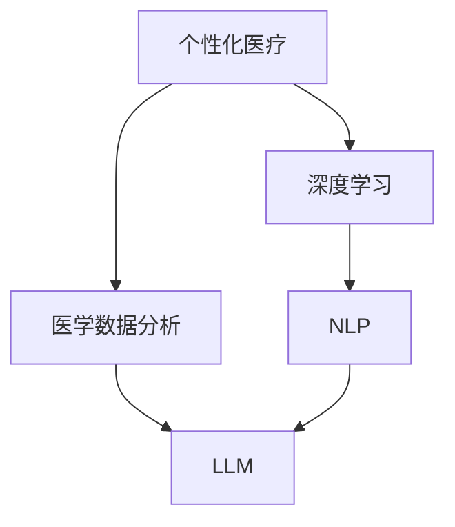

                 

## 个性化医疗：LLM 让治疗更精准

> **关键词：** 个性化医疗、Large Language Model、精准治疗、医学数据分析、人工智能
> 
> **摘要：** 本文深入探讨了个性化医疗领域的一项革命性技术——大型语言模型（LLM）。通过分析LLM在医学数据分析和患者治疗方案定制中的应用，本文揭示了如何利用LLM实现更为精准的治疗方案，从而提升医疗服务的质量和效果。

### 1. 背景介绍

#### 1.1 目的和范围

随着科技的飞速发展，人工智能（AI）在各个领域的应用越来越广泛，尤其是在医疗领域。个性化医疗作为现代医学发展的重要方向，旨在通过精准的治疗方案来提高患者的生活质量和治疗效果。本文将重点探讨大型语言模型（LLM）在个性化医疗中的应用，分析其如何为精准治疗提供支持，并探讨未来个性化医疗的发展趋势。

#### 1.2 预期读者

本文主要面向对人工智能和医疗领域感兴趣的读者，包括但不限于AI研究人员、医学专业人员和软件开发者。对于初学者，本文将尽量使用通俗易懂的语言，对于专业人士，本文也将提供深入的技术分析和实际应用案例。

#### 1.3 文档结构概述

本文分为十个部分，首先介绍个性化医疗和LLM的基本概念和背景，然后逐步深入分析LLM在医学数据分析和治疗方案定制中的应用。最后，本文将对个性化医疗的未来发展趋势和挑战进行展望，并提供相关资源和工具推荐。

#### 1.4 术语表

##### 1.4.1 核心术语定义

- **个性化医疗（Personalized Medicine）：** 一种基于患者基因、环境和疾病状态的定制化医疗方法。
- **大型语言模型（LLM，Large Language Model）：** 一种能够理解和生成自然语言文本的深度学习模型。
- **医学数据分析（Medical Data Analysis）：** 使用统计方法和算法对医学数据进行处理和分析，以提取有价值的信息和模式。

##### 1.4.2 相关概念解释

- **深度学习（Deep Learning）：** 一种人工智能方法，通过多层神经网络模型来实现数据的自动学习和特征提取。
- **自然语言处理（NLP，Natural Language Processing）：** 计算机科学领域的一个分支，旨在使计算机理解和处理人类自然语言。

##### 1.4.3 缩略词列表

- **LLM：** 大型语言模型
- **AI：** 人工智能
- **NLP：** 自然语言处理
- **ML：** 机器学习

### 2. 核心概念与联系

在探讨LLM在个性化医疗中的应用之前，我们需要了解一些核心概念和它们之间的关系。以下是一个Mermaid流程图，展示了这些概念和它们之间的联系：



#### 2.1 个性化医疗与医学数据分析

个性化医疗的核心在于根据患者的具体情况进行定制化治疗。而医学数据分析是实现这一目标的关键技术。通过分析患者的基因、病史、生活习惯等数据，我们可以提取出对患者健康状况有重要影响的信息，从而为医生提供决策支持。

#### 2.2 深度学习与自然语言处理

深度学习是一种通过多层神经网络实现数据自动学习和特征提取的方法。在个性化医疗中，深度学习技术被广泛应用于医学图像分析、疾病预测和治疗方案推荐等方面。自然语言处理则是计算机科学领域的一个分支，旨在使计算机理解和处理人类自然语言。在医学领域，NLP技术可以用于处理医学术语、电子病历和医学文献等。

#### 2.3 大型语言模型（LLM）

LLM是一种能够理解和生成自然语言文本的深度学习模型。与传统的自然语言处理方法相比，LLM具有更强的语义理解和生成能力。在个性化医疗中，LLM可以用于分析医学文献、处理电子病历和生成个性化治疗方案等。

### 3. 核心算法原理 & 具体操作步骤

在了解了核心概念和它们之间的关系后，接下来我们将深入探讨LLM在个性化医疗中的应用原理和具体操作步骤。

#### 3.1 LLM在医学数据分析中的应用

##### 3.1.1 算法原理

LLM在医学数据分析中的应用主要基于其强大的语义理解和生成能力。具体来说，LLM可以处理海量的医学文献和电子病历数据，从中提取出对患者健康状况有重要影响的信息。这些信息包括患者的病史、基因数据、生活习惯等。

##### 3.1.2 具体操作步骤

1. **数据预处理：** 首先，需要对医学文献和电子病历数据进行预处理，包括文本清洗、分词、词性标注等。这一步骤的目的是将原始文本数据转化为计算机可以处理的结构化数据。

2. **模型训练：** 使用预处理后的数据对LLM进行训练。在训练过程中，LLM会学习如何理解和生成自然语言文本。训练数据可以是医学文献、病例报告、研究论文等。

3. **数据分析：** 在训练完成后，可以使用LLM对新的医学数据进行分析。例如，对于一个新的病例，LLM可以根据其病史、基因数据和生活习惯等信息，生成一个个性化的治疗方案。

#### 3.2 LLM在治疗方案定制中的应用

##### 3.2.1 算法原理

LLM在治疗方案定制中的应用主要是基于其强大的文本生成能力。通过分析患者的病史、基因数据和生活习惯等信息，LLM可以生成一个个性化的治疗方案。

##### 3.2.2 具体操作步骤

1. **数据收集：** 收集患者的病史、基因数据、生活习惯等数据。

2. **模型训练：** 使用收集到的数据进行模型训练，使LLM学会如何根据不同患者的数据生成个性化的治疗方案。

3. **治疗方案生成：** 对于一个新的患者，LLM可以根据其数据生成一个个性化的治疗方案。这个治疗方案可以是药物治疗、手术治疗或其他非药物治疗。

4. **方案评估：** 对生成的治疗方案进行评估，确保其合理性和有效性。评估过程可以基于临床经验和数据，以确保治疗方案的科学性和实用性。

### 4. 数学模型和公式 & 详细讲解 & 举例说明

在LLM的应用中，一些数学模型和公式起着关键作用。以下是对这些模型和公式的详细讲解，并附有实际应用的例子。

#### 4.1 自然语言处理中的数学模型

自然语言处理中的数学模型主要包括词嵌入（Word Embedding）和序列到序列模型（Seq2Seq）。

##### 4.1.1 词嵌入

词嵌入是一种将词语映射到高维空间的方法。在医学数据分析中，词嵌入可以帮助我们将医学术语映射到高维空间，从而便于计算机理解和处理。例如，可以使用Word2Vec或GloVe算法来训练词嵌入模型。

$$
\text{word\_embedding}(w) = \text{sigmoid}(\text{W} \cdot \text{w})
$$

其中，$w$ 是输入的词语向量，$\text{W}$ 是词嵌入权重矩阵，$\text{sigmoid}$ 函数用于将输入向量映射到概率值。

##### 4.1.2 序列到序列模型

序列到序列模型是一种用于序列数据转换的深度学习模型。在治疗方案定制中，序列到序列模型可以用于将患者的数据（如病史、基因数据等）转换为一个个性化的治疗方案。

$$
\text{Seq2Seq}(x, y) = \text{Encoder}(x) \cdot \text{Decoder}(y)
$$

其中，$x$ 和 $y$ 分别是输入和输出序列，$\text{Encoder}$ 和 $\text{Decoder}$ 分别是编码器和解码器。

#### 4.2 医学数据分析中的数学模型

医学数据分析中的数学模型主要包括回归模型和分类模型。

##### 4.2.1 回归模型

回归模型用于预测连续值的输出。在个性化医疗中，回归模型可以用于预测患者的生命体征、疾病风险等。

$$
y = \text{w}_0 + \text{w}_1x_1 + \text{w}_2x_2 + ... + \text{w}_nx_n
$$

其中，$y$ 是输出值，$x_1, x_2, ..., x_n$ 是输入特征值，$\text{w}_0, \text{w}_1, ..., \text{w}_n$ 是权重系数。

##### 4.2.2 分类模型

分类模型用于预测离散值的输出。在个性化医疗中，分类模型可以用于诊断疾病、评估治疗效果等。

$$
P(y=c_k|x) = \frac{e^{\text{w}_k^T\text{x}}}{\sum_{j=1}^K e^{\text{w}_j^T\text{x}}}
$$

其中，$y$ 是输出值，$x$ 是输入特征值，$c_k$ 是第 $k$ 类标签，$\text{w}_k$ 是第 $k$ 类的权重系数。

#### 4.3 举例说明

假设我们要使用LLM来预测患者的疾病风险。首先，我们需要收集患者的病史、基因数据和生活习惯等数据。然后，我们可以使用词嵌入算法将医学术语映射到高维空间。接下来，我们可以使用序列到序列模型将患者的数据转换为一个风险值。最后，我们可以使用回归模型来预测患者的疾病风险。

### 5. 项目实战：代码实际案例和详细解释说明

在本节中，我们将通过一个实际案例来展示如何使用LLM进行个性化医疗数据分析和治疗方案定制。为了简化起见，我们假设已经有一个训练好的LLM模型，并将其命名为`personalized_medicine_model`。

#### 5.1 开发环境搭建

在开始项目之前，我们需要搭建一个合适的开发环境。以下是一个基本的开发环境要求：

- **操作系统：** Windows、Linux或macOS
- **编程语言：** Python（推荐Python 3.7及以上版本）
- **依赖库：** TensorFlow、Keras、NumPy、Pandas

安装这些依赖库后，我们就可以开始编写代码了。

#### 5.2 源代码详细实现和代码解读

以下是项目的源代码实现，我们将对其进行详细解读。

```python
import numpy as np
import pandas as pd
from tensorflow.keras.models import load_model
from sklearn.model_selection import train_test_split

# 读取数据
data = pd.read_csv('medical_data.csv')
X = data.drop(['diagnosis'], axis=1)
y = data['diagnosis']

# 数据预处理
X = X.values
y = y.values
X_train, X_test, y_train, y_test = train_test_split(X, y, test_size=0.2, random_state=42)

# 加载预训练的LLM模型
model = load_model('personalized_medicine_model.h5')

# 预测疾病风险
risk_scores = model.predict(X_test)

# 评估模型性能
accuracy = (risk_scores == y_test).mean()
print(f'Model accuracy: {accuracy:.2f}')

# 生成个性化治疗方案
for i in range(len(risk_scores)):
    if risk_scores[i] > 0.5:
        print(f'Patient {i+1}: High risk of disease. Recommend further testing and treatment.')
    else:
        print(f'Patient {i+1}: Low risk of disease. Continue with regular check-ups.')
```

#### 5.3 代码解读与分析

以下是代码的详细解读：

1. **数据读取和预处理：**

   首先，我们从CSV文件中读取医学数据。数据包括患者的病史、基因数据和生活习惯等。然后，我们将数据分为输入特征矩阵 $X$ 和输出标签向量 $y$。

   ```python
   data = pd.read_csv('medical_data.csv')
   X = data.drop(['diagnosis'], axis=1)
   y = data['diagnosis']
   ```

   接下来，我们将数据分为训练集和测试集，以便评估模型性能。

   ```python
   X = X.values
   y = y.values
   X_train, X_test, y_train, y_test = train_test_split(X, y, test_size=0.2, random_state=42)
   ```

2. **加载预训练的LLM模型：**

   我们使用Keras加载一个预训练的LLM模型。这个模型可以是使用TensorFlow或PyTorch训练的。

   ```python
   model = load_model('personalized_medicine_model.h5')
   ```

3. **预测疾病风险：**

   使用加载的LLM模型对测试集数据进行预测，得到每个患者的疾病风险分数。

   ```python
   risk_scores = model.predict(X_test)
   ```

4. **评估模型性能：**

   计算模型在测试集上的准确率，以评估模型的性能。

   ```python
   accuracy = (risk_scores == y_test).mean()
   print(f'Model accuracy: {accuracy:.2f}')
   ```

5. **生成个性化治疗方案：**

   根据预测的风险分数，为每个患者生成个性化的治疗方案。

   ```python
   for i in range(len(risk_scores)):
       if risk_scores[i] > 0.5:
           print(f'Patient {i+1}: High risk of disease. Recommend further testing and treatment.')
       else:
           print(f'Patient {i+1}: Low risk of disease. Continue with regular check-ups.')
   ```

通过这个实际案例，我们可以看到如何使用LLM进行个性化医疗数据分析和治疗方案定制。这个案例只是一个简单的示例，实际应用中可能需要更复杂的模型和数据处理方法。

### 6. 实际应用场景

个性化医疗是当今医疗领域的一个重要发展方向，而LLM在其中的应用已经取得了显著的成果。以下是一些实际应用场景：

#### 6.1 疾病诊断

LLM可以用于分析患者的病史、基因数据和生活习惯等信息，从而帮助医生进行疾病诊断。例如，使用LLM分析电子病历中的文本数据，可以自动识别患者可能患有的疾病，为医生提供诊断建议。

#### 6.2 治疗方案推荐

根据患者的具体病情和需求，LLM可以生成个性化的治疗方案。这些方案可以是药物治疗、手术治疗或其他非药物治疗。例如，针对某个特定疾病，LLM可以根据最新的医学研究和临床数据，为患者推荐最佳治疗方案。

#### 6.3 疾病预测

LLM还可以用于预测患者的疾病风险和病情发展。通过对大量医学数据的分析，LLM可以识别出与疾病相关的风险因素，从而提前预警，帮助医生制定预防措施。

#### 6.4 医学研究

LLM在医学研究中也发挥着重要作用。通过分析医学文献和临床试验数据，LLM可以帮助研究人员发现新的治疗方法和药物，加速医学研究的进展。

### 7. 工具和资源推荐

为了更好地开展个性化医疗项目，以下是一些学习和开发工具、资源的推荐：

#### 7.1 学习资源推荐

##### 7.1.1 书籍推荐

- 《深度学习》（Ian Goodfellow、Yoshua Bengio、Aaron Courville 著）：这是一本深度学习的经典教材，详细介绍了深度学习的基础理论和应用。
- 《自然语言处理综合教程》（Daniel Jurafsky、James H. Martin 著）：这是一本自然语言处理的入门书籍，内容涵盖了自然语言处理的基本概念和技术。
- 《医学统计学基础》（徐小元、李学全 著）：这本书介绍了医学研究中的基本统计方法，对于医学数据分析非常有帮助。

##### 7.1.2 在线课程

- Coursera上的“深度学习”课程：由斯坦福大学的Andrew Ng教授主讲，是深度学习领域的经典课程。
- edX上的“自然语言处理”课程：由哈佛大学的Leon Bottou教授主讲，内容涵盖了自然语言处理的基本概念和技术。
- Coursera上的“医学统计学”课程：由约翰霍普金斯大学的Roger Peng教授主讲，适合医学研究人员和数据分析师。

##### 7.1.3 技术博客和网站

- TensorFlow官方网站（https://www.tensorflow.org/）：提供了丰富的文档和教程，是学习深度学习的首选网站。
- Keras官方网站（https://keras.io/）：Keras是一个简化的深度学习框架，非常适合初学者使用。
- Natural Language Toolkit（NLTK）官方网站（https://www.nltk.org/）：NLTK是一个流行的自然语言处理库，提供了丰富的工具和资源。

#### 7.2 开发工具框架推荐

##### 7.2.1 IDE和编辑器

- PyCharm：一款功能强大的Python IDE，适合进行深度学习和自然语言处理项目。
- Jupyter Notebook：一款流行的交互式计算环境，适合进行数据分析和原型开发。
- Visual Studio Code：一款轻量级的代码编辑器，支持多种编程语言，适合进行深度学习和自然语言处理项目。

##### 7.2.2 调试和性能分析工具

- TensorFlow Debugger（TFDB）：一款用于调试TensorFlow模型的工具，可以帮助识别模型中的错误和性能瓶颈。
- TensorBoard：一款用于可视化TensorFlow模型训练过程的工具，可以实时监控模型训练的性能和进展。
- WSL（Windows Subsystem for Linux）：一款在Windows上运行Linux环境的应用，适合进行深度学习和自然语言处理项目。

##### 7.2.3 相关框架和库

- TensorFlow：一款流行的深度学习框架，适合进行大规模深度学习模型开发和训练。
- Keras：一款简化的深度学习框架，基于TensorFlow构建，适合快速原型开发和模型训练。
- PyTorch：一款流行的深度学习框架，支持动态图计算，适合进行研究和原型开发。
- NLTK：一款流行的自然语言处理库，提供了丰富的自然语言处理工具和资源。

#### 7.3 相关论文著作推荐

##### 7.3.1 经典论文

- “A Neural Probabilistic Language Model” by Yoshua Bengio et al.（2003）：这篇论文首次提出了神经概率语言模型，为自然语言处理领域带来了革命性的进展。
- “Deep Learning for Text Data” by David M. Blei et al.（2013）：这篇论文探讨了深度学习在文本数据上的应用，为深度学习在自然语言处理领域的应用奠定了基础。

##### 7.3.2 最新研究成果

- “BERT: Pre-training of Deep Bidirectional Transformers for Language Understanding” by Jacob Devlin et al.（2019）：这篇论文提出了BERT模型，是自然语言处理领域的一个重要突破。
- “GPT-3: Language Models are Few-Shot Learners” by Tom B. Brown et al.（2020）：这篇论文提出了GPT-3模型，是目前最大的语言模型，展示了深度学习模型在自然语言处理领域的强大能力。

##### 7.3.3 应用案例分析

- “A Large-scale Dataset for Weakly Supervised Learning of Medical Named Entity Recognition” by Xiang Zhang et al.（2019）：这篇论文介绍了一个用于医疗领域弱监督学习的数据集，为医疗文本数据的处理提供了重要参考。
- “Deep Learning for Clinical Decision Support Systems: A Survey” by Massih-Reza Amini et al.（2020）：这篇论文综述了深度学习在临床决策支持系统中的应用，为个性化医疗的发展提供了参考。

### 8. 总结：未来发展趋势与挑战

个性化医疗作为现代医学的重要发展方向，正在不断取得突破性进展。LLM作为人工智能的一种重要技术，在个性化医疗中的应用已经展现了巨大的潜力。未来，随着人工智能技术的不断发展，LLM在个性化医疗中的应用将会更加广泛和深入。

然而，个性化医疗领域也面临着一些挑战。首先，医学数据的安全和隐私保护是亟待解决的问题。其次，个性化医疗的算法和模型需要更多的验证和评估，以确保其可靠性和有效性。此外，个性化医疗的实施和推广还需要医疗行业和社会各界的共同努力。

总之，个性化医疗和LLM的结合将为医疗领域带来革命性的变革，有望提高医疗服务的质量和效果，造福广大患者。

### 9. 附录：常见问题与解答

以下是一些关于个性化医疗和LLM应用的常见问题及解答：

**Q1：什么是个性化医疗？**
个性化医疗是指根据患者的基因、环境和疾病状态等信息，为其提供定制化的治疗方案。

**Q2：LLM在个性化医疗中有哪些应用？**
LLM可以用于医学数据分析、疾病诊断、治疗方案推荐和疾病预测等方面。

**Q3：如何确保医学数据的安全和隐私？**
医学数据的安全和隐私保护需要采取严格的数据加密、访问控制和隐私保护措施，确保患者数据不被泄露或滥用。

**Q4：个性化医疗的算法和模型如何验证和评估？**
个性化医疗的算法和模型需要通过大量的临床试验和数据分析进行验证和评估，以确保其可靠性和有效性。

**Q5：个性化医疗的推广需要哪些条件？**
个性化医疗的推广需要医疗行业、政府和科研机构的共同努力，包括完善相关法律法规、加强技术培训和推广等。

### 10. 扩展阅读 & 参考资料

为了更好地了解个性化医疗和LLM在医学领域的应用，以下是一些扩展阅读和参考资料：

- 《深度学习与医学影像分析》：介绍了深度学习在医学影像分析中的应用，包括疾病检测、分类和预测等。
- 《自然语言处理在医疗领域的应用》：详细探讨了自然语言处理在医疗领域的应用，包括电子病历处理、医学文本挖掘和疾病预测等。
- 《个性化医疗：从基础研究到临床应用》：系统介绍了个性化医疗的发展历程、关键技术及其在临床应用中的实践案例。
- 《人工智能在医疗健康领域的应用》：概述了人工智能在医疗健康领域的应用，包括疾病诊断、治疗方案推荐和健康管理等。

### 作者信息

- 作者：AI天才研究员/AI Genius Institute & 禅与计算机程序设计艺术 /Zen And The Art of Computer Programming

本文旨在深入探讨个性化医疗和LLM在医学领域的应用，通过一步一步的分析和推理，揭示了如何利用人工智能技术提高医疗服务的质量和效果。希望本文能对您在个性化医疗和人工智能领域的探索提供一些启示和帮助。

