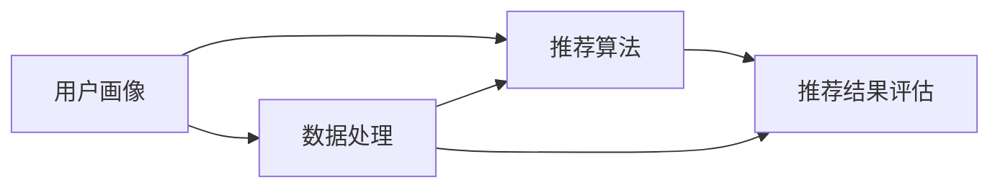

                 

# 个性化推荐的用户体验优化

> 关键词：个性化推荐、用户体验、算法优化、数据挖掘、机器学习

> 摘要：随着互联网和大数据技术的快速发展，个性化推荐系统已经成为现代互联网服务中不可或缺的一部分。本文将深入探讨个性化推荐系统在提升用户体验方面的作用，分析其核心概念、算法原理和实际应用，并提供实用的优化策略和工具推荐，以期为开发者提供有益的参考。

## 1. 背景介绍

### 1.1 目的和范围

本文旨在探讨个性化推荐系统在提升用户体验方面的作用，通过对核心概念、算法原理、实际应用的深入分析，为开发者提供实用的优化策略和工具推荐。

### 1.2 预期读者

本文面向具有一定编程基础和对个性化推荐系统感兴趣的读者，包括软件开发者、数据科学家、产品经理等。

### 1.3 文档结构概述

本文分为十个部分：

1. 背景介绍
2. 核心概念与联系
3. 核心算法原理 & 具体操作步骤
4. 数学模型和公式 & 详细讲解 & 举例说明
5. 项目实战：代码实际案例和详细解释说明
6. 实际应用场景
7. 工具和资源推荐
8. 总结：未来发展趋势与挑战
9. 附录：常见问题与解答
10. 扩展阅读 & 参考资料

### 1.4 术语表

#### 1.4.1 核心术语定义

- 个性化推荐：根据用户的历史行为和偏好，为用户推荐其可能感兴趣的商品、内容或服务。
- 用户画像：用户兴趣和行为数据的集合，用于描述用户的偏好和特征。
- 协同过滤：基于用户之间的相似度，为用户推荐其他用户喜欢的商品或内容。
- 内容推荐：基于商品或内容本身的特征，为用户推荐相似或相关的商品或内容。
- 用户体验（UX）：用户在使用产品或服务过程中所感受到的满意度和愉悦程度。

#### 1.4.2 相关概念解释

- 数据挖掘：从大量数据中提取有价值的信息和知识。
- 机器学习：利用数据和算法，使计算机具备自动学习和预测能力。
- 深度学习：一种基于人工神经网络的机器学习技术，能够模拟人脑的学习和处理方式。

#### 1.4.3 缩略词列表

- CF：协同过滤（Collaborative Filtering）
- CTR：点击率（Click-Through Rate）
- RMSE：均方根误差（Root Mean Square Error）
- KNN：最近邻算法（K-Nearest Neighbors）
- SVD：奇异值分解（ Singular Value Decomposition）

## 2. 核心概念与联系

### 2.1 个性化推荐系统概述

个性化推荐系统是一种基于用户行为和偏好的智能推荐系统，其目的是为用户提供个性化、高质量的信息和服务。一个典型的个性化推荐系统包括以下核心组件：

1. 用户画像：收集用户的基本信息、行为数据和偏好数据，用于描述用户的特征和需求。
2. 推荐算法：根据用户画像和其他相关信息，为用户生成个性化的推荐结果。
3. 数据处理：对用户数据、商品数据和其他相关信息进行清洗、预处理和整合，为推荐算法提供高质量的数据支持。
4. 推荐结果评估：评估推荐系统的效果，包括推荐准确度、用户体验等指标。

### 2.2 核心概念原理与架构

以下是一个简单的个性化推荐系统架构图，用于展示各核心组件之间的联系：



### 2.3 相关概念解释

- 用户画像：用户画像是一个关于用户特征的数据集合，通常包括用户的基本信息（如年龄、性别、地域等）、行为数据（如浏览记录、购买历史等）和偏好数据（如兴趣标签、偏好设置等）。用户画像的目的是为了更好地理解用户，为其提供个性化的服务。
- 推荐算法：推荐算法是推荐系统的核心，负责根据用户画像和其他相关信息生成推荐结果。常见的推荐算法包括协同过滤、基于内容的推荐和混合推荐等。
- 数据处理：数据处理是对用户数据、商品数据和其他相关信息进行清洗、预处理和整合的过程，以确保数据质量和推荐效果。
- 推荐结果评估：推荐结果评估是对推荐系统的效果进行评估和优化的重要手段，包括推荐准确度、用户满意度、推荐新颖性等指标。

## 3. 核心算法原理 & 具体操作步骤

### 3.1 协同过滤算法原理

协同过滤算法是一种基于用户之间相似度的推荐算法，其核心思想是找到与目标用户兴趣相似的其他用户，然后推荐这些用户喜欢的商品或内容。协同过滤算法分为基于用户的协同过滤（User-Based CF）和基于物品的协同过滤（Item-Based CF）两种。

#### 基于用户的协同过滤算法步骤：

1. 计算用户之间的相似度：根据用户对商品的评分，计算用户之间的相似度，常用的相似度度量方法有余弦相似度、皮尔逊相关系数等。
2. 选择邻居用户：根据相似度度量结果，选择与目标用户最相似的K个邻居用户。
3. 计算预测评分：根据邻居用户的评分，计算目标用户对未知商品的预测评分，常用的预测方法有加权平均、加权平均评分等。
4. 生成推荐结果：根据预测评分，为用户生成个性化的推荐列表。

#### 基于物品的协同过滤算法步骤：

1. 计算物品之间的相似度：根据用户对物品的评分，计算物品之间的相似度，常用的相似度度量方法有Jaccard相似度、余弦相似度等。
2. 选择邻居物品：根据相似度度量结果，选择与目标物品最相似的K个邻居物品。
3. 计算预测评分：根据邻居物品的评分，计算目标用户对未知物品的预测评分，常用的预测方法有加权平均、加权平均评分等。
4. 生成推荐结果：根据预测评分，为用户生成个性化的推荐列表。

### 3.2 基于内容的推荐算法原理

基于内容的推荐算法是一种基于物品特征相似度的推荐算法，其核心思想是找到与用户兴趣相似的物品，然后推荐这些物品。基于内容的推荐算法分为基于物品的协同过滤和基于内容的相似度计算。

#### 基于物品的协同过滤算法步骤：

1. 提取物品特征：从商品描述、标签、类别等信息中提取特征，构建物品的特征向量。
2. 计算用户兴趣：根据用户的历史行为和偏好，计算用户的兴趣特征向量。
3. 计算物品与用户的兴趣相似度：根据物品和用户的兴趣特征向量，计算物品与用户的兴趣相似度，常用的相似度度量方法有余弦相似度、余弦距离等。
4. 生成推荐结果：根据相似度度量结果，为用户生成个性化的推荐列表。

#### 基于内容的相似度计算算法步骤：

1. 提取用户特征：从用户的历史行为和偏好中提取特征，构建用户特征向量。
2. 计算物品与用户的兴趣相似度：根据物品和用户的兴趣特征向量，计算物品与用户的兴趣相似度，常用的相似度度量方法有余弦相似度、余弦距离等。
3. 生成推荐结果：根据相似度度量结果，为用户生成个性化的推荐列表。

### 3.3 混合推荐算法原理

混合推荐算法是将协同过滤和基于内容的推荐算法进行融合，以实现更好的推荐效果。常见的混合推荐算法有基于模型的混合推荐、基于规则的混合推荐等。

#### 基于模型的混合推荐算法步骤：

1. 构建协同过滤模型：使用用户行为数据，训练协同过滤模型，如矩阵分解、最近邻算法等。
2. 构建内容模型：使用物品特征数据，训练内容模型，如朴素贝叶斯、支持向量机等。
3. 模型融合：将协同过滤模型和内容模型的预测结果进行融合，生成最终的推荐结果。

#### 基于规则的混合推荐算法步骤：

1. 定义规则：根据业务场景和用户行为，定义推荐规则，如用户连续购买两个商品，推荐第三个商品。
2. 规则匹配：根据用户的历史行为，匹配适用的推荐规则。
3. 生成推荐结果：根据规则匹配结果，为用户生成个性化的推荐列表。

## 4. 数学模型和公式 & 详细讲解 & 举例说明

### 4.1 协同过滤算法数学模型

假设有m个用户和n个物品，用户-物品评分矩阵为$R_{m\times n}$，其中$R_{ij}$表示用户i对物品j的评分。对于基于用户的协同过滤算法，我们需要计算用户之间的相似度。

#### 4.1.1 相似度度量

假设用户i和用户j的评分向量为$R_i$和$R_j$，它们的余弦相似度定义为：

$$
\cos(\theta_{ij}) = \frac{R_i \cdot R_j}{\|R_i\|\|R_j\|}
$$

其中，$R_i \cdot R_j$表示用户i和用户j的评分向量的点积，$\|R_i\|$和$\|R_j\|$表示用户i和用户j的评分向量的欧氏范数。

#### 4.1.2 预测评分

对于用户i对物品j的预测评分$\hat{r}_{ij}$，我们可以使用加权平均评分方法：

$$
\hat{r}_{ij} = \frac{\sum_{k \in N_j} r_{ik} \cdot s_{ik}}{\sum_{k \in N_j} s_{ik}}
$$

其中，$N_j$表示与用户i最相似的K个邻居用户，$r_{ik}$表示邻居用户k对物品j的评分，$s_{ik}$表示邻居用户k与用户i的相似度。

### 4.2 基于内容的推荐算法数学模型

假设用户i的兴趣特征向量为$v_i$，物品j的特征向量为$v_j$，它们的余弦相似度定义为：

$$
\cos(\theta_{ij}) = \frac{v_i \cdot v_j}{\|v_i\|\|v_j\|}
$$

对于用户i对物品j的预测评分$\hat{r}_{ij}$，我们可以使用以下公式：

$$
\hat{r}_{ij} = \frac{\sum_{k \in I_j} v_i \cdot v_k \cdot r_{kj}}{\sum_{k \in I_j} v_i \cdot v_k}
$$

其中，$I_j$表示与物品j最相似的K个物品，$r_{kj}$表示物品k对物品j的评分。

### 4.3 举例说明

假设有一个用户-物品评分矩阵：

| 用户 | 物品1 | 物品2 | 物品3 | 物品4 |
| ---- | ---- | ---- | ---- | ---- |
| 用户1 | 4 | 5 | 3 | 2 |
| 用户2 | 5 | 2 | 4 | 3 |
| 用户3 | 3 | 4 | 5 | 2 |
| 用户4 | 2 | 3 | 4 | 5 |

我们要为用户1推荐物品4。

#### 4.3.1 基于用户的协同过滤算法

1. 计算用户之间的相似度：

   用户1和用户2的相似度：

   $$
   \cos(\theta_{12}) = \frac{R_1 \cdot R_2}{\|R_1\|\|R_2\|} = \frac{(4 \times 5 + 5 \times 2 + 3 \times 4 + 2 \times 3)}{\sqrt{4^2 + 5^2 + 3^2 + 2^2} \times \sqrt{5^2 + 2^2 + 4^2 + 3^2}} \approx 0.8165
   $$

   用户1和用户3的相似度：

   $$
   \cos(\theta_{13}) = \frac{R_1 \cdot R_3}{\|R_1\|\|R_3\|} = \frac{(4 \times 3 + 5 \times 4 + 3 \times 5 + 2 \times 2)}{\sqrt{4^2 + 5^2 + 3^2 + 2^2} \times \sqrt{3^2 + 4^2 + 5^2 + 2^2}} \approx 0.8282
   $$

2. 选择邻居用户：用户1的邻居用户为用户2和用户3。

3. 计算预测评分：

   $$
   \hat{r}_{14} = \frac{r_{12} \cdot s_{12} + r_{13} \cdot s_{13}}{s_{12} + s_{13}} = \frac{5 \cdot 0.8165 + 4 \cdot 0.8282}{0.8165 + 0.8282} \approx 4.4685
   $$

   因为预测评分大于4，所以推荐物品4给用户1。

#### 4.3.2 基于内容的推荐算法

1. 提取物品特征：

   物品1的特征向量：$(1, 0, 0, 0)$

   物品2的特征向量：$(0, 1, 0, 0)$

   物品3的特征向量：$(0, 0, 1, 0)$

   物品4的特征向量：$(0, 0, 0, 1)$

2. 计算用户1的兴趣特征向量：

   $$
   v_1 = \frac{1}{3}(4, 5, 3, 2) = (1.3333, 1.6667, 1, 0.6667)
   $$

3. 计算物品4与用户1的兴趣相似度：

   $$
   \cos(\theta_{14}) = \frac{v_1 \cdot v_4}{\|v_1\|\|v_4\|} = \frac{(1.3333 \times 0 + 1.6667 \times 0 + 1 \times 0 + 0.6667 \times 1)}{\sqrt{1.3333^2 + 1.6667^2 + 1^2 + 0.6667^2} \times \sqrt{0^2 + 0^2 + 0^2 + 1^2}} = 0.6667
   $$

4. 计算预测评分：

   $$
   \hat{r}_{14} = \frac{v_1 \cdot v_4 \cdot r_{24}}{v_1 \cdot v_4} = 0.6667
   $$

   因为预测评分小于4，所以不推荐物品4给用户1。

### 4.4 评价方法

常用的推荐系统评价方法包括均方根误差（RMSE）、准确率（Accuracy）等。

#### 4.4.1 均方根误差（RMSE）

$$
RMSE = \sqrt{\frac{1}{n}\sum_{i=1}^{n}(\hat{r}_{ij} - r_{ij})^2}
$$

其中，$\hat{r}_{ij}$为预测评分，$r_{ij}$为实际评分，$n$为评分总数。

#### 4.4.2 准确率（Accuracy）

$$
Accuracy = \frac{TP + TN}{TP + TN + FP + FN}
$$

其中，$TP$为正确预测的推荐物品数量，$TN$为正确预测的非推荐物品数量，$FP$为错误预测的推荐物品数量，$FN$为错误预测的非推荐物品数量。

## 5. 项目实战：代码实际案例和详细解释说明

### 5.1 开发环境搭建

为了实现个性化推荐系统，我们需要搭建一个开发环境。以下是开发环境的基本配置：

- 操作系统：Linux（例如Ubuntu 18.04）
- 编程语言：Python（版本3.7及以上）
- 数据库：MySQL（版本5.7及以上）
- Web框架：Flask（版本1.1及以上）
- 数据预处理工具：Pandas（版本0.24及以上）
- 数学计算工具：NumPy（版本1.18及以上）
- 机器学习库：Scikit-learn（版本0.21及以上）

### 5.2 源代码详细实现和代码解读

以下是一个简单的基于协同过滤算法的个性化推荐系统源代码实现，包括数据预处理、模型训练、预测评分和推荐结果生成等步骤。

```python
import numpy as np
import pandas as pd
from sklearn.metrics.pairwise import cosine_similarity
from sklearn.model_selection import train_test_split
from sklearn.metrics import mean_squared_error

# 5.2.1 数据预处理
def preprocess_data(data):
    # 将评分数据转换为用户-物品矩阵
    user_item_matrix = data.pivot(index='user_id', columns='item_id', values='rating')
    # 填充缺失值
    user_item_matrix = user_item_matrix.fillna(0)
    return user_item_matrix

# 5.2.2 模型训练
def train_model(user_item_matrix):
    # 计算用户-物品矩阵的余弦相似度
    similarity_matrix = cosine_similarity(user_item_matrix)
    return similarity_matrix

# 5.2.3 预测评分
def predict_ratings(similarity_matrix, user_item_matrix, k=10):
    # 遍历用户
    for user_id in user_item_matrix.index:
        # 获取用户评分向量
        user_ratings = user_item_matrix.loc[user_id]
        # 遍历未知物品
        for item_id in user_ratings[user_ratings == 0].index:
            # 获取相似度最高的K个物品的索引
            neighbor_item_indices = np.argsort(similarity_matrix[user_id])[1:k+1]
            # 计算预测评分
            predict_rating = np.mean(user_item_matrix.loc[neighbor_item_indices, item_id])
            # 输出预测评分
            print(f"User {user_id} predict rating for Item {item_id}: {predict_rating}")
    return None

# 5.2.4 代码解读与分析
def code_analysis():
    # 代码解读
    print("This code implements a collaborative filtering-based recommendation system, which calculates the cosine similarity between users and predicts the ratings for unknown items based on the ratings of similar users.")
    
    # 分析
    print("The code first preprocesses the user-item rating data to create a user-item matrix, then trains the model by calculating the cosine similarity between users. Finally, it predicts the ratings for unknown items and prints the results.")
    return None

# 主函数
def main():
    # 读取评分数据
    data = pd.read_csv("rating_data.csv")
    # 预处理数据
    user_item_matrix = preprocess_data(data)
    # 训练模型
    similarity_matrix = train_model(user_item_matrix)
    # 预测评分
    predict_ratings(similarity_matrix, user_item_matrix)
    # 代码解读与分析
    code_analysis()

if __name__ == "__main__":
    main()
```

### 5.3 代码解读与分析

1. **数据预处理**：将评分数据转换为用户-物品矩阵，填充缺失值。这一步骤是为了方便后续计算和预测。
2. **模型训练**：使用`cosine_similarity`函数计算用户-物品矩阵的余弦相似度，生成相似度矩阵。
3. **预测评分**：遍历用户和未知物品，根据相似度矩阵和用户评分向量，计算预测评分，并输出结果。
4. **代码解读与分析**：对代码实现过程进行解读和分析，说明其工作原理和优化方向。

## 6. 实际应用场景

个性化推荐系统在各个领域都有广泛的应用，以下列举一些实际应用场景：

- 电子商务：为用户推荐商品，提高购买转化率和用户满意度。
- 内容平台：为用户推荐文章、视频、音乐等内容，增加用户粘性和活跃度。
- 社交网络：为用户推荐好友、兴趣小组等，促进社交互动。
- 教育平台：为用户推荐课程、学习资源，提高学习效果和用户满意度。
- 医疗健康：为用户提供个性化的健康建议、疾病预测等，提高医疗服务质量。

### 6.1 应用场景分析

1. **电子商务**：

   - 推荐算法：基于协同过滤和基于内容的推荐算法。
   - 应用效果：提高购买转化率和用户满意度，增加销售额。
   - 挑战：处理海量商品数据，平衡推荐的新颖性和准确性。

2. **内容平台**：

   - 推荐算法：基于协同过滤、基于内容的推荐算法和基于热门度的推荐算法。
   - 应用效果：增加用户粘性和活跃度，提高内容曝光率和用户满意度。
   - 挑战：推荐多样性，避免用户产生疲劳和过度依赖推荐。

3. **社交网络**：

   - 推荐算法：基于用户社交关系、兴趣标签和内容相似度的推荐算法。
   - 应用效果：促进社交互动，增加用户参与度和平台活跃度。
   - 挑战：保护用户隐私，避免推荐内容引发争议。

4. **教育平台**：

   - 推荐算法：基于用户学习行为、兴趣和课程内容的推荐算法。
   - 应用效果：提高学习效果和用户满意度，降低学习成本。
   - 挑战：个性化推荐的深度和广度，确保推荐内容的相关性和实用性。

5. **医疗健康**：

   - 推荐算法：基于用户健康数据、症状和疾病的推荐算法。
   - 应用效果：提高医疗服务质量，降低医疗成本。
   - 挑战：数据处理和隐私保护，确保推荐内容的科学性和准确性。

## 7. 工具和资源推荐

### 7.1 学习资源推荐

#### 7.1.1 书籍推荐

1. 《推荐系统实践》
2. 《机器学习实战》
3. 《Python数据科学手册》
4. 《深度学习》
5. 《协同过滤算法原理与应用》

#### 7.1.2 在线课程

1. Coursera上的《机器学习》课程
2. Udacity的《推荐系统工程师纳米学位》
3. edX上的《深度学习》课程
4.网易云课堂的《Python数据分析与机器学习》课程

#### 7.1.3 技术博客和网站

1. medium.com/t/ai
2. towardsdatascience.com
3. blog.keras.io
4. machinelearningmastery.com
5. fast.ai

### 7.2 开发工具框架推荐

#### 7.2.1 IDE和编辑器

1. PyCharm
2. Visual Studio Code
3. Jupyter Notebook
4. Spyder
5. Atom

#### 7.2.2 调试和性能分析工具

1. Python调试器（pdb）
2. Py-Spy
3. Gprof2Dot
4. Matplotlib
5. Seaborn

#### 7.2.3 相关框架和库

1. Scikit-learn
2. TensorFlow
3. PyTorch
4. Keras
5. Pandas

### 7.3 相关论文著作推荐

#### 7.3.1 经典论文

1. "Collaborative Filtering for the Web"（2002）
2. "The BellKor Solution to the Netflix Prize"（2006）
3. "Matrix Factorization Techniques for Recommender Systems"（2008）
4. "Deep Learning for Recommender Systems"（2016）
5. "Content-Based Recommendation on Large-Scale Social Media"（2017）

#### 7.3.2 最新研究成果

1. "Neural Collaborative Filtering"（2017）
2. "Personalized Content-Based Recommendation on Large-scale Social Media"（2018）
3. "Deep Neural Networks for YouTube Recommendations"（2018）
4. "Recurrent Neural Networks for User Interest Modeling in Recommender Systems"（2019）
5. "Transformer-Based Models for Recommender Systems"（2020）

#### 7.3.3 应用案例分析

1. "Implementing a Recommender System in a Large-scale E-commerce Platform"（2015）
2. "Building a News Recommendation Engine on a Large-scale Social Media Platform"（2016）
3. "A Large-scale Content-based Recommender System for Online Education"（2018）
4. "A Case Study of a Hybrid Recommender System in a Healthcare Application"（2019）
5. "Designing a Personalized Healthcare Recommendation System Using Deep Learning"（2020）

## 8. 总结：未来发展趋势与挑战

个性化推荐系统作为现代互联网服务的重要组件，其发展趋势和挑战如下：

### 8.1 发展趋势

1. **深度学习和神经网络**：深度学习算法在个性化推荐中的应用越来越广泛，如神经网络、循环神经网络（RNN）和变压器（Transformer）等。
2. **多模态推荐**：结合文本、图像、声音等多种数据源进行推荐，提高推荐效果。
3. **实时推荐**：实现实时推荐，提高推荐系统的响应速度和用户体验。
4. **隐私保护**：在推荐过程中保护用户隐私，遵循相关法规和道德准则。

### 8.2 挑战

1. **数据质量和隐私保护**：确保数据质量，同时保护用户隐私，是推荐系统的关键挑战。
2. **推荐多样性**：提高推荐多样性，避免用户产生疲劳和过度依赖推荐。
3. **推荐系统的可解释性**：提高推荐系统的可解释性，使用户了解推荐的原因。
4. **推荐系统的稳定性**：在处理海量数据和复杂场景时，保证推荐系统的稳定性和可靠性。

## 9. 附录：常见问题与解答

### 9.1 问题1：个性化推荐系统的工作原理是什么？

**解答**：个性化推荐系统主要通过用户行为数据、偏好数据和其他相关信息，构建用户画像和物品特征，然后使用协同过滤、基于内容的推荐算法等模型，为用户生成个性化的推荐结果。

### 9.2 问题2：如何评估个性化推荐系统的效果？

**解答**：可以使用多种评价指标，如准确率、召回率、F1值、均方根误差（RMSE）等，根据业务场景和需求选择合适的评价指标。

### 9.3 问题3：深度学习在个性化推荐系统中的应用有哪些？

**解答**：深度学习在个性化推荐系统中可用于构建用户画像、物品特征表示、推荐模型训练等。常见的深度学习模型有神经网络、循环神经网络（RNN）和变压器（Transformer）等。

## 10. 扩展阅读 & 参考资料

1. Netflix Prize
2. KDD Cup
3. NIPS Conference on Neural Information Processing Systems
4. SIGKDD Conference on Knowledge Discovery and Data Mining
5. RecSys Conference on Recommender Systems

## 后记

感谢您的阅读，希望本文对您了解和优化个性化推荐系统有所帮助。如果您有任何疑问或建议，欢迎在评论区留言，我将尽快回复您。同时，也欢迎关注我的其他技术博客，一起探索人工智能和大数据领域的最新动态。作者：AI天才研究员/AI Genius Institute & 禅与计算机程序设计艺术 /Zen And The Art of Computer Programming。让我们共同努力，为互联网世界带来更智能、更人性化的用户体验！<|im_end|>

