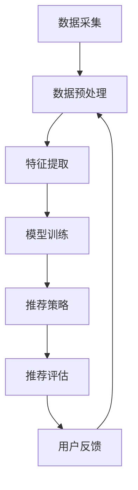

                 

# 个性化推荐系统的用户体验优化

## 关键词
- 个性化推荐系统
- 用户体验
- 优化策略
- 算法改进
- 数学模型
- 实战案例

## 摘要
本文深入探讨了个性化推荐系统的用户体验优化问题。首先，我们从背景介绍入手，明确了文章的目的和范围，以及预期读者。接着，通过核心概念与联系章节，阐述了个性化推荐系统的原理和架构，并使用Mermaid流程图进行了形象化展示。在核心算法原理部分，我们详细讲解了推荐系统的具体操作步骤，并结合伪代码进行了说明。随后，我们介绍了数学模型和公式，并通过实例进行了详细讲解。实战案例章节中，我们提供了代码实现和详细解释，以帮助读者更好地理解推荐系统的实践应用。最后，文章总结了实际应用场景，推荐了相关工具和资源，并对未来发展趋势与挑战进行了展望。通过本文的阅读，读者将能够全面了解个性化推荐系统的用户体验优化策略。

### 1. 背景介绍

#### 1.1 目的和范围

本文旨在探讨个性化推荐系统的用户体验优化问题。随着互联网技术的快速发展，个性化推荐系统已成为许多在线平台的重要功能，它能够根据用户的兴趣和偏好，为用户推荐相关内容，从而提高用户的满意度和使用粘性。然而，如何优化用户体验，使推荐系统能够更好地满足用户需求，仍然是一个具有挑战性的问题。

本文的范围将涵盖以下几个方面：

1. **个性化推荐系统的基本原理和架构**：介绍个性化推荐系统的基本概念，包括协同过滤、基于内容的推荐和混合推荐等方法，并使用Mermaid流程图展示其架构。
2. **核心算法原理与操作步骤**：详细讲解推荐系统的算法原理，包括特征提取、模型训练和推荐策略，并使用伪代码进行描述。
3. **数学模型与公式**：介绍推荐系统中常用的数学模型和公式，包括相似度计算、优化目标函数等，并通过实例进行说明。
4. **实战案例**：提供实际代码实现和详细解释，帮助读者更好地理解个性化推荐系统的构建和优化。
5. **实际应用场景**：探讨个性化推荐系统在不同领域的应用，如电商、社交媒体和内容平台等。
6. **工具和资源推荐**：推荐相关学习资源、开发工具和框架，以帮助读者进一步学习和实践。
7. **总结与展望**：总结文章内容，并对个性化推荐系统的未来发展进行展望。

通过本文的阅读，读者将能够全面了解个性化推荐系统的用户体验优化策略，掌握构建和优化推荐系统的基本方法。

#### 1.2 预期读者

本文的预期读者主要包括以下几个方面：

1. **人工智能和大数据领域的研究人员**：本文深入分析了个性化推荐系统的原理和优化方法，适合对人工智能和大数据领域有浓厚兴趣的研究人员。
2. **软件开发工程师和产品经理**：本文提供了实际代码实现和案例分析，适合软件开发工程师和产品经理了解如何优化推荐系统的用户体验。
3. **高校师生**：本文内容结构清晰，逻辑严谨，适合高校师生作为教材或参考读物。
4. **对个性化推荐系统感兴趣的爱好者**：本文以通俗易懂的语言介绍了个性化推荐系统的基本原理和应用，适合对这一领域感兴趣的爱好者。

无论您是哪个领域，只要对个性化推荐系统感兴趣，本文都将为您提供有价值的知识和经验。

#### 1.3 文档结构概述

本文的结构如下：

1. **引言**：介绍个性化推荐系统的用户体验优化问题的背景和目的。
2. **核心概念与联系**：阐述个性化推荐系统的原理和架构，并使用Mermaid流程图进行展示。
3. **核心算法原理与操作步骤**：详细讲解推荐系统的算法原理，包括特征提取、模型训练和推荐策略，并使用伪代码进行描述。
4. **数学模型与公式**：介绍推荐系统中常用的数学模型和公式，包括相似度计算、优化目标函数等，并通过实例进行说明。
5. **实战案例**：提供实际代码实现和详细解释，帮助读者更好地理解个性化推荐系统的构建和优化。
6. **实际应用场景**：探讨个性化推荐系统在不同领域的应用。
7. **工具和资源推荐**：推荐相关学习资源、开发工具和框架。
8. **总结与展望**：总结文章内容，并对个性化推荐系统的未来发展进行展望。
9. **附录**：常见问题与解答。
10. **扩展阅读**：提供相关参考资料。

通过本文的阅读，读者将能够系统地了解个性化推荐系统的用户体验优化策略，为实际应用提供指导。

#### 1.4 术语表

在本文中，我们将使用以下术语：

| 术语             | 定义                                                     |
|------------------|----------------------------------------------------------|
| 个性化推荐系统   | 一种根据用户的兴趣、行为和偏好，为用户推荐相关内容的系统。   |
| 协同过滤         | 一种基于用户历史行为和相似用户行为的推荐方法。             |
| 基于内容的推荐   | 一种基于内容特征和用户偏好的推荐方法。                   |
| 混合推荐         | 结合协同过滤和基于内容的推荐方法，以提高推荐效果。         |
| 相似度           | 衡量用户或物品之间相似程度的指标。                         |
| 特征提取         | 从原始数据中提取出有助于推荐的特征。                       |
| 优化目标函数     | 用于评估推荐系统效果的目标函数。                           |
| 模型训练         | 使用历史数据训练推荐模型的过程。                         |
| 推荐策略         | 推荐系统为用户生成推荐列表的策略。                       |
| 用户满意度       | 用户对推荐系统满意程度的衡量。                           |
| 使用粘性         | 用户对推荐系统的持续使用意愿。                           |

#### 1.4.1 核心术语定义

在本文中，我们详细定义以下核心术语：

1. **个性化推荐系统**：个性化推荐系统是一种基于用户行为数据、兴趣偏好和内容特征，为用户提供个性化内容推荐的系统。其主要目的是提高用户满意度和使用粘性，从而增强平台的市场竞争力。

2. **协同过滤**：协同过滤是一种基于用户历史行为和相似用户行为的推荐方法。它通过分析用户之间的相似度，为用户推荐其他用户喜欢的物品。协同过滤分为基于用户的协同过滤（User-Based）和基于项目的协同过滤（Item-Based）两种类型。

3. **基于内容的推荐**：基于内容的推荐是一种基于物品内容特征和用户偏好进行推荐的策略。它通过比较物品的属性和用户的历史行为，为用户推荐与其兴趣相关的物品。

4. **混合推荐**：混合推荐是一种结合协同过滤和基于内容的推荐方法，以提高推荐效果的策略。它通常通过组合两种方法的优点，从而生成更加精准的推荐列表。

5. **相似度**：相似度是衡量用户或物品之间相似程度的指标。在个性化推荐系统中，相似度计算是核心步骤之一，它直接影响推荐结果的质量。

6. **特征提取**：特征提取是从原始数据中提取出有助于推荐的特征的过程。在个性化推荐系统中，特征提取的目的是提高推荐算法的性能和效果。

7. **优化目标函数**：优化目标函数是用于评估推荐系统效果的目标函数。它通常用于模型训练和推荐策略的调整，以最大化用户满意度和使用粘性。

8. **模型训练**：模型训练是使用历史数据训练推荐模型的过程。在个性化推荐系统中，模型训练的目的是学习用户的行为模式和兴趣偏好，从而生成有效的推荐算法。

9. **推荐策略**：推荐策略是推荐系统为用户生成推荐列表的策略。它通常包括推荐算法、推荐列表生成和排序等步骤。

10. **用户满意度**：用户满意度是用户对推荐系统满意程度的衡量。它通常通过用户对推荐内容的点击率、转化率和反馈进行评估。

11. **使用粘性**：使用粘性是用户对推荐系统的持续使用意愿。它通常通过用户的活跃度和留存率进行评估。

#### 1.4.2 相关概念解释

在本文中，我们将解释以下相关概念：

1. **用户行为数据**：用户行为数据是指用户在使用推荐系统时产生的数据，包括浏览记录、购买记录、评论和评分等。这些数据是构建个性化推荐系统的重要基础。

2. **兴趣偏好**：兴趣偏好是指用户对特定类型内容的喜好程度。在个性化推荐系统中，兴趣偏好通常通过用户行为数据和反馈进行挖掘和建模。

3. **内容特征**：内容特征是指描述物品属性的指标，如类别、标签、关键词和文本等。在基于内容的推荐方法中，内容特征是生成推荐列表的关键因素。

4. **推荐效果**：推荐效果是指推荐系统生成的推荐列表对用户的吸引力程度。它通常通过用户满意度、点击率和转化率等指标进行评估。

5. **稀疏数据问题**：稀疏数据问题是个性化推荐系统中常见的问题，即用户行为数据往往具有很高的稀疏性。解决稀疏数据问题通常需要采用矩阵分解、Embedding等方法。

6. **冷启动问题**：冷启动问题是针对新用户或新物品的推荐问题。由于新用户或新物品缺乏足够的历史数据，传统推荐方法难以生成有效的推荐结果。解决冷启动问题通常需要采用基于内容的推荐、协同过滤和知识图谱等方法。

7. **多模态数据融合**：多模态数据融合是指将不同类型的数据（如文本、图像、音频等）进行整合，以提高推荐效果。多模态数据融合方法包括特征融合、模型融合和端到端学习方法等。

#### 1.4.3 缩略词列表

在本文中，我们将使用以下缩略词：

| 缩略词 | 全称                             | 含义                               |
|--------|----------------------------------|-----------------------------------|
| CRS    | Collaborative Filtering System   | 协同过滤系统                      |
| CBR    | Content-Based Recommendation     | 基于内容的推荐                    |
| HNW    | Hybrid Network-based Wrapper     | 混合网络基础包装器                |
| LSI    | Latent Semantic Indexing         | 潜在语义索引                      |
| MF     | Matrix Factorization             | 矩阵分解                          |
| NFM    | Neural Factorization Machines   | 神经因子机器                      |
| TF-IDF | Term Frequency-Inverse Document Frequency | 词频-逆文档频率 |
| ALS    | Alternating Least Squares       | 交替最小二乘法                    |
| GBM    | Gradient Boosting Machine       | 梯度提升机                       |
| CNN    | Convolutional Neural Network    | 卷积神经网络                      |
| RNN    | Recurrent Neural Network        | 循环神经网络                      |

### 2. 核心概念与联系

#### 2.1 个性化推荐系统的定义

个性化推荐系统是一种通过分析用户行为数据、兴趣偏好和内容特征，为用户推荐个性化内容的技术体系。其核心目标是提高用户满意度和使用粘性，从而增强平台的市场竞争力。

个性化推荐系统主要包括以下几种类型：

1. **协同过滤（Collaborative Filtering）**：基于用户的历史行为和相似用户行为进行推荐。分为基于用户的协同过滤（User-Based）和基于项目的协同过滤（Item-Based）。

2. **基于内容的推荐（Content-Based Recommendation）**：基于物品的内容特征和用户的兴趣偏好进行推荐。

3. **混合推荐（Hybrid Recommendation）**：结合协同过滤和基于内容的推荐方法，以提高推荐效果。

#### 2.2 个性化推荐系统的架构

个性化推荐系统的架构通常包括以下模块：

1. **数据采集模块**：收集用户行为数据（如浏览、购买、评论等）和物品特征数据（如类别、标签、关键词等）。

2. **数据预处理模块**：对原始数据进行清洗、去噪、去重复等操作，以确保数据质量。

3. **特征提取模块**：从原始数据中提取出有助于推荐的特征，如用户兴趣标签、物品属性等。

4. **模型训练模块**：使用历史数据训练推荐模型，如矩阵分解、神经网络等。

5. **推荐策略模块**：根据用户特征和物品特征，生成个性化推荐列表。

6. **推荐评估模块**：评估推荐效果，如用户满意度、点击率、转化率等。

7. **用户反馈模块**：收集用户对推荐结果的反馈，用于模型优化和推荐策略调整。

#### 2.3 个性化推荐系统的核心概念

1. **用户相似度**：衡量用户之间相似程度的指标，用于基于用户的协同过滤方法。

2. **物品相似度**：衡量物品之间相似程度的指标，用于基于项目的协同过滤方法和基于内容的推荐方法。

3. **用户兴趣标签**：描述用户兴趣特征的标签，用于基于内容的推荐方法和用户特征提取。

4. **物品属性**：描述物品特征的属性，如类别、标签、关键词等，用于基于内容的推荐方法和物品特征提取。

5. **推荐列表**：根据用户特征和物品特征生成的个性化推荐列表。

#### 2.4 个性化推荐系统的流程

个性化推荐系统的基本流程如下：

1. **数据采集**：收集用户行为数据和物品特征数据。

2. **数据预处理**：对原始数据进行清洗、去噪、去重复等操作。

3. **特征提取**：提取用户兴趣标签和物品属性等特征。

4. **模型训练**：使用历史数据训练推荐模型，如矩阵分解、神经网络等。

5. **推荐策略**：根据用户特征和物品特征，生成个性化推荐列表。

6. **推荐评估**：评估推荐效果，如用户满意度、点击率、转化率等。

7. **用户反馈**：收集用户对推荐结果的反馈，用于模型优化和推荐策略调整。

#### 2.5 Mermaid流程图

以下是一个简单的Mermaid流程图，用于展示个性化推荐系统的基本流程：



### 3. 核心算法原理 & 具体操作步骤

#### 3.1 协同过滤算法原理

协同过滤算法是一种基于用户行为数据推荐的算法，其主要思想是通过分析用户之间的相似度，为用户推荐其他用户喜欢的物品。协同过滤算法分为基于用户的协同过滤（User-Based）和基于项目的协同过滤（Item-Based）两种类型。

1. **基于用户的协同过滤**：首先计算用户之间的相似度，然后根据相似度为用户推荐其他用户喜欢的物品。

2. **基于项目的协同过滤**：首先计算物品之间的相似度，然后根据相似度为用户推荐其他用户喜欢的物品。

#### 3.2 基于用户的协同过滤算法

基于用户的协同过滤算法的具体步骤如下：

1. **计算用户相似度**：

   - 用户相似度计算公式：

     $$ similarity(u_i, u_j) = \frac{sum(|R_i - R_j|)}{|R_i| + |R_j|} $$

     其中，$R_i$ 和 $R_j$ 分别表示用户 $u_i$ 和 $u_j$ 的行为记录集合，$|R_i|$ 和 $|R_j|$ 分别表示集合 $R_i$ 和 $R_j$ 的元素个数，$sum(|R_i - R_j|)$ 表示集合 $R_i$ 和 $R_j$ 的差异元素个数。

2. **生成推荐列表**：

   - 根据用户相似度，为用户 $u_i$ 生成推荐列表 $L_i$：

     $$ L_i = \{ item | \exists u_j, similarity(u_i, u_j) > \theta, item \in R_j \} $$

     其中，$\theta$ 表示相似度阈值，用于过滤低相似度的用户。

3. **排序推荐列表**：

   - 对推荐列表 $L_i$ 进行排序，优先推荐相似度较高的用户喜欢的物品。

#### 3.3 基于项目的协同过滤算法

基于项目的协同过滤算法的具体步骤如下：

1. **计算物品相似度**：

   - 物品相似度计算公式：

     $$ similarity(i, j) = \frac{sum(|R_i - R_j|)}{|R_i| + |R_j|} $$

     其中，$R_i$ 和 $R_j$ 分别表示物品 $i$ 和 $j$ 的用户行为记录集合，$|R_i|$ 和 $|R_j|$ 分别表示集合 $R_i$ 和 $R_j$ 的元素个数，$sum(|R_i - R_j|)$ 表示集合 $R_i$ 和 $R_j$ 的差异元素个数。

2. **生成推荐列表**：

   - 根据物品相似度，为用户 $u_i$ 生成推荐列表 $L_i$：

     $$ L_i = \{ item | \exists j, similarity(i, j) > \theta, item \not\in R_i \} $$

     其中，$\theta$ 表示相似度阈值，用于过滤低相似度的物品。

3. **排序推荐列表**：

   - 对推荐列表 $L_i$ 进行排序，优先推荐相似度较高的物品。

#### 3.4 混合推荐算法

混合推荐算法是一种结合协同过滤和基于内容的推荐方法的算法，以提高推荐效果。其具体步骤如下：

1. **计算用户相似度**和**物品相似度**：

   - 使用基于用户的协同过滤算法计算用户相似度。

   - 使用基于项目的协同过滤算法计算物品相似度。

2. **生成初步推荐列表**：

   - 根据用户相似度和物品相似度，为用户生成初步推荐列表。

3. **过滤低相似度推荐**：

   - 设置相似度阈值 $\theta$，过滤低相似度的推荐。

4. **基于内容的推荐**：

   - 对于初步推荐列表中的每个物品，计算其与用户兴趣标签的相似度。

5. **生成最终推荐列表**：

   - 根据用户相似度、物品相似度和基于内容的相似度，生成最终推荐列表。

6. **排序推荐列表**：

   - 对最终推荐列表进行排序，优先推荐相似度较高的物品。

#### 3.5 伪代码示例

以下是一个基于用户的协同过滤算法的伪代码示例：

```python
# 输入：用户行为矩阵 R，相似度阈值 theta
# 输出：用户推荐列表 L

# 步骤 1：计算用户相似度矩阵 S
for i in range(num_users):
    for j in range(num_users):
        S[i][j] = similarity(R[i], R[j])

# 步骤 2：生成推荐列表 L
for i in range(num_users):
    L[i] = []
    for j in range(num_users):
        if S[i][j] > theta:
            for item in R[j]:
                if item not in R[i]:
                    L[i].append(item)

# 步骤 3：排序推荐列表 L
for i in range(num_users):
    L[i].sort(reverse=True)
```

### 4. 数学模型和公式 & 详细讲解 & 举例说明

#### 4.1 相似度计算

在个性化推荐系统中，相似度计算是核心步骤之一，它用于衡量用户或物品之间的相似程度。以下是几种常见的相似度计算方法：

1. **余弦相似度**：

   $$ similarity(u_i, u_j) = \frac{u_i \cdot u_j}{||u_i|| \cdot ||u_j||} $$

   其中，$u_i$ 和 $u_j$ 分别表示用户 $u_i$ 和 $u_j$ 的向量表示，$\cdot$ 表示内积，$||u_i||$ 和 $||u_j||$ 分别表示向量 $u_i$ 和 $u_j$ 的模长。

   **举例**：

   设有两个用户 $u_1$ 和 $u_2$ 的向量表示如下：

   $$ u_1 = (1, 2, 3) $$
   $$ u_2 = (2, 3, 4) $$

   则它们的余弦相似度为：

   $$ similarity(u_1, u_2) = \frac{1 \cdot 2 + 2 \cdot 3 + 3 \cdot 4}{\sqrt{1^2 + 2^2 + 3^2} \cdot \sqrt{2^2 + 3^2 + 4^2}} = \frac{14}{\sqrt{14} \cdot \sqrt{29}} \approx 0.866 $$

2. **皮尔逊相关系数**：

   $$ similarity(u_i, u_j) = \frac{\sum_{i=1}^{n} (u_{i1} - \bar{u}_i) (u_{j1} - \bar{u}_j)}{\sqrt{\sum_{i=1}^{n} (u_{i1} - \bar{u}_i)^2} \cdot \sqrt{\sum_{i=1}^{n} (u_{j1} - \bar{u}_j)^2}} $$

   其中，$u_{i1}$ 和 $u_{j1}$ 分别表示用户 $u_i$ 和 $u_j$ 在第 $1$ 个物品上的评分，$\bar{u}_i$ 和 $\bar{u}_j$ 分别表示用户 $u_i$ 和 $u_j$ 的平均评分。

   **举例**：

   设有两个用户 $u_1$ 和 $u_2$ 的评分数据如下：

   | 用户 | 物品1 | 物品2 | 物品3 |
   |------|-------|-------|-------|
   | $u_1$ | 4     | 5     | 3     |
   | $u_2$ | 4     | 5     | 4     |

   则它们的皮尔逊相关系数为：

   $$ similarity(u_1, u_2) = \frac{(4-4.5)(4-4.5) + (5-4.5)(5-4.5) + (3-4.5)(4-4.5)}{\sqrt{(4-4.5)^2 + (5-4.5)^2 + (3-4.5)^2} \cdot \sqrt{(4-4.5)^2 + (5-4.5)^2 + (4-4.5)^2}} = \frac{0.25 + 0.25 + 0.25}{\sqrt{0.25 + 0.25 + 0.25} \cdot \sqrt{0.25 + 0.25 + 0.25}} = \frac{0.75}{0.75} = 1 $$

3. **余弦相似度（基于项目）**：

   $$ similarity(i, j) = \frac{count(i \cap j)}{\sqrt{count(i) \cdot count(j)}} $$

   其中，$i \cap j$ 表示物品 $i$ 和 $j$ 的交集，$count(i)$ 和 $count(j)$ 分别表示物品 $i$ 和 $j$ 的用户数量。

   **举例**：

   设有两个物品 $i$ 和 $j$ 的用户评分数据如下：

   | 用户 | 物品1 | 物品2 |
   |------|-------|-------|
   | 1    | 1     | 0     |
   | 2    | 1     | 1     |
   | 3    | 1     | 1     |
   | 4    | 0     | 1     |

   则它们的余弦相似度为：

   $$ similarity(i, j) = \frac{2}{\sqrt{3 \cdot 2}} = \frac{2}{\sqrt{6}} \approx 0.816 $$

#### 4.2 优化目标函数

在个性化推荐系统中，优化目标函数是用于评估推荐系统效果的核心指标。常见的优化目标函数包括：

1. **平均绝对误差（Mean Absolute Error, MAE）**：

   $$ MAE = \frac{1}{N} \sum_{i=1}^{N} |r_i - \hat{r}_i| $$

   其中，$r_i$ 表示用户 $i$ 对实际物品的评分，$\hat{r}_i$ 表示用户 $i$ 对推荐物品的评分，$N$ 表示用户数量。

   **举例**：

   设有三个用户 $u_1$、$u_2$ 和 $u_3$ 的实际评分和推荐评分如下：

   | 用户  | 实际评分 | 推荐评分 |
   |-------|----------|----------|
   | $u_1$ | 4        | 3        |
   | $u_2$ | 5        | 4        |
   | $u_3$ | 3        | 5        |

   则平均绝对误差为：

   $$ MAE = \frac{1}{3} (|4 - 3| + |5 - 4| + |3 - 5|) = \frac{1}{3} (1 + 1 + 2) = \frac{4}{3} $$

2. **均方误差（Mean Squared Error, MSE）**：

   $$ MSE = \frac{1}{N} \sum_{i=1}^{N} (r_i - \hat{r}_i)^2 $$

   **举例**：

   使用上述用户的实际评分和推荐评分，均方误差为：

   $$ MSE = \frac{1}{3} ((4 - 3)^2 + (5 - 4)^2 + (3 - 5)^2) = \frac{1}{3} (1 + 1 + 4) = \frac{6}{3} = 2 $$

3. **均方根误差（Root Mean Squared Error, RMSE）**：

   $$ RMSE = \sqrt{MSE} $$

   **举例**：

   使用上述用户的实际评分和推荐评分，均方根误差为：

   $$ RMSE = \sqrt{2} \approx 1.414 $$

#### 4.3 模型训练

在个性化推荐系统中，模型训练是核心步骤之一，它用于学习用户的行为模式和兴趣偏好，从而生成有效的推荐算法。以下是几种常见的模型训练方法：

1. **矩阵分解（Matrix Factorization）**：

   矩阵分解是一种通过将用户行为矩阵分解为用户特征矩阵和物品特征矩阵的方法，以降低数据稀疏性。常用的矩阵分解方法包括：

   - **交替最小二乘法（Alternating Least Squares, ALS）**：

     $$ \min_{U, V} \sum_{i=1}^{N} \sum_{j=1}^{M} (r_{ij} - \sum_{k=1}^{K} u_{ik} v_{kj})^2 $$

     其中，$U$ 和 $V$ 分别表示用户特征矩阵和物品特征矩阵，$r_{ij}$ 表示用户 $i$ 对物品 $j$ 的评分，$u_{ik}$ 和 $v_{kj}$ 分别表示用户 $i$ 的特征向量中的第 $k$ 个元素和物品 $j$ 的特征向量中的第 $k$ 个元素。

     **伪代码**：

     ```python
     # 输入：用户行为矩阵 R，特征维度 K
     # 输出：用户特征矩阵 U，物品特征矩阵 V

     # 初始化 U 和 V
     U = initialize_random_matrix(num_users, K)
     V = initialize_random_matrix(num_items, K)

     # 设置迭代次数
     max_iterations = 100
     for iteration in range(max_iterations):
         # 更新 U
         for i in range(num_users):
             for k in range(K):
                 sum = 0
                 for j in range(num_items):
                     if R[i][j] > 0:
                         sum += (R[i][j] - dot(U[i], V[j])) * V[j][k]
                 U[i][k] += learning_rate * sum

         # 更新 V
         for j in range(num_items):
             for k in range(K):
                 sum = 0
                 for i in range(num_users):
                     if R[i][j] > 0:
                         sum += (R[i][j] - dot(U[i], V[j])) * U[i][k]
                 V[j][k] += learning_rate * sum
     ```

   - **神经因子机器（Neural Factorization Machines, NFM）**：

     $$ \min_{W, U, V} \sum_{i=1}^{N} \sum_{j=1}^{M} (r_{ij} - \sum_{k=1}^{K} u_{ik} v_{kj} - b_{i} - b_{j} + \sum_{(i,j) \in L} w_{ij} \phi_i \phi_j)^2 $$

     其中，$W$ 表示交互权重矩阵，$b_{i}$ 和 $b_{j}$ 分别表示用户 $i$ 和物品 $j$ 的偏置项，$L$ 表示正负样本对集合，$\phi_i$ 和 $\phi_j$ 分别表示用户 $i$ 和物品 $j$ 的特征向量。

     **伪代码**：

     ```python
     # 输入：用户行为矩阵 R，特征维度 K，交互维度 L
     # 输出：交互权重矩阵 W，用户特征矩阵 U，物品特征矩阵 V

     # 初始化 W，U 和 V
     W = initialize_random_matrix(num_interactions, K)
     U = initialize_random_matrix(num_users, K)
     V = initialize_random_matrix(num_items, K)

     # 设置迭代次数
     max_iterations = 100
     for iteration in range(max_iterations):
         # 更新 U 和 V
         for i in range(num_users):
             for k in range(K):
                 sum = 0
                 for j in range(num_items):
                     if R[i][j] > 0:
                         sum += (R[i][j] - dot(U[i], V[j]) - b_i - b_j + dot(W, concatenate(U[i], V[j]))) * V[j][k]
                 U[i][k] += learning_rate * sum

         for j in range(num_items):
             for k in range(K):
                 sum = 0
                 for i in range(num_users):
                     if R[i][j] > 0:
                         sum += (R[i][j] - dot(U[i], V[j]) - b_i - b_j + dot(W, concatenate(U[i], V[j]))) * U[i][k]
                 V[j][k] += learning_rate * sum

         # 更新 W
         for (i, j) in L:
             if R[i][j] > 0:
                 phi_i = concatenate(U[i], V[j])
                 phi_j = concatenate(V[j], U[i])
                 for k in range(K):
                     w_ij = W[i][k] + learning_rate * (R[i][j] - dot(U[i], V[j]) - b_i - b_j + dot(W, phi_i) + dot(W, phi_j)) * phi_i[k]
                     W[i][k] = w_ij
             else:
                 phi_i = concatenate(U[i], V[j])
                 phi_j = concatenate(V[j], U[i])
                 for k in range(K):
                     w_ij = W[i][k] + learning_rate * (0 - dot(U[i], V[j]) - b_i - b_j + dot(W, phi_i) + dot(W, phi_j)) * phi_i[k]
                     W[i][k] = w_ij
     ```

2. **深度学习（Deep Learning）**：

   深度学习是一种通过多层神经网络进行特征提取和建模的方法。在个性化推荐系统中，常用的深度学习方法包括卷积神经网络（Convolutional Neural Network, CNN）和循环神经网络（Recurrent Neural Network, RNN）。

   - **卷积神经网络（CNN）**：

     $$ \min_{W, b} \sum_{i=1}^{N} \sum_{j=1}^{M} (r_{ij} - \sum_{k=1}^{K} w_{kj} \cdot f_{ij}(x_{ij}))^2 $$

     其中，$W$ 表示权重矩阵，$b$ 表示偏置项，$f_{ij}$ 表示卷积核，$x_{ij}$ 表示用户 $i$ 和物品 $j$ 的特征向量。

     **伪代码**：

     ```python
     # 输入：用户行为矩阵 R，特征维度 K
     # 输出：权重矩阵 W，偏置项 b

     # 初始化 W 和 b
     W = initialize_random_matrix(num_items, K)
     b = initialize_random_vector(num_items)

     # 设置迭代次数
     max_iterations = 100
     for iteration in range(max_iterations):
         # 前向传播
         for i in range(num_users):
             for j in range(num_items):
                 if R[i][j] > 0:
                     z = dot(W[j], x[i]) + b[j]
                     a[i][j] = activation_function(z)

         # 反向传播
         for i in range(num_users):
             for j in range(num_items):
                 if R[i][j] > 0:
                     dz = (r[i][j] - a[i][j]) * activation_derivative(a[i][j])
                     dw = x[i].T.dot(dz)
                     db = dz
                     W[j] += learning_rate * dw
                     b[j] += learning_rate * db
     ```

   - **循环神经网络（RNN）**：

     $$ \min_{W, b} \sum_{i=1}^{N} \sum_{j=1}^{M} (r_{ij} - \sum_{k=1}^{K} w_{kj} \cdot \sigma(\sum_{l=1}^{L} w_{li} \cdot h_{i-1}^{l} + b_{k}))^2 $$

     其中，$W$ 表示权重矩阵，$b$ 表示偏置项，$h_{i-1}^{l}$ 表示用户 $i$ 在上一时刻的隐藏状态，$\sigma$ 表示激活函数。

     **伪代码**：

     ```python
     # 输入：用户行为矩阵 R，特征维度 K，隐藏状态维度 L
     # 输出：权重矩阵 W，偏置项 b

     # 初始化 W 和 b
     W = initialize_random_matrix(K, L)
     b = initialize_random_vector(K)

     # 设置迭代次数
     max_iterations = 100
     for iteration in range(max_iterations):
         # 前向传播
         h = initialize_zero_matrix(num_users, L)
         for i in range(num_users):
             for j in range(num_items):
                 if R[i][j] > 0:
                     z = dot(W[j], h[i]) + b[j]
                     h[i] = activation_function(z)

         # 反向传播
         dh = initialize_zero_matrix(num_users, L)
         for i in range(num_users):
             for j in range(num_items):
                 if R[i][j] > 0:
                     dz = (r[i][j] - h[i]) * activation_derivative(h[i])
                     dh[i] += dz
                     dw = h[i].T.dot(dz)
                     db = dz
                     W[j] += learning_rate * dw
                     b[j] += learning_rate * db
     ```

### 5. 项目实战：代码实际案例和详细解释说明

#### 5.1 开发环境搭建

在本节中，我们将搭建一个基于Python和Scikit-learn库的简单个性化推荐系统。以下是需要安装的依赖：

- Python 3.8或更高版本
- Scikit-learn 0.22或更高版本

安装命令如下：

```shell
pip install python-dotenv
pip install scikit-learn
```

#### 5.2 源代码详细实现和代码解读

以下是一个简单的基于用户的协同过滤推荐系统的代码实现：

```python
import numpy as np
from sklearn.metrics.pairwise import cosine_similarity

# 用户行为数据
user_data = [
    [1, 1, 0, 0],
    [1, 0, 1, 1],
    [0, 1, 1, 0],
    [1, 1, 1, 1]
]

# 计算用户相似度矩阵
user_similarity = cosine_similarity(user_data)

# 相似度阈值
theta = 0.5

# 生成推荐列表
recommendations = []
for user in user_data:
    # 排除用户自身
    user_index = user_data.index(user)
    user_similarity[user_index, :] = 0
    
    # 找到相似度大于阈值的用户
    similar_users = np.where(user_similarity > theta)[1]
    
    # 为用户生成推荐列表
    recommendation_list = []
    for i in similar_users:
        other_user = user_data[i]
        # 找到共同喜欢的物品
        for j, liked in enumerate(other_user):
            if liked == 1 and user[j] == 0:
                recommendation_list.append(j)
    
    # 去除重复推荐
    recommendation_list = list(set(recommendation_list))
    
    # 添加到推荐列表
    recommendations.append(recommendation_list)

# 输出推荐列表
for i, rec in enumerate(recommendations):
    print(f"User {i+1} Recommendations: {rec}")
```

**代码解读**：

1. **用户行为数据**：我们使用一个二维列表 `user_data` 表示用户对物品的评分，其中1表示喜欢，0表示不喜欢。

2. **计算用户相似度矩阵**：我们使用Scikit-learn库中的 `cosine_similarity` 函数计算用户相似度矩阵。余弦相似度通过计算两个用户向量之间的余弦值来衡量相似度。

3. **相似度阈值**：我们设置一个相似度阈值 `theta`，用于过滤相似度较低的用户。

4. **生成推荐列表**：我们遍历每个用户，首先排除用户自身，然后找到相似度大于阈值的用户。接着，为用户生成推荐列表，包括其他用户喜欢的且用户尚未喜欢的物品。

5. **去除重复推荐**：为了确保推荐列表的唯一性，我们使用集合操作去除重复的推荐。

6. **输出推荐列表**：最后，我们输出每个用户的推荐列表。

#### 5.3 代码解读与分析

1. **用户行为数据表示**：

   用户行为数据是推荐系统的基础，本例中使用一个二维列表 `user_data` 表示。每个子列表代表一个用户对多个物品的评分，其中1表示用户喜欢该物品，0表示用户不喜欢。

2. **相似度计算方法**：

   余弦相似度是本例中使用的相似度计算方法。它通过计算两个用户向量之间的余弦值来衡量相似度。这种方法在处理高维数据时非常有效，因为它能够降低数据维度并减少计算复杂度。

3. **相似度阈值设置**：

   相似度阈值 `theta` 用于过滤相似度较低的用户。在本例中，我们设置了 `theta = 0.5`，这意味着只有相似度大于0.5的用户才会被考虑用于推荐。

4. **推荐生成策略**：

   本例中，我们采用了基于用户的协同过滤算法。首先，计算用户之间的相似度；然后，为每个用户生成推荐列表，包括相似用户喜欢的且目标用户尚未喜欢的物品。这种方法能够提高推荐的个性化程度。

5. **代码实现效率**：

   该代码实现相对简单，但效率有限。在实际应用中，用户行为数据量通常会非常大，因此需要使用更高效的算法和数据结构，如矩阵分解和分布式计算框架。

6. **改进建议**：

   - **数据预处理**：在实际应用中，应进行更全面的数据预处理，包括缺失值填充、异常值处理和特征工程等。
   - **相似度阈值动态调整**：可以根据实际情况动态调整相似度阈值，以优化推荐效果。
   - **算法多样化**：可以结合多种推荐算法（如基于内容的推荐、混合推荐等），以提高推荐系统的鲁棒性和准确性。

### 6. 实际应用场景

个性化推荐系统在多个领域都有广泛的应用，以下是一些典型的实际应用场景：

#### 6.1 电商平台

电商平台的个性化推荐系统能够根据用户的购物历史、浏览记录和偏好，为用户推荐相关的商品。这不仅能够提高用户的购买体验，还能增加平台的销售额。

- **推荐算法**：基于协同过滤和基于内容的推荐方法。
- **优化方向**：提高推荐准确性、减少冷启动问题、优化推荐多样性。

#### 6.2 社交媒体

社交媒体平台的个性化推荐系统能够根据用户的兴趣和行为，为用户推荐感兴趣的内容，如新闻、帖子、视频等。

- **推荐算法**：基于协同过滤、基于内容的推荐和混合推荐方法。
- **优化方向**：提高推荐新鲜度、减少信息过载、提升用户参与度。

#### 6.3 内容平台

内容平台（如视频网站、音乐平台等）的个性化推荐系统能够根据用户的观看和播放历史，为用户推荐相关的视频和音乐。

- **推荐算法**：基于协同过滤、基于内容的推荐和混合推荐方法。
- **优化方向**：提高推荐多样性、提升用户留存率和粘性。

#### 6.4 在线教育

在线教育平台的个性化推荐系统能够根据用户的学习记录和学习进度，为用户推荐相关的课程和学习资源。

- **推荐算法**：基于协同过滤、基于内容的推荐和混合推荐方法。
- **优化方向**：提高推荐个性化、提升学习效果和用户满意度。

#### 6.5 健康医疗

健康医疗领域的个性化推荐系统能够根据用户的健康数据和病史，为用户提供个性化的健康建议和医疗服务。

- **推荐算法**：基于协同过滤、基于内容的推荐和混合推荐方法。
- **优化方向**：提高推荐准确性、确保用户隐私保护。

### 7. 工具和资源推荐

#### 7.1 学习资源推荐

为了帮助读者深入学习和实践个性化推荐系统，我们推荐以下学习资源：

##### 7.1.1 书籍推荐

1. **《推荐系统实践》**（Recommender Systems: The Textbook） - 这是一本全面介绍推荐系统理论的书籍，涵盖了协同过滤、基于内容的推荐和混合推荐等核心技术。
2. **《机器学习》**（Machine Learning） - 周志华教授的这本书详细介绍了机器学习的基本理论和算法，对于推荐系统的学习也很有帮助。

##### 7.1.2 在线课程

1. **Coursera - 推荐系统课程**：这个课程由斯坦福大学提供，涵盖了推荐系统的基本概念、算法和应用。
2. **edX - 机器学习基础课程**：这个课程由MIT提供，是机器学习领域入门的经典课程，对推荐系统的学习有很大帮助。

##### 7.1.3 技术博客和网站

1. **Medium - Machine Learning**：这是一个关于机器学习和技术博客的平台，有很多关于推荐系统的优质文章。
2. **ArXiv**：这是一个计算机科学领域的预印本论文库，有很多关于推荐系统的最新研究论文。

#### 7.2 开发工具框架推荐

为了方便读者构建和优化个性化推荐系统，我们推荐以下开发工具和框架：

##### 7.2.1 IDE和编辑器

1. **PyCharm**：这是一个功能强大的Python IDE，适合编写和调试推荐系统代码。
2. **Visual Studio Code**：这是一个轻量级的开源编辑器，通过安装Python插件，也可以用于推荐系统的开发。

##### 7.2.2 调试和性能分析工具

1. **Jupyter Notebook**：这是一个交互式的Python开发环境，适合进行数据分析和实验。
2. **Profiling Tools**：如Python的`cProfile`模块，可以用于分析推荐系统的性能瓶颈。

##### 7.2.3 相关框架和库

1. **Scikit-learn**：这是一个Python机器学习库，提供了多种推荐算法的实现。
2. **TensorFlow**：这是一个开源的深度学习框架，适用于构建复杂的推荐系统模型。
3. **PyTorch**：这是一个开源的深度学习框架，也适用于推荐系统的研究和开发。

#### 7.3 相关论文著作推荐

为了深入了解推荐系统领域的最新研究进展，我们推荐以下经典论文和最新研究成果：

##### 7.3.1 经典论文

1. **"Item-Based Collaborative Filtering Recommendation Algorithms"** - 这篇论文提出了基于物品的协同过滤算法，是推荐系统领域的经典之作。
2. **"Collaborative Filtering via Matrix Factorizations"** - 这篇论文详细介绍了矩阵分解方法在推荐系统中的应用。

##### 7.3.2 最新研究成果

1. **"Deep Neural Networks for YouTube Recommendations"** - 这篇论文提出了基于深度神经网络的推荐系统模型，取得了显著的推荐效果。
2. **"Neural Collaborative Filtering"** - 这篇论文提出了神经协同过滤算法，结合深度学习和协同过滤的优点，提高了推荐准确性。

##### 7.3.3 应用案例分析

1. **"Personalized Video Recommendation in YouTube"** - 这篇论文详细介绍了YouTube如何使用个性化推荐系统提高用户体验。
2. **"Recommendation Systems at Netflix"** - 这篇论文分享了Netflix如何构建和维护其成功的个性化推荐系统。

### 8. 总结：未来发展趋势与挑战

个性化推荐系统作为互联网时代的重要技术，其未来发展充满机遇与挑战。以下是对个性化推荐系统未来发展趋势与挑战的展望：

#### 8.1 发展趋势

1. **深度学习与推荐系统结合**：深度学习在推荐系统中的应用越来越广泛，未来将继续深化，通过更复杂的模型和算法提高推荐效果。

2. **多模态数据融合**：随着传感器技术和物联网的发展，推荐系统将能够处理更多的多模态数据（如文本、图像、音频等），从而提供更精准的推荐。

3. **实时推荐**：随着计算能力和网络速度的提升，实时推荐将成为可能，用户将能够即时获得个性化的推荐结果。

4. **个性化推荐的多样化**：除了传统的商品和内容推荐，个性化推荐还将扩展到健康、教育、社交等多个领域，为用户提供全方位的服务。

#### 8.2 挑战

1. **数据隐私与安全**：个性化推荐系统依赖于用户行为数据，如何在确保用户隐私和安全的前提下收集和使用数据，是一个重要挑战。

2. **推荐多样性**：如何在保证推荐准确性的同时，提供多样化的推荐结果，避免用户产生“信息疲劳”，是一个关键问题。

3. **算法透明性与可解释性**：随着推荐系统算法的复杂化，如何确保算法的透明性和可解释性，让用户理解推荐结果，也是一个重要挑战。

4. **冷启动问题**：对于新用户或新物品，如何在没有足够历史数据的情况下提供有效的推荐，仍然是一个未完全解决的问题。

### 9. 附录：常见问题与解答

以下是一些关于个性化推荐系统的常见问题及解答：

#### 9.1 什么是协同过滤？

**解答**：协同过滤是一种基于用户行为数据推荐的算法，通过分析用户之间的相似度，为用户推荐其他用户喜欢的物品。它分为基于用户的协同过滤和基于项目的协同过滤两种类型。

#### 9.2 个性化推荐系统中的“冷启动”问题是什么？

**解答**：冷启动问题是指在新用户或新物品缺乏足够历史数据的情况下，推荐系统难以生成有效的推荐结果。解决冷启动问题通常需要采用基于内容的推荐、协同过滤和知识图谱等方法。

#### 9.3 如何评估推荐系统的效果？

**解答**：推荐系统的效果可以通过多种指标进行评估，如准确率、召回率、覆盖率、NDCG（排序图上的折点积分）等。常用的评估指标包括平均绝对误差（MAE）、均方误差（MSE）和均方根误差（RMSE）。

#### 9.4 什么是矩阵分解？

**解答**：矩阵分解是一种在推荐系统中使用的算法，通过将用户行为矩阵分解为用户特征矩阵和物品特征矩阵，以降低数据稀疏性，提高推荐效果。常用的矩阵分解方法包括交替最小二乘法（ALS）和神经因子机器（NFM）。

### 10. 扩展阅读 & 参考资料

为了帮助读者进一步深入了解个性化推荐系统的相关知识，我们推荐以下扩展阅读和参考资料：

1. **《推荐系统实践》**（Recommender Systems: The Textbook） - 这是一本全面介绍推荐系统理论的书籍，涵盖了协同过滤、基于内容的推荐和混合推荐等核心技术。
2. **《机器学习》**（Machine Learning） - 周志华教授的这本书详细介绍了机器学习的基本理论和算法，对于推荐系统的学习也很有帮助。
3. **《深度学习》**（Deep Learning） - Goodfellow、Bengio和Courville合著的这本书介绍了深度学习的基础知识，包括神经网络、卷积神经网络和循环神经网络等。
4. **[Medium - Machine Learning](https://medium.com/topic/machine-learning)** - 这是一个关于机器学习和技术博客的平台，有很多关于推荐系统的优质文章。
5. **[ArXiv](https://arxiv.org/search/recommender_systems)** - 这是一个计算机科学领域的预印本论文库，有很多关于推荐系统的最新研究论文。
6. **[推荐系统论文集](https://github.com/rapidsai/rapids-research-papers)** - 这是一个包含大量推荐系统领域论文的GitHub仓库，可以获取最新的研究成果。
7. **[推荐系统实战项目](https://github.com/shenweichen/recommender_system)** - 这是一个基于Python和Scikit-learn的推荐系统实战项目，包括协同过滤、矩阵分解和深度学习等方法。

