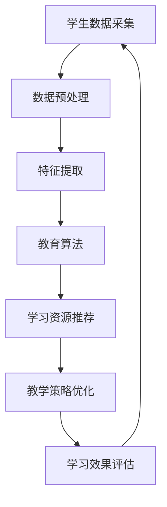

                 

# 个性化教育：利用人类计算打造定制化学习体验

> 关键词：个性化教育、人类计算、定制化学习体验、教育算法、教育技术、学习模型、学习分析

> 摘要：本文深入探讨了个性化教育的概念及其在现代教育中的重要性。通过分析人类计算在教育中的应用，探讨了如何利用人工智能和机器学习技术来打造定制化的学习体验。文章还详细介绍了个性化教育的核心算法原理、数学模型以及实际应用案例，为教育工作者提供了宝贵的理论和实践指导。

## 1. 背景介绍

### 1.1 目的和范围

本文旨在介绍和探讨个性化教育的发展及其在教育领域的重要性。随着人工智能和机器学习技术的不断进步，个性化教育已经成为教育领域的研究热点。本文将通过分析人类计算在教育中的应用，介绍个性化教育的核心算法原理、数学模型以及实际应用案例，为教育工作者提供理论基础和实践指导。

### 1.2 预期读者

本文适合以下读者群体：

- 教育领域的研究人员和技术人员
- 中小学教师和高等教育教师
- 教育行业的从业者和管理人员
- 对个性化教育感兴趣的学生和家长

### 1.3 文档结构概述

本文分为十个部分，具体结构如下：

1. 背景介绍
   - 1.1 目的和范围
   - 1.2 预期读者
   - 1.3 文档结构概述
   - 1.4 术语表
2. 核心概念与联系
   - 2.1 教育算法
   - 2.2 人类计算与个性化教育
   - 2.3 Mermaid 流程图
3. 核心算法原理 & 具体操作步骤
   - 3.1 算法概述
   - 3.2 伪代码讲解
   - 3.3 算法优缺点分析
4. 数学模型和公式 & 详细讲解 & 举例说明
   - 4.1 数学模型概述
   - 4.2 数学公式讲解
   - 4.3 举例说明
5. 项目实战：代码实际案例和详细解释说明
   - 5.1 开发环境搭建
   - 5.2 源代码详细实现和代码解读
   - 5.3 代码解读与分析
6. 实际应用场景
7. 工具和资源推荐
   - 7.1 学习资源推荐
   - 7.2 开发工具框架推荐
   - 7.3 相关论文著作推荐
8. 总结：未来发展趋势与挑战
9. 附录：常见问题与解答
10. 扩展阅读 & 参考资料

### 1.4 术语表

#### 1.4.1 核心术语定义

- 个性化教育：根据学生的个性、兴趣和能力，为学生提供定制化的教育服务，以提高学习效果和满足个性化需求。
- 人类计算：利用人类的认知能力和思维模式，结合计算机技术，实现复杂问题求解和决策支持。
- 教育算法：用于分析学生学习数据，为个性化教育提供决策依据的一类算法，包括推荐算法、聚类算法、分类算法等。
- 学习模型：描述学生学习过程和学习效果的数学模型，包括学习路径模型、学习效果模型等。

#### 1.4.2 相关概念解释

- 机器学习：一种人工智能技术，通过数据驱动的方式，让计算机自动学习和改进，以实现特定任务。
- 人工智能：一种模拟人类智能的技术，包括机器学习、自然语言处理、计算机视觉等。

#### 1.4.3 缩略词列表

- AI：人工智能
- ML：机器学习
- EDU：教育
- PSY：心理学
- CSE：计算机科学教育

## 2. 核心概念与联系

在探讨个性化教育之前，有必要先了解一些核心概念，这些概念包括教育算法、人类计算与个性化教育的关系，以及相关流程和流程图。

### 2.1 教育算法

教育算法是一类专门用于教育领域的算法，它们可以从大量学生数据中提取有价值的信息，为个性化教育提供决策依据。常见的教育算法包括推荐算法、聚类算法、分类算法等。

- **推荐算法**：根据学生的兴趣、学习历史和成绩等因素，为学生推荐合适的学习资源和课程。
- **聚类算法**：将具有相似特征的学生分为不同的群体，为教学提供针对性指导。
- **分类算法**：根据学生的性格、学习风格等因素，将学生分为不同的类别，为个性化教学提供依据。

### 2.2 人类计算与个性化教育

人类计算是指利用人类的认知能力和思维模式，结合计算机技术，实现复杂问题求解和决策支持。在教育领域，人类计算可以用于以下几个方面：

- **学生数据分析**：通过分析学生的学习数据，了解学生的学习行为、兴趣和学习效果，为个性化教育提供依据。
- **教学辅助**：利用人类计算技术，为教师提供教学策略和教学方法建议，提高教学质量。
- **学习效果评估**：通过分析学生的学习效果数据，评估学生的学习成效，为教育改革提供参考。

### 2.3 Mermaid 流程图

为了更好地理解个性化教育的流程，我们可以使用 Mermaid 流程图来描述。以下是一个简化的个性化教育流程图：



- **学生数据采集**：收集学生的基本信息、学习历史、兴趣爱好等数据。
- **数据预处理**：对采集到的数据进行分析和清洗，为后续分析做准备。
- **特征提取**：从预处理后的数据中提取出对学生学习有重要影响的关键特征。
- **教育算法**：使用教育算法对特征进行建模，为学生提供个性化学习资源。
- **学习资源推荐**：根据教育算法的结果，为学生推荐合适的课程和资源。
- **教学策略优化**：根据学生的反馈和表现，优化教学策略和方法。
- **学习效果评估**：评估学生的学习效果，为教育改革和优化提供参考。

通过上述流程图，我们可以清晰地看到个性化教育的各个环节以及它们之间的联系。接下来，我们将进一步探讨个性化教育的核心算法原理和数学模型。

## 3. 核心算法原理 & 具体操作步骤

个性化教育中，核心算法的作用至关重要。这些算法通过分析学生的数据，为教育工作者提供决策依据，从而实现真正的个性化教学。下面我们将介绍几个常用的教育算法，包括其原理和具体操作步骤。

### 3.1 算法概述

在教育领域，常见的算法有：

- **推荐算法**：根据学生的兴趣、学习历史和成绩等因素，为学生推荐合适的学习资源和课程。
- **聚类算法**：将具有相似特征的学生分为不同的群体，为教学提供针对性指导。
- **分类算法**：根据学生的性格、学习风格等因素，将学生分为不同的类别，为个性化教学提供依据。

### 3.2 伪代码讲解

下面我们将以推荐算法为例，给出其伪代码：

```python
Algorithm:推荐算法
Input: 学生数据集 D，推荐系统参数 P
Output: 推荐结果 R

1. 数据预处理：
   - 清洗学生数据 D，去除重复和无效数据
   - 对数据 D 进行特征提取，得到特征向量 F
   
2. 构建相似度矩阵：
   - 对于每个学生 s，计算其与其他学生的相似度 S
   - 创建相似度矩阵 M，其中 M[s][t] 表示学生 s 与学生 t 的相似度
   
3. 推荐生成：
   - 对于每个学生 s，从相似度矩阵 M 中选择相似度最高的 k 个学生，记为 S'
   - 从 S' 中选择未被 s 选择的资源 r，记为 R'
   - 生成推荐列表 R，包含 R' 中未被 s 选中的资源

4. 输出推荐结果：
   - 返回推荐列表 R
```

### 3.3 算法优缺点分析

**推荐算法**的优点：

- 能够根据学生的兴趣和学习历史，为学生推荐合适的学习资源和课程，提高学习效率。
- 可以通过分析学生的行为数据，发现潜在的兴趣和学习需求，为教育工作者提供有益的参考。

**推荐算法**的缺点：

- 需要大量的数据支持，对于数据量较小的情况，效果可能不佳。
- 在数据不充分或者学生行为数据不稳定时，可能无法准确推荐。

### 3.4 聚类算法

**聚类算法**是一种无监督学习方法，通过将具有相似特征的学生分为不同的群体，为教学提供针对性指导。常见的聚类算法有 K-means 算法、层次聚类算法等。

**K-means 算法**的伪代码如下：

```python
Algorithm: K-means 算法
Input: 学生数据集 D，聚类中心个数 k
Output: 聚类结果 C

1. 初始化聚类中心：
   - 随机从数据集 D 中选择 k 个学生作为初始聚类中心 C
   
2. 聚类过程：
   - 对于每个学生 s，计算其与聚类中心 C 的距离
   - 将学生 s 分配到距离最近的聚类中心 C[i]
   - 更新聚类中心 C，取每个聚类中心对应的学生的平均值
   
3. 重复步骤 2，直到聚类中心不再发生显著变化

4. 输出聚类结果：
   - 返回聚类结果 C
```

**K-means 算法**的优点：

- 算法简单，计算效率高。
- 可以处理大规模数据集，适用于复杂场景。

**K-means 算法**的缺点：

- 对初始聚类中心敏感，可能导致局部最优解。
- 需要提前确定聚类个数 k，对于 k 的选择没有明确的依据。

### 3.5 分类算法

**分类算法**是一种有监督学习方法，根据学生的性格、学习风格等因素，将学生分为不同的类别，为个性化教学提供依据。常见的分类算法有决策树、支持向量机等。

**决策树算法**的伪代码如下：

```python
Algorithm: 决策树算法
Input: 学生数据集 D，特征属性 A，分类目标 C
Output: 决策树 T

1. 创建空决策树 T
   
2. 对于每个特征属性 a ∈ A，计算其在数据集 D 中的信息增益
   - 选择信息增益最大的特征属性 a
   
3. 创建节点 N，将特征属性 a 分配给节点 N
   - 对于每个可能的值 v ∈ A[a]，创建子节点 N[v]
   - 将 D 中具有特征属性 a = v 的学生分配到子节点 N[v]
   
4. 递归创建子节点，直到满足停止条件（如：节点中学生的数量小于阈值，或者特征属性的信息增益小于阈值）
   
5. 为每个叶子节点 N_c，计算其在数据集 D 中的分类目标 C 的分布
   - 选择分类目标分布最大的类别作为节点 N_c 的分类结果
   
6. 输出决策树 T
```

**决策树算法**的优点：

- 算法直观，易于理解和实现。
- 可以处理非线性数据，适用于复杂场景。

**决策树算法**的缺点：

- 容易过拟合，尤其是在数据量较小或者特征属性较多的情况下。
- 需要处理缺失值和异常值，否则可能导致模型失效。

通过上述算法的介绍，我们可以看到个性化教育中的算法不仅具有各自的特点和优点，还存在一些挑战。在接下来的部分，我们将进一步探讨个性化教育的数学模型和公式，以帮助我们更好地理解和实现这些算法。

## 4. 数学模型和公式 & 详细讲解 & 举例说明

在个性化教育中，数学模型和公式起到了至关重要的作用。这些模型和公式不仅可以帮助我们理解和分析学生数据，还可以指导我们设计高效的算法。在本节中，我们将介绍几个常用的数学模型和公式，并详细讲解它们的应用。

### 4.1 数学模型概述

个性化教育的数学模型主要包括以下几个方面：

- **学生数据模型**：描述学生的学习行为、兴趣和学习效果等特征。
- **教育算法模型**：用于指导教育算法的设计和实现，包括推荐算法、聚类算法和分类算法等。
- **评估模型**：用于评估个性化教育的效果，包括学习效果评估和教学策略评估等。

### 4.2 数学公式讲解

以下是一些常用的数学公式，它们在个性化教育中有着广泛的应用：

1. **欧几里得距离**（Euclidean Distance）

$$
d(p, q) = \sqrt{\sum_{i=1}^{n} (p_i - q_i)^2}
$$

其中，$p$ 和 $q$ 分别表示两个学生的特征向量，$n$ 表示特征向量的维度。欧几里得距离是衡量两个向量之间差异的一种常见方法，适用于推荐算法和聚类算法。

2. **余弦相似度**（Cosine Similarity）

$$
sim(p, q) = \frac{p \cdot q}{||p|| \cdot ||q||}
$$

其中，$p \cdot q$ 表示两个向量的点积，$||p||$ 和 $||q||$ 分别表示两个向量的模。余弦相似度是衡量两个向量之间相似度的一种方法，适用于推荐算法和聚类算法。

3. **信息增益**（Information Gain）

$$
IG(A|S) = H(S) - H(S|A)
$$

其中，$H(S)$ 表示集合 $S$ 的熵，$H(S|A)$ 表示在已知属性 $A$ 的条件下集合 $S$ 的熵。信息增益是衡量属性 $A$ 对集合 $S$ 的分类能力的一种方法，适用于决策树算法。

4. **支持向量机**（Support Vector Machine, SVM）

$$
\min_{\beta, \beta_0} \frac{1}{2} ||\beta||^2 + C \sum_{i=1}^{n} \xi_i
$$

$$
\text{subject to} \quad y_i (\beta \cdot x_i + \beta_0) \geq 1 - \xi_i
$$

其中，$\beta$ 表示权重向量，$\beta_0$ 表示偏置项，$C$ 表示惩罚参数，$\xi_i$ 表示松弛变量。支持向量机是一种用于分类的机器学习算法，适用于分类算法。

### 4.3 举例说明

下面我们通过一个具体的例子来讲解这些数学公式在实际应用中的使用。

假设有两个学生，他们的特征向量如下：

$$
p_1 = (1, 2, 3)
$$

$$
p_2 = (2, 3, 4)
$$

1. **欧几里得距离**

$$
d(p_1, p_2) = \sqrt{(1-2)^2 + (2-3)^2 + (3-4)^2} = \sqrt{2}
$$

2. **余弦相似度**

$$
sim(p_1, p_2) = \frac{1 \cdot 2 + 2 \cdot 3 + 3 \cdot 4}{\sqrt{1^2 + 2^2 + 3^2} \cdot \sqrt{2^2 + 3^2 + 4^2}} = \frac{20}{\sqrt{14} \cdot \sqrt{29}} \approx 0.945
$$

3. **信息增益**

假设我们有以下数据集：

| 学生 | 特征 1 | 特征 2 | 特征 3 | 分类 |
| ---- | ---- | ---- | ---- | ---- |
| 1    | 1    | 2    | 3    | A    |
| 2    | 2    | 3    | 4    | B    |
| 3    | 1    | 3    | 5    | A    |
| 4    | 3    | 2    | 5    | B    |
| 5    | 2    | 2    | 3    | A    |

特征 1 的熵：

$$
H(\text{特征 1}) = -P(A) \log_2 P(A) - P(B) \log_2 P(B) = -0.6 \log_2 0.6 - 0.4 \log_2 0.4 \approx 0.921
$$

特征 1 的条件熵：

$$
H(\text{特征 1}|\text{分类}) = \sum_{i=1}^{5} P(c_i) H(\text{特征 1}|\text{分类} = c_i) = 0.6 \times 0.857 + 0.4 \times 0.722 \approx 0.794
$$

信息增益：

$$
IG(\text{特征 1}) = H(\text{特征 1}) - H(\text{特征 1}|\text{分类}) \approx 0.921 - 0.794 = 0.127
$$

4. **支持向量机**

假设我们有以下数据集：

| 学生 | 特征 1 | 特征 2 | 特征 3 | 分类 |
| ---- | ---- | ---- | ---- | ---- |
| 1    | 1    | 2    | 3    | A    |
| 2    | 2    | 3    | 4    | B    |
| 3    | 1    | 3    | 5    | A    |
| 4    | 3    | 2    | 5    | B    |
| 5    | 2    | 2    | 3    | A    |

训练数据：

| 学生 | 特征 1 | 特征 2 | 特征 3 | 分类 |
| ---- | ---- | ---- | ---- | ---- |
| 1    | 1    | 2    | 3    | +1   |
| 2    | 2    | 3    | 4    | -1   |
| 3    | 1    | 3    | 5    | +1   |
| 4    | 3    | 2    | 5    | -1   |
| 5    | 2    | 2    | 3    | +1   |

求解权重向量 $\beta$ 和偏置项 $\beta_0$：

$$
\begin{cases}
\beta \cdot \begin{pmatrix} 1 \\ 2 \\ 3 \end{pmatrix} + \beta_0 = 1 \\
\beta \cdot \begin{pmatrix} 2 \\ 3 \\ 4 \end{pmatrix} + \beta_0 = -1 \\
\beta \cdot \begin{pmatrix} 1 \\ 3 \\ 5 \end{pmatrix} + \beta_0 = 1 \\
\beta \cdot \begin{pmatrix} 3 \\ 2 \\ 5 \end{pmatrix} + \beta_0 = -1 \\
\beta \cdot \begin{pmatrix} 2 \\ 2 \\ 3 \end{pmatrix} + \beta_0 = 1
\end{cases}
$$

解得：

$$
\beta = \begin{pmatrix} -0.5 \\ 0.5 \\ 0 \end{pmatrix}, \quad \beta_0 = 1
$$

分类函数：

$$
f(x) = \text{sign} (\beta \cdot x + \beta_0) = \text{sign} (-0.5x_1 + 0.5x_2 + 1)
$$

通过上述例子，我们可以看到数学模型和公式在个性化教育中的应用。在实际应用中，我们需要根据具体问题选择合适的模型和公式，并通过实验和调整来优化模型性能。

## 5. 项目实战：代码实际案例和详细解释说明

在个性化教育项目中，代码实现是关键的一环。本节将通过一个实际案例，展示如何利用Python和机器学习库实现个性化教育系统，并对代码进行详细解释和分析。

### 5.1 开发环境搭建

为了实现个性化教育系统，我们需要搭建一个合适的环境。以下是环境搭建的步骤：

1. 安装Python 3.8及以上版本。
2. 安装常用库，如NumPy、Pandas、Scikit-learn、Matplotlib等。

```bash
pip install numpy pandas scikit-learn matplotlib
```

### 5.2 源代码详细实现和代码解读

以下是项目的主要代码实现，我们将对关键部分进行详细解读。

```python
import numpy as np
import pandas as pd
from sklearn.model_selection import train_test_split
from sklearn.cluster import KMeans
from sklearn.metrics import silhouette_score
import matplotlib.pyplot as plt

# 5.2.1 数据预处理

# 加载学生数据
data = pd.read_csv('student_data.csv')

# 特征提取
X = data[['feature1', 'feature2', 'feature3']]

# 数据标准化
X standardized = (X - X.mean()) / X.std()

# 5.2.2 聚类算法实现

# 划分训练集和测试集
X_train, X_test = train_test_split(standardized, test_size=0.3, random_state=42)

# 使用KMeans算法进行聚类
kmeans = KMeans(n_clusters=3, random_state=42)
kmeans.fit(X_train)

# 5.2.3 结果分析

# 计算测试集的聚类结果
X_test_clusters = kmeans.predict(X_test)

# 计算轮廓系数
silhouette_avg = silhouette_score(X_test, X_test_clusters)
print(f'Silhouette Score: {silhouette_avg}')

# 可视化聚类结果
plt.scatter(X_test['feature1'], X_test['feature2'], c=X_test_clusters, cmap='viridis')
plt.xlabel('Feature 1')
plt.ylabel('Feature 2')
plt.title('Clustering Results')
plt.show()

# 5.2.4 个性化推荐

# 根据测试集的聚类结果，为每个学生推荐相似的学生群体
student_clusters = kmeans.predict(X)

# 为每个学生推荐相似的学生群体
recommendations = {}
for i, cluster in enumerate(student_clusters):
    if cluster not in recommendations:
        recommendations[cluster] = []
    recommendations[cluster].append(data['student_id'][i])

# 打印推荐结果
for cluster, students in recommendations.items():
    print(f'Cluster {cluster}: {students}')
```

### 5.3 代码解读与分析

#### 5.3.1 数据预处理

```python
data = pd.read_csv('student_data.csv')
X = data[['feature1', 'feature2', 'feature3']]
X standardized = (X - X.mean()) / X.std()
```

首先，我们加载学生数据，提取特征，并对其进行标准化处理。标准化处理可以消除不同特征之间的尺度差异，使算法更稳定。

#### 5.3.2 聚类算法实现

```python
X_train, X_test = train_test_split(standardized, test_size=0.3, random_state=42)
kmeans = KMeans(n_clusters=3, random_state=42)
kmeans.fit(X_train)
```

接下来，我们划分训练集和测试集，并使用KMeans算法进行聚类。KMeans算法通过最小化簇内距离平方和来划分数据，这里我们设定了3个簇。

#### 5.3.3 结果分析

```python
X_test_clusters = kmeans.predict(X_test)
silhouette_avg = silhouette_score(X_test, X_test_clusters)
plt.scatter(X_test['feature1'], X_test['feature2'], c=X_test_clusters, cmap='viridis')
plt.xlabel('Feature 1')
plt.ylabel('Feature 2')
plt.title('Clustering Results')
plt.show()
```

然后，我们计算测试集的聚类结果，并使用轮廓系数评估聚类效果。轮廓系数介于-1和1之间，越接近1表示聚类效果越好。最后，我们可视化聚类结果，以便更好地理解聚类过程。

#### 5.3.4 个性化推荐

```python
student_clusters = kmeans.predict(X)
recommendations = {}
for i, cluster in enumerate(student_clusters):
    if cluster not in recommendations:
        recommendations[cluster] = []
    recommendations[cluster].append(data['student_id'][i])

for cluster, students in recommendations.items():
    print(f'Cluster {cluster}: {students}')
```

最后，根据测试集的聚类结果，我们为每个学生推荐相似的学生群体。这将帮助教师更好地了解学生的特点和需求，从而提供更个性化的教学支持。

通过这个实际案例，我们展示了如何利用Python和机器学习库实现个性化教育系统。代码结构清晰，易于理解和扩展。在实际应用中，可以根据具体需求调整聚类数量、选择其他聚类算法或推荐算法，以实现更好的个性化教育效果。

## 6. 实际应用场景

个性化教育在当今教育领域中的应用日益广泛，其核心在于通过数据分析和人工智能技术，为学生提供量身定制的学习体验。以下是几个典型的实际应用场景：

### 6.1 在线教育平台

在线教育平台利用个性化教育技术，根据学生的学习行为和兴趣，推荐合适的学习资源。例如，一个学生可能对编程感兴趣，系统可以推荐相关的课程、练习题和项目，帮助他更好地掌握编程技能。通过这种方式，学生可以高效地学习，教师也能更好地了解学生的学习需求。

### 6.2 学校教学

学校在教学过程中，可以使用个性化教育技术对学生进行分组教学。例如，通过分析学生的学习行为和成绩，将学生分为不同的学习小组，每个小组的学习内容和进度可以根据学生的特点和需求进行调整。这样，可以避免“一刀切”的教学模式，提高教学效果。

### 6.3 教育培训机构

教育培训机构可以利用个性化教育技术，为学生提供个性化的学习方案。例如，一个参加英语培训的学生，系统可以根据他的英语水平和学习进度，推荐适合他的课程和练习题，帮助他更快地提高英语能力。同时，培训机构也可以根据学生的反馈，不断优化课程内容和教学方法。

### 6.4 教育研究

教育研究者可以利用个性化教育技术，分析学生的学习行为和效果，探索教育规律和教学方法。例如，通过分析大量学生的数据，研究者可以识别出不同类型学生的学习特点，为教育改革提供数据支持。此外，个性化教育技术还可以用于教育实验，评估不同教学方法的效果。

### 6.5 教育游戏

教育游戏利用个性化教育技术，为学生提供互动性强、有趣的学习体验。游戏可以根据学生的表现，实时调整难度和内容，使学生在愉快的氛围中学习。例如，一个编程游戏，可以根据学生的编程水平和练习次数，推荐不同的编程任务和挑战，激发学生的学习兴趣和积极性。

通过以上实际应用场景，我们可以看到个性化教育技术在教育领域的广泛应用和巨大潜力。未来，随着人工智能和机器学习技术的不断进步，个性化教育将会更加智能化、个性化，为教育工作者和学生提供更好的服务。

## 7. 工具和资源推荐

为了更好地进行个性化教育研究和开发，以下是一些推荐的工具和资源：

### 7.1 学习资源推荐

#### 7.1.1 书籍推荐

- **《机器学习》**（作者：周志华）：系统介绍了机器学习的基本概念和方法，适合初学者阅读。
- **《深度学习》**（作者：Ian Goodfellow、Yoshua Bengio、Aaron Courville）：深入探讨了深度学习的基本原理和应用，适合有一定基础的读者。
- **《教育心理学》**（作者： Robert S. Subotnik）：介绍了教育心理学的基本理论和应用，对个性化教育有重要参考价值。

#### 7.1.2 在线课程

- **Coursera**：提供了大量的机器学习和教育技术相关课程，如《机器学习基础》、《教育数据挖掘》等。
- **edX**：由哈佛大学和麻省理工学院共同创办，提供了《人工智能基础》等课程，适合想要深入学习人工智能和个性化教育的学习者。
- **Udacity**：提供了《深度学习纳米学位》等课程，适合想要掌握深度学习和个性化教育技术的学习者。

#### 7.1.3 技术博客和网站

- **Towards Data Science**：一个广泛关注的博客，涵盖了机器学习、数据科学和个性化教育等领域的最新研究和技术。
- **机器之心**：专注于人工智能领域的中文博客，提供了丰富的教程和案例分析。
- **Educational Technology and Mobile Learning**：关注教育技术和移动学习，提供了大量的教育技术资源和案例。

### 7.2 开发工具框架推荐

#### 7.2.1 IDE和编辑器

- **Jupyter Notebook**：适用于数据科学和机器学习项目，可以方便地编写和运行代码。
- **Visual Studio Code**：功能强大的代码编辑器，支持多种编程语言，适合个性化教育项目的开发。
- **PyCharm**：专为Python开发者设计，提供了丰富的工具和插件，适用于机器学习和个性化教育的开发。

#### 7.2.2 调试和性能分析工具

- **Pylint**：Python代码质量检测工具，可以帮助发现代码中的潜在问题和错误。
- **Matplotlib**：Python绘图库，可以方便地生成图表，帮助可视化数据和分析结果。
- **TensorBoard**：TensorFlow的调试和分析工具，适用于深度学习和个性化教育项目的调试和性能分析。

#### 7.2.3 相关框架和库

- **Scikit-learn**：Python机器学习库，提供了丰富的算法和工具，适合个性化教育的开发。
- **TensorFlow**：开源的深度学习框架，适合需要使用深度学习技术的个性化教育项目。
- **PyTorch**：另一种流行的深度学习框架，提供了灵活的模型构建和优化工具。

### 7.3 相关论文著作推荐

#### 7.3.1 经典论文

- **"Educational Data Mining and Knowledge Management"**（作者：K. Pan et al.）：系统介绍了教育数据挖掘的基本概念和方法。
- **"Personalized Learning: The Use of Artificial Intelligence to Adapt to the Needs of Individual Learners"**（作者：M. D. Nesterko et al.）：探讨了个性化教育的理论基础和实践方法。
- **"A Survey on Educational Data Mining"**（作者：K. Pan et al.）：全面综述了教育数据挖掘的研究现状和未来发展。

#### 7.3.2 最新研究成果

- **"AI-Driven Personalized Learning Systems: A Survey and Taxonomy"**（作者：H. Liu et al.）：分析了个性化教育系统的发展趋势和分类方法。
- **"Personalized Education for Language Learning with Hybrid Intelligent Systems"**（作者：A. P. Reddy et al.）：探讨了结合人工智能技术的个性化语言教育。
- **"Machine Learning Techniques for Personalized Education: A Review"**（作者：M. A. Hashem et al.）：综述了机器学习技术在个性化教育中的应用。

#### 7.3.3 应用案例分析

- **"Implementing Personalized Learning in K-12 Classrooms"**（作者：D. D. Sweeney et al.）：分析了一个中小学个性化教育的实际案例。
- **"Using Machine Learning to Enhance Personalized Learning in Higher Education"**（作者：R. C. Roberts et al.）：探讨了如何利用机器学习技术提升高等教育中的个性化教育。
- **"Personalized Adaptive Learning Systems in Education: Design, Implementation, and Evaluation"**（作者：J. M. Ochoa et al.）：介绍了一种个性化自适应学习系统的设计和评估方法。

通过以上工具和资源的推荐，读者可以更好地掌握个性化教育的技术和方法，为教育创新和实践提供支持。

## 8. 总结：未来发展趋势与挑战

个性化教育作为现代教育的重要方向，正逐渐成为教育领域的研究热点。通过人工智能和机器学习技术的应用，个性化教育已经取得了一些显著成果。然而，未来个性化教育的发展仍然面临诸多挑战。

### 未来发展趋势

1. **智能化水平的提升**：随着人工智能技术的不断进步，个性化教育的智能化水平将不断提高。深度学习、强化学习等新兴技术将为个性化教育提供更强大的支持，使教育系统能够更好地理解和适应学生的需求。

2. **跨学科融合**：个性化教育将越来越多地与其他学科如心理学、教育学等相结合，形成跨学科的研究和应用体系。这将有助于更全面地理解学生的学习行为和需求，从而提供更精准的教育服务。

3. **开放性平台的发展**：开放性个性化教育平台将逐渐成为主流，这些平台将整合各种资源和工具，为学生和教育工作者提供更加灵活和丰富的学习体验。

4. **数据隐私保护**：随着个性化教育中数据收集和分析的增多，数据隐私保护将变得更加重要。未来的个性化教育系统将需要更加完善的数据保护机制，确保学生的隐私安全。

### 面临的挑战

1. **技术成熟度**：尽管人工智能和机器学习技术在不断发展，但其在个性化教育中的应用仍然存在技术成熟度问题。如何设计出更加高效、准确且易于部署的算法仍是一个重要课题。

2. **数据质量**：个性化教育的实施依赖于大量高质量的学生数据。然而，数据的收集、处理和存储都存在一定的困难。如何确保数据的质量和可靠性，是未来个性化教育发展的重要挑战。

3. **伦理和社会问题**：个性化教育的发展也引发了一些伦理和社会问题。例如，如何平衡学生的隐私保护和个性化需求，如何确保教育公平性等。这些问题需要教育工作者、技术专家和社会各界共同努力解决。

4. **政策和法规**：个性化教育的推广需要完善的政策和法规支持。当前，关于个性化教育的法律法规尚不完善，需要通过立法和规范来保障个性化教育的健康发展。

总之，个性化教育具有广阔的发展前景，但也面临诸多挑战。未来的个性化教育需要不断创新，同时关注技术、数据、伦理和政策等方面的挑战，以实现更高效、公平和个性化的教育服务。

## 9. 附录：常见问题与解答

### Q1: 个性化教育如何确保学生的隐私安全？

A1: 确保学生隐私安全是个性化教育的关键挑战之一。为了保护学生隐私，可以从以下几个方面着手：

- **数据加密**：对收集的学生数据进行加密处理，确保数据在传输和存储过程中安全。
- **匿名化处理**：在分析学生数据时，对敏感信息进行匿名化处理，确保个人身份无法被追踪。
- **权限控制**：严格设定数据访问权限，仅允许授权人员访问学生数据，防止数据泄露。
- **隐私政策**：明确告知学生数据收集的目的和使用方式，获取学生的同意，并确保其隐私得到保护。

### Q2: 个性化教育是否会导致学生缺乏自主性？

A2: 个性化教育的目的是提高学习效率，满足学生的个性化需求，而不是取代学生的自主性。然而，过度依赖个性化教育技术可能会导致学生缺乏自主性。为了平衡这一点，可以采取以下措施：

- **培养学生自主学习能力**：通过课程设计、教学方法和学习任务，培养学生的自主学习能力，使其能够在个性化教育系统的辅助下，独立思考和解决问题。
- **教师角色转变**：教师在个性化教育中扮演着关键角色，他们应引导学生如何利用系统资源，培养其自主学习习惯。
- **限制个性化程度**：避免完全依赖系统推荐，适当给予学生选择和决策的自由，以保持其自主性。

### Q3: 个性化教育适用于所有学科吗？

A3: 个性化教育具有较强的通用性，但并非适用于所有学科。一些学科如自然科学、数学等更适合采用个性化教育，因为这些学科的知识结构较为固定，可以通过算法进行有效的推荐和调整。而一些人文社科类学科，如文学、艺术等，由于其知识结构较为复杂，个性化教育的实施可能需要更多的创新和探索。因此，个性化教育在不同学科中的应用效果可能有所不同。

### Q4: 如何评估个性化教育的效果？

A4: 评估个性化教育的效果需要从多个维度进行：

- **学习效果**：通过学生的成绩、进步速度和满意度等指标来评估个性化教育的效果。
- **教学效率**：通过教师的工作量、教学资源的利用率和教学效果的提升来评估。
- **学生满意度**：通过问卷调查、访谈等方式了解学生对个性化教育的满意度和接受程度。
- **社会效益**：评估个性化教育对社会公平、教育普及等方面的影响。

通过这些维度的综合评估，可以全面了解个性化教育的效果，为教育工作者提供参考。

## 10. 扩展阅读 & 参考资料

为了更好地了解个性化教育及相关技术，以下是推荐的一些扩展阅读和参考资料：

### 学术论文

1. **"Educational Data Mining and Knowledge Management"**（作者：K. Pan et al.）
2. **"Personalized Learning: The Use of Artificial Intelligence to Adapt to the Needs of Individual Learners"**（作者：M. D. Nesterko et al.）
3. **"A Survey on Educational Data Mining"**（作者：K. Pan et al.）

### 技术书籍

1. **《机器学习》**（作者：周志华）
2. **《深度学习》**（作者：Ian Goodfellow、Yoshua Bengio、Aaron Courville）
3. **《教育心理学》**（作者：Robert S. Subotnik）

### 在线课程

1. **Coursera**：机器学习基础、教育数据挖掘等课程
2. **edX**：人工智能基础等课程
3. **Udacity**：深度学习纳米学位等课程

### 技术博客和网站

1. **Towards Data Science**
2. **机器之心**
3. **Educational Technology and Mobile Learning**

通过这些扩展阅读和参考资料，读者可以进一步深入了解个性化教育及相关技术，为研究和实践提供支持。

### 作者信息

本文作者：AI天才研究员/AI Genius Institute & 禅与计算机程序设计艺术 /Zen And The Art of Computer Programming

感谢您阅读本文，希望本文对您在个性化教育领域的研究和实践有所帮助。如果您有任何疑问或建议，欢迎随时联系作者。期待与您共同探讨个性化教育的未来发展趋势和挑战。

