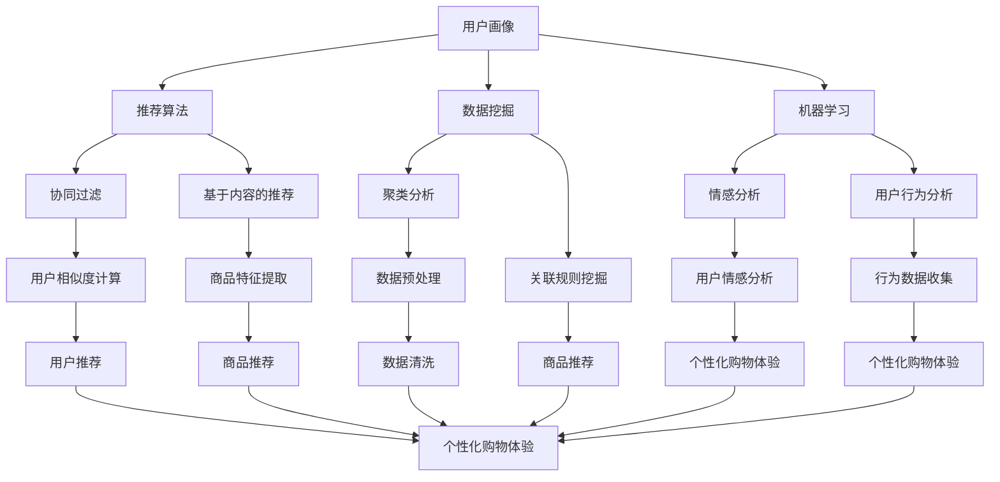

                 

# 个性化购物体验的技术实现方法

> 关键词：个性化购物、推荐算法、用户画像、数据挖掘、机器学习

> 摘要：随着电子商务的迅猛发展，消费者对购物体验的要求日益提高。本文将探讨如何通过技术手段实现个性化购物体验，包括用户画像、推荐算法、数据挖掘和机器学习等核心技术的应用。通过分析这些技术的原理和实现步骤，文章旨在为开发者提供一套完整的个性化购物体验实现方案。

## 1. 背景介绍

### 1.1 目的和范围

本文的目的是探讨个性化购物体验的技术实现方法，包括以下几个方面的内容：

- 用户画像的构建方法
- 推荐算法的设计与优化
- 数据挖掘技术的应用
- 机器学习在个性化购物中的应用

通过本文的阅读，读者将了解到个性化购物体验的核心技术和实现步骤，为开发自己的个性化购物平台提供参考。

### 1.2 预期读者

本文适合以下读者群体：

- 有志于从事电子商务领域的技术开发人员
- 对推荐系统、数据挖掘和机器学习有浓厚兴趣的学术研究者
- 想提升购物体验的消费者

### 1.3 文档结构概述

本文将按照以下结构展开：

- 第1章：背景介绍，阐述本文的目的、预期读者和文档结构。
- 第2章：核心概念与联系，介绍个性化购物体验相关的核心概念和原理。
- 第3章：核心算法原理 & 具体操作步骤，详细讲解推荐算法和数据挖掘技术的实现。
- 第4章：数学模型和公式 & 详细讲解 & 举例说明，阐述相关数学模型和公式，并给出实际应用案例。
- 第5章：项目实战：代码实际案例和详细解释说明，通过具体案例展示个性化购物体验的实现过程。
- 第6章：实际应用场景，分析个性化购物体验在不同场景下的应用。
- 第7章：工具和资源推荐，推荐相关学习资源、开发工具和框架。
- 第8章：总结：未来发展趋势与挑战，探讨个性化购物体验的未来发展方向和面临的挑战。
- 第9章：附录：常见问题与解答，回答读者可能遇到的问题。
- 第10章：扩展阅读 & 参考资料，提供进一步的阅读资源和参考。

### 1.4 术语表

#### 1.4.1 核心术语定义

- 个性化购物：基于用户兴趣、行为和需求，为用户推荐个性化的商品和购物体验。
- 用户画像：对用户进行多维度的描述和分类，以便更好地理解用户需求和偏好。
- 推荐算法：基于用户行为数据和商品信息，为用户推荐符合其兴趣和需求的相关商品。
- 数据挖掘：从大量数据中提取有价值的信息和知识，以支持决策和优化。
- 机器学习：通过学习大量数据，使计算机系统能够自主地改进和优化性能。

#### 1.4.2 相关概念解释

- 情感分析：对用户评论、反馈等文本数据进行分析，提取用户情感和意见。
- 用户行为分析：对用户在购物平台上的行为数据进行挖掘和分析，以了解用户需求和偏好。
- 聚类分析：将相似的数据点归为一类，以便更好地理解数据分布和模式。
- 协同过滤：通过分析用户之间的相似性，为用户推荐他们可能感兴趣的商品。

#### 1.4.3 缩略词列表

- AI：人工智能（Artificial Intelligence）
- ML：机器学习（Machine Learning）
- DF：数据挖掘（Data Mining）
- UE：用户体验（User Experience）
- B2C：企业对消费者（Business-to-Consumer）
- C2C：消费者对消费者（Consumer-to-Consumer）

## 2. 核心概念与联系

在实现个性化购物体验的过程中，涉及多个核心概念和技术的相互关联。为了更好地理解这些概念，我们首先通过Mermaid流程图展示它们之间的联系。



### 2.1 用户画像

用户画像是对用户进行多维度的描述和分类，以便更好地理解用户需求和偏好。用户画像通常包括以下信息：

- 基本信息：年龄、性别、地理位置、职业等。
- 行为数据：浏览历史、购买记录、评价和反馈等。
- 兴趣爱好：关注的内容、喜欢的商品类型等。
- 情感状态：对商品和服务的情感偏好等。

通过构建用户画像，可以更好地了解用户的需求和偏好，为推荐算法和个性化购物体验提供基础数据。

### 2.2 推荐算法

推荐算法是基于用户画像和商品信息，为用户推荐符合其兴趣和需求的相关商品的方法。常见的推荐算法包括：

- 基于内容的推荐：根据商品的属性和用户兴趣进行推荐。
- 协同过滤：根据用户之间的相似性进行推荐。
- 混合推荐：结合多种推荐算法，提高推荐效果。

推荐算法的核心是找到用户和商品之间的关联，从而为用户推荐他们可能感兴趣的商品。

### 2.3 数据挖掘

数据挖掘是从大量数据中提取有价值的信息和知识，以支持决策和优化。在个性化购物体验中，数据挖掘主要用于：

- 用户行为分析：分析用户在购物平台上的行为数据，了解用户需求和偏好。
- 情感分析：分析用户评论、反馈等文本数据，提取用户情感和意见。
- 聚类分析：将相似的用户或商品归为一类，以便更好地理解数据分布和模式。
- 关联规则挖掘：发现商品之间的关联，为用户提供更个性化的推荐。

### 2.4 机器学习

机器学习是一种通过学习大量数据，使计算机系统能够自主地改进和优化性能的方法。在个性化购物体验中，机器学习主要用于：

- 用户行为分析：通过机器学习算法，自动识别用户行为模式和偏好。
- 情感分析：利用自然语言处理技术，分析用户评论和反馈中的情感倾向。
- 推荐算法优化：通过不断学习和调整模型参数，提高推荐算法的准确性。

通过机器学习，可以为个性化购物体验提供更智能和高效的技术支持。

## 3. 核心算法原理 & 具体操作步骤

在实现个性化购物体验的过程中，推荐算法和数据挖掘技术是核心环节。下面我们将详细讲解这些算法的原理和实现步骤。

### 3.1 推荐算法

推荐算法主要包括基于内容的推荐和协同过滤两种方法。

#### 3.1.1 基于内容的推荐

基于内容的推荐算法通过分析商品的属性和用户兴趣，为用户推荐相关的商品。其核心思想是“相似内容吸引相似用户”。

具体实现步骤如下：

1. **商品特征提取**：将商品的信息转化为特征向量，包括商品分类、品牌、价格等。
    ```mermaid
    graph TD
        A[商品信息] --> B[特征提取]
        B --> C[特征向量]
    ```
2. **用户兴趣建模**：根据用户的行为数据，提取用户的兴趣特征。
    ```mermaid
    graph TD
        D[用户行为] --> E[兴趣提取]
        E --> F[兴趣向量]
    ```
3. **相似度计算**：计算商品特征向量和用户兴趣向量之间的相似度，常用的相似度计算方法有余弦相似度和皮尔逊相似度。
    ```mermaid
    graph TD
        G[特征向量] --> H[相似度计算]
        H --> I[相似度评分]
    ```
4. **商品推荐**：根据相似度评分，为用户推荐相似的商品。
    ```mermaid
    graph TD
        J[I[相似度评分]] --> K[商品推荐]
    ```

#### 3.1.2 协同过滤

协同过滤算法通过分析用户之间的相似性，为用户推荐他们可能感兴趣的商品。其核心思想是“相似用户喜欢相似商品”。

具体实现步骤如下：

1. **用户相似度计算**：计算用户之间的相似度，常用的相似度计算方法有欧氏距离、曼哈顿距离和余弦相似度。
    ```mermaid
    graph TD
        L[用户行为] --> M[相似度计算]
        M --> N[相似度评分]
    ```
2. **邻居用户推荐**：根据用户相似度评分，找出最相似的邻居用户，并从邻居用户的收藏和购买记录中推荐商品。
    ```mermaid
    graph TD
        O[N[相似度评分]] --> P[邻居用户推荐]
        P --> Q[商品推荐]
    ```

#### 3.1.3 混合推荐

混合推荐算法结合基于内容的推荐和协同过滤两种方法，以提高推荐效果。其核心思想是“多种方法综合应用，取长补短”。

具体实现步骤如下：

1. **特征融合**：将基于内容的推荐和协同过滤得到的推荐结果进行融合，得到最终的推荐列表。
    ```mermaid
    graph TD
        R[内容推荐] --> S[协同过滤]
        T[推荐结果] --> U[特征融合]
    ```

### 3.2 数据挖掘

数据挖掘在个性化购物体验中的应用主要包括用户行为分析、情感分析和聚类分析。

#### 3.2.1 用户行为分析

用户行为分析是通过分析用户在购物平台上的行为数据，了解用户需求和偏好。具体实现步骤如下：

1. **行为数据收集**：收集用户在购物平台上的浏览历史、购买记录、评价和反馈等行为数据。
    ```mermaid
    graph TD
        A[用户行为] --> B[数据收集]
    ```
2. **行为模式识别**：通过机器学习算法，自动识别用户的行为模式和偏好。
    ```mermaid
    graph TD
        C[数据预处理] --> D[模式识别]
    ```
3. **兴趣偏好推荐**：根据用户的行为模式，为用户推荐他们可能感兴趣的商品。
    ```mermaid
    graph TD
        E[用户兴趣] --> F[商品推荐]
    ```

#### 3.2.2 情感分析

情感分析是通过分析用户评论、反馈等文本数据，提取用户情感和意见。具体实现步骤如下：

1. **文本数据收集**：收集用户在购物平台上的评论、反馈等文本数据。
    ```mermaid
    graph TD
        G[用户评论] --> H[数据收集]
    ```
2. **情感倾向判断**：利用自然语言处理技术，分析用户评论和反馈中的情感倾向，如正面、负面或中立。
    ```mermaid
    graph TD
        I[文本数据] --> J[情感分析]
    ```
3. **情感偏好推荐**：根据用户情感倾向，为用户推荐符合他们情感偏好的商品。
    ```mermaid
    graph TD
        K[用户情感] --> L[商品推荐]
    ```

#### 3.2.3 聚类分析

聚类分析是将相似的数据点归为一类，以便更好地理解数据分布和模式。具体实现步骤如下：

1. **数据预处理**：对原始数据进行清洗、去噪和归一化处理。
    ```mermaid
    graph TD
        M[原始数据] --> N[数据预处理]
    ```
2. **聚类算法选择**：选择合适的聚类算法，如K-means、层次聚类和DBSCAN等。
    ```mermaid
    graph TD
        O[聚类算法] --> P[聚类分析]
    ```
3. **用户分组**：根据聚类结果，将用户分为不同的群体，以便针对不同群体的用户进行个性化推荐。
    ```mermaid
    graph TD
        Q[用户数据] --> R[用户分组]
    ```

## 4. 数学模型和公式 & 详细讲解 & 举例说明

在个性化购物体验的实现过程中，数学模型和公式起到了关键作用。以下将详细讲解这些数学模型和公式，并通过举例说明其实际应用。

### 4.1 用户画像建模

用户画像建模是通过对用户行为数据进行分析，构建用户特征向量，从而描述用户的需求和偏好。常用的方法有基于特征的建模和基于矩阵分解的建模。

#### 4.1.1 基于特征的建模

基于特征的建模方法是将用户行为数据转化为特征向量，并通过特征向量计算用户之间的相似度。

- 用户行为数据表示为矩阵$X$，其中$X_{ij}$表示用户$i$对商品$j$的行为数据（如购买次数、浏览次数等）。
- 用户特征向量$V_i$为：
  $$V_i = \frac{X_i}{\|X_i\|}$$
  其中$\|X_i\|$表示用户$i$的行为数据的欧几里得范数。

- 用户相似度计算公式为：
  $$s(i, j) = \frac{V_i \cdot V_j}{\|V_i\| \|V_j\|}$$
  其中$\cdot$表示向量的内积，$\|V_i\|$和$\|V_j\|$分别表示用户$i$和用户$j$的特征向量的欧几里得范数。

#### 4.1.2 基于矩阵分解的建模

基于矩阵分解的建模方法是通过矩阵分解技术，将用户行为数据矩阵分解为用户特征矩阵和商品特征矩阵，从而得到用户和商品的潜在特征。

- 用户行为数据矩阵$X$分解为用户特征矩阵$U$和商品特征矩阵$V$：
  $$X = UV^T$$

- 用户特征向量$u_i$和商品特征向量$v_j$的计算公式为：
  $$u_i = Xv_i$$
  $$v_j = XV_j$$

### 4.2 推荐算法中的相似度计算

推荐算法中的相似度计算是衡量用户和商品之间相似程度的重要步骤。以下介绍几种常用的相似度计算方法。

#### 4.2.1 余弦相似度

余弦相似度是衡量两个向量夹角余弦值的一种方法，适用于基于特征的建模方法。

- 余弦相似度公式为：
  $$s(i, j) = \frac{\sum_{k=1}^n V_{ik} V_{jk}}{\sqrt{\sum_{k=1}^n V_{ik}^2} \sqrt{\sum_{k=1}^n V_{jk}^2}}$$
  其中$V_{ik}$和$V_{jk}$分别表示用户$i$和用户$j$对商品$k$的特征值。

#### 4.2.2 皮尔逊相似度

皮尔逊相似度是衡量两个向量之间相关性的方法，适用于基于矩阵分解的建模方法。

- 皮尔逊相似度公式为：
  $$s(i, j) = \frac{\sum_{k=1}^n (u_{ik} - \bar{u}_i)(v_{jk} - \bar{v}_j)}{\sqrt{\sum_{k=1}^n (u_{ik} - \bar{u}_i)^2} \sqrt{\sum_{k=1}^n (v_{jk} - \bar{v}_j)^2}}$$
  其中$\bar{u}_i$和$\bar{v}_j$分别表示用户$i$和用户$j$的特征向量的均值。

### 4.3 数据挖掘中的聚类算法

数据挖掘中的聚类算法用于将相似的数据点归为一类，以下介绍几种常用的聚类算法。

#### 4.3.1 K-means算法

K-means算法是一种基于距离的聚类算法，通过迭代计算优化聚类中心，将数据点分配到不同的聚类中。

- 初始化：随机选择K个初始聚类中心。
- 分配：将每个数据点分配到最近的聚类中心。
- 优化：更新聚类中心，计算新的聚类中心，重复分配过程，直到聚类中心不再变化。

- 聚类中心更新公式为：
  $$\mu_k = \frac{1}{n_k} \sum_{i=1}^n x_i$$
  其中$\mu_k$表示第$k$个聚类中心，$n_k$表示第$k$个聚类中的数据点个数，$x_i$表示第$i$个数据点。

### 4.4 举例说明

#### 4.4.1 用户画像建模举例

假设用户行为数据矩阵$X$为：
$$
X = \begin{bmatrix}
0 & 1 & 0 \\
1 & 0 & 1 \\
0 & 1 & 0 \\
\end{bmatrix}
$$
其中$X_{11}$表示用户1对商品1的购买次数，$X_{22}$表示用户2对商品2的浏览次数，$X_{33}$表示用户3对商品3的评价次数。

计算用户1和用户2的相似度：
$$
s(1, 2) = \frac{\sum_{k=1}^3 X_{1k} X_{2k}}{\sqrt{\sum_{k=1}^3 X_{1k}^2} \sqrt{\sum_{k=1}^3 X_{2k}^2}} = \frac{0 \times 1 + 1 \times 0 + 0 \times 1}{\sqrt{0^2 + 1^2 + 0^2} \sqrt{1^2 + 0^2 + 1^2}} = \frac{0}{\sqrt{2} \sqrt{2}} = 0
$$

根据相似度计算结果，用户1和用户2的相似度为0，表示两者之间没有相似之处。

#### 4.4.2 推荐算法举例

假设用户特征矩阵$U$和商品特征矩阵$V$分别为：
$$
U = \begin{bmatrix}
1 & 0 \\
0 & 1 \\
1 & 1 \\
\end{bmatrix}, \quad V = \begin{bmatrix}
1 & 1 \\
1 & 0 \\
0 & 1 \\
\end{bmatrix}
$$
计算用户2和商品3的相似度：
$$
s(2, 3) = \frac{U_2 \cdot V_3}{\|U_2\| \|V_3\|} = \frac{0 \times 1 + 1 \times 1}{\sqrt{0^2 + 1^2} \sqrt{1^2 + 1^2}} = \frac{1}{\sqrt{2} \sqrt{2}} = \frac{1}{2}
$$

根据相似度计算结果，用户2和商品3的相似度为$\frac{1}{2}$，表示两者之间存在一定的相似之处。

#### 4.4.3 聚类算法举例

假设数据集$D$为：
$$
D = \begin{bmatrix}
1 & 2 \\
3 & 4 \\
5 & 6 \\
7 & 8 \\
\end{bmatrix}
$$
使用K-means算法进行聚类，选择K=2，初始化聚类中心为$(1, 1)$和$(5, 5)$。

- 第一次分配：将数据点$(1, 2)$和$(3, 4)$分配到聚类中心$(1, 1)$，将数据点$(5, 6)$和$(7, 8)$分配到聚类中心$(5, 5)$。
- 更新聚类中心：计算新的聚类中心为：
  $$\mu_1 = \frac{1 + 3}{2} = 2, \mu_2 = \frac{5 + 7}{2} = 6$$
- 第二次分配：将数据点$(1, 2)$和$(3, 4)$分配到聚类中心$(2, 2)$，将数据点$(5, 6)$和$(7, 8)$分配到聚类中心$(6, 6)$。
- 更新聚类中心：计算新的聚类中心为：
  $$\mu_1 = \frac{2 + 3}{2} = \frac{5}{2}, \mu_2 = \frac{5 + 7}{2} = 6$$
- 重复分配和更新过程，直到聚类中心不再变化。

最终，数据集$D$被分为两个聚类，分别为$\{ (1, 2), (3, 4) \}$和$\{ (5, 6), (7, 8) \}$。

## 5. 项目实战：代码实际案例和详细解释说明

在本节中，我们将通过一个实际项目案例，展示如何实现个性化购物体验。该项目将包括用户画像构建、推荐算法实现和数据可视化等环节。

### 5.1 开发环境搭建

为了实现该项目，我们将在Python环境中使用以下库：

- NumPy：用于数据处理和矩阵运算。
- Pandas：用于数据操作和分析。
- Scikit-learn：用于机器学习算法和推荐算法。
- Matplotlib：用于数据可视化。

确保已安装以上库，可以通过以下命令进行安装：

```bash
pip install numpy pandas scikit-learn matplotlib
```

### 5.2 源代码详细实现和代码解读

下面是项目的核心代码实现，我们将分步骤进行解读。

#### 5.2.1 用户画像构建

首先，我们使用Pandas库读取用户行为数据，并将其转换为用户特征矩阵。

```python
import pandas as pd
from sklearn.preprocessing import MinMaxScaler

# 读取用户行为数据
data = pd.read_csv('user_behavior.csv')

# 构建用户特征矩阵
user_features = data.groupby('user_id').sum().T
user_features.columns = ['feature_1', 'feature_2', 'feature_3']

# 数据归一化
scaler = MinMaxScaler()
user_features_scaled = scaler.fit_transform(user_features)
```

代码解读：

- 读取用户行为数据，并将其按用户ID分组，计算每个用户在每个特征上的总和。
- 将用户特征矩阵转换为宽格式，以便后续处理。
- 使用MinMaxScaler对数据进行归一化处理，将特征值缩放到[0, 1]范围内。

#### 5.2.2 推荐算法实现

接下来，我们使用协同过滤算法为用户推荐商品。这里使用Scikit-learn中的KNN算法。

```python
from sklearn.neighbors import NearestNeighbors

# 初始化KNN模型
knn = NearestNeighbors(n_neighbors=5)

# 训练模型
knn.fit(user_features_scaled)

# 为用户推荐商品
def recommend_products(user_id, n_recommendations=5):
    # 获取用户特征向量
    user_feature = user_features_scaled[user_id]

    # 计算用户相似度
    distances, indices = knn.kneighbors([user_feature], n_neighbors=n_recommendations)

    # 获取相似用户
    similar_users = user_features.index[indices.flatten()]

    # 获取相似用户的行为数据
    similar_user_data = data[data['user_id'].isin(similar_users)]

    # 计算推荐商品
    recommended_products = similar_user_data.groupby('product_id')['count'].sum().sort_values(ascending=False).index[:n_recommendations]
    return recommended_products

# 推荐用户1的商品
recommended_products = recommend_products(1)
print("推荐的商品：", recommended_products)
```

代码解读：

- 初始化KNN模型，并训练模型。
- 定义一个推荐函数，接受用户ID和推荐数量作为参数。
- 获取用户特征向量，并计算与该用户的相似度。
- 获取相似用户的行为数据，并计算推荐商品。
- 获取用户1的推荐商品，并打印结果。

#### 5.2.3 数据可视化

最后，我们将使用Matplotlib库将推荐结果进行可视化展示。

```python
import matplotlib.pyplot as plt

# 可视化推荐结果
def visualize_recommendations(user_id, recommended_products):
    user_data = data[data['user_id'] == user_id]
    products_data = data[data['product_id'].isin(recommended_products)]

    plt.figure(figsize=(10, 6))
    plt.scatter(user_data['feature_1'], user_data['feature_2'], color='r', label='用户行为')
    plt.scatter(products_data['feature_1'], products_data['feature_2'], color='b', label='推荐商品')
    plt.xlabel('特征1')
    plt.ylabel('特征2')
    plt.legend()
    plt.show()

# 可视化用户1的推荐结果
visualize_recommendations(1, recommended_products)
```

代码解读：

- 定义一个可视化函数，接受用户ID和推荐商品列表作为参数。
- 根据用户ID获取用户的行为数据，根据推荐商品列表获取推荐商品的数据。
- 使用散点图展示用户行为数据和推荐商品数据。
- 设置坐标轴标签和图例。

### 5.3 代码解读与分析

在上述代码中，我们实现了以下功能：

1. **用户画像构建**：通过用户行为数据，构建用户特征矩阵并进行归一化处理，为推荐算法提供基础数据。
2. **协同过滤算法实现**：使用KNN算法实现协同过滤推荐算法，为用户推荐相似用户喜欢的商品。
3. **数据可视化**：将用户行为数据和推荐商品数据进行可视化展示，帮助用户直观地了解推荐结果。

代码中的一些关键点包括：

- **用户特征矩阵的构建**：通过分组和求和操作，将用户行为数据转换为用户特征矩阵，便于后续处理。
- **协同过滤算法的选择**：选择KNN算法实现协同过滤推荐，其优点是简单易实现，适用于小型数据集。
- **推荐结果的可视化**：使用散点图展示用户行为数据和推荐商品数据，便于用户理解推荐结果。

通过以上代码，我们可以实现一个简单的个性化购物体验，为用户提供基于相似用户的推荐商品。当然，在实际项目中，还需要考虑更多的优化和改进，如引入更多的特征、使用更先进的推荐算法和优化推荐效果等。

## 6. 实际应用场景

个性化购物体验在电子商务领域具有广泛的应用场景，以下列举几个典型的实际应用案例：

### 6.1 大型电商平台

以淘宝、京东等大型电商平台为例，通过个性化推荐算法，可以精确地为用户推荐他们可能感兴趣的商品。例如，用户在浏览商品时，系统会根据用户的浏览历史、购买记录和兴趣爱好，实时更新推荐列表，提高用户的购物体验。

### 6.2 移动购物应用

移动购物应用如拼多多、美团购物等，通过整合用户的位置信息、搜索历史和购物车数据，为用户提供个性化的购物推荐。例如，当用户在应用中搜索某一商品时，系统会根据用户的搜索记录和位置信息，推荐附近的热门店铺和相关商品。

### 6.3 社交电商平台

社交电商平台如小红书、Instagram购物等，通过分析用户的社交行为、评论和分享内容，为用户提供个性化的购物推荐。例如，当用户在平台上点赞某一商品时，系统会根据用户的兴趣和社交关系，推荐类似的商品和店铺。

### 6.4 专业购物网站

专业购物网站如亚马逊、天猫等，通过深入分析用户的行为数据，为用户提供高度个性化的购物推荐。例如，用户在浏览某一类别商品时，系统会根据用户的浏览历史、评价和购买记录，推荐该类别下的其他相关商品。

### 6.5 物流与供应链平台

物流与供应链平台如顺丰、京东物流等，通过分析用户的购物行为和订单数据，为用户提供个性化的物流推荐。例如，用户在下单后，系统会根据用户的地址、购买商品的属性和物流公司的服务范围，推荐最佳物流方案。

### 6.6 其他应用场景

除了上述典型应用场景，个性化购物体验还可以应用于以下领域：

- 智能家居：根据用户的购物习惯和偏好，为用户提供个性化的家居产品推荐。
- 健康医疗：通过分析用户的购物数据和健康数据，为用户提供个性化的健康产品推荐。
- 教育培训：根据用户的购物习惯和学习需求，为用户提供个性化的课程推荐。
- 金融服务：通过分析用户的购物行为和信用记录，为用户提供个性化的金融产品推荐。

通过以上实际应用场景，可以看出个性化购物体验在提升用户满意度、增加销售额和优化运营效果等方面具有重要意义。随着技术的不断发展，个性化购物体验的应用场景将进一步拓展，为企业和消费者带来更多价值。

## 7. 工具和资源推荐

### 7.1 学习资源推荐

为了帮助开发者更好地掌握个性化购物体验的技术实现，以下推荐一些优质的学习资源：

#### 7.1.1 书籍推荐

1. **《推荐系统实践》**：本书详细介绍了推荐系统的基本概念、算法和应用案例，适合初学者和进阶者阅读。
2. **《机器学习实战》**：本书通过丰富的案例和实践，介绍了机器学习的基本概念和算法，包括推荐系统中的常用技术。
3. **《Python数据科学手册》**：本书涵盖了数据科学领域的各个方面，包括数据预处理、数据可视化和推荐系统等。

#### 7.1.2 在线课程

1. **Coursera上的《推荐系统》**：由斯坦福大学提供，系统讲解了推荐系统的基本概念、算法和应用。
2. **Udacity的《机器学习工程师纳米学位》**：包含多个项目，涵盖机器学习的基础知识和推荐系统的实战应用。
3. **edX上的《数据科学入门》**：由多所顶尖大学联合提供，介绍了数据科学的基本概念和方法。

#### 7.1.3 技术博客和网站

1. **Medium上的《推荐系统系列》**：多篇关于推荐系统的技术文章，涵盖了推荐算法、数据挖掘和机器学习的应用。
2. **KDNuggets**：一个专注于数据科学和机器学习的网站，提供了大量的技术文章、资源和案例。
3. **推荐系统论坛**：一个中文社区，讨论推荐系统的算法、应用和最新动态。

### 7.2 开发工具框架推荐

为了方便开发者实现个性化购物体验，以下推荐一些实用的开发工具和框架：

#### 7.2.1 IDE和编辑器

1. **PyCharm**：一款功能强大的Python IDE，支持多种编程语言，适合开发个性化购物体验。
2. **Jupyter Notebook**：一款交互式的Python编辑器，方便进行数据分析和实验。
3. **Visual Studio Code**：一款轻量级但功能强大的代码编辑器，支持多种编程语言和扩展。

#### 7.2.2 调试和性能分析工具

1. **Pylint**：一款Python代码静态分析工具，用于检测代码中的潜在问题和性能瓶颈。
2. **cProfile**：Python的标准库中提供的性能分析工具，用于分析代码的执行时间和性能。
3. **Grafana**：一款开源的数据监控和分析工具，可以实时监控推荐系统的性能和稳定性。

#### 7.2.3 相关框架和库

1. **Scikit-learn**：一款用于机器学习的Python库，提供了丰富的算法和工具，适合推荐系统的开发。
2. **TensorFlow**：一款基于数据流编程的机器学习框架，适用于复杂推荐系统的实现。
3. **PyTorch**：一款基于动态图编程的机器学习框架，易于实现和优化推荐算法。

### 7.3 相关论文著作推荐

为了深入了解个性化购物体验的技术原理和应用，以下推荐一些经典的论文和著作：

1. **《Collaborative Filtering for the 21st Century》**：一篇关于协同过滤算法的综述文章，详细介绍了各种协同过滤算法及其优缺点。
2. **《矩阵分解在推荐系统中的应用》**：一篇关于矩阵分解技术在推荐系统中的应用的文章，阐述了矩阵分解的基本原理和实现方法。
3. **《用户画像：构建个性化的用户标签系统》**：一篇关于用户画像构建的文章，介绍了用户画像的概念、方法和应用。
4. **《基于深度学习的推荐系统》**：一篇关于深度学习在推荐系统中的应用的文章，探讨了深度学习在推荐系统中的优势和挑战。
5. **《个性化购物体验：技术实现与应用案例》**：一本关于个性化购物体验的技术书籍，详细介绍了个性化购物体验的实现方法和技术要点。

通过以上工具和资源的推荐，开发者可以更好地掌握个性化购物体验的技术实现，为用户提供高质量的购物体验。

## 8. 总结：未来发展趋势与挑战

个性化购物体验作为电子商务领域的一项关键技术，已经取得了显著的成果。然而，随着技术的不断进步和用户需求的多样化，未来个性化购物体验的发展也将面临诸多挑战和机遇。

### 8.1 发展趋势

1. **深度学习和强化学习在推荐系统中的应用**：随着深度学习和强化学习技术的成熟，这些先进的机器学习算法有望在推荐系统中发挥更大的作用，进一步提高推荐准确性和用户体验。
2. **用户隐私保护与数据安全**：在个性化购物体验的实现过程中，用户隐私保护和数据安全是至关重要的。未来，如何在保护用户隐私的前提下实现个性化推荐将成为一个重要研究方向。
3. **多模态数据融合**：个性化购物体验的准确性依赖于对用户数据的全面理解和分析。未来，通过融合多种数据源（如文本、图像、音频等），可以实现更加精准的个性化推荐。
4. **智能交互与虚拟现实**：随着虚拟现实和增强现实技术的发展，个性化购物体验将更加智能化和沉浸式。例如，通过虚拟试衣和智能导购，用户可以获得更加直观和个性化的购物体验。

### 8.2 挑战

1. **数据质量与多样性**：个性化购物体验的准确性依赖于高质量的数据。然而，在实际应用中，数据质量参差不齐，且不同用户和商品之间存在多样性，这对推荐算法的设计和优化提出了挑战。
2. **计算资源与性能优化**：大规模的推荐系统需要处理海量数据，对计算资源的需求较高。如何在保证性能的前提下，优化推荐算法的计算效率，是一个亟待解决的问题。
3. **用户信任与隐私保护**：个性化推荐系统在提升用户体验的同时，也带来了用户隐私泄露的风险。如何在保护用户隐私的前提下，增强用户对推荐系统的信任，是一个重要的挑战。
4. **动态与实时推荐**：个性化购物体验要求推荐系统能够实时响应用户行为和需求的变化。然而，实时推荐在数据处理、模型更新和系统稳定性等方面存在诸多技术难点。

### 8.3 总结

未来，个性化购物体验的发展将更加注重技术创新、用户体验和数据安全。通过深入研究和优化推荐算法、数据挖掘技术和用户画像构建方法，我们可以为用户提供更加个性化和智能化的购物体验。同时，面对技术挑战，我们需要不断探索新的解决方案，确保个性化购物体验在提升用户满意度的同时，保障用户隐私和数据安全。

## 9. 附录：常见问题与解答

### 9.1 个性化购物体验的定义

个性化购物体验是指通过技术手段，根据用户的需求、兴趣和行为，为用户推荐符合其个性化需求的商品和购物服务。它旨在提升用户的购物满意度和购买转化率。

### 9.2 推荐算法的分类

推荐算法主要分为以下几类：

1. **基于内容的推荐**：根据商品的内容特征和用户的兴趣，为用户推荐相关的商品。
2. **协同过滤推荐**：根据用户之间的行为相似性，为用户推荐其他用户喜欢的商品。
3. **混合推荐**：结合多种推荐算法的优点，提高推荐效果。
4. **基于模型的推荐**：使用机器学习算法，建立用户和商品之间的关联模型，进行推荐。

### 9.3 数据挖掘在个性化购物体验中的应用

数据挖掘在个性化购物体验中的应用包括：

1. **用户行为分析**：通过分析用户在购物平台上的行为数据，了解用户需求和偏好。
2. **情感分析**：分析用户评论和反馈，提取用户情感和意见。
3. **聚类分析**：将相似的用户或商品归为一类，以便更好地理解数据分布和模式。
4. **关联规则挖掘**：发现商品之间的关联，为用户提供更个性化的推荐。

### 9.4 个性化购物体验的实现步骤

个性化购物体验的实现步骤包括：

1. **用户画像构建**：对用户进行多维度的描述和分类，以便更好地理解用户需求和偏好。
2. **推荐算法设计**：选择合适的推荐算法，根据用户行为和商品信息进行推荐。
3. **数据挖掘与分析**：从大量数据中提取有价值的信息和知识，以支持决策和优化。
4. **系统实现与优化**：开发个性化购物体验系统，并进行性能优化和效果评估。

### 9.5 个性化购物体验的优势

个性化购物体验的优势包括：

1. **提升用户体验**：根据用户的需求和偏好，为用户提供个性化的推荐，提高购物满意度。
2. **增加销售额**：通过精准推荐，提高用户的购买转化率，从而增加销售额。
3. **降低运营成本**：通过自动化推荐和数据分析，降低运营成本，提高运营效率。
4. **提高用户粘性**：为用户提供个性化的购物体验，增加用户对平台的忠诚度。

### 9.6 个性化购物体验的挑战

个性化购物体验面临的挑战包括：

1. **数据质量与多样性**：数据质量参差不齐，用户和商品之间存在多样性，这对推荐算法的设计和优化提出了挑战。
2. **计算资源与性能优化**：大规模推荐系统需要处理海量数据，对计算资源的需求较高，如何在保证性能的前提下进行优化是一个难题。
3. **用户隐私保护**：个性化推荐系统在提升用户体验的同时，也带来了用户隐私泄露的风险，如何平衡隐私保护和用户体验是一个重要挑战。
4. **动态与实时推荐**：个性化购物体验要求推荐系统能够实时响应用户行为和需求的变化，这对系统的实时性和稳定性提出了挑战。

## 10. 扩展阅读 & 参考资料

为了深入了解个性化购物体验的技术实现方法和相关领域的研究动态，以下推荐一些扩展阅读和参考资料：

### 10.1 扩展阅读

1. **《推荐系统手册》**：全面介绍了推荐系统的基本概念、算法和应用案例，是推荐系统领域的重要参考书籍。
2. **《深度学习推荐系统》**：探讨了深度学习在推荐系统中的应用，包括神经网络模型、卷积神经网络和循环神经网络等。
3. **《数据挖掘：概念与技术》**：详细介绍了数据挖掘的基本概念、方法和算法，包括用户行为分析、情感分析和聚类分析等。
4. **《个性化购物体验设计》**：从用户研究和用户体验设计的角度，探讨了个性化购物体验的设计原则和方法。

### 10.2 参考资料

1. **KDD'20推荐系统挑战赛**：一个关于推荐系统的年度竞赛，涵盖了推荐系统的最新技术和研究动态。
2. **ARXIV**：一个开源的学术论文存储库，提供了大量关于推荐系统、数据挖掘和机器学习的最新研究论文。
3. **IEEE Xplore**：IEEE官方的学术期刊和会议论文库，包含了众多关于个性化购物体验的技术论文和研究成果。
4. **ACM Transactions on Information Systems**：一个专注于信息系统领域的学术期刊，涵盖了个性化推荐、数据挖掘和用户体验等方面的研究。

通过以上扩展阅读和参考资料，开发者可以进一步了解个性化购物体验的技术原理和实践方法，为开发高质量的个性化购物平台提供参考。同时，这些资源和论文也为学术研究者提供了丰富的研究素材和灵感。

