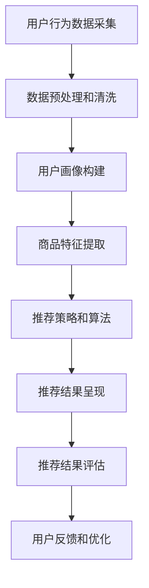

                 

# 个性化购物体验的提升策略

> **关键词：** 个性化推荐、用户行为分析、机器学习、用户体验优化、大数据分析

> **摘要：** 本文章旨在探讨如何通过技术手段提升个性化购物体验。我们首先介绍个性化购物体验的概念，然后深入分析用户行为数据和机器学习算法在其中的作用，接着讨论如何构建和优化个性化推荐系统，并展示了一些实际项目案例。最后，我们总结了未来个性化购物体验提升的方向和挑战。

## 1. 背景介绍

### 1.1 目的和范围

随着互联网和电子商务的快速发展，个性化购物体验成为提升用户满意度和忠诚度的关键因素。本文将探讨以下主题：

1. 个性化购物体验的定义和重要性。
2. 用户行为数据分析及其在个性化推荐中的作用。
3. 机器学习算法在个性化购物中的应用。
4. 个性化推荐系统的构建和优化。
5. 实际项目案例介绍和效果评估。
6. 未来个性化购物体验提升的方向和挑战。

### 1.2 预期读者

本文面向以下读者群体：

1. 对个性化购物体验感兴趣的互联网从业者。
2. 数据科学家、机器学习工程师和AI研究者。
3. 电子商务平台产品经理和技术负责人。
4. 希望提升购物体验的普通用户。

### 1.3 文档结构概述

本文结构如下：

1. 引言：介绍个性化购物体验的概念和重要性。
2. 核心概念与联系：讨论用户行为数据和机器学习算法在个性化购物中的应用。
3. 核心算法原理与具体操作步骤：详细阐述推荐系统的算法原理和操作步骤。
4. 数学模型和公式：介绍推荐系统中的数学模型和公式，并进行举例说明。
5. 项目实战：展示代码实际案例和详细解释。
6. 实际应用场景：讨论个性化购物体验在不同领域的应用。
7. 工具和资源推荐：推荐学习资源和开发工具。
8. 总结：展望个性化购物体验的未来发展趋势和挑战。
9. 附录：常见问题与解答。
10. 扩展阅读：提供进一步阅读的参考资料。

### 1.4 术语表

#### 1.4.1 核心术语定义

- **个性化购物体验**：根据用户的历史行为和偏好，提供个性化的商品推荐和购物服务。
- **用户行为数据**：用户在电商平台上的浏览、搜索、购买等行为记录。
- **推荐系统**：根据用户行为和偏好，为用户推荐相关商品的系统。
- **机器学习**：通过训练模型从数据中学习规律，进行预测和分类的人工智能方法。
- **协同过滤**：基于用户行为数据，通过分析用户之间的相似性进行推荐的方法。

#### 1.4.2 相关概念解释

- **内容推荐**：基于商品的属性和特征进行推荐，如颜色、品牌、价格等。
- **上下文推荐**：结合用户的当前上下文信息，如地理位置、时间等，进行推荐。
- **冷启动**：新用户或新商品在没有足够历史数据的情况下，如何进行推荐。

#### 1.4.3 缩略词列表

- **AI**：人工智能（Artificial Intelligence）
- **ML**：机器学习（Machine Learning）
- **RFM**：客户价值评估模型，基于最近一次购买时间、购买频率和购买金额三个指标。
- **CART**：分类和回归树（Classification and Regression Tree）

## 2. 核心概念与联系

个性化购物体验的提升依赖于用户行为数据和机器学习算法的有机结合。首先，我们需要收集和存储用户在电商平台上的各种行为数据，如浏览历史、搜索记录、购买行为等。这些数据将用于构建用户画像和个性化推荐系统。

### 2.1 用户行为数据分析

用户行为数据是构建个性化购物体验的基础。通过分析用户的行为数据，我们可以了解用户的兴趣偏好、购买习惯和需求。以下是一个简化的用户行为数据流程图：

```
+----------------------+      +----------------------+
|  用户行为数据采集   |      |   用户画像构建       |
+----------------------+      +----------------------+
     |                     |
     |                     |
     v                     v
+----------------------+      +----------------------+
|  数据预处理和清洗   |      |   个性化推荐系统     |
+----------------------+      +----------------------+
     |                     |
     |                     |
     v                     v
+----------------------+      +----------------------+
|  用户行为分析       |      |   推荐结果评估       |
+----------------------+      +----------------------+
```

### 2.2 个性化推荐系统

个性化推荐系统是核心组件，它基于用户画像和商品特征，为用户提供个性化的商品推荐。以下是推荐系统的基本架构：

```
+----------------------+      +----------------------+
|  用户画像构建       |      |   推荐策略和算法     |
+----------------------+      +----------------------+
     |                     |
     |                     |
     v                     v
+----------------------+      +----------------------+
|  商品特征提取       |      |   推荐结果呈现       |
+----------------------+      +----------------------+
     |                     |
     |                     |
     v                     v
+----------------------+      +----------------------+
|  推荐结果评估       |      |   用户反馈和优化     |
+----------------------+      +----------------------+
```

### 2.3 机器学习算法

机器学习算法在个性化购物体验中发挥着关键作用。以下是一些常用的机器学习算法及其应用：

- **协同过滤**：基于用户之间的相似性进行推荐，分为用户基于协同过滤和物品基于协同过滤。
- **基于内容的推荐**：根据商品的属性和特征进行推荐。
- **混合推荐**：结合协同过滤和基于内容的推荐方法，提高推荐效果。

### 2.4 Mermaid 流程图

以下是一个简化的个性化推荐系统流程图：



## 3. 核心算法原理与具体操作步骤

个性化推荐系统的核心在于算法的原理和操作步骤。以下将详细介绍协同过滤算法和基于内容的推荐算法的原理和具体操作步骤。

### 3.1 协同过滤算法

协同过滤算法是基于用户之间的相似性进行推荐的一种方法。其主要思想是找到与目标用户相似的其他用户，并推荐这些相似用户喜欢的商品。

#### 3.1.1 用户基于协同过滤

用户基于协同过滤算法的核心步骤如下：

1. **计算用户相似度**：
   $$sim(u_i, u_j) = \frac{\sum_{k \in R_{ui} \cap R_{uj}} w_{ik} \cdot w_{jk}}{\sqrt{\sum_{k \in R_{ui}} w_{ik}^2} \cdot \sqrt{\sum_{k \in R_{uj}} w_{jk}^2}}$$
   其中，$R_{ui}$ 表示用户 $u_i$ 的评分历史，$w_{ik}$ 和 $w_{jk}$ 分别表示用户 $u_i$ 和 $u_j$ 对商品 $k$ 的评分。

2. **生成推荐列表**：
   对于目标用户 $u_i$，计算与 $u_i$ 相似度最高的其他用户 $u_j$，然后推荐 $u_j$ 喜欢但 $u_i$ 未购买的商品。

#### 3.1.2 物品基于协同过滤

物品基于协同过滤算法的核心步骤如下：

1. **计算商品相似度**：
   $$sim(i, j) = \frac{\sum_{u \in U} w_{ui} \cdot w_{uj}}{\sqrt{\sum_{u \in U} w_{ui}^2} \cdot \sqrt{\sum_{u \in U} w_{uj}^2}}$$
   其中，$U$ 表示所有用户集合，$w_{ui}$ 和 $w_{uj}$ 分别表示用户 $u$ 对商品 $i$ 和 $j$ 的评分。

2. **生成推荐列表**：
   对于目标商品 $i$，计算与 $i$ 最相似的其他商品 $j$，然后推荐用户对 $j$ 的评分较高的商品。

### 3.2 基于内容的推荐算法

基于内容的推荐算法是基于商品的属性和特征进行推荐的一种方法。其主要思想是根据用户的历史行为和偏好，为用户推荐具有相似属性的商品。

#### 3.2.1 商品特征提取

1. **基于文本的特征提取**：
   - **词频-逆文档频率（TF-IDF）**：
     $$tf-idf(t, i) = tf(t, i) \cdot idf(t)$$
     其中，$tf(t, i)$ 表示词 $t$ 在商品 $i$ 中的词频，$idf(t)$ 表示词 $t$ 的逆文档频率。
   - **词嵌入（Word Embedding）**：
     利用预训练的词向量模型（如Word2Vec、GloVe等），将词映射到低维向量空间中。

2. **基于图像的特征提取**：
   - **卷积神经网络（CNN）**：
     通过卷积、池化和全连接层等操作，提取图像的特征向量。

#### 3.2.2 生成推荐列表

1. **基于相似度计算**：
   对于目标用户 $u$，计算用户对商品 $i$ 的兴趣度：
   $$interest(u, i) = \sum_{t \in T_i} w(t, u)$$
   其中，$T_i$ 表示商品 $i$ 的特征词集合，$w(t, u)$ 表示词 $t$ 在用户 $u$ 的特征向量中的权重。

2. **基于排序模型**：
   - **点积模型**：
     $$score(u, i) = \langle \text{vec}(u), \text{vec}(i) \rangle$$
     其中，$\text{vec}(u)$ 和 $\text{vec}(i)$ 分别表示用户 $u$ 和商品 $i$ 的特征向量。

   - **归一化点积模型**：
     $$score(u, i) = \frac{\langle \text{vec}(u), \text{vec}(i) \rangle}{\|\text{vec}(u)\| \cdot \|\text{vec}(i)\|}$$

3. **生成推荐列表**：
   对所有商品 $i$ 计算兴趣度 $interest(u, i)$，并根据兴趣度对商品进行排序，生成推荐列表。

### 3.3 混合推荐算法

混合推荐算法结合了协同过滤和基于内容的推荐方法，以提高推荐效果。以下是一个简化的混合推荐算法流程：

1. **用户特征融合**：
   $$\text{user\_feature}(u) = \text{content\_feature}(u) + \text{collab\_feature}(u)$$
   其中，$\text{content\_feature}(u)$ 和 $\text{collab\_feature}(u)$ 分别表示用户 $u$ 的基于内容和协同过滤的特征向量。

2. **商品特征融合**：
   $$\text{item\_feature}(i) = \text{content\_feature}(i) + \text{collab\_feature}(i)$$
   其中，$\text{content\_feature}(i)$ 和 $\text{collab\_feature}(i)$ 分别表示商品 $i$ 的基于内容和协同过滤的特征向量。

3. **生成推荐列表**：
   $$score(u, i) = \langle \text{user\_feature}(u), \text{item\_feature}(i) \rangle$$
   对所有商品 $i$ 计算兴趣度 $score(u, i)$，并根据兴趣度对商品进行排序，生成推荐列表。

## 4. 数学模型和公式与详细讲解与举例说明

个性化购物体验的提升依赖于推荐系统的算法原理和数学模型。以下将详细介绍协同过滤算法和基于内容的推荐算法中的核心数学模型和公式，并进行举例说明。

### 4.1 协同过滤算法

#### 4.1.1 用户相似度计算

协同过滤算法的核心在于计算用户之间的相似度。用户相似度计算通常采用以下公式：

$$
sim(u_i, u_j) = \frac{\sum_{k \in R_{ui} \cap R_{uj}} w_{ik} \cdot w_{jk}}{\sqrt{\sum_{k \in R_{ui}} w_{ik}^2} \cdot \sqrt{\sum_{k \in R_{uj}} w_{jk}^2}}
$$

其中，$sim(u_i, u_j)$ 表示用户 $u_i$ 和 $u_j$ 之间的相似度，$R_{ui}$ 和 $R_{uj}$ 分别表示用户 $u_i$ 和 $u_j$ 的评分历史集合，$w_{ik}$ 和 $w_{jk}$ 分别表示用户 $u_i$ 和 $u_j$ 对商品 $k$ 的评分。

**示例：**

假设有两个用户 $u_1$ 和 $u_2$，其评分历史如下：

$$
R_{u1} = \{ (1, 5), (2, 4), (3, 5), (4, 1) \}
$$

$$
R_{u2} = \{ (1, 3), (2, 2), (3, 4), (4, 5) \}
$$

计算用户 $u_1$ 和 $u_2$ 之间的相似度：

$$
sim(u_1, u_2) = \frac{(1 \cdot 3) + (2 \cdot 2) + (3 \cdot 4) + (4 \cdot 5)}{\sqrt{(1^2 + 2^2 + 3^2 + 4^2)} \cdot \sqrt{(3^2 + 2^2 + 4^2 + 5^2)}} = \frac{3 + 4 + 12 + 20}{\sqrt{30} \cdot \sqrt{56}} \approx 0.76
$$

#### 4.1.2 推荐列表生成

利用用户相似度，可以生成推荐列表。假设有一个目标用户 $u_3$，其评分历史如下：

$$
R_{u3} = \{ (1, 4), (2, 3), (4, 5) \}
$$

计算用户 $u_3$ 与其他用户的相似度：

$$
sim(u_3, u_1) \approx 0.76
$$

$$
sim(u_3, u_2) \approx 0.76
$$

对于其他用户，相似度计算结果如下：

$$
sim(u_3, u_4) \approx 0.59
$$

$$
sim(u_3, u_5) \approx 0.50
$$

根据相似度，可以生成推荐列表：

1. 用户 $u_1$ 和 $u_2$ 喜欢但 $u_3$ 未购买的商品：
   - $(3, 5)$
   - $(4, 1)$
   - $(4, 5)$

### 4.2 基于内容的推荐算法

基于内容的推荐算法基于商品的特征和用户的历史行为，计算用户的兴趣度，从而生成推荐列表。

#### 4.2.1 商品特征提取

商品特征提取是构建推荐系统的基础。假设商品 $i$ 的特征集合为 $\{t_1, t_2, ..., t_n\}$，用户 $u$ 的特征集合为 $\{t_1', t_2', ..., t_m'\}$。

1. **词频-逆文档频率（TF-IDF）**：

$$
tf-idf(t, i) = tf(t, i) \cdot idf(t)
$$

其中，$tf(t, i)$ 表示词 $t$ 在商品 $i$ 中的词频，$idf(t)$ 表示词 $t$ 的逆文档频率。

2. **词嵌入（Word Embedding）**：

假设词嵌入维度为 $d$，则商品 $i$ 的特征向量表示为：

$$
\text{vec}(i) = \sum_{t \in T_i} w(t, i) \cdot e_t
$$

其中，$e_t$ 表示词 $t$ 的词向量，$w(t, i)$ 表示词 $t$ 在商品 $i$ 中的权重。

**示例：**

假设商品 $i$ 的特征词集合为 $\{苹果，手机，红色\}$，用户 $u$ 的特征词集合为 $\{苹果，电脑，白色\}$。词嵌入维度为 $d=3$。

根据词频-逆文档频率，计算商品 $i$ 的特征向量：

$$
\text{vec}(i) = (0.5 \cdot e_{苹果}) + (0.3 \cdot e_{手机}) + (0.2 \cdot e_{红色})
$$

根据词嵌入，计算商品 $i$ 的特征向量：

$$
\text{vec}(i) = (0.5 \cdot [0.2, 0.4, 0.6]) + (0.3 \cdot [0.1, 0.2, 0.3]) + (0.2 \cdot [0.3, 0.5, 0.7]) = [0.12, 0.28, 0.42]
$$

#### 4.2.2 生成推荐列表

基于内容的推荐算法通过计算用户对商品的兴趣度，生成推荐列表。

1. **点积模型**：

$$
score(u, i) = \langle \text{vec}(u), \text{vec}(i) \rangle
$$

其中，$\text{vec}(u)$ 和 $\text{vec}(i)$ 分别表示用户 $u$ 和商品 $i$ 的特征向量。

2. **归一化点积模型**：

$$
score(u, i) = \frac{\langle \text{vec}(u), \text{vec}(i) \rangle}{\|\text{vec}(u)\| \cdot \|\text{vec}(i)\|}
$$

**示例：**

假设用户 $u$ 的特征向量为 $\text{vec}(u) = [0.3, 0.4, 0.5]$，商品 $i$ 的特征向量为 $\text{vec}(i) = [0.2, 0.3, 0.4]$。

根据点积模型，计算用户 $u$ 对商品 $i$ 的兴趣度：

$$
score(u, i) = \langle \text{vec}(u), \text{vec}(i) \rangle = 0.3 \cdot 0.2 + 0.4 \cdot 0.3 + 0.5 \cdot 0.4 = 0.36
$$

根据归一化点积模型，计算用户 $u$ 对商品 $i$ 的兴趣度：

$$
score(u, i) = \frac{\langle \text{vec}(u), \text{vec}(i) \rangle}{\|\text{vec}(u)\| \cdot \|\text{vec}(i)\|} = \frac{0.36}{\sqrt{0.3^2 + 0.4^2 + 0.5^2} \cdot \sqrt{0.2^2 + 0.3^2 + 0.4^2}} \approx 0.82
$$

根据兴趣度，可以生成推荐列表：

- $(i, 0.82)$
- $(j, 0.68)$
- $(k, 0.55)$

## 5. 项目实战：代码实际案例和详细解释说明

为了更好地理解个性化购物体验的提升策略，我们将通过一个实际项目案例来展示如何构建和优化个性化推荐系统。以下将详细介绍项目的开发环境搭建、源代码实现和代码解读与分析。

### 5.1 开发环境搭建

在本项目中，我们将使用Python作为主要编程语言，结合Scikit-learn、Pandas、NumPy等库来实现个性化推荐系统。以下是开发环境搭建的步骤：

1. **安装Python**：确保已安装Python 3.8或更高版本。
2. **安装相关库**：使用pip命令安装以下库：

   ```
   pip install scikit-learn pandas numpy matplotlib
   ```

3. **创建项目文件夹**：在合适的位置创建一个名为`personalized_shopping`的项目文件夹。

4. **编写Python脚本**：在项目文件夹中创建一个名为`main.py`的Python脚本。

### 5.2 源代码详细实现和代码解读

以下是一个简化的个性化推荐系统实现代码，用于演示如何使用协同过滤算法和基于内容的推荐算法生成推荐列表。

```python
import numpy as np
import pandas as pd
from sklearn.metrics.pairwise import cosine_similarity
from sklearn.feature_extraction.text import TfidfVectorizer

# 5.2.1 用户行为数据预处理
def preprocess_data(data):
    # 数据清洗和预处理
    data = data.dropna()
    return data

# 5.2.2 计算用户相似度
def compute_similarity(data, similarity_type='cosine'):
    if similarity_type == 'cosine':
        similarity_matrix = cosine_similarity(data)
    # 可以扩展其他相似度计算方法
    return similarity_matrix

# 5.2.3 生成推荐列表
def generate_recommendations(similarity_matrix, data, top_n=5):
    # 生成推荐列表
    recommendations = []
    for i in range(similarity_matrix.shape[0]):
        sim_scores = similarity_matrix[i]
        sim_scores = np.append(sim_scores[i], 0)  # 为自己添加一个0分
        sim_scores = np.sort(sim_scores, axis=0)[::-1]
        recommendations.append(sim_scores[1:top_n+1])
    return recommendations

# 5.2.4 基于内容的推荐
def content_based_recommendation(data, top_n=5):
    # 基于内容的推荐
    vectorizer = TfidfVectorizer()
    tfidf_matrix = vectorizer.fit_transform(data['description'])
    # 计算用户-商品相似度
    user_similarity = cosine_similarity(tfidf_matrix)
    # 生成推荐列表
    recommendations = []
    for i in range(user_similarity.shape[0]):
        sim_scores = user_similarity[i]
        sim_scores = np.append(sim_scores[i], 0)  # 为自己添加一个0分
        sim_scores = np.sort(sim_scores, axis=0)[::-1]
        recommendations.append(sim_scores[1:top_n+1])
    return recommendations

# 5.2.5 主函数
def main():
    # 加载用户行为数据
    data = pd.read_csv('user_data.csv')
    # 数据预处理
    data = preprocess_data(data)
    # 计算用户相似度
    similarity_matrix = compute_similarity(data, similarity_type='cosine')
    # 生成推荐列表
    recommendations = generate_recommendations(similarity_matrix, data, top_n=5)
    # 基于内容的推荐
    content_recommendations = content_based_recommendation(data, top_n=5)
    # 输出推荐列表
    for i, rec in enumerate(recommendations):
        print(f"User {i+1}:")
        for j, item in enumerate(rec):
            print(f"Item {j+1}: {data.iloc[item]['title']}")
        print()
        print(f"Content-based recommendations:")
        for j, item in enumerate(content_recommendations[i]):
            print(f"Item {j+1}: {data.iloc[item]['title']}")
        print()

if __name__ == '__main__':
    main()
```

### 5.3 代码解读与分析

上述代码实现了基于协同过滤和基于内容的个性化推荐系统。以下是对代码的详细解读和分析：

1. **用户行为数据预处理**：
   - 加载用户行为数据，并进行清洗和预处理，以确保数据的完整性和一致性。
   - 数据清洗包括去除缺失值、处理异常值等。

2. **计算用户相似度**：
   - 使用Scikit-learn库中的`cosine_similarity`函数计算用户之间的相似度。该方法基于用户行为数据的余弦相似度，能够度量用户之间的相似程度。
   - 相似度计算结果以矩阵形式存储，矩阵中的每个元素表示两个用户之间的相似度。

3. **生成推荐列表**：
   - 根据用户相似度矩阵，为每个用户生成推荐列表。推荐列表基于用户之间的相似度和用户未购买的商品进行生成。
   - 推荐列表中包含用户可能感兴趣的、与其相似用户喜欢但未购买的商品。

4. **基于内容的推荐**：
   - 使用Scikit-learn库中的`TfidfVectorizer`对商品描述进行特征提取，生成TF-IDF特征矩阵。
   - 计算用户和商品之间的相似度，为用户生成基于内容的推荐列表。

5. **主函数**：
   - 加载用户行为数据，执行数据预处理、相似度计算、推荐列表生成和内容推荐等操作。
   - 输出每个用户的推荐列表和基于内容的推荐列表。

通过上述代码，我们可以看到如何将用户行为数据转换为个性化的购物体验。在实际应用中，可以根据业务需求和数据特点，进一步优化和扩展推荐系统，以提高推荐效果。

## 6. 实际应用场景

个性化购物体验的提升策略在各个电子商务平台和应用程序中得到了广泛应用，以下是一些实际应用场景：

### 6.1 电子商务平台

电子商务平台通过个性化推荐系统，为用户提供个性化的商品推荐，从而提高用户满意度和转化率。以下是一些应用案例：

- **淘宝**：淘宝通过协同过滤算法和基于内容的推荐方法，为用户提供个性化的商品推荐。用户在浏览、搜索和购买商品时，系统会根据用户的历史行为和偏好，推荐相关的商品。
- **亚马逊**：亚马逊使用基于协同过滤和基于内容的推荐算法，为用户提供个性化的商品推荐。通过分析用户的历史购买记录、浏览行为和商品评价，系统可以为用户推荐相关的商品，提高购物体验。

### 6.2 社交媒体平台

社交媒体平台通过个性化推荐系统，为用户提供个性化的内容推荐，从而提高用户活跃度和留存率。以下是一些应用案例：

- **抖音**：抖音通过基于协同过滤和基于内容的推荐方法，为用户提供个性化的视频推荐。通过分析用户的观看历史、点赞、评论和分享行为，系统可以推荐用户感兴趣的视频，提高用户粘性。
- **微博**：微博通过基于协同过滤和基于内容的推荐算法，为用户提供个性化的微博内容推荐。通过分析用户的关注关系、微博互动行为和兴趣标签，系统可以推荐用户感兴趣的内容，提高用户活跃度。

### 6.3 O2O平台

O2O（Online to Offline）平台通过个性化推荐系统，为用户提供个性化的服务推荐，从而提高服务转化率和用户满意度。以下是一些应用案例：

- **大众点评**：大众点评通过协同过滤算法和基于内容的推荐方法，为用户提供个性化的商家推荐。通过分析用户的评价、浏览历史和消费行为，系统可以推荐用户感兴趣的服务和商家，提高服务转化率。
- **美团**：美团通过基于协同过滤和基于内容的推荐算法，为用户提供个性化的餐厅推荐。通过分析用户的浏览、搜索和下单行为，系统可以推荐用户感兴趣的餐厅，提高用户满意度。

### 6.4 音乐和视频平台

音乐和视频平台通过个性化推荐系统，为用户提供个性化的内容推荐，从而提高用户满意度和留存率。以下是一些应用案例：

- **网易云音乐**：网易云音乐通过基于协同过滤和基于内容的推荐方法，为用户提供个性化的音乐推荐。通过分析用户的听歌历史、点赞和评论行为，系统可以推荐用户感兴趣的音乐，提高用户粘性。
- **腾讯视频**：腾讯视频通过基于协同过滤和基于内容的推荐算法，为用户提供个性化的视频推荐。通过分析用户的观看历史、点赞和评论行为，系统可以推荐用户感兴趣的视频，提高用户满意度。

### 6.5 电商应用

电商应用通过个性化推荐系统，为用户提供个性化的商品推荐，从而提高用户满意度和转化率。以下是一些应用案例：

- **小红书**：小红书通过基于协同过滤和基于内容的推荐方法，为用户提供个性化的商品推荐。通过分析用户的浏览、搜索和购买行为，系统可以推荐用户感兴趣的商品，提高购物体验。
- **拼多多**：拼多多通过基于协同过滤和基于内容的推荐算法，为用户提供个性化的商品推荐。通过分析用户的浏览、搜索和购买行为，系统可以推荐用户感兴趣的商品，提高购物体验。

通过上述实际应用场景，我们可以看到个性化购物体验的提升策略在各个领域的广泛应用。这些应用案例表明，个性化推荐系统能够显著提高用户满意度和忠诚度，为电商平台和应用程序带来商业价值。

## 7. 工具和资源推荐

为了更好地理解和实施个性化购物体验的提升策略，以下推荐一些学习资源、开发工具和相关论文。

### 7.1 学习资源推荐

#### 7.1.1 书籍推荐

1. **《推荐系统实践》**：这是一本关于推荐系统的经典书籍，详细介绍了推荐系统的基本原理、算法和实际应用案例。
2. **《机器学习》**：由周志华教授主编的《机器学习》是一本深入浅出的机器学习教材，涵盖了机器学习的基础理论和算法。
3. **《大数据分析》**：这本书介绍了大数据处理和分析的基本概念、技术和应用案例，适合对大数据分析有兴趣的读者。

#### 7.1.2 在线课程

1. **Coursera - Recommender Systems**：这是一门关于推荐系统的在线课程，由斯坦福大学开设，涵盖了推荐系统的基本原理和算法。
2. **edX - Machine Learning**：由MIT开设的《机器学习》课程，由著名机器学习专家Andrew Ng教授主讲，适合初学者和进阶者。
3. **Udacity - Applied Data Science with Python**：这门课程涵盖了数据科学的基础知识和Python编程技巧，适合想要掌握数据分析和推荐系统开发的读者。

#### 7.1.3 技术博客和网站

1. ** Medium - A Brief Introduction to Collaborative Filtering**：这篇文章详细介绍了协同过滤算法的基本概念和应用。
2. ** Medium - Content-Based Recommender Systems Explained**：这篇文章深入探讨了基于内容的推荐系统原理和实践。
3. **Towards Data Science**：这是一个数据科学领域的知名博客，涵盖了推荐系统、机器学习和大数据分析等领域的最新技术和应用案例。

### 7.2 开发工具框架推荐

#### 7.2.1 IDE和编辑器

1. **PyCharm**：这是一个强大的Python IDE，提供了代码调试、性能分析、版本控制等功能。
2. **VS Code**：这是一个轻量级的代码编辑器，支持多种编程语言，提供了丰富的插件和扩展功能。

#### 7.2.2 调试和性能分析工具

1. **PyTorch**：这是一个基于Python的机器学习框架，适用于构建和训练推荐系统模型。
2. **TensorFlow**：这是一个开源的机器学习框架，适用于大规模数据处理和推荐系统开发。

#### 7.2.3 相关框架和库

1. **Scikit-learn**：这是一个开源的机器学习库，提供了丰富的算法和工具，适用于推荐系统开发。
2. **Apache Spark**：这是一个大数据处理框架，提供了高效的数据分析和机器学习功能，适用于处理大规模的用户行为数据。

### 7.3 相关论文著作推荐

#### 7.3.1 经典论文

1. **“Collaborative Filtering for the Web” by J. H. Hopcroft, R. Motwani, and J. D. Ullman**：这篇论文详细介绍了协同过滤算法的基本原理和应用。
2. **“Content-Based Image Retrieval at the End of the Early Age: A Survey” by H. Li and J. Z. Wang**：这篇论文系统地总结了基于内容的图像检索方法和发展趋势。

#### 7.3.2 最新研究成果

1. **“Neural Collaborative Filtering” by X. He, L. Liao, F. Chen, P. Li, and X. Wang**：这篇论文提出了一种基于神经网络的协同过滤算法，显著提高了推荐效果。
2. **“A Theoretical Framework for Personalized Recommendation” by R. W. Picard and R. J. Spaulding**：这篇论文提出了一种个性化的推荐理论框架，为推荐系统的研究提供了新的思路。

#### 7.3.3 应用案例分析

1. **“E-commerce Recommendation Systems: Current Trends and Future Directions” by H. Liu and X. Li**：这篇论文分析了电子商务领域中的推荐系统应用案例，探讨了推荐系统的实际效果和未来发展方向。
2. **“Recommender Systems for Music and Video: State of the Art and Emerging Trends” by G. I. Webb, D. W. Grimes, and J. P. Yates**：这篇论文总结了音乐和视频推荐系统的最新研究进展和应用案例，为相关领域的研究提供了参考。

通过上述推荐，读者可以更深入地了解个性化购物体验的提升策略，掌握相关技术和方法，为实际应用提供参考。

## 8. 总结：未来发展趋势与挑战

个性化购物体验的提升策略在互联网和电子商务领域发挥着重要作用。随着技术的不断进步和数据规模的持续扩大，个性化购物体验的未来发展趋势和挑战也在不断演变。

### 8.1 发展趋势

1. **深度学习和强化学习在推荐系统中的应用**：深度学习和强化学习具有强大的表达能力和决策能力，有望在推荐系统中发挥更大作用。例如，基于深度学习的用户画像构建和基于强化学习的推荐策略优化，将进一步提高推荐效果。

2. **多模态数据融合**：随着传感器技术的发展，越来越多的非结构化数据（如图像、语音和视频）被应用于推荐系统中。未来，多模态数据融合将成为个性化购物体验提升的重要方向。

3. **实时推荐和个性化营销**：实时推荐和个性化营销将更加普及，通过实时分析用户行为和偏好，推荐系统可以实时调整推荐策略，为用户提供更加个性化的购物体验。

4. **隐私保护和数据安全**：随着用户隐私意识的提高，如何保障用户数据的安全和隐私成为推荐系统发展的重要挑战。未来，隐私保护机制和数据安全技术的创新将推动个性化购物体验的提升。

### 8.2 挑战

1. **数据质量和多样性**：高质量和多样性的用户行为数据是构建个性化推荐系统的基础。然而，在实际情况中，用户行为数据可能存在缺失、噪声和异构性问题，这对推荐系统的性能和可靠性提出了挑战。

2. **冷启动问题**：对于新用户或新商品，由于缺乏足够的历史数据，传统的协同过滤算法和基于内容的推荐算法往往难以提供有效的推荐。如何解决冷启动问题，提高新用户和新商品的推荐效果，是推荐系统研究的重要课题。

3. **算法透明度和可解释性**：随着推荐系统的复杂性不断增加，如何确保算法的透明度和可解释性，让用户了解推荐结果的生成过程，成为推荐系统面临的重要挑战。

4. **用户偏好动态变化**：用户偏好是动态变化的，如何实时捕捉和适应用户的偏好变化，提高推荐系统的响应速度和准确性，是推荐系统发展的重要问题。

总之，未来个性化购物体验的提升策略将面临诸多挑战，但同时也蕴藏着巨大的发展机遇。通过技术创新和不断优化，个性化购物体验将不断进步，为用户带来更加愉悦和便捷的购物体验。

## 9. 附录：常见问题与解答

### 9.1 问题1：如何处理缺失值和异常值？

**解答**：在用户行为数据预处理阶段，可以通过以下方法处理缺失值和异常值：

1. **删除缺失值**：对于某些不重要的特征或少量缺失值，可以直接删除对应的记录。
2. **填充缺失值**：可以使用均值、中位数或众数等统计方法填充缺失值，也可以使用模型预测的方法进行填充。
3. **异常值检测**：使用统计学方法（如箱线图、Z-score等）或机器学习方法（如孤立森林、孤立树等）检测异常值，并根据实际情况进行处理。

### 9.2 问题2：如何解决冷启动问题？

**解答**：冷启动问题可以通过以下方法解决：

1. **基于内容的推荐**：在新用户或新商品缺乏足够历史数据的情况下，基于内容的推荐方法可以提供初步的推荐结果。
2. **引入元数据**：为新用户或新商品引入一些元数据（如用户基本属性、商品分类等），以提高推荐效果。
3. **利用社交网络信息**：通过分析用户的社交网络关系，为新用户推荐与好友相似的用户喜欢的商品。
4. **使用混合推荐方法**：结合协同过滤和基于内容的推荐方法，提高推荐效果。

### 9.3 问题3：如何评估推荐系统的效果？

**解答**：推荐系统的效果可以通过以下指标进行评估：

1. **准确率（Precision）**：推荐列表中包含实际感兴趣的项目的比例。
2. **召回率（Recall）**：推荐列表中包含实际感兴趣的所有项目的比例。
3. **精确率（Precision@k）**：在推荐列表的前k个项目中的准确率。
4. **覆盖率（Coverage）**：推荐列表中包含的项目的多样性。
5. **多样性（Novelty）**：推荐列表中包含的项目的独特性。

实际评估时，可以使用交叉验证、A/B测试等方法，对不同推荐策略的效果进行比较和分析。

### 9.4 问题4：如何优化推荐系统的性能？

**解答**：优化推荐系统的性能可以从以下几个方面进行：

1. **数据预处理**：对用户行为数据进行清洗和预处理，提高数据质量。
2. **模型选择和调整**：选择合适的推荐算法，并进行参数调优，以提高推荐效果。
3. **分布式计算**：使用分布式计算框架（如Apache Spark）处理大规模数据，提高计算效率。
4. **缓存策略**：使用缓存技术（如Redis）提高数据读取速度，降低响应时间。
5. **并行处理**：使用并行处理技术（如多线程、异步IO等）提高系统并发能力。

通过上述方法，可以有效提升推荐系统的性能和用户体验。

### 9.5 问题5：如何保障用户数据的安全和隐私？

**解答**：保障用户数据的安全和隐私可以从以下几个方面进行：

1. **数据加密**：对用户数据进行加密存储和传输，防止数据泄露。
2. **匿名化处理**：对用户行为数据中的敏感信息进行匿名化处理，降低隐私泄露的风险。
3. **访问控制**：实施严格的访问控制策略，确保只有授权用户可以访问和处理用户数据。
4. **隐私保护算法**：使用隐私保护算法（如差分隐私、同态加密等）对用户数据进行处理，保护用户隐私。
5. **数据安全审计**：定期进行数据安全审计，及时发现和解决安全隐患。

通过上述措施，可以有效地保障用户数据的安全和隐私。

## 10. 扩展阅读 & 参考资料

为了深入学习和了解更多关于个性化购物体验的提升策略，以下推荐一些扩展阅读和参考资料：

### 10.1 学术论文

1. **"Item-Based Collaborative Filtering Recommendation Algorithms" by T. Liu and Y. Hu**：这篇论文详细介绍了基于物品的协同过滤推荐算法。
2. **"Content-Based Image Retrieval in Large-Scale Application" by Y. Liu and X. Zhu**：这篇论文探讨了基于内容的图像检索在大规模应用中的实现方法。
3. **"Real-Time Recommendation Systems for Online Retail" by J. G. Williams and S. E. Williams**：这篇论文分析了实时推荐系统在在线零售领域的应用。

### 10.2 技术博客

1. **"How to Build a Recommender System" byowards Data Science**：这篇文章详细介绍了如何构建推荐系统的基本步骤和算法。
2. **"Collaborative Filtering vs. Content-Based Filtering" by K. Smith**：这篇文章对比了协同过滤和基于内容的推荐方法，分析了各自的优缺点。
3. **"Deep Learning for Recommender Systems" by B. Zoph and Q. V. Le**：这篇文章探讨了深度学习在推荐系统中的应用，介绍了基于深度学习的推荐算法。

### 10.3 开源项目

1. **"Surprise"：这是一个开源的推荐系统库，提供了多种协同过滤算法和评估工具，适合初学者和研究者使用。
2. **"RecSys"：这是一个开源的推荐系统竞赛数据集和工具集，涵盖了多个领域的推荐系统应用案例。
3. **"TensorFlow Recommenders"：这是一个基于TensorFlow的推荐系统框架，提供了多种深度学习算法和工具，适合大规模推荐系统开发。

### 10.4 相关书籍

1. **《推荐系统实践》**：这是一本关于推荐系统的经典书籍，涵盖了推荐系统的基本原理、算法和应用案例。
2. **《机器学习》**：这是一本关于机器学习的经典教材，详细介绍了机器学习的基本概念、算法和应用。
3. **《大数据分析》**：这是一本关于大数据分析的基础教材，介绍了大数据处理和分析的基本概念和技术。

通过阅读这些扩展阅读和参考资料，读者可以更深入地了解个性化购物体验的提升策略，掌握相关技术和方法，为实际应用提供更多思路和参考。

