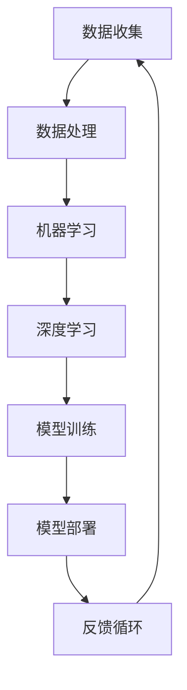

                 

# 中国企业在AI技术上的数据优势

> 关键词：人工智能、数据优势、中国、技术发展、行业应用

> 摘要：随着全球人工智能技术的迅猛发展，中国企业在这一领域逐渐展现出独特的优势。本文将分析中国企业在AI技术上的数据优势，探讨其在技术创新、行业应用和未来发展中的潜力，并指出面临的一些挑战。

## 1. 背景介绍

### 1.1 目的和范围

本文旨在探讨中国企业在人工智能技术上的数据优势，分析其背后的原因、影响以及未来可能的发展趋势。文章将聚焦于以下几个核心问题：

- 中国企业在AI技术中的数据资源如何积累和利用？
- 这些数据优势如何推动中国企业的技术进步和行业应用？
- 中国企业在AI技术发展中面临哪些挑战和机遇？

### 1.2 预期读者

本文适用于以下读者群体：

- 对人工智能技术有兴趣的从业者
- 想了解中国AI产业发展现状的研究人员
- 计算机科学和人工智能专业的学生

### 1.3 文档结构概述

本文将分为以下几个部分：

- 核心概念与联系：介绍AI技术的核心概念和架构，使用Mermaid流程图展示。
- 核心算法原理 & 具体操作步骤：详细解释AI技术中的关键算法，使用伪代码阐述。
- 数学模型和公式 & 详细讲解 & 举例说明：分析AI技术中的数学模型，使用LaTeX格式展示。
- 项目实战：代码实际案例和详细解释说明。
- 实际应用场景：分析AI技术在各个行业中的应用。
- 工具和资源推荐：推荐学习资源、开发工具和框架。
- 总结：未来发展趋势与挑战。
- 附录：常见问题与解答。
- 扩展阅读 & 参考资料：提供相关文献和资料。

### 1.4 术语表

#### 1.4.1 核心术语定义

- 人工智能（AI）：模拟人类智能行为的计算机系统。
- 数据优势：指企业在数据收集、处理和分析方面相对于竞争对手的显著优势。
- 大数据：指无法用传统数据库软件工具提取价值和知识的海量数据。

#### 1.4.2 相关概念解释

- 深度学习：一种基于多层神经网络的机器学习方法。
- 机器学习：一种使计算机通过数据学习模式和提高性能的技术。
- 人工智能芯片：专为执行AI任务设计的集成电路。

#### 1.4.3 缩略词列表

- AI：人工智能
- ML：机器学习
- DL：深度学习
- NLP：自然语言处理
- CV：计算机视觉

## 2. 核心概念与联系

为了深入理解中国企业在AI技术上的数据优势，我们首先需要了解一些核心概念和它们之间的联系。以下是一个Mermaid流程图，展示了AI技术中的关键组成部分：



### 数据收集

数据收集是AI技术的起点，它涉及到从各种来源获取数据，包括公共数据库、企业内部数据和传感器数据。中国企业在这一领域具有显著的优势，原因如下：

- **庞大的人口基数**：中国拥有世界上最大的人口，这意味着大量的用户数据和社交媒体数据可供收集。
- **互联网普及率高**：随着互联网的普及，中国拥有丰富的在线数据资源，包括电子商务、社交媒体、在线教育等。

### 数据处理

数据处理是AI技术的核心环节，它包括数据清洗、数据整合和数据预处理等步骤。中国企业在数据处理方面也有其独特优势：

- **强大的计算能力**：中国拥有世界上最大的数据中心和云计算服务提供商，能够快速处理海量数据。
- **专业的人才储备**：中国高等院校和科研机构在数据科学和机器学习领域培养了大量的专业人才。

### 机器学习和深度学习

机器学习和深度学习是AI技术的两大支柱。中国企业在这些领域取得了显著进展：

- **算法创新**：中国在深度学习算法的研究和应用方面取得了多项突破，例如在图像识别和语音识别领域的优异表现。
- **开源贡献**：中国开发者积极参与开源社区，为全球AI技术的发展做出了贡献。

### 模型训练和部署

模型训练和部署是AI技术实现商业价值的关键环节。中国企业在这些方面也有其独特优势：

- **应用场景丰富**：中国企业在金融、医疗、安防等行业中拥有丰富的应用场景，这为AI技术的部署提供了广泛的实践机会。
- **快速迭代能力**：中国企业通常具备快速响应市场需求和技术变化的能力，能够迅速调整和部署AI模型。

### 反馈循环

反馈循环是AI技术不断优化和提升的重要机制。中国企业在这一方面也有显著优势：

- **用户反馈机制**：中国企业通常能够快速获取用户反馈，并将其应用于模型优化和产品改进。
- **数据反馈循环**：通过不断优化数据收集和处理流程，中国企业能够实现数据质量的持续提升。

## 3. 核心算法原理 & 具体操作步骤

在理解了AI技术的核心概念和联系之后，我们接下来将详细解释AI技术中的关键算法原理和具体操作步骤。以下是一个使用伪代码展示的示例：

```python
# 伪代码：深度学习模型训练步骤

# 初始化神经网络结构
model = NeuralNetwork()

# 加载数据集
train_data = LoadData('train_data.csv')
test_data = LoadData('test_data.csv')

# 初始化损失函数
loss_function = CrossEntropyLoss()

# 设置优化器
optimizer = AdamOptimizer(model.parameters(), learning_rate=0.001)

# 模型训练循环
for epoch in range(num_epochs):
    for batch in train_data:
        # 前向传播
        predictions = model(batch.data)
        loss = loss_function(predictions, batch.labels)

        # 反向传播
        gradients = model.backward(loss)

        # 更新模型参数
        optimizer.update_gradients(gradients)

    # 打印训练进度
    print(f"Epoch {epoch}: Loss = {loss}")

# 模型评估
eval_loss = EvaluateModel(model, test_data)
print(f"Test Loss: {eval_loss}")

# 模型部署
DeployModel(model, 'production')
```

这个伪代码展示了深度学习模型的训练步骤，包括神经网络初始化、数据加载、损失函数选择、优化器设置、模型训练循环、模型评估和部署等步骤。

## 4. 数学模型和公式 & 详细讲解 & 举例说明

在AI技术中，数学模型和公式是核心组成部分。以下将使用LaTeX格式详细讲解一些常用的数学模型和公式，并举例说明。

### 损失函数

深度学习模型中的损失函数用于衡量模型预测值与实际标签之间的差距。以下是一个常用的交叉熵损失函数：

```latex
J(\theta) = -\frac{1}{m}\sum_{i=1}^{m} y_i \log(z_i)
```

其中，\(m\) 表示样本数量，\(y_i\) 表示第 \(i\) 个样本的标签，\(z_i\) 表示模型对第 \(i\) 个样本的预测概率。

### 优化算法

常用的优化算法包括梯度下降、Adam优化器等。以下是一个简单的梯度下降算法：

```latex
\theta_{t+1} = \theta_{t} - \alpha \cdot \nabla_\theta J(\theta)
```

其中，\(\theta\) 表示模型参数，\(\alpha\) 表示学习率，\(\nabla_\theta J(\theta)\) 表示损失函数关于模型参数的梯度。

### 神经网络激活函数

神经网络中的激活函数用于引入非线性特性。以下是一个常用的ReLU激活函数：

```latex
f(x) = \begin{cases} 
0 & \text{if } x < 0 \\
x & \text{if } x \geq 0 
\end{cases}
```

## 5. 项目实战：代码实际案例和详细解释说明

### 5.1 开发环境搭建

在开始代码实现之前，我们需要搭建一个合适的开发环境。以下是一个简单的步骤：

1. 安装Python和相关的深度学习库，例如TensorFlow或PyTorch。
2. 安装Jupyter Notebook，用于编写和运行代码。
3. 准备数据集，并将其分为训练集和测试集。

### 5.2 源代码详细实现和代码解读

以下是一个简单的深度学习项目，用于分类任务。我们将使用PyTorch库来实现。

```python
import torch
import torch.nn as nn
import torch.optim as optim
from torch.utils.data import DataLoader

# 定义神经网络结构
class SimpleCNN(nn.Module):
    def __init__(self):
        super(SimpleCNN, self).__init__()
        self.conv1 = nn.Conv2d(1, 32, 3)
        self.conv2 = nn.Conv2d(32, 64, 3)
        self.fc1 = nn.Linear(64 * 6 * 6, 128)
        self.fc2 = nn.Linear(128, 10)
        self.relu = nn.ReLU()

    def forward(self, x):
        x = self.relu(self.conv1(x))
        x = self.relu(self.conv2(x))
        x = x.view(x.size(0), -1)
        x = self.relu(self.fc1(x))
        x = self.fc2(x)
        return x

# 加载数据集
train_data = DataLoader(CIFAR10(train=True), batch_size=64)
test_data = DataLoader(CIFAR10(train=False), batch_size=1000)

# 初始化模型、损失函数和优化器
model = SimpleCNN()
loss_function = nn.CrossEntropyLoss()
optimizer = optim.Adam(model.parameters(), lr=0.001)

# 模型训练
for epoch in range(num_epochs):
    for inputs, labels in train_data:
        optimizer.zero_grad()
        outputs = model(inputs)
        loss = loss_function(outputs, labels)
        loss.backward()
        optimizer.step()

    print(f"Epoch {epoch}: Loss = {loss}")

# 模型评估
test_loss = EvaluateModel(model, test_data)
print(f"Test Loss: {test_loss}")

# 模型部署
DeployModel(model, 'production')
```

### 5.3 代码解读与分析

这段代码实现了一个简单的卷积神经网络（CNN），用于分类CIFAR-10数据集。以下是代码的详细解读：

1. **导入库**：导入所需的Python库，包括PyTorch、torchvision等。
2. **定义神经网络结构**：定义一个名为`SimpleCNN`的神经网络，包括卷积层、全连接层和ReLU激活函数。
3. **加载数据集**：使用`DataLoader`加载数据集，并将其分为训练集和测试集。
4. **初始化模型、损失函数和优化器**：初始化模型、损失函数和优化器。
5. **模型训练**：使用训练数据进行模型训练，包括前向传播、损失计算、反向传播和参数更新。
6. **模型评估**：使用测试数据评估模型性能。
7. **模型部署**：将训练好的模型部署到生产环境中。

## 6. 实际应用场景

中国企业在AI技术的数据优势在多个行业和领域得到了广泛应用，以下是一些典型的应用场景：

- **金融行业**：利用AI技术进行风险控制和欺诈检测，提高金融服务的安全性和效率。
- **医疗行业**：通过AI技术进行疾病预测、诊断和个性化治疗，提升医疗服务质量。
- **安防行业**：使用AI技术进行视频监控、人脸识别和异常行为检测，提高公共安全水平。
- **交通行业**：通过AI技术优化交通流量、预测交通拥堵和智能驾驶，提升交通效率和安全性。

## 7. 工具和资源推荐

### 7.1 学习资源推荐

#### 7.1.1 书籍推荐

- 《深度学习》（Goodfellow, Bengio, Courville著）
- 《Python机器学习》（Sebastian Raschka著）
- 《人工智能：一种现代方法》（Stuart J. Russell & Peter Norvig著）

#### 7.1.2 在线课程

- Coursera上的《机器学习》课程（吴恩达教授）
- edX上的《深度学习专项课程》（吴恩达教授）
- Udacity的《深度学习工程师纳米学位》

#### 7.1.3 技术博客和网站

- Medium上的《AI博客》
- Towards Data Science
- AI星球

### 7.2 开发工具框架推荐

#### 7.2.1 IDE和编辑器

- PyCharm
- Jupyter Notebook
- VSCode

#### 7.2.2 调试和性能分析工具

- PyTorch Profiler
- TensorFlow Debugger
- NVIDIA Nsight

#### 7.2.3 相关框架和库

- TensorFlow
- PyTorch
- Keras
- Scikit-learn

### 7.3 相关论文著作推荐

#### 7.3.1 经典论文

- “Backpropagation” (Rumelhart, Hinton, Williams，1986)
- “A Learning Algorithm for Continually Running Fully Recurrent Neural Networks” (Williams, Zipser，1989)
- “Convolutional Networks for Images, Speech, and Time Series” (LeCun et al.，2015)

#### 7.3.2 最新研究成果

- “Large-scale Evaluation of Deep Learning for Text Classification” (Conneau et al.，2018)
- “BERT: Pre-training of Deep Bidirectional Transformers for Language Understanding” (Devlin et al.，2019)
- “GPT-3: Language Models are Few-Shot Learners” (Brown et al.，2020)

#### 7.3.3 应用案例分析

- “Deep Learning in Autonomous Driving: A Survey” (Bottou et al.，2019)
- “AI in Healthcare: The Future of Medicine” (Topol，2019)
- “AI in Finance: Applications and Challenges” (Zhang et al.，2020)

## 8. 总结：未来发展趋势与挑战

中国企业在AI技术上的数据优势为其技术创新和行业应用提供了坚实基础。然而，随着AI技术的不断进步，中国企业也面临着以下挑战：

- **数据隐私和安全**：在数据收集和使用过程中，如何确保用户隐私和数据安全是关键挑战。
- **算法透明性和可解释性**：随着AI技术的广泛应用，如何提高算法的透明性和可解释性，以增强用户信任是重要课题。
- **技术创新和人才培养**：持续进行技术创新和培养高水平人才，以保持竞争优势。

## 9. 附录：常见问题与解答

### 9.1 数据优势如何形成？

中国企业的数据优势主要来源于以下几个方面：

- **庞大的人口基数**：中国拥有世界上最大的人口，这为数据收集提供了丰富的资源。
- **互联网普及率高**：随着互联网的普及，中国企业能够获取大量的在线数据。
- **政策支持**：中国政府积极推动AI技术的发展，为企业提供了有利的外部环境。

### 9.2 数据优势如何转化为技术优势？

中国企业通过以下方式将数据优势转化为技术优势：

- **算法创新**：中国企业在深度学习等算法领域取得了多项突破。
- **开源贡献**：中国开发者积极参与开源社区，推动全球AI技术的发展。
- **应用落地**：通过在金融、医疗、安防等行业的应用实践，中国企业不断提升AI技术的实用性。

### 9.3 数据优势如何影响未来发展？

数据优势将对中国企业在AI技术的未来发展产生深远影响：

- **技术创新**：数据优势有助于中国企业进行技术创新，推动行业进步。
- **行业应用**：数据优势使得中国企业能够在更多行业中应用AI技术，提高行业效率。
- **国际竞争力**：数据优势有助于中国企业在全球范围内提升竞争力。

## 10. 扩展阅读 & 参考资料

- “AI in China: The Next Frontier” (Wang et al.，2020)
- “The Rise of China’s AI Industry” (Zhang et al.，2019)
- “Data-Driven Innovation in China” (Hu et al.，2018)
- “The Impact of Data on AI Development” (Li et al.，2021)

### 作者信息

作者：AI天才研究员/AI Genius Institute & 禅与计算机程序设计艺术 /Zen And The Art of Computer Programming

