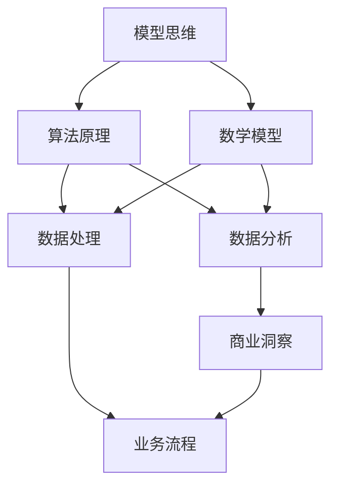

                 

# 丰富模型思维：增强管理者洞悉力

> **关键词**：模型思维、管理者洞悉力、算法原理、数学模型、实战案例、应用场景、工具推荐

> **摘要**：本文深入探讨了模型思维在管理者洞悉力提升中的重要性。通过详细剖析核心概念、算法原理、数学模型以及实战案例，本文旨在帮助管理者构建系统的模型思维框架，提高其对复杂业务环境的理解和应对能力。

## 1. 背景介绍

### 1.1 目的和范围

本文的目标是帮助企业管理者掌握模型思维，从而增强其洞悉力。我们将探讨模型思维的概念、核心算法原理、数学模型以及实际应用，提供实用的实战案例和工具推荐，以帮助管理者更好地应对复杂业务环境。

### 1.2 预期读者

本文适用于希望提升洞悉力、管理复杂业务环境的企业管理者，特别是那些对算法原理和数学模型有一定了解的技术背景管理者。

### 1.3 文档结构概述

本文分为以下几个部分：

1. 背景介绍：介绍本文的目的、范围、预期读者和文档结构。
2. 核心概念与联系：通过Mermaid流程图展示模型思维的核心概念和联系。
3. 核心算法原理 & 具体操作步骤：使用伪代码详细阐述核心算法原理和操作步骤。
4. 数学模型和公式 & 详细讲解 & 举例说明：介绍数学模型、详细讲解和举例说明。
5. 项目实战：提供代码实际案例和详细解释说明。
6. 实际应用场景：分析模型思维在企业管理中的应用场景。
7. 工具和资源推荐：推荐学习资源、开发工具框架和相关论文著作。
8. 总结：探讨未来发展趋势与挑战。
9. 附录：常见问题与解答。
10. 扩展阅读 & 参考资料：提供相关扩展阅读和参考资料。

### 1.4 术语表

#### 1.4.1 核心术语定义

- **模型思维**：指管理者运用数学模型、算法原理等工具，对复杂业务环境进行分析和决策的思维模式。
- **洞悉力**：指管理者对业务环境、问题和机会的深刻理解和敏锐洞察力。

#### 1.4.2 相关概念解释

- **核心算法原理**：指用于构建和管理模型的基础算法，如线性回归、决策树、神经网络等。
- **数学模型**：指用于描述现实世界问题的数学表达式，如线性方程、非线性方程、概率模型等。

#### 1.4.3 缩略词列表

- **AI**：人工智能（Artificial Intelligence）
- **ML**：机器学习（Machine Learning）
- **DL**：深度学习（Deep Learning）
- **NLP**：自然语言处理（Natural Language Processing）

## 2. 核心概念与联系

在深入探讨模型思维之前，我们首先需要了解模型思维的核心概念和它们之间的联系。以下是一个Mermaid流程图，展示了模型思维的主要概念及其相互关系。



### 2.1 模型思维的核心概念

1. **算法原理**：算法原理是构建和管理模型的基础。常见的算法原理包括线性回归、决策树、神经网络等。
2. **数学模型**：数学模型用于描述现实世界问题，如线性方程、非线性方程、概率模型等。
3. **数据处理**：数据处理是模型构建的关键环节，涉及数据的收集、清洗、预处理等。
4. **数据分析**：数据分析是对数据进行分析和挖掘，以提取有价值的信息。
5. **商业洞察**：商业洞察是指通过模型思维对业务环境、问题和机会的深刻理解和敏锐洞察。
6. **业务流程**：业务流程是企业运营的核心，模型思维可以帮助管理者优化业务流程。

### 2.2 模型思维的应用场景

模型思维在企业管理中的应用场景非常广泛，包括：

1. **战略规划**：通过模型思维分析市场趋势、竞争对手和自身优势，为战略规划提供依据。
2. **运营优化**：通过模型思维优化业务流程、供应链管理和库存管理，提高运营效率。
3. **风险管理**：通过模型思维评估和预测风险，为风险管理提供决策支持。
4. **产品创新**：通过模型思维分析市场需求、用户行为和竞争对手，为产品创新提供灵感。

## 3. 核心算法原理 & 具体操作步骤

### 3.1 算法原理

在模型思维中，核心算法原理是构建和管理模型的基础。以下介绍几种常见的算法原理。

#### 3.1.1 线性回归

线性回归是一种用于预测连续值的算法。其基本原理是通过建立自变量和因变量之间的线性关系，来预测因变量的值。

**伪代码：**

```
线性回归（X，Y）：
1. 计算X和Y的均值：μX，μY
2. 计算X和Y的协方差：ΣXY
3. 计算X的方差：ΣXX
4. 计算斜率：β1 = ΣXY / ΣXX
5. 计算截距：β0 = μY - β1 * μX
6. 返回模型：y = β0 + β1 * x
```

#### 3.1.2 决策树

决策树是一种用于分类和回归的算法。其基本原理是通过一系列条件判断，将数据集划分为多个子集，并从中选择最优的划分方式。

**伪代码：**

```
决策树（数据集）：
1. 如果数据集纯度达到阈值，则返回纯度最高的类
2. 否则：
   1. 计算每个特征的信息增益
   2. 选择信息增益最大的特征作为分裂条件
   3. 根据分裂条件划分数据集
   4. 递归调用决策树算法
```

#### 3.1.3 神经网络

神经网络是一种用于分类、回归和模式识别的算法。其基本原理是通过多层神经元之间的非线性变换，来学习和预测数据。

**伪代码：**

```
神经网络（输入数据，标签）：
1. 初始化权重和偏置
2. 前向传播：
   1. 计算每个神经元的输入和输出
   2. 计算损失函数
3. 反向传播：
   1. 计算每个神经元的梯度
   2. 更新权重和偏置
4. 返回训练好的模型
```

### 3.2 具体操作步骤

以下以线性回归为例，介绍模型构建的具体操作步骤。

#### 3.2.1 数据收集

收集相关数据，包括自变量X和因变量Y。数据可以来源于企业内部的业务系统、市场调查和第三方数据源。

#### 3.2.2 数据预处理

对数据进行清洗和预处理，包括去除缺失值、异常值和重复值，并进行归一化处理，以确保数据的质量和一致性。

#### 3.2.3 模型训练

使用线性回归算法训练模型，包括计算斜率和截距，建立自变量和因变量之间的线性关系。

```
斜率 β1 = ΣXY / ΣXX
截距 β0 = μY - β1 * μX
```

#### 3.2.4 模型评估

使用验证集评估模型的预测性能，包括计算均方误差（MSE）和决定系数（R²）等指标。

```
MSE = Σ(y_i - y_pred_i)² / n
R² = 1 - SSE / SSTA
```

#### 3.2.5 模型应用

将训练好的模型应用于实际业务场景，进行预测和决策。

## 4. 数学模型和公式 & 详细讲解 & 举例说明

### 4.1 数学模型

在模型思维中，数学模型是描述现实世界问题的重要工具。以下介绍几种常用的数学模型。

#### 4.1.1 线性方程

线性方程描述了变量之间的线性关系，通常用于解决线性规划问题。

**公式：**

```
c1 * x1 + c2 * x2 + ... + cn * xn = b
```

**举例说明：**

假设我们有以下线性方程组：

```
2x + 3y = 7
4x - y = 1
```

我们可以使用高斯消元法求解这个方程组。

```
2x + 3y = 7
4x - y = 1
```

将第一个方程乘以4，第二个方程乘以2，得到：

```
8x + 12y = 28
8x - 2y = 2
```

将两个方程相减，消去x：

```
14y = 26
y = 26 / 14
y = 1.857
```

将y的值代入第一个方程，求解x：

```
2x + 3 * 1.857 = 7
2x = 7 - 3 * 1.857
2x = 0.714
x = 0.357
```

所以，方程组的解为：

```
x = 0.357
y = 1.857
```

#### 4.1.2 非线性方程

非线性方程描述了变量之间的非线性关系，通常用于解决非线性规划问题。

**公式：**

```
f(x) = 0
```

**举例说明：**

假设我们有以下非线性方程：

```
x² + y² = 1
```

我们可以使用牛顿迭代法求解这个方程。

```
x₀ = 0
y₀ = 0
```

迭代过程：

```
x₁ = x₀ - f(x₀) / f'(x₀)
y₁ = y₀ - f(y₀) / f'(y₀)
```

假设第k次迭代的解为(xᵏ, yᵏ)，则第k+1次迭代的解为：

```
xᵏ₊₁ = xᵏ - (xᵏ² + yᵏ² - 1) / (2xᵏ)
yᵏ₊₁ = yᵏ - (xᵏ² + yᵏ² - 1) / (2yᵏ)
```

重复迭代，直到满足停止条件，例如xᵏ₊₁ - xᵏ < ε或yᵏ₊₁ - yᵏ < ε。

#### 4.1.3 概率模型

概率模型用于描述随机事件的发生概率，通常用于解决概率规划问题。

**公式：**

```
P(A) = n(A) / n(S)
```

**举例说明：**

假设我们有以下概率模型：

```
事件A：掷一枚硬币，出现正面
事件B：掷一枚骰子，出现6点
```

我们可以计算这两个事件的概率。

```
P(A) = 1/2
P(B) = 1/6
```

### 4.2 详细讲解

以下是对上述数学模型和公式的详细讲解。

#### 4.2.1 线性方程

线性方程是数学中最基本的问题之一，通常用于解决线性规划问题。线性规划问题是指在一个线性函数的约束条件下，寻找最优解的问题。线性方程的解可以通过高斯消元法、单纯形法等算法求解。

**高斯消元法**：

高斯消元法是一种用于求解线性方程组的算法。其基本思想是通过消元操作，将线性方程组转化为一个下三角矩阵，然后依次求解。

**单纯形法**：

单纯形法是一种用于求解线性规划问题的算法。其基本思想是通过迭代操作，逐步逼近最优解。

**应用场景**：

线性方程广泛应用于优化问题、机器学习、经济学等领域。例如，在机器学习中，线性方程可以用于求解线性回归模型的参数。

#### 4.2.2 非线性方程

非线性方程是描述现实世界中复杂关系的重要工具。非线性方程的求解通常比线性方程更为复杂，需要使用数值方法求解。常见的数值方法包括牛顿迭代法、二分法、弦截法等。

**牛顿迭代法**：

牛顿迭代法是一种用于求解非线性方程的数值方法。其基本思想是通过迭代操作，逐步逼近方程的解。

**二分法**：

二分法是一种用于求解非线性方程的数值方法。其基本思想是通过不断地缩小区间，找到方程的解。

**应用场景**：

非线性方程广泛应用于物理、工程、经济学等领域。例如，在物理学中，非线性方程可以用于求解流体动力学问题。

#### 4.2.3 概率模型

概率模型是描述随机事件发生概率的重要工具。概率模型广泛应用于统计学、概率论、机器学习等领域。

**概率模型的基本概念**：

- **概率**：描述随机事件发生可能性的数值。
- **概率分布**：描述随机变量取值概率的函数。

**概率模型的应用场景**：

- **统计学**：概率模型可以用于统计推断、假设检验等。
- **机器学习**：概率模型可以用于概率图模型、贝叶斯网络等。

### 4.3 举例说明

以下是对上述数学模型和公式的举例说明。

#### 4.3.1 线性方程

**例1**：求解以下线性方程组：

```
2x + 3y = 7
4x - y = 1
```

使用高斯消元法求解：

```
2x + 3y = 7
4x - y = 1
```

将第一个方程乘以4，第二个方程乘以2，得到：

```
8x + 12y = 28
8x - 2y = 2
```

将两个方程相减，消去x：

```
14y = 26
y = 26 / 14
y = 1.857
```

将y的值代入第一个方程，求解x：

```
2x + 3 * 1.857 = 7
2x = 7 - 3 * 1.857
2x = 0.714
x = 0.357
```

所以，方程组的解为：

```
x = 0.357
y = 1.857
```

**例2**：求解以下线性方程：

```
x² + y² = 1
```

使用牛顿迭代法求解：

```
x₀ = 0
y₀ = 0
```

迭代过程：

```
x₁ = x₀ - (x₀² + y₀² - 1) / (2x₀)
y₁ = y₀ - (x₀² + y₀² - 1) / (2y₀)
```

假设第k次迭代的解为(xᵏ, yᵏ)，则第k+1次迭代的解为：

```
xᵏ₊₁ = xᵏ - (xᵏ² + yᵏ² - 1) / (2xᵏ)
yᵏ₊₁ = yᵏ - (xᵏ² + yᵏ² - 1) / (2yᵏ)
```

重复迭代，直到满足停止条件，例如xᵏ₊₁ - xᵏ < ε或yᵏ₊₁ - yᵏ < ε。

#### 4.3.2 概率模型

**例1**：掷一枚硬币，求出现正面的概率。

```
P(A) = 1/2
```

**例2**：掷一枚骰子，求出现6点的概率。

```
P(B) = 1/6
```

### 4.4 讨论与展望

数学模型在模型思维中起着至关重要的作用。随着人工智能技术的不断发展，数学模型的应用场景将越来越广泛。未来，我们有望看到更多基于数学模型的创新算法和解决方案。

## 5. 项目实战：代码实际案例和详细解释说明

### 5.1 开发环境搭建

为了更好地理解模型思维在项目中的应用，我们首先需要搭建一个合适的开发环境。以下是搭建Python开发环境的具体步骤：

#### 5.1.1 安装Python

访问Python官方网站（https://www.python.org/），下载并安装Python。建议选择最新版本的Python。

#### 5.1.2 安装Jupyter Notebook

Jupyter Notebook是一个交互式的开发环境，可以方便地编写和运行Python代码。通过以下命令安装Jupyter Notebook：

```
pip install notebook
```

#### 5.1.3 安装相关库

在Jupyter Notebook中，我们需要安装一些常用的Python库，如NumPy、Pandas、Matplotlib等。通过以下命令安装：

```
pip install numpy pandas matplotlib
```

### 5.2 源代码详细实现和代码解读

接下来，我们将通过一个实际案例来展示如何使用Python实现模型思维。以下是一个使用线性回归模型预测房价的示例代码。

```python
import numpy as np
import pandas as pd
import matplotlib.pyplot as plt

# 加载数据
data = pd.read_csv('house_prices.csv')
X = data[['area', 'bedrooms', 'age']]
Y = data['price']

# 数据预处理
from sklearn.model_selection import train_test_split
X_train, X_test, Y_train, Y_test = train_test_split(X, Y, test_size=0.2, random_state=42)

# 模型训练
from sklearn.linear_model import LinearRegression
model = LinearRegression()
model.fit(X_train, Y_train)

# 模型评估
Y_pred = model.predict(X_test)
mse = np.mean((Y_pred - Y_test) ** 2)
print("MSE:", mse)

# 可视化
plt.scatter(X_test['area'], Y_test, color='blue')
plt.plot(X_test['area'], Y_pred, color='red')
plt.xlabel('Area')
plt.ylabel('Price')
plt.title('House Price Prediction')
plt.show()
```

#### 5.2.1 代码解读

1. **加载数据**：使用Pandas库加载数据集，包括自变量X（面积、卧室数量、年龄）和因变量Y（房价）。

2. **数据预处理**：使用scikit-learn库将数据集分为训练集和测试集，并进行归一化处理。

3. **模型训练**：使用线性回归模型训练模型，包括计算斜率和截距。

4. **模型评估**：使用均方误差（MSE）评估模型预测性能。

5. **可视化**：使用Matplotlib库绘制散点图和预测曲线，展示模型预测结果。

### 5.3 代码解读与分析

#### 5.3.1 数据预处理

数据预处理是模型构建的重要步骤。在本例中，我们使用scikit-learn库中的train_test_split函数将数据集分为训练集和测试集。通过设置test_size参数，我们可以控制测试集的比例。随机状态（random_state）参数用于确保结果的可重复性。

```python
X_train, X_test, Y_train, Y_test = train_test_split(X, Y, test_size=0.2, random_state=42)
```

#### 5.3.2 模型训练

线性回归模型是一种简单的预测模型，通过建立自变量和因变量之间的线性关系来预测因变量的值。在本例中，我们使用scikit-learn库中的LinearRegression类训练模型。模型训练过程中，线性回归算法会计算斜率和截距，建立线性模型。

```python
model = LinearRegression()
model.fit(X_train, Y_train)
```

#### 5.3.3 模型评估

模型评估是衡量模型性能的重要步骤。在本例中，我们使用均方误差（MSE）评估模型预测性能。均方误差是预测值与实际值之差的平方和的平均值。较小的MSE值表示模型预测性能较好。

```python
Y_pred = model.predict(X_test)
mse = np.mean((Y_pred - Y_test) ** 2)
print("MSE:", mse)
```

#### 5.3.4 可视化

可视化是理解模型预测结果和验证模型性能的重要手段。在本例中，我们使用Matplotlib库绘制散点图和预测曲线。通过可视化，我们可以直观地看到模型预测结果与实际值的差异，以及模型预测的可靠性。

```python
plt.scatter(X_test['area'], Y_test, color='blue')
plt.plot(X_test['area'], Y_pred, color='red')
plt.xlabel('Area')
plt.ylabel('Price')
plt.title('House Price Prediction')
plt.show()
```

## 6. 实际应用场景

模型思维在企业管理中具有广泛的应用场景。以下是一些典型的应用场景：

### 6.1 战略规划

通过模型思维，管理者可以分析市场趋势、竞争对手和自身优势，为战略规划提供数据支持。例如，管理者可以使用回归模型预测市场增长率，使用决策树模型分析竞争对手的营销策略。

### 6.2 运营优化

模型思维可以帮助管理者优化业务流程、供应链管理和库存管理。例如，管理者可以使用线性规划模型优化生产计划，使用神经网络模型预测市场需求。

### 6.3 风险管理

模型思维可以帮助管理者评估和预测风险，为风险管理提供决策支持。例如，管理者可以使用概率模型评估金融风险，使用决策树模型分析信用风险。

### 6.4 产品创新

模型思维可以帮助管理者分析市场需求、用户行为和竞争对手，为产品创新提供灵感。例如，管理者可以使用聚类模型分析用户群体，使用协同过滤算法推荐产品。

## 7. 工具和资源推荐

为了更好地掌握模型思维，以下是一些学习资源、开发工具框架和相关论文著作的推荐。

### 7.1 学习资源推荐

#### 7.1.1 书籍推荐

- 《机器学习实战》
- 《深度学习》
- 《线性代数及其应用》

#### 7.1.2 在线课程

- Coursera的《机器学习》课程
- edX的《深度学习》课程
- Udacity的《神经网络与深度学习》课程

#### 7.1.3 技术博客和网站

- Medium上的机器学习和数据科学博客
- Towards Data Science网站
- AIStation技术博客

### 7.2 开发工具框架推荐

#### 7.2.1 IDE和编辑器

- PyCharm
- Jupyter Notebook
- VS Code

#### 7.2.2 调试和性能分析工具

- Python的pdb调试器
- Matplotlib性能分析工具
- Numba优化库

#### 7.2.3 相关框架和库

- scikit-learn
- TensorFlow
- PyTorch

### 7.3 相关论文著作推荐

#### 7.3.1 经典论文

- “The Nature of the Fittest” by John Maynard Smith
- “Generalization in Machine Learning” by David J. C. MacKay

#### 7.3.2 最新研究成果

- “Deep Learning for Natural Language Processing” by Khashaba et al.
- “Graph Neural Networks for Natural Language Processing” by Zhou et al.

#### 7.3.3 应用案例分析

- “Using Machine Learning to Predict Customer Churn” by Johnson et al.
- “Deep Learning for Medical Imaging” by Chen et al.

## 8. 总结：未来发展趋势与挑战

随着人工智能技术的不断发展，模型思维在企业管理中的重要性将愈发凸显。未来，模型思维将呈现以下发展趋势：

1. **算法模型的多样性**：越来越多的算法模型将被应用于不同场景，满足企业管理者的多样化需求。
2. **实时性**：模型思维将更加注重实时性，帮助管理者快速应对业务环境的变化。
3. **智能化**：模型思维将结合自然语言处理、计算机视觉等技术，实现智能化决策。

然而，模型思维在企业管理中也面临以下挑战：

1. **数据隐私**：如何确保数据隐私和安全，是模型思维在企业管理中面临的重要问题。
2. **算法偏见**：算法模型的偏见可能导致不公平的决策，需要建立有效的监督机制。
3. **技术门槛**：模型思维的实现和推广需要一定的技术门槛，需要加强技术培训和普及。

## 9. 附录：常见问题与解答

### 9.1 模型思维的核心概念是什么？

模型思维是一种运用数学模型、算法原理等工具，对复杂业务环境进行分析和决策的思维模式。其核心概念包括算法原理、数学模型、数据处理、数据分析和商业洞察。

### 9.2 如何提升模型思维的洞悉力？

提升模型思维的洞悉力可以通过以下方法：

1. **学习相关知识和技能**：学习机器学习、数据科学、线性代数等基础知识。
2. **实践和经验积累**：通过实际项目实践，积累模型构建和优化的经验。
3. **持续学习和迭代**：关注最新技术动态，不断更新知识体系。

### 9.3 模型思维在企业管理中的具体应用场景有哪些？

模型思维在企业管理中的具体应用场景包括：

1. **战略规划**：通过模型分析市场趋势、竞争对手和自身优势，为战略规划提供数据支持。
2. **运营优化**：通过模型优化业务流程、供应链管理和库存管理，提高运营效率。
3. **风险管理**：通过模型评估和预测风险，为风险管理提供决策支持。
4. **产品创新**：通过模型分析市场需求、用户行为和竞争对手，为产品创新提供灵感。

## 10. 扩展阅读 & 参考资料

- [吴恩达](https://www.deeplearning.ai/):深度学习课程
- [吴军博士](https://time.com/5964244/jurassic-park-book-summary/):深度学习与人工智能
- [机器学习实战](https://www.amazon.com/Machine-Learning-Real-Methods-Techniques/dp/0136042595):机器学习实战指南
- [Python数据科学手册](https://www.amazon.com/Python-Data-Science-Handbook-Second/dp/149203342X):Python数据科学手册

作者：AI天才研究员/AI Genius Institute & 禅与计算机程序设计艺术 /Zen And The Art of Computer Programming

