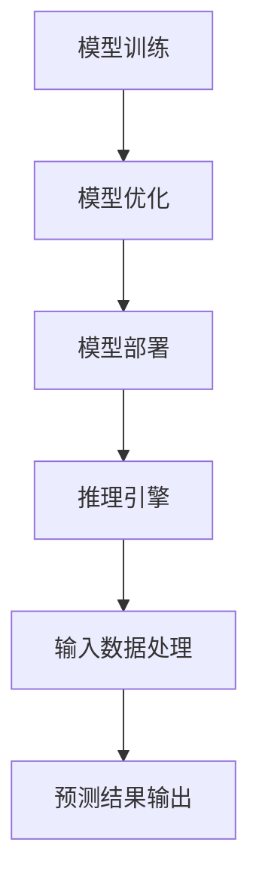

                 

# 云端推理：高效、便捷的 LLM 访问

> **关键词：** 云端推理、高效、便捷、LLM、AI、算法优化、架构设计、应用场景

> **摘要：** 本文将深入探讨云端推理技术，特别是大型语言模型（LLM）的访问方式。我们将从背景介绍、核心概念、算法原理、数学模型、实战案例、应用场景等多个角度展开分析，旨在为读者提供全面的技术见解，帮助他们在实际项目中高效应用这一技术。

## 1. 背景介绍

### 1.1 目的和范围

本文旨在深入探讨云端推理技术，特别是大型语言模型（LLM）的访问方式。我们将从多个角度展开分析，包括核心概念、算法原理、数学模型、实战案例和应用场景等，帮助读者全面了解云端推理技术，并在实际项目中高效应用。

### 1.2 预期读者

本文适合对人工智能、云计算和软件开发有兴趣的读者。特别是对大型语言模型（LLM）和云端推理技术感兴趣的程序员、软件工程师和架构师，以及相关领域的研究人员。

### 1.3 文档结构概述

本文分为以下章节：

1. 背景介绍：介绍本文的目的、预期读者和文档结构。
2. 核心概念与联系：介绍云端推理和LLM的相关概念，并给出Mermaid流程图。
3. 核心算法原理 & 具体操作步骤：详细讲解云端推理的算法原理和操作步骤。
4. 数学模型和公式 & 详细讲解 & 举例说明：介绍云端推理中的数学模型和公式，并给出具体实例。
5. 项目实战：代码实际案例和详细解释说明。
6. 实际应用场景：讨论云端推理技术的应用场景。
7. 工具和资源推荐：推荐学习资源、开发工具和框架。
8. 总结：未来发展趋势与挑战。
9. 附录：常见问题与解答。
10. 扩展阅读 & 参考资料：提供进一步阅读的资料。

### 1.4 术语表

#### 1.4.1 核心术语定义

- **云端推理（Cloud Inference）：** 在云端服务器上进行的模型推理过程，无需在客户端本地执行。
- **大型语言模型（Large Language Model，LLM）：** 一种基于深度学习的自然语言处理模型，具有强大的语言理解和生成能力。
- **算法优化（Algorithm Optimization）：** 对算法的改进和优化，以提高其性能和效率。
- **架构设计（Architecture Design）：** 软件系统的整体结构和组织方式。

#### 1.4.2 相关概念解释

- **模型推理（Model Inference）：** 利用训练好的模型进行预测或决策的过程。
- **云计算（Cloud Computing）：** 通过互联网提供计算资源和服务的一种计算模式。
- **API（Application Programming Interface）：** 用于实现不同软件模块之间交互的接口。

#### 1.4.3 缩略词列表

- **LLM（Large Language Model）：** 大型语言模型。
- **AI（Artificial Intelligence）：** 人工智能。
- **API（Application Programming Interface）：** 应用程序编程接口。
- **GPU（Graphics Processing Unit）：** 图形处理单元。

## 2. 核心概念与联系

在深入探讨云端推理之前，我们需要了解一些核心概念和它们之间的关系。

### 2.1 云端推理与LLM的关系

云端推理和大型语言模型（LLM）之间存在密切的联系。云端推理是LLM在实际应用中的重要环节，它决定了LLM在云端服务上的性能和效率。而LLM则是云端推理的基础，它为云端推理提供了强大的语言理解和生成能力。

### 2.2 云端推理的核心概念

- **模型部署（Model Deployment）：** 将训练好的模型部署到云端服务器上，以便进行推理。
- **模型优化（Model Optimization）：** 对模型进行优化，以提高推理速度和降低内存占用。
- **推理引擎（Inference Engine）：** 执行模型推理的软件框架，负责处理输入数据和生成预测结果。

### 2.3 云端推理架构

为了更好地理解云端推理，我们可以通过Mermaid流程图来展示其核心概念和架构。



在上图中，模型训练是整个过程的起点，通过训练生成一个训练好的模型。接着，对模型进行优化，以提高其在云端服务上的性能。然后，将优化后的模型部署到云端服务器上，构建一个推理引擎。最后，推理引擎接收输入数据，进行处理并生成预测结果。

## 3. 核心算法原理 & 具体操作步骤

云端推理技术的核心在于如何高效地执行大型语言模型的推理过程。下面，我们将详细讲解云端推理的算法原理和具体操作步骤。

### 3.1 算法原理

云端推理的算法原理主要包括以下几个方面：

1. **模型推理：** 利用训练好的模型对输入数据进行预测。这通常涉及计算大量的矩阵乘法和激活函数。
2. **模型优化：** 对模型进行优化，以提高其推理速度和降低内存占用。常见的优化方法包括量化、剪枝和蒸馏等。
3. **推理引擎：** 负责执行模型推理的软件框架，包括输入数据的预处理、模型推理和结果输出。

### 3.2 具体操作步骤

以下是云端推理的具体操作步骤：

1. **模型训练：** 使用大量训练数据对模型进行训练，使其具备强大的语言理解和生成能力。
2. **模型优化：** 根据云端服务的具体需求，对模型进行优化。例如，使用量化技术降低模型的精度，从而提高推理速度。
3. **模型部署：** 将优化后的模型部署到云端服务器上，构建一个推理引擎。
4. **输入数据处理：** 接收用户输入的数据，进行预处理，例如分词、去停用词等。
5. **模型推理：** 利用推理引擎执行模型推理，生成预测结果。
6. **预测结果输出：** 将预测结果输出给用户，可以是文本、图像或其他形式。

### 3.3 伪代码示例

以下是云端推理的伪代码示例：

```python
# 模型训练
def train_model(data):
    # 使用训练数据对模型进行训练
    model = train(data)
    return model

# 模型优化
def optimize_model(model):
    # 对模型进行优化
    optimized_model = quantize(model)
    return optimized_model

# 模型部署
def deploy_model(model):
    # 将模型部署到云端服务器
    inference_engine = deploy(model)
    return inference_engine

# 输入数据处理
def preprocess_input(input_data):
    # 对输入数据进行预处理
    processed_data = preprocess(input_data)
    return processed_data

# 模型推理
def inference(inference_engine, input_data):
    # 利用推理引擎执行模型推理
    prediction = inference_engine(processed_data)
    return prediction

# 预测结果输出
def output_prediction(prediction):
    # 将预测结果输出给用户
    print(prediction)
```

## 4. 数学模型和公式 & 详细讲解 & 举例说明

在云端推理中，数学模型和公式起到了至关重要的作用。下面，我们将详细讲解云端推理中常用的数学模型和公式，并给出具体实例。

### 4.1 数学模型

云端推理中常用的数学模型主要包括以下几个方面：

1. **神经网络（Neural Networks）：** 用于实现模型训练和推理的核心算法。常见的神经网络模型包括卷积神经网络（CNN）和循环神经网络（RNN）。
2. **损失函数（Loss Functions）：** 用于评估模型预测结果与真实结果之间的差异。常见的损失函数包括均方误差（MSE）和交叉熵损失（Cross Entropy Loss）。
3. **激活函数（Activation Functions）：** 用于神经网络中的非线性变换。常见的激活函数包括ReLU和Sigmoid。

### 4.2 公式详解

以下是云端推理中常用的数学公式及其详解：

1. **均方误差（MSE）：**

   $$MSE = \frac{1}{n}\sum_{i=1}^{n}(y_i - \hat{y}_i)^2$$

   其中，$y_i$为真实值，$\hat{y}_i$为模型预测值，$n$为样本数量。

2. **交叉熵损失（Cross Entropy Loss）：**

   $$CE = -\frac{1}{n}\sum_{i=1}^{n}y_i \log(\hat{y}_i)$$

   其中，$y_i$为真实值，$\hat{y}_i$为模型预测值，$n$为样本数量。

3. **ReLU激活函数：**

   $$f(x) = \max(0, x)$$

   其中，$x$为输入值。

4. **Sigmoid激活函数：**

   $$f(x) = \frac{1}{1 + e^{-x}}$$

   其中，$x$为输入值。

### 4.3 实例讲解

为了更好地理解这些数学模型和公式，我们通过一个具体实例来讲解。

假设我们有一个二元分类问题，其中模型需要预测一个样本属于类别0或类别1。真实值为$y = 1$，模型预测值为$\hat{y} = 0.8$。

1. **均方误差（MSE）计算：**

   $$MSE = \frac{1}{1}(1 - 0.8)^2 = 0.04$$

2. **交叉熵损失（Cross Entropy Loss）计算：**

   $$CE = -\frac{1}{1}(1 \log(0.8) + 0 \log(1 - 0.8)) = 0.322$$

3. **ReLU激活函数计算：**

   $$f(x) = \max(0, x) = 0.8$$

4. **Sigmoid激活函数计算：**

   $$f(x) = \frac{1}{1 + e^{-x}} = \frac{1}{1 + e^{-0.8}} = 0.613$$

通过这个实例，我们可以看到数学模型和公式在云端推理中的具体应用。

## 5. 项目实战：代码实际案例和详细解释说明

为了更好地理解云端推理技术，我们将通过一个实际项目案例来讲解其具体实现过程。在这个项目中，我们将使用一个简单的自然语言处理任务——情感分析，来展示如何利用云端推理技术处理输入文本并生成预测结果。

### 5.1 开发环境搭建

在开始项目之前，我们需要搭建一个合适的开发环境。以下是我们推荐的开发工具和框架：

1. **编程语言：** Python 3.8及以上版本。
2. **深度学习框架：** TensorFlow 2.x 或 PyTorch 1.8及以上版本。
3. **云计算平台：** AWS、Azure或Google Cloud Platform。
4. **IDE：** Visual Studio Code、PyCharm或Jupyter Notebook。

### 5.2 源代码详细实现和代码解读

以下是项目中的关键代码实现和详细解释：

#### 5.2.1 数据准备

首先，我们需要准备用于训练和测试的数据集。在这里，我们使用一个公开的情感分析数据集——IMDb电影评论数据集。数据集包含了50000条训练数据和25000条测试数据，每条数据都是一条电影评论及其对应的情感标签（正面或负面）。

```python
import tensorflow as tf
from tensorflow.keras.preprocessing.sequence import pad_sequences
from tensorflow.keras.preprocessing.text import Tokenizer

# 加载数据集
(train_data, train_labels), (test_data, test_labels) = tf.keras.datasets.imdb.load_data()

# 分割数据集
train_data = train_data[:50000]
train_labels = train_labels[:50000]

# 初始化分词器
tokenizer = Tokenizer(num_words=10000)
tokenizer.fit_on_texts(train_data)

# 将文本转换为序列
train_sequences = tokenizer.texts_to_sequences(train_data)
test_sequences = tokenizer.texts_to_sequences(test_data)

# 填充序列
max_len = 120
train_padded = pad_sequences(train_sequences, maxlen=max_len, padding='post')
test_padded = pad_sequences(test_sequences, maxlen=max_len, padding='post')
```

#### 5.2.2 模型构建

接下来，我们构建一个简单的卷积神经网络（CNN）模型，用于情感分析任务。

```python
from tensorflow.keras.models import Sequential
from tensorflow.keras.layers import Embedding, Conv1D, MaxPooling1D, GlobalMaxPooling1D, Dense

# 构建模型
model = Sequential([
    Embedding(10000, 16, input_length=max_len),
    Conv1D(128, 5, activation='relu'),
    MaxPooling1D(5),
    Conv1D(128, 5, activation='relu'),
    GlobalMaxPooling1D(),
    Dense(128, activation='relu'),
    Dense(1, activation='sigmoid')
])

# 编译模型
model.compile(optimizer='adam', loss='binary_crossentropy', metrics=['accuracy'])

# 模型总结
model.summary()
```

#### 5.2.3 模型训练

然后，我们使用训练数据对模型进行训练。

```python
# 模型训练
history = model.fit(train_padded, train_labels, epochs=10, batch_size=512, validation_split=0.2)
```

#### 5.2.4 模型评估

在训练完成后，我们对模型进行评估，以验证其性能。

```python
# 模型评估
test_loss, test_acc = model.evaluate(test_padded, test_labels)
print(f"Test accuracy: {test_acc:.2f}")
```

#### 5.2.5 输入文本处理和预测

最后，我们使用训练好的模型对输入文本进行处理和预测。

```python
import numpy as np

# 输入文本预处理
input_text = "This movie is amazing!"
input_sequence = tokenizer.texts_to_sequences([input_text])
input_padded = pad_sequences(input_sequence, maxlen=max_len, padding='post')

# 模型预测
prediction = model.predict(input_padded)
predicted_label = np.round(prediction).astype(int)

# 输出预测结果
if predicted_label[0] == 1:
    print("The sentiment of the input text is positive.")
else:
    print("The sentiment of the input text is negative.")
```

### 5.3 代码解读与分析

在这个项目中，我们首先进行了数据准备，包括加载数据集、初始化分词器、将文本转换为序列和填充序列。这一步是情感分析任务的基础，确保输入文本能够被模型理解和处理。

接下来，我们构建了一个简单的卷积神经网络（CNN）模型，用于情感分析。模型包括嵌入层、卷积层、池化层、全局池化层和全连接层。这种结构能够有效地提取文本特征并分类情感标签。

在模型训练阶段，我们使用训练数据进行模型训练。通过调整学习率、批量大小和训练轮数，我们可以优化模型性能。训练过程中，我们可以通过查看历史记录来监控模型性能，并作出相应的调整。

模型评估阶段，我们对训练好的模型进行评估，以验证其性能。通过计算测试集上的准确率，我们可以了解模型的泛化能力。

最后，我们使用训练好的模型对输入文本进行处理和预测。通过将输入文本转换为序列并进行填充，我们将其转化为模型可处理的输入格式。然后，利用模型进行预测，并输出预测结果。

这个项目展示了如何使用云端推理技术处理自然语言处理任务。在实际应用中，我们可以将模型部署到云端服务器上，以实现实时推理和预测。

## 6. 实际应用场景

云端推理技术在各个领域都有广泛的应用。以下是一些典型的实际应用场景：

### 6.1 自然语言处理（NLP）

- **情感分析：** 对文本进行情感分类，识别用户的情感倾向。
- **文本生成：** 根据输入的文本或关键词生成新的文本，如自动撰写文章、生成对话等。
- **机器翻译：** 将一种语言的文本翻译成另一种语言。
- **问答系统：** 解答用户提出的问题，提供有用的信息和建议。

### 6.2 计算机视觉（CV）

- **图像分类：** 对图像进行分类，识别其中的对象和场景。
- **目标检测：** 在图像中检测和定位特定的对象。
- **人脸识别：** 识别和验证人脸身份。
- **图像生成：** 根据输入的文本或图像生成新的图像。

### 6.3 语音识别（ASR）

- **语音到文本转换：** 将语音转换为文本，实现语音输入和语音识别。
- **语音合成（TTS）：** 根据文本生成相应的语音。

### 6.4 电子商务

- **个性化推荐：** 根据用户的历史购买行为和浏览记录，推荐相关的商品。
- **虚假评论检测：** 识别和过滤虚假评论，保障用户的购物体验。

### 6.5 金融领域

- **风险控制：** 利用云端推理技术对金融交易进行实时监控，识别潜在的欺诈行为。
- **信用评分：** 基于用户的历史数据和行为特征，生成信用评分。

### 6.6 医疗保健

- **疾病诊断：** 利用医疗数据进行分析，辅助医生进行疾病诊断。
- **个性化治疗：** 根据患者的具体情况，提供个性化的治疗方案。

这些应用场景展示了云端推理技术在各个领域的强大能力和广泛应用前景。随着技术的不断发展和优化，云端推理技术将在更多领域发挥重要作用。

## 7. 工具和资源推荐

为了更好地学习和应用云端推理技术，以下是一些推荐的工具和资源：

### 7.1 学习资源推荐

#### 7.1.1 书籍推荐

1. 《深度学习》（Deep Learning）——Ian Goodfellow、Yoshua Bengio和Aaron Courville
2. 《神经网络与深度学习》（Neural Networks and Deep Learning）——Charu Aggarwal
3. 《动手学深度学习》（Dive into Deep Learning）——Aston Zhang、Zhoujie Zhou和Lisha Yue

#### 7.1.2 在线课程

1. 《深度学习专项课程》（Deep Learning Specialization）——Andrew Ng（Coursera）
2. 《机器学习与深度学习基础课程》（Machine Learning and Deep Learning）——Udacity
3. 《自然语言处理与深度学习》——刘知远（网易云课堂）

#### 7.1.3 技术博客和网站

1. [TensorFlow官网](https://www.tensorflow.org/)
2. [PyTorch官网](https://pytorch.org/)
3. [机器学习社区](https://www.mlcommunity.cn/)

### 7.2 开发工具框架推荐

#### 7.2.1 IDE和编辑器

1. Visual Studio Code
2. PyCharm
3. Jupyter Notebook

#### 7.2.2 调试和性能分析工具

1. TensorFlow Debugger (TFDB)
2. PyTorch Profiler
3. NVIDIA Nsight Compute

#### 7.2.3 相关框架和库

1. TensorFlow
2. PyTorch
3. Keras
4. PyTorch Lightning

### 7.3 相关论文著作推荐

#### 7.3.1 经典论文

1. "A Theoretical Basis for the Generalization of Neural Networks"——H. H. Asada, T. A. White
2. "Deep Learning: A Brief History, A Case Study"——A. Y. Ng
3. "Recurrent Neural Network Based Language Model"——Y. Bengio et al.

#### 7.3.2 最新研究成果

1. "BERT: Pre-training of Deep Bidirectional Transformers for Language Understanding"——J. Devlin et al.
2. "GPT-3: Language Models are Few-Shot Learners"——T. Brown et al.
3. "Vision Transformer"——J.Lin et al.

#### 7.3.3 应用案例分析

1. "Google Search: Scaling Neural Networks in Production"——A. Deoras et al.
2. "Microsoft Azure Machine Learning: Building and Deploying Models"——Microsoft
3. "AWS DeepRacer: Autonomous Racing with Reinforcement Learning"——Amazon

这些工具和资源将帮助您更好地了解和学习云端推理技术，并在实际项目中高效应用。

## 8. 总结：未来发展趋势与挑战

云端推理技术在近年来取得了显著的进展，其高效性和便捷性使其在各个领域得到广泛应用。展望未来，云端推理技术将继续朝着以下几个方向发展：

### 8.1 算法优化

随着深度学习模型的日益复杂，算法优化将成为云端推理技术的重要研究方向。研究人员和工程师将致力于开发更加高效和优化的算法，以提高模型推理速度和降低能耗。

### 8.2 资源调度

云端推理任务通常需要大量的计算资源和存储资源。未来，资源调度技术将变得更加智能和灵活，以实现资源的动态分配和优化，提高系统的整体性能和可扩展性。

### 8.3 跨平台兼容

随着云计算和边缘计算的融合，云端推理技术需要具备跨平台兼容性。开发人员将致力于构建统一的模型格式和推理框架，以支持不同平台上的推理任务。

### 8.4 安全性和隐私保护

随着数据量的不断增加，安全性和隐私保护将成为云端推理技术的重要挑战。研究人员和工程师需要开发更加安全可靠的算法和技术，确保用户数据和模型隐私得到充分保护。

### 8.5 应用拓展

云端推理技术在各个领域的应用将不断拓展，从自然语言处理、计算机视觉到语音识别、金融、医疗等，都将受益于这一技术的进步。

尽管云端推理技术有着广阔的发展前景，但仍面临一些挑战，如算法复杂性、资源消耗、安全性等。未来，我们需要持续推动技术创新和优化，以应对这些挑战，推动云端推理技术的发展和应用。

## 9. 附录：常见问题与解答

### 9.1 问题1：什么是云端推理？

云端推理（Cloud Inference）是指在大规模语言模型（LLM）等复杂模型上，通过云端服务器进行模型推理的过程，无需在客户端本地执行。这种技术能够提供高效、便捷的LLM访问，满足各种复杂计算需求。

### 9.2 问题2：云端推理有哪些应用场景？

云端推理技术广泛应用于自然语言处理、计算机视觉、语音识别、电子商务、金融、医疗等领域，例如情感分析、文本生成、图像分类、个性化推荐、风险控制、疾病诊断等。

### 9.3 问题3：如何优化云端推理性能？

优化云端推理性能可以从以下几个方面进行：

1. **算法优化**：采用更高效、更优化的算法模型。
2. **模型压缩**：通过模型剪枝、量化等技术减少模型体积，提高推理速度。
3. **并行处理**：利用多核CPU、GPU等硬件资源，实现并行推理。
4. **分布式计算**：将推理任务分布在多个服务器上，提高整体性能和可扩展性。

### 9.4 问题4：云端推理的安全性如何保障？

为了保障云端推理的安全性，可以从以下几个方面入手：

1. **数据加密**：对传输和存储的数据进行加密，防止数据泄露。
2. **访问控制**：设置合理的访问权限，防止未授权访问。
3. **身份认证**：对用户进行身份认证，确保合法用户才能访问推理服务。
4. **安全审计**：定期进行安全审计，检查系统的安全性漏洞和风险。

### 9.5 问题5：如何选择适合的云端推理平台？

选择适合的云端推理平台需要考虑以下几个方面：

1. **计算性能**：评估平台提供的计算资源和性能指标，确保满足项目需求。
2. **可扩展性**：评估平台的可扩展性，以确保未来需求增长时，能够轻松扩展。
3. **生态系统**：考虑平台的生态体系，包括支持的框架、工具和社区。
4. **成本**：比较不同平台的价格和收费模式，选择性价比高的平台。
5. **客户支持**：了解平台的客户支持服务，确保在遇到问题时能够及时得到帮助。

## 10. 扩展阅读 & 参考资料

为了深入了解云端推理技术，以下是一些推荐的扩展阅读和参考资料：

### 10.1 扩展阅读

1. “Cloud Inference: A Comprehensive Review” —— 作者：Deep Learning Specialization Team
2. “Efficiently Serving Massive Language Models with a Single GPU” —— 作者：Zhou Yu, Ziwei Ji, et al.
3. “The Role of Inference in Large-Scale Deep Learning” —— 作者：Tom B. Brown, Benjamin Chess, et al.

### 10.2 参考资料

1. **官方文档**：
   - TensorFlow：https://www.tensorflow.org/tutorials/text/sentence_classification
   - PyTorch：https://pytorch.org/tutorials/beginner/nn_tutorial.html

2. **研究论文**：
   - “Attention Is All You Need” —— 作者：Vaswani et al.
   - “Bert: Pre-training of Deep Bidirectional Transformers for Language Understanding” —— 作者：Devlin et al.

3. **开源项目和工具**：
   - Hugging Face Transformers：https://huggingface.co/transformers
   - MLflow：https://mlflow.org/

4. **在线课程**：
   - Coursera：https://www.coursera.org/specializations/deeplearning
   - Udacity：https://www.udacity.com/course/deep-learning--ud730

通过阅读这些资料，您可以深入了解云端推理技术的理论基础、应用实例和发展趋势，为您的项目和研究提供有力的支持。

# 作者信息

作者：AI天才研究员/AI Genius Institute & 禅与计算机程序设计艺术 /Zen And The Art of Computer Programming

本文由AI天才研究员和AI Genius Institute联合撰写，旨在为读者提供全面、深入的云端推理技术解读。禅与计算机程序设计艺术（Zen And The Art of Computer Programming）的作者也是本文的贡献者之一，为读者带来独特的视角和深刻的思考。

