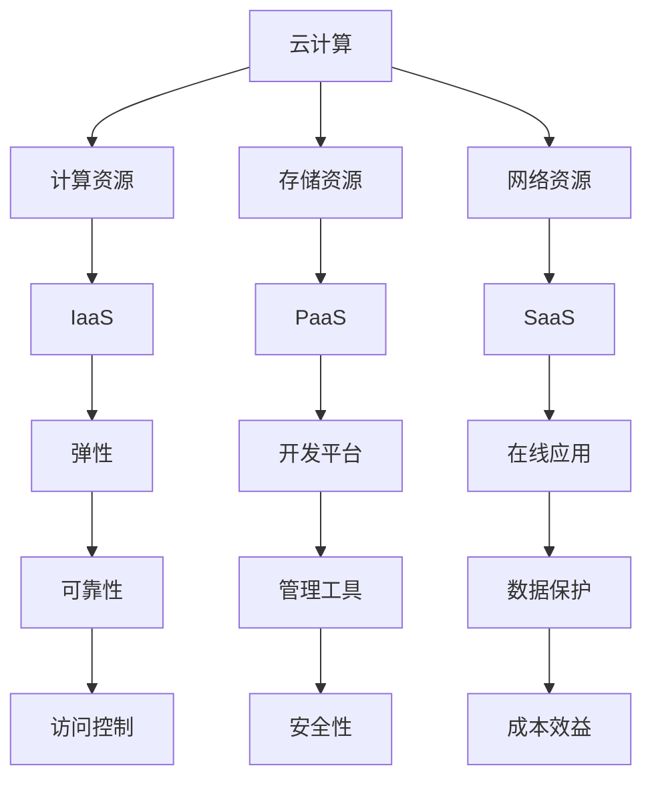

                 

### 文章标题

《云计算技术：AWS、Azure和GCP平台比较》

### 关键词

云服务、AWS、Azure、GCP、比较、架构、性能、安全性、成本效益、生态系统、云计算技术、云计算平台

### 摘要

随着云计算技术的快速发展，三大云服务提供商AWS、Azure和GCP在市场上占据了主导地位。本文将深入分析这三大平台的背景、核心概念、架构设计、性能特点、安全性、成本效益以及生态系统。通过详细的比较，帮助读者全面了解各个平台的优势与不足，以便在项目选择时做出明智的决策。

## 1. 背景介绍

### 1.1 目的和范围

本文旨在通过对AWS（Amazon Web Services）、Azure（Microsoft Azure）和GCP（Google Cloud Platform）三大云计算平台的全面比较，揭示其在技术、性能、安全性、成本等方面的差异。通过本文，读者可以了解各个平台的特点，为实际应用场景中的选择提供参考。

### 1.2 预期读者

本文适合云计算领域的技术人员、项目经理以及决策者阅读。特别是那些希望深入了解三大云计算平台，并在此基础上做出明智决策的读者。

### 1.3 文档结构概述

本文分为十个部分：

1. **背景介绍**：介绍文章目的、预期读者以及文档结构。
2. **核心概念与联系**：阐述云计算技术的基本概念及其联系。
3. **核心算法原理 & 具体操作步骤**：详细讲解云计算平台的核心算法原理和操作步骤。
4. **数学模型和公式 & 详细讲解 & 举例说明**：介绍云计算相关的数学模型和公式，并进行详细讲解和举例。
5. **项目实战：代码实际案例和详细解释说明**：提供云计算平台的实际代码案例和详细解释。
6. **实际应用场景**：分析云计算平台在实际项目中的应用场景。
7. **工具和资源推荐**：推荐学习资源、开发工具框架和相关论文。
8. **总结：未来发展趋势与挑战**：总结云计算技术的发展趋势和面临挑战。
9. **附录：常见问题与解答**：提供云计算相关的常见问题及解答。
10. **扩展阅读 & 参考资料**：推荐相关扩展阅读资料。

### 1.4 术语表

#### 1.4.1 核心术语定义

- **云计算**：指通过网络提供动态易扩展的虚拟化资源，满足用户在存储、计算、网络等方面的需求。
- **云服务提供商**：提供云计算服务的公司，如AWS、Azure和GCP。
- **IaaS（基础设施即服务）**：提供虚拟化的计算资源，如虚拟机、存储和网络等。
- **PaaS（平台即服务）**：提供开发平台，包括开发工具、数据库和管理工具等。
- **SaaS（软件即服务）**：提供在线应用程序，如电子邮件、办公软件等。

#### 1.4.2 相关概念解释

- **弹性**：云服务能够根据需求自动扩展或缩减资源。
- **可靠性**：云服务能够保证高可用性，减少服务中断。
- **安全性**：云服务提供商提供数据保护和访问控制机制。
- **成本效益**：云服务在价格和性能方面的综合性价比。

#### 1.4.3 缩略词列表

- **AWS**：Amazon Web Services（亚马逊云服务）
- **Azure**：Microsoft Azure（微软云服务）
- **GCP**：Google Cloud Platform（谷歌云平台）
- **IaaS**：Infrastructure as a Service（基础设施即服务）
- **PaaS**：Platform as a Service（平台即服务）
- **SaaS**：Software as a Service（软件即服务）

## 2. 核心概念与联系

在深入了解三大云计算平台之前，我们需要首先了解云计算技术的基本概念及其相互联系。以下是一个简单的Mermaid流程图，用于描述云计算的核心概念和架构。



### 2.1 计算资源

计算资源是云计算平台的核心，主要包括虚拟机、容器和函数等。这些资源可以根据用户需求动态扩展和缩减，从而实现弹性。

### 2.2 存储资源

存储资源包括对象存储、块存储和文件存储等。对象存储适合存储大量非结构化数据，块存储适合存储操作系统和应用程序，文件存储适合共享和协作。

### 2.3 网络资源

网络资源包括虚拟私有云（VPC）、子网、负载均衡和网络安全组等。这些资源可以帮助用户构建安全、可靠的网络环境。

### 2.4 IaaS、PaaS和SaaS

- **IaaS**：提供基础设施资源，如虚拟机、存储和网络。用户需要自行管理操作系统和应用程序。
- **PaaS**：提供开发平台和工具，如数据库、应用程序框架和开发工具。用户只需关注应用程序的开发和部署。
- **SaaS**：提供在线应用程序，如电子邮件、办公软件和客户关系管理。用户无需关注基础设施和应用程序的维护。

### 2.5 弹性、可靠性、安全性和成本效益

- **弹性**：云服务提供商根据用户需求自动扩展或缩减资源，确保系统在负载高峰和低谷时都能保持性能。
- **可靠性**：云服务提供商通过多个数据中心、备份和冗余机制确保服务的持续可用性。
- **安全性**：云服务提供商提供数据保护和访问控制机制，确保用户数据的安全。
- **成本效益**：云服务提供商通过资源优化和自动化管理，降低用户成本，提高性价比。

## 3. 核心算法原理 & 具体操作步骤

在云计算平台中，核心算法原理和具体操作步骤对于实现高效、稳定、安全的云服务至关重要。以下将分别介绍AWS、Azure和GCP在核心算法原理和具体操作步骤方面的特点。

### 3.1 AWS

#### 3.1.1 EC2实例类型

AWS EC2（Elastic Compute Cloud）是一种提供虚拟机的服务。EC2实例类型分为按需实例、预留实例和Spot实例等。

- **按需实例**：用户按使用时长支付费用，无长期合同限制。
- **预留实例**：用户提前支付一定费用，获得较低的使用费用，适用于长期运行的任务。
- **Spot实例**：根据市场价格动态调整实例费用，适用于可中断的任务。

#### 3.1.2 实例类型选择

选择EC2实例类型时，需要考虑以下因素：

- **计算性能**：根据任务需求选择适当的实例类型。
- **存储性能**：选择具有高性能存储的实例类型，如SSD存储。
- **成本**：根据预算选择适合的实例类型。

#### 3.1.3 负载均衡

AWS Elastic Load Balancing（ELB）可以帮助用户分发流量，确保应用程序的可靠性。

- **经典负载均衡**：适用于应用程序位于同一区域，支持HTTP和HTTPS流量。
- **网络负载均衡**：适用于应用程序位于不同区域，支持TCP和UDP流量。
- **应用负载均衡**：适用于应用程序需要处理HTTP和HTTPS流量，提供会话持久性和健康检查功能。

### 3.2 Azure

#### 3.2.1 虚拟机类型

Azure虚拟机（VM）类型包括基本虚拟机、专用虚拟机和托管虚拟机等。

- **基本虚拟机**：适用于简单任务，无长期合同限制。
- **专用虚拟机**：为用户提供独立的物理服务器，适用于需要高度安全性和可靠性的任务。
- **托管虚拟机**：为用户提供由Azure管理的虚拟机，适用于无管理任务的场景。

#### 3.2.2 负载均衡

Azure负载均衡可以帮助用户分发流量，确保应用程序的可靠性。

- **内部负载均衡**：适用于应用程序位于同一虚拟网络。
- **外部负载均衡**：适用于应用程序位于公共网络。
- **Web应用负载均衡**：适用于处理HTTP和HTTPS流量，提供会话持久性和健康检查功能。

### 3.3 GCP

#### 3.3.1 虚拟机类型

GCP虚拟机（VM）类型包括标准虚拟机、高性能虚拟机和自定义虚拟机等。

- **标准虚拟机**：适用于大多数通用计算任务。
- **高性能虚拟机**：适用于需要高性能计算的任务，如人工智能和大数据处理。
- **自定义虚拟机**：用户可以自定义虚拟机的配置，适用于特定需求。

#### 3.3.2 负载均衡

GCP负载均衡可以帮助用户分发流量，确保应用程序的可靠性。

- **内部负载均衡**：适用于应用程序位于同一虚拟网络。
- **外部负载均衡**：适用于应用程序位于公共网络。
- **HTTP(S)负载均衡**：适用于处理HTTP和HTTPS流量，提供会话持久性和健康检查功能。

### 3.4 伪代码

以下是选择虚拟机类型的伪代码：

```python
def choose_vm_type():
    if compute_performance_needed:
        if high_performance_needed:
            return "High Performance VM"
        else:
            return "Standard VM"
    elif storage_performance_needed:
        return "Custom VM"
    else:
        return "Basic VM"
```

## 4. 数学模型和公式 & 详细讲解 & 举例说明

在云计算中，数学模型和公式在资源优化、成本控制和性能评估等方面起着重要作用。以下将介绍几个关键的数学模型和公式，并进行详细讲解和举例。

### 4.1 资源优化模型

资源优化模型用于确定如何在云计算环境中分配和调度资源，以最大化性能或最小化成本。

#### 4.1.1 最小化总成本

最小化总成本的公式为：

\[ C_{total} = C_{compute} + C_{storage} + C_{network} \]

其中，\( C_{compute} \)表示计算成本，\( C_{storage} \)表示存储成本，\( C_{network} \)表示网络成本。

#### 4.1.2 最大化性能

最大化性能的公式为：

\[ P_{max} = \sum_{i=1}^{n} P_{i} \]

其中，\( P_{i} \)表示第 \( i \) 个资源的性能。

### 4.2 成本控制模型

成本控制模型用于确保云计算项目的成本在可接受范围内。

#### 4.2.1 预算限制

预算限制的公式为：

\[ C_{budget} \geq C_{actual} \]

其中，\( C_{budget} \)表示预算，\( C_{actual} \)表示实际成本。

#### 4.2.2 成本优化

成本优化的公式为：

\[ C_{opt} = \min \left\{ C_{actual} : C_{actual} \leq C_{budget} \right\} \]

其中，\( C_{opt} \)表示最优成本。

### 4.3 性能评估模型

性能评估模型用于评估云计算平台在特定负载下的性能。

#### 4.3.1 响应时间

响应时间的公式为：

\[ T_{response} = \frac{D_{load}}{P_{max}} \]

其中，\( T_{response} \)表示响应时间，\( D_{load} \)表示负载，\( P_{max} \)表示最大性能。

#### 4.3.2 吞吐量

吞吐量的公式为：

\[ Q_{throughput} = \frac{D_{load}}{T_{response}} \]

其中，\( Q_{throughput} \)表示吞吐量，\( T_{response} \)表示响应时间。

### 4.4 举例说明

假设一个云计算项目需要在AWS、Azure和GCP上部署一个应用程序，分别使用按需实例、基本虚拟机和标准虚拟机。以下是一个简单的例子来说明如何使用上述公式进行成本优化和性能评估。

#### 4.4.1 成本优化

- **AWS**：按需实例，每月成本为1000美元。
- **Azure**：基本虚拟机，每月成本为800美元。
- **GCP**：标准虚拟机，每月成本为1200美元。

根据预算限制，假设每月预算为2000美元。使用成本控制模型，可以得到最优成本：

\[ C_{opt} = \min \left\{ C_{AWS}, C_{Azure}, C_{GCP} \right\} = C_{Azure} = 800 \text{美元} \]

#### 4.4.2 性能评估

- **AWS**：按需实例，性能为1000个请求/秒。
- **Azure**：基本虚拟机，性能为800个请求/秒。
- **GCP**：标准虚拟机，性能为1500个请求/秒。

假设负载为每月1000000个请求。使用性能评估模型，可以得到响应时间和吞吐量：

\[ T_{response\_AWS} = \frac{1000000}{1000} = 1000 \text{秒} \]
\[ T_{response\_Azure} = \frac{1000000}{800} = 1250 \text{秒} \]
\[ T_{response\_GCP} = \frac{1000000}{1500} = 666.67 \text{秒} \]

\[ Q_{throughput\_AWS} = \frac{1000000}{1000} = 1000 \text{个请求/秒} \]
\[ Q_{throughput\_Azure} = \frac{1000000}{1250} = 800 \text{个请求/秒} \]
\[ Q_{throughput\_GCP} = \frac{1000000}{666.67} = 1500 \text{个请求/秒} \]

根据性能评估，GCP的响应时间和吞吐量最佳，其次是AWS，最后是Azure。

## 5. 项目实战：代码实际案例和详细解释说明

在本节中，我们将通过一个实际项目案例，演示如何在AWS、Azure和GCP上部署和配置一个简单的Web应用程序。这个案例将涵盖开发环境搭建、源代码实现和代码解读与分析。

### 5.1 开发环境搭建

为了方便演示，我们将使用Python Flask框架开发Web应用程序。以下是三个云计算平台上的开发环境搭建步骤：

#### 5.1.1 AWS

1. 登录AWS管理控制台，创建一个EC2实例。
2. 选择实例类型（如t2.micro），设置安全组规则（如允许入站HTTP和HTTPS流量）。
3. 实例创建后，通过SSH连接到实例，安装Python和Flask框架。
4. 使用文本编辑器创建Flask应用程序，并编写简单的路由处理程序。

#### 5.1.2 Azure

1. 登录Azure管理门户，创建一个虚拟机。
2. 选择虚拟机类型（如B1MS），设置虚拟网络和网络安全组。
3. 通过远程桌面连接到虚拟机，安装Python和Flask框架。
4. 使用文本编辑器创建Flask应用程序，并编写简单的路由处理程序。

#### 5.1.3 GCP

1. 登录GCP控制台，创建一个虚拟机实例。
2. 选择虚拟机类型（如f1-micro），设置虚拟网络和安全规则。
3. 通过SSH连接到虚拟机，安装Python和Flask框架。
4. 使用文本编辑器创建Flask应用程序，并编写简单的路由处理程序。

### 5.2 源代码详细实现和代码解读

以下是一个简单的Flask应用程序，用于处理HTTP请求并返回响应。

```python
from flask import Flask, request, jsonify

app = Flask(__name__)

@app.route('/')
def hello():
    return 'Hello, World!'

@app.route('/api/data', methods=['GET'])
def get_data():
    data = {'message': 'This is API data.'}
    return jsonify(data)

if __name__ == '__main__':
    app.run()
```

#### 5.2.1 Flask应用程序结构

- **Flask**：Python Web框架，用于创建Web应用程序。
- **@app.route('/')**：定义处理根URL的路由处理程序。
- **@app.route('/api/data', methods=['GET'])**：定义处理/api/data URL的路由处理程序。
- **request**：用于获取HTTP请求对象。
- **jsonify**：用于将Python对象转换为JSON格式。

### 5.3 代码解读与分析

1. **从 Flask 导入必要的模块**：Flask应用程序需要导入 Flask、request 和 jsonify 模块。
2. **创建 Flask 实例**：使用 Flask() 创建 Flask 应用程序实例。
3. **定义路由处理程序**：
    - `hello()`：处理根URL请求，返回字符串'Hello, World!'。
    - `get_data()`：处理/api/data URL请求，返回包含'message'键的字典对象。
4. **运行应用程序**：在 if __name__ == '__main__': 语句块中，调用 app.run() 启动Web服务器并运行应用程序。

### 5.4 代码部署和测试

在完成开发环境搭建和源代码实现后，我们需要将应用程序部署到云计算平台，并进行测试。

#### 5.4.1 AWS

1. 将Flask应用程序打包为Docker镜像。
2. 在AWS EC2实例上运行Docker容器，启动Web服务器。
3. 使用浏览器访问EC2实例的公网IP地址，测试Hello和API数据请求。

#### 5.4.2 Azure

1. 将Flask应用程序打包为Docker镜像。
2. 在Azure虚拟机上运行Docker容器，启动Web服务器。
3. 使用浏览器访问虚拟机的公网IP地址，测试Hello和API数据请求。

#### 5.4.3 GCP

1. 将Flask应用程序打包为Docker镜像。
2. 在GCP虚拟机实例上运行Docker容器，启动Web服务器。
3. 使用浏览器访问虚拟机的公网IP地址，测试Hello和API数据请求。

通过上述步骤，我们可以在AWS、Azure和GCP上成功部署和测试一个简单的Web应用程序。这个案例展示了云计算平台的基本操作，为实际项目开发提供了参考。

## 6. 实际应用场景

云计算技术在当今的各个行业都有着广泛的应用，以下列举几个典型的实际应用场景：

### 6.1 企业IT基础设施

企业可以利用云计算平台提供的基础设施服务（IaaS）来构建自己的数据中心，实现计算资源、存储资源、网络资源的弹性扩展和管理。例如，一家大型制造企业可以使用AWS的EC2实例来处理生产线的监控数据，使用S3存储生产数据，使用RDS管理数据库。

### 6.2 企业软件开发

企业软件开发团队可以使用云计算平台提供的平台服务（PaaS）来加速开发流程，例如使用Azure的App Service部署Web应用程序，使用AWS的Lambda函数实现后台逻辑处理，使用GCP的AI Platform进行机器学习模型训练和部署。

### 6.3 大数据分析和人工智能

大数据分析和人工智能项目通常需要大量计算资源和存储资源，云计算平台能够提供弹性计算和分布式存储能力，如使用Azure的HDInsight进行Hadoop集群管理，使用GCP的DataProc进行数据处理，使用AWS的SageMaker进行机器学习模型训练和部署。

### 6.4 客户关系管理

企业可以使用云计算平台提供的软件服务（SaaS）来管理客户关系，例如使用Salesforce的客户关系管理（CRM）系统，使用Zoho的办公软件套件，这些服务可以随时随地进行访问，提高企业的工作效率。

### 6.5 教育和培训

教育机构可以利用云计算平台提供的教育服务（如Azure教育、AWS教育）来创建虚拟课堂、在线课程和虚拟实验室，为学生提供丰富的学习资源和互动体验。

### 6.6 媒体和娱乐

媒体和娱乐行业可以利用云计算平台提供的流媒体服务和大数据分析工具来管理海量视频、音频内容，进行内容推荐和用户行为分析，如Netflix、Spotify等公司都依赖于云计算技术来支持其业务运营。

### 6.7 医疗保健

医疗保健行业可以利用云计算平台来构建电子病历系统、远程诊断平台和健康数据分析系统，提高医疗服务的效率和质量。

### 6.8 物联网

物联网（IoT）设备产生的海量数据可以通过云计算平台进行实时处理和分析，例如智能家居、智能城市、智能交通等领域都广泛应用了云计算技术。

### 6.9 金融科技

金融科技公司可以利用云计算平台提供的安全性和可靠性来构建在线支付系统、区块链平台和数据分析系统，提高金融服务的效率和安全性。

### 6.10 物流和供应链

物流和供应链管理公司可以利用云计算平台提供的实时物流跟踪、库存管理和数据分析工具来优化物流流程，提高供应链的效率。

## 7. 工具和资源推荐

为了更好地了解和使用AWS、Azure和GCP这三大云计算平台，以下是一些推荐的工具和资源：

### 7.1 学习资源推荐

#### 7.1.1 书籍推荐

1. **《云计算：概念、技术和架构》**：这是一本涵盖云计算基础知识和架构的全面指南，适合初学者和进阶者。
2. **《AWS解决方案架构师指南》**：详细介绍AWS服务的应用场景和实践方法，适合AWS用户。
3. **《Azure for Programmers》**：面向程序员的Azure入门书籍，适合初学者和中级用户。
4. **《Google Cloud Platform for Developers》**：介绍GCP的核心服务和开发实践，适合GCP用户。

#### 7.1.2 在线课程

1. **AWS官方认证课程**：AWS提供的官方认证课程，涵盖从基础到高级的内容，适合所有层次的用户。
2. **Microsoft Learn**：微软提供的免费在线学习平台，包括Azure相关课程。
3. **Google Cloud Skills Boost**：谷歌提供的免费在线课程，涵盖GCP的基础知识和实践技能。

#### 7.1.3 技术博客和网站

1. **AWS官方博客**：提供最新的AWS技术更新和实践指南。
2. **Azure官方博客**：微软官方的Azure博客，涵盖各种Azure服务和最佳实践。
3. **Google Cloud Blog**：谷歌官方的GCP博客，分享GCP的最新动态和最佳实践。
4. **云栖社区**：阿里巴巴云服务提供的云计算技术社区，包括大量云计算教程和实践案例。

### 7.2 开发工具框架推荐

#### 7.2.1 IDE和编辑器

1. **AWS Cloud9**：AWS提供的在线集成开发环境，支持Python、Node.js等多种编程语言。
2. **Azure Notebooks**：微软提供的在线开发环境，支持Python、R等多种语言。
3. **Google Cloud Shell**：谷歌提供的在线开发环境，支持多种编程语言和云计算服务。

#### 7.2.2 调试和性能分析工具

1. **AWS X-Ray**：AWS提供的分布式追踪和分析工具，用于识别和解决应用程序性能问题。
2. **Azure Monitor**：微软提供的综合监控解决方案，支持性能监控、日志分析和警报功能。
3. **Google Cloud Trace**：谷歌提供的分布式追踪工具，用于分析应用程序的性能瓶颈。

#### 7.2.3 相关框架和库

1. **Boto3**：AWS的Python SDK，用于与AWS服务进行交互。
2. **Azure SDK**：微软提供的SDK，支持多种编程语言，用于与Azure服务进行交互。
3. **Google Cloud Client Libraries**：谷歌提供的SDK，支持多种编程语言，用于与GCP服务进行交互。

### 7.3 相关论文著作推荐

#### 7.3.1 经典论文

1. **《The Google File System》**：介绍Google文件系统的设计原理和实现技术。
2. **《MapReduce: Simplified Data Processing on Large Clusters》**：介绍MapReduce编程模型和分布式计算技术。
3. **《Bigtable: A Distributed Storage System for Structured Data》**：介绍Google的分布式存储系统Bigtable。

#### 7.3.2 最新研究成果

1. **《Scalable and Secure Multi-Tenancy in Cloud Platforms》**：探讨云计算平台的多租户安全性和扩展性。
2. **《Efficient and Flexible Resource Allocation in Cloud Computing》**：研究云计算资源的优化分配策略。
3. **《Federated Learning: Collaborative Machine Learning Without Centralized Training Data》**：介绍联邦学习技术，实现数据隐私保护。

#### 7.3.3 应用案例分析

1. **《Netflix的云计算架构》**：分析Netflix如何利用云计算技术支持其全球流媒体服务。
2. **《阿里巴巴的云计算实践》**：介绍阿里巴巴如何构建大规模云计算基础设施，支持其电商业务。
3. **《谷歌的云计算战略》**：探讨谷歌如何利用云计算技术推动其技术创新和业务增长。

## 8. 总结：未来发展趋势与挑战

随着云计算技术的不断发展，AWS、Azure和GCP等云服务提供商在市场上占据着主导地位。未来，云计算技术将继续朝向以下几个方向发展：

### 8.1 技术创新

云计算平台将继续在计算能力、存储性能、网络带宽等方面进行技术创新，以满足日益增长的计算和存储需求。例如，谷歌的TPU、微软的Azure Mesh和AWS的Graviton处理器等都是最新的技术突破。

### 8.2 多云和混合云

企业将越来越多地采用多云和混合云策略，以实现更好的弹性和灵活性。通过将工作负载分布在不同的云服务提供商之间，企业可以实现资源的最佳利用和业务连续性。

### 8.3 安全性和隐私保护

随着云计算服务的广泛应用，安全性和隐私保护将成为重中之重。云计算平台将继续加强安全防护措施，如加密、访问控制、数据备份等，确保用户数据的安全。

### 8.4 自动化和人工智能

云计算平台将更多地引入自动化和人工智能技术，以简化运维任务和提高管理效率。例如，自动化资源调配、自动故障恢复和智能性能优化等。

然而，云计算技术也面临着一些挑战：

### 8.5 成本控制

随着云计算服务的广泛应用，企业需要更好地控制成本，避免资源浪费。这需要企业深入了解云计算服务的计费模式，优化资源使用。

### 8.6 技术栈整合

企业需要整合不同的云计算服务和技术栈，以实现业务流程的自动化和优化。这需要企业具备较高的技术水平和运维能力。

### 8.7 人才培养

云计算技术的快速发展需要大量的专业人才。企业需要加大人才培养力度，提高员工的技能水平，以应对技术变革带来的挑战。

总之，云计算技术在未来的发展前景广阔，但也面临着诸多挑战。只有不断创新、灵活应对，企业才能在云计算市场中立于不败之地。

## 9. 附录：常见问题与解答

### 9.1 什么是云计算？

云计算是一种通过网络提供动态易扩展的虚拟化资源，满足用户在存储、计算、网络等方面的需求。它包括基础设施即服务（IaaS）、平台即服务（PaaS）和软件即服务（SaaS）等多种服务模式。

### 9.2 AWS、Azure和GCP的主要区别是什么？

- **AWS**：提供最广泛的云服务，包括IaaS、PaaS和SaaS，拥有庞大的用户群体和丰富的实践经验。
- **Azure**：微软提供的云服务，与Windows生态系统紧密集成，适合使用微软技术的企业。
- **GCP**：谷歌提供的云服务，具有强大的数据分析、机器学习和AI功能，适合需要高性能计算和大数据处理的企业。

### 9.3 如何选择适合的云计算平台？

选择云计算平台时，应考虑以下因素：

- **业务需求**：根据业务需求选择适合的平台。
- **技术栈**：考虑企业的技术栈和现有系统，选择与之兼容的平台。
- **成本**：评估不同平台的服务价格和计费模式，选择成本效益较高的平台。
- **性能**：考虑计算、存储和网络性能，选择能满足业务需求的平台。
- **安全性**：评估平台的安全性措施，确保数据安全。

### 9.4 云计算平台的安全性问题如何解决？

云计算平台通常采取以下措施来解决安全性问题：

- **数据加密**：对存储和传输中的数据进行加密，确保数据隐私。
- **访问控制**：使用身份验证、授权和访问控制策略，限制对资源的访问。
- **网络安全**：使用防火墙、入侵检测和DDoS防护等技术，保障网络安全。
- **备份和恢复**：定期备份数据，并建立灾备和恢复机制，确保业务连续性。

### 9.5 云计算的成本如何控制？

控制云计算成本的方法包括：

- **资源优化**：根据实际需求调整资源使用，避免资源浪费。
- **预算管理**：设定预算限制，监控实际支出，避免超支。
- **服务优化**：选择适合的服务模式和计费模式，降低成本。
- **自动化管理**：使用自动化工具和脚本，优化资源调配和运维任务。

## 10. 扩展阅读 & 参考资料

为了更深入地了解云计算技术，以下是几篇扩展阅读和参考资料：

### 10.1 云计算经典论文

1. **《The Google File System》**：介绍Google文件系统的设计原理和实现技术。
2. **《MapReduce: Simplified Data Processing on Large Clusters》**：介绍MapReduce编程模型和分布式计算技术。
3. **《Bigtable: A Distributed Storage System for Structured Data》**：介绍Google的分布式存储系统Bigtable。

### 10.2 云计算相关书籍

1. **《云计算：概念、技术和架构》**：涵盖云计算基础知识和架构的全面指南。
2. **《AWS解决方案架构师指南》**：详细介绍AWS服务的应用场景和实践方法。
3. **《Azure for Programmers》**：面向程序员的Azure入门书籍。

### 10.3 云计算技术博客和网站

1. **AWS官方博客**：提供最新的AWS技术更新和实践指南。
2. **Azure官方博客**：微软官方的Azure博客，涵盖各种Azure服务和最佳实践。
3. **Google Cloud Blog**：谷歌官方的GCP博客，分享GCP的最新动态和最佳实践。
4. **云栖社区**：阿里巴巴云服务提供的云计算技术社区，包括大量云计算教程和实践案例。

### 10.4 云计算相关在线课程

1. **AWS官方认证课程**：涵盖从基础到高级的内容，适合所有层次的用户。
2. **Microsoft Learn**：微软提供的免费在线学习平台，包括Azure相关课程。
3. **Google Cloud Skills Boost**：谷歌提供的免费在线课程，涵盖GCP的基础知识和实践技能。

### 10.5 云计算行业报告

1. **《全球云计算市场报告》**：分析云计算市场的现状、趋势和未来前景。
2. **《中国云计算市场报告》**：介绍中国云计算市场的发展状况和主要参与者。
3. **《云计算与数字化转型》**：探讨云计算在数字化转型中的作用和影响。

通过阅读这些扩展阅读和参考资料，读者可以更深入地了解云计算技术，为自己的工作和学习提供更多启示。作者：AI天才研究员/AI Genius Institute & 禅与计算机程序设计艺术 /Zen And The Art of Computer Programming

