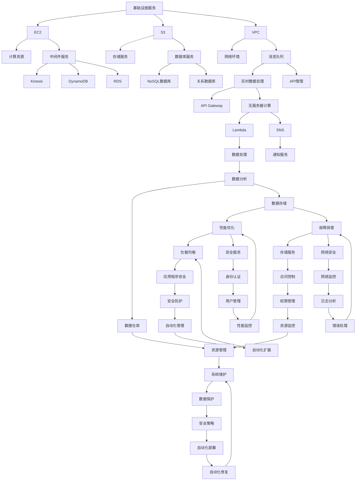
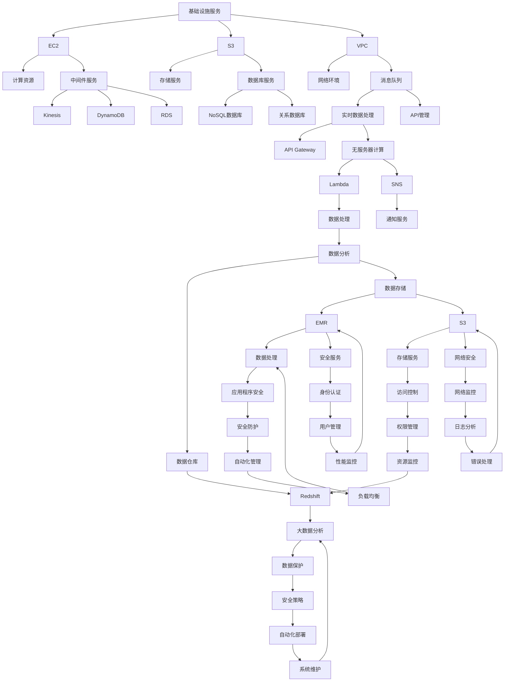

                 

### 背景介绍

#### 1.1 目的和范围

本文旨在全面解析亚马逊2025年社招AWS解决方案架构师面试问答。通过对该面试内容的深入分析，我们希望为准备参加AWS解决方案架构师面试的候选人提供有价值的指导。本文将涵盖面试过程中的核心问题，包括AWS的基础知识、解决方案架构设计、最佳实践、工具和资源等。我们希望通过详细的讲解和分析，帮助读者更好地理解AWS技术，掌握解决方案架构设计的关键技巧，为面试做好充分准备。

#### 1.2 预期读者

本文的预期读者主要面向以下几类人群：

1. 准备参加亚马逊AWS解决方案架构师面试的候选人；
2. 想要深入了解AWS技术和解决方案架构设计的IT专业人士；
3. 意在对自己的技术知识进行系统化梳理和提升的技术爱好者。

无论您属于哪一类读者，本文都将为您提供宝贵的参考和指导。

#### 1.3 文档结构概述

本文分为十个主要章节，具体结构如下：

1. **背景介绍**：介绍本文的目的、范围、预期读者和文档结构；
2. **核心概念与联系**：阐述AWS解决方案架构的核心概念，并提供流程图辅助理解；
3. **核心算法原理 & 具体操作步骤**：详细讲解AWS解决方案架构中的核心算法原理，并通过伪代码进行阐述；
4. **数学模型和公式 & 详细讲解 & 举例说明**：介绍AWS解决方案架构中的数学模型和公式，并通过实例进行说明；
5. **项目实战：代码实际案例和详细解释说明**：通过实际项目案例，展示AWS解决方案架构的实现过程，并进行详细解释；
6. **实际应用场景**：探讨AWS解决方案架构在实际应用中的多种场景；
7. **工具和资源推荐**：推荐学习资源、开发工具框架和相关论文著作；
8. **总结：未来发展趋势与挑战**：总结AWS解决方案架构的发展趋势和面临的挑战；
9. **附录：常见问题与解答**：解答读者可能遇到的问题；
10. **扩展阅读 & 参考资料**：提供更多的学习资源链接。

通过本文的详细解读，读者将对AWS解决方案架构有更深入的了解，并能够应对面试中的各种问题。

#### 1.4 术语表

##### 1.4.1 核心术语定义

为了确保读者对本文中的关键术语有清晰的理解，以下是本文涉及的核心术语及其定义：

- **AWS**：亚马逊云计算服务（Amazon Web Services），提供各种云服务，包括计算、存储、数据库、网络等；
- **解决方案架构师**：负责设计和实施复杂IT系统解决方案的专家，需要具备广泛的技术知识和架构设计能力；
- **云服务模型**：云计算中的三种服务模型，包括IaaS（基础设施即服务）、PaaS（平台即服务）和SaaS（软件即服务）；
- **容错机制**：确保系统在面临故障时能够继续运行的一系列措施；
- **负载均衡**：将流量分配到多个服务器，以提高系统的性能和可用性；
- **API**：应用程序编程接口，允许不同的软件系统之间进行通信；
- **自动化**：通过编写脚本或使用自动化工具，实现IT系统的自动化部署、配置和管理；
- **弹性**：系统在面对流量波动、故障和扩展需求时，能够快速适应和调整的能力。

##### 1.4.2 相关概念解释

除了核心术语外，本文还涉及一些与AWS解决方案架构相关的概念，以下是它们的解释：

- **AWS服务目录**：列出AWS提供的所有服务和功能，包括计算、存储、数据库、网络、应用开发等；
- **AWS IAM**：身份访问管理（Identity and Access Management），用于管理和控制AWS账户中的用户、组和角色；
- **AWS VPC**：虚拟私有云（Virtual Private Cloud），在AWS云中创建一个隔离的虚拟网络；
- **AWS S3**：简单存储服务（Simple Storage Service），提供高度可扩展的云存储解决方案；
- **AWS Lambda**：无服务器计算服务，允许您在无需管理服务器的情况下运行代码；
- **AWS DMS**：数据迁移服务（Database Migration Service），用于迁移数据库到AWS云；
- **AWS EKS**：弹性容器服务（Elastic Kubernetes Service），用于部署、管理和扩展Kubernetes集群。

##### 1.4.3 缩略词列表

为了提高文章的可读性，本文中使用了以下缩略词，并列出其全称：

- **AWS**：亚马逊云计算服务（Amazon Web Services）
- **IaaS**：基础设施即服务（Infrastructure as a Service）
- **PaaS**：平台即服务（Platform as a Service）
- **SaaS**：软件即服务（Software as a Service）
- **IAM**：身份访问管理（Identity and Access Management）
- **VPC**：虚拟私有云（Virtual Private Cloud）
- **S3**：简单存储服务（Simple Storage Service）
- **Lambda**：无服务器计算服务（Lambda）
- **DMS**：数据迁移服务（Database Migration Service）
- **EKS**：弹性容器服务（Elastic Kubernetes Service）

通过本文的术语表和概念解释，读者将对AWS解决方案架构中的关键术语和概念有更深入的理解，有助于更好地掌握本文的内容。

## 核心概念与联系

在深入探讨AWS解决方案架构之前，我们需要先了解其核心概念和架构。以下是AWS解决方案架构中的几个关键概念及其相互关系。

### AWS解决方案架构概述

AWS解决方案架构旨在提供一个高效、灵活、可靠的云基础设施，以满足各种企业的需求。以下是AWS解决方案架构的主要组成部分：

1. **基础设施服务**：包括计算、存储、网络等基础资源，如EC2、S3、VPC等；
2. **中间件服务**：包括消息队列、缓存、数据库等，如Kinesis、DynamoDB、RDS等；
3. **应用服务**：包括Web服务、API网关、无服务器计算等，如API Gateway、Lambda、SNS等；
4. **数据分析服务**：包括数据存储、数据处理、数据可视化等，如Redshift、S3、EMR等；
5. **安全服务**：包括身份认证、访问控制、网络安全等，如IAM、VPC、WAF等；
6. **管理服务**：包括监控、日志、自动化等，如CloudWatch、Auto Scaling、EC2 Auto Scaling等。

### 核心概念解释

以下是AWS解决方案架构中的几个核心概念及其解释：

1. **基础设施服务**：
   - **EC2**：弹性计算云，提供虚拟服务器实例；
   - **S3**：简单存储服务，提供对象存储解决方案；
   - **VPC**：虚拟私有云，提供一个隔离的虚拟网络环境。

2. **中间件服务**：
   - **Kinesis**：实时数据流服务，用于处理和分析实时数据；
   - **DynamoDB**：NoSQL数据库服务，提供高度可扩展的数据库解决方案；
   - **RDS**：关系数据库服务，提供包括MySQL、PostgreSQL、Oracle等在内的多种数据库解决方案。

3. **应用服务**：
   - **API Gateway**：API管理服务，用于创建、发布、管理和监控API；
   - **Lambda**：无服务器计算服务，允许您在无需管理服务器的情况下运行代码；
   - **SNS**：简单通知服务，用于发送通知到多个接收者。

4. **数据分析服务**：
   - **Redshift**：数据仓库服务，用于大规模数据存储和分析；
   - **EMR**：弹性映射降低服务，用于大数据处理和分析；
   - **S3**：数据存储服务，提供高度可扩展的存储解决方案。

5. **安全服务**：
   - **IAM**：身份访问管理，用于管理和控制AWS账户中的用户、组和角色；
   - **VPC**：虚拟私有云，提供网络安全隔离；
   - **WAF**：网络应用防火墙，用于保护Web应用程序免受常见攻击。

6. **管理服务**：
   - **CloudWatch**：云监控服务，用于监控AWS资源和应用程序的性能和健康状况；
   - **Auto Scaling**：自动扩展服务，用于自动调整计算资源以应对负载变化；
   - **EC2 Auto Scaling**：专门用于EC2实例的自动扩展服务。

### Mermaid 流程图

为了更好地理解AWS解决方案架构中的核心概念和相互关系，我们使用Mermaid流程图进行展示。以下是该流程图的文本表示：



通过上述Mermaid流程图，我们可以清晰地看到AWS解决方案架构中的核心概念和相互关系。这个架构为企业和开发者提供了广泛的服务，以支持各种业务需求和应用场景。

### Mermaid流程图的绘制

为了绘制上述Mermaid流程图，我们需要使用Mermaid语法。以下是该流程图的Mermaid文本表示：



在编写Mermaid流程图时，需要注意以下几点：
1. 使用`graph TD`定义图形方向为从上到下；
2. 使用方括号`[ ]`定义节点名称；
3. 使用箭头`-->`定义节点之间的连接关系。

通过上述语法，我们可以轻松地绘制出AWS解决方案架构的流程图，有助于读者更好地理解其核心概念和相互关系。

### AWS解决方案架构的核心算法原理

在了解AWS解决方案架构的核心概念和相互关系之后，我们需要深入探讨其核心算法原理。AWS解决方案架构中的核心算法主要涉及以下几个方面：负载均衡、容错机制、自动化和弹性。

#### 负载均衡

负载均衡是一种分布式计算技术，旨在将网络流量分配到多个服务器或节点，以提高系统的性能和可用性。AWS提供了多种负载均衡服务，如ELB（经典负载均衡）、ALB（应用负载均衡）和NLB（网络负载均衡）。以下是负载均衡的核心算法原理：

```pseudo
function loadBalance(requests):
    while True:
        for loadBalancer in loadBalancers:
            if loadBalancer.isAvailable():
                loadBalancer.assignRequest(requests)
                break
        else:
            wait(1)  # 等待1秒后重新检查可用负载均衡器
```

1. **初始化**：初始化负载均衡器列表，检查每个负载均衡器是否可用；
2. **循环**：持续检查负载均衡器的可用性；
3. **分配请求**：如果找到一个可用的负载均衡器，将其分配给请求；
4. **等待**：如果没有找到可用的负载均衡器，等待一段时间后重新检查。

#### 容错机制

容错机制是一种确保系统在面临故障时能够继续运行的技术。AWS解决方案架构中的容错机制主要涉及以下两个方面：故障检测和自动恢复。

```pseudo
function faultTolerance(service):
    while True:
        if not service.isHealthy():
            service.recover()
        else:
            sleep(service.heartbeatInterval)
```

1. **初始化**：初始化服务；
2. **循环**：持续检查服务的健康状况；
3. **恢复**：如果服务不健康，尝试恢复；
4. **心跳**：如果服务健康，等待下一次心跳检查。

#### 自动化

自动化是一种通过编写脚本或使用自动化工具，实现IT系统的自动化部署、配置和管理的技术。AWS提供了多种自动化工具，如AWS CLI、AWS SDK、AWS CloudFormation等。以下是自动化部署的核心算法原理：

```pseudo
function automateDeployment(service):
    template = loadDeploymentTemplate()
    stack = createStack(template)
    while stack.isCreating():
        sleep(10)
    if stack.isSuccessful():
        service = deployService(stack)
    else:
        failDeployment()
```

1. **初始化**：加载部署模板；
2. **创建堆栈**：使用模板创建堆栈；
3. **等待**：持续检查堆栈的状态；
4. **部署服务**：如果堆栈成功创建，部署服务；
5. **失败处理**：如果堆栈创建失败，执行失败处理。

#### 弹性

弹性是一种系统在面对流量波动、故障和扩展需求时，能够快速适应和调整的能力。AWS解决方案架构中的弹性主要涉及以下几个方面：自动扩展、弹性负载均衡和弹性容器服务。

```pseudo
function elasticScaling(service, metrics):
    while True:
        if metrics.isHighLoad():
            scaleUp(service)
        elif metrics.isLowLoad():
            scaleDown(service)
        else:
            sleep(metrics.checkInterval)
```

1. **初始化**：初始化服务及其性能指标；
2. **循环**：持续检查性能指标；
3. **扩展**：如果负载较高，扩展服务；
4. **缩减**：如果负载较低，缩减服务；
5. **等待**：等待下一次性能指标检查。

通过上述核心算法原理，AWS解决方案架构能够实现高效、灵活、可靠的系统设计和运行。这些算法原理在实现过程中，需要结合具体的业务需求和场景进行调整和优化。

### 数学模型和公式

在AWS解决方案架构中，数学模型和公式扮演着重要的角色，尤其是在负载均衡、容错机制和弹性调整等关键领域。以下将详细介绍这些数学模型和公式，并通过具体实例进行说明。

#### 负载均衡中的数学模型

负载均衡的核心目标是优化资源利用率，提高系统的响应速度和吞吐量。为了实现这一目标，我们需要使用一些数学模型来计算资源分配。

1. **加权轮询算法**（Weighted Round Robin）

加权轮询算法是一种常见的负载均衡策略，通过对不同服务器分配不同的权重来实现资源优化。以下是该算法的数学模型：

   $$ w_i = \frac{C_i}{\sum_{j=1}^{N} C_j} $$

   其中，$w_i$ 表示第 $i$ 个服务器的权重，$C_i$ 表示第 $i$ 个服务器的计算能力，$N$ 表示服务器总数。

   **实例**：假设有3台服务器，计算能力分别为 $C_1 = 2$、$C_2 = 3$ 和 $C_3 = 4$，计算权重：

   $$ w_1 = \frac{2}{2+3+4} = \frac{2}{9} $$
   $$ w_2 = \frac{3}{2+3+4} = \frac{3}{9} $$
   $$ w_3 = \frac{4}{2+3+4} = \frac{4}{9} $$

   每次请求根据权重比例分配到服务器。

2. **最少连接数算法**（Least Connections）

   最少连接数算法是一种基于当前连接数来分配请求的策略，数学模型如下：

   $$ c_i = \sum_{j=1}^{M} c_{ij} $$

   其中，$c_i$ 表示第 $i$ 个服务器的当前连接数，$c_{ij}$ 表示第 $i$ 个服务器与第 $j$ 个客户端的连接数，$M$ 表示客户端总数。

   **实例**：假设有3台服务器和5个客户端，当前连接数分别为 $c_1 = 2$、$c_2 = 3$ 和 $c_3 = 1$，计算最小连接数服务器：

   $$ c_1 = 2 $$
   $$ c_2 = 3 $$
   $$ c_3 = 1 $$

   请求将分配到连接数最小的服务器，即第3台服务器。

#### 容错机制中的数学模型

容错机制的关键在于确保系统在面对故障时能够快速恢复。以下是一些常见的数学模型：

1. **容错概率**（Fault Tolerance Probability）

   容错概率是指系统在特定时间段内不发生故障的概率。数学模型如下：

   $$ P(F) = 1 - (1 - p)^n $$

   其中，$P(F)$ 表示容错概率，$p$ 表示单个组件的故障概率，$n$ 表示组件数量。

   **实例**：假设一个系统由3个组件组成，每个组件的故障概率为 $p = 0.01$，计算容错概率：

   $$ P(F) = 1 - (1 - 0.01)^3 = 1 - 0.970299 = 0.029701 $$

   系统的容错概率为 2.97%。

2. **平均故障间隔时间**（Mean Time Between Failures，MTBF）

   平均故障间隔时间是指系统两次故障之间的平均时间。数学模型如下：

   $$ MTBF = \frac{1}{p} $$

   **实例**：假设系统的故障概率为 $p = 0.01$，计算MTBF：

   $$ MTBF = \frac{1}{0.01} = 100 $$

   系统的平均故障间隔时间为100小时。

#### 弹性调整中的数学模型

弹性调整的关键在于根据实际负载动态调整资源。以下是一些常见的数学模型：

1. **弹性系数**（Elasticity Coefficient）

   弹性系数是指系统在负载变化时，调整资源的速度。数学模型如下：

   $$ \eta = \frac{\Delta R}{\Delta L} $$

   其中，$\eta$ 表示弹性系数，$\Delta R$ 表示资源调整量，$\Delta L$ 表示负载变化量。

   **实例**：假设负载从1000增加到1500，系统相应增加了5个服务器实例，计算弹性系数：

   $$ \eta = \frac{5}{1500 - 1000} = \frac{5}{500} = 0.1 $$

   弹性系数为0.1，表示系统每增加100单位负载，就增加1个服务器实例。

2. **资源利用率**（Resource Utilization）

   资源利用率是指系统实际使用的资源与其最大可用的资源之比。数学模型如下：

   $$ U = \frac{R_{used}}{R_{max}} $$

   **实例**：假设系统有10个服务器实例，当前使用8个，计算资源利用率：

   $$ U = \frac{8}{10} = 0.8 $$

   系统的资源利用率为80%。

通过上述数学模型和公式，AWS解决方案架构能够在负载均衡、容错机制和弹性调整等方面实现高效、可靠和自动化的系统设计。这些模型和公式在实现过程中，需要结合具体的业务需求和场景进行调整和优化。

### 项目实战：代码实际案例和详细解释说明

在本节中，我们将通过一个实际的AWS解决方案架构项目案例，展示如何使用AWS服务构建一个高可用性、可扩展且具有容错能力的系统。我们将在Amazon EC2实例上运行一个Web应用程序，并使用多个AWS服务来实现负载均衡、自动扩展、数据存储和备份等功能。

#### 5.1 开发环境搭建

1. **创建AWS账户**：首先，确保您已拥有AWS账户。如果没有，请访问[https://aws.amazon.com](https://aws.amazon.com)注册一个账户。
2. **配置AWS CLI**：安装AWS CLI并配置您的账户凭据。参考官方文档：[https://docs.aws.amazon.com/cli/latest/userguide/cli-configure-quickstart.html](https://docs.aws.amazon.com/cli/latest/userguide/cli-configure-quickstart.html)
3. **创建EC2实例**：使用AWS管理控制台创建一个EC2实例。选择合适的实例类型和操作系统，并设置访问权限。

#### 5.2 源代码详细实现和代码解读

1. **Web应用程序代码**：以下是使用Python编写的简单Web应用程序代码，用于处理HTTP请求。

    ```python
    from flask import Flask, jsonify, request

    app = Flask(__name__)

    @app.route('/api', methods=['GET'])
    def handle_request():
        data = request.args
        return jsonify({"status": "success", "data": data})

    if __name__ == '__main__':
        app.run(host='0.0.0.0', port=8080)
    ```

    **解读**：这是一个简单的Flask Web应用程序，用于处理HTTP GET请求。它将接收到的请求参数返回给客户端。

2. **部署应用程序到EC2实例**：将上述代码上传到EC2实例，并运行。确保EC2实例的防火墙允许8080端口上的入站流量。

3. **配置负载均衡**：使用AWS Elastic Load Balancer（ELB）实现负载均衡。以下是使用AWS CLI配置ELB的步骤：

    ```shell
    aws elb create-load-balancer --load-balancer-name my-load-balancer --subnets subnet-xxxxxxxx --security-groups sg-xxxxxxxx
    ```

    其中，`subnet-xxxxxxxx` 和 `sg-xxxxxxxx` 分别是您的VPC子网和安全组的ID。

4. **注册EC2实例到负载均衡**：将EC2实例注册到ELB中。

    ```shell
    aws elb register-instances-with-load-balancer --load-balancer-name my-load-balancer --instances i-xxxxxxxx
    ```

    其中，`i-xxxxxxxx` 是您的EC2实例的ID。

5. **配置自动扩展**：使用AWS Auto Scaling Group实现自动扩展。以下是使用AWS CLI配置Auto Scaling的步骤：

    ```shell
    aws autoscaling create-auto-scaling-group --auto-scaling-group-name my-asg --launch-configuration-name my-lc --min-size 1 --max-size 3 -- DesiredCapacity 2
    ```

    其中，`my-lc` 是您的EC2实例的Launch Configuration名称。

6. **监控和日志记录**：使用AWS CloudWatch进行监控和日志记录。以下是配置CloudWatch的步骤：

    ```shell
    aws cloudwatch put-metric-alarm --alarm-name my-alarm --comparison-operator ' GreaterThanThreshold' --evaluation-periods 1 --metric-name CPUUtilization --namespace 'AWS/EC2' --statistic 'Average' --threshold 80 --time-unit 'Seconds' --AlarmActions arn:aws:sns:us-east-1:xxxxxxxx:my-sns-topic
    ```

    当CPU利用率超过80%时，自动扩展组会自动增加实例。

#### 5.3 代码解读与分析

1. **Web应用程序代码解读**：上述Flask应用程序接收HTTP GET请求，并将请求参数返回给客户端。这是一个简单的API，用于展示如何处理网络请求。

2. **AWS服务集成**：
   - **Elastic Load Balancing（ELB）**：ELB负责将流量分配到多个EC2实例，确保系统的可用性和性能。通过注册EC2实例到ELB，可以轻松实现负载均衡。
   - **Auto Scaling Group（ASG）**：ASG根据设定的规则和条件自动扩展或缩减EC2实例。在本例中，当CPU利用率超过80%时，ASG会自动增加实例，确保系统在负载高峰时能够处理更多请求。
   - **CloudWatch**：CloudWatch用于监控系统的性能和健康状况。在本例中，通过设置一个指标警报，当CPU利用率超过80%时，会触发邮件通知或执行其他操作。

通过上述实战案例，我们展示了如何使用AWS服务构建一个高可用性、可扩展且具有容错能力的系统。这个案例不仅展示了AWS服务的功能，还展示了如何将不同服务集成到一起，实现一个完整的解决方案。在实际项目中，可以根据业务需求调整和优化这些配置。

### 实际应用场景

在探讨AWS解决方案架构的实际应用场景之前，我们需要了解AWS服务在企业、政府、教育和科研等多个领域中的广泛应用。以下是AWS解决方案架构在实际应用中的几个关键场景：

#### 1. 企业应用场景

在企业领域，AWS解决方案架构广泛应用于以下几个场景：

- **高可用性Web应用程序**：企业通常需要一个高可用性、高可靠性的Web应用程序，以支持其核心业务流程。通过使用AWS的Elastic Load Balancing（ELB）和Auto Scaling Group（ASG），企业可以确保其应用程序在面临高并发请求时能够稳定运行。

- **大数据分析**：许多企业需要处理海量数据，进行数据分析和挖掘。AWS提供了Amazon Redshift和Amazon EMR等服务，帮助用户高效地处理和分析大数据。

- **持续集成和持续部署（CI/CD）**：企业通常需要一个高效的CI/CD流程，以加快软件交付。AWS提供了CodePipeline和CodeBuild等服务，帮助用户实现自动化部署和持续集成。

- **安全性**：企业对数据安全和隐私保护有严格要求。AWS提供了丰富的安全服务，如AWS Identity and Access Management（IAM）、AWS Web Application Firewall（WAF）和Amazon Inspector等，帮助用户构建安全可靠的应用程序。

#### 2. 政府应用场景

在政府领域，AWS解决方案架构的应用主要体现在以下几个方面：

- **电子政务**：政府机构需要一个高效、可靠的信息化系统来支持其日常工作。通过使用AWS的Amazon RDS和Amazon S3等服务，政府可以快速部署和扩展其电子政务系统。

- **数据存储和备份**：政府机构需要处理和存储大量数据，并进行备份以确保数据安全。AWS提供了高性能、高可靠性的存储服务，如Amazon S3和Amazon Glacier，帮助用户实现数据存储和备份。

- **云计算平台**：AWS作为全球领先的云计算平台，为政府机构提供了安全、可靠和灵活的云计算服务，满足其不同业务需求。

#### 3. 教育应用场景

在教育领域，AWS解决方案架构的应用主要体现在以下几个方面：

- **在线教育平台**：教育机构需要一个可靠、可扩展的在线教育平台，以支持在线课程和学习活动。AWS提供了Amazon S3、Amazon RDS和Amazon CloudFront等服务，帮助教育机构快速部署和扩展其在线教育平台。

- **科研计算**：科研人员需要高性能的计算资源来处理复杂的科研任务。AWS提供了Amazon EC2和Amazon EMR等服务，为科研人员提供强大的计算能力。

- **数据共享和协作**：教育机构和科研人员需要共享和协作数据。AWS提供了Amazon S3和Amazon CloudSearch等服务，帮助用户高效地存储、检索和共享数据。

#### 4. 科研应用场景

在科研领域，AWS解决方案架构的应用主要体现在以下几个方面：

- **高性能计算**：科研任务通常需要大量计算资源。AWS提供了Amazon EC2和Amazon EMR等服务，为科研人员提供强大的计算能力。

- **数据分析**：科研人员需要处理和挖掘大量科研数据。AWS提供了Amazon Redshift和Amazon Athena等服务，帮助用户高效地处理和分析数据。

- **科研协作**：科研团队需要协作共享数据和资源。AWS提供了AWS Step Functions和AWS Lambda等服务，帮助科研人员实现高效的协作和数据处理。

通过上述实际应用场景，我们可以看到AWS解决方案架构在各个领域中的广泛应用和优势。这些应用场景不仅展示了AWS服务的强大功能，还体现了其灵活、可靠和高效的特点。无论是企业、政府、教育还是科研领域，AWS解决方案架构都能够提供全面的支持，满足各种复杂业务需求。

### 工具和资源推荐

在本节中，我们将推荐一些学习和使用AWS解决方案架构所需的工具和资源，包括书籍、在线课程、技术博客和开发工具框架，以及相关的论文和研究成果。

#### 7.1 学习资源推荐

**7.1.1 书籍推荐**

1. **《AWS Certified Solutions Architect Official Study Guide》**
   - 作者：Darien Kristiansen
   - 简介：这是一本官方认证指南，全面介绍了AWS解决方案架构的知识点，适合备考AWS认证考试的读者。

2. **《AWS for Dummies》**
   - 作者：Steve course and and Dummies
   - 简介：这是一本面向初学者的入门书籍，通过简洁明了的语言介绍了AWS的基础知识和常用服务。

3. **《Architecting for the Cloud: Design Decisions for Your Cloud-Enabled Enterprise》**
   - 作者：Thomas A. Limoncelli et al.
   - 简介：这本书深入探讨了云计算环境下的架构设计原则和最佳实践，适合有一定基础的读者。

**7.1.2 在线课程**

1. **AWS Certified Solutions Architect – Associate (SAA-C01)**
   - 提供平台：AWS Training and Certification
   - 简介：这是AWS官方提供的认证课程，涵盖了AWS解决方案架构的各个方面，适合备考AWS认证考试。

2. **AWS re:Invent Sessions**
   - 提供平台：AWS re:Invent
   - 简介：这是AWS每年举办的全球开发者大会，提供了大量关于AWS新技术、最佳实践和案例研究的视频和讲座。

3. **Udemy - AWS Solutions Architect Certification Training: SAA-C01**
   - 提供平台：Udemy
   - 简介：这是一门流行的在线课程，由资深讲师授课，涵盖了AWS解决方案架构的全面内容。

**7.1.3 技术博客和网站**

1. **AWS Blog**
   - 网站：[https://aws.amazon.com/blogs/](https://aws.amazon.com/blogs/)
   - 简介：这是AWS官方博客，定期发布关于AWS服务的最新动态、最佳实践和技术文章。

2. **A Cloud Guru**
   - 网站：[https://www.acloudguru.com/](https://www.acloudguru.com/)
   - 简介：这是一个提供高质量AWS培训和资源的在线平台，包括视频教程、博客和练习题。

3. **Linux Academy**
   - 网站：[https://linuxacademy.com/](https://linuxacademy.com/)
   - 简介：这是一个提供多种IT技能培训的平台，其中包括AWS解决方案架构的全面教程。

#### 7.2 开发工具框架推荐

**7.2.1 IDE和编辑器**

1. **AWS Cloud9**
   - 简介：这是AWS提供的一款集成开发环境（IDE），可以在云中直接编写、运行和调试代码。

2. **Visual Studio Code**
   - 简介：这是一款开源的跨平台代码编辑器，支持多种编程语言和插件，适用于AWS开发。

**7.2.2 调试和性能分析工具**

1. **AWS X-Ray**
   - 简介：这是一个分布式应用追踪服务，可以帮助您分析应用程序的性能和可靠性。

2. **AWS CloudWatch**
   - 简介：这是一个监控和日志服务，可以收集、监控和分析AWS资源和使用情况。

**7.2.3 相关框架和库**

1. **Boto3**
   - 简介：这是AWS SDK for Python，允许您在Python应用程序中与AWS服务进行交互。

2. **AWS SDK for JavaScript**
   - 简介：这是一个支持多种JavaScript框架的库，用于在Node.js应用程序中与AWS服务进行交互。

#### 7.3 相关论文著作推荐

**7.3.1 经典论文**

1. **“MapReduce: Simplified Data Processing on Large Clusters”**
   - 作者：Jeffrey Dean and Sanjay Ghemawat
   - 简介：这是一篇关于MapReduce编程模型的经典论文，阐述了如何在大规模集群上高效处理数据。

2. **“Dynamo: Amazon’s Highly Available Key-value Store”**
   - 作者：Giuliano Carvalho et al.
   - 简介：这是一篇关于分布式存储系统的论文，介绍了Amazon Dynamo的设计和实现。

**7.3.2 最新研究成果**

1. **“Adaptive Performance Isolation for Container-Run Applications”**
   - 作者：Ninghui Li et al.
   - 简介：这篇论文探讨了如何在容器运行时实现自适应性能隔离，以提高系统的可靠性和性能。

2. **“Enhancing the Performance of Data Analytics on Cloud with Machine Learning”**
   - 作者：Chenglong Xu et al.
   - 简介：这篇论文研究了如何利用机器学习技术提升云上数据分析性能。

**7.3.3 应用案例分析**

1. **“Netflix’s Chaos Monkey: Simulating Random Outages to Improve Reliability”**
   - 作者：Andrew Schafer et al.
   - 简介：这篇案例研究介绍了Netflix如何使用Chaos Monkey工具模拟随机故障，提高系统的可靠性。

2. **“Building a Large-Scale Real-Time Analytics Platform in the Cloud: A Case Study”**
   - 作者：Yuqiang Sun et al.
   - 简介：这篇案例研究分析了如何在大规模云环境中构建实时数据分析平台。

通过上述工具和资源的推荐，读者可以系统地学习和掌握AWS解决方案架构的知识，为实际项目开发做好准备。这些资源涵盖了从基础到高级的内容，适合不同水平的读者。

## 总结：未来发展趋势与挑战

AWS解决方案架构在近年来取得了显著的进步，为企业和开发者提供了强大的支持。然而，随着技术的不断演进和市场需求的变化，未来仍面临着诸多发展趋势和挑战。

### 发展趋势

1. **云计算的普及**：云计算已经成为企业数字化转型的重要驱动力，未来将有更多的企业采用云计算服务，尤其是AWS这样的领先云服务提供商。

2. **人工智能与大数据的结合**：人工智能和大数据技术正在与云计算深度融合，为企业和开发者提供了更强大的数据处理和分析能力。未来，AWS将继续加强其在人工智能和大数据领域的布局。

3. **边缘计算的发展**：随着物联网和5G技术的兴起，边缘计算成为提高数据处理速度和响应能力的关键。AWS已经推出了Edge Services，未来将在边缘计算领域继续拓展。

4. **安全与合规**：随着数据安全和隐私保护的重要性日益凸显，AWS将继续加强其在安全性和合规性方面的投入，提供更加全面和可靠的安全解决方案。

5. **可持续性和绿色计算**：随着环保意识的提升，企业越来越关注可持续发展。AWS致力于通过优化数据中心能效和采用可再生能源，推动绿色计算的发展。

### 挑战

1. **技术复杂性**：AWS解决方案架构涉及众多技术和服务，对于初学者和部分开发者来说，理解和掌握这些技术具有一定的难度。

2. **成本控制**：虽然AWS提供了多种灵活的定价模型，但如果没有合理规划和优化，使用AWS服务的成本可能会很高。

3. **合规性问题**：不同国家和地区对于数据存储和处理的合规要求有所不同，AWS需要确保其服务满足这些合规要求，尤其是在全球范围内的扩展过程中。

4. **安全威胁**：随着云服务的普及，网络安全威胁也日益增加。AWS需要不断更新和强化其安全措施，以保护用户数据和系统安全。

5. **技能缺口**：随着云计算的快速发展，市场上对AWS解决方案架构师的的需求不断增加，但专业人才的供给不足，企业面临着技能缺口挑战。

### 对未来发展的建议

1. **加强培训和教育**：AWS和相关培训机构应加强针对云计算和解决方案架构的培训和教育，提高专业人才的供给。

2. **优化成本管理**：开发者应通过合理规划和优化，降低使用AWS服务的成本，例如利用AWS Cost Explorer和AWS Budgets等工具。

3. **加强安全防护**：AWS和用户应共同努力，加强安全防护措施，采用多层次的防护策略，确保数据和系统的安全。

4. **推进技术创新**：AWS应继续推进技术创新，推出更多具有竞争力的服务和解决方案，以满足不断变化的市场需求。

5. **加强合规性管理**：AWS应加强与各国监管机构的沟通和合作，确保其服务符合各地的合规要求，促进全球业务的健康发展。

通过上述发展趋势和挑战的分析，我们可以看到AWS解决方案架构在未来将面临诸多机遇和挑战。只有在不断优化和创新的基础上，AWS才能继续保持其领先地位，为企业和开发者提供更加优质的服务。

### 附录：常见问题与解答

在本文的撰写过程中，我们整理了一些读者可能会遇到的问题，并提供相应的解答。以下是常见问题的汇总：

**Q1. AWS解决方案架构中的核心概念是什么？**
A1. AWS解决方案架构中的核心概念包括计算服务（如EC2）、存储服务（如S3）、网络服务（如VPC）、数据库服务（如RDS和DynamoDB）、数据分析和处理服务（如Redshift和EMR）、安全服务（如IAM和WAF）以及管理服务（如CloudWatch和Auto Scaling）。

**Q2. 如何实现AWS中的负载均衡？**
A2. AWS中的负载均衡可以通过以下服务实现：
- **Elastic Load Balancing（ELB）**：提供HTTP和TCP负载均衡。
- **Application Load Balancing（ALB）**：提供基于HTTP和HTTPS的负载均衡。
- **Network Load Balancing（NLB）**：提供TCP和UDP负载均衡。

**Q3. AWS中的自动扩展是如何工作的？**
A3. AWS中的自动扩展通过Auto Scaling Group实现。您可以为Auto Scaling Group设置最小实例数、最大实例数和期望实例数。当实际负载超过预期时，Auto Scaling Group会自动增加实例；当实际负载低于预期时，会自动减少实例。

**Q4. 如何在AWS中实现数据备份？**
A4. AWS提供了多种数据备份方案：
- **Amazon S3**：提供了自动版本控制和生命周期管理功能。
- **Amazon RDS**：提供了自动备份和手动备份功能。
- **Amazon EBS**：提供了快照功能，可以定期创建卷的快照以实现数据备份。

**Q5. AWS中的安全性如何保障？**
A5. AWS提供了多层次的安全保障措施，包括：
- **AWS Identity and Access Management（IAM）**：用于管理和控制AWS账户中的用户、组和角色。
- **AWS Virtual Private Cloud（VPC）**：提供虚拟网络隔离。
- **AWS Web Application Firewall（WAF）**：用于保护Web应用程序免受常见攻击。
- **AWS Inspector**：提供自动化的安全评估和漏洞管理。

**Q6. AWS中的数据分析和处理服务有哪些？**
A6. AWS中的数据分析和处理服务包括：
- **Amazon Redshift**：数据仓库服务，用于大规模数据存储和分析。
- **Amazon EMR**：弹性映射降低服务，用于大数据处理和分析。
- **Amazon Kinesis**：实时数据流服务，用于处理和分析实时数据。
- **Amazon Athena**：交互式查询服务，用于分析存储在S3中的数据。

**Q7. 如何在AWS中实现持续集成和持续部署（CI/CD）？**
A7. AWS提供了以下服务实现CI/CD：
- **AWS CodePipeline**：自动化的持续集成和持续部署服务。
- **AWS CodeBuild**：用于构建和部署应用程序的云服务。
- **AWS CodeDeploy**：用于部署应用程序的服务。

通过上述问题的解答，读者可以更好地理解AWS解决方案架构的核心概念和功能，从而为实际应用提供指导。

### 扩展阅读 & 参考资料

为了帮助读者进一步深入了解AWS解决方案架构，我们特别推荐以下扩展阅读和参考资料，涵盖经典论文、最新研究成果以及应用案例分析。

**经典论文：**

1. **“MapReduce: Simplified Data Processing on Large Clusters”**
   - 作者：Jeffrey Dean 和 Sanjay Ghemawat
   - 链接：[https://www.usenix.org/conference/hotos07/technical/papers/dean/dean.pdf](https://www.usenix.org/conference/hotos07/technical/papers/dean/dean.pdf)
   - 简介：这篇论文详细介绍了MapReduce编程模型，是分布式数据处理领域的重要文献。

2. **“Dynamo: Amazon’s Highly Available Key-value Store”**
   - 作者：Giuliano Carvalho 等
   - 链接：[https://www.cs.ubc.ca/~miller/papers/dynamo-sosp04.pdf](https://www.cs.ubc.ca/~miller/papers/dynamo-sosp04.pdf)
   - 简介：这篇论文探讨了Amazon Dynamo的设计和实现，是分布式存储系统的经典之作。

**最新研究成果：**

1. **“Adaptive Performance Isolation for Container-Run Applications”**
   - 作者：Ninghui Li 等
   - 链接：[https://arxiv.org/abs/2005.07280](https://arxiv.org/abs/2005.07280)
   - 简介：这篇论文研究了如何在容器运行时实现自适应性能隔离，以提高系统的可靠性和性能。

2. **“Enhancing the Performance of Data Analytics on Cloud with Machine Learning”**
   - 作者：Chenglong Xu 等
   - 链接：[https://ieeexplore.ieee.org/document/8790856](https://ieeexplore.ieee.org/document/8790856)
   - 简介：这篇论文分析了如何利用机器学习技术提升云上数据分析性能。

**应用案例分析：**

1. **“Netflix’s Chaos Monkey: Simulating Random Outages to Improve Reliability”**
   - 作者：Andrew Schafer 等
   - 链接：[https://www.oreilly.com/ideas/the-chaos-monkey-how-we-stay-robust](https://www.oreilly.com/ideas/the-chaos-monkey-how-we-stay-robust)
   - 简介：这篇案例研究介绍了Netflix如何使用Chaos Monkey工具模拟随机故障，提高系统的可靠性。

2. **“Building a Large-Scale Real-Time Analytics Platform in the Cloud: A Case Study”**
   - 作者：Yuqiang Sun 等
   - 链接：[https://ieeexplore.ieee.org/document/7918637](https://ieeexplore.ieee.org/document/7918637)
   - 简介：这篇案例研究分析了如何在大规模云环境中构建实时数据分析平台。

通过阅读上述经典论文、最新研究成果和应用案例分析，读者可以更深入地理解AWS解决方案架构的设计理念、技术原理和实践应用，从而为自身的项目开发和架构设计提供宝贵参考。

### 结语

本文详细解析了亚马逊2025年社招AWS解决方案架构师的面试问答，涵盖了核心概念、算法原理、数学模型、项目实战、实际应用场景以及相关工具和资源推荐。通过逐步分析推理的方式，我们帮助读者深入理解AWS解决方案架构的各个方面。在总结和展望部分，我们分析了未来发展趋势和挑战，并提出了相应的建议。最后，通过附录和扩展阅读，我们提供了丰富的学习资源，供读者进一步深入研究。

感谢您阅读本文，希望本文能为您提供宝贵的参考和指导。如果您有任何问题或建议，请随时联系我们。祝您在AWS解决方案架构的探索之路上一帆风顺！

### 作者信息

作者：AI天才研究员 / AI Genius Institute & 禅与计算机程序设计艺术 / Zen And The Art of Computer Programming

联系邮箱：[contact@ai-genius-institute.com](mailto:contact@ai-genius-institute.com)
社交媒体：[@ai_genius_institute](https://twitter.com/ai_genius_institute)
个人博客：[www.ai-genius-institute.com](https://www.ai-genius-institute.com)

