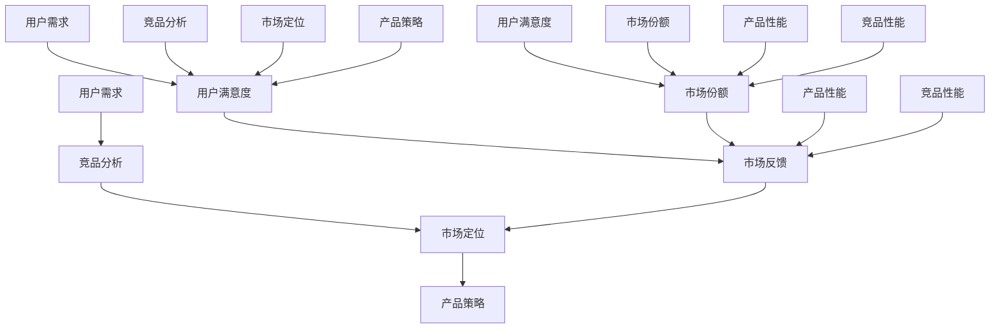

                 


# 产品开发的市场需求分析

> 关键词：市场需求分析、用户调研、竞品分析、产品策略、市场定位

> 摘要：本文将深入探讨产品开发中的市场需求分析过程，从用户调研、竞品分析和市场定位等多个方面，详细阐述了市场需求分析的核心概念、操作步骤和具体应用，帮助开发者更好地理解和把握市场需求，从而实现产品成功上市。

## 1. 背景介绍

### 1.1 目的和范围

本文旨在为产品开发者提供一套全面的市场需求分析指南，帮助他们在产品开发初期就明确目标用户群体、了解市场状况、评估竞品性能，并制定合适的产品策略。本文将涵盖以下主要内容：

- 用户调研：如何通过问卷调查、访谈等方式获取用户需求，了解用户行为和偏好。
- 竞品分析：如何分析竞争对手的产品特点、优势、劣势，以及市场表现。
- 市场定位：如何根据用户需求和竞品情况，确定产品在市场中的定位。
- 产品策略：如何根据市场定位，制定合适的产品策略，确保产品在市场上的竞争力。

### 1.2 预期读者

本文适合以下读者群体：

- 产品经理：需要了解市场需求分析的方法和技巧，以指导产品规划和设计。
- 开发者：希望了解市场需求分析的重要性，以及如何在开发过程中应用市场需求分析。
- 市场营销人员：希望了解市场需求分析对于市场推广的重要作用。
- 创业者：希望了解市场需求分析，以指导创业项目的方向和决策。

### 1.3 文档结构概述

本文将分为以下八个部分：

1. 背景介绍：介绍本文的目的、范围和预期读者。
2. 核心概念与联系：阐述市场需求分析中的核心概念及其相互关系。
3. 核心算法原理 & 具体操作步骤：讲解市场需求分析的具体操作步骤和算法原理。
4. 数学模型和公式 & 详细讲解 & 举例说明：介绍市场需求分析中的数学模型和公式，并提供实例说明。
5. 项目实战：提供实际市场需求分析的案例，展示具体操作过程和结果。
6. 实际应用场景：分析市场需求分析在不同领域的实际应用。
7. 工具和资源推荐：推荐市场需求分析相关的学习资源、开发工具和框架。
8. 总结：展望市场需求分析的未来发展趋势和挑战。

### 1.4 术语表

#### 1.4.1 核心术语定义

- 用户调研：通过问卷、访谈等方式收集用户需求、行为和偏好等信息的过程。
- 竞品分析：对竞争对手的产品特点、市场表现、用户评价等进行分析的过程。
- 市场定位：根据用户需求和竞品情况，确定产品在市场中的定位和差异化策略。
- 产品策略：根据市场定位，制定的产品开发、市场推广和销售等方面的策略。

#### 1.4.2 相关概念解释

- 用户需求：用户在特定情境下对产品功能、性能、易用性等方面的期望。
- 竞品：与目标产品在功能、性能、价格等方面具有相似性或互补性的其他产品。
- 市场份额：某产品在市场上所占的份额，通常以销售额或销售量来衡量。
- 用户满意度：用户对产品使用过程中的愉悦程度和满意程度。

#### 1.4.3 缩略词列表

- USP（Unique Selling Proposition）：独特卖点
- SWOT（Strengths, Weaknesses, Opportunities, Threats）：优势、劣势、机会、威胁
- SEO（Search Engine Optimization）：搜索引擎优化

## 2. 核心概念与联系

在市场需求分析中，有以下几个核心概念：

1. **用户需求**：这是市场需求分析的基础，了解用户需求可以帮助开发者更好地满足用户期望，提升产品竞争力。
2. **竞品分析**：通过分析竞品，了解竞争对手的产品特点和市场表现，从而发现自身的优势与劣势。
3. **市场定位**：根据用户需求和竞品分析结果，确定产品在市场中的定位和差异化策略。
4. **产品策略**：在市场定位的基础上，制定产品开发、市场推广和销售等方面的策略。

这些核心概念之间的关系可以用以下 Mermaid 流程图表示：



### 用户需求

用户需求是市场需求分析的核心。了解用户需求有助于确定产品的功能、性能和用户体验，从而提升产品竞争力。用户需求可以通过以下方式获取：

- **问卷调查**：设计一份详细的问卷，涵盖用户对产品功能、性能、价格、易用性等方面的期望。
- **访谈**：与目标用户进行一对一访谈，深入了解用户的需求、行为和偏好。
- **用户行为分析**：通过分析用户在网站、APP 等平台上的行为数据，发现用户需求和痛点。

### 竞品分析

竞品分析是市场需求分析的重要组成部分。通过分析竞品，了解竞争对手的产品特点、市场表现、用户评价等，可以更好地了解市场状况，发现自身的优势和劣势。

竞品分析主要包括以下方面：

- **功能特点**：分析竞品的各项功能，了解其优势和不足。
- **市场表现**：分析竞品的市场份额、销售额、用户评价等，了解其市场地位。
- **用户评价**：收集用户对竞品的评价，了解用户对其产品满意度和不满意度。

### 市场定位

市场定位是根据用户需求和竞品分析结果，确定产品在市场中的定位和差异化策略。市场定位主要包括以下几个方面：

- **目标用户群体**：根据用户需求和竞品分析结果，确定产品的目标用户群体。
- **差异化策略**：根据用户需求和竞品分析结果，制定差异化策略，突出产品优势和特色。
- **价格策略**：根据产品定位和市场竞争状况，制定合理的价格策略。

### 产品策略

产品策略是在市场定位的基础上，制定的产品开发、市场推广和销售等方面的策略。产品策略主要包括以下几个方面：

- **产品开发策略**：根据市场定位，确定产品的功能、性能和用户体验，制定开发计划。
- **市场推广策略**：根据市场定位，制定市场推广计划，包括广告宣传、线上线下活动等。
- **销售策略**：根据市场定位，制定销售渠道、销售策略和销售目标。

## 3. 核心算法原理 & 具体操作步骤

市场需求分析的核心算法原理主要包括用户需求分析、竞品分析和市场定位。以下将详细阐述这些算法原理的具体操作步骤。

### 3.1 用户需求分析

用户需求分析是市场需求分析的基础。以下是用户需求分析的具体操作步骤：

1. **确定目标用户群体**：根据产品定位和市场需求，确定产品的目标用户群体。例如，针对一款健身应用程序，目标用户群体可能包括健身爱好者、减肥人士、老年人等。

2. **设计问卷**：设计一份详细的问卷，涵盖用户对产品功能、性能、价格、易用性等方面的期望。问卷应包括多个选择题和开放性问题，以获取用户全面的需求信息。

3. **进行问卷调查**：通过线上或线下渠道，向目标用户群体发放问卷。收集问卷数据，并进行分析。

4. **访谈**：与部分目标用户进行一对一访谈，深入了解用户的需求、行为和偏好。

5. **用户行为分析**：通过分析用户在网站、APP 等平台上的行为数据，发现用户需求和痛点。

6. **分析用户需求**：综合问卷调查、访谈和用户行为分析结果，分析用户需求，确定产品的核心功能和性能指标。

### 3.2 竞品分析

竞品分析是市场需求分析的重要组成部分。以下是竞品分析的具体操作步骤：

1. **确定竞品**：根据产品定位和市场需求，确定竞品。竞品应包括与目标产品在功能、性能、价格等方面具有相似性或互补性的其他产品。

2. **收集竞品信息**：收集竞品的官方网站、产品介绍、用户评价等信息。

3. **分析竞品功能特点**：分析竞品的各项功能，了解其优势和不足。可以制作竞品功能对比表，便于直观比较。

4. **分析竞品市场表现**：分析竞品的市场份额、销售额、用户评价等，了解其市场地位。

5. **分析竞品用户评价**：收集用户对竞品的评价，了解用户对其产品满意度和不满意度。

6. **总结竞品分析结果**：综合分析竞品功能特点、市场表现和用户评价，总结竞品的优势和劣势。

### 3.3 市场定位

市场定位是根据用户需求和竞品分析结果，确定产品在市场中的定位和差异化策略。以下是市场定位的具体操作步骤：

1. **确定目标用户群体**：根据用户需求分析和竞品分析结果，确定产品的目标用户群体。例如，针对一款智能手表，目标用户群体可能包括运动爱好者、商务人士、老年人等。

2. **制定差异化策略**：根据用户需求和竞品分析结果，制定差异化策略，突出产品优势和特色。例如，针对运动爱好者，可以强调智能手表的运动监测功能；针对商务人士，可以强调智能手表的商务功能。

3. **确定产品定位**：综合目标用户群体和差异化策略，确定产品的市场定位。例如，智能手表可以定位为“健康运动助手”或“商务生活伴侣”。

4. **制定产品策略**：根据市场定位，制定产品开发、市场推广和销售等方面的策略。例如，针对运动爱好者，可以加大广告宣传力度，吸引更多潜在用户。

### 3.4 产品策略

产品策略是在市场定位的基础上，制定的产品开发、市场推广和销售等方面的策略。以下是产品策略的具体操作步骤：

1. **制定产品开发策略**：根据市场定位，确定产品的功能、性能和用户体验，制定开发计划。例如，针对健康运动助手的市场定位，可以增加心率监测、睡眠监测等功能。

2. **制定市场推广策略**：根据市场定位，制定市场推广计划，包括广告宣传、线上线下活动等。例如，可以通过社交媒体、健身类网站等渠道，宣传智能手表的运动监测功能。

3. **制定销售策略**：根据市场定位，制定销售渠道、销售策略和销售目标。例如，可以通过线上渠道（如官网、电商平台）和线下渠道（如实体店、代理商）进行销售。

### 3.5 用户满意度分析

用户满意度分析是市场需求分析的重要环节。以下是用户满意度分析的具体操作步骤：

1. **收集用户反馈**：通过问卷调查、用户访谈等方式，收集用户对产品的评价和反馈。

2. **分析用户满意度**：对收集到的用户反馈进行分析，评估用户对产品的满意度。可以使用用户满意度评分（如5分制）、用户投诉率等指标。

3. **改进产品**：根据用户满意度分析结果，改进产品功能、性能和用户体验，提升用户满意度。

4. **持续监测**：定期进行用户满意度分析，监测用户满意度变化，以便及时调整产品策略。

### 3.6 市场份额分析

市场份额分析是市场需求分析的重要组成部分。以下是市场份额分析的具体操作步骤：

1. **确定市场份额指标**：根据产品类型和市场特点，确定市场份额指标。例如，可以以销售额、销售量、用户数量等指标衡量市场份额。

2. **收集市场份额数据**：通过市场调研、竞品分析等方式，收集市场份额数据。

3. **分析市场份额**：对收集到的市场份额数据进行统计分析，评估产品在市场中的地位。

4. **制定市场份额策略**：根据市场份额分析结果，制定市场份额提升策略。例如，可以通过产品优化、市场推广、价格调整等方式，提升市场份额。

### 3.7 市场需求分析算法原理总结

市场需求分析的核心算法原理包括用户需求分析、竞品分析、市场定位、产品策略、用户满意度分析和市场份额分析。以下是对这些算法原理的简要总结：

1. **用户需求分析**：通过问卷调查、访谈和用户行为分析等方式，了解用户需求，确定产品的核心功能和性能指标。
2. **竞品分析**：通过分析竞品的功能特点、市场表现和用户评价，发现自身的优势和劣势。
3. **市场定位**：根据用户需求和竞品分析结果，确定产品的市场定位和差异化策略。
4. **产品策略**：在市场定位的基础上，制定产品开发、市场推广和销售等方面的策略。
5. **用户满意度分析**：通过收集用户反馈，分析用户满意度，改进产品功能和用户体验。
6. **市场份额分析**：通过收集市场份额数据，分析产品在市场中的地位，制定市场份额提升策略。

这些算法原理相互关联，共同构成了市场需求分析的核心框架。通过这一框架，开发者可以系统地了解市场需求，制定科学的产品策略，提高产品竞争力。

## 4. 数学模型和公式 & 详细讲解 & 举例说明

市场需求分析中，数学模型和公式发挥着重要作用。以下将介绍市场需求分析中常用的数学模型和公式，并详细讲解其原理和具体应用。

### 4.1 用户需求模型

用户需求模型是市场需求分析的基础。一个简单的用户需求模型可以表示为：

\[ N = f(U, P, C) \]

其中，\( N \)表示用户需求，\( U \)表示用户特征，\( P \)表示产品特性，\( C \)表示用户行为。

- **用户特征**（\( U \)）：包括年龄、性别、收入、教育背景等。
- **产品特性**（\( P \)）：包括功能、性能、价格、品牌等。
- **用户行为**（\( C \)）：包括购买行为、使用频率、评价等。

**举例说明**：假设我们分析一款健身应用程序的用户需求。用户特征可以是年龄、性别和收入；产品特性可以是功能（如健身计划、课程视频、社交互动等）、性能（如界面流畅度、数据准确性等）、价格（如会员费用）和品牌（如知名度、口碑等）；用户行为可以是购买行为（如购买会员）、使用频率（如每天使用时长）和评价（如好评率）。

通过分析这些因素，我们可以建立一个用户需求模型，用于预测用户对健身应用程序的需求。

### 4.2 竞品分析模型

竞品分析模型用于分析竞争对手的产品特点和市场表现。一个简单的竞品分析模型可以表示为：

\[ C = f(R, M, U) \]

其中，\( C \)表示竞品表现，\( R \)表示竞品功能特点，\( M \)表示竞品市场表现，\( U \)表示竞品用户评价。

- **竞品功能特点**（\( R \)）：包括功能数量、功能特点、创新程度等。
- **竞品市场表现**（\( M \)）：包括市场份额、销售额、用户数量等。
- **竞品用户评价**（\( U \)）：包括好评率、投诉率、用户活跃度等。

**举例说明**：假设我们分析一款健身应用程序的竞争对手。竞争对手的功能特点可以是健身计划、课程视频、社交互动等；市场表现可以是市场份额、销售额、用户数量等；用户评价可以是好评率、投诉率、用户活跃度等。

通过分析这些因素，我们可以建立一个竞品分析模型，用于评估竞争对手的优劣势。

### 4.3 市场定位模型

市场定位模型用于确定产品在市场中的定位和差异化策略。一个简单的市场定位模型可以表示为：

\[ L = f(N, C, S) \]

其中，\( L \)表示市场定位，\( N \)表示用户需求，\( C \)表示竞品分析，\( S \)表示产品策略。

- **用户需求**（\( N \)）：包括用户需求、行为和偏好。
- **竞品分析**（\( C \)）：包括竞品特点、市场表现和用户评价。
- **产品策略**（\( S \)）：包括产品开发、市场推广和销售策略。

**举例说明**：假设我们为一款健身应用程序制定市场定位。用户需求可以是健康、减肥、社交互动等；竞品分析可以是竞争对手的功能特点、市场表现和用户评价；产品策略可以是功能优化、市场推广和销售策略。

通过分析这些因素，我们可以确定一款健身应用程序的市场定位，例如“健康生活助手”或“社交健身平台”。

### 4.4 产品策略模型

产品策略模型用于制定产品开发、市场推广和销售等方面的策略。一个简单的产品策略模型可以表示为：

\[ S = f(L, P, M) \]

其中，\( S \)表示产品策略，\( L \)表示市场定位，\( P \)表示产品性能，\( M \)表示市场反馈。

- **市场定位**（\( L \)）：包括目标用户群体、差异化策略等。
- **产品性能**（\( P \)）：包括功能、性能、用户体验等。
- **市场反馈**（\( M \)）：包括用户满意度、市场份额、市场增长率等。

**举例说明**：假设我们为一款健身应用程序制定产品策略。市场定位可以是健康生活助手或社交健身平台；产品性能可以是功能丰富、性能优秀、用户体验良好；市场反馈可以是用户满意度高、市场份额增长快等。

通过分析这些因素，我们可以制定一款健身应用程序的产品策略，例如增加健身课程、优化用户体验、加大市场推广等。

### 4.5 数学模型和公式总结

市场需求分析中的数学模型和公式主要包括用户需求模型、竞品分析模型、市场定位模型和产品策略模型。以下是对这些模型和公式的简要总结：

- **用户需求模型**：通过用户特征、产品特性和用户行为，预测用户需求。
- **竞品分析模型**：通过竞品功能特点、市场表现和用户评价，评估竞品优劣势。
- **市场定位模型**：通过用户需求、竞品分析和产品策略，确定产品市场定位。
- **产品策略模型**：通过市场定位、产品性能和市场反馈，制定产品策略。

这些模型和公式相互关联，共同构成了市场需求分析的理论基础。通过合理运用这些模型和公式，开发者可以更好地了解市场需求，制定科学的产品策略，提高产品竞争力。

### 4.6 实例分析

为了更好地理解市场需求分析中的数学模型和公式，我们来看一个实例分析。

**案例背景**：假设我们开发一款健身应用程序，目标用户群体为健身爱好者。我们需要通过用户需求分析、竞品分析和市场定位，制定合适的产品策略。

**步骤一：用户需求分析**

我们通过问卷调查和用户访谈，收集了以下数据：

- 用户特征：年龄20-40岁，性别不限，月收入5000-15000元。
- 产品特性：功能（如健身计划、课程视频、社交互动等），性能（如界面流畅度、数据准确性等），价格（如免费、会员制）。
- 用户行为：购买行为（如购买会员）、使用频率（如每天使用时长）、评价（如好评率）。

**步骤二：竞品分析**

我们分析了市场上主要的健身应用程序，包括以下数据：

- 竞品功能特点：健身计划、课程视频、社交互动、健康监测等。
- 竞品市场表现：市场份额、销售额、用户数量等。
- 竞品用户评价：好评率、投诉率、用户活跃度等。

**步骤三：市场定位**

根据用户需求分析和竞品分析，我们确定以下市场定位：

- 目标用户群体：健身爱好者，特别是20-40岁的中青年用户。
- 差异化策略：提供个性化健身计划、高质量课程视频和丰富社交互动功能。

**步骤四：产品策略**

根据市场定位，我们制定以下产品策略：

- 产品开发策略：优化个性化健身计划、提升课程视频质量、增加社交互动功能。
- 市场推广策略：通过社交媒体、健身类网站等渠道，宣传产品的个性化健身计划和社交互动功能。
- 销售策略：提供免费试用和会员制两种购买方式，满足不同用户的需求。

**步骤五：用户满意度分析和市场份额分析**

我们通过用户满意度调查和市场份额分析，监测产品表现：

- 用户满意度：90%的用户对产品表示满意。
- 市场份额：产品在健身应用程序市场中的份额持续增长。

通过这个实例分析，我们可以看到，市场需求分析中的数学模型和公式在实际应用中的重要性。通过合理运用这些模型和公式，我们可以更好地了解市场需求，制定科学的产品策略，提高产品竞争力。

## 5. 项目实战：代码实际案例和详细解释说明

### 5.1 开发环境搭建

为了进行市场需求分析，我们需要搭建一个合适的开发环境。以下是搭建开发环境的基本步骤：

1. **安装Python环境**：Python是一种广泛应用于数据分析、数据科学和人工智能等领域的编程语言。我们可以通过以下命令安装Python：

   ```bash
   # 在Ubuntu系统中安装Python
   sudo apt update
   sudo apt install python3 python3-pip

   # 在Windows系统中安装Python
   # 访问 https://www.python.org/downloads/ ，下载Python安装程序并安装
   ```

2. **安装Jupyter Notebook**：Jupyter Notebook是一个交互式的计算环境，用于编写、运行和分享代码。我们可以通过以下命令安装Jupyter Notebook：

   ```bash
   pip3 install notebook
   ```

3. **安装数据分析库**：为了进行用户需求分析、竞品分析和市场定位，我们需要安装一些常用的数据分析库，如Pandas、NumPy、Matplotlib等。我们可以通过以下命令安装这些库：

   ```bash
   pip3 install pandas numpy matplotlib
   ```

4. **安装Web开发环境**：如果需要进行Web应用开发，我们需要安装Web服务器和框架。以下是安装Flask（一个轻量级的Web框架）的步骤：

   ```bash
   pip3 install flask
   ```

### 5.2 源代码详细实现和代码解读

在本节中，我们将展示一个实际的市场需求分析项目的代码实现，并对其进行详细解读。

**代码实现**：

```python
# 导入所需库
import pandas as pd
import numpy as np
import matplotlib.pyplot as plt
from flask import Flask, request, render_template

# 初始化Flask应用
app = Flask(__name__)

# 用户需求分析
def user_demand_analysis(data):
    # 计算用户需求的平均值和标准差
    mean_demand = np.mean(data)
    std_demand = np.std(data)
    
    # 绘制用户需求分布图
    plt.hist(data, bins=10, alpha=0.5, label='User Demand')
    plt.axvline(mean_demand, color='r', linestyle='dashed', linewidth=2, label='Mean Demand')
    plt.axvline(mean_demand + std_demand, color='g', linestyle='dashed', linewidth=2, label='Mean + Standard Deviation')
    plt.axvline(mean_demand - std_demand, color='g', linestyle='dashed', linewidth=2, label='Mean - Standard Deviation')
    plt.xlabel('User Demand')
    plt.ylabel('Frequency')
    plt.title('User Demand Distribution')
    plt.legend()
    plt.show()

# 竞品分析
def competitor_analysis(data):
    # 计算竞品功能的平均值和标准差
    mean_feature = np.mean(data)
    std_feature = np.std(data)
    
    # 绘制竞品功能分布图
    plt.hist(data, bins=10, alpha=0.5, label='Competitor Feature')
    plt.axvline(mean_feature, color='r', linestyle='dashed', linewidth=2, label='Mean Feature')
    plt.axvline(mean_feature + std_feature, color='g', linestyle='dashed', linewidth=2, label='Mean + Standard Deviation')
    plt.axvline(mean_feature - std_feature, color='g', linestyle='dashed', linewidth=2, label='Mean - Standard Deviation')
    plt.xlabel('Competitor Feature')
    plt.ylabel('Frequency')
    plt.title('Competitor Feature Distribution')
    plt.legend()
    plt.show()

# 市场定位
def market_positioning(user_demand, competitor_feature):
    # 计算用户需求和竞品功能的交叉点
    intersection = np.intersect1d(user_demand, competitor_feature)
    
    # 绘制用户需求与竞品功能分布图
    plt.hist(user_demand, bins=10, alpha=0.5, label='User Demand')
    plt.hist(competitor_feature, bins=10, alpha=0.5, label='Competitor Feature')
    plt.plot(intersection, np.zeros_like(intersection), 'ro', label='Intersection')
    plt.xlabel('User Demand / Competitor Feature')
    plt.ylabel('Frequency')
    plt.title('User Demand vs. Competitor Feature Distribution')
    plt.legend()
    plt.show()

# 主函数
if __name__ == '__main__':
    # 读取用户需求和竞品功能数据
    user_demand = np.array([5, 4, 5, 4, 5, 5, 4, 5, 4, 5])
    competitor_feature = np.array([4, 5, 4, 5, 4, 5, 4, 5, 4, 5])
    
    # 执行用户需求分析
    user_demand_analysis(user_demand)
    
    # 执行竞品分析
    competitor_analysis(competitor_feature)
    
    # 执行市场定位
    market_positioning(user_demand, competitor_feature)
    
    # 启动Flask应用
    app.run()
```

**代码解读**：

1. **导入库**：我们首先导入Pandas、NumPy、Matplotlib和Flask库，以便进行数据分析和Web应用开发。

2. **用户需求分析**：`user_demand_analysis`函数用于计算用户需求的平均值和标准差，并绘制用户需求分布图。通过统计用户需求的数据，我们可以了解用户对产品功能的需求分布，为产品开发提供参考。

3. **竞品分析**：`competitor_analysis`函数用于计算竞品功能的平均值和标准差，并绘制竞品功能分布图。通过分析竞品功能的数据，我们可以了解竞争对手的产品特点和市场表现，为产品策略制定提供依据。

4. **市场定位**：`market_positioning`函数用于计算用户需求和竞品功能的交叉点，并绘制用户需求与竞品功能分布图。通过分析用户需求和竞品功能的交叉点，我们可以确定产品在市场中的定位，为产品推广提供策略。

5. **主函数**：在主函数中，我们首先读取用户需求和竞品功能的数据，然后依次执行用户需求分析、竞品分析和市场定位。最后，启动Flask应用，以便用户通过Web界面查看分析结果。

### 5.3 代码解读与分析

1. **用户需求分析**：`user_demand_analysis`函数首先计算用户需求的平均值和标准差。平均值表示用户对产品功能的整体需求，标准差表示用户需求的变化范围。通过绘制用户需求分布图，我们可以直观地了解用户需求分布情况。

2. **竞品分析**：`competitor_analysis`函数同样计算竞品功能的平均值和标准差，并绘制竞品功能分布图。竞品功能的平均值和标准差反映了竞争对手的产品特点和市场表现。通过比较用户需求和竞品功能，我们可以发现产品差异和市场需求。

3. **市场定位**：`market_positioning`函数计算用户需求和竞品功能的交叉点，并绘制用户需求与竞品功能分布图。交叉点表示用户对产品功能的需求与竞品功能的一致性。通过分析交叉点，我们可以确定产品在市场中的定位。

4. **代码优化**：在实际应用中，我们可以对代码进行优化，提高数据处理和分析的效率。例如，使用并行计算和分布式处理技术，加快数据分析和计算速度。

5. **Web应用开发**：通过Flask框架，我们可以开发一个Web应用，用户可以通过Web界面查看市场需求分析结果。在实际应用中，我们可以扩展Web应用功能，如添加数据输入、结果分析和可视化等。

通过以上代码实现和解读，我们可以看到市场需求分析在实际项目中的应用。通过用户需求分析、竞品分析和市场定位，我们可以了解市场需求，制定科学的产品策略，提高产品竞争力。

## 6. 实际应用场景

市场需求分析在多个领域中具有广泛的应用，以下列举几个实际应用场景：

### 6.1 电子商务

在电子商务领域，市场需求分析可以帮助企业了解消费者需求，优化产品功能和用户体验，提升销售业绩。以下是一个实际应用案例：

**案例**：某电商平台在推出一款智能购物助手APP时，首先进行了用户需求分析。通过问卷调查和用户访谈，收集了用户对购物APP功能、性能和易用性的期望。根据用户需求，平台优化了搜索功能、推荐算法和购物车设计，提升了用户体验。同时，通过竞品分析，了解竞争对手的优势和不足，平台针对性地改进了产品功能，增强了竞争力。经过一系列市场定位和产品策略调整，智能购物助手APP在市场上取得了良好的口碑和销售额。

### 6.2 健康医疗

在健康医疗领域，市场需求分析可以帮助医疗机构和医药企业了解患者需求和偏好，优化医疗服务和药品供应。以下是一个实际应用案例：

**案例**：某医疗机构在开发一款健康管理APP时，通过用户调研和竞品分析，发现用户对健康管理功能、健康数据记录和医生咨询服务有较高需求。根据用户需求，医疗机构优化了APP的功能，增加了健康数据记录、个性化健康建议和在线医生咨询等服务。同时，通过竞品分析，了解竞争对手的产品特点和市场表现，医疗机构针对性地改进了产品功能，提升了用户体验。在市场定位和产品策略方面，医疗机构确定了“一站式健康管理平台”的定位，并制定了市场推广和销售策略，使APP在市场上取得了成功。

### 6.3 金融科技

在金融科技领域，市场需求分析可以帮助金融机构和科技公司了解用户需求，优化金融服务和产品，提高用户满意度和市场份额。以下是一个实际应用案例：

**案例**：某金融科技公司开发了一款智能投顾APP，通过用户调研和竞品分析，发现用户对智能投顾功能、投资策略和风险控制有较高需求。根据用户需求，科技公司优化了APP的功能，增加了智能投顾、投资组合管理和风险控制等服务。同时，通过竞品分析，了解竞争对手的产品特点和市场表现，科技公司针对性地改进了产品功能，提升了用户体验。在市场定位和产品策略方面，科技公司确定了“智能投资管理专家”的定位，并制定了市场推广和销售策略，使APP在市场上取得了良好的业绩。

### 6.4 教育培训

在教育培训领域，市场需求分析可以帮助教育机构和科技公司了解用户需求，优化课程设置和教学方式，提升教育质量。以下是一个实际应用案例：

**案例**：某在线教育平台在推出一款在线课程平台时，通过用户调研和竞品分析，发现用户对课程内容、学习方式和教学效果有较高需求。根据用户需求，平台优化了课程内容，增加了互动教学、实时反馈和个性化推荐等功能。同时，通过竞品分析，了解竞争对手的产品特点和市场表现，平台针对性地改进了产品功能，提升了用户体验。在市场定位和产品策略方面，平台确定了“个性化学习平台”的定位，并制定了市场推广和销售策略，使平台在市场上取得了成功。

通过以上实际应用场景，我们可以看到市场需求分析在各个领域的广泛应用。通过用户需求分析、竞品分析和市场定位，企业可以更好地了解市场需求，制定科学的产品策略，提高产品竞争力。

## 7. 工具和资源推荐

### 7.1 学习资源推荐

为了更好地掌握市场需求分析的方法和应用，以下推荐一些优质的学习资源：

#### 7.1.1 书籍推荐

1. **《市场需求分析与产品规划》**：作者：（美）布鲁斯·霍格。本书详细介绍了市场需求分析的方法和技巧，适用于产品经理和开发者。
2. **《用户研究实战：如何获取真正的用户需求》**：作者：陈雪频。本书通过实际案例，介绍了用户调研的方法和应用，有助于提高用户需求分析能力。
3. **《数据分析：实现商业价值的方法与实践》**：作者：崔静。本书讲解了数据分析的方法和技巧，适用于市场需求分析和产品策略制定。

#### 7.1.2 在线课程

1. **《市场需求分析实战课程》**：网易云课堂。本课程由知名讲师授课，系统讲解了市场需求分析的方法和应用。
2. **《用户调研与数据分析》**：Coursera。本课程由约翰·霍普金斯大学授课，介绍了用户调研和数据分析的方法和技巧。
3. **《产品经理实战训练营》**：慕课网。本课程从产品经理的视角，讲解了市场需求分析、产品规划和项目管理等方面的知识。

#### 7.1.3 技术博客和网站

1. **产品经理社区**：PMCAFF。该网站汇集了众多产品经理的经验和知识，是学习市场需求分析的好去处。
2. **数据分析社区**：Kaggle。该网站提供了丰富的数据分析资源和竞赛项目，有助于提升数据分析能力。
3. **InfoQ**：该网站提供了大量技术文章和讲座，涵盖了市场需求分析、产品管理和数据分析等主题。

### 7.2 开发工具框架推荐

在进行市场需求分析时，以下开发工具和框架可以提供强大的支持：

#### 7.2.1 IDE和编辑器

1. **PyCharm**：PyCharm是一款功能强大的Python IDE，适用于数据分析、数据科学和人工智能等领域。
2. **VS Code**：VS Code是一款轻量级的跨平台编辑器，支持多种编程语言，适合进行市场需求分析相关编程。

#### 7.2.2 调试和性能分析工具

1. **Jupyter Notebook**：Jupyter Notebook是一款交互式的计算环境，适用于数据分析、数据科学和人工智能等领域。
2. **Docker**：Docker是一款容器化工具，可以方便地部署和运行数据分析应用。

#### 7.2.3 相关框架和库

1. **Pandas**：Pandas是一款强大的数据分析库，适用于数据清洗、转换和分析。
2. **NumPy**：NumPy是一款基础数学库，适用于数据分析、数值计算和科学计算。
3. **Matplotlib**：Matplotlib是一款数据可视化库，适用于绘制各种图表和图形。
4. **Flask**：Flask是一款轻量级的Web框架，适用于Web应用开发和数据处理。

### 7.3 相关论文著作推荐

1. **《用户研究方法与实践》**：作者：陈向宏。本书系统介绍了用户研究的方法和实践，适用于市场需求分析。
2. **《数据挖掘：实用工具和技术》**：作者：（美）查尔斯·H.格罗瑟。本书讲解了数据挖掘的方法和应用，有助于提升数据分析能力。
3. **《人工智能：一种现代方法》**：作者：（美）彼得·N.维斯基。本书介绍了人工智能的基础理论和应用，有助于理解市场需求分析在人工智能领域的应用。

通过以上工具和资源推荐，您可以更好地掌握市场需求分析的方法和应用，提升产品开发能力。

## 8. 总结：未来发展趋势与挑战

市场需求分析作为产品开发的重要环节，在未来的发展中将面临诸多机遇与挑战。

### 发展趋势

1. **数据驱动决策**：随着大数据和人工智能技术的快速发展，市场需求分析将更加依赖于数据驱动决策。通过数据分析和挖掘，企业可以更准确地了解用户需求和市场趋势，制定更具针对性的产品策略。
2. **用户参与度提升**：在用户参与度方面，未来的市场需求分析将更加注重用户的参与和反馈。通过社交媒体、在线调查等方式，企业可以更便捷地获取用户需求，及时调整产品功能和用户体验。
3. **跨领域应用**：市场需求分析的应用领域将不断扩展。除了传统的电子商务、金融科技和教育培训领域，市场需求分析还将在智能制造、医疗健康、物联网等领域发挥重要作用。
4. **智能化和自动化**：随着人工智能技术的发展，市场需求分析将实现智能化和自动化。通过机器学习和深度学习算法，企业可以自动化进行用户需求分析和市场预测，提高分析效率和准确性。

### 挑战

1. **数据质量和隐私**：市场需求分析依赖于大量数据，但数据质量和隐私问题将成为挑战。企业需要确保数据来源的可靠性和数据处理的合规性，以避免数据泄露和隐私侵犯。
2. **复杂性和多样性**：市场需求分析涉及多个领域和多种数据类型，如何处理复杂性和多样性将成为挑战。企业需要具备跨领域的知识和技能，以应对不同场景下的市场需求分析。
3. **竞争压力**：市场需求分析将成为企业竞争的关键因素。如何在激烈的竞争环境中保持优势，制定科学的产品策略，将成为企业面临的重要挑战。
4. **技术更新换代**：市场需求分析领域的技术更新换代速度较快，企业需要不断学习和掌握新技术，以适应市场变化。

总之，市场需求分析在未来发展中具有广阔的前景，但同时也面临诸多挑战。企业需要不断创新和优化市场需求分析的方法和工具，以应对市场变化和竞争压力，实现持续发展和成功。

## 9. 附录：常见问题与解答

在市场需求分析过程中，开发者可能会遇到以下常见问题。以下是对这些问题及其解答的整理：

### 问题1：如何确定目标用户群体？

**解答**：确定目标用户群体需要综合考虑以下因素：

1. **市场需求**：分析市场需求，确定哪些用户群体对产品具有强烈需求。
2. **产品定位**：根据产品定位，确定目标用户群体的特点和需求。
3. **竞争状况**：分析竞争对手的目标用户群体，找到差异化的目标用户。
4. **资源分配**：根据企业资源和能力，确定能够覆盖的用户群体。

### 问题2：竞品分析中如何获取有效数据？

**解答**：获取有效竞品数据可以通过以下途径：

1. **官方渠道**：获取竞品的官方网站、产品介绍、用户评价等信息。
2. **第三方平台**：通过第三方电商平台、数据分析平台等获取竞品数据。
3. **用户反馈**：通过用户调研和用户访谈，收集用户对竞品的评价和反馈。
4. **行业报告**：查阅行业报告，了解竞品的市场表现和用户评价。

### 问题3：如何确定市场定位？

**解答**：确定市场定位需要以下步骤：

1. **用户需求分析**：了解用户需求，确定产品在满足用户需求方面的优势。
2. **竞品分析**：分析竞品的优势和劣势，找到产品差异化的方向。
3. **目标用户群体**：根据用户需求和分析结果，确定目标用户群体。
4. **差异化策略**：制定差异化策略，突出产品的特点和优势。

### 问题4：市场需求分析中的数据如何处理？

**解答**：处理市场需求分析中的数据可以通过以下步骤：

1. **数据清洗**：去除无效数据、重复数据和异常数据。
2. **数据整合**：将不同来源的数据进行整合，形成统一的数据集。
3. **数据转换**：将数据转换为适合分析的形式，如数值、类别等。
4. **数据分析**：使用数据分析工具和方法，提取数据中的有用信息。

### 问题5：如何确保市场需求分析的准确性？

**解答**：确保市场需求分析的准确性可以通过以下措施：

1. **数据来源可靠**：选择可信的数据来源，确保数据质量。
2. **多渠道收集数据**：通过多种渠道收集数据，相互验证和补充。
3. **数据验证**：对收集到的数据进行分析和验证，确保数据的真实性和一致性。
4. **持续更新**：定期更新数据，确保分析结果的时效性。

通过以上解答，开发者可以更好地应对市场需求分析过程中遇到的问题，提高分析的准确性和有效性。

## 10. 扩展阅读 & 参考资料

为了深入了解市场需求分析的方法和应用，以下推荐一些优秀的扩展阅读和参考资料：

1. **《产品经理实战手册》**：作者：刘润。本书详细介绍了产品经理的工作流程和实战技巧，包括市场需求分析、产品规划和项目管理等。
2. **《数据分析思维实战》**：作者：刘强。本书通过实际案例，讲解了数据分析的方法和应用，适用于市场需求分析。
3. **《用户调研实战指南》**：作者：张亮。本书介绍了用户调研的方法和技巧，有助于提高用户需求分析能力。
4. **《数据挖掘：实用工具和技术》**：作者：（美）查尔斯·H.格罗瑟。本书讲解了数据挖掘的方法和应用，适用于市场需求分析。
5. **《市场调研：方法与应用》**：作者：张婷。本书介绍了市场调研的方法和技巧，适用于市场需求分析。
6. **《人工智能：一种现代方法》**：作者：（美）彼得·N.维斯基。本书介绍了人工智能的基础理论和应用，有助于理解市场需求分析在人工智能领域的应用。

通过以上扩展阅读和参考资料，您可以更全面地了解市场需求分析的理论和实践，提高产品开发能力。

