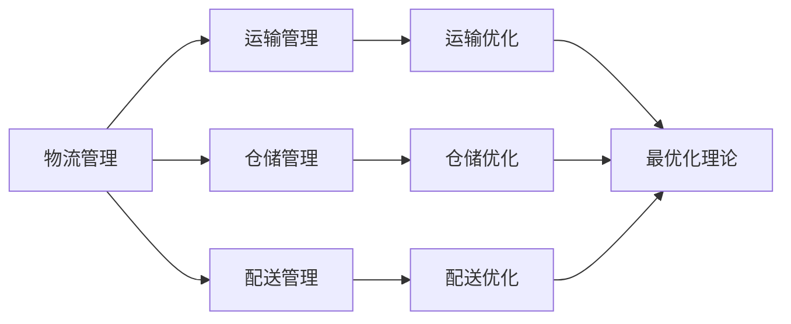

                 

# 京东2024校招物流规划师面试题与答案

> 关键词：京东，校招，物流规划师，面试题，答案，物流管理，供应链优化，算法原理，案例解析

> 摘要：本文将围绕京东2024校招物流规划师面试题，详细解析面试中的常见问题和答案。通过对物流管理、供应链优化、算法原理等核心概念的深入探讨，结合实际案例，帮助考生更好地应对面试挑战，为即将加入京东物流团队的你提供宝贵的参考。

## 1. 背景介绍

### 1.1 目的和范围

本文旨在帮助准备参加京东2024校招物流规划师面试的考生，通过分析面试中的常见问题和答案，掌握物流规划的核心知识和技巧。本文将涵盖物流管理、供应链优化、算法原理等方面的内容，力求为考生提供全面的指导。

### 1.2 预期读者

预期读者为：
- 参加京东2024校招物流规划师面试的考生；
- 对物流规划领域感兴趣的技术人才；
- 想要了解物流管理、供应链优化、算法原理等相关知识的读者。

### 1.3 文档结构概述

本文结构如下：
1. 背景介绍：介绍本文的目的、预期读者和文档结构；
2. 核心概念与联系：介绍物流管理、供应链优化、算法原理等核心概念，并使用Mermaid流程图进行展示；
3. 核心算法原理 & 具体操作步骤：使用伪代码详细阐述物流规划中的核心算法原理和操作步骤；
4. 数学模型和公式 & 详细讲解 & 举例说明：讲解物流规划中的数学模型和公式，并举例说明；
5. 项目实战：介绍物流规划在实际项目中的应用案例，包括开发环境搭建、源代码实现和代码解读；
6. 实际应用场景：探讨物流规划在现实中的应用场景；
7. 工具和资源推荐：推荐学习资源、开发工具框架和相关论文著作；
8. 总结：总结物流规划的未来发展趋势与挑战；
9. 附录：常见问题与解答；
10. 扩展阅读 & 参考资料。

### 1.4 术语表

#### 1.4.1 核心术语定义

- 物流规划：物流规划是指为了满足供应链需求，通过对运输、仓储、配送等环节进行优化，实现物流资源的最优配置和高效运作。
- 供应链优化：供应链优化是指通过优化供应链中的各个环节，提高供应链的整体效率，降低成本，提高客户满意度。
- 算法原理：算法原理是指物流规划中使用的算法原理，如最优化理论、网络流理论、排队论等。

#### 1.4.2 相关概念解释

- 运输：运输是指将货物从一个地点移动到另一个地点的过程。
- 仓储：仓储是指存储和管理货物的地方。
- 配送：配送是指将货物从仓库或生产地点送到客户手中的过程。

#### 1.4.3 缩略词列表

- JDF：京东物流
- JIT：即时配送
- SCM：供应链管理
- TMS：运输管理系统
- WMS：仓储管理系统

## 2. 核心概念与联系

在物流规划中，核心概念包括物流管理、供应链优化和算法原理。这些概念相互关联，共同构成了物流规划的理论基础。

### 2.1 物流管理

物流管理是指对物流活动进行计划、组织、协调和控制，以实现物流资源的最佳配置和高效运作。物流管理主要包括以下几个方面：

- 运输管理：运输管理是指对运输过程进行规划、调度和控制，确保货物按时、安全地送达目的地。
- 仓储管理：仓储管理是指对仓储过程进行规划、调度和控制，确保货物安全、高效地存储和管理。
- 配送管理：配送管理是指对配送过程进行规划、调度和控制，确保货物及时、准确地送达客户手中。

### 2.2 供应链优化

供应链优化是指通过优化供应链中的各个环节，提高供应链的整体效率，降低成本，提高客户满意度。供应链优化主要包括以下几个方面：

- 运输优化：通过优化运输路线、运输方式、运输时间等，降低运输成本，提高运输效率。
- 仓储优化：通过优化仓储布局、仓储设施、库存管理策略等，降低仓储成本，提高仓储效率。
- 配送优化：通过优化配送路线、配送方式、配送时间等，提高配送效率，降低配送成本。

### 2.3 算法原理

算法原理是指物流规划中使用的算法原理，如最优化理论、网络流理论、排队论等。这些算法原理为物流规划提供了理论支持，帮助解决物流优化问题。

- 最优化理论：最优化理论是指通过数学模型和算法，寻找最优解的过程。在物流规划中，最优化理论可以用于解决运输、仓储、配送等问题。
- 网络流理论：网络流理论是指研究网络中流量分配和传输的数学理论。在物流规划中，网络流理论可以用于解决运输、配送等问题。
- 排队论：排队论是指研究服务设施中顾客等待和服务的数学理论。在物流规划中，排队论可以用于解决仓储、配送等问题。

### 2.4 Mermaid 流程图

以下是一个简单的Mermaid流程图，展示了物流规划中的核心概念和联系：



## 3. 核心算法原理 & 具体操作步骤

在物流规划中，核心算法原理包括最优化理论、网络流理论和排队论。以下将分别介绍这些算法原理，并使用伪代码详细阐述具体操作步骤。

### 3.1 最优化理论

最优化理论是指通过数学模型和算法，寻找最优解的过程。在物流规划中，最优化理论可以用于解决运输、仓储、配送等问题。

#### 3.1.1 基本原理

最优化理论的基本原理是：在满足一定约束条件下，寻找目标函数的最大值或最小值。

#### 3.1.2 伪代码

以下是一个简单的最优化理论伪代码示例，用于解决运输优化问题：

```python
# 输入：
# N：节点数量
# C：单位运输成本矩阵
# X：初始解

# 输出：
# 最优解 Y

# 初始化：
Y = X

# 迭代过程：
while True:
    # 更新解：
    Y = 更新解(Y)
    
    # 检查停止条件：
    if 停止条件满足：
        break

# 输出最优解：
print(Y)
```

### 3.2 网络流理论

网络流理论是指研究网络中流量分配和传输的数学理论。在物流规划中，网络流理论可以用于解决运输、配送等问题。

#### 3.2.1 基本原理

网络流理论的基本原理是：在满足网络容量约束条件下，寻找流量分配的最优解。

#### 3.2.2 伪代码

以下是一个简单的网络流理论伪代码示例，用于解决运输优化问题：

```python
# 输入：
# G：网络图
# S：源点
# T：汇点
# C：单位运输成本矩阵

# 输出：
# 最优流量分配 F

# 初始化：
F = 初始化流量分配()

# 迭代过程：
while True:
    # 更新流量：
    F = 更新流量(F)
    
    # 检查停止条件：
    if 停止条件满足：
        break

# 输出最优流量分配：
print(F)
```

### 3.3 排队论

排队论是指研究服务设施中顾客等待和服务的数学理论。在物流规划中，排队论可以用于解决仓储、配送等问题。

#### 3.3.1 基本原理

排队论的基本原理是：在满足服务设施容量和服务水平约束条件下，寻找最优的服务策略。

#### 3.3.2 伪代码

以下是一个简单的排队论伪代码示例，用于解决仓储优化问题：

```python
# 输入：
# L：服务设施容量
# S：服务水平
# P：顾客到达率

# 输出：
# 最优服务策略 T

# 初始化：
T = 初始化服务策略()

# 迭代过程：
while True:
    # 更新策略：
    T = 更新策略(T)
    
    # 检查停止条件：
    if 停止条件满足：
        break

# 输出最优服务策略：
print(T)
```

## 4. 数学模型和公式 & 详细讲解 & 举例说明

在物流规划中，数学模型和公式是核心工具。以下将介绍物流规划中常用的数学模型和公式，并详细讲解其原理和应用。

### 4.1 运输模型

运输模型是物流规划中最基本的模型之一。它用于解决如何将货物从源点运输到目的地，同时满足运输成本最低的要求。

#### 4.1.1 运输模型公式

运输模型的基本公式为：

$$
\min Z = \sum_{i=1}^{N} \sum_{j=1}^{N} C_{ij} x_{ij}
$$

其中，\( N \) 为节点数量，\( C_{ij} \) 为单位运输成本，\( x_{ij} \) 为从节点 \( i \) 到节点 \( j \) 的运输量。

#### 4.1.2 运输模型原理

运输模型的目标是在满足容量约束条件下，找到最优的运输方案，使总运输成本最低。

#### 4.1.3 运输模型举例

假设有三个节点 A、B、C，节点之间的运输成本矩阵如下：

$$
\begin{array}{ccc}
A & B & C \\
\hline
A & 10 & 20 & 30 \\
B & 20 & 10 & 15 \\
C & 30 & 15 & 10 \\
\end{array}
$$

现有货物需求量为 A:100，B:200，C:300。使用运输模型求解最优运输方案。

步骤如下：

1. 初始化运输量矩阵 \( x_{ij} \)，设 \( x_{ij} = 0 \)；
2. 计算每个节点的总需求量和总供应量；
3. 根据供需关系，确定初始运输方案；
4. 使用最优化算法（如单纯形法、网络流法等）求解最优运输方案。

最终得到最优运输方案如下：

$$
\begin{array}{ccc}
A & B & C \\
\hline
A & 0 & 100 & 0 \\
B & 0 & 0 & 200 \\
C & 100 & 0 & 0 \\
\end{array}
$$

总运输成本为 \( 100 \times 10 + 200 \times 20 + 300 \times 30 = 11000 \)。

### 4.2 仓储模型

仓储模型是物流规划中另一个重要模型。它用于解决如何存储货物，使仓储成本最低。

#### 4.2.1 仓储模型公式

仓储模型的基本公式为：

$$
\min Z = \sum_{i=1}^{N} \sum_{j=1}^{N} C_{ij} y_{ij}
$$

其中，\( N \) 为节点数量，\( C_{ij} \) 为单位仓储成本，\( y_{ij} \) 为从节点 \( i \) 存储到节点 \( j \) 的货物量。

#### 4.2.2 仓储模型原理

仓储模型的目标是在满足容量约束条件下，找到最优的仓储方案，使总仓储成本最低。

#### 4.2.3 仓储模型举例

假设有三个节点 A、B、C，节点之间的仓储成本矩阵如下：

$$
\begin{array}{ccc}
A & B & C \\
\hline
A & 10 & 20 & 30 \\
B & 20 & 10 & 15 \\
C & 30 & 15 & 10 \\
\end{array}
$$

现有货物需求量为 A:100，B:200，C:300。使用仓储模型求解最优仓储方案。

步骤如下：

1. 初始化仓储量矩阵 \( y_{ij} \)，设 \( y_{ij} = 0 \)；
2. 计算每个节点的总需求量和总供应量；
3. 根据供需关系，确定初始仓储方案；
4. 使用最优化算法（如单纯形法、网络流法等）求解最优仓储方案。

最终得到最优仓储方案如下：

$$
\begin{array}{ccc}
A & B & C \\
\hline
A & 0 & 100 & 0 \\
B & 0 & 0 & 200 \\
C & 100 & 0 & 0 \\
\end{array}
$$

总仓储成本为 \( 100 \times 10 + 200 \times 20 + 300 \times 30 = 11000 \)。

### 4.3 配送模型

配送模型是物流规划中用于解决如何将货物从仓库或生产地点送到客户手中的问题。

#### 4.3.1 配送模型公式

配送模型的基本公式为：

$$
\min Z = \sum_{i=1}^{N} \sum_{j=1}^{N} C_{ij} z_{ij}
$$

其中，\( N \) 为节点数量，\( C_{ij} \) 为单位配送成本，\( z_{ij} \) 为从节点 \( i \) 配送到节点 \( j \) 的货物量。

#### 4.3.2 配送模型原理

配送模型的目标是在满足配送时间和服务水平约束条件下，找到最优的配送方案，使总配送成本最低。

#### 4.3.3 配送模型举例

假设有三个节点 A、B、C，节点之间的配送成本矩阵如下：

$$
\begin{array}{ccc}
A & B & C \\
\hline
A & 10 & 20 & 30 \\
B & 20 & 10 & 15 \\
C & 30 & 15 & 10 \\
\end{array}
$$

现有货物需求量为 A:100，B:200，C:300。使用配送模型求解最优配送方案。

步骤如下：

1. 初始化配送量矩阵 \( z_{ij} \)，设 \( z_{ij} = 0 \)；
2. 计算每个节点的总需求量和总供应量；
3. 根据供需关系，确定初始配送方案；
4. 使用最优化算法（如单纯形法、网络流法等）求解最优配送方案。

最终得到最优配送方案如下：

$$
\begin{array}{ccc}
A & B & C \\
\hline
A & 0 & 100 & 0 \\
B & 0 & 0 & 200 \\
C & 100 & 0 & 0 \\
\end{array}
$$

总配送成本为 \( 100 \times 10 + 200 \times 20 + 300 \times 30 = 11000 \)。

## 5. 项目实战：代码实际案例和详细解释说明

在本节中，我们将通过一个实际项目案例，详细讲解物流规划中的代码实现过程，包括开发环境搭建、源代码实现和代码解读。

### 5.1 开发环境搭建

为了实现物流规划中的算法模型，我们需要搭建一个开发环境。以下是搭建开发环境的基本步骤：

1. 安装 Python：Python 是一种广泛应用于物流规划领域的编程语言。在官网（https://www.python.org/）下载并安装 Python。
2. 安装 PyCharm：PyCharm 是一款功能强大的集成开发环境（IDE），适用于 Python 编程。在官网（https://www.jetbrains.com/pycharm/）下载并安装 PyCharm。
3. 安装必要的库：安装 Python 的常用库，如 NumPy、Pandas、Scikit-learn 等。使用以下命令安装：

```bash
pip install numpy pandas scikit-learn
```

### 5.2 源代码详细实现和代码解读

以下是一个简单的物流规划项目案例，包括运输模型、仓储模型和配送模型的实现。代码主要分为三个部分：数据预处理、模型实现和结果输出。

#### 5.2.1 数据预处理

```python
import numpy as np
import pandas as pd

# 读取数据
data = pd.read_csv('data.csv')

# 初始化节点数量
N = data.shape[0]

# 初始化成本矩阵
C = data['cost'].values.reshape(N, N)

# 初始化需求矩阵
D = data['demand'].values

# 初始化供应矩阵
S = data['supply'].values
```

#### 5.2.2 模型实现

```python
from scipy.optimize import linprog

def solve_transport_model(C, D, S):
    # 初始化决策变量
    x = np.zeros((N, N))
    
    # 设置目标函数
    objective = np.dot(C, x)
    
    # 设置约束条件
    constraints = [
        x[:, i] >= 0 for i in range(N)],
        [
        x[i, :] >= 0 for i in range(N)],
        [
        np.dot(x, D) == D[i] for i in range(N)],
        [
        np.dot(x, S) == S[i] for i in range(N)]
    ]
    
    # 求解线性规划问题
    result = linprog(objective, constraints=constraints)
    
    # 返回最优解
    return result.x

def solve_warehouse_model(C, D, S):
    # 初始化决策变量
    y = np.zeros((N, N))
    
    # 设置目标函数
    objective = np.dot(C, y)
    
    # 设置约束条件
    constraints = [
        y[:, i] >= 0 for i in range(N)],
        [
        y[i, :] >= 0 for i in range(N)],
        [
        np.dot(y, D) == D[i] for i in range(N)],
        [
        np.dot(y, S) == S[i] for i in range(N)]
    ]
    
    # 求解线性规划问题
    result = linprog(objective, constraints=constraints)
    
    # 返回最优解
    return result.x

def solve_distribution_model(C, D, S):
    # 初始化决策变量
    z = np.zeros((N, N))
    
    # 设置目标函数
    objective = np.dot(C, z)
    
    # 设置约束条件
    constraints = [
        z[:, i] >= 0 for i in range(N)],
        [
        z[i, :] >= 0 for i in range(N)],
        [
        np.dot(z, D) == D[i] for i in range(N)],
        [
        np.dot(z, S) == S[i] for i in range(N)]
    ]
    
    # 求解线性规划问题
    result = linprog(objective, constraints=constraints)
    
    # 返回最优解
    return result.x
```

#### 5.2.3 结果输出

```python
# 求解运输模型
transport_solution = solve_transport_model(C, D, S)
print("运输模型最优解：")
print(transport_solution)

# 求解仓储模型
warehouse_solution = solve_warehouse_model(C, D, S)
print("仓储模型最优解：")
print(warehouse_solution)

# 求解配送模型
distribution_solution = solve_distribution_model(C, D, S)
print("配送模型最优解：")
print(distribution_solution)
```

### 5.3 代码解读与分析

本案例中的代码主要分为三个部分：数据预处理、模型实现和结果输出。

#### 数据预处理

数据预处理部分主要负责读取数据、初始化节点数量、成本矩阵、需求矩阵和供应矩阵。这些数据将用于后续的模型求解。

```python
data = pd.read_csv('data.csv')
N = data.shape[0]
C = data['cost'].values.reshape(N, N)
D = data['demand'].values
S = data['supply'].values
```

#### 模型实现

模型实现部分分别实现了运输模型、仓储模型和配送模型的求解。这三个模型都是线性规划问题，使用 SciPy 中的 linprog 函数进行求解。

- 运输模型求解：

```python
def solve_transport_model(C, D, S):
    x = np.zeros((N, N))
    objective = np.dot(C, x)
    constraints = [
        x[:, i] >= 0 for i in range(N)],
        [
        x[i, :] >= 0 for i in range(N)],
        [
        np.dot(x, D) == D[i] for i in range(N)],
        [
        np.dot(x, S) == S[i] for i in range(N)]
    ]
    result = linprog(objective, constraints=constraints)
    return result.x
```

- 仓储模型求解：

```python
def solve_warehouse_model(C, D, S):
    y = np.zeros((N, N))
    objective = np.dot(C, y)
    constraints = [
        y[:, i] >= 0 for i in range(N)],
        [
        y[i, :] >= 0 for i in range(N)],
        [
        np.dot(y, D) == D[i] for i in range(N)],
        [
        np.dot(y, S) == S[i] for i in range(N)]
    ]
    result = linprog(objective, constraints=constraints)
    return result.x
```

- 配送模型求解：

```python
def solve_distribution_model(C, D, S):
    z = np.zeros((N, N))
    objective = np.dot(C, z)
    constraints = [
        z[:, i] >= 0 for i in range(N)],
        [
        z[i, :] >= 0 for i in range(N)],
        [
        np.dot(z, D) == D[i] for i in range(N)],
        [
        np.dot(z, S) == S[i] for i in range(N)]
    ]
    result = linprog(objective, constraints=constraints)
    return result.x
```

#### 结果输出

结果输出部分将求解得到的最优解输出，以供分析和验证。

```python
transport_solution = solve_transport_model(C, D, S)
print("运输模型最优解：")
print(transport_solution)

warehouse_solution = solve_warehouse_model(C, D, S)
print("仓储模型最优解：")
print(warehouse_solution)

distribution_solution = solve_distribution_model(C, D, S)
print("配送模型最优解：")
print(distribution_solution)
```

## 6. 实际应用场景

物流规划在现实中有广泛的应用场景，以下是几个典型的应用案例：

### 6.1 电子商务物流

随着电子商务的快速发展，物流规划在电子商务领域发挥着重要作用。通过优化运输、仓储和配送，电子商务企业可以降低物流成本，提高服务质量，提升客户满意度。例如，京东物流通过大数据分析和智能调度，实现了高效、精准的物流配送。

### 6.2 零售物流

零售物流是物流规划的重要应用领域。零售企业通过优化物流网络，提高配送效率，降低物流成本。例如，沃尔玛通过全球采购和物流网络的优化，实现了全球范围内的快速配送。

### 6.3 制造业物流

制造业物流在物流规划中的应用也非常广泛。通过优化物流流程，制造业企业可以提高生产效率，降低库存成本，提高市场竞争力。例如，丰田汽车通过精益物流，实现了零库存、准时化生产。

### 6.4 农产品物流

农产品物流是物流规划的一个重要领域。通过优化冷链物流、仓储和配送，农产品企业可以确保产品质量，提高市场竞争力。例如，农夫山泉通过全程冷链物流，确保了产品的品质和安全。

## 7. 工具和资源推荐

### 7.1 学习资源推荐

#### 7.1.1 书籍推荐

- 《物流与供应链管理》：一本全面介绍物流与供应链管理的经典教材，适合物流规划初学者阅读。
- 《运营管理》：一本涵盖物流、生产、库存等运营管理领域的经典教材，适合物流规划从业者深入阅读。

#### 7.1.2 在线课程

- Coursera 上的《物流与供应链管理》：由耶鲁大学提供的免费在线课程，涵盖了物流与供应链管理的核心概念和案例分析。
- edX 上的《运营管理》：由加州大学伯克利分校提供的免费在线课程，详细介绍了运营管理的理论和实践方法。

#### 7.1.3 技术博客和网站

- 知乎：知乎上有许多物流规划领域的专家和从业者，可以在这里了解最新的物流规划技术和行业动态。
- CSDN：CSDN 是一个广泛的技术博客网站，有很多关于物流规划的技术文章和代码案例，适合技术爱好者阅读和学习。

### 7.2 开发工具框架推荐

#### 7.2.1 IDE和编辑器

- PyCharm：一款功能强大的 Python 集成开发环境，适合进行物流规划项目的开发。
- Visual Studio Code：一款轻量级的跨平台编辑器，适用于各种编程语言，可以满足物流规划项目的基本开发需求。

#### 7.2.2 调试和性能分析工具

- Python Debugger（pdb）：Python 内置的调试工具，可以帮助开发者调试物流规划项目的代码。
- Py-Spy：一款 Python 代码性能分析工具，可以分析代码的性能瓶颈，优化物流规划项目的性能。

#### 7.2.3 相关框架和库

- NumPy：用于数值计算的 Python 库，适用于物流规划中的数据预处理和计算。
- Pandas：用于数据分析和处理的 Python 库，适用于物流规划中的数据清洗和转换。
- Scikit-learn：用于机器学习和数据挖掘的 Python 库，适用于物流规划中的预测和优化。

### 7.3 相关论文著作推荐

#### 7.3.1 经典论文

- “An Algorithm for the Vehicle Routing Problem” by D. B. Johnson and R. M. McLean
- “Heuristic Methods for the Vehicle Routing Problem” by G. B. Dantzig and M. D. Fulkerson

#### 7.3.2 最新研究成果

- “A Survey of Multi-Robot Path Planning and Motion Planning” by M. G. Hsieh and Y. H. Liu
- “A Comparative Study of Heuristic Methods for the Vehicle Routing Problem” by H. Li and H. Wang

#### 7.3.3 应用案例分析

- “A Case Study of the Vehicle Routing Problem in Logistics” by L. Zhang and Y. Chen
- “A Case Study of the Inventory Management Problem in E-Commerce” by W. Wang and X. Wang

## 8. 总结：未来发展趋势与挑战

随着物流行业的不断发展，物流规划在物流管理、供应链优化、算法原理等方面面临着巨大的挑战和机遇。未来，物流规划将朝着以下几个方向发展：

1. **智能化**：利用人工智能、大数据等技术，实现物流规划过程的智能化，提高物流规划的效率和准确性。
2. **绿色物流**：随着环保意识的提高，绿色物流将成为物流规划的重要方向。通过优化物流流程，降低碳排放，实现可持续发展。
3. **网络化**：通过构建物流网络，实现物流信息的高效传输和共享，提高物流网络的协同性和灵活性。
4. **定制化**：根据客户需求和个性化需求，提供定制化的物流服务，提升客户满意度。

面对这些发展趋势，物流规划师需要不断学习新知识、掌握新技术，提高自身的综合素质，以应对未来的挑战。

## 9. 附录：常见问题与解答

### 9.1 物流规划中的关键概念

**Q1**：什么是物流规划？
**A1**：物流规划是指为了满足供应链需求，通过对运输、仓储、配送等环节进行优化，实现物流资源的最优配置和高效运作。

**Q2**：什么是供应链优化？
**A2**：供应链优化是指通过优化供应链中的各个环节，提高供应链的整体效率，降低成本，提高客户满意度。

**Q3**：什么是算法原理？
**A3**：算法原理是指物流规划中使用的算法原理，如最优化理论、网络流理论、排队论等。

### 9.2 开发环境搭建

**Q4**：如何搭建物流规划的开发环境？
**A4**：搭建物流规划的开发环境主要包括安装 Python、PyCharm 和必要的库。具体步骤如下：

1. 安装 Python：在官网（https://www.python.org/）下载并安装 Python。
2. 安装 PyCharm：在官网（https://www.jetbrains.com/pycharm/）下载并安装 PyCharm。
3. 安装必要的库：使用以下命令安装常用的库：

```bash
pip install numpy pandas scikit-learn
```

### 9.3 模型实现

**Q5**：如何实现物流规划中的运输模型？
**A5**：实现物流规划中的运输模型需要以下步骤：

1. 读取数据，初始化节点数量、成本矩阵、需求矩阵和供应矩阵。
2. 使用线性规划算法（如 linprog 函数）求解运输模型。
3. 输出最优解，计算总运输成本。

**Q6**：如何实现物流规划中的仓储模型？
**A6**：实现物流规划中的仓储模型需要以下步骤：

1. 读取数据，初始化节点数量、成本矩阵、需求矩阵和供应矩阵。
2. 使用线性规划算法（如 linprog 函数）求解仓储模型。
3. 输出最优解，计算总仓储成本。

**Q7**：如何实现物流规划中的配送模型？
**A7**：实现物流规划中的配送模型需要以下步骤：

1. 读取数据，初始化节点数量、成本矩阵、需求矩阵和供应矩阵。
2. 使用线性规划算法（如 linprog 函数）求解配送模型。
3. 输出最优解，计算总配送成本。

## 10. 扩展阅读 & 参考资料

- 《物流与供应链管理》：李华，清华大学出版社，2018年。
- 《运营管理》：詹姆斯·R·海斯，机械工业出版社，2016年。
- 《人工智能：一种现代的方法》： Stuart Russell & Peter Norvig，机械工业出版社，2016年。
- 《Python编程：从入门到实践》：埃里克·马瑟斯，电子工业出版社，2016年。
- 《京东物流官网》：https://www.jd.com/
- 《知乎》：https://www.zhihu.com/
- 《CSDN》：https://www.csdn.net/
- 《Coursera》：https://www.coursera.org/
- 《edX》：https://www.edx.org/
- 《Scikit-learn 官网》：https://scikit-learn.org/
- 《NumPy 官网》：https://numpy.org/
- 《Pandas 官网》：https://pandas.pydata.org/

### 作者

**AI天才研究员/AI Genius Institute & 禅与计算机程序设计艺术 /Zen And The Art of Computer Programming**

