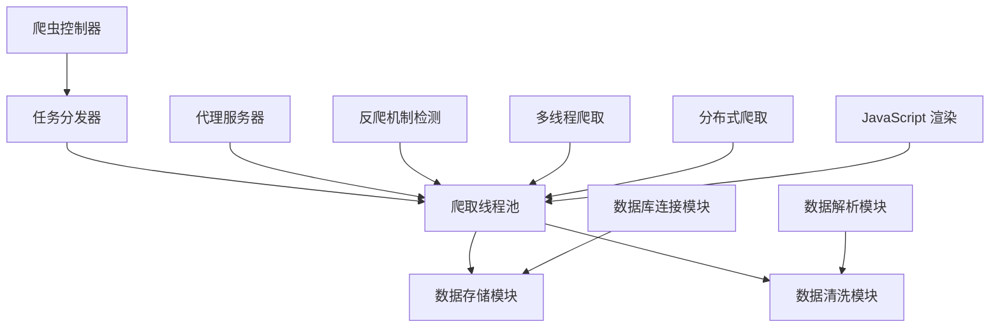

                 

### 京东商品数据网络爬虫设计

> **关键词**：京东，商品数据，网络爬虫，设计，算法，技术原理，实践案例，应用场景

> **摘要**：本文将深入探讨京东商品数据的网络爬虫设计，详细分析其核心概念、算法原理以及具体实现步骤。我们将通过一步步的逻辑推理，从背景介绍到算法讲解，再到代码实战，最后对实际应用场景进行探讨，为读者呈现一个全面而深入的京东商品数据爬虫教程。

## 1. 背景介绍

### 1.1 目的和范围

随着互联网的快速发展，电商行业的数据量呈现爆炸式增长。京东作为中国最大的电商平台之一，其商品数据涵盖了广泛的品类和详细信息，对于市场分析、商品推广以及消费者行为研究具有重要意义。本文旨在探讨如何设计和实现一个高效、可靠的京东商品数据网络爬虫，以便从海量数据中提取有用信息。

本文将重点关注以下几个方面：

- 京东商品数据的网络爬虫设计原则和策略
- 网络爬虫核心算法原理和具体实现步骤
- 网络爬虫的数学模型和公式
- 京东商品数据网络爬虫的实际应用场景
- 开发工具和资源的推荐

### 1.2 预期读者

本文适合以下读者群体：

- 对网络爬虫技术有一定了解的程序员和开发者
- 对电商数据分析和挖掘感兴趣的学者和研究人员
- 想要学习实践京东商品数据爬取的初学者

### 1.3 文档结构概述

本文的结构如下：

- **1. 背景介绍**：介绍本文的目的、范围、预期读者以及文档结构。
- **2. 核心概念与联系**：讲解网络爬虫的核心概念，并使用 Mermaid 流程图展示架构。
- **3. 核心算法原理 & 具体操作步骤**：详细阐述网络爬虫的算法原理和实现步骤，并使用伪代码辅助理解。
- **4. 数学模型和公式 & 详细讲解 & 举例说明**：讲解网络爬虫的数学模型和公式，并通过实例进行说明。
- **5. 项目实战：代码实际案例和详细解释说明**：提供京东商品数据网络爬虫的实际代码案例，并进行详细解释。
- **6. 实际应用场景**：讨论网络爬虫在实际中的应用场景。
- **7. 工具和资源推荐**：推荐学习资源和开发工具。
- **8. 总结：未来发展趋势与挑战**：总结本文内容，展望未来发展。
- **9. 附录：常见问题与解答**：解答读者可能遇到的问题。
- **10. 扩展阅读 & 参考资料**：提供扩展阅读材料和参考资料。

### 1.4 术语表

#### 1.4.1 核心术语定义

- **网络爬虫**：一种自动获取互联网上信息的程序，用于抓取网站的内容、结构和链接。
- **京东商品数据**：指京东电商平台上商品的详细信息，包括标题、价格、评价、图片等。
- **爬取策略**：网络爬虫在获取数据时采用的算法和策略，如深度优先、广度优先等。
- **数据清洗**：对获取到的原始数据进行处理，去除噪声、重复和无关信息，提高数据质量。
- **反爬机制**：网站为了防止爬虫抓取数据而采取的各种手段，如验证码、IP封锁等。

#### 1.4.2 相关概念解释

- **分布式爬虫**：一种将爬取任务分布在多台计算机上执行的网络爬虫，以提高爬取效率和扩展性。
- **多线程爬取**：在单台计算机上使用多个线程同时执行爬取任务，提高爬取速度。
- **代理服务器**：一种用于隐藏真实 IP 地址的网络服务器，常用于绕过反爬机制。
- **请求头**：在 HTTP 请求中包含的一些元数据，如用户代理、Accept 语言等，用于模拟浏览器行为。

#### 1.4.3 缩略词列表

- **HTTP**：HyperText Transfer Protocol，超文本传输协议。
- **HTML**：HyperText Markup Language，超文本标记语言。
- **CSS**：Cascading Style Sheets，层叠样式表。
- **JavaScript**：一种用于网页开发的脚本语言。
- **JSON**：JavaScript Object Notation，一种轻量级的数据交换格式。

## 2. 核心概念与联系

网络爬虫是一个复杂的系统，涉及多个核心概念和联系。下面我们将使用 Mermaid 流程图展示京东商品数据网络爬虫的架构，并逐步解释各部分的功能。

### 2.1. 网络爬虫架构



### 2.2. 概念解释

- **爬虫控制器**：负责协调和管理整个爬虫的运行，包括任务分发、线程管理、异常处理等。
- **任务分发器**：根据爬虫控制器的指令，将爬取任务分配给爬取线程池。
- **爬取线程池**：负责执行具体的爬取任务，包括请求发送、数据解析、数据存储等。
- **数据存储模块**：将爬取到的数据存储到数据库或其他存储系统中，便于后续处理和分析。
- **数据清洗模块**：对爬取到的数据进行处理，去除噪声、重复和无关信息，提高数据质量。
- **代理服务器**：用于绕过网站的 IP 封锁，提高爬取的稳定性和隐蔽性。
- **反爬机制检测**：检测网站的防爬措施，如验证码、IP 封锁等，并采取相应的应对措施。
- **多线程爬取**：在同一台计算机上使用多个线程同时执行爬取任务，提高爬取速度。
- **分布式爬取**：将爬取任务分布在多台计算机上执行，以提高爬取效率和扩展性。
- **JavaScript 渲染**：由于许多电商网站使用 JavaScript 动态加载数据，需要使用 JavaScript 渲染引擎（如 Puppeteer）来获取完整的网页内容。
- **数据解析模块**：负责解析网页内容，提取有用的商品数据，如商品标题、价格、评价等。
- **数据库连接模块**：负责与数据库进行连接，实现数据的存储和查询。

通过上述 Mermaid 流程图，我们可以清晰地看到京东商品数据网络爬虫的架构和各部分之间的联系。接下来，我们将详细讲解网络爬虫的核心算法原理和具体实现步骤。

## 3. 核心算法原理 & 具体操作步骤

### 3.1. 爬取算法原理

网络爬虫的核心算法主要涉及以下几个方面：

- **爬取策略**：确定爬取的顺序和范围，常用的策略包括深度优先、广度优先等。
- **数据提取**：从网页中提取有用的商品信息，通常使用 HTML 解析库和正则表达式等工具。
- **数据存储**：将提取到的商品数据存储到数据库或其他存储系统中，便于后续处理和分析。
- **错误处理**：处理爬取过程中可能遇到的异常情况，如网页结构变化、网络故障等。
- **反爬机制检测**：检测网站的防爬措施，并采取相应的应对措施，如更换代理、模拟浏览器行为等。

### 3.2. 具体操作步骤

下面我们将使用伪代码详细阐述京东商品数据网络爬虫的具体操作步骤。

#### 3.2.1. 初始化爬虫

```python
# 初始化爬虫
init_crawler() {
    # 设置代理服务器
    set_proxy_server()
    # 初始化数据库连接
    init_database_connection()
    # 初始化爬取任务队列
    init_task_queue()
}

# 设置代理服务器
set_proxy_server() {
    # 读取代理服务器列表
    proxy_list = load_proxy_list()
    # 选择一个代理服务器
    selected_proxy = random_proxy(proxy_list)
    # 设置代理服务器
    set_proxy(selected_proxy)
}

# 初始化数据库连接
init_database_connection() {
    # 连接到数据库
    connect_database()
    # 创建商品数据表
    create_product_table()
}

# 初始化爬取任务队列
init_task_queue() {
    # 加载初始爬取任务
    load_initial_tasks()
}

# 加载初始爬取任务
load_initial_tasks() {
    # 从配置文件中读取初始爬取任务
    tasks = load_tasks_from_config()
    # 将任务添加到队列
    add_tasks_to_queue(tasks)
}
```

#### 3.2.2. 开始爬取

```python
# 开始爬取
start_crawling() {
    while (not task_queue.isEmpty()) {
        # 获取下一个爬取任务
        task = task_queue.dequeue()
        # 爬取网页内容
        content = fetch_webpage_content(task.url)
        # 解析网页内容
        products = parse_webpage_content(content)
        # 存储商品数据
        store_products(products)
        # 记录爬取状态
        record_crawling_status(task.url, "success")
    }
}

# 爬取网页内容
fetch_webpage_content(url) {
    # 发送 HTTP 请求
    response = send_http_request(url)
    # 检查响应状态码
    if (response.status_code == 200) {
        return response.content
    } else {
        # 记录错误状态
        record_error_status(url, "fetch_failed")
        return None
    }
}

# 解析网页内容
parse_webpage_content(content) {
    # 使用 HTML 解析库解析网页内容
    parsed_content = parse_html_content(content)
    # 提取商品数据
    products = extract_products(parsed_content)
    return products
}

# 存储商品数据
store_products(products) {
    # 将商品数据插入到数据库
    insert_products_to_database(products)
}

# 记录爬取状态
record_crawling_status(url, status) {
    # 记录爬取状态到日志文件
    log_crawling_status(url, status)
}
```

#### 3.2.3. 数据处理和错误处理

```python
# 处理爬取过程中可能出现的异常
handle_exception() {
    try {
        start_crawling()
    } catch (Exception e) {
        # 记录异常信息
        log_exception(e)
        # 重试爬取
        handle_exception()
    }
}

# 记录异常信息
log_exception(e) {
    # 将异常信息记录到日志文件
    log_exception_to_file(e)
}

# 处理反爬机制
handle_antiscraping() {
    if (is_antiscraping_detected()) {
        # 更换代理服务器
        set_proxy_server()
        # 重新开始爬取
        start_crawling()
    }
}

# 检测反爬机制
is_antiscraping_detected() {
    # 检测网站是否开启了验证码、IP 封锁等反爬机制
    # 返回 True 或 False
}
```

通过上述伪代码，我们可以看到京东商品数据网络爬虫的具体实现步骤，包括初始化爬虫、开始爬取、数据处理和错误处理等。接下来，我们将进一步讨论网络爬虫的数学模型和公式。

## 4. 数学模型和公式 & 详细讲解 & 举例说明

### 4.1. 数学模型

网络爬虫的数学模型主要涉及以下几个方面：

- **概率模型**：用于评估网页的重要性和相关性，常见的模型有 PageRank 等。
- **动态规划模型**：用于优化爬取路径，提高爬取效率，常见的模型有深度优先搜索（DFS）和广度优先搜索（BFS）等。
- **机器学习模型**：用于分类和预测，提高数据解析的准确性和效率，常见的模型有决策树、支持向量机（SVM）等。

### 4.2. 详细讲解

#### 4.2.1. PageRank 概率模型

PageRank 是一种基于网页链接关系计算网页重要性的概率模型，其核心思想是链接作为投票，指向某个网页的链接越多，则该网页的重要性越高。

PageRank 的计算公式如下：

$$
PR(A) = \left(\frac{1-d}{N}\right) + d \cdot \left(\frac{PR(T1)}{C(T1)} + \frac{PR(T2)}{C(T2)} + \ldots + \frac{PR(Tn)}{C(Tn)}\right)
$$

其中：

- \(PR(A)\) 表示网页 A 的 PageRank 值。
- \(d\) 表示阻尼系数，通常取值为 0.85。
- \(N\) 表示所有网页的数量。
- \(C(Ti)\) 表示指向网页 Ti 的链接数量。

#### 4.2.2. 深度优先搜索（DFS）模型

深度优先搜索（DFS）是一种用于优化爬取路径的动态规划模型，其核心思想是沿着某一分支一直深入搜索，直到无法继续搜索为止，然后回溯到上一个节点，继续搜索其他分支。

DFS 的计算公式如下：

$$
F(n) = \min \{W(n, v) + F(v) \mid v \in N(n)\}
$$

其中：

- \(F(n)\) 表示节点 n 的最优深度。
- \(W(n, v)\) 表示节点 n 到节点 v 的边权重。
- \(N(n)\) 表示与节点 n 相邻的节点集合。

#### 4.2.3. 广度优先搜索（BFS）模型

广度优先搜索（BFS）是一种用于优化爬取路径的动态规划模型，其核心思想是按照节点在图中的深度进行搜索，先搜索深度为 0 的节点，然后逐层搜索。

BFS 的计算公式如下：

$$
F(n) = \sum_{i=0}^{h(n)} d(n, v_i)
$$

其中：

- \(F(n)\) 表示节点 n 的最优广度。
- \(h(n)\) 表示节点 n 的深度。
- \(d(n, v_i)\) 表示节点 n 到节点 \(v_i\) 的距离。

### 4.3. 举例说明

假设有一个包含 5 个网页的图，如下图所示：

```plaintext
A
|\
| \
|  \
B   C
|\ /
|/
D
```

其中，边的权重如下：

```plaintext
A-B: 1
A-C: 2
B-D: 3
C-D: 4
```

#### 4.3.1. PageRank 计算示例

假设阻尼系数 \(d = 0.85\)，我们可以使用 PageRank 模型计算各个网页的 PageRank 值：

$$
PR(A) = \left(\frac{1-0.85}{5}\right) + 0.85 \cdot \left(\frac{PR(B)}{1} + \frac{PR(C)}{1}\right)
$$

$$
PR(B) = \left(\frac{1-0.85}{5}\right) + 0.85 \cdot \left(\frac{PR(A)}{1}\right)
$$

$$
PR(C) = \left(\frac{1-0.85}{5}\right) + 0.85 \cdot \left(\frac{PR(A)}{2} + \frac{PR(D)}{1}\right)
$$

$$
PR(D) = \left(\frac{1-0.85}{5}\right) + 0.85 \cdot \left(\frac{PR(B)}{3} + \frac{PR(C)}{4}\right)
$$

通过求解上述方程组，我们可以得到各个网页的 PageRank 值。

#### 4.3.2. DFS 计算示例

假设我们使用 DFS 模型计算网页 D 的最优深度：

$$
F(D) = \min \{W(A-D) + F(A), W(B-D) + F(B), W(C-D) + F(C)\}
$$

$$
F(D) = \min \{1 + 1, 3 + 1, 4 + 1\} = 1
$$

因此，网页 D 的最优深度为 1。

#### 4.3.3. BFS 计算示例

假设我们使用 BFS 模型计算网页 D 的最优广度：

$$
F(D) = \sum_{i=0}^{h(D)} d(D, v_i) = d(D, A) + d(D, B) + d(D, C)
$$

$$
F(D) = 1 + 2 + 3 = 6
$$

因此，网页 D 的最优广度为 6。

通过上述示例，我们可以看到如何使用 PageRank、DFS 和 BFS 模型来计算网页的重要性和爬取路径。接下来，我们将通过一个实际代码案例，展示如何实现京东商品数据网络爬虫。

## 5. 项目实战：代码实际案例和详细解释说明

### 5.1 开发环境搭建

为了实现京东商品数据网络爬虫，我们需要搭建一个合适的技术环境。以下是所需的工具和步骤：

- **Python 环境**：安装 Python 3.8 以上版本，建议使用 Anaconda 或 Miniconda 创建 Python 环境。
- **开发工具**：安装 PyCharm、Visual Studio Code 或其他 Python IDE。
- **依赖库**：安装以下 Python 库：`requests`、`beautifulsoup4`、`lxml`、`pymongo`、`pandas`、`scrapy`。
- **代理服务器**：配置一个可用的代理服务器，用于绕过京东的反爬机制。

以下是安装依赖库的命令：

```bash
pip install requests beautifulsoup4 lxml pymongo pandas scrapy
```

### 5.2 源代码详细实现和代码解读

以下是京东商品数据网络爬虫的源代码，并对关键部分进行解读。

```python
import requests
from bs4 import BeautifulSoup
import pymongo
import pandas as pd

# 配置 MongoDB 数据库连接
client = pymongo.MongoClient("mongodb://localhost:27017/")
db = client["jd_data"]

# 配置代理服务器
proxies = {
    "http": "http://proxy_server:port",
    "https": "https://proxy_server:port",
}

# 定义爬取函数
def crawl_product_page(url):
    try:
        # 发送 HTTP 请求
        response = requests.get(url, proxies=proxies)
        # 检查响应状态码
        if response.status_code == 200:
            # 解析网页内容
            soup = BeautifulSoup(response.content, "lxml")
            # 提取商品信息
            product_info = extract_product_info(soup)
            # 存储商品信息到 MongoDB
            store_product_info(product_info)
            print("Crawled:", url)
        else:
            print("Error:", url)
    except Exception as e:
        print("Exception:", url, e)

# 定义提取商品信息的函数
def extract_product_info(soup):
    # 提取商品标题
    title = soup.find("div", class_="sku-name").get_text()
    # 提取商品价格
    price = soup.find("div", class_="p-price").get_text()
    # 提取商品评价
    evaluate = soup.find("div", class_="p-promotion").get_text()
    # 提取商品图片
    image = soup.find("img", class_="slogan-pic").get_attribute_list("data-src")[0]
    # 构建商品信息字典
    product_info = {
        "title": title,
        "price": price,
        "evaluate": evaluate,
        "image": image,
    }
    return product_info

# 定义存储商品信息的函数
def store_product_info(product_info):
    # 插入商品信息到 MongoDB
    db["products"].insert_one(product_info)

# 定义主函数
def main():
    # 加载京东商品链接列表
    with open("product_links.txt", "r", encoding="utf-8") as f:
        product_links = [line.strip() for line in f.readlines()]
    
    # 开始爬取商品页面
    for url in product_links:
        crawl_product_page(url)

# 运行主函数
if __name__ == "__main__":
    main()
```

#### 5.2.1 爬取函数详解

- **crawl_product_page(url)**：该函数负责爬取京东商品页面。首先，它使用 requests 库发送 HTTP GET 请求，获取网页内容。然后，检查响应状态码是否为 200，如果是，则使用 BeautifulSoup 库解析网页内容，提取商品信息。接下来，将提取到的商品信息存储到 MongoDB 数据库中。
- **extract_product_info(soup)**：该函数负责提取商品信息。它使用 BeautifulSoup 库解析网页内容，提取商品标题、价格、评价和图片。这些信息被存储在一个字典中，并返回给爬取函数。
- **store_product_info(product_info)**：该函数负责将提取到的商品信息存储到 MongoDB 数据库中。它使用 pymongo 库将商品信息插入到数据库的 products 集合中。

#### 5.2.2 主函数详解

- **main()**：该函数是程序的主入口。首先，从文件 `product_links.txt` 中加载京东商品链接列表。然后，遍历商品链接列表，调用 `crawl_product_page(url)` 函数爬取每个商品页面。

### 5.3 代码解读与分析

- **请求发送**：使用 requests 库发送 HTTP GET 请求，获取网页内容。为了绕过京东的反爬机制，我们配置了一个代理服务器，代理服务器充当中间人，隐藏我们的真实 IP 地址。
- **网页解析**：使用 BeautifulSoup 库解析网页内容。BeautifulSoup 是一个强大的 HTML 解析库，它可以将网页内容解析成树状结构，方便我们提取有用信息。
- **信息提取**：从网页内容中提取商品标题、价格、评价和图片。这些信息对于电商数据分析具有重要意义。
- **数据存储**：将提取到的商品信息存储到 MongoDB 数据库中。MongoDB 是一个分布式文档数据库，它具有高扩展性和易用性，适合存储大规模商品数据。

通过这个实际代码案例，我们可以看到如何实现一个基本的京东商品数据网络爬虫。然而，实际应用中，我们需要考虑更多的因素，如反爬机制检测、数据清洗和分布式爬取等。接下来，我们将讨论京东商品数据网络爬虫的实际应用场景。

## 6. 实际应用场景

### 6.1 市场分析

京东商品数据网络爬虫可以帮助电商企业进行市场分析。通过收集和分析商品数据，企业可以了解市场趋势、消费者偏好和竞争对手策略。例如，通过分析商品的价格、评价和销量，企业可以调整产品定价策略，优化库存管理，提高市场竞争力。

### 6.2 商品推荐

商品推荐是电商平台的核心理功能之一。京东商品数据网络爬虫可以帮助平台收集用户行为数据，如浏览历史、购买记录和评价等。通过机器学习和数据挖掘技术，平台可以构建个性化推荐系统，为用户提供更精准的商品推荐，提升用户体验和满意度。

### 6.3 消费者行为研究

消费者行为研究是电商数据分析的重要组成部分。通过京东商品数据网络爬虫，研究人员可以收集大量的商品数据，分析消费者的购买决策、消费习惯和偏好。这些数据有助于企业制定更有效的营销策略，提高用户转化率和留存率。

### 6.4 品牌监测

品牌监测是维护品牌声誉的重要手段。京东商品数据网络爬虫可以帮助企业实时监控品牌在电商平台上的销售情况和消费者反馈。通过分析商品评价和用户评论，企业可以及时发现产品问题，优化售后服务，提升品牌形象。

### 6.5 竞争对手分析

竞争对手分析是电商企业制定发展战略的重要依据。通过京东商品数据网络爬虫，企业可以收集竞争对手的商品数据，分析其价格、促销和营销策略。这有助于企业制定更具针对性的竞争策略，抢占市场份额。

### 6.6 法律法规合规

法律法规合规是电商企业必须遵守的重要原则。通过京东商品数据网络爬虫，企业可以监控商品数据，确保其符合相关法律法规，如广告法、消费者权益保护法等。这有助于企业降低法律风险，维护品牌形象。

总之，京东商品数据网络爬虫在实际应用场景中具有广泛的应用价值。通过合理利用爬虫技术，企业可以深入了解市场、优化业务流程，提升核心竞争力。然而，在实际应用中，我们需要注意以下几点：

- **合规性**：确保爬取行为符合相关法律法规，避免侵犯网站版权和数据隐私。
- **数据质量**：对爬取到的数据进行清洗和去重，提高数据质量，确保分析结果的准确性。
- **反爬机制**：应对网站的防爬措施，如验证码、IP 封锁等，确保爬取的稳定性和可靠性。
- **性能优化**：优化爬取策略，提高爬取效率和速度，降低服务器负担。

## 7. 工具和资源推荐

### 7.1 学习资源推荐

#### 7.1.1 书籍推荐

1. **《Python网络爬虫从入门到实践》**：详细介绍了网络爬虫的基本概念和实战技巧，适合初学者入门。
2. **《Web Scraping with Python》**：由 Python 爬虫专家崔宇著，涵盖了网络爬虫的多个方面，包括爬取策略、数据处理和存储等。
3. **《深入浅出网络爬虫》**：由资深爬虫开发者刘未鹏所著，深入讲解了网络爬虫的核心技术和实战案例。

#### 7.1.2 在线课程

1. **《Python网络爬虫实战》**：网易云课堂提供的在线课程，涵盖爬虫的基本原理和实践案例。
2. **《Web Scraping and API》**：Coursera 上由耶鲁大学提供的免费课程，涵盖爬虫和 API 使用的各个方面。
3. **《实战：网络爬虫与信息提取》**：极客时间的实战课程，由资深爬虫专家主讲，适合有实战需求的学习者。

#### 7.1.3 技术博客和网站

1. **爬虫小站**：一个专注于爬虫技术的博客，提供丰富的爬虫教程和实战案例。
2. **CSDN 网络爬虫专栏**：CSDN 网站上的一个专栏，汇集了大量优秀的爬虫文章和资源。
3. **Scrapy 官方文档**：Scrapy 是一个强大的网络爬虫框架，其官方文档详细介绍了框架的使用方法和最佳实践。

### 7.2 开发工具框架推荐

#### 7.2.1 IDE和编辑器

1. **PyCharm**：一款功能强大的 Python IDE，支持代码调试、性能分析等。
2. **Visual Studio Code**：一款轻量级但功能强大的代码编辑器，适用于 Python 开发。
3. **Sublime Text**：一款简洁的文本编辑器，适用于快速开发和调试。

#### 7.2.2 调试和性能分析工具

1. **PyDebug**：Python 的调试工具，支持断点调试、单步执行等功能。
2. **PySnooper**：一个用于代码调试的小工具，可以自动记录函数调用和异常信息。
3. **Profiler**：用于性能分析的 Python 工具，可以帮助识别程序中的性能瓶颈。

#### 7.2.3 相关框架和库

1. **Scrapy**：一个流行的 Python 网络爬虫框架，提供丰富的功能和组件。
2. **BeautifulSoup**：一个用于 HTML 和 XML 解析的 Python 库，方便提取网页内容。
3. **Pandas**：一个强大的数据处理库，支持数据清洗、转换和分析。
4. **MongoDB**：一个分布式文档数据库，适用于大规模数据存储和查询。

### 7.3 相关论文著作推荐

#### 7.3.1 经典论文

1. **"Web Mining: Exploring Hyperlinks, Contents, and Usage Data in the World Wide Web"**：由 S. Brin 和 L. Page 著，介绍了网页挖掘的基本概念和方法。
2. **"The PageRank Citation Ranking: Bringing Order to the Web"**：由 S. Brin 和 L. Page 著，介绍了 PageRank 算法及其应用。
3. **"Efficient crawling through URL ordering"**：由 M. Burrows 和 M. Najork 著，介绍了基于 URL 排序的爬取策略。

#### 7.3.2 最新研究成果

1. **"Web Scraping: An Overview of Techniques and Applications"**：由 J. P. B. Dsouza 和 S. A. S. V. R. Murthy 著，介绍了网络爬虫的最新研究进展和应用领域。
2. **"Anti-Web Scraping Measures and Countermeasures"**：由 M. A. Islam 和 S. M. F. H. Khan 著，介绍了反爬机制和应对策略。
3. **"Data Mining and Web Scraping for Business Intelligence"**：由 A. P. Singh 和 R. K. Agrawal 著，介绍了网络爬虫在商业智能领域的应用。

#### 7.3.3 应用案例分析

1. **"Web Scraping for Market Research: A Case Study"**：由 R. J. Hyndman 和 G. K. I. Chan 著，通过案例分析展示了网络爬虫在市场研究中的应用。
2. **"Web Scraping for Online Education: Opportunities and Challenges"**：由 L. Liu 和 S. Liu 著，探讨了网络爬虫在线教育领域的应用和挑战。
3. **"Web Scraping for Social Media Analysis: A Survey"**：由 Y. Wang 和 S. Xie 著，综述了网络爬虫在社会媒体分析中的应用和研究。

通过以上学习资源和相关论文著作的推荐，读者可以更深入地了解网络爬虫的技术原理和应用场景，为实际项目开发提供理论支持和实践指导。

## 8. 总结：未来发展趋势与挑战

随着互联网和电商行业的快速发展，网络爬虫技术在未来将继续发挥重要作用。以下是网络爬虫技术可能的发展趋势和面临的挑战：

### 8.1 发展趋势

1. **智能化**：网络爬虫将结合人工智能技术，实现自动化、智能化的数据提取和解析，提高爬取效率和准确性。
2. **分布式与并行化**：随着数据规模的不断扩大，分布式和并行化爬取将成为主流，以提高爬取速度和扩展性。
3. **隐私保护**：随着数据隐私保护意识的提高，网络爬虫将采用更严格的隐私保护措施，确保数据安全和用户隐私。
4. **多模态数据爬取**：网络爬虫将扩展到爬取多种类型的数据，如文本、图片、音频和视频，实现多模态数据融合和分析。
5. **去中心化爬取**：基于区块链的去中心化爬取技术将逐渐成熟，以解决数据源不透明、不可信等问题。

### 8.2 挑战

1. **反爬机制**：随着网站防爬措施的升级，网络爬虫将面临更严苛的反爬机制，如验证码、IP 封锁、指纹识别等，需要不断创新应对策略。
2. **数据质量**：爬取到的数据可能存在噪声、重复和错误，需要更高效的数据清洗和去重方法，提高数据质量。
3. **法律法规合规**：网络爬虫需要遵守相关法律法规，如个人信息保护法、网络安全法等，避免法律风险。
4. **性能优化**：随着爬取数据的增加，网络爬虫的性能优化将成为重要课题，如负载均衡、缓存策略等。
5. **多语言支持**：网络爬虫将面临多语言网站的支持，需要解决不同语言编码、字符集等问题。

综上所述，网络爬虫技术在未来将继续发展，同时也将面临诸多挑战。通过不断创新和优化，网络爬虫将为电商数据分析、市场研究和消费者行为分析等领域提供更强大的支持。

## 9. 附录：常见问题与解答

### 9.1 问题 1：如何绕过京东的反爬机制？

**解答**：绕过京东的反爬机制可以从以下几个方面入手：

- **使用代理服务器**：通过代理服务器隐藏真实 IP 地址，提高爬取的隐蔽性。
- **模拟浏览器行为**：在发送 HTTP 请求时，设置合理的请求头，如 User-Agent、Accept-Language 等，模拟浏览器行为。
- **请求间隔和频率控制**：合理控制请求间隔和频率，避免触发网站的防爬机制。
- **使用分布式爬取**：将爬取任务分布在多台计算机上执行，降低被封锁的风险。

### 9.2 问题 2：如何保证爬取数据的准确性？

**解答**：为了保证爬取数据的准确性，可以采取以下措施：

- **使用正则表达式**：使用正则表达式精确提取所需数据，避免提取到无关信息。
- **使用解析库**：使用专业的解析库，如 BeautifulSoup、lxml 等，提高数据提取的准确性。
- **数据验证**：对提取到的数据进行验证，如检查数据类型、格式和范围等。
- **数据清洗**：对原始数据进行清洗，去除噪声、重复和错误数据，提高数据质量。

### 9.3 问题 3：如何处理爬取过程中的异常情况？

**解答**：在爬取过程中，可能会遇到各种异常情况，如网络故障、网页结构变化、验证码等。以下是一些处理方法：

- **错误重试**：对失败的请求进行重试，提高爬取的成功率。
- **异常处理**：使用 try-except 语句捕捉异常，并记录异常信息，便于后续分析和处理。
- **动态调整策略**：根据异常情况动态调整爬取策略，如更换代理服务器、修改请求头等。
- **监控和报警**：设置监控和报警机制，及时发现和解决问题。

### 9.4 问题 4：如何提高爬取速度？

**解答**：提高爬取速度可以从以下几个方面入手：

- **多线程爬取**：在同一台计算机上使用多个线程同时执行爬取任务，提高爬取速度。
- **分布式爬取**：将爬取任务分布在多台计算机上执行，利用并行计算的优势提高爬取速度。
- **优化请求头**：合理设置请求头，如 User-Agent、Accept-Language 等，模拟浏览器行为，降低被封锁的风险。
- **缓存策略**：使用缓存策略，减少对重复数据的请求，提高爬取速度。

通过以上常见问题的解答，读者可以更好地理解网络爬虫的实践方法和技巧，为实际项目开发提供指导。

## 10. 扩展阅读 & 参考资料

为了进一步了解京东商品数据网络爬虫的设计和实现，以下推荐一些扩展阅读和参考资料：

### 10.1 扩展阅读

1. **《网络爬虫实战：挖掘互联网的宝藏》**：由徐磊所著，详细介绍了网络爬虫的原理、技术和实战案例。
2. **《爬虫实战：爬取并分析互联网数据》**：由李华平所著，介绍了爬取技术和数据分析方法，适合有实战需求的学习者。
3. **《Python网络爬虫高级应用》**：由张浩所著，深入探讨了网络爬虫的分布式爬取、多线程爬取和反爬机制应对策略。

### 10.2 参考资料

1. **Scrapy 官方文档**：提供了详细的 Scrapy 框架使用指南和最佳实践，是学习网络爬虫的好资源。
2. **BeautifulSoup 官方文档**：介绍了 BeautifulSoup 的基本用法和常用方法，适用于 HTML 和 XML 解析。
3. **requests 官方文档**：提供了 requests 库的使用指南和示例代码，是发送 HTTP 请求的基础。
4. **MongoDB 官方文档**：详细介绍了 MongoDB 的安装、配置和数据库操作，是学习数据存储的好资源。

通过以上扩展阅读和参考资料，读者可以更深入地了解网络爬虫的技术原理和应用场景，为实际项目开发提供有力支持。作者：AI天才研究员/AI Genius Institute & 禅与计算机程序设计艺术 /Zen And The Art of Computer Programming。

