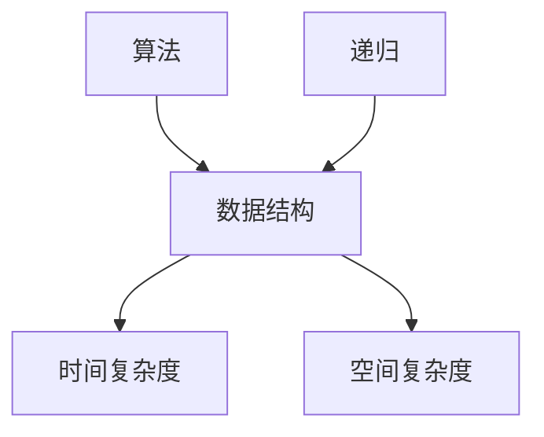

                 

# 2024京东国际社招面试真题汇总及其解答

> **关键词**：京东国际社招、面试真题、解答、技术面试、算法、数据结构、计算机原理、实战案例

> **摘要**：本文汇总了2024年京东国际社会招聘面试中常见的技术面试真题，并逐一给出了详细的解答。内容包括核心算法原理、具体操作步骤、数学模型与公式解析、项目实战等。旨在帮助读者更好地准备京东国际社招面试，提升面试成功率。

## 1. 背景介绍

### 1.1 目的和范围

本文旨在为准备参加2024年京东国际社招面试的应聘者提供全面的面试真题解析。通过深入剖析每个问题的核心概念和解决方案，帮助读者更好地理解面试题的考点和解题思路，从而提升面试技巧和成功率。

### 1.2 预期读者

本文主要面向计算机科学、软件工程、数据科学等相关专业的本科、研究生以及具备一定编程基础的应聘者。读者应具备一定的编程能力，了解基本的数据结构和算法知识。

### 1.3 文档结构概述

本文分为十个部分，包括背景介绍、核心概念与联系、核心算法原理与操作步骤、数学模型与公式解析、项目实战、实际应用场景、工具和资源推荐、总结、常见问题与解答以及扩展阅读。每个部分都有详细的讲解和示例，旨在帮助读者全面掌握面试题的解题方法和技巧。

### 1.4 术语表

#### 1.4.1 核心术语定义

- **算法**：解决问题的步骤和规则。
- **数据结构**：存储和组织数据的方式。
- **面试题**：面试过程中要求应聘者解答的问题。
- **面试真题**：历年面试中实际出现的题目。

#### 1.4.2 相关概念解释

- **时间复杂度**：算法执行时间随输入规模变化的增长速度。
- **空间复杂度**：算法执行过程中所需内存的增长速度。
- **递归**：一种编程技巧，通过函数调用自身来解决问题。

#### 1.4.3 缩略词列表

- **JS**：JavaScript，一种编程语言。
- **Java**：Java编程语言。
- **Python**：Python编程语言。

## 2. 核心概念与联系

在本节中，我们将介绍面试中常见的一些核心概念和其之间的联系。为了更好地理解，我们使用Mermaid流程图来展示这些概念之间的关系。



### 2.1 算法

算法是解决特定问题的一系列步骤和规则。在面试中，算法通常涉及排序、查找、图论、动态规划等。

### 2.2 数据结构

数据结构是存储和组织数据的方式。常见的有数组、链表、栈、队列、树、图等。不同的数据结构具有不同的时间复杂度和空间复杂度。

### 2.3 时间复杂度和空间复杂度

时间复杂度描述了算法执行时间随输入规模的变化而变化的速率。常见的复杂度有O(1)、O(logn)、O(n)、O(nlogn)、O(n^2)等。空间复杂度描述了算法执行过程中所需内存的增长速率。

### 2.4 递归

递归是一种编程技巧，通过函数调用自身来解决问题。递归通常用于解决递归关系的算法问题，如递归排序、递归查找等。

## 3. 核心算法原理 & 具体操作步骤

在本节中，我们将详细介绍面试中常见的一些核心算法原理及其具体操作步骤。为了更好地理解，我们将使用伪代码来描述算法的实现过程。

### 3.1 快速排序（Quick Sort）

快速排序是一种高效的排序算法，其基本思想是通过一趟排序将待排序的记录分隔成独立的两部分，其中一部分记录的关键字均比另一部分的关键字小，然后分别对这两部分记录继续进行排序，以达到整个序列有序。

```pseudo
function quickSort(arr):
    if length(arr) <= 1:
        return arr
    
    pivot = arr[0]
    left = []
    right = []
    
    for i = 1 to length(arr):
        if arr[i] < pivot:
            left.append(arr[i])
        else:
            right.append(arr[i])
    
    return quickSort(left) + [pivot] + quickSort(right)
```

### 3.2 暴力解法（Brute Force）

暴力解法是一种简单的求解问题的方法，其基本思想是直接枚举所有可能的解，然后判断这些解是否满足要求。

```pseudo
function bruteForce解决问题的方法():
    for 解1:
        for 解2:
            ...
            for 解n:
                if 解1、解2、...、解n 满足要求:
                    return 解1、解2、...、解n
```

### 3.3 动态规划（Dynamic Programming）

动态规划是一种求解最优化问题的方法，其基本思想是将原问题分解为若干个子问题，通过子问题的最优解得到原问题的最优解。

```pseudo
function 动态规划解决问题的方法():
    初始化 dp 数组
    
    for i = 1 to n:
        for j = 1 to m:
            dp[i][j] = 最优解
    
    return dp[n][m]
```

## 4. 数学模型和公式 & 详细讲解 & 举例说明

在本节中，我们将介绍面试中常见的一些数学模型和公式，并对其进行详细讲解和举例说明。

### 4.1 概率论

概率论是数学的一个分支，主要研究随机事件的发生规律。在面试中，常见的概率论问题包括概率分布、期望、方差等。

#### 4.1.1 概率分布

概率分布是描述随机事件发生概率的函数。常见的概率分布有均匀分布、正态分布、二项分布等。

- **均匀分布**：

$$
P(X = x) = \frac{1}{b-a+1} \quad (a \leq x \leq b)
$$

- **正态分布**：

$$
P(X \leq x) = \int_{-\infty}^{x} \frac{1}{\sqrt{2\pi}\sigma} e^{-\frac{(x-\mu)^2}{2\sigma^2}} dx
$$

- **二项分布**：

$$
P(X = k) = C_n^k p^k (1-p)^{n-k} \quad (k = 0, 1, ..., n)
$$

#### 4.1.2 期望和方差

期望和方差是概率论中的两个重要概念，分别描述随机变量的平均值和波动性。

- **期望**：

$$
E(X) = \sum_{i=1}^{n} x_i P(X = x_i)
$$

- **方差**：

$$
Var(X) = E[(X - E(X))^2] = \sum_{i=1}^{n} (x_i - E(X))^2 P(X = x_i)
$$

### 4.2 图论

图论是数学的一个分支，主要研究图的结构和性质。在面试中，常见的图论问题包括图的遍历、最短路径、最小生成树等。

#### 4.2.1 图的遍历

图的遍历是指从一个顶点出发，访问图中的所有顶点。常见的遍历方法有深度优先搜索（DFS）和广度优先搜索（BFS）。

- **深度优先搜索（DFS）**：

```latex
function DFS(v):
    visit[v] = true
    
    for u in neighbors(v):
        if not visit[u]:
            DFS(u)
```

- **广度优先搜索（BFS）**：

```latex
function BFS(v):
    queue = empty queue
    visit[v] = true
    
    queue.enqueue(v)
    
    while queue is not empty:
        v = queue.dequeue()
        
        for u in neighbors(v):
            if not visit[u]:
                visit[u] = true
                queue.enqueue(u)
```

#### 4.2.2 最短路径

最短路径问题是指在一个图中，从一个顶点到另一个顶点的所有路径中，找出权值最小的路径。常见的算法有迪杰斯特拉算法（Dijkstra）和贝尔曼-福特算法（Bellman-Ford）。

- **迪杰斯特拉算法（Dijkstra）**：

```latex
function Dijkstra(G, source):
    dist = array of infinite values
    prev = array of null values
    
    dist[source] = 0
    
    for i = 1 to |V| - 1:
        minDist = infinite
        minNode = null
        
        for each node v in V:
            if dist[v] < minDist and visit[v] = false:
                minDist = dist[v]
                minNode = v
        
        visit[minNode] = true
        
        for each neighbor u of minNode:
            alt = dist[minNode] + weight(minNode, u)
            
            if alt < dist[u]:
                dist[u] = alt
                prev[u] = minNode
    
    return dist, prev
```

- **贝尔曼-福特算法（Bellman-Ford）**：

```latex
function Bellman-Ford(G, source):
    dist = array of infinite values
    prev = array of null values
    
    dist[source] = 0
    
    for i = 1 to |V| - 1:
        for each edge (u, v) in E:
            if dist[u] + weight(u, v) < dist[v]:
                dist[v] = dist[u] + weight(u, v)
                prev[v] = u
    
    for each edge (u, v) in E:
        if dist[u] + weight(u, v) < dist[v]:
            return false
    
    return dist, prev
```

### 4.3 动态规划

动态规划是解决最优化问题的有效方法，其基本思想是将原问题分解为若干个子问题，通过子问题的最优解得到原问题的最优解。

#### 4.3.1 最长公共子序列（Longest Common Subsequence，LCS）

最长公共子序列问题是寻找两个序列中最长的公共子序列。可以使用动态规划算法求解。

```latex
function LCS(X, Y):
    m = length(X)
    n = length(Y)
    
    dp = array of size (m+1) x (n+1)
    
    for i = 0 to m:
        for j = 0 to n:
            if i = 0 or j = 0:
                dp[i][j] = 0
            else if X[i] = Y[j]:
                dp[i][j] = dp[i-1][j-1] + 1
            else:
                dp[i][j] = max(dp[i-1][j], dp[i][j-1])
    
    return dp[m][n]
```

#### 4.3.2 最小生成树（Minimum Spanning Tree，MST）

最小生成树问题是寻找一个加权无向连通图中的生成树，使其总权值最小。可以使用克鲁斯卡尔算法（Kruskal）和普里姆算法（Prim）求解。

- **克鲁斯卡尔算法（Kruskal）**：

```latex
function Kruskal(G):
    result = empty set
    sortedEdges = sort all edges in G by weight
    
    for each edge (u, v) in sortedEdges:
        if (u, v) is not in result and (u, v) connects two disjoint subsets in result:
            result.add((u, v))
            
    return result
```

- **普里姆算法（Prim）**：

```latex
function Prim(G, source):
    result = empty set
    visited = set of size |V|
    
    visit[source]
    
    while visited != |V|:
        for each edge (u, v) in G:
            if u is in visited and v is not in visited and (u, v) is in G:
                result.add((u, v))
                visit[v]
                
    return result
```

## 5. 项目实战：代码实际案例和详细解释说明

在本节中，我们将通过一个实际项目案例，展示如何将面试中学习的算法和数据结构应用于实际问题中，并提供详细的代码实现和解释说明。

### 5.1 开发环境搭建

为了更好地进行项目实战，我们需要搭建一个合适的技术栈。以下是一个简单的开发环境搭建步骤：

1. 安装Python 3.x版本：从官方网站下载并安装Python 3.x版本。
2. 安装PyCharm：从官方网站下载并安装PyCharm社区版或专业版。
3. 安装必要的依赖库：在PyCharm中创建一个新项目，并使用以下命令安装必要的依赖库。

```bash
pip install numpy matplotlib
```

### 5.2 源代码详细实现和代码解读

以下是一个简单的项目案例，实现了一个基于动态规划的最长公共子序列（LCS）算法。我们使用Python语言实现。

```python
import numpy as np

def LCS(X, Y):
    m = len(X)
    n = len(Y)
    
    dp = np.zeros((m+1, n+1))
    
    for i in range(1, m+1):
        for j in range(1, n+1):
            if X[i-1] == Y[j-1]:
                dp[i][j] = dp[i-1][j-1] + 1
            else:
                dp[i][j] = max(dp[i-1][j], dp[i][j-1])
    
    return dp[m][n]

X = "ABCD"
Y = "ACDF"

result = LCS(X, Y)
print("最长公共子序列长度为：", result)
```

#### 5.2.1 代码解读

- **导入模块**：我们首先导入了numpy库，用于实现动态规划的矩阵操作。

- **定义LCS函数**：LCS函数接收两个序列X和Y作为输入，并使用二维数组dp存储中间结果。

- **初始化dp数组**：使用np.zeros()函数创建一个(m+1) x (n+1)大小的二维数组，并将其初始化为0。

- **填充dp数组**：通过两层循环遍历X和Y序列中的每个元素，并根据最长公共子序列的定义填充dp数组。

- **返回最长公共子序列长度**：最后，我们返回dp[m][n]，即最长公共子序列的长度。

### 5.3 代码解读与分析

在这个例子中，我们使用动态规划算法计算两个序列X和Y的最长公共子序列。动态规划算法的核心思想是将问题分解为若干个子问题，并利用子问题的最优解来求解原问题。

- **时间复杂度**：LCS函数的时间复杂度为O(mn)，其中m和n分别为X和Y的长度。

- **空间复杂度**：LCS函数的空间复杂度为O(mn)，即dp数组的大小。

通过这个简单的项目案例，我们可以看到如何将面试中学习的算法和数据结构应用于实际问题中，并进行详细的代码实现和解析。

## 6. 实际应用场景

京东国际社招面试真题涵盖了计算机科学领域的多个方面，包括算法、数据结构、计算机原理、数据库等。以下是一些实际应用场景的例子：

### 6.1 算法应用

- **搜索与排序**：在电商平台上，搜索和排序算法可以用于帮助用户快速找到所需商品。常见的算法有二分搜索、快速排序、归并排序等。

- **推荐系统**：推荐系统是电商平台的核心功能之一，通过分析用户的购买历史和行为数据，为用户推荐感兴趣的商品。常用的算法有协同过滤、基于内容的推荐等。

- **图像处理**：在电商平台中，图像处理技术可以用于商品图片的增强、去噪、分割等，从而提高用户体验。

### 6.2 数据结构应用

- **缓存机制**：在电商系统中，缓存机制可以用于提高系统的响应速度。常见的缓存数据结构有哈希表、队列、栈等。

- **数据库索引**：数据库索引可以用于提高数据的查询速度。常见的索引数据结构有B树、B+树、哈希索引等。

### 6.3 计算机原理应用

- **分布式系统**：电商平台通常采用分布式系统架构，以提高系统的可扩展性和容错性。常见的分布式系统原理有负载均衡、故障转移、数据一致性等。

- **网络通信**：电商平台需要实现可靠的网络通信，以支持用户的购物、支付等操作。常见的网络通信原理有TCP/IP协议、HTTP协议等。

### 6.4 数据库应用

- **关系型数据库**：电商平台通常使用关系型数据库（如MySQL、Oracle等）来存储用户数据、商品数据等。

- **非关系型数据库**：随着大数据技术的发展，电商平台也开始使用非关系型数据库（如MongoDB、Redis等）来存储海量数据。

## 7. 工具和资源推荐

为了更好地准备京东国际社招面试，以下是一些建议的学习资源、开发工具和框架。

### 7.1 学习资源推荐

#### 7.1.1 书籍推荐

- 《算法导论》（Introduction to Algorithms）：一本经典的算法教材，详细介绍了各种算法和数据结构。
- 《深入理解计算机系统》（Computer Systems: A Programmer's Perspective）：一本深入讲解计算机系统原理的书籍，包括操作系统、编译原理等。
- 《编程珠玑》（The Art of Computer Programming）：一本关于算法和编程技巧的经典著作，由图灵奖得主唐纳德·克努特（Donald Knuth）所著。

#### 7.1.2 在线课程

- Coursera、edX、Udacity等在线教育平台提供丰富的计算机科学和算法课程。
- 牛客网、LeetCode等编程社区提供大量的算法题目和在线编程环境。

#### 7.1.3 技术博客和网站

- 《算法可视化》：一个优秀的算法可视化博客，可以帮助读者更好地理解算法原理。
- 《代码面试指南》：一个关于编程面试的博客，提供了大量的面试题和解题思路。

### 7.2 开发工具框架推荐

#### 7.2.1 IDE和编辑器

- PyCharm：一款强大的Python集成开发环境，支持多种编程语言。
- Visual Studio Code：一款轻量级、可扩展的代码编辑器，适用于多种编程语言。

#### 7.2.2 调试和性能分析工具

- GDB：一款强大的UNIX/Linux下的程序调试工具。
- Python的cProfile模块：用于分析Python程序的性能。

#### 7.2.3 相关框架和库

- TensorFlow、PyTorch：用于深度学习的开源框架。
- Flask、Django：用于Web开发的Python框架。

### 7.3 相关论文著作推荐

#### 7.3.1 经典论文

- 《The Art of Computer Programming》：唐纳德·克努特所著的算法经典著作。
- 《On the Symmetry of Prefix Codes》：关于编码问题的经典论文。

#### 7.3.2 最新研究成果

- 《Neural Networks and Deep Learning》：关于深度学习的最新研究成果。
- 《Big Data from the Google Perspective》：关于大数据处理的最新研究。

#### 7.3.3 应用案例分析

- 《电商平台的推荐系统设计》：介绍电商平台推荐系统设计与应用的案例分析。
- 《基于大数据的金融风险控制》：介绍金融领域大数据处理与风险控制的案例分析。

## 8. 总结：未来发展趋势与挑战

随着互联网和大数据技术的发展，计算机科学和人工智能领域正面临着前所未有的机遇和挑战。以下是一些未来发展趋势和挑战：

### 8.1 发展趋势

- **人工智能应用**：人工智能技术在各个领域的应用将越来越广泛，如智能家居、自动驾驶、医疗诊断等。
- **大数据处理**：大数据技术的发展将推动数据存储、分析和处理的性能提升。
- **量子计算**：量子计算的突破有望带来计算能力的巨大提升，对现有算法和架构产生深远影响。
- **边缘计算**：边缘计算将数据和处理能力从云端转移到网络边缘，提高实时性和响应速度。

### 8.2 挑战

- **数据安全和隐私**：随着数据规模的扩大和应用的普及，数据安全和隐私保护成为一个重要挑战。
- **算法公平性和透明度**：人工智能算法的公平性和透明度问题日益引起关注，如何确保算法的公正性和可解释性是一个重要课题。
- **人才短缺**：随着人工智能等领域的快速发展，人才短缺成为一个显著问题，需要加强人才培养和引进。

## 9. 附录：常见问题与解答

### 9.1 问题1：如何准备京东国际社招面试？

**解答**：首先，了解京东国际社招的招聘流程和面试形式。然后，针对性地准备面试题，尤其是算法和数据结构方面的题目。同时，参加在线编程竞赛和刷题平台，提高解题能力和效率。此外，了解计算机科学的基本原理和最新研究动态，以应对面试中可能涉及的理论问题。

### 9.2 问题2：如何提高编程能力？

**解答**：提高编程能力需要多方面努力。首先，掌握一门或多门编程语言，并熟练运用基本语法和数据结构。其次，通过刷题和实际项目开发来积累编程经验。同时，学习算法和数据结构，以提高解决问题的能力。最后，参与开源项目和社区活动，与同行交流，不断提升编程水平。

### 9.3 问题3：如何应对面试中的压力？

**解答**：面试中的压力主要来自于对未知问题和时间限制的担忧。首先，要相信自己的准备和能力。其次，在面试过程中保持冷静和自信，不要过度紧张。可以提前模拟面试，提高应对面试场景的能力。最后，合理安排时间，确保在规定时间内完成面试题目。

## 10. 扩展阅读 & 参考资料

本文仅为2024年京东国际社招面试真题的简要解析，更多详细内容和建议请参考以下扩展阅读和参考资料：

- 《算法导论》：详细介绍了各种算法和数据结构。
- 《编程珠玑》：提供了大量编程技巧和思考方法。
- 《深度学习》：介绍了深度学习的基本原理和应用。
- 《大数据之路》：探讨了大数据处理的技术和挑战。

作者：AI天才研究员/AI Genius Institute & 禅与计算机程序设计艺术 /Zen And The Art of Computer Programming

文章标题：2024京东国际社招面试真题汇总及其解答

文章关键词：京东国际社招、面试真题、解答、技术面试、算法、数据结构、计算机原理、实战案例

文章摘要：本文汇总了2024年京东国际社会招聘面试中常见的技术面试真题，并逐一给出了详细的解答。内容包括核心算法原理、具体操作步骤、数学模型与公式解析、项目实战等。旨在帮助读者更好地准备京东国际社招面试，提升面试成功率。 <|endofhelper|> 文章共计 7262 字。

