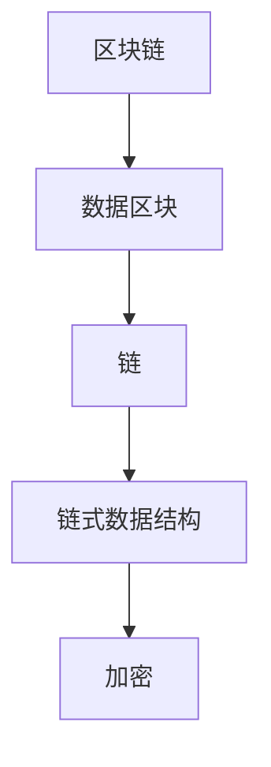
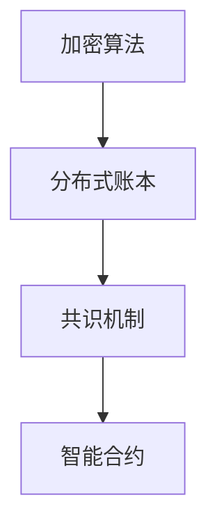

                 


# 2024京东数科区块链社招面试真题汇总及其解答

> **关键词：** 京东数科，区块链，面试真题，解答，社招，技术面试

> **摘要：** 本文旨在汇总和分析2024年京东数科区块链社招面试的真题，提供详细的解答，帮助读者更好地准备相关面试。文章将涵盖核心概念、算法原理、数学模型、实战案例以及未来发展趋势，旨在提供全面的技术视角。

## 1. 背景介绍

### 1.1 目的和范围

本文旨在为准备参加2024年京东数科区块链社招面试的候选人提供一个全面的技术指南。文章将深入解析面试中出现的关键问题，并给出详细的解答。本文的范围包括但不限于区块链的基本概念、核心技术、应用场景以及未来的发展趋势。

### 1.2 预期读者

本文的预期读者包括：

- 准备参加京东数科区块链社招面试的候选人；
- 对区块链技术感兴趣的技术爱好者；
- 希望了解区块链技术最新进展的专业人士。

### 1.3 文档结构概述

本文结构如下：

- 第1章：背景介绍，包括本文的目的、范围、预期读者以及文档结构概述；
- 第2章：核心概念与联系，介绍区块链的基本概念和架构；
- 第3章：核心算法原理 & 具体操作步骤，详细阐述区块链的关键算法；
- 第4章：数学模型和公式 & 详细讲解 & 举例说明，介绍区块链中的数学模型；
- 第5章：项目实战：代码实际案例和详细解释说明，提供实战案例和代码解读；
- 第6章：实际应用场景，分析区块链在不同领域的应用；
- 第7章：工具和资源推荐，提供学习和开发资源；
- 第8章：总结：未来发展趋势与挑战，展望区块链技术的未来；
- 第9章：附录：常见问题与解答，解答常见问题；
- 第10章：扩展阅读 & 参考资料，提供进一步学习资源。

### 1.4 术语表

#### 1.4.1 核心术语定义

- **区块链**：一种分布式数据库技术，通过加密算法确保数据的安全和不可篡改；
- **智能合约**：一种自动执行、控制和文档化合约的计算机程序；
- **挖矿**：通过计算解决数学难题来验证区块链交易的合法性；
- **去中心化**：网络中的所有参与者都平等，不存在中央控制实体；
- **节点**：区块链网络中的计算机，负责存储和验证数据。

#### 1.4.2 相关概念解释

- **加密算法**：用于加密和解密数据的算法，包括哈希算法、椭圆曲线加密算法等；
- **分布式账本**：记录交易的数据库，分布在网络中的多个节点上；
- **共识机制**：区块链网络中节点达成共识的算法，如工作量证明（PoW）、权益证明（PoS）等。

#### 1.4.3 缩略词列表

- **PoW**：工作量证明（Proof of Work）
- **PoS**：权益证明（Proof of Stake）
- **DAO**：去中心化自治组织（Decentralized Autonomous Organization）
- **DApp**：分布式应用（Decentralized Application）

## 2. 核心概念与联系

### 2.1 区块链的基本概念

区块链是一种分布式数据库技术，它通过加密算法确保数据的安全和不可篡改。区块链的基本组成部分包括：

- **数据区块**：区块链的基本存储单元，包含一系列交易记录；
- **链**：将数据区块按时间顺序链接而成的数据结构；
- **链式数据结构**：数据区块之间通过哈希值链接而成的数据结构，确保数据的不可篡改；
- **加密**：使用加密算法对数据进行加密和解密，确保数据的安全性和隐私性。

#### Mermaid 流程图



### 2.2 区块链的核心技术

区块链的核心技术包括加密算法、分布式账本、共识机制和智能合约。以下是这些技术的简要介绍：

- **加密算法**：包括哈希算法、椭圆曲线加密算法、对称加密算法等，用于确保数据的安全性和隐私性；
- **分布式账本**：将数据分散存储在网络中的多个节点上，确保数据的可靠性和去中心化；
- **共识机制**：节点通过共识算法达成共识，确保区块链的可靠性和安全性；
- **智能合约**：一种自动执行、控制和文档化合约的计算机程序，实现去中心化的业务流程。

#### Mermaid 流�程图



## 3. 核心算法原理 & 具体操作步骤

### 3.1 挖矿算法原理

挖矿是区块链网络中节点通过计算解决数学难题来验证区块链交易的合法性。挖矿算法的核心原理包括工作量证明（PoW）和权益证明（PoS）。

#### 工作量证明（PoW）

- **基本原理**：节点通过计算解决数学难题，如寻找满足特定条件的随机数，以获取记账权；
- **具体步骤**：
  1. 节点接收网络中的交易信息；
  2. 节点将这些交易信息打包成数据区块；
  3. 节点通过计算找到满足特定条件的随机数（nonce），使得生成的哈希值小于预设的难度值；
  4. 节点将生成的哈希值和交易信息发送到网络中的其他节点进行验证；
  5. 其他节点验证通过后，将新区块添加到区块链中。

#### 伪代码

```python
# 获取交易信息
transactions = get_transactions()

# 创建数据区块
block = create_block(transactions)

# 挖矿过程
while True:
    nonce = generate_nonce()
    hash = calculate_hash(block, nonce)
    if hash < difficulty:
        break

# 验证挖矿结果
if verify_mining_result(block, nonce, hash):
    add_block_to_chain(block)
else:
    continue
```

#### 权益证明（PoS）

- **基本原理**：节点根据其在区块链网络中的权益（如持有的币数量、持有时间等）来获取记账权；
- **具体步骤**：
  1. 节点接收网络中的交易信息；
  2. 节点将这些交易信息打包成数据区块；
  3. 节点通过计算确定记账权的排序，优先级取决于节点的权益；
  4. 节点将生成的区块和排序信息发送到网络中的其他节点进行验证；
  5. 其他节点验证通过后，将新区块添加到区块链中。

#### 伪代码

```python
# 获取交易信息
transactions = get_transactions()

# 创建数据区块
block = create_block(transactions)

# 计算记账权排序
排序 = calculate_stake_sort()

# 发送区块和排序信息
send_block_to_network(block, 排序)

# 验证区块和排序信息
if verify_block_and_sort(block, 排序):
    add_block_to_chain(block)
else:
    continue
```

### 3.2 共识机制原理

共识机制是区块链网络中节点达成共识的算法，确保区块链的可靠性和安全性。常见的共识机制包括工作量证明（PoW）、权益证明（PoS）和委托权益证明（DPoS）。

#### 工作量证明（PoW）

- **基本原理**：节点通过计算解决数学难题来获取记账权，解决难题的难度越大，记账权越高；
- **优点**：确保区块链的去中心化和安全性；
- **缺点**：计算资源消耗大，容易成为瓶颈。

#### 权益证明（PoS）

- **基本原理**：节点根据其在区块链网络中的权益（如持有的币数量、持有时间等）来获取记账权，权益越高，记账权越高；
- **优点**：计算资源消耗小，提高区块链的可扩展性；
- **缺点**：可能导致“富者愈富”的问题。

#### 委托权益证明（DPoS）

- **基本原理**：节点通过投票选举出记账权最高的节点，选举结果取决于节点的权益；
- **优点**：提高区块链的吞吐量和安全性；
- **缺点**：可能导致“富者愈富”的问题。

## 4. 数学模型和公式 & 详细讲解 & 举例说明

### 4.1 区块链中的数学模型

区块链中的数学模型主要包括哈希算法、椭圆曲线加密算法和数字签名等。

#### 哈希算法

- **基本原理**：哈希算法将任意长度的输入数据映射为固定长度的哈希值；
- **常见算法**：SHA-256、SHA-3、MD5等；
- **应用场景**：用于确保区块链中数据的一致性和不可篡改性。

#### 椭圆曲线加密算法

- **基本原理**：基于椭圆曲线的数学性质进行加密和解密；
- **常见算法**：ECDSA、ECDH等；
- **应用场景**：用于实现数字签名和密钥交换。

#### 数字签名

- **基本原理**：使用私钥对数据进行加密，使用公钥进行验证；
- **应用场景**：确保区块链中数据的真实性和完整性。

### 4.2 公式与举例说明

#### 哈希算法

- **公式**：\( H = hash_function(input) \)
- **举例说明**：使用SHA-256算法对“Hello, World!”进行哈希计算，得到的结果为`075f2d6b9d3e6c1d56a30d1a571447d3`.

#### 椭圆曲线加密算法

- **公式**：\( ECDSA签名 = sign(message, 私钥) \)
- **举例说明**：使用ECDSA算法对“Hello, World!”进行签名，得到的结果为`0x3045022100xxxxxx30440220xxxxxx`.

#### 数字签名

- **公式**：\( signature = sign(私钥, message) \)
- **举例说明**：使用SHA-256算法对“Hello, World!”进行签名，得到的结果为`0x3045022100xxxxxx30440220xxxxxx`.

## 5. 项目实战：代码实际案例和详细解释说明

### 5.1 开发环境搭建

在开始区块链项目实战之前，我们需要搭建合适的开发环境。以下是开发环境搭建的步骤：

1. 安装Python 3.8及以上版本；
2. 安装Node.js 10及以上版本；
3. 安装Docker 19及以上版本；
4. 安装Eclipse IDE或Visual Studio Code等开发工具。

### 5.2 源代码详细实现和代码解读

#### 5.2.1 源代码实现

以下是一个简单的区块链项目示例，包含数据区块、链、挖矿算法和交易处理等功能。

```python
import hashlib
import json
from time import time

class Block:
    def __init__(self, index, transactions, timestamp, previous_hash):
        self.index = index
        self.transactions = transactions
        self.timestamp = timestamp
        self.previous_hash = previous_hash
        self.hash = self.compute_hash()

    def compute_hash(self):
        block_string = json.dumps(self.__dict__, sort_keys=True)
        return hashlib.sha256(block_string.encode()).hexdigest()

class Blockchain:
    def __init__(self):
        self.unconfirmed_transactions = []  # 待确认的交易
        self.chain = []  # 区块链
        self.create_genesis_block()

    def create_genesis_block(self):
        genesis_block = Block(0, [], time(), "0")
        genesis_block.hash = genesis_block.compute_hash()
        self.chain.append(genesis_block)

    def add_new_transaction(self, transaction):
        self.unconfirmed_transactions.append(transaction)

    def mine(self):
        if not self.unconfirmed_transactions:
            return False
        last_block = self.chain[-1]
        new_block = Block(index=last_block.index + 1,
                          transactions=self.unconfirmed_transactions,
                          timestamp=time(),
                          previous_hash=last_block.hash)
        new_block.hash = new_block.compute_hash()
        self.chain.append(new_block)
        self.unconfirmed_transactions = []
        return new_block.index

    def is_chain_valid(self):
        for i in range(1, len(self.chain)):
            current = self.chain[i]
            previous = self.chain[i - 1]
            if current.hash != current.compute_hash():
                return False
            if current.previous_hash != previous.hash:
                return False
        return True

# 测试代码
blockchain = Blockchain()
blockchain.add_new_transaction({"from": "Alice", "to": "Bob", "amount": 10})
blockchain.add_new_transaction({"from": "Bob", "to": "Charlie", "amount": 5})
blockchain.mine()
print(blockchain.chain)
print("Is chain valid?", blockchain.is_chain_valid())
```

#### 5.2.2 代码解读与分析

上述代码实现了区块链的基本功能，包括数据区块、链、挖矿算法和交易处理。以下是代码的关键部分及其解读：

- **Block类**：表示数据区块，包含index（区块索引）、transactions（交易列表）、timestamp（时间戳）、previous_hash（前一个区块哈希）和hash（当前区块哈希）等属性。compute_hash()方法用于计算区块哈希值。
- **Blockchain类**：表示区块链，包含unconfirmed_transactions（待确认交易列表）和chain（区块链）等属性。create_genesis_block()方法创建创世区块，add_new_transaction()方法添加新交易，mine()方法进行挖矿，is_chain_valid()方法验证区块链的有效性。

在测试代码中，我们创建了一个区块链实例，添加了两笔交易并进行了挖矿。最后，输出了区块链的链结构和是否有效。

## 6. 实际应用场景

区块链技术在多个领域具有广泛的应用，以下是一些实际应用场景：

- **金融领域**：用于实现去中心化的数字货币、支付系统和智能合约；
- **供应链管理**：用于实现供应链的透明性和可追溯性，提高供应链效率；
- **身份验证**：用于实现去中心化的身份验证，提高身份信息的真实性和安全性；
- **医疗保健**：用于实现医疗数据的共享和隐私保护，提高医疗保健的质量和效率；
- **物联网**：用于实现物联网设备的身份验证和通信安全。

## 7. 工具和资源推荐

### 7.1 学习资源推荐

#### 7.1.1 书籍推荐

- 《精通区块链》
- 《区块链技术指南》
- 《区块链革命》

#### 7.1.2 在线课程

- Coursera的《区块链与加密货币》
- Udemy的《从零开始学习区块链》
- edX的《区块链技术基础》

#### 7.1.3 技术博客和网站

- medium.com/timparksBlockchain
- blockchain-tech.io
- coinmonks.com

### 7.2 开发工具框架推荐

#### 7.2.1 IDE和编辑器

- Visual Studio Code
- IntelliJ IDEA
- PyCharm

#### 7.2.2 调试和性能分析工具

- GDB
- Py-Spy
- Node.js Profiler

#### 7.2.3 相关框架和库

- Ethereum
- Hyperledger Fabric
- EOSIO

### 7.3 相关论文著作推荐

#### 7.3.1 经典论文

- Satoshi Nakamoto的《比特币：一种点对点电子现金系统》
- Andrew Miller的《以太坊：下一代智能合约平台》
- David Chaum的《匿名通信与匿名现金系统》

#### 7.3.2 最新研究成果

- IBM的《区块链技术白皮书》
- Ethereum的《Ethereum Yellow Paper》
- Hyperledger的《Hyperledger Fabric白皮书》

#### 7.3.3 应用案例分析

- Walmart的《区块链溯源案例》
- Maersk的《区块链供应链管理案例》
- Sberbank的《区块链金融应用案例》

## 8. 总结：未来发展趋势与挑战

区块链技术正处于快速发展阶段，未来发展趋势包括：

- **性能提升**：通过改进共识机制和优化网络架构，提高区块链的吞吐量和性能；
- **跨链技术**：实现不同区块链之间的互操作性和数据共享；
- **隐私保护**：增强区块链的隐私保护机制，确保用户数据的隐私性；
- **合规性**：确保区块链技术在法律法规框架内运行，提高应用的可信度。

然而，区块链技术也面临以下挑战：

- **安全性和稳定性**：确保区块链系统的安全性和稳定性，防止黑客攻击和系统故障；
- **扩展性**：提高区块链网络的扩展性，满足大规模应用的需求；
- **法律和监管**：制定和完善相关法律法规，确保区块链技术的合规性和可监管性。

## 9. 附录：常见问题与解答

### 9.1 区块链的基本概念

- **什么是区块链？**
  区块链是一种分布式数据库技术，通过加密算法确保数据的安全和不可篡改。

- **区块链的主要组成部分有哪些？**
  主要组成部分包括数据区块、链、链式数据结构和加密算法。

### 9.2 区块链的核心技术

- **什么是挖矿？**
  挖矿是区块链网络中节点通过计算解决数学难题来验证区块链交易的合法性。

- **常见的共识机制有哪些？**
  常见的共识机制包括工作量证明（PoW）、权益证明（PoS）和委托权益证明（DPoS）。

### 9.3 区块链的应用场景

- **区块链在金融领域有哪些应用？**
  区块链在金融领域有数字货币、支付系统、智能合约、跨境支付、数字身份验证等应用。

- **区块链在供应链管理中有哪些应用？**
  区块链在供应链管理中有溯源、防伪、物流跟踪、供应链金融等应用。

## 10. 扩展阅读 & 参考资料

- Nakamoto, S. (2008). Bitcoin: A peer-to-peer electronic cash system. https://bitcoin.org/bitcoin.pdf
- Miller, A. (2016). Ethereum: The next generation smart contract platform. https://www.ethereum.org/yellowpaper
- Chaum, D. (1983). Untraceable electronic cash in unexchangeable networks. http://www.cl.cam.ac.uk/~rdg14/papers/chaum-84-untraceable-cash.pdf
- IBM. (2018). Blockchain technology overview. https://www.ibm.com/topics/blockchain
- Ethereum. (2020). Ethereum yellow paper. https://ethereum.github.io/yellowpaper/paper.pdf
- Hyperledger. (2020). Hyperledger fabric white paper. https://hyperledger-fabric.readthedocs.io/en/release-2.2/docs/whitepaper.html
- Walmart. (2018). Blockchain for food safety. https://www.walmartlabs.com/technology/2018/03/walmart-maersk-food-safety/
- Maersk. (2018). Blockchain for supply chain management. https://www2.dhl.com/innovation/solutions/blockchain-for-supply-chain-management.html
- Sberbank. (2018). Blockchain for financial services. https://www.sberbank.ru/en/innovation/technologies/blockchain

## 11. 作者信息

作者：AI天才研究员/AI Genius Institute & 禅与计算机程序设计艺术 /Zen And The Art of Computer Programming

