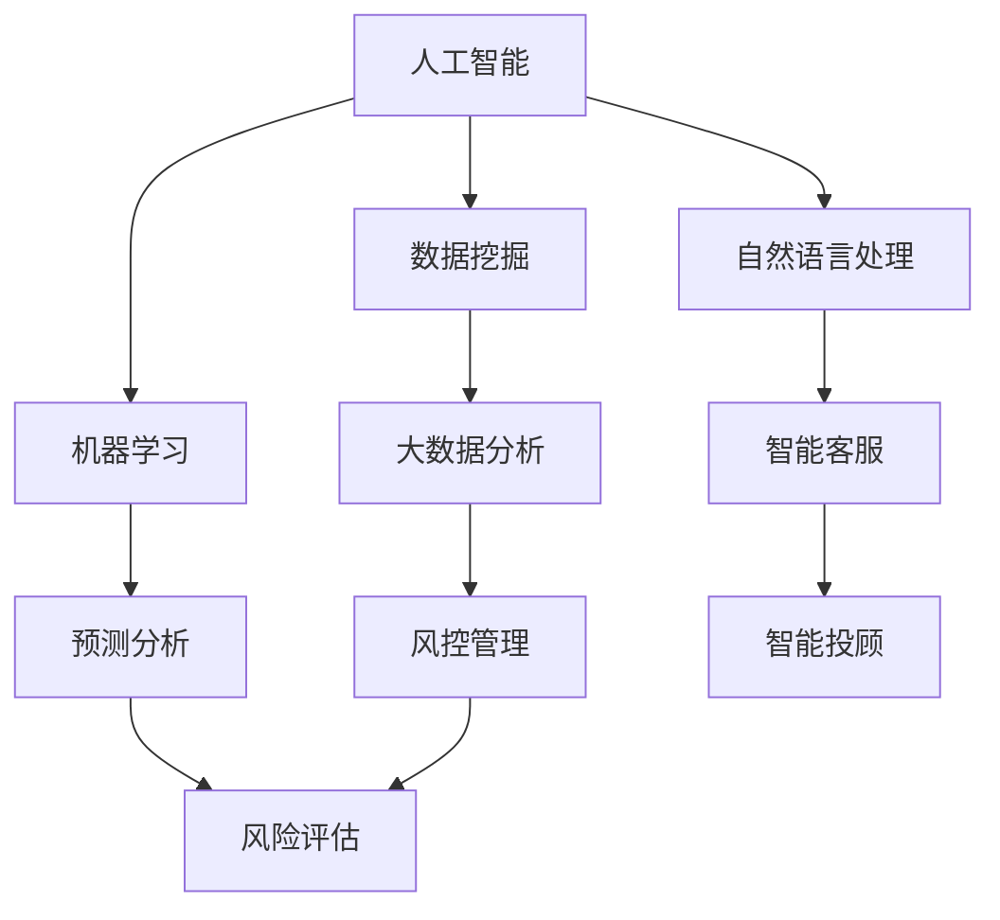

                 

# 京东科技2025社招金融科技工程师面试经验谈

> **关键词：** 京东科技、社招、金融科技、面试经验、工程师
>
> **摘要：** 本文将分享一位金融科技工程师在京东科技2025社招中的面试经历，从背景介绍到面试准备、面试过程、面试技巧，再到面试结果分析，全面解析面试过程中的关键点，为即将参加面试的金融科技工程师提供有益的参考和指导。

## 1. 背景介绍

### 1.1 目的和范围

本文旨在通过一位金融科技工程师在京东科技2025社招中的面试经历，为即将参加面试的金融科技工程师提供有价值的参考和指导。文章将详细描述面试的准备过程、面试过程中的表现和收获，以及面试结果的分析。希望通过本文，能够帮助读者更好地应对金融科技领域的面试挑战。

### 1.2 预期读者

本文适合以下读者群体：

1. 即将参加金融科技领域面试的工程师；
2. 对金融科技领域感兴趣的技术人员；
3. 想了解金融科技面试流程和技巧的人士。

### 1.3 文档结构概述

本文分为十个部分：

1. 背景介绍：介绍本文的目的、范围、预期读者和文档结构；
2. 核心概念与联系：介绍金融科技的基本概念和架构；
3. 核心算法原理 & 具体操作步骤：讲解金融科技中涉及的核心算法原理和操作步骤；
4. 数学模型和公式 & 详细讲解 & 举例说明：讲解金融科技中的数学模型和公式，并举例说明；
5. 项目实战：分享一个实际金融科技项目的代码案例和解析；
6. 实际应用场景：分析金融科技在不同场景下的应用；
7. 工具和资源推荐：推荐学习资源和开发工具；
8. 总结：未来发展趋势与挑战；
9. 附录：常见问题与解答；
10. 扩展阅读 & 参考资料。

### 1.4 术语表

#### 1.4.1 核心术语定义

- **金融科技**：指运用人工智能、大数据、区块链等先进技术，实现金融业务的创新和优化。
- **工程师**：指在金融科技领域从事研发、实施、运营等工作的人员。

#### 1.4.2 相关概念解释

- **面试**：指雇主和求职者之间的一种正式交流过程，旨在评估求职者的能力、素质和潜力。
- **面试技巧**：指在面试过程中，求职者应具备的沟通、表达、逻辑思维等能力。

#### 1.4.3 缩略词列表

- **AI**：人工智能
- **大数据**：数据量巨大，无法用常规软件工具进行捕捉、管理和处理的复杂数据集
- **区块链**：一种去中心化的分布式数据库技术，可用于金融、物流、医疗等领域

## 2. 核心概念与联系

在金融科技领域，核心概念主要包括人工智能、大数据、区块链等。以下是一个简化的Mermaid流程图，展示这些核心概念之间的联系：



### 2.1 人工智能

人工智能（AI）是指模拟、延伸和扩展人类智能的理论、方法、技术及应用。它包括多个子领域，如数据挖掘、机器学习、自然语言处理等。

- **数据挖掘**：从大量数据中提取出有价值的信息和知识。
- **机器学习**：利用数据训练模型，实现自动识别、预测和决策等功能。
- **自然语言处理**：使计算机能够理解、生成和处理自然语言。

### 2.2 大数据

大数据是指数据量巨大、无法用常规软件工具进行捕捉、管理和处理的复杂数据集。大数据技术包括数据采集、存储、处理、分析和可视化等环节。

- **数据分析**：对大量数据进行分析，提取有价值的信息。
- **数据挖掘**：从数据中发现潜在的规律和趋势。
- **大数据平台**：提供数据存储、计算、处理和分析等功能。

### 2.3 区块链

区块链是一种去中心化的分布式数据库技术，具有高可靠性、安全性和透明性。它被广泛应用于金融、物流、医疗等领域。

- **分布式账本**：实现去中心化的数据存储和管理。
- **智能合约**：自动执行合同条款，提高交易效率。
- **加密算法**：确保数据的安全性和隐私性。

## 3. 核心算法原理 & 具体操作步骤

在金融科技领域，核心算法主要包括机器学习、数据挖掘和区块链等。以下将分别介绍这些算法的原理和具体操作步骤。

### 3.1 机器学习

机器学习（Machine Learning，ML）是一种让计算机通过数据自动学习和改进的方法。其基本原理是通过大量数据训练模型，使模型能够对新数据进行预测和决策。

**机器学习的基本步骤：**

1. **数据收集**：收集大量的数据，包括训练数据和测试数据。
2. **数据预处理**：对数据进行清洗、去重、归一化等处理，使其符合模型训练的要求。
3. **模型选择**：选择合适的机器学习模型，如线性回归、决策树、神经网络等。
4. **模型训练**：使用训练数据对模型进行训练，使其能够对新的数据进行预测。
5. **模型评估**：使用测试数据对模型进行评估，判断其性能和可靠性。
6. **模型优化**：根据评估结果对模型进行调整和优化。

### 3.2 数据挖掘

数据挖掘（Data Mining，DM）是从大量数据中提取出有价值的信息和知识的过程。其基本原理是通过数据分析和模式识别，发现数据中的潜在规律和趋势。

**数据挖掘的基本步骤：**

1. **数据理解**：对数据的基本情况进行了解，包括数据来源、数据类型、数据分布等。
2. **数据预处理**：对数据进行清洗、去重、归一化等处理，使其符合挖掘算法的要求。
3. **确定挖掘任务**：根据业务需求，确定数据挖掘的目标和任务。
4. **选择挖掘算法**：选择合适的挖掘算法，如关联规则挖掘、聚类分析、分类分析等。
5. **挖掘结果评估**：对挖掘结果进行评估，判断其是否满足业务需求。
6. **挖掘结果可视化**：将挖掘结果以图表、报告等形式进行可视化展示。

### 3.3 区块链

区块链（Blockchain）是一种去中心化的分布式数据库技术，具有高可靠性、安全性和透明性。其基本原理是通过加密算法和分布式存储技术，确保数据的安全性和完整性。

**区块链的基本操作步骤：**

1. **数据收集**：收集需要存储的数据，如交易信息、身份信息等。
2. **数据加密**：使用加密算法对数据进行加密，确保数据的隐私性和安全性。
3. **数据存储**：将加密后的数据存储在分布式节点上，实现去中心化存储。
4. **数据验证**：通过分布式节点之间的共识机制，对数据进行验证，确保数据的真实性。
5. **数据访问**：用户可以通过区块链网络访问和查询数据，实现数据的透明性和可追溯性。

## 4. 数学模型和公式 & 详细讲解 & 举例说明

在金融科技领域，数学模型和公式是分析和解决问题的基本工具。以下将介绍几个常用的数学模型和公式，并进行详细讲解和举例说明。

### 4.1 线性回归模型

线性回归模型（Linear Regression Model）是一种用于预测数值型变量的统计模型。其基本公式为：

$$
y = \beta_0 + \beta_1x_1 + \beta_2x_2 + ... + \beta_nx_n + \epsilon
$$

其中，$y$ 是因变量，$x_1, x_2, ..., x_n$ 是自变量，$\beta_0, \beta_1, \beta_2, ..., \beta_n$ 是模型参数，$\epsilon$ 是误差项。

**举例说明：**

假设我们想要预测某只股票的价格，可以使用线性回归模型，选取股票的历史价格和交易量作为自变量，预测未来一段时间内的股票价格。

首先，收集股票的历史价格和交易量数据，然后使用线性回归模型进行训练，得到模型的参数。最后，使用训练好的模型进行预测，预测未来一段时间内的股票价格。

### 4.2 决策树模型

决策树模型（Decision Tree Model）是一种用于分类和回归的决策模型。其基本结构是一个树形结构，每个节点代表一个特征，每个分支代表一个特征值，每个叶子节点代表一个预测结果。

**举例说明：**

假设我们要对一组客户进行分类，根据客户的年龄、收入、购买历史等特征，将客户分为“高潜力客户”和“低潜力客户”。可以使用决策树模型来构建分类模型。

首先，收集客户的年龄、收入、购买历史等数据，然后使用决策树算法构建分类模型。最后，使用训练好的模型对新的客户数据进行分类，判断其是否为“高潜力客户”。

### 4.3 时间序列模型

时间序列模型（Time Series Model）是一种用于分析和预测时间序列数据的统计模型。其基本公式为：

$$
y_t = \phi_0 + \phi_1y_{t-1} + \phi_2y_{t-2} + ... + \phi_ny_{t-n} + \epsilon_t
$$

其中，$y_t$ 是时间序列数据在$t$时刻的值，$\phi_0, \phi_1, \phi_2, ..., \phi_n$ 是模型参数，$\epsilon_t$ 是误差项。

**举例说明：**

假设我们要预测某只股票在未来一段时间内的价格，可以使用时间序列模型，选取股票的历史价格作为时间序列数据，预测未来一段时间内的股票价格。

首先，收集股票的历史价格数据，然后使用时间序列模型进行训练，得到模型的参数。最后，使用训练好的模型进行预测，预测未来一段时间内的股票价格。

## 5. 项目实战：代码实际案例和详细解释说明

为了更好地理解金融科技中的算法原理和数学模型，以下将分享一个实际金融科技项目的代码案例，并对代码进行详细解释说明。

### 5.1 开发环境搭建

在进行代码实现之前，需要搭建一个合适的开发环境。我们选择Python作为编程语言，并使用以下工具和库：

- **Python 3.8**：Python的版本要求
- **Jupyter Notebook**：用于编写和运行代码
- **Scikit-learn**：用于机器学习和数据挖掘
- **Pandas**：用于数据处理
- **NumPy**：用于数值计算

### 5.2 源代码详细实现和代码解读

以下是一个简单的金融科技项目，使用线性回归模型预测股票价格。代码如下：

```python
import pandas as pd
from sklearn.linear_model import LinearRegression

# 读取股票数据
data = pd.read_csv('stock_data.csv')
X = data[['price', 'volume']]
y = data['close']

# 创建线性回归模型
model = LinearRegression()

# 训练模型
model.fit(X, y)

# 预测股票价格
predictions = model.predict(X)

# 打印预测结果
print(predictions)
```

**代码解读：**

1. 导入所需的库和模块，包括Pandas、Scikit-learn和NumPy。
2. 读取股票数据，将价格和交易量作为自变量（X），将收盘价作为因变量（y）。
3. 创建线性回归模型。
4. 使用训练数据对模型进行训练。
5. 使用训练好的模型进行预测，得到预测结果。
6. 打印预测结果。

### 5.3 代码解读与分析

1. **数据读取与预处理：**

   使用Pandas库读取股票数据，将价格和交易量作为自变量，收盘价作为因变量。在实际项目中，可能需要对数据进行清洗和预处理，如去除缺失值、异常值等。

2. **线性回归模型：**

   使用Scikit-learn库创建线性回归模型。线性回归模型是一种常用的统计模型，可以用于预测数值型变量。

3. **模型训练与预测：**

   使用训练数据对线性回归模型进行训练，得到模型的参数。然后，使用训练好的模型对新的数据进行预测，得到预测结果。

4. **打印预测结果：**

   将预测结果打印出来，以便对模型进行评估和分析。

通过以上代码实现，我们可以看到金融科技项目中算法原理和数学模型的具体应用。在实际项目中，可能需要更复杂的模型和算法，如决策树、支持向量机、神经网络等，以实现更高的预测准确率和性能。

## 6. 实际应用场景

金融科技在多个场景中具有广泛的应用，以下列举几个典型应用场景：

### 6.1 信贷风险评估

金融科技可以通过大数据分析和机器学习模型，对借款人的信用状况进行评估，降低信贷风险。例如，利用信用评分模型，结合借款人的财务状况、消费行为、历史信用记录等多维度数据进行综合评估，为金融机构提供信贷决策支持。

### 6.2 金融市场预测

金融科技可以运用时间序列模型和机器学习算法，对金融市场进行预测，为投资者提供决策依据。例如，通过分析历史市场数据，使用时间序列模型预测未来一段时间内的股票价格、汇率等金融指标，帮助投资者制定投资策略。

### 6.3 智能投顾

智能投顾（Robo-Advisor）是一种基于金融科技平台的在线投资顾问服务。通过大数据分析和个性化推荐算法，智能投顾可以为投资者提供资产配置、风险控制、投资建议等服务，降低投资门槛，提高投资收益。

### 6.4 供应链金融

金融科技在供应链金融领域具有广泛的应用。通过区块链技术，可以实现供应链上下游企业之间的信息共享和信用验证，提高供应链金融的透明度和效率。例如，使用区块链技术实现应收账款的融资和转让，降低金融机构的贷款风险。

### 6.5 金融监管

金融科技可以帮助监管机构实现金融市场的监控和风险管理。通过大数据分析和人工智能算法，监管机构可以实时监测金融市场的异常交易、风险信号等，及时发现和应对金融风险。

## 7. 工具和资源推荐

在金融科技领域，选择合适的工具和资源对于提升工作效率和项目质量至关重要。以下推荐几种常用的学习资源、开发工具和框架。

### 7.1 学习资源推荐

#### 7.1.1 书籍推荐

1. **《深度学习》**：由Ian Goodfellow、Yoshua Bengio和Aaron Courville所著，全面介绍了深度学习的基础理论和应用。
2. **《数据科学入门》**：由Joel Grus所著，适合初学者了解数据科学的基本概念和方法。
3. **《区块链革命》**：由Don and Alex Tapscott所著，深入介绍了区块链技术的基本原理和应用。

#### 7.1.2 在线课程

1. **Coursera**：提供丰富的机器学习、数据科学、区块链等在线课程。
2. **edX**：提供哈佛大学、麻省理工学院等知名高校的课程，涵盖金融科技相关领域。
3. **Udacity**：提供实战导向的金融科技相关课程，包括人工智能、大数据分析等。

#### 7.1.3 技术博客和网站

1. **Medium**：有许多关于金融科技的优质博客文章。
2. **Hackernoon**：涵盖金融科技、区块链等领域的文章。
3. **AIDEBATE**：人工智能领域的专业博客，包括金融科技相关内容。

### 7.2 开发工具框架推荐

#### 7.2.1 IDE和编辑器

1. **Jupyter Notebook**：适合数据科学和机器学习的交互式开发环境。
2. **Visual Studio Code**：功能强大的跨平台编辑器，支持多种编程语言。
3. **PyCharm**：Python开发者的首选IDE，支持智能提示、调试等功能。

#### 7.2.2 调试和性能分析工具

1. **PyCharm Profiler**：Python程序的性能分析工具。
2. **JProfiler**：Java程序的调试和性能分析工具。
3. **MATLAB**：适合复杂数学计算和算法开发的工具。

#### 7.2.3 相关框架和库

1. **Scikit-learn**：Python的机器学习库。
2. **TensorFlow**：Google开发的深度学习框架。
3. **Keras**：基于TensorFlow的高层神经网络API。
4. **Pandas**：Python的数据处理库。
5. **NumPy**：Python的数值计算库。

### 7.3 相关论文著作推荐

#### 7.3.1 经典论文

1. **"A Survey on Machine Learning Based Credit Risk Management"**：对机器学习在信贷风险管理中的应用进行了全面综述。
2. **"Blockchain and Its Applications in Financial Services"**：介绍了区块链技术在金融领域的应用。
3. **"Deep Learning for Financial Forecasting"**：探讨了深度学习在金融市场预测中的应用。

#### 7.3.2 最新研究成果

1. **"Attention Mechanisms in Neural Networks for Financial Time Series Forecasting"**：介绍了注意力机制在金融时间序列预测中的应用。
2. **"Blockchain Technology for Smart Contracts and Digital Currencies"**：分析了区块链技术在智能合约和数字货币领域的应用。
3. **"Machine Learning in High-Frequency Trading"**：探讨了机器学习在高频交易中的应用。

#### 7.3.3 应用案例分析

1. **"How J.P. Morgan Uses AI to Transform Finance"**：讲述了J.P. Morgan如何运用人工智能技术进行金融创新。
2. **"Blockchain in the Supply Chain: A Case Study of Walmart"**：分析了沃尔玛如何使用区块链技术优化供应链管理。
3. **"Alibaba's Big Data Strategy and Its Impact on E-commerce"**：讲述了阿里巴巴如何运用大数据技术提升电商业务。

## 8. 总结：未来发展趋势与挑战

随着人工智能、大数据、区块链等技术的不断发展，金融科技在未来的发展趋势和挑战如下：

### 8.1 发展趋势

1. **智能金融**：人工智能技术将进一步提升金融服务的智能化水平，实现个性化推荐、风险控制、智能投顾等功能。
2. **数字化转型**：金融机构将加快数字化转型，运用大数据分析和区块链技术优化业务流程，提高运营效率。
3. **跨界融合**：金融科技与其他行业的融合将日益紧密，如智能制造、智慧医疗、智慧城市等，为传统行业带来新的发展机遇。

### 8.2 挑战

1. **数据隐私和安全**：金融科技应用过程中，涉及大量的用户数据和金融数据，数据隐私和安全问题备受关注。
2. **法律法规**：金融科技的快速发展带来了新的法律和监管挑战，需要制定相应的法律法规进行规范。
3. **技术落地**：金融科技在应用过程中，需要解决技术落地、推广和普及等问题，提高技术应用的实用性和可操作性。

## 9. 附录：常见问题与解答

### 9.1 常见问题

1. **金融科技的核心技术是什么？**
   - 金融科技的核心技术包括人工智能、大数据、区块链等。

2. **金融科技在哪些场景下有应用？**
   - 金融科技在信贷风险评估、金融市场预测、智能投顾、供应链金融、金融监管等领域有广泛应用。

3. **如何准备金融科技面试？**
   - 提前了解金融科技的基本概念和原理，掌握相关技术（如机器学习、大数据分析、区块链等），熟悉常见的面试题型和技巧。

### 9.2 解答

1. **金融科技的核心技术是什么？**
   - 金融科技的核心技术包括人工智能、大数据、区块链等。人工智能用于智能投顾、风险控制等；大数据分析用于信贷风险评估、金融市场预测等；区块链技术则应用于供应链金融、数字货币等领域。

2. **金融科技在哪些场景下有应用？**
   - 金融科技在信贷风险评估、金融市场预测、智能投顾、供应链金融、金融监管等领域有广泛应用。例如，信贷风险评估中，可以通过大数据分析和机器学习模型对借款人的信用状况进行评估；在金融市场预测中，可以使用时间序列模型和机器学习算法预测股票价格、汇率等金融指标。

3. **如何准备金融科技面试？**
   - 准备金融科技面试时，首先要了解金融科技的基本概念和原理，掌握相关技术（如机器学习、大数据分析、区块链等）。其次，熟悉常见的面试题型和技巧，如算法题、行为面试题、情境面试题等。最后，可以通过实践项目和参加相关培训，提升自己的实际能力和面试表现。

## 10. 扩展阅读 & 参考资料

1. **书籍：** 《深度学习》、《数据科学入门》、《区块链革命》。
2. **在线课程：** Coursera、edX、Udacity。
3. **技术博客和网站：** Medium、Hackernoon、AIDEBATE。
4. **开发工具框架：** Jupyter Notebook、Visual Studio Code、PyCharm、Scikit-learn、TensorFlow、Keras、Pandas、NumPy。
5. **论文著作：** "A Survey on Machine Learning Based Credit Risk Management"、"Blockchain and Its Applications in Financial Services"、"Deep Learning for Financial Forecasting"。

### 作者信息

- **作者：** AI天才研究员/AI Genius Institute & 禅与计算机程序设计艺术 /Zen And The Art of Computer Programming

以上是本文的完整内容，感谢您的阅读。希望本文对您在金融科技领域的面试和职业发展有所帮助。如果您有任何疑问或建议，欢迎在评论区留言。祝您一切顺利！<|im_sep|>

