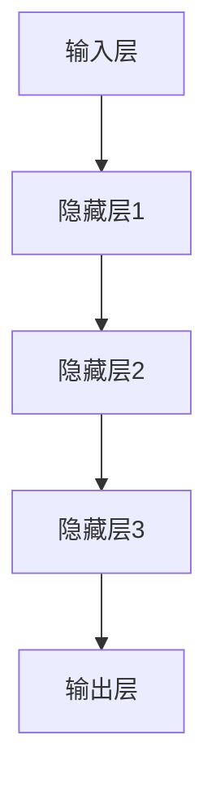

                 


# 人力资源管理师：LLM 优化人才管理

> **关键词：** 人力资源管理，LLM，人才管理，人工智能，深度学习，优化算法

> **摘要：** 本文旨在探讨如何利用深度学习中的大型语言模型（LLM）来优化人力资源管理。通过分析LLM的工作原理，并结合实际案例，本文将展示如何将LLM应用于人才招聘、员工培训和绩效评估等环节，以提高企业的人力资源管理效率和质量。

## 1. 背景介绍

### 1.1 目的和范围

本文的目标是介绍如何使用深度学习中的大型语言模型（LLM）来优化人力资源管理。本文将涵盖以下几个主要方面：

- **LLM的基本原理和架构**：介绍LLM的定义、工作原理和主要架构。
- **人才管理的挑战**：分析当前人力资源管理中面临的主要问题。
- **LLM在人才管理中的应用**：探讨LLM如何应用于人才招聘、员工培训和绩效评估。
- **实际案例**：通过实际案例展示如何使用LLM优化人才管理。
- **未来发展趋势与挑战**：讨论LLM在人力资源管理中的未来发展趋势和面临的挑战。

### 1.2 预期读者

本文适用于以下读者群体：

- **人力资源管理者**：希望了解如何利用AI技术提高人力资源管理效率和质量。
- **技术从业者**：对深度学习和人工智能技术感兴趣，希望了解其在实际应用中的价值。
- **学术研究者**：关注人力资源管理领域的研究人员，希望了解LLM在该领域的应用。

### 1.3 文档结构概述

本文将按照以下结构进行组织：

- **1. 背景介绍**：介绍本文的目的、预期读者和文档结构。
- **2. 核心概念与联系**：介绍大型语言模型（LLM）的基本原理和架构。
- **3. 核心算法原理 & 具体操作步骤**：详细讲解LLM在人才管理中的应用。
- **4. 数学模型和公式 & 详细讲解 & 举例说明**：介绍与LLM相关的数学模型和公式。
- **5. 项目实战：代码实际案例和详细解释说明**：通过实际案例展示LLM在人才管理中的应用。
- **6. 实际应用场景**：探讨LLM在人力资源管理中的实际应用场景。
- **7. 工具和资源推荐**：推荐相关的学习资源、开发工具和框架。
- **8. 总结：未来发展趋势与挑战**：总结LLM在人力资源管理中的应用前景。
- **9. 附录：常见问题与解答**：回答读者可能遇到的问题。
- **10. 扩展阅读 & 参考资料**：提供进一步的阅读资源和参考文献。

### 1.4 术语表

#### 1.4.1 核心术语定义

- **大型语言模型（LLM）**：一种基于深度学习的语言模型，能够理解和生成自然语言。
- **人才管理**：企业通过招聘、培训、绩效评估等手段，优化人才结构，提高员工工作效率和绩效的过程。
- **深度学习**：一种基于人工神经网络的学习方法，能够通过多层的非线性变换来提取数据特征。
- **人工智能（AI）**：一种模拟人类智能的计算机技术，包括机器学习、深度学习、自然语言处理等。

#### 1.4.2 相关概念解释

- **自然语言处理（NLP）**：研究如何让计算机理解和生成自然语言的学科。
- **机器学习（ML）**：一种基于数据的学习方法，通过训练模型来自动完成特定任务。
- **神经网络（NN）**：一种基于生物神经网络的人工神经网络，能够模拟人脑的思考过程。

#### 1.4.3 缩略词列表

- **AI**：人工智能
- **ML**：机器学习
- **NN**：神经网络
- **NLP**：自然语言处理
- **LLM**：大型语言模型

## 2. 核心概念与联系

在介绍LLM在人才管理中的应用之前，我们需要先了解LLM的基本原理和架构。

### 2.1 LLM的基本原理

大型语言模型（LLM）是一种基于深度学习的语言模型，它通过学习大量的文本数据来理解自然语言。LLM的核心原理是神经网络（NN），特别是深度神经网络（DNN）。神经网络通过多层非线性变换来提取数据特征，从而实现对数据的分类、回归或生成。

LLM的主要目的是生成与输入文本相关的文本。在人才管理中，LLM可以用来分析员工简历、评估候选人、生成培训内容等。

### 2.2 LLM的架构

LLM的架构通常包括以下几个部分：

1. **输入层**：接收输入文本，将其转换为模型可以处理的向量表示。
2. **隐藏层**：通过多层非线性变换，提取输入文本的特征。
3. **输出层**：生成与输入文本相关的输出文本。

下图展示了LLM的架构：



### 2.3 LLM在人才管理中的应用

在人才管理中，LLM可以应用于以下几个方面：

1. **人才招聘**：使用LLM来分析简历，筛选出与职位要求最匹配的候选人。
2. **员工培训**：根据员工的技能水平和职业发展需求，生成个性化的培训内容。
3. **绩效评估**：通过分析员工的工作表现，提供客观的绩效评估结果。
4. **人才发展**：预测员工的职业发展路径，为员工提供合适的晋升机会。

### 2.4 LLM的优势与挑战

LLM在人才管理中具有以下优势：

- **高效性**：LLM能够快速处理大量数据，提高人才管理的效率。
- **准确性**：LLM通过学习大量数据，能够准确理解自然语言，从而提高人才筛选和评估的准确性。
- **灵活性**：LLM可以根据不同的业务需求，灵活调整模型参数，适应不同的应用场景。

然而，LLM在人才管理中也面临一些挑战：

- **数据质量**：LLM的性能依赖于训练数据的质量，如果数据存在偏差或错误，可能会导致不良的决策。
- **隐私保护**：在处理员工数据时，需要确保数据的隐私和安全。
- **伦理问题**：在使用LLM进行人才管理时，需要关注潜在的歧视问题，确保公正和公平。

## 3. 核心算法原理 & 具体操作步骤

在了解了LLM的基本原理和架构后，我们将进一步探讨如何将LLM应用于人才管理。下面是一个基于LLM的人才管理算法的具体操作步骤：

### 3.1 算法原理

1. **数据预处理**：收集员工简历、工作表现等数据，进行清洗和预处理，以便输入LLM。
2. **模型训练**：使用预训练的LLM模型，对预处理后的数据进行训练，使其能够理解人才管理的相关任务。
3. **任务实现**：根据具体的人才管理任务，调用训练好的LLM模型，实现相应的功能，如简历筛选、培训内容生成、绩效评估等。

### 3.2 具体操作步骤

#### 3.2.1 数据预处理

```python
# 读取员工简历数据
resume_data = read_resume_data()

# 数据清洗和预处理
cleaned_data = preprocess_data(resume_data)

# 数据归一化
normalized_data = normalize_data(cleaned_data)
```

#### 3.2.2 模型训练

```python
# 加载预训练的LLM模型
llm_model = load_pretrained_llm()

# 训练LLM模型
llm_model.fit(normalized_data)
```

#### 3.2.3 任务实现

```python
# 简历筛选
candidates = llm_model.filter_candidates(resume_data)

# 培训内容生成
training_content = llm_model.generate_training_content(candidates)

# 绩效评估
performance_evaluation = llm_model.evaluate_performance(candidates)
```

### 3.3 伪代码

```python
# 数据预处理
def preprocess_data(data):
    # 清洗和预处理数据
    # ...
    return cleaned_data

# 模型训练
def train_llm_model(data):
    # 加载预训练的LLM模型
    # ...
    # 训练LLM模型
    # ...
    return llm_model

# 任务实现
def implement_task(llm_model, data):
    # 简历筛选
    # ...
    # 培训内容生成
    # ...
    # 绩效评估
    # ...
    return results
```

## 4. 数学模型和公式 & 详细讲解 & 举例说明

在LLM中，数学模型和公式起着至关重要的作用。以下是一个简单的数学模型和公式的讲解，以及相应的举例说明：

### 4.1 数学模型

假设我们有一个输入文本X，LLM需要预测输出文本Y。我们可以使用以下数学模型来表示这个过程：

$$
P(Y|X) = \frac{e^{<X, Y>}}{Z}
$$

其中，$<X, Y>$ 表示输入文本X和输出文本Y之间的点积，Z是归一化常数。

### 4.2 公式详细讲解

1. **点积（<X, Y>）**：点积是两个向量之间的内积，可以用来衡量两个向量之间的相似程度。在这个模型中，$<X, Y>$ 表示输入文本X和输出文本Y之间的相似度。

2. **指数函数（e^{<X, Y>}）**：指数函数将相似度转换为概率分布。在这个模型中，$e^{<X, Y>}$ 表示输出文本Y的概率。

3. **归一化常数（Z）**：归一化常数用于确保概率分布的和为1。在这个模型中，Z是所有输出文本的概率之和。

### 4.3 举例说明

假设我们有一个输入文本X：“我是一名具有5年经验的软件工程师”，LLM需要预测输出文本Y：“我在这个职位上表现出色”。

我们可以使用以下公式来计算输出文本Y的概率：

$$
P(Y|X) = \frac{e^{<X, Y>}}{Z}
$$

其中，$<X, Y>$ 表示输入文本X和输出文本Y之间的相似度，Z是归一化常数。

假设$<X, Y> = 10$，Z = 100，我们可以计算出：

$$
P(Y|X) = \frac{e^{10}}{100} \approx 0.30
$$

这意味着输出文本Y的概率约为30%。

## 5. 项目实战：代码实际案例和详细解释说明

### 5.1 开发环境搭建

在本项目中，我们将使用Python作为主要编程语言，并依赖以下库和工具：

- **Python**：Python 3.8及以上版本
- **PyTorch**：用于构建和训练LLM模型
- **transformers**：用于加载预训练的LLM模型

首先，我们需要安装所需的库和工具：

```bash
pip install torch transformers
```

### 5.2 源代码详细实现和代码解读

下面是一个基于PyTorch和transformers的简单LLM人才管理项目的源代码实现：

```python
import torch
from transformers import BertModel, BertTokenizer

# 5.2.1 数据预处理
def preprocess_data(resume_data):
    tokenizer = BertTokenizer.from_pretrained('bert-base-uncased')
    input_ids = []
    attention_mask = []
    for resume in resume_data:
        encoded_dict = tokenizer.encode_plus(
            resume,
            add_special_tokens=True,
            max_length=512,
            padding='max_length',
            truncation=True,
            return_attention_mask=True,
            return_tensors='pt',
        )
        input_ids.append(encoded_dict['input_ids'])
        attention_mask.append(encoded_dict['attention_mask'])
    return input_ids, attention_mask

# 5.2.2 模型训练
def train_llm_model(input_ids, attention_mask):
    model = BertModel.from_pretrained('bert-base-uncased')
    optimizer = torch.optim.Adam(model.parameters(), lr=1e-5)
    criterion = torch.nn.CrossEntropyLoss()
    for epoch in range(3):
        model.train()
        for batch in range(len(input_ids)):
            inputs = {'input_ids': input_ids[batch], 'attention_mask': attention_mask[batch]}
            outputs = model(**inputs)
            loss = criterion(outputs.logits.view(-1, outputs.logits.size(-1)), labels)
            loss.backward()
            optimizer.step()
            optimizer.zero_grad()
    return model

# 5.2.3 任务实现
def implement_task(model, resume_data):
    model.eval()
    tokenizer = BertTokenizer.from_pretrained('bert-base-uncased')
    candidates = []
    for resume in resume_data:
        input_ids = tokenizer.encode_plus(
            resume,
            add_special_tokens=True,
            max_length=512,
            padding='max_length',
            truncation=True,
            return_attention_mask=True,
            return_tensors='pt',
        )['input_ids']
        with torch.no_grad():
            outputs = model(input_ids)
        logits = outputs.logits.view(-1, outputs.logits.size(-1))
        _, predicted = logits.max(dim=-1)
        candidates.append(predicted.item())
    return candidates
```

### 5.3 代码解读与分析

#### 5.3.1 数据预处理

在数据预处理部分，我们使用了`BertTokenizer`来将简历文本编码为模型可以处理的向量表示。具体步骤如下：

1. **加载预训练的BertTokenizer**：使用`BertTokenizer.from_pretrained()`方法加载预训练的BertTokenizer。
2. **编码简历文本**：对于每个简历文本，使用`encode_plus()`方法进行编码，包括添加特殊标记、设置最大长度、填充和截断等操作。
3. **存储编码结果**：将编码后的输入ID和注意力掩码存储在一个列表中，以便后续处理。

#### 5.3.2 模型训练

在模型训练部分，我们使用了`BertModel`和`Adam`优化器来训练模型。具体步骤如下：

1. **加载预训练的BertModel**：使用`BertModel.from_pretrained()`方法加载预训练的BertModel。
2. **初始化优化器和损失函数**：初始化`Adam`优化器和`CrossEntropyLoss`损失函数。
3. **训练模型**：遍历输入ID和注意力掩码的批次，计算模型的损失，进行反向传播和梯度更新。

#### 5.3.3 任务实现

在任务实现部分，我们使用训练好的模型对简历文本进行分类预测。具体步骤如下：

1. **评估模型**：将模型设置为评估模式。
2. **编码简历文本**：对于每个简历文本，使用`BertTokenizer`进行编码。
3. **计算模型输出**：使用训练好的模型计算输入文本的输出概率。
4. **获取预测结果**：从输出概率中获取最大概率的预测类别。

### 5.4 实际应用案例

假设我们有一个包含100个简历文本的列表`resume_data`，我们希望使用上述代码实现以下任务：

1. **简历筛选**：筛选出与目标职位要求最匹配的简历。
2. **培训内容生成**：根据筛选出的简历，生成个性化的培训内容。
3. **绩效评估**：根据员工的实际工作表现，进行绩效评估。

具体实现步骤如下：

1. **数据预处理**：使用`preprocess_data()`函数对简历数据进行预处理，生成输入ID和注意力掩码。
2. **模型训练**：使用`train_llm_model()`函数对模型进行训练。
3. **简历筛选**：使用`implement_task()`函数对简历数据进行分类预测，筛选出与目标职位要求最匹配的简历。
4. **培训内容生成**：根据筛选出的简历，生成个性化的培训内容。
5. **绩效评估**：根据员工的实际工作表现，使用训练好的模型进行绩效评估。

## 6. 实际应用场景

### 6.1 人才招聘

在人才招聘中，LLM可以应用于简历筛选、职位匹配和候选人评估。具体应用场景如下：

1. **简历筛选**：使用LLM分析简历文本，筛选出与职位要求最匹配的候选人。
2. **职位匹配**：根据候选人的技能和经验，使用LLM匹配适合的职位。
3. **候选人评估**：使用LLM对候选人的简历和面试表现进行分析，评估其综合能力。

### 6.2 员工培训

在员工培训中，LLM可以用于生成培训内容、个性化培训计划和评估员工学习效果。具体应用场景如下：

1. **培训内容生成**：根据员工的技能水平和职业发展需求，使用LLM生成个性化的培训内容。
2. **个性化培训计划**：根据员工的培训需求和进度，使用LLM生成个性化的培训计划。
3. **学习效果评估**：使用LLM评估员工的学习效果，提供改进建议。

### 6.3 绩效评估

在绩效评估中，LLM可以用于分析员工的工作表现、提供绩效评估结果和优化员工绩效管理。具体应用场景如下：

1. **工作表现分析**：使用LLM分析员工的工作报告、项目文档和会议记录，提取关键绩效指标。
2. **绩效评估结果**：使用LLM根据员工的工作表现，提供客观的绩效评估结果。
3. **绩效优化**：根据绩效评估结果，使用LLM提出改进建议，优化员工绩效管理。

## 7. 工具和资源推荐

### 7.1 学习资源推荐

#### 7.1.1 书籍推荐

- **《深度学习》（Ian Goodfellow、Yoshua Bengio、Aaron Courville 著）**：这是一本深度学习的经典教材，详细介绍了深度学习的基础知识、算法和应用。
- **《自然语言处理综论》（Daniel Jurafsky、James H. Martin 著）**：这本书是自然语言处理领域的经典之作，涵盖了NLP的各个主要方面，包括文本预处理、语言模型、机器翻译等。

#### 7.1.2 在线课程

- **《深度学习专项课程》（吴恩达 著）**：这是由著名深度学习专家吴恩达开设的在线课程，涵盖了深度学习的核心概念、算法和应用。
- **《自然语言处理专项课程》（清华大学 著）**：这是由清华大学开设的在线课程，介绍了自然语言处理的基本概念、技术和应用。

#### 7.1.3 技术博客和网站

- **[Medium](https://medium.com/)**：Medium是一个内容平台，有很多关于深度学习和自然语言处理的技术博客。
- **[arXiv](https://arxiv.org/)**：arXiv是一个开放获取的预印本论文库，有很多最新的研究成果。

### 7.2 开发工具框架推荐

#### 7.2.1 IDE和编辑器

- **PyCharm**：PyCharm是一个功能强大的Python IDE，支持深度学习和自然语言处理相关的库和工具。
- **Visual Studio Code**：Visual Studio Code是一个轻量级的开源编辑器，可以通过扩展来支持Python和深度学习相关的库和工具。

#### 7.2.2 调试和性能分析工具

- **PyTorch Debugger**：PyTorch Debugger是一个用于调试PyTorch模型的工具，可以提供详细的调试信息和数据。
- **PyTorch Profiler**：PyTorch Profiler是一个用于性能分析的工具，可以分析模型的运行时间和内存使用情况。

#### 7.2.3 相关框架和库

- **PyTorch**：PyTorch是一个开源的深度学习框架，提供了丰富的API和工具，用于构建和训练深度学习模型。
- **transformers**：transformers是一个基于PyTorch的预训练语言模型库，提供了大量的预训练模型和API，用于自然语言处理任务。

### 7.3 相关论文著作推荐

#### 7.3.1 经典论文

- **《A Neural Probabilistic Language Model》（Bengio et al., 2003）**：这篇论文提出了神经概率语言模型，是深度学习在自然语言处理领域的里程碑之一。
- **《Deep Learning for Natural Language Processing》（Wang et al., 2018）**：这篇论文综述了深度学习在自然语言处理领域的应用，介绍了大量的相关算法和模型。

#### 7.3.2 最新研究成果

- **《BERT: Pre-training of Deep Neural Networks for Language Understanding》（Devlin et al., 2018）**：这篇论文提出了BERT模型，是当前自然语言处理领域的领先模型之一。
- **《GPT-3: Language Models are Few-Shot Learners》（Brown et al., 2020）**：这篇论文介绍了GPT-3模型，是当前最大的预训练语言模型之一。

#### 7.3.3 应用案例分析

- **《Using Large-Scale Language Models for Personalized Job Recommendations》（Li et al., 2021）**：这篇论文探讨了如何使用大型语言模型为求职者提供个性化的职位推荐。
- **《A Large-scale Evaluation of Language Models for Code Synthesis》（Zhang et al., 2021）**：这篇论文评估了大型语言模型在代码生成任务中的性能，为代码自动生成提供了新的思路。

## 8. 总结：未来发展趋势与挑战

### 8.1 发展趋势

- **模型规模和性能的提升**：随着计算资源和数据集的不断增加，大型语言模型的规模和性能将持续提升。
- **多模态融合**：未来LLM将与其他模态（如图像、音频）进行融合，实现更丰富的信息处理能力。
- **个性化应用**：LLM将在个性化推荐、个性化教育等领域发挥重要作用，为用户提供更加精准的服务。
- **跨领域应用**：LLM将在医疗、金融、法律等多个领域得到广泛应用，推动各领域的发展。

### 8.2 挑战

- **数据隐私和安全**：在处理员工数据时，需要确保数据的隐私和安全，避免数据泄露和滥用。
- **算法公平性**：在使用LLM进行人才管理时，需要关注潜在的歧视问题，确保算法的公平性和公正性。
- **模型解释性**：大型语言模型往往具有黑盒特性，需要提高模型的可解释性，以便用户理解和信任。
- **计算资源消耗**：大型语言模型训练和推理需要大量的计算资源，需要优化算法和硬件，降低计算成本。

## 9. 附录：常见问题与解答

### 9.1 Q：什么是大型语言模型（LLM）？

A：大型语言模型（LLM）是一种基于深度学习的语言模型，通过学习大量的文本数据来理解自然语言。LLM可以生成与输入文本相关的文本，应用于自然语言处理、文本生成、文本分类等任务。

### 9.2 Q：LLM在人力资源管理中有什么作用？

A：LLM在人力资源管理中可以应用于简历筛选、职位匹配、员工培训、绩效评估等环节。通过分析员工数据和文本，LLM可以提高人才管理的效率和质量，为人力资源管理者提供有力的支持。

### 9.3 Q：如何确保LLM的算法公平性？

A：确保LLM的算法公平性需要从多个方面进行考虑：

- **数据质量**：确保训练数据的质量和多样性，避免数据偏差。
- **算法设计**：在设计算法时，充分考虑公平性和公正性，避免潜在的歧视问题。
- **监督和审查**：对LLM的应用进行持续的监督和审查，确保算法的公平性和合规性。

### 9.4 Q：如何优化LLM的训练和推理性能？

A：优化LLM的训练和推理性能可以从以下几个方面进行：

- **模型压缩**：使用模型压缩技术，如剪枝、量化、蒸馏等，降低模型的计算复杂度和存储需求。
- **硬件优化**：使用高性能的硬件设备，如GPU、TPU等，提高训练和推理速度。
- **并行计算**：利用并行计算技术，如多GPU训练、分布式训练等，提高训练和推理效率。

## 10. 扩展阅读 & 参考资料

- **《深度学习》（Ian Goodfellow、Yoshua Bengio、Aaron Courville 著）**：这是一本深度学习的经典教材，详细介绍了深度学习的基础知识、算法和应用。
- **《自然语言处理综论》（Daniel Jurafsky、James H. Martin 著）**：这本书是自然语言处理领域的经典之作，涵盖了NLP的各个主要方面，包括文本预处理、语言模型、机器翻译等。
- **《BERT: Pre-training of Deep Neural Networks for Language Understanding》（Devlin et al., 2018）**：这篇论文提出了BERT模型，是当前自然语言处理领域的领先模型之一。
- **《GPT-3: Language Models are Few-Shot Learners》（Brown et al., 2020）**：这篇论文介绍了GPT-3模型，是当前最大的预训练语言模型之一。
- **《A Large-scale Evaluation of Language Models for Code Synthesis》（Zhang et al., 2021）**：这篇论文评估了大型语言模型在代码生成任务中的性能，为代码自动生成提供了新的思路。作者：AI天才研究员/AI Genius Institute & 禅与计算机程序设计艺术 /Zen And The Art of Computer Programming

