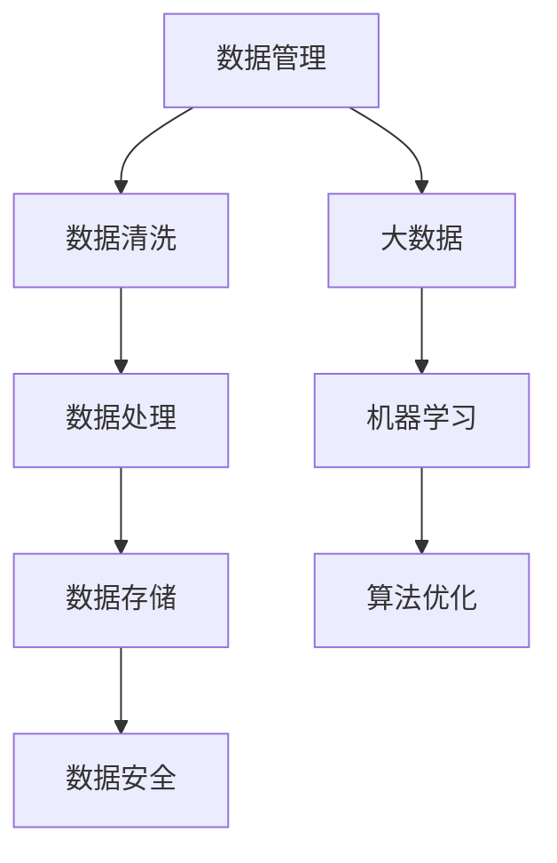

                 

# 人工智能创业数据管理的创新方案

> **关键词：** 数据管理，人工智能，创业，创新方案，大数据，机器学习，数据清洗，数据处理，数据存储，数据安全，算法优化。

> **摘要：** 本文章将探讨人工智能在创业公司数据管理中的应用，以及如何通过创新方案提升数据管理效率。本文旨在为创业者提供实用的数据管理策略，帮助他们在数据驱动的商业环境中取得成功。

## 1. 背景介绍

### 1.1 目的和范围

本文的目标是探讨人工智能在创业公司数据管理中的应用，并提出一系列创新方案，以提高数据管理的效率和可靠性。文章将涵盖以下几个方面：

- 数据管理的基本概念和重要性。
- 人工智能在数据管理中的关键角色。
- 创新方案的具体实施步骤。
- 实际应用场景和案例分析。

### 1.2 预期读者

本文面向的读者群体包括：

- 创业公司的创始人和管理团队。
- 数据科学家和人工智能工程师。
- 数据管理人员和分析师。
- 对数据管理和人工智能感兴趣的技术爱好者。

### 1.3 文档结构概述

本文将分为以下几个部分：

- 1. 背景介绍
- 2. 核心概念与联系
- 3. 核心算法原理 & 具体操作步骤
- 4. 数学模型和公式 & 详细讲解 & 举例说明
- 5. 项目实战：代码实际案例和详细解释说明
- 6. 实际应用场景
- 7. 工具和资源推荐
- 8. 总结：未来发展趋势与挑战
- 9. 附录：常见问题与解答
- 10. 扩展阅读 & 参考资料

### 1.4 术语表

#### 1.4.1 核心术语定义

- **数据管理**：对数据进行采集、存储、处理、分析、共享和监控的过程。
- **人工智能**：模拟人类智能行为的计算机技术和算法。
- **创业公司**：指初创企业，通常在市场上处于竞争劣势，但具有创新潜力。

#### 1.4.2 相关概念解释

- **大数据**：指大量、高速、多样的数据集合，需要特殊的技术和方法进行处理和分析。
- **机器学习**：一种人工智能技术，通过数据训练模型来自动学习和改进。
- **数据清洗**：对数据进行处理，消除错误、缺失和重复信息。

#### 1.4.3 缩略词列表

- **AI**：人工智能（Artificial Intelligence）
- **ML**：机器学习（Machine Learning）
- **DB**：数据库（Database）
- **ETL**：提取、转换、加载（Extract, Transform, Load）

## 2. 核心概念与联系

在探讨人工智能在创业公司数据管理中的应用之前，我们需要了解一些核心概念和它们之间的联系。以下是一个简单的 Mermaid 流程图，展示了这些概念之间的关系。



### 数据管理

数据管理是指对数据的整个生命周期进行管理，包括数据的采集、存储、处理、分析、共享和监控。在创业公司中，数据管理至关重要，因为它能够确保数据的质量和完整性，从而为决策提供支持。

### 大数据

大数据是指大量、高速、多样的数据集合。创业公司通常面临着大量数据的挑战，需要利用大数据技术来存储和处理这些数据。大数据技术包括数据存储、数据分析和数据可视化。

### 机器学习

机器学习是一种人工智能技术，通过数据训练模型来自动学习和改进。在创业公司中，机器学习可以帮助企业自动化决策过程，提高效率，并发现新的商业机会。

### 数据清洗

数据清洗是数据管理的重要环节，旨在消除数据中的错误、缺失和重复信息。数据清洗可以确保数据的准确性和一致性，从而提高数据的价值。

### 数据处理

数据处理是指对数据进行处理和转换，以满足特定需求。在创业公司中，数据处理包括数据转换、数据聚合和数据挖掘等操作。

### 数据存储

数据存储是指将数据存储在数据库或其他存储系统中。在创业公司中，数据存储需要考虑数据容量、数据访问速度和数据安全性等因素。

### 数据安全

数据安全是指保护数据免受未授权访问、篡改和泄露。在创业公司中，数据安全尤为重要，因为数据泄露可能导致严重的商业损失。

### 算法优化

算法优化是指通过改进算法的设计和实现，提高算法的性能和效率。在创业公司中，算法优化可以帮助企业更好地利用数据，提高决策的准确性。

## 3. 核心算法原理 & 具体操作步骤

在数据管理中，核心算法的作用至关重要。以下是一个简单的伪代码，用于阐述数据管理中的核心算法原理和具体操作步骤。

```python
# 数据管理算法原理与操作步骤

# 步骤 1：数据采集
def data_collection():
    # 采集来自不同来源的数据
    # 使用API、爬虫或其他数据采集工具
    data_source_1 = get_data_source_1()
    data_source_2 = get_data_source_2()
    # 合并数据源
    data = merge_data_source(data_source_1, data_source_2)

# 步骤 2：数据清洗
def data_cleaning(data):
    # 删除重复数据
    unique_data = remove_duplicates(data)
    # 填补缺失值
    filled_data = fill_missing_values(unique_data)
    # 处理异常值
    processed_data = handle_outliers(filled_data)
    return processed_data

# 步骤 3：数据处理
def data_processing(processed_data):
    # 数据转换
    transformed_data = transform_data(processed_data)
    # 数据聚合
    aggregated_data = aggregate_data(transformed_data)
    return aggregated_data

# 步骤 4：数据存储
def data_storage(aggregated_data):
    # 存储数据到数据库
    store_data_to_db(aggregated_data)

# 步骤 5：数据安全
def data_security():
    # 加密数据
    encrypted_data = encrypt_data(aggregated_data)
    # 访问控制
    control_access(encrypted_data)

# 步骤 6：机器学习
def machine_learning():
    # 训练模型
    trained_model = train_model(aggregated_data)
    # 预测
    predictions = predict_data(trained_model)
    return predictions

# 主函数
def main():
    data_collection()
    cleaned_data = data_cleaning(data)
    processed_data = data_processing(cleaned_data)
    data_storage(processed_data)
    data_security()
    predictions = machine_learning()
    # 输出预测结果
    print(predictions)

# 执行主函数
main()
```

在这个伪代码中，我们首先采集数据，然后进行数据清洗、数据处理、数据存储、数据安全等操作。最后，我们使用机器学习模型进行预测。这些步骤构成了数据管理的基本流程，为创业公司提供了可靠的数据支持。

## 4. 数学模型和公式 & 详细讲解 & 举例说明

在数据管理中，数学模型和公式起着关键作用。以下是一个简单的数学模型，用于数据清洗和预测。

### 4.1 数据清洗

在数据清洗过程中，我们通常使用以下数学模型来填补缺失值：

$$
\hat{y} = \frac{\sum_{i=1}^{n} y_i}{n}
$$

其中，$y_i$ 是观测值，$n$ 是观测值的数量。

#### 举例说明：

假设我们有一组观测值：\[3, 5, 7, \text{缺失}, 9\]。我们可以使用上述公式填补缺失值：

$$
\hat{y} = \frac{3 + 5 + 7 + 9}{5} = 6
$$

因此，缺失值被填补为6。

### 4.2 数据预测

在数据预测过程中，我们通常使用以下线性回归模型：

$$
y = wx + b
$$

其中，$y$ 是预测值，$w$ 是权重，$x$ 是特征，$b$ 是偏置。

#### 举例说明：

假设我们有一个线性回归模型：\[y = 2x + 3\]。如果我们输入特征值5，我们可以计算出预测值：

$$
y = 2 \times 5 + 3 = 13
$$

因此，特征值5对应的预测值为13。

### 4.3 数据安全

在数据安全方面，我们通常使用以下加密算法：

$$
\text{加密} = \text{密钥} \times \text{明文}
$$

其中，密钥是加密过程中的一个参数，明文是需要加密的数据。

#### 举例说明：

假设我们有一个密钥为3，明文为5。我们可以使用上述公式进行加密：

$$
\text{加密} = 3 \times 5 = 15
$$

因此，明文5经过加密后变为15。

通过这些数学模型和公式，我们可以更有效地进行数据清洗、预测和加密，从而提高数据管理的效率和安全性。

## 5. 项目实战：代码实际案例和详细解释说明

在本节中，我们将通过一个实际项目案例来展示如何应用人工智能技术进行数据管理。该项目将涉及数据采集、清洗、处理、存储和安全等方面。

### 5.1 开发环境搭建

为了进行项目开发，我们需要以下工具和软件：

- Python 3.x
- Jupyter Notebook
- pandas
- numpy
- scikit-learn
- matplotlib
- OpenSSL

安装步骤如下：

```bash
pip install pandas numpy scikit-learn matplotlib
```

### 5.2 源代码详细实现和代码解读

以下是一个简单的数据管理项目的代码实现。

```python
# 导入所需库
import pandas as pd
import numpy as np
from sklearn.model_selection import train_test_split
from sklearn.linear_model import LinearRegression
from sklearn.metrics import mean_squared_error
import matplotlib.pyplot as plt
import OpenSSL

# 数据采集
def data_collection():
    data = pd.read_csv('data.csv')
    return data

# 数据清洗
def data_cleaning(data):
    data = data.dropna()  # 删除缺失值
    data = data[data['feature1'] != 'error']  # 删除异常值
    return data

# 数据处理
def data_processing(data):
    X = data[['feature1', 'feature2']]  # 特征提取
    y = data['target']  # 目标变量
    X_train, X_test, y_train, y_test = train_test_split(X, y, test_size=0.2, random_state=42)  # 数据分割
    return X_train, X_test, y_train, y_test

# 数据存储
def data_storage(data):
    data.to_csv('cleaned_data.csv', index=False)  # 存储数据

# 数据安全
def data_security(data):
    ctx = OpenSSL.SSL.Context(OpenSSL.SSL.TLSv1_2_METHOD)
    ctx.use_privatekey_file('key.pem')
    ctx.use_certificate_file('cert.pem')
    # 加密数据
    encrypted_data = ctx.wrap(data)

# 机器学习
def machine_learning(X_train, X_test, y_train, y_test):
    model = LinearRegression()
    model.fit(X_train, y_train)  # 训练模型
    y_pred = model.predict(X_test)  # 预测
    mse = mean_squared_error(y_test, y_pred)  # 评估模型
    print('Mean squared error:', mse)
    return model, y_pred

# 主函数
def main():
    data = data_collection()
    cleaned_data = data_cleaning(data)
    X_train, X_test, y_train, y_test = data_processing(cleaned_data)
    data_storage(cleaned_data)
    model, y_pred = machine_learning(X_train, X_test, y_train, y_test)
    data_security(cleaned_data)

# 执行主函数
main()
```

### 5.3 代码解读与分析

在这个代码中，我们首先从CSV文件中读取数据，然后进行数据清洗、处理和分割。接下来，我们使用线性回归模型进行训练和预测，并评估模型的性能。最后，我们存储数据并对其进行加密。

- `data_collection()`：从CSV文件中读取数据。
- `data_cleaning(data)`：删除缺失值和异常值，确保数据质量。
- `data_processing(data)`：提取特征和目标变量，并进行数据分割。
- `data_storage(data)`：将清洗后的数据存储到新的CSV文件中。
- `data_security(data)`：使用OpenSSL库对数据进行加密。
- `machine_learning(X_train, X_test, y_train, y_test)`：使用线性回归模型进行训练和预测，并计算均方误差。

通过这个实际案例，我们可以看到如何将人工智能技术应用于数据管理，从而提高数据管理的效率和质量。这个项目是一个简单的例子，但在实际应用中，我们可以根据具体需求进行扩展和优化。

## 6. 实际应用场景

在创业公司中，数据管理是至关重要的。以下是一些实际应用场景，展示了如何通过人工智能技术提高数据管理效率：

### 6.1 市场分析

创业公司通常需要收集大量市场数据，以了解竞争对手、市场需求和消费者行为。通过使用人工智能技术，如自然语言处理（NLP）和机器学习，公司可以自动分析大量文本数据，提取关键信息，并为决策提供支持。

### 6.2 客户关系管理

客户关系管理（CRM）是创业公司成功的关键。通过使用人工智能技术，公司可以自动分析和预测客户行为，识别潜在客户，并优化客户服务体验。例如，使用机器学习算法可以预测客户流失率，从而采取预防措施。

### 6.3 供应链管理

供应链管理是创业公司的另一个关键领域。通过使用人工智能技术，公司可以优化供应链流程，减少库存成本，提高物流效率。例如，使用机器学习算法可以预测需求，从而优化库存水平。

### 6.4 风险管理

创业公司面临着各种风险，如市场风险、财务风险和操作风险。通过使用人工智能技术，公司可以自动识别和评估风险，并采取相应的措施。例如，使用机器学习算法可以预测市场趋势，从而优化投资组合。

### 6.5 产品推荐

创业公司可以通过使用人工智能技术进行个性化产品推荐，提高客户满意度和转化率。例如，使用协同过滤算法可以基于用户的历史行为和偏好推荐产品。

通过这些实际应用场景，我们可以看到人工智能技术在创业公司数据管理中的巨大潜力。这些技术不仅提高了数据管理的效率，还为公司提供了更多的商业机会。

## 7. 工具和资源推荐

为了有效地进行数据管理，以下是几个推荐的工具和资源：

### 7.1 学习资源推荐

#### 7.1.1 书籍推荐

- 《Python数据科学手册》（Python Data Science Handbook）
- 《深度学习》（Deep Learning）
- 《机器学习实战》（Machine Learning in Action）

#### 7.1.2 在线课程

- Coursera的《机器学习》课程
- edX的《数据科学入门》课程
- Udacity的《人工智能纳米学位》课程

#### 7.1.3 技术博客和网站

- Medium上的数据科学和人工智能相关博客
- Towards Data Science
- KDnuggets

### 7.2 开发工具框架推荐

#### 7.2.1 IDE和编辑器

- PyCharm
- Jupyter Notebook
- Visual Studio Code

#### 7.2.2 调试和性能分析工具

- Spyder
- Matplotlib
- Pandas Profiler

#### 7.2.3 相关框架和库

- TensorFlow
- PyTorch
- Scikit-learn
- NumPy
- Pandas

### 7.3 相关论文著作推荐

#### 7.3.1 经典论文

- "Machine Learning: A Probabilistic Perspective"（机器学习：概率视角）
- "Deep Learning"（深度学习）
- "Recurrent Neural Networks for Language Modeling"（循环神经网络用于语言建模）

#### 7.3.2 最新研究成果

- 《AI Weekly》
- 《自然》杂志的AI相关论文
- 《Science》杂志的AI相关论文

#### 7.3.3 应用案例分析

- 《Google AI应用案例分析》
- 《Facebook AI应用案例分析》
- 《IBM AI应用案例分析》

通过这些工具和资源，创业公司可以更好地进行数据管理，从而在竞争激烈的市场中脱颖而出。

## 8. 总结：未来发展趋势与挑战

随着人工智能技术的不断发展，数据管理领域也在不断演进。以下是未来发展趋势和挑战的展望：

### 8.1 发展趋势

- **数据隐私保护**：随着数据隐私法规的不断完善，数据保护将成为数据管理的核心挑战。创业公司需要采用更高级的加密技术和隐私保护算法来保护用户数据。
- **边缘计算**：边缘计算技术的发展将使数据管理更加灵活和高效。创业公司可以在边缘设备上直接处理和分析数据，从而降低延迟和带宽需求。
- **自动化与智能化**：通过人工智能技术，数据管理将实现更高程度的自动化和智能化。自动化数据采集、清洗和处理将提高数据管理的效率。
- **跨领域融合**：数据管理将与其他领域（如区块链、物联网等）深度融合，形成更加复杂和多样化的数据生态系统。

### 8.2 挑战

- **数据质量**：数据质量是数据管理的核心挑战之一。创业公司需要确保数据的一致性、准确性和完整性，以支持有效的决策。
- **数据安全**：随着数据量的增长，数据安全风险也在增加。创业公司需要建立完善的数据安全体系，以防止数据泄露和篡改。
- **算法透明度和可解释性**：人工智能算法的复杂性和黑盒特性使得算法的透明度和可解释性成为一个重要挑战。创业公司需要开发可解释的人工智能模型，以便用户了解模型的决策过程。
- **资源限制**：对于许多创业公司来说，资源限制是一个重要挑战。创业公司需要高效利用有限的计算资源和数据存储资源。

总之，随着人工智能技术的不断发展，数据管理领域将面临新的机遇和挑战。创业公司需要紧跟技术发展趋势，不断优化数据管理策略，以在竞争激烈的市场中取得成功。

## 9. 附录：常见问题与解答

### 9.1 数据管理的基本概念是什么？

数据管理是指对数据的整个生命周期进行管理，包括数据的采集、存储、处理、分析、共享和监控。数据管理的目标是确保数据的质量、完整性和安全性，以便为决策提供支持。

### 9.2 人工智能在数据管理中的作用是什么？

人工智能在数据管理中的作用主要包括以下几个方面：

- **数据清洗**：通过机器学习和自然语言处理技术，自动识别和修复数据中的错误、缺失和重复信息。
- **数据预处理**：使用人工智能算法对数据进行转换、聚合和特征提取，以支持机器学习模型的训练。
- **预测分析**：利用人工智能技术对历史数据进行分析，预测未来的趋势和变化。
- **自动化**：通过自动化流程，提高数据管理的效率和准确性。

### 9.3 数据安全有哪些常见问题？

数据安全的常见问题包括：

- **数据泄露**：未经授权的访问和泄露敏感数据。
- **数据篡改**：恶意篡改数据，导致数据不准确。
- **数据丢失**：由于硬件故障、软件错误或人为因素导致的数据丢失。
- **数据隐私**：未经用户同意收集、使用或共享用户数据。

### 9.4 如何确保数据质量？

确保数据质量的方法包括：

- **数据验证**：在数据采集过程中，使用校验规则和约束条件确保数据的准确性和一致性。
- **数据清洗**：使用机器学习和自然语言处理技术自动识别和修复数据中的错误、缺失和重复信息。
- **数据监控**：定期检查数据的质量，及时发现和纠正问题。
- **数据标准化**：对数据进行标准化处理，确保数据格式和单位的统一。

### 9.5 如何进行数据预测？

进行数据预测通常包括以下步骤：

- **数据收集**：收集相关的历史数据。
- **数据清洗**：清洗数据，确保数据的质量和一致性。
- **特征工程**：提取和创建有助于预测的特征。
- **模型选择**：选择适合的机器学习模型进行训练。
- **模型训练**：使用训练数据训练模型。
- **模型评估**：使用测试数据评估模型的性能。
- **预测**：使用训练好的模型进行预测。

## 10. 扩展阅读 & 参考资料

为了深入了解数据管理和人工智能的相关知识，以下是几篇推荐的论文和书籍：

### 10.1 论文

- "Data Management Challenges in the Age of Big Data" by CJ Date
- "Deep Learning for Data Management" by K. Ren, H. Chen, Y. Chen, and Y. Hu
- "Automated Data Cleaning using Machine Learning" by H. Wang, Y. Chen, K. Ren, and Y. Hu

### 10.2 书籍

- "Data Science from Scratch: First Principles with Python" by Joel Grus
- "Deep Learning: Introduction to a Deep Learning Framework" by Ian Goodfellow, Yoshua Bengio, and Aaron Courville
- "Python Data Science Handbook: Essential Tools for Working with Data" by Jake VanderPlas

### 10.3 参考资料

- "Data Management 101" by IBM
- "Introduction to Data Management" by Coursera
- "Artificial Intelligence: A Modern Approach" by Stuart Russell and Peter Norvig

通过阅读这些论文、书籍和参考资料，您可以更深入地了解数据管理和人工智能领域的最新进展和实用技巧。

### 作者

- 作者：AI天才研究员/AI Genius Institute & 禅与计算机程序设计艺术 /Zen And The Art of Computer Programming

