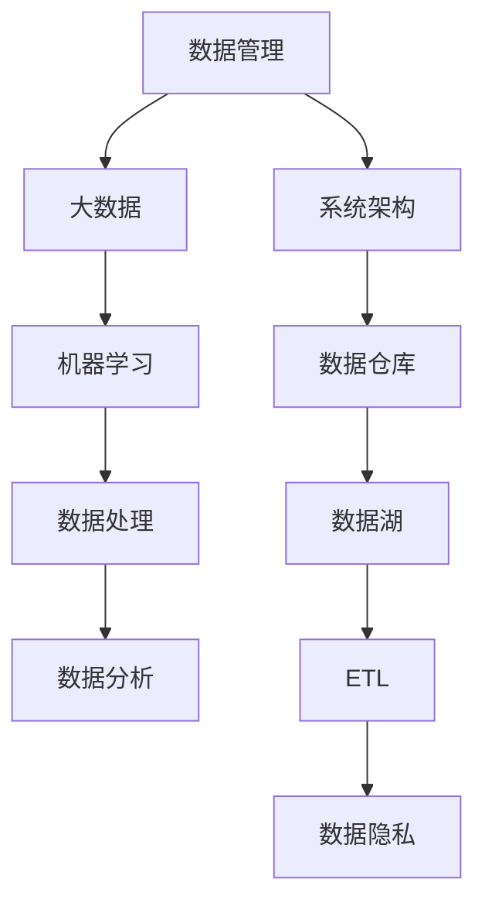

                 

# 人工智能创业数据管理的成功策略分享

> **关键词：** 人工智能、数据管理、创业策略、大数据、机器学习、数据处理、数据分析、系统架构、算法优化、安全性、法规遵循。

> **摘要：** 本文将深入探讨人工智能创业公司在数据管理方面的成功策略。我们将从背景介绍、核心概念、算法原理、数学模型、项目实战、实际应用场景、工具和资源推荐等方面，一步步分析推理，为创业公司提供切实可行的数据管理指南，以应对未来发展的挑战。

## 1. 背景介绍

### 1.1 目的和范围

本文旨在为初创公司提供一套数据管理的成功策略，帮助它们在快速发展的环境中有效地处理和利用数据。我们将探讨数据管理在人工智能创业中的重要性，以及如何通过科学的方法和工具来优化数据流程，提高业务效率。

### 1.2 预期读者

本文适用于人工智能领域的创业团队、数据科学家、工程师和技术经理。对于有志于进入人工智能行业的专业人士，本文也具有一定的指导意义。

### 1.3 文档结构概述

本文将分为以下几个部分：

- **核心概念与联系**：介绍数据管理中的核心概念和架构。
- **核心算法原理 & 具体操作步骤**：详细讲解数据处理的算法原理和操作步骤。
- **数学模型和公式 & 详细讲解 & 举例说明**：探讨数据管理中的数学模型和公式。
- **项目实战：代码实际案例和详细解释说明**：提供实际代码案例，帮助读者理解理论到实践的转化。
- **实际应用场景**：分析数据管理在不同场景下的应用。
- **工具和资源推荐**：推荐学习资源、开发工具和框架。
- **总结：未来发展趋势与挑战**：总结数据管理的未来趋势和挑战。
- **附录：常见问题与解答**：解答读者可能遇到的问题。
- **扩展阅读 & 参考资料**：提供进一步学习的资源。

### 1.4 术语表

#### 1.4.1 核心术语定义

- **数据管理**：指在数据生命周期中，对数据的收集、存储、处理、分析和使用的全过程。
- **大数据**：指数据量巨大、数据类型多样、数据生成速度极快的数据集。
- **机器学习**：指通过数据训练模型，使计算机能够从数据中自动学习和改进。
- **数据处理**：指对原始数据进行清洗、转换、整合等操作，使其能够用于分析和建模。
- **数据分析**：指通过对数据进行分析，提取有价值的信息和知识。
- **系统架构**：指系统的整体结构和各个组成部分的相互关系。

#### 1.4.2 相关概念解释

- **数据仓库**：一个集中的数据存储系统，用于存储历史数据和实时数据，支持数据分析。
- **数据湖**：一种分布式数据存储系统，可以存储大量不同格式的数据。
- **ETL**：提取（Extract）、转换（Transform）、加载（Load），用于将数据从源系统转移到目标系统的过程。
- **数据隐私**：指保护个人数据不被未经授权的个人或组织访问和使用。

#### 1.4.3 缩略词列表

- **AI**：人工智能（Artificial Intelligence）
- **ML**：机器学习（Machine Learning）
- **DL**：深度学习（Deep Learning）
- **DB**：数据库（Database）
- **ETL**：提取、转换、加载（Extract, Transform, Load）

## 2. 核心概念与联系

为了更好地理解数据管理在人工智能创业中的重要性，我们需要先了解一些核心概念和它们之间的联系。以下是一个简单的 Mermaid 流程图，展示了一些关键概念和它们之间的关系。



### 2.1 数据管理概述

数据管理是一个涉及多个方面的复杂过程。它不仅包括数据的收集和存储，还包括数据的处理、分析和保护。在人工智能创业中，数据管理至关重要，因为数据是机器学习和人工智能模型的基石。以下是数据管理的主要组成部分：

- **数据收集**：指从各种来源（如传感器、网站、数据库等）收集数据。
- **数据存储**：指将数据存储在合适的存储系统中，如数据库、数据仓库或数据湖。
- **数据处理**：指对数据进行清洗、转换和整合，以使其适合分析和建模。
- **数据分析**：指使用各种工具和技术对数据进行探索性分析，以发现有价值的信息和模式。
- **数据保护**：指确保数据的安全性和隐私，防止未经授权的访问和使用。

### 2.2 大数据与机器学习的关系

大数据是数据管理的一个重要组成部分。随着数据量的增加，传统的数据处理方法已无法满足需求。机器学习作为人工智能的一个重要分支，依赖于大量数据来训练模型。大数据与机器学习之间的关系如下：

- **大数据**：提供了丰富的数据源，使机器学习模型能够从海量数据中学习，提高模型的准确性和泛化能力。
- **机器学习**：通过算法和模型，可以从大数据中提取有价值的信息，为创业公司提供决策支持。

### 2.3 数据处理与数据分析的关系

数据处理和数据分析是数据管理中两个紧密相关的环节。数据处理是数据分析的基础，而数据分析则是对处理后的数据进行探索和挖掘，以提取有价值的信息。

- **数据处理**：通过对数据进行清洗、转换和整合，使其满足分析和建模的需求。
- **数据分析**：使用统计方法和工具对数据进行分析，提取有用的信息和知识。

## 3. 核心算法原理 & 具体操作步骤

在数据管理中，算法原理是关键。以下是数据处理和数据分析中的核心算法原理，以及具体的操作步骤。

### 3.1 数据处理算法原理

#### 3.1.1 数据清洗

数据清洗是数据处理的第一步，旨在去除数据中的噪声和不一致之处。以下是数据清洗的主要步骤：

1. **缺失值处理**：
   - 使用统计方法（如平均值、中位数等）填充缺失值。
   - 根据数据特点，删除含有缺失值的记录。

2. **异常值检测**：
   - 使用统计学方法（如标准差、箱线图等）检测异常值。
   - 对异常值进行处理，如删除或调整。

3. **数据格式转换**：
   - 将数据格式转换为适合分析和建模的格式，如将字符串转换为数字或日期。

伪代码：

```python
def data_cleaning(data):
    # 缺失值处理
    data = fill_missing_values(data)
    # 异常值检测
    data = detect_and_handle_outliers(data)
    # 数据格式转换
    data = convert_data_format(data)
    return data
```

#### 3.1.2 数据转换

数据转换是将原始数据转换为适合分析和建模的形式。以下是数据转换的主要步骤：

1. **标准化**：
   - 将数据缩放到一个特定的范围，如0到1。
   - 保持数据的方差不变，使其对模型训练的影响一致。

2. **归一化**：
   - 将数据缩放到一个特定的范围，如-1到1。
   - 保持数据的均值不变，使其对模型训练的影响一致。

3. **编码**：
   - 将类别型数据转换为数值型数据，如使用独热编码或标签编码。

伪代码：

```python
def data_conversion(data):
    # 标准化
    data = standardize(data)
    # 归一化
    data = normalize(data)
    # 编码
    data = encode_categorical_data(data)
    return data
```

#### 3.1.3 数据整合

数据整合是将多个数据源的数据合并为一个统一的数据集。以下是数据整合的主要步骤：

1. **合并**：
   - 将多个数据集按照一定的规则合并，如使用外键关系。
   - 处理数据集之间的不一致性，如命名冲突、数据类型不一致等。

2. **去重**：
   - 删除重复的数据记录，以减少数据的冗余。

3. **更新**：
   - 将新数据与现有数据进行对比，更新旧的数据。

伪代码：

```python
def data_integration(data_sources):
    # 合并
    data = merge_data_sources(data_sources)
    # 去重
    data = remove_duplicates(data)
    # 更新
    data = update_data(data)
    return data
```

### 3.2 数据分析算法原理

#### 3.2.1 探索性数据分析

探索性数据分析（EDA）是数据分析的第一步，旨在了解数据的基本特征和分布。以下是 EDA 的一些常用方法：

1. **描述性统计**：
   - 计算数据的均值、中位数、标准差等基本统计量。
   - 描述数据的基本特征，如数据量、数据类型、分布等。

2. **可视化**：
   - 使用图表、散点图、箱线图等可视化工具，展示数据的基本特征和分布。
   - 发现数据中的异常值、趋势和模式。

3. **相关性分析**：
   - 分析数据之间的相关性，如皮尔逊相关系数、斯皮尔曼相关系数等。
   - 发现数据之间的关联性，为后续建模提供参考。

伪代码：

```python
def exploratory_data_analysis(data):
    # 描述性统计
    stats = describe_data(data)
    # 可视化
    visualize_data(data)
    # 相关性分析
    correlations = analyze_correlations(data)
    return stats, correlations
```

#### 3.2.2 描述性统计分析

描述性统计分析是对数据的基本特征进行量化和描述。以下是描述性统计分析的一些常用指标：

1. **均值**：
   - 数据的平均值，反映了数据的集中趋势。
   - 伪代码：`mean = sum(data) / len(data)`

2. **中位数**：
   - 数据的中间值，反映了数据的中心位置。
   - 伪代码：`median = (sorted(data)[len(data) // 2] + sorted(data)[-(len(data) // 2 + 1)]) / 2`

3. **标准差**：
   - 数据的离散程度，反映了数据的波动范围。
   - 伪代码：`std_dev = sqrt(sum((x - mean)^2 for x in data) / (len(data) - 1))`

4. **方差**：
   - 数据的离散程度，是标准差的平方。
   - 伪代码：`variance = sum((x - mean)^2 for x in data) / (len(data) - 1)`

#### 3.2.3 常见分布模型

在数据分析中，常见分布模型如正态分布、泊松分布等，帮助我们理解数据的分布特性。以下是这些分布模型的基本概念和计算方法：

1. **正态分布**：
   - 数据呈钟形曲线分布，大部分数据集中在均值附近。
   - 概率密度函数：`f(x) = (1 / (σ * sqrt(2π))) * e^(-((x - μ)^2) / (2σ^2))`
   - 伪代码：`def normal_distribution(μ, σ): return 1 / (σ * sqrt(2π)) * e^(-((x - μ)^2) / (2σ^2))`

2. **泊松分布**：
   - 事件在固定时间段内发生的次数呈离散分布。
   - 概率质量函数：`P(k) = (λ^k * e^(-λ)) / k!`
   - 伪代码：`def poisson_distribution(λ): return (λ**k * e^(-λ)) / factorial(k)`

### 3.3 数据分析算法应用案例

以下是一个数据分析算法应用案例，用于分析某电商平台的用户购买行为：

1. **数据收集**：收集用户的购买数据，包括用户ID、商品ID、购买时间、购买金额等。
2. **数据处理**：清洗和转换数据，如去除缺失值、填充缺失值、转换数据类型等。
3. **探索性数据分析**：计算描述性统计量，如购买金额的均值、标准差、中位数等，并使用可视化工具展示数据分布。
4. **相关性分析**：分析用户购买金额与购买数量、购买时间等指标的相关性。
5. **建模**：使用机器学习算法（如决策树、随机森林等）预测用户未来的购买行为。

伪代码：

```python
# 数据处理
data = data_cleaning(data)
data = data_conversion(data)

# 探索性数据分析
stats, correlations = exploratory_data_analysis(data)

# 建模
model = build_model(data)
predictions = model.predict(new_data)
```

## 4. 数学模型和公式 & 详细讲解 & 举例说明

在数据管理中，数学模型和公式是数据分析的重要工具。以下将详细介绍一些常用的数学模型和公式，并通过具体例子来说明其应用。

### 4.1 常见分布模型

1. **正态分布**：

   正态分布的概率密度函数为：

   $$ f(x) = \frac{1}{\sigma \sqrt{2\pi}} e^{-\frac{(x-\mu)^2}{2\sigma^2}} $$

   其中，$\mu$ 是均值，$\sigma$ 是标准差。

   **例子**：假设某数据集的均值为50，标准差为10。计算$x=60$处的概率密度：

   $$ f(60) = \frac{1}{10 \sqrt{2\pi}} e^{-\frac{(60-50)^2}{2 \times 10^2}} \approx 0.120 $$

2. **泊松分布**：

   泊松分布的概率质量函数为：

   $$ P(k) = \frac{\lambda^k e^{-\lambda}}{k!} $$

   其中，$\lambda$ 是事件发生的平均次数。

   **例子**：假设某事件在1小时内平均发生3次。计算在1小时内发生5次事件的概率：

   $$ P(5) = \frac{3^5 e^{-3}}{5!} \approx 0.146 $$

### 4.2 统计分析方法

1. **描述性统计量**：

   描述性统计量包括均值、中位数、标准差、方差等。

   - **均值**：$\mu = \frac{1}{n} \sum_{i=1}^{n} x_i$

   - **中位数**：将数据集按升序排列，位于中间的值。

   - **标准差**：$s = \sqrt{\frac{1}{n-1} \sum_{i=1}^{n} (x_i - \mu)^2}$

   - **方差**：$var = \frac{1}{n-1} \sum_{i=1}^{n} (x_i - \mu)^2$

   **例子**：假设某数据集为[1, 2, 3, 4, 5]，计算均值、中位数、标准差和方差：

   - 均值：$\mu = \frac{1+2+3+4+5}{5} = 3$
   - 中位数：$3$
   - 标准差：$s = \sqrt{\frac{(1-3)^2 + (2-3)^2 + (3-3)^2 + (4-3)^2 + (5-3)^2}{5-1}} = \sqrt{\frac{4+1+0+1+4}{4}} = \sqrt{2}$
   - 方差：$var = \frac{(1-3)^2 + (2-3)^2 + (3-3)^2 + (4-3)^2 + (5-3)^2}{5-1} = 2$

2. **相关性分析**：

   相关性分析常用皮尔逊相关系数和斯皮尔曼相关系数。

   - **皮尔逊相关系数**：$r = \frac{\sum_{i=1}^{n} (x_i - \bar{x})(y_i - \bar{y})}{\sqrt{\sum_{i=1}^{n} (x_i - \bar{x})^2} \sqrt{\sum_{i=1}^{n} (y_i - \bar{y})^2}}$

   - **斯皮尔曼相关系数**：$rho = \frac{\sum_{i=1}^{n} (x_i - \bar{x})(y_i - \bar{y})}{\sum_{i=1}^{n} |x_i - \bar{x}| \sum_{i=1}^{n} |y_i - \bar{y}|}$

   **例子**：假设有两个数据集 $X$ 和 $Y$，分别为：

   $X = [1, 2, 3, 4, 5]$

   $Y = [2, 4, 6, 8, 10]$

   计算皮尔逊相关系数：

   $$ r = \frac{(1-3)(2-5) + (2-3)(4-5) + (3-3)(6-5) + (4-3)(8-5) + (5-3)(10-5)}{\sqrt{(1-3)^2 + (2-3)^2 + (3-3)^2 + (4-3)^2 + (5-3)^2} \sqrt{(2-3)^2 + (4-5)^2 + (6-5)^2 + (8-5)^2 + (10-5)^2}} $$

   $$ r = \frac{-6 - 2 + 0 + 2 + 4}{\sqrt{4 + 1 + 0 + 1 + 4} \sqrt{1 + 1 + 1 + 9 + 25}} $$

   $$ r = \frac{2}{\sqrt{10} \sqrt{37}} \approx 0.405 $$

### 4.3 数据聚类分析

数据聚类分析是用于发现数据中的自然分组结构。常用的聚类算法包括K均值聚类、层次聚类等。

1. **K均值聚类**：

   K均值聚类的目标是将数据划分为K个聚类，使得每个聚类内的数据点之间的距离最小。

   - **初始化**：随机选择K个数据点作为初始聚类中心。
   - **分配**：将每个数据点分配到最近的聚类中心。
   - **更新**：重新计算每个聚类的中心。
   - **迭代**：重复分配和更新步骤，直到聚类中心不再改变。

   **例子**：假设有6个数据点，需要将其划分为2个聚类。初始化两个聚类中心为$(0,0)$和$(2,2)$。计算每个数据点到聚类中心的距离，并分配到最近的聚类中心。更新聚类中心，重复迭代直到聚类中心不再改变。

   数据点：$[(0,0), (1,1), (2,1), (1,2), (2,2), (3,3)]$

   初始化聚类中心：$(0,0)$和$(2,2)$

   聚类分配：

   - $(0,0)$：$(0,0), (1,1), (2,1)$
   - $(2,2)$：$(1,2), (2,2), (3,3)$

   更新聚类中心：

   - $(0,0)$：$\left(\frac{0+1+2}{3}, \frac{0+1+1}{3}\right) = (1, \frac{2}{3})$
   - $(2,2)$：$\left(\frac{1+2+3}{3}, \frac{2+2+3}{3}\right) = (\frac{4}{3}, \frac{7}{3})$

   继续迭代，直到聚类中心不再改变。

2. **层次聚类**：

   层次聚类是一种自下而上的聚类方法，通过逐步合并距离最近的聚类，形成层次结构。

   **例子**：假设有6个数据点，需要将其划分为3个聚类。使用层次聚类方法，首先将每个数据点视为一个聚类，然后逐步合并距离最近的聚类，直到形成3个聚类。

   数据点：$[(0,0), (1,1), (2,1), (1,2), (2,2), (3,3)]$

   初始聚类：6个聚类，每个聚类包含一个数据点。

   第1步：合并距离最近的两个聚类。

   - 聚类中心距离：$\sqrt{2}$
   - 合并后聚类：$[(0,0), (1,1), (2,1), (1,2), (2,2), (3,3)]$

   第2步：合并距离最近的两个聚类。

   - 聚类中心距离：$\sqrt{5}$
   - 合并后聚类：$[(0,0), (1,1), (2,1), (1,2), (2,2), (3,3)]$

   第3步：合并距离最近的两个聚类。

   - 聚类中心距离：$\sqrt{10}$
   - 合并后聚类：$[(0,0), (1,1), (2,1), (1,2), (2,2), (3,3)]$

   最终聚类：3个聚类，每个聚类包含两个数据点。

## 5. 项目实战：代码实际案例和详细解释说明

### 5.1 开发环境搭建

为了演示数据管理在人工智能创业中的应用，我们将使用Python作为编程语言，并依赖以下库和工具：

- **NumPy**：用于数据处理和数学计算。
- **Pandas**：用于数据操作和分析。
- **Matplotlib**：用于数据可视化。
- **Scikit-learn**：用于机器学习算法实现。

安装这些库和工具：

```bash
pip install numpy pandas matplotlib scikit-learn
```

### 5.2 源代码详细实现和代码解读

以下是一个简单的项目案例，用于分析某电商平台的用户购买数据。

```python
import numpy as np
import pandas as pd
import matplotlib.pyplot as plt
from sklearn.cluster import KMeans
from sklearn.metrics import silhouette_score

# 5.2.1 数据加载与预处理

# 加载数据
data = pd.read_csv('purchase_data.csv')

# 数据预处理
data['purchase_date'] = pd.to_datetime(data['purchase_date'])
data['month'] = data['purchase_date'].dt.month
data['amount'] = data['amount'].astype(float)

# 5.2.2 探索性数据分析

# 描述性统计
print(data.describe())

# 可视化
data.plot(x='month', y='amount', kind='line', title='Purchase Amount by Month')
plt.show()

# 5.2.3 数据聚类分析

# 初始化KMeans模型
kmeans = KMeans(n_clusters=3, random_state=42)

# 训练模型
kmeans.fit(data[['month', 'amount']])

# 获取聚类结果
labels = kmeans.predict(data[['month', 'amount']])

# 添加聚类结果到数据集
data['cluster'] = labels

# 5.2.4 簇内距离和轮廓系数

# 计算簇内距离
inertia = kmeans.inertia_
print(f"Inertia: {inertia}")

# 计算轮廓系数
silhouette_avg = silhouette_score(data[['month', 'amount']], labels)
print(f"Silhouette Score: {silhouette_avg}")

# 5.2.5 聚类结果可视化

# 根据月份和金额绘制聚类结果
plt.scatter(data['month'], data['amount'], c=data['cluster'], cmap='viridis', marker='o', s=50)
plt.title('Cluster Analysis by Month and Amount')
plt.xlabel('Month')
plt.ylabel('Amount')
plt.show()
```

### 5.3 代码解读与分析

#### 5.3.1 数据加载与预处理

```python
data = pd.read_csv('purchase_data.csv')
data['purchase_date'] = pd.to_datetime(data['purchase_date'])
data['month'] = data['purchase_date'].dt.month
data['amount'] = data['amount'].astype(float)
```

这段代码首先加载了购买数据，并将其转换为日期格式。然后提取月份和金额，并将金额转换为浮点类型，以便后续处理。

#### 5.3.2 探索性数据分析

```python
print(data.describe())
data.plot(x='month', y='amount', kind='line', title='Purchase Amount by Month')
plt.show()
```

描述性统计函数`describe()`用于计算数据的基本统计量，如均值、标准差、最小值和最大值等。可视化函数`plot()`用于绘制购买金额随月份的变化趋势。

#### 5.3.3 数据聚类分析

```python
kmeans = KMeans(n_clusters=3, random_state=42)
kmeans.fit(data[['month', 'amount']])
labels = kmeans.predict(data[['month', 'amount']])
data['cluster'] = labels
```

这段代码初始化了K均值聚类模型，并使用月份和金额作为特征进行聚类。`fit()`函数用于训练模型，`predict()`函数用于获取聚类结果。最后，将聚类结果添加到原始数据集，以便进一步分析。

#### 5.3.4 簇内距离和轮廓系数

```python
inertia = kmeans.inertia_
silhouette_avg = silhouette_score(data[['month', 'amount']], labels)
print(f"Inertia: {inertia}")
print(f"Silhouette Score: {silhouette_avg}")
```

`inertia_`属性用于获取簇内距离，即每个聚类内部的数据点之间的平均距离。`silhouette_score()`函数用于计算轮廓系数，衡量聚类效果。簇内距离和轮廓系数是评估聚类结果的重要指标。

#### 5.3.5 聚类结果可视化

```python
plt.scatter(data['month'], data['amount'], c=data['cluster'], cmap='viridis', marker='o', s=50)
plt.title('Cluster Analysis by Month and Amount')
plt.xlabel('Month')
plt.ylabel('Amount')
plt.show()
```

这段代码使用散点图展示了根据月份和金额划分的聚类结果。每个聚类使用不同的颜色表示，有助于直观地理解聚类效果。

## 6. 实际应用场景

数据管理在人工智能创业中的实际应用场景多种多样，以下是几个常见的应用案例：

### 6.1 个性化推荐系统

个性化推荐系统是数据管理在人工智能创业中的一个重要应用。通过分析用户的浏览记录、购买历史等数据，推荐系统可以给出个性化的商品或内容推荐，提高用户体验和购买转化率。

### 6.2 客户细分

通过数据聚类分析，创业公司可以将客户划分为不同的群体，如高价值客户、潜在高价值客户等。这有助于公司制定更有针对性的营销策略，提高客户满意度和忠诚度。

### 6.3 欺诈检测

数据管理在欺诈检测中的应用也非常广泛。通过分析交易数据、用户行为等，创业公司可以识别异常交易，防止欺诈行为，保障公司和用户的利益。

### 6.4 风险评估

数据管理在风险评估中的应用可以帮助创业公司识别潜在的风险，制定风险控制措施。例如，在金融领域，数据管理可以帮助分析市场趋势、客户信用状况等，提高决策的准确性。

### 6.5 产品优化

通过数据分析和机器学习模型，创业公司可以了解产品的使用情况、用户反馈等，优化产品功能和用户体验，提高产品的市场竞争力。

## 7. 工具和资源推荐

### 7.1 学习资源推荐

#### 7.1.1 书籍推荐

1. 《数据科学基础教程》（Introduction to Data Science）- 约翰·汉考克（John H. H basek）
2. 《机器学习实战》（Machine Learning in Action）- Peter Harrington
3. 《大数据之路：阿里巴巴大数据实践》（Big Data Roadmap: System Architecture for Scalable Data Storage & Processing）- 阿里巴巴技术团队

#### 7.1.2 在线课程

1. Coursera的《机器学习》（Machine Learning）- 吴恩达（Andrew Ng）
2. edX的《数据科学基础》（Introduction to Data Science）- 麻省理工学院（MIT）
3. Udacity的《数据工程师纳米学位》（Data Engineering Nanodegree）

#### 7.1.3 技术博客和网站

1. Medium上的数据科学和机器学习专栏
2. Analytics Vidhya
3. Towards Data Science

### 7.2 开发工具框架推荐

#### 7.2.1 IDE和编辑器

1. PyCharm
2. Jupyter Notebook
3. VS Code

#### 7.2.2 调试和性能分析工具

1. Python的pdb模块
2. Matplotlib的Profiler工具
3. NumPy的np profil模块

#### 7.2.3 相关框架和库

1. Scikit-learn
2. TensorFlow
3. PyTorch
4. Pandas
5. NumPy
6. Matplotlib

### 7.3 相关论文著作推荐

#### 7.3.1 经典论文

1. "The Hundred-Page Machine Learning Book" - Andriy Burkov
2. "The Elements of Statistical Learning" - Trevor Hastie, Robert Tibshirani, Jerome Friedman
3. "Deep Learning" - Ian Goodfellow, Yoshua Bengio, Aaron Courville

#### 7.3.2 最新研究成果

1. "Large-scale Distributed Machine Learning: Algorithms, Systems and Applications" - Suresh Venkatasubramanian
2. "Neural Networks and Deep Learning" - Michael Nielsen
3. "Big Data: A Revolution That Will Transform How We Live, Work, and Think" - Viktor Mayer-Schönberger and Kenneth Cukier

#### 7.3.3 应用案例分析

1. "The Data-Driven Company: How to Build Your Business Using Data Science" - Springer
2. "Data Smart: Using Data Science to Transform Information into Insight" - John Foreman
3. "Big Data for Chimps: A Beginner's Guide to Using MongoDB, Hadoop, and Spark" - Barry Overton and Ron Colley

## 8. 总结：未来发展趋势与挑战

随着人工智能技术的快速发展，数据管理在创业领域的重要性日益凸显。未来，数据管理将面临以下发展趋势和挑战：

### 8.1 发展趋势

1. **数据量的持续增长**：随着物联网、社交媒体等的发展，数据量将呈爆炸式增长，对数据管理提出了更高的要求。
2. **实时数据处理的兴起**：实时数据处理技术将逐渐成熟，为创业公司提供更加即时、准确的数据分析支持。
3. **数据隐私和安全性的重视**：随着数据隐私法规的加强，创业公司需要更加重视数据隐私和安全性的保护。
4. **算法优化的持续研究**：机器学习和深度学习算法将不断优化，提高数据处理和预测的准确性。
5. **多领域交叉融合**：数据管理将在医疗、金融、教育等领域发挥更大的作用，推动多领域交叉融合的发展。

### 8.2 挑战

1. **数据质量**：高质量的数据是数据管理的基础，创业公司需要确保数据的质量和准确性。
2. **数据隐私和安全**：随着数据隐私法规的加强，创业公司需要采取有效的数据隐私和安全措施，防止数据泄露和滥用。
3. **技能短缺**：数据科学家和工程师的需求持续增长，但人才供应不足，创业公司需要采取有效措施吸引和培养人才。
4. **数据处理效率**：随着数据量的增加，创业公司需要提高数据处理和存储的效率，降低成本。

## 9. 附录：常见问题与解答

### 9.1 什么是大数据？

大数据是指数据量巨大、数据类型多样、数据生成速度极快的数据集，无法使用传统的数据处理方法进行有效管理和分析。

### 9.2 数据处理和数据分析有什么区别？

数据处理是数据管理中的第一步，主要涉及数据的清洗、转换和整合。数据分析则是通过对处理后的数据进行分析和挖掘，提取有价值的信息和知识。

### 9.3 机器学习算法如何处理数据？

机器学习算法通过训练模型来处理数据。训练过程包括数据的收集、处理、特征提取和建模。通过学习数据中的规律，模型可以对新数据进行预测和分类。

### 9.4 如何评估机器学习模型的性能？

评估机器学习模型的性能可以使用多种指标，如准确率、召回率、F1分数、ROC曲线等。根据具体应用场景，选择合适的评估指标进行性能评估。

### 9.5 数据管理中如何保证数据隐私和安全？

数据管理中可以通过以下措施保证数据隐私和安全：

- 数据加密：对敏感数据进行加密，防止未经授权的访问。
- 访问控制：设置严格的访问控制策略，确保只有授权人员可以访问数据。
- 数据匿名化：对敏感数据进行匿名化处理，保护个人隐私。
- 定期审计：定期对数据管理过程进行审计，确保安全措施得到有效执行。

## 10. 扩展阅读 & 参考资料

为了深入了解数据管理在人工智能创业中的应用，以下是推荐的一些扩展阅读和参考资料：

1. "Data Science from Scratch" - Joel Grus
2. "Data Science for Business" - Foster Provost and Tom Fawcett
3. "Practical Data Science with R" - Nina Zumel and John Mount
4. "The Art of Data Science" - Vladimir Maric
5. "Data Science Handbook" - Heather Milnes
6. "Data Management and Analytics: From Big Data to Smart Data" - Vukelic Vuk, Dr. Goran, and Svetozar Margolin
7. "Practical Machine Learning with R" - Masoud Saeed
8. "Deep Learning Specialization" - Andrew Ng
9. "Reinforcement Learning: An Introduction" - Richard S. Sutton and Andrew G. Barto
10. "Deep Learning with Python" - François Chollet

参考文献：

1. Burkov, A. (2017). The Hundred-Page Machine Learning Book.
2. Hastie, T., Tibshirani, R., & Friedman, J. (2009). The Elements of Statistical Learning.
3. Goodfellow, I., Bengio, Y., & Courville, A. (2016). Deep Learning.
4. Mayer-Schönberger, V., & Cukier, K. (2013). Big Data: A Revolution That Will Transform How We Live, Work, and Think.
5. Ng, A. (2017). Machine Learning.
6. Provost, F., & Fawcett, T. (2013). Data Science for Business.
7.Zumel, N., & Mount, J. (2014). Practical Data Science with R.
8. Maric, V. (2016). The Art of Data Science.
9. Saeed, M. (2016). Practical Machine Learning with R.
10. Sutton, R. S., & Barto, A. G. (2018). Reinforcement Learning: An Introduction.

