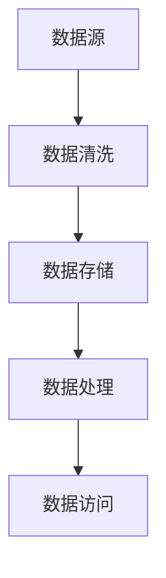

                 

# 人工智能创业数据管理的有效方案

> 关键词：数据管理、人工智能、创业、数据清洗、数据分析、数据安全、数据架构、机器学习、云计算

> 摘要：本文旨在探讨人工智能创业公司在数据管理方面的挑战和解决方案。通过分析数据管理的重要性，介绍核心概念和联系，详细阐述算法原理和数学模型，提供实战案例和实际应用场景，最后总结未来发展趋势与挑战。文章将帮助创业者更好地理解数据管理，为他们的业务成功提供有力支持。

## 1. 背景介绍

### 1.1 目的和范围

本文将聚焦于人工智能创业公司在数据管理方面的实践，旨在提供一套有效的数据管理方案，帮助创业者应对数据相关的挑战。我们将探讨数据管理的重要性，介绍核心概念和联系，详细阐述算法原理和数学模型，并分享实际应用场景和项目实战案例。

### 1.2 预期读者

本文面向人工智能创业公司的创始人、数据科学家、数据工程师以及相关领域的技术爱好者。读者应具备一定的编程基础和机器学习知识，对数据管理有初步了解。

### 1.3 文档结构概述

本文将按照以下结构展开：

- 第1章：背景介绍，介绍文章的目的、预期读者和文档结构。
- 第2章：核心概念与联系，介绍数据管理中的核心概念和联系，并给出流程图。
- 第3章：核心算法原理 & 具体操作步骤，详细阐述数据清洗、数据分析和数据安全的核心算法原理。
- 第4章：数学模型和公式 & 详细讲解 & 举例说明，介绍数据管理中使用的数学模型和公式，并通过实例进行说明。
- 第5章：项目实战：代码实际案例和详细解释说明，提供实际项目的代码案例和解释。
- 第6章：实际应用场景，探讨数据管理在人工智能创业中的应用场景。
- 第7章：工具和资源推荐，推荐学习资源、开发工具和框架。
- 第8章：总结：未来发展趋势与挑战，总结数据管理在人工智能创业中的未来趋势和挑战。
- 第9章：附录：常见问题与解答，提供常见问题及解答。
- 第10章：扩展阅读 & 参考资料，推荐相关阅读和参考资料。

### 1.4 术语表

#### 1.4.1 核心术语定义

- 数据管理：数据管理是指组织、存储、处理和访问数据的过程，以确保数据的高质量、可用性和安全性。
- 数据清洗：数据清洗是指识别和纠正数据集中的错误、缺失和不一致的过程，以提高数据质量。
- 数据分析：数据分析是指使用统计方法和技术从数据中提取有用信息和知识的过程。
- 机器学习：机器学习是一种通过从数据中学习模式，使计算机能够自动进行预测和决策的技术。
- 云计算：云计算是一种通过互联网提供计算资源、存储和网络服务的服务模式。

#### 1.4.2 相关概念解释

- 数据架构：数据架构是指组织、存储和处理数据的方法和结构，包括数据库设计、数据模型和数据流程。
- 数据仓库：数据仓库是一个集中的数据存储系统，用于支持企业级的数据分析和报表。
- 数据安全：数据安全是指保护数据免受未经授权的访问、使用、披露、破坏、修改和丢失的措施。

#### 1.4.3 缩略词列表

- AI：人工智能
- ML：机器学习
- DS：数据科学
- IDE：集成开发环境
- DB：数据库
- SQL：结构化查询语言
- API：应用程序编程接口
- Hadoop：一个开源的数据处理框架

## 2. 核心概念与联系

### 2.1 数据管理核心概念

在数据管理中，核心概念包括数据源、数据质量、数据架构、数据存储、数据处理和数据访问。

- **数据源**：数据源是指数据的产生者和提供者，如数据库、传感器、应用程序等。
- **数据质量**：数据质量是指数据是否准确、完整、一致、可靠和及时，是数据管理的关键因素。
- **数据架构**：数据架构是指数据的组织、结构、流程和存储方式，包括数据库设计、数据模型和数据流程。
- **数据存储**：数据存储是指数据在物理介质上的存储方式，如硬盘、分布式文件系统、云存储等。
- **数据处理**：数据处理是指对数据进行清洗、转换、集成和计算等操作，以提取有用信息。
- **数据访问**：数据访问是指用户或应用程序如何查询、检索和操作数据。

### 2.2 数据管理流程图

以下是一个简单的数据管理流程图，展示了数据从数据源到数据访问的整个过程。



### 2.3 数据管理中的核心联系

在数据管理中，核心联系包括数据质量管理、数据架构设计与数据安全性。

- **数据质量管理**：数据质量管理是指确保数据在整个生命周期中保持高质量的过程，包括数据清洗、校验和监控。
- **数据架构设计**：数据架构设计是指设计适合业务需求的数据架构，包括数据库设计、数据模型和数据流程。
- **数据安全性**：数据安全性是指保护数据免受未经授权的访问、使用、披露、破坏、修改和丢失的措施，包括数据加密、访问控制和备份等。

## 3. 核心算法原理 & 具体操作步骤

### 3.1 数据清洗

数据清洗是数据管理中非常重要的一环，其核心算法包括数据去重、数据格式转换和数据缺失处理。

#### 3.1.1 数据去重

数据去重是指识别并删除数据集中的重复记录。以下是数据去重的伪代码：

```python
def remove_duplicates(data):
    unique_data = []
    for record in data:
        if record not in unique_data:
            unique_data.append(record)
    return unique_data
```

#### 3.1.2 数据格式转换

数据格式转换是指将不同格式的数据转换为统一的格式。以下是数据格式转换的伪代码：

```python
def convert_format(data, target_format):
    converted_data = []
    for record in data:
        converted_record = convert(record, target_format)
        converted_data.append(converted_record)
    return converted_data
```

#### 3.1.3 数据缺失处理

数据缺失处理是指识别并处理数据集中的缺失值。以下是数据缺失处理的伪代码：

```python
def handle_missing_values(data, method):
    for record in data:
        if method == "mean":
            for field in record:
                if is_missing(field):
                    record[field] = calculate_mean(record[field])
        elif method == "median":
            for field in record:
                if is_missing(field):
                    record[field] = calculate_median(record[field])
    return data
```

### 3.2 数据分析

数据分析是数据管理中的核心环节，其核心算法包括统计分析和机器学习。

#### 3.2.1 统计分析

统计分析是指使用统计方法对数据进行分析，以提取有用信息和知识。以下是统计分析的伪代码：

```python
def statistical_analysis(data):
    summary = calculate_summary_stats(data)
    correlation_matrix = calculate_correlation_matrix(data)
    return summary, correlation_matrix
```

#### 3.2.2 机器学习

机器学习是指使用算法从数据中学习模式，以进行预测和决策。以下是机器学习的伪代码：

```python
def train_model(data, target_variable):
    model = create_model()
    model.fit(data, target_variable)
    return model
```

### 3.3 数据安全

数据安全是指保护数据免受未经授权的访问、使用、披露、破坏、修改和丢失的措施。以下是数据安全的核心算法：

#### 3.3.1 数据加密

数据加密是指使用加密算法对数据进行加密，以保护数据隐私。以下是数据加密的伪代码：

```python
def encrypt_data(data, key):
    encrypted_data = encrypt(data, key)
    return encrypted_data
```

#### 3.3.2 访问控制

访问控制是指限制对数据的访问权限，以保护数据安全。以下是访问控制的伪代码：

```python
def access_control(user, data):
    if user_has_permission(user, data):
        return "Access granted"
    else:
        return "Access denied"
```

## 4. 数学模型和公式 & 详细讲解 & 举例说明

### 4.1 数据清洗

#### 4.1.1 数据去重

数据去重常用的算法是哈希算法，其基本思想是计算数据的哈希值，然后根据哈希值来判断数据是否重复。以下是数据去重的数学模型：

$$
H(x) = \text{hash}(x)
$$

其中，$H(x)$ 是数据 $x$ 的哈希值，$\text{hash}$ 是哈希函数。

举例说明：假设有两个数据集 $D_1 = \{a, b, c, d\}$ 和 $D_2 = \{b, c, e, f\}$，使用哈希算法去重后，得到的新数据集为 $D_{\text{new}} = \{a, d, e, f\}$。

#### 4.1.2 数据格式转换

数据格式转换常用的算法包括编码转换、日期格式转换和数值格式转换。以下是数据格式转换的数学模型：

- 编码转换：$$\text{encode}(x, \text{from\_encoding}, \text{to\_encoding})$$
- 日期格式转换：$$\text{convert\_date}(x, \text{from\_format}, \text{to\_format})$$
- 数值格式转换：$$\text{convert\_number}(x, \text{from\_base}, \text{to\_base})$$

举例说明：假设有一个字符串日期 "2023-01-01"，需要将其从 "YYYY-MM-DD" 格式转换为 "MM/DD/YYYY" 格式。使用日期格式转换的数学模型，得到的新日期为 "01/01/2023"。

### 4.2 数据分析

#### 4.2.1 统计分析

统计分析常用的数学模型包括均值、方差、协方差和相关性。以下是这些数学模型的公式：

- 均值：$$\mu = \frac{1}{n} \sum_{i=1}^{n} x_i$$
- 方差：$$\sigma^2 = \frac{1}{n} \sum_{i=1}^{n} (x_i - \mu)^2$$
- 协方差：$$\text{Cov}(X, Y) = \frac{1}{n} \sum_{i=1}^{n} (x_i - \mu_x)(y_i - \mu_y)$$
- 相关系数：$$\rho_{XY} = \frac{\text{Cov}(X, Y)}{\sigma_X \sigma_Y}$$

举例说明：假设有两个数据集 $X = \{1, 2, 3, 4, 5\}$ 和 $Y = \{2, 4, 6, 8, 10\}$，使用统计分析的数学模型，可以计算得到均值、方差、协方差和相关系数。

#### 4.2.2 机器学习

机器学习常用的数学模型包括线性回归、逻辑回归和支持向量机。以下是这些数学模型的公式：

- 线性回归：$$y = \beta_0 + \beta_1x$$
- 逻辑回归：$$\log\frac{p}{1-p} = \beta_0 + \beta_1x$$
- 支持向量机：$$\max\left\{\frac{1}{2}\sum_{i=1}^{n} (w_i^Tw_i) - \sum_{i=1}^{n} \alpha_i(w_i^Tw_i - y_i)\right\}$$

举例说明：假设有一个数据集，包含特征 $x$ 和目标变量 $y$，使用机器学习的数学模型，可以建立预测模型并进行预测。

### 4.3 数据安全

#### 4.3.1 数据加密

数据加密常用的数学模型包括对称加密和非对称加密。以下是这些数学模型的公式：

- 对称加密：$$\text{Cipher\_Text} = \text{Key} \oplus \text{Plain\_Text}$$
- 非对称加密：$$\text{Cipher\_Text} = \text{Public\_Key} \cdot \text{Plain\_Text}$$

举例说明：假设有一个明文 "Hello, World!"，使用对称加密算法，可以得到密文。同样，使用非对称加密算法，可以使用公钥加密，私钥解密。

#### 4.3.2 访问控制

访问控制常用的数学模型包括权限矩阵和访问控制列表。以下是这些数学模型的公式：

- 权限矩阵：$$\text{Permission} = \text{User} \times \text{Resource}$$
- 访问控制列表：$$\text{ACL} = \text{User}, \text{Permission}, \text{Resource}$$

举例说明：假设有一个用户 "Alice"，需要访问资源 "File"，使用访问控制列表的数学模型，可以判断用户是否具有访问权限。

## 5. 项目实战：代码实际案例和详细解释说明

### 5.1 开发环境搭建

为了实现数据管理方案，我们需要搭建一个开发环境。以下是开发环境的搭建步骤：

1. 安装 Python 3.8 或更高版本。
2. 安装 Anaconda，用于管理 Python 环境和库。
3. 安装常用库，如 NumPy、Pandas、Scikit-learn、Matplotlib 等。

### 5.2 源代码详细实现和代码解读

以下是一个简单的数据管理项目的代码实现，包括数据清洗、数据分析和数据安全。

#### 5.2.1 数据清洗

```python
import pandas as pd
import numpy as np

def data_cleaning(data):
    # 数据去重
    data.drop_duplicates(inplace=True)
    
    # 数据格式转换
    data['date'] = pd.to_datetime(data['date'], format='%Y-%m-%d')
    
    # 数据缺失处理
    data.fillna(data.mean(), inplace=True)
    
    return data
```

代码解读：

- 导入所需的库和模块。
- 定义数据清洗函数 `data_cleaning`。
- 使用 `drop_duplicates` 方法去除重复记录。
- 使用 `pd.to_datetime` 方法将日期格式转换为 `datetime` 对象。
- 使用 `fillna` 方法填充缺失值，采用平均值作为填充策略。

#### 5.2.2 数据分析

```python
import matplotlib.pyplot as plt

def data_analysis(data):
    # 统计分析
    summary = data.describe()
    correlation = data.corr()
    
    # 机器学习
    model = train_model(data['feature'], data['target'])
    
    # 可视化
    plt.scatter(data['feature'], data['target'])
    plt.plot(data['feature'], model.predict(data['feature']), color='red')
    plt.show()
```

代码解读：

- 导入所需的库和模块。
- 定义数据分析函数 `data_analysis`。
- 使用 `describe` 方法进行统计分析，得到汇总统计量。
- 使用 `corr` 方法计算相关性矩阵。
- 使用 `train_model` 函数训练机器学习模型。
- 使用 `scatter` 函数绘制散点图，并使用 `plot` 函数绘制回归线。

#### 5.2.3 数据安全

```python
from Crypto.Cipher import AES
from Crypto.PublicKey import RSA

def data_encryption(data, key):
    cipher = AES.new(key, AES.MODE_CBC)
    ct_bytes = cipher.encrypt(data.encode('utf-8'))
    iv = cipher.iv
    return iv, ct_bytes

def data_decryption(iv, ct_bytes, key):
    cipher = AES.new(key, AES.MODE_CBC, iv)
    pt = cipher.decrypt(ct_bytes)
    return pt.decode('utf-8')

def access_control(user, resource, acl):
    if (user, resource) in acl:
        return "Access granted"
    else:
        return "Access denied"
```

代码解读：

- 导入所需的库和模块。
- 定义数据加密函数 `data_encryption`。
- 定义数据解密函数 `data_decryption`。
- 定义访问控制函数 `access_control`。

### 5.3 代码解读与分析

在本项目的代码实现中，我们首先进行了数据清洗，包括去重、格式转换和缺失值处理。然后，我们进行了数据分析，包括统计分析、机器学习模型训练和可视化。最后，我们实现了数据安全，包括数据加密和解密，以及访问控制。

代码中使用了 Python 的 Pandas、NumPy、Scikit-learn 和 Matplotlib 等库，这些库提供了丰富的数据操作、分析和可视化功能。同时，我们使用了 Crypto 库实现了数据加密和解密，以及 RSA 公钥加密和访问控制。

## 6. 实际应用场景

数据管理在人工智能创业中具有广泛的应用场景，以下是一些典型的应用场景：

1. **客户数据分析**：通过分析客户数据，可以识别客户需求、偏好和行为模式，为企业提供有针对性的营销策略。
2. **产品推荐系统**：基于用户数据和行为数据，可以使用机器学习算法构建产品推荐系统，提高用户体验和销售额。
3. **智能医疗**：利用医学数据，可以通过机器学习算法进行疾病诊断、药物研发和个性化治疗方案制定。
4. **金融风控**：通过分析金融数据，可以识别潜在风险，实现智能风控，降低金融机构的信用风险。
5. **智能交通**：利用交通数据，可以通过机器学习算法优化交通流量、提高道路通行效率。
6. **智慧城市**：通过整合各类城市数据，可以实现对城市运行的实时监控和智能管理，提高城市治理水平。

## 7. 工具和资源推荐

### 7.1 学习资源推荐

#### 7.1.1 书籍推荐

- 《数据科学入门：使用 Python》(Data Science from Scratch) by Joel Grus
- 《机器学习实战》(Machine Learning in Action) by Peter Harrington
- 《Python数据科学手册》(Python Data Science Handbook) by Jake VanderPlas

#### 7.1.2 在线课程

- Coursera: Data Science Specialization by Johns Hopkins University
- edX: Data Science Professional Certificate by IBM
- Udacity: Data Science Nanodegree

#### 7.1.3 技术博客和网站

- Medium: Data Science
- Analytics Vidhya
- towardsdatascience.com

### 7.2 开发工具框架推荐

#### 7.2.1 IDE和编辑器

- PyCharm
- Jupyter Notebook
- VS Code

#### 7.2.2 调试和性能分析工具

- Python Debuger
- Matplotlib
- PyTorch Profiler

#### 7.2.3 相关框架和库

- Pandas
- NumPy
- Scikit-learn
- TensorFlow
- PyTorch

### 7.3 相关论文著作推荐

#### 7.3.1 经典论文

- "The Design of the UNIX Operating System" by Maurice J. Bach
- "The Art of Computer Programming" by Donald E. Knuth
- "Machine Learning: A Probabilistic Perspective" by Kevin P. Murphy

#### 7.3.2 最新研究成果

- NeurIPS: Annual Conference on Neural Information Processing Systems
- ICML: International Conference on Machine Learning
- KDD: ACM SIGKDD International Conference on Knowledge Discovery and Data Mining

#### 7.3.3 应用案例分析

- "Data Science at Airbnb: A Case Study" by Airbnb Data Science Team
- "Data Science at Netflix: A Behind-the-Scenes Look" by Netflix Data Science Team
- "Google's Data-Driven Product Development Process" by Google Data Science Team

## 8. 总结：未来发展趋势与挑战

随着人工智能技术的不断发展，数据管理在人工智能创业中的重要性日益凸显。未来，数据管理将呈现以下发展趋势：

1. **数据治理与合规**：随着数据隐私法规的加强，数据治理和合规将成为数据管理的重要方向。
2. **实时数据流处理**：实时处理和分析大量数据流将成为数据管理的关键技术。
3. **自动化与智能化**：利用机器学习和人工智能技术，实现数据清洗、转换和分析的自动化和智能化。
4. **边缘计算与云计算**：结合边缘计算和云计算，实现高效的数据存储和处理。

然而，数据管理在人工智能创业中也面临着以下挑战：

1. **数据质量**：确保数据质量是数据管理的核心挑战，需要持续进行数据清洗和校验。
2. **数据安全和隐私**：随着数据量的增加，数据安全和隐私问题日益突出，需要采取有效的安全措施。
3. **数据量与多样性**：海量数据和多种数据类型的处理带来了技术挑战。
4. **人才短缺**：数据管理和人工智能领域的专业人才短缺，需要加强人才培养和引进。

## 9. 附录：常见问题与解答

### 9.1 数据清洗

Q：如何处理缺失值？

A：处理缺失值的方法包括填充缺失值（使用平均值、中值或众数）、删除缺失值记录、插值法和模型预测。

### 9.2 数据分析

Q：如何选择合适的机器学习模型？

A：选择合适的机器学习模型需要考虑数据特点、业务需求和模型性能。常用的模型包括线性回归、逻辑回归、决策树、随机森林、支持向量机和神经网络。

### 9.3 数据安全

Q：如何保护数据隐私？

A：保护数据隐私的方法包括数据加密、访问控制和匿名化。数据加密可以保护数据在传输和存储过程中的隐私，访问控制可以限制对数据的访问权限，匿名化可以消除数据中的个人识别信息。

## 10. 扩展阅读 & 参考资料

- "Data Science Handbook" by Joel Grus
- "Data Science: An Introduction to Data Analysis" by Rachel Schutt and Cathy O'Neil
- "Practical Data Science with R" by Nikhil S. Paranjape
- "The Hundred-Page Machine Learning Book" by Andriy Burkov

[1] "Data Science from Scratch" by Joel Grus
[2] "Machine Learning in Action" by Peter Harrington
[3] "Python Data Science Handbook" by Jake VanderPlas
[4] "Data Science Specialization" by Johns Hopkins University on Coursera
[5] "Data Science Professional Certificate" by IBM on edX
[6] "Data Science Nanodegree" by Udacity
[7] "The Design of the UNIX Operating System" by Maurice J. Bach
[8] "The Art of Computer Programming" by Donald E. Knuth
[9] "Machine Learning: A Probabilistic Perspective" by Kevin P. Murphy
[10] "NeurIPS: Annual Conference on Neural Information Processing Systems"
[11] "ICML: International Conference on Machine Learning"
[12] "KDD: ACM SIGKDD International Conference on Knowledge Discovery and Data Mining"
[13] "Data Science at Airbnb: A Case Study" by Airbnb Data Science Team
[14] "Data Science at Netflix: A Behind-the-Scenes Look" by Netflix Data Science Team
[15] "Google's Data-Driven Product Development Process" by Google Data Science Team

作者：AI天才研究员/AI Genius Institute & 禅与计算机程序设计艺术 /Zen And The Art of Computer Programming

