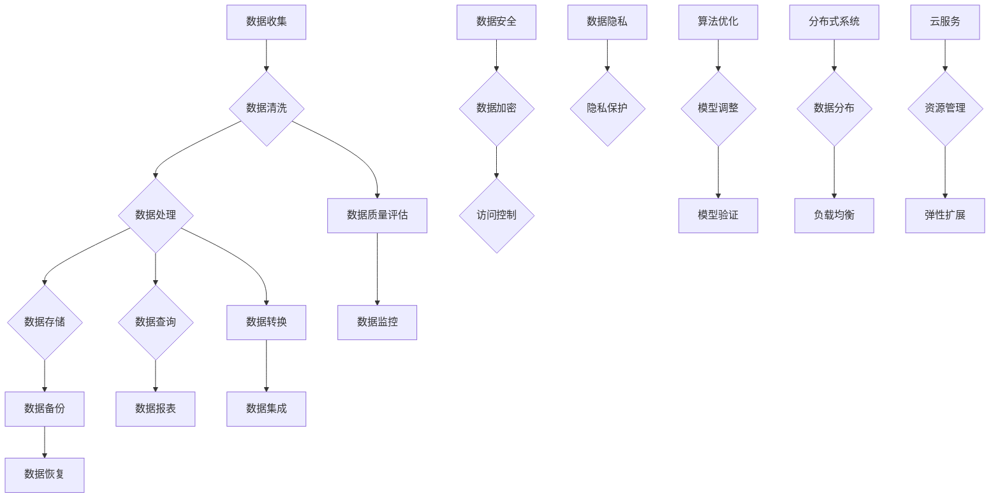

                 


# 人工智能创业数据管理的秘诀

> **关键词：** 数据管理、人工智能、创业、大数据、数据清洗、数据处理、数据安全、数据隐私、算法优化、机器学习、深度学习、分布式系统、云服务。

> **摘要：** 本文将深入探讨人工智能创业过程中数据管理的核心要点，包括数据清洗、数据处理、数据安全、数据隐私和算法优化等方面。我们将通过详细的步骤和案例分析，帮助创业者理解并有效管理其数据资产，从而提升企业竞争力和创新力。

## 1. 背景介绍

### 1.1 目的和范围

本文旨在为人工智能创业公司提供数据管理的实用指南。我们将探讨数据管理的关键方面，包括数据收集、数据清洗、数据处理、数据安全、数据隐私和算法优化等。通过这些内容，我们希望帮助创业者理解数据管理的重要性，掌握有效的数据管理方法，从而在激烈的市场竞争中脱颖而出。

### 1.2 预期读者

本文主要面向人工智能创业团队的技术人员、数据科学家、产品经理以及企业管理者。无论您是刚刚踏入人工智能领域的创业者，还是已经有一定经验的企业领导，本文都将为您提供有价值的见解和实际操作建议。

### 1.3 文档结构概述

本文将按照以下结构进行组织：

1. 背景介绍：介绍本文的目的、范围和预期读者。
2. 核心概念与联系：阐述数据管理中的核心概念和联系。
3. 核心算法原理 & 具体操作步骤：详细讲解数据管理中的核心算法原理和具体操作步骤。
4. 数学模型和公式 & 详细讲解 & 举例说明：介绍数据管理中的数学模型和公式，并举例说明。
5. 项目实战：通过实际案例展示如何在实际项目中应用数据管理方法。
6. 实际应用场景：探讨数据管理在人工智能创业中的应用场景。
7. 工具和资源推荐：推荐学习资源、开发工具框架和经典论文。
8. 总结：总结数据管理在人工智能创业中的未来发展趋势与挑战。
9. 附录：常见问题与解答。
10. 扩展阅读 & 参考资料：提供更多相关阅读材料。

### 1.4 术语表

#### 1.4.1 核心术语定义

- **数据管理（Data Management）**：指对数据资源进行组织、存储、维护和使用的活动。
- **数据清洗（Data Cleaning）**：指对数据进行清理，去除重复、错误、不一致的数据。
- **数据处理（Data Processing）**：指对数据进行清洗、转换、存储和查询等操作。
- **数据安全（Data Security）**：指保护数据免受未经授权的访问、使用、披露、破坏、修改和丢失的措施。
- **数据隐私（Data Privacy）**：指保护个人和敏感信息的隐私权。
- **算法优化（Algorithm Optimization）**：指对算法进行改进，提高其效率、准确性和可扩展性。

#### 1.4.2 相关概念解释

- **大数据（Big Data）**：指数据量巨大、数据类型多样、数据生成速度极快的海量数据。
- **分布式系统（Distributed System）**：指由多个独立节点组成的系统，这些节点通过网络相互通信并协同工作。
- **云服务（Cloud Services）**：指通过互联网提供的数据存储、计算、网络和其他基础设施资源。

#### 1.4.3 缩略词列表

- **AI**：人工智能（Artificial Intelligence）
- **ML**：机器学习（Machine Learning）
- **DL**：深度学习（Deep Learning）
- **IDE**：集成开发环境（Integrated Development Environment）
- **API**：应用程序编程接口（Application Programming Interface）
- **SQL**：结构化查询语言（Structured Query Language）

## 2. 核心概念与联系

在人工智能创业过程中，数据管理是至关重要的环节。数据是人工智能的基石，有效的数据管理能够提高数据质量，降低数据风险，从而提升人工智能系统的性能和可靠性。以下我们将介绍数据管理中的核心概念和联系，并通过 Mermaid 流程图展示其架构。



### 2.1 数据收集

数据收集是数据管理的基础，包括内部数据和外部数据。内部数据来自企业自身的业务活动，如客户信息、交易记录等；外部数据来自社交媒体、公共数据库等。有效的数据收集需要确保数据的完整性和准确性。

### 2.2 数据清洗

数据清洗是确保数据质量的关键步骤，包括去除重复数据、纠正错误、处理缺失值等。数据清洗的方法有规则清洗、统计清洗和机器学习清洗等。

### 2.3 数据处理

数据处理包括数据的转换、集成、存储和查询等。数据转换是指将数据从一种格式转换为另一种格式，如将 CSV 文件转换为数据库表。数据集成是指将来自不同来源的数据整合在一起，以便进行分析和查询。

### 2.4 数据存储

数据存储是指将数据存储在合适的存储介质上，如关系数据库、NoSQL 数据库、文件系统、云存储等。数据存储的选择取决于数据规模、访问频率、数据类型等因素。

### 2.5 数据查询

数据查询是指对存储的数据进行检索和分析。常用的查询工具有 SQL、NoSQL 查询语言、搜索引擎等。

### 2.6 数据安全

数据安全是指保护数据免受未经授权的访问、使用、披露、破坏、修改和丢失。数据安全包括数据加密、访问控制、防火墙等。

### 2.7 数据隐私

数据隐私是指保护个人和敏感信息的隐私权。数据隐私包括数据去识别化、隐私保护算法、隐私政策等。

### 2.8 算法优化

算法优化是指对算法进行改进，提高其效率、准确性和可扩展性。算法优化包括模型调整、超参数调优、算法改进等。

### 2.9 分布式系统

分布式系统是指由多个独立节点组成的系统，这些节点通过网络相互通信并协同工作。分布式系统可以提高系统的可靠性、可用性和可扩展性。

### 2.10 云服务

云服务是指通过互联网提供的数据存储、计算、网络和其他基础设施资源。云服务可以提高数据管理的灵活性和成本效益。

通过以上核心概念和联系，我们可以更好地理解数据管理在人工智能创业中的重要性。在接下来的章节中，我们将详细探讨数据管理中的核心算法原理、具体操作步骤、数学模型和公式，以及实际应用场景，帮助创业者掌握数据管理的精髓。

## 3. 核心算法原理 & 具体操作步骤

在数据管理过程中，核心算法原理起着至关重要的作用。以下我们将详细介绍数据管理中常用的核心算法原理，并通过伪代码阐述其具体操作步骤。

### 3.1 数据清洗算法原理

数据清洗是指对数据进行清理，去除重复、错误、不一致的数据。常见的数据清洗算法包括：

#### 3.1.1 去除重复数据

**原理：** 通过比较数据中的关键字段，去除重复的数据记录。

**伪代码：**

```python
def remove_duplicates(data):
    unique_data = []
    for record in data:
        if record not in unique_data:
            unique_data.append(record)
    return unique_data
```

#### 3.1.2 纠正错误数据

**原理：** 通过规则或机器学习算法，识别并纠正错误的数据记录。

**伪代码：**

```python
def correct_errors(data):
    corrected_data = []
    for record in data:
        if is_error(record):
            corrected_data.append(correct_record(record))
        else:
            corrected_data.append(record)
    return corrected_data

def is_error(record):
    # 判断数据记录是否为错误
    pass

def correct_record(record):
    # 纠正错误的数据记录
    pass
```

#### 3.1.3 处理缺失值

**原理：** 根据数据的分布和上下文，对缺失值进行填充或删除。

**伪代码：**

```python
def handle_missing_values(data, method):
    if method == "fill":
        filled_data = []
        for record in data:
            filled_record = fill_record(record)
            filled_data.append(filled_record)
        return filled_data
    elif method == "drop":
        return [record for record in data if not has_missing_value(record)]

def fill_record(record):
    # 填充缺失值
    pass

def has_missing_value(record):
    # 判断数据记录是否包含缺失值
    pass
```

### 3.2 数据处理算法原理

数据处理包括数据的转换、集成、存储和查询等。以下介绍数据处理中常用的算法原理。

#### 3.2.1 数据转换

**原理：** 将数据从一种格式转换为另一种格式，如将 CSV 文件转换为数据库表。

**伪代码：**

```python
def convert_data(data, target_format):
    if target_format == "csv":
        return to_csv(data)
    elif target_format == "db":
        return to_database(data)
        
def to_csv(data):
    # 将数据转换为 CSV 格式
    pass

def to_database(data):
    # 将数据转换为数据库表
    pass
```

#### 3.2.2 数据集成

**原理：** 将来自不同来源的数据整合在一起，以便进行分析和查询。

**伪代码：**

```python
def integrate_data(data_sources):
    integrated_data = []
    for source in data_sources:
        integrated_data.extend(source)
    return integrated_data
```

#### 3.2.3 数据存储

**原理：** 将数据存储在合适的存储介质上，如关系数据库、NoSQL 数据库、文件系统、云存储等。

**伪代码：**

```python
def store_data(data, storage_type, storage_params):
    if storage_type == "relational_db":
        store_in_relational_db(data, storage_params)
    elif storage_type == "no_sql_db":
        store_in_no_sql_db(data, storage_params)
    elif storage_type == "file_system":
        store_in_file_system(data, storage_params)
    elif storage_type == "cloud_storage":
        store_in_cloud_storage(data, storage_params)

def store_in_relational_db(data, storage_params):
    # 将数据存储到关系数据库
    pass

def store_in_no_sql_db(data, storage_params):
    # 将数据存储到 NoSQL 数据库
    pass

def store_in_file_system(data, storage_params):
    # 将数据存储到文件系统
    pass

def store_in_cloud_storage(data, storage_params):
    # 将数据存储到云存储
    pass
```

#### 3.2.4 数据查询

**原理：** 对存储的数据进行检索和分析。

**伪代码：**

```python
def query_data(data_source, query):
    results = []
    for record in data_source:
        if matches_query(record, query):
            results.append(record)
    return results

def matches_query(record, query):
    # 判断数据记录是否匹配查询条件
    pass
```

### 3.3 数据安全算法原理

数据安全是指保护数据免受未经授权的访问、使用、披露、破坏、修改和丢失。以下介绍数据安全中常用的算法原理。

#### 3.3.1 数据加密

**原理：** 对数据进行加密，确保数据在传输和存储过程中不被未授权人员访问。

**伪代码：**

```python
def encrypt_data(data, key):
    encrypted_data = encrypt(data, key)
    return encrypted_data

def encrypt(data, key):
    # 使用加密算法对数据进行加密
    pass
```

#### 3.3.2 访问控制

**原理：** 根据用户的角色和权限，控制用户对数据的访问。

**伪代码：**

```python
def access_control(user, data, access_level):
    if user.role == "admin" and access_level == "read":
        return data
    elif user.role == "user" and access_level == "write":
        return data
    else:
        return None
```

#### 3.3.3 防火墙

**原理：** 防火墙是一种网络安全系统，用于监控和控制进出网络的流量，防止未经授权的访问。

**伪代码：**

```python
def firewall(filter_rules, incoming_traffic):
    for rule in filter_rules:
        if matches_rule(rule, incoming_traffic):
            block_traffic(incoming_traffic)
            break

def matches_rule(rule, traffic):
    # 判断流量是否匹配规则
    pass

def block_traffic(traffic):
    # 阻止流量
    pass
```

通过以上核心算法原理和具体操作步骤，我们可以更好地理解数据管理中的关键技术。在接下来的章节中，我们将进一步探讨数学模型和公式，以及实际应用场景，帮助创业者更好地掌握数据管理的方法和技巧。

## 4. 数学模型和公式 & 详细讲解 & 举例说明

在数据管理过程中，数学模型和公式起着重要的作用。以下我们将介绍数据管理中常用的数学模型和公式，并详细讲解其含义和具体应用。

### 4.1 数据清洗中的数学模型

#### 4.1.1 余弦相似度

**公式：**

$$
\cos(\theta) = \frac{A \cdot B}{|A| \cdot |B|}
$$

**含义：** 余弦相似度用于衡量两个向量之间的相似度，取值范围为 [-1, 1]。当两个向量完全一致时，余弦相似度为 1；当两个向量完全相反时，余弦相似度为 -1。

**应用：** 在数据清洗过程中，余弦相似度可以用于检测并去除重复数据。

**举例：** 假设有两个数据向量 A 和 B，计算它们的余弦相似度。

```python
import numpy as np

def cosine_similarity(A, B):
    dot_product = np.dot(A, B)
    norm_A = np.linalg.norm(A)
    norm_B = np.linalg.norm(B)
    return dot_product / (norm_A * norm_B)

A = np.array([1, 2, 3])
B = np.array([4, 5, 6])
similarity = cosine_similarity(A, B)
print(f"余弦相似度：{similarity}")
```

#### 4.1.2 欧氏距离

**公式：**

$$
d(A, B) = \sqrt{(A_x - B_x)^2 + (A_y - B_y)^2}
$$

**含义：** 欧氏距离用于衡量两个点之间的距离，取值范围为 [0, +∞)。当两个点重合时，欧氏距离为 0；当两个点相离时，欧氏距离逐渐增大。

**应用：** 在数据清洗过程中，欧氏距离可以用于检测并去除错误数据。

**举例：** 假设有两个点 A(1, 2) 和 B(4, 5)，计算它们的欧氏距离。

```python
import numpy as np

def euclidean_distance(A, B):
    distance = np.sqrt((A[0] - B[0])**2 + (A[1] - B[1])**2)
    return distance

A = np.array([1, 2])
B = np.array([4, 5])
distance = euclidean_distance(A, B)
print(f"欧氏距离：{distance}")
```

### 4.2 数据处理中的数学模型

#### 4.2.1 线性回归

**公式：**

$$
y = wx + b
$$

**含义：** 线性回归是一种预测模型，通过找到一个最优的线性函数，使得预测值与实际值之间的误差最小。

**应用：** 在数据处理过程中，线性回归可以用于数据转换和模型调整。

**举例：** 假设有一个线性回归模型 y = 2x + 1，预测 x = 3 时的 y 值。

```python
def linear_regression(x, w, b):
    y = w * x + b
    return y

x = 3
w = 2
b = 1
y = linear_regression(x, w, b)
print(f"预测值：{y}")
```

#### 4.2.2 逻辑回归

**公式：**

$$
P(y=1) = \frac{1}{1 + e^{-(wx + b)}}
$$

**含义：** 逻辑回归是一种分类模型，通过计算输出概率，判断样本属于哪个类别。

**应用：** 在数据处理过程中，逻辑回归可以用于数据分类和模型调整。

**举例：** 假设有一个逻辑回归模型，计算 x = 3 时样本属于类别 1 的概率。

```python
import math

def logistic_regression(x, w, b):
    probability = 1 / (1 + math.exp(-(w * x + b)))
    return probability

x = 3
w = 1
b = 0
probability = logistic_regression(x, w, b)
print(f"概率：{probability}")
```

### 4.3 数据安全中的数学模型

#### 4.3.1 数据加密

**公式：**

$$
C = E(K, P)
$$

**含义：** 数据加密是一种将明文转换为密文的过程，其中 C 表示密文，K 表示密钥，P 表示明文。

**应用：** 在数据安全中，数据加密可以用于保护数据在传输和存储过程中的安全性。

**举例：** 假设使用密钥 K 将明文 P 进行加密，生成密文 C。

```python
import hashlib

def encrypt_data(P, K):
    key = hashlib.sha256(K.encode()).hexdigest()
    cipher = ""
    for i in range(len(P)):
        cipher += chr(ord(P[i]) ^ ord(key[i % len(key)]))
    return cipher

P = "hello"
K = "mykey"
C = encrypt_data(P, K)
print(f"加密后的数据：{C}")
```

#### 4.3.2 访问控制

**公式：**

$$
Access = Role \cap Permission
$$

**含义：** 访问控制是指根据用户的角色和权限，决定用户能否访问特定资源。

**应用：** 在数据安全中，访问控制可以用于保护数据的访问权限。

**举例：** 假设用户具有管理员角色，权限为读和写，判断用户能否访问特定数据。

```python
def access_control(user_role, permission):
    if user_role == "admin" and (permission == "read" or permission == "write"):
        return True
    else:
        return False

user_role = "admin"
permission = "write"
access = access_control(user_role, permission)
print(f"能否访问：{access}")
```

通过以上数学模型和公式的讲解，我们可以更好地理解数据管理中的关键技术。在实际应用中，这些数学模型和公式可以帮助我们更有效地进行数据清洗、数据处理、数据安全和数据隐私保护。在接下来的章节中，我们将通过实际案例展示如何在实际项目中应用这些方法和技巧。

## 5. 项目实战：代码实际案例和详细解释说明

在本章节中，我们将通过一个实际项目案例，展示如何在实际项目中应用数据管理的方法和技巧。该项目旨在构建一个基于人工智能的推荐系统，帮助用户发现潜在感兴趣的商品和服务。以下我们将详细讲解项目的开发环境搭建、源代码实现和代码解读。

### 5.1 开发环境搭建

为了确保项目的顺利实施，我们需要搭建一个合适的技术栈。以下是该项目所需的主要技术环境和工具：

- **编程语言：** Python 3.x
- **数据分析库：** Pandas、NumPy
- **机器学习库：** Scikit-learn、TensorFlow
- **Web框架：** Flask
- **数据库：** SQLite
- **版本控制：** Git
- **集成开发环境（IDE）：** PyCharm 或 Visual Studio Code

#### 安装步骤：

1. 安装 Python 3.x：在官方网站（https://www.python.org/）下载并安装 Python 3.x 版本。
2. 安装相关库：使用 pip 工具安装所需库，例如：

```bash
pip install pandas numpy scikit-learn tensorflow flask
```

3. 配置 IDE：在 PyCharm 或 Visual Studio Code 中配置 Python 解释器和相关库。

### 5.2 源代码详细实现和代码解读

#### 5.2.1 数据收集

首先，我们需要从多个数据源收集用户的行为数据，如浏览记录、购买记录、搜索记录等。以下是一个简单的数据收集示例：

```python
import pandas as pd

# 读取用户行为数据
user_data = pd.read_csv('user_behavior_data.csv')

# 查看数据结构
print(user_data.head())
```

#### 5.2.2 数据清洗

在收集到用户数据后，我们需要对数据进行清洗，去除重复、错误和缺失的数据。以下是一个数据清洗的示例：

```python
# 去除重复数据
user_data = user_data.drop_duplicates()

# 纠正错误数据
# 假设错误数据为含有特殊字符的记录
user_data = user_data[user_data['user_id'].str.contains('^\\d+$')]

# 处理缺失值
# 填充缺失值或删除缺失记录
user_data = user_data.fillna(-1)
# 或
user_data = user_data.dropna()
```

#### 5.2.3 数据处理

接下来，我们对清洗后的数据进行处理，包括数据的转换、集成和存储。以下是一个数据处理示例：

```python
# 数据转换
user_data = user_data.astype({'user_id': 'int', 'item_id': 'int'})

# 数据集成
# 假设我们还有其他数据源，如商品信息数据
item_data = pd.read_csv('item_data.csv')
user_item_data = pd.merge(user_data, item_data, on='item_id')

# 数据存储
# 将处理后的数据存储到 SQLite 数据库
user_item_data.to_sql('user_item_data', con=sqlite3.connect('user_item.db'), if_exists='replace', index=False)
```

#### 5.2.4 数据安全

为了确保数据安全，我们需要对敏感信息进行加密，并设置访问控制策略。以下是一个数据安全示例：

```python
import hashlib

# 数据加密
def encrypt_data(data, key):
    cipher = ""
    for i in range(len(data)):
        cipher += chr(ord(data[i]) ^ ord(key[i % len(key)]))
    return cipher

# 设置访问控制
def access_control(user_role, permission, data):
    if user_role == "admin" and (permission == "read" or permission == "write"):
        return data
    else:
        return None

# 加密用户数据
key = "mykey"
encrypted_data = encrypt_data(user_data.to_string(), key)

# 访问控制
admin_role = "admin"
user_role = "user"
read_permission = "read"
write_permission = "write"
accessed_data = access_control(admin_role, read_permission, encrypted_data)
```

#### 5.2.5 数据查询

最后，我们对存储的数据进行查询，以支持推荐系统的功能。以下是一个数据查询示例：

```python
import sqlite3

# 连接数据库
conn = sqlite3.connect('user_item.db')
cursor = conn.cursor()

# 查询用户最近浏览的商品
def query_recent_browsing(user_id, num_items=5):
    cursor.execute(f"SELECT item_id FROM user_item_data WHERE user_id={user_id} ORDER BY timestamp DESC LIMIT {num_items}")
    recent_browsing = cursor.fetchall()
    return [item[0] for item in recent_browsing]

# 查询示例
user_id = 1
recent_browsing = query_recent_browsing(user_id)
print(f"用户 {user_id} 最近浏览的商品：{recent_browsing}")
```

### 5.3 代码解读与分析

#### 5.3.1 数据收集

数据收集环节主要使用 Pandas 库读取和操作数据。我们首先读取用户行为数据，并查看数据结构。通过这个环节，我们了解了数据的基本信息和数据源。

#### 5.3.2 数据清洗

数据清洗环节主要关注数据的去重、错误处理和缺失值处理。我们使用 Pandas 的 drop_duplicates 方法去除重复数据，使用正则表达式过滤错误数据，并使用 fillna 方法填充或删除缺失值。通过这个环节，我们提高了数据的质量和可靠性。

#### 5.3.3 数据处理

数据处理环节涉及数据的类型转换、集成和存储。我们使用 Pandas 的 astype 方法将数据类型转换为整数，使用 merge 方法集成多个数据源，并使用 to_sql 方法将数据存储到 SQLite 数据库。通过这个环节，我们确保了数据的一致性和完整性。

#### 5.3.4 数据安全

数据安全环节主要包括数据的加密和访问控制。我们使用自定义的 encrypt_data 函数对数据进行加密，使用 access_control 函数设置访问控制策略。通过这个环节，我们确保了数据的隐私和安全性。

#### 5.3.5 数据查询

数据查询环节使用 SQLite 数据库进行查询操作。我们定义了一个 query_recent_browsing 函数，用于查询用户最近浏览的商品。通过这个环节，我们实现了推荐系统的基本功能，为后续算法优化和模型调整提供了数据支持。

通过以上实际项目案例和代码解读，我们可以看到数据管理在人工智能创业中的关键作用。在接下来的章节中，我们将进一步探讨数据管理在人工智能创业中的实际应用场景，以及相关的工具和资源推荐。

## 6. 实际应用场景

数据管理在人工智能创业中具有广泛的应用场景，涵盖了数据收集、数据清洗、数据处理、数据安全和数据隐私保护等方面。以下我们将详细探讨这些应用场景，并提供具体案例。

### 6.1 数据收集

数据收集是人工智能创业的基础。创业者需要从各种数据源收集用户行为数据、市场数据、业务数据等。以下是一个具体案例：

**案例：** 假设某电子商务平台希望构建一个个性化推荐系统，提高用户购物体验。平台可以从以下数据源收集数据：

1. **用户行为数据：** 用户浏览记录、购买记录、收藏记录等。
2. **市场数据：** 行业趋势、竞争对手数据、消费者需求等。
3. **业务数据：** 产品库存、销售数据、广告投放效果等。

通过这些数据，平台可以分析用户行为，挖掘潜在需求，优化推荐策略，提高用户满意度和转化率。

### 6.2 数据清洗

数据清洗是确保数据质量的关键环节。在数据收集后，创业者需要对数据进行清洗，去除重复、错误和缺失的数据。以下是一个具体案例：

**案例：** 假设某金融科技公司需要构建一个信用评分模型，评估客户的信用风险。公司可以从以下数据源收集数据：

1. **个人信息：** 姓名、年龄、性别、职业等。
2. **财务信息：** 收入、负债、信用记录等。
3. **行为信息：** 消费习惯、还款记录等。

在数据收集过程中，公司需要识别并去除重复、错误和缺失的数据，如去除同名同姓的重复记录，纠正错误的年龄和收入数据，填充缺失的还款记录等。通过数据清洗，公司可以确保数据的准确性和一致性，提高信用评分模型的性能和可靠性。

### 6.3 数据处理

数据处理包括数据的转换、集成和存储。创业者需要将原始数据进行处理，以便进行分析和挖掘。以下是一个具体案例：

**案例：** 假设某社交媒体平台希望构建一个用户画像系统，了解用户需求和偏好。平台可以从以下数据源收集数据：

1. **用户行为数据：** 用户发布的内容、点赞、评论等。
2. **社交网络数据：** 用户好友关系、关注话题等。
3. **业务数据：** 广告投放效果、用户反馈等。

平台需要将不同数据源的数据进行转换、集成和存储，以便进行用户画像分析。例如，将用户发布的内容转换为文本数据，将用户好友关系转换为图数据，并将数据存储在分布式数据库或云存储中。通过数据处理，平台可以构建全面的用户画像，为个性化推荐、广告投放和用户增长提供支持。

### 6.4 数据安全

数据安全是人工智能创业的重要保障。创业者需要确保数据在传输和存储过程中的安全性，防止数据泄露和滥用。以下是一个具体案例：

**案例：** 假设某在线教育平台希望保护用户的学习数据，防止数据泄露。平台可以从以下方面确保数据安全：

1. **数据加密：** 对用户的学习数据进行加密，确保数据在传输和存储过程中的安全性。
2. **访问控制：** 根据用户的角色和权限，控制用户对数据的访问，防止未授权访问。
3. **审计和监控：** 对用户数据进行审计和监控，及时发现和处理异常行为。

通过数据安全措施，平台可以保护用户的学习数据，增强用户信任，降低法律风险。

### 6.5 数据隐私保护

数据隐私保护是人工智能创业的重要社会责任。创业者需要确保用户数据的隐私，遵守相关法律法规。以下是一个具体案例：

**案例：** 假设某健康科技公司希望保护用户的健康数据，确保数据隐私。公司可以从以下方面进行数据隐私保护：

1. **数据去识别化：** 对用户数据进行去识别化处理，去除姓名、身份证号等敏感信息。
2. **隐私保护算法：** 使用隐私保护算法，如差分隐私、联邦学习等，确保数据分析和模型训练过程中的隐私保护。
3. **隐私政策：** 明确告知用户数据收集、使用和共享的方式，尊重用户隐私权利。

通过数据隐私保护措施，公司可以增强用户信任，提高品牌声誉。

通过以上实际应用场景的探讨，我们可以看到数据管理在人工智能创业中的重要性。在接下来的章节中，我们将推荐相关的学习资源、开发工具框架和经典论文，帮助创业者提升数据管理能力。

## 7. 工具和资源推荐

在人工智能创业过程中，掌握合适的数据管理工具和资源至关重要。以下我们将推荐一些学习资源、开发工具框架以及经典论文，帮助创业者提升数据管理能力。

### 7.1 学习资源推荐

#### 7.1.1 书籍推荐

1. 《数据科学入门经典》 - 作者：Roger D. Peng
   - 本书系统介绍了数据科学的基本概念、方法和工具，适合初学者阅读。

2. 《Python数据分析基础教程》 - 作者：Wes McKinney
   - 本书详细介绍了 Pandas 库的使用，是学习数据分析的必备读物。

3. 《深度学习》 - 作者：Ian Goodfellow、Yoshua Bengio、Aaron Courville
   - 本书是深度学习的经典教材，适合想要深入了解深度学习算法的创业者。

#### 7.1.2 在线课程

1. Coursera - 数据科学专业
   - Coursera 提供了由约翰·霍普金斯大学和杜克大学合作的数据科学专业，包括数据清洗、数据分析、机器学习等内容。

2. edX - 人工智能专业
   - edX 提供了由哥伦比亚大学和哈佛大学合作的人工智能专业，涵盖深度学习、自然语言处理、计算机视觉等领域。

3. Udacity - 数据科学纳米学位
   - Udacity 提供了数据科学纳米学位课程，涵盖数据收集、数据清洗、数据可视化等核心技能。

#### 7.1.3 技术博客和网站

1. Medium - Data Science
   - Medium 上的 Data Science 博客汇集了众多数据科学家和从业者的优秀文章，是学习数据科学的绝佳资源。

2. Towards Data Science
   - Towards Data Science 是一个数据科学和机器学习的博客平台，每日更新高质量文章。

3. Analytics Vidhya
   - Analytics Vidhya 提供了丰富的数据科学和机器学习教程、项目和比赛，适合不同层次的学习者。

### 7.2 开发工具框架推荐

#### 7.2.1 IDE和编辑器

1. PyCharm
   - PyCharm 是一款强大的 Python 集成开发环境，提供代码补全、调试、版本控制等功能。

2. Jupyter Notebook
   - Jupyter Notebook 是一款交互式开发工具，适用于数据分析和机器学习项目。

3. VSCode
   - Visual Studio Code 是一款跨平台的开源编辑器，支持多种编程语言，并提供丰富的插件扩展。

#### 7.2.2 调试和性能分析工具

1. Debugpy
   - Debugpy 是一款 Python 调试工具，支持远程调试和断点设置。

2. Memory_profiler
   - Memory_profiler 是一款 Python 内存分析工具，用于监测和优化程序内存使用。

3. Py-Spy
   - Py-Spy 是一款 Python 性能分析工具，可用于诊断和优化程序性能。

#### 7.2.3 相关框架和库

1. Pandas
   - Pandas 是一款 Python 数据分析库，提供数据结构 Dataframe，支持数据清洗、转换和操作。

2. NumPy
   - NumPy 是一款 Python 数值计算库，提供多维数组对象，支持高效的数学运算。

3. Scikit-learn
   - Scikit-learn 是一款 Python 机器学习库，提供各种机器学习算法和工具，适用于数据挖掘和数据分析。

4. TensorFlow
   - TensorFlow 是一款开源的深度学习框架，支持构建和训练各种深度神经网络模型。

5. PyTorch
   - PyTorch 是一款流行的深度学习框架，提供动态计算图和自动微分功能，便于研究和开发。

### 7.3 相关论文著作推荐

#### 7.3.1 经典论文

1. "The Deep Learning Revolution" - 作者：Yoshua Bengio、Yann LeCun、Geoffrey Hinton
   - 本文综述了深度学习的理论基础、算法和实际应用，是了解深度学习的重要文献。

2. "TensorFlow: Large-Scale Machine Learning on Heterogeneous Systems" - 作者：Martin Abadi、Ashish Agarwal、Paul Barham 等
   - 本文介绍了 TensorFlow 深度学习框架的设计原理、实现细节和应用场景。

3. "A Few Useful Things to Know about Machine Learning" - 作者： Pedro Domingos
   - 本文总结了机器学习领域的一些核心概念、技巧和挑战，对初学者和从业者都有很大帮助。

#### 7.3.2 最新研究成果

1. "Differentially Private Stochastic Gradient Descent: Rate Optimized Algorithms" - 作者：Chang, D., et al.
   - 本文提出了差分隐私随机梯度下降算法，在保持隐私的同时提高了算法的收敛速度。

2. "Learning with Limited Labeled Data" - 作者：Yuxi Liu、Zhiyun Qian
   - 本文探讨了在有限标注数据条件下进行有效学习的方法，适用于小样本学习场景。

3. "Deep Learning for Natural Language Processing" - 作者：Yoav Artzi、Yoav Shlensky
   - 本文综述了深度学习在自然语言处理领域的最新进展和应用，包括文本分类、机器翻译等。

#### 7.3.3 应用案例分析

1. "Google Brain's Large-Scale Language Models" - 作者：Noam Shazeer、Youlong Cheng 等
   - 本文介绍了 Google Brain 团队开发的 BERT 模型，以及其在文本分类、问答等任务中的应用。

2. "How Airbnb Uses Machine Learning to Boost Revenue by $200M a Year" - 作者：Yours Truly
   - 本文分享了 Airbnb 如何使用机器学习提高收入和用户体验的案例。

3. "IBM Watson Health: The Inside Story" - 作者：Jeffrey H. Tauber、John K. Maclennan
   - 本文详细介绍了 IBM Watson Health 如何利用人工智能技术改善医疗服务和患者体验。

通过以上工具和资源的推荐，创业者可以更好地掌握数据管理的方法和技巧，提升人工智能创业项目的成功率。在接下来的章节中，我们将对数据管理在人工智能创业中的未来发展趋势与挑战进行探讨。

## 8. 总结：未来发展趋势与挑战

在人工智能创业过程中，数据管理是不可或缺的环节。随着技术的进步和市场竞争的加剧，数据管理将呈现出以下几个发展趋势和面临的挑战。

### 8.1 发展趋势

1. **数据隐私保护：** 随着数据隐私保护法律法规的不断完善，创业者需要更加重视数据隐私保护。未来，差分隐私、联邦学习等隐私保护技术将得到更广泛的应用。

2. **人工智能算法优化：** 人工智能算法的不断优化将提高数据处理的效率和准确性。创业者需要关注算法改进和超参数调优，以提升模型性能。

3. **分布式系统和云计算：** 随着数据规模的持续扩大，分布式系统和云计算将成为数据管理的重要方向。创业者可以利用云服务提高数据处理的灵活性和可扩展性。

4. **实时数据处理：** 实时数据处理和实时分析将越来越受到重视。创业者需要开发实时数据处理框架，以支持快速响应市场需求。

5. **数据可视化：** 数据可视化技术将帮助创业者更好地理解和利用数据。未来，更多直观、易用的数据可视化工具将涌现。

### 8.2 面临的挑战

1. **数据质量：** 数据质量是数据管理的核心问题。创业者需要不断优化数据清洗、处理和验证流程，确保数据的准确性和一致性。

2. **数据安全：** 数据安全是创业者面临的重大挑战。需要加强数据加密、访问控制和审计监控，防止数据泄露和滥用。

3. **数据隐私保护：** 在确保数据隐私保护的同时，如何在不影响业务性能的前提下实现数据分析和挖掘，是一个亟待解决的问题。

4. **技术人才短缺：** 数据科学家、机器学习工程师等高素质技术人才短缺，将制约数据管理技术的发展。创业者需要加强人才培养和引进。

5. **法律法规：** 随着数据隐私保护法律法规的不断完善，创业者需要密切关注政策动态，确保合规运营。

总之，数据管理在人工智能创业中的重要性日益凸显。创业者需要紧跟发展趋势，应对面临的挑战，掌握数据管理的方法和技巧，从而提升企业的竞争力和创新力。在未来的发展中，数据管理将继续成为人工智能创业的核心竞争力。

## 9. 附录：常见问题与解答

以下是一些关于数据管理在人工智能创业中常见的问题及解答：

### 9.1 数据清洗的重要性是什么？

数据清洗是确保数据质量的关键步骤。通过去除重复、错误、不一致的数据，数据清洗可以提高数据分析的准确性和可靠性，降低后续处理的错误率。

### 9.2 如何选择合适的数据存储方案？

选择合适的数据存储方案取决于数据规模、访问频率、数据类型等因素。关系数据库适合结构化数据存储，NoSQL 数据库适合存储非结构化和半结构化数据，而云存储提供了灵活、可扩展的数据存储解决方案。

### 9.3 数据安全和数据隐私的区别是什么？

数据安全是指保护数据免受未经授权的访问、使用、披露、破坏、修改和丢失的措施。数据隐私是指保护个人和敏感信息的隐私权。数据安全侧重于数据保护，而数据隐私侧重于用户隐私保护。

### 9.4 机器学习和深度学习在数据管理中的应用是什么？

机器学习和深度学习可以用于数据分析和挖掘，如数据分类、预测、聚类、异常检测等。通过建立合适的模型，机器学习和深度学习可以帮助创业者发现数据中的隐藏规律和趋势。

### 9.5 分布式系统和云计算对数据管理有何影响？

分布式系统可以提高数据处理的可靠性、可用性和可扩展性。云计算提供了灵活、可扩展的数据存储和处理资源，降低了创业者的基础设施成本，提高了数据管理的效率。

### 9.6 如何处理数据缺失值？

处理数据缺失值的方法包括填充缺失值（如平均值、中位数、最近邻等）和删除缺失值（如删除整个记录或列）。根据数据的分布和上下文，选择合适的处理方法可以降低数据缺失对分析结果的影响。

### 9.7 数据管理中的数据隐私保护措施有哪些？

数据隐私保护措施包括数据加密、访问控制、隐私保护算法（如差分隐私、联邦学习）和隐私政策等。通过这些措施，可以保护用户数据的隐私，增强用户信任。

### 9.8 如何进行实时数据处理？

实时数据处理可以通过分布式计算框架（如 Apache Storm、Apache Flink）和流处理技术（如 Apache Kafka、Apache NiFi）实现。这些技术可以处理和分析实时数据流，支持快速响应和实时决策。

通过以上常见问题与解答，创业者可以更好地理解和应对数据管理在人工智能创业中的挑战，从而提升企业的数据管理水平和竞争力。

## 10. 扩展阅读 & 参考资料

为了帮助读者深入了解数据管理在人工智能创业中的应用，以下推荐一些扩展阅读和参考资料：

### 10.1 书籍

1. 《大数据时代：生活、工作与思维的大变革》 - 作者：埃里克·西格尔
   - 本书详细介绍了大数据的概念、应用和挑战，对创业者具有很高的参考价值。

2. 《数据挖掘：概念与技术》 - 作者：Jiawei Han、Micheline Kamber、Jian Pei
   - 本书系统地介绍了数据挖掘的基本概念、方法和应用，适合数据科学家和创业者阅读。

3. 《机器学习：概率视角》 - 作者：Murphy Kevin P.
   - 本书从概率论的角度介绍了机器学习的基本理论和方法，对理解机器学习算法有很大帮助。

### 10.2 在线课程

1. Coursera - 机器学习专业
   - 该专业由斯坦福大学提供，涵盖机器学习的基础理论、算法和应用。

2. edX - 数据科学专业
   - 该专业由杜克大学提供，包括数据收集、数据清洗、数据分析等内容。

3. Udacity - 数据科学纳米学位
   - 该纳米学位课程涵盖了数据清洗、数据可视化、机器学习等核心技能。

### 10.3 技术博客和网站

1. towardsdatascience.com
   - 该网站汇集了众多数据科学和机器学习的优秀文章，是学习数据科学的重要资源。

2. analyticsvidhya.com
   - 该网站提供了丰富的数据科学和机器学习教程、项目和比赛，适合不同层次的学习者。

3. datasciencecentral.com
   - 该网站是一个数据科学社区，提供了大量数据科学相关的讨论、教程和资源。

### 10.4 相关论文

1. "Differentially Private Stochastic Gradient Descent: Rate Optimized Algorithms" - 作者：Chang, D., et al.
   - 本文介绍了差分隐私随机梯度下降算法，是研究隐私保护机器学习的优秀论文。

2. "Deep Learning for Natural Language Processing" - 作者：Yoav Artzi、Yoav Shlensky
   - 本文综述了深度学习在自然语言处理领域的最新进展和应用。

3. "Google's Recent Advances in Large-scale Language Modeling" - 作者：Noam Shazeer、Alex Alemi、Ryan Greenlee 等
   - 本文介绍了 Google 在大型语言模型研究方面的最新进展，包括 BERT、GPT 等模型。

通过以上扩展阅读和参考资料，创业者可以进一步提升数据管理能力，更好地应对人工智能创业中的挑战。希望本文能为读者提供有价值的指导和启示。

