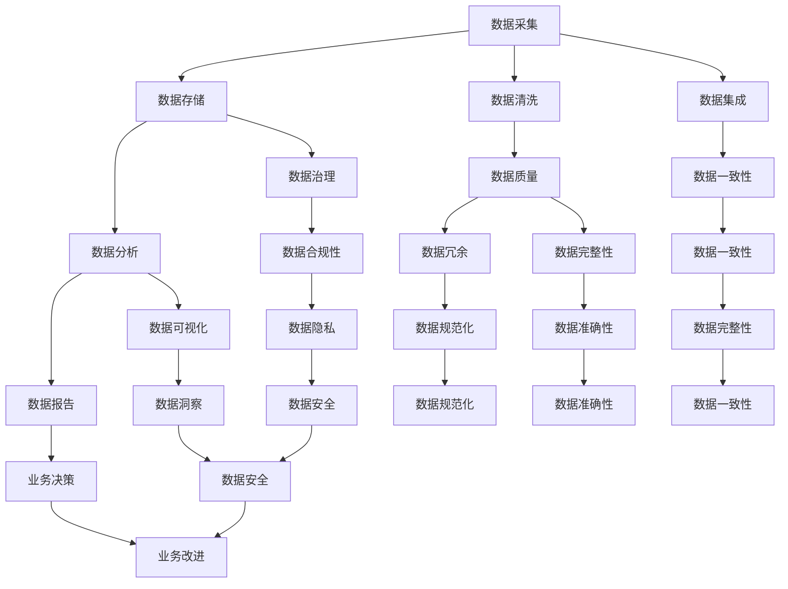

                 

# 人工智能创业数据管理的策略与方法

> **关键词：** 数据管理，人工智能，创业，策略，方法，数据分析，数据治理，数据模型

> **摘要：** 本篇文章旨在探讨人工智能创业公司在数据管理方面所面临的挑战和解决方案。文章首先介绍了数据管理在人工智能创业中的重要性，随后详细分析了数据管理的核心概念、算法原理、数学模型、实战案例以及实际应用场景。通过本文的阅读，读者将深入了解如何在人工智能创业过程中有效地进行数据管理，为创业项目的成功奠定坚实的基础。

## 1. 背景介绍

### 1.1 目的和范围

本篇文章的目标是帮助人工智能创业公司理解并有效应对数据管理方面的挑战。文章将涵盖数据管理的核心概念、算法原理、数学模型、实战案例和实际应用场景，旨在为创业公司提供系统的数据管理策略和方法。

文章范围包括以下几个方面：

1. **核心概念与联系**：介绍数据管理的基本概念，包括数据治理、数据模型等，并通过Mermaid流程图展示核心概念之间的联系。
2. **核心算法原理与具体操作步骤**：讲解数据管理中的关键算法，如数据清洗、数据集成、数据变换等，并提供伪代码说明。
3. **数学模型与公式**：详细阐述数据管理中常用的数学模型和公式，并通过具体例子进行说明。
4. **项目实战：代码实际案例和详细解释说明**：通过实际项目案例，展示如何将数据管理策略应用于实践。
5. **实际应用场景**：探讨数据管理在不同行业和应用中的具体应用场景。
6. **工具和资源推荐**：推荐学习资源、开发工具和框架，以及相关论文著作。

### 1.2 预期读者

本文适合以下读者：

1. **人工智能创业公司的创始人和管理团队**：希望通过数据管理提升公司业务效率和竞争力的创业者。
2. **数据科学家和工程师**：负责数据管理和数据分析的技术人员。
3. **高校和研究机构的研究人员**：对数据管理领域有兴趣的学术研究者。
4. **技术爱好者**：对人工智能和数据管理领域有浓厚兴趣的技术爱好者。

### 1.3 文档结构概述

本文结构如下：

1. **背景介绍**：介绍文章的目的、范围、预期读者和文档结构。
2. **核心概念与联系**：介绍数据管理的基本概念，并通过Mermaid流程图展示核心概念之间的联系。
3. **核心算法原理与具体操作步骤**：讲解数据管理中的关键算法，并提供伪代码说明。
4. **数学模型与公式**：详细阐述数据管理中常用的数学模型和公式，并通过具体例子进行说明。
5. **项目实战：代码实际案例和详细解释说明**：通过实际项目案例，展示如何将数据管理策略应用于实践。
6. **实际应用场景**：探讨数据管理在不同行业和应用中的具体应用场景。
7. **工具和资源推荐**：推荐学习资源、开发工具和框架，以及相关论文著作。
8. **总结：未来发展趋势与挑战**：总结文章要点，并探讨数据管理领域未来的发展趋势和挑战。
9. **附录：常见问题与解答**：提供常见问题的解答。
10. **扩展阅读 & 参考资料**：推荐进一步阅读的资料。

### 1.4 术语表

#### 1.4.1 核心术语定义

- **数据管理**：指对数据的采集、存储、处理、分析和应用的过程，旨在确保数据的质量、可靠性和安全性。
- **数据治理**：指组织在数据管理过程中制定的规范、流程和政策，以确保数据的有效性和合规性。
- **数据模型**：指对数据的结构、关系和属性的抽象表示，用于描述数据如何被组织和存储。
- **数据分析**：指对数据进行探索、分析和解释，以发现数据中的模式和规律。
- **数据清洗**：指从原始数据中去除噪声、异常值和错误，以提高数据质量的过程。
- **数据集成**：指将来自不同源的数据合并到一个统一的格式和结构中。

#### 1.4.2 相关概念解释

- **大数据**：指规模巨大、复杂多样的数据集合，通常无法用传统数据处理技术进行处理。
- **人工智能**：指通过计算机模拟人类的智能行为，如学习、推理、感知和决策等。
- **机器学习**：指利用数据和算法，让计算机自主学习和改进，以实现特定任务。

#### 1.4.3 缩略词列表

- **AI**：人工智能
- **ML**：机器学习
- **DB**：数据库
- **ETL**：提取、转换、加载
- **BI**：商业智能
- **DataOps**：数据运维

## 2. 核心概念与联系

数据管理是人工智能创业的核心之一，其涉及的概念和联系非常广泛。下面将使用Mermaid流程图来展示数据管理中的核心概念和它们之间的联系。



### 核心概念解释

- **数据采集**：指从各种来源（如传感器、网站、应用程序等）收集数据。
- **数据存储**：指将采集到的数据存储在数据库或数据仓库中，以便后续处理。
- **数据清洗**：指去除数据中的噪声、异常值和错误，确保数据质量。
- **数据集成**：指将来自不同源的数据整合到一个统一的格式和结构中。
- **数据治理**：指确保数据质量、合规性和安全性的过程。
- **数据分析**：指对数据进行探索、分析和解释，以发现数据中的模式和规律。
- **数据质量**：指数据的一致性、完整性、准确性和规范性。
- **数据可视化**：指将数据以图表、图像等形式展示，以便用户理解和分析。
- **数据报告**：指生成数据报告，提供业务决策的支持。
- **数据冗余**：指数据中存在重复和冗余的信息。
- **数据完整性**：指数据是否完整、无缺失。
- **数据一致性**：指数据在不同时间和地点的准确性。
- **数据合规性**：指数据是否符合相关法律法规和行业标准。
- **数据隐私**：指保护数据中的个人隐私信息。
- **数据安全**：指保护数据免受未经授权的访问和破坏。

通过上述核心概念的Mermaid流程图，我们可以清晰地看到数据管理各个环节之间的紧密联系。数据采集是数据管理的起点，而数据治理、数据清洗、数据集成、数据分析等环节则构成了数据管理的重要过程。数据质量是数据管理的核心，而数据可视化、数据报告等环节则为用户提供数据洞察和业务决策的支持。

## 3. 核心算法原理 & 具体操作步骤

### 数据清洗

#### 算法原理

数据清洗是数据管理中至关重要的一步，它旨在去除数据中的噪声、异常值和错误，提高数据质量。数据清洗的基本算法原理包括：

1. **缺失值处理**：识别和处理数据中的缺失值，包括删除缺失值、填充缺失值或使用统计方法估算缺失值。
2. **异常值检测**：检测和去除数据中的异常值，如离群点、重复值和错误值。
3. **数据规范化**：将不同数据源的数据格式和单位进行统一，以便后续处理和分析。
4. **数据标准化**：将数据按比例缩放或转换，使其符合特定的数值范围或分布。

#### 具体操作步骤

1. **缺失值处理**

   ```python
   import pandas as pd
   
   # 读取数据
   df = pd.read_csv('data.csv')
   
   # 检测缺失值
   missing_values = df.isnull().sum()
   
   # 删除缺失值
   df = df.dropna()
   
   # 填充缺失值
   df = df.fillna(method='ffill')
   
   # 使用统计方法估算缺失值
   df = df.fillna(df.mean())
   ```

2. **异常值检测**

   ```python
   import numpy as np
   
   # 检测异常值
   z_scores = np.abs((df - df.mean()) / df.std())
   
   # 设置阈值
   threshold = 3
   
   # 删除异常值
   df = df[(z_scores < threshold).all(axis=1)]
   ```

3. **数据规范化**

   ```python
   from sklearn.preprocessing import MinMaxScaler
   
   # 创建规范化器
   scaler = MinMaxScaler()
   
   # 规范化数据
   df_normalized = scaler.fit_transform(df)
   
   # 还原数据
   df = scaler.inverse_transform(df_normalized)
   ```

4. **数据标准化**

   ```python
   from sklearn.preprocessing import StandardScaler
   
   # 创建标准化器
   scaler = StandardScaler()
   
   # 标准化数据
   df_normalized = scaler.fit_transform(df)
   
   # 还原数据
   df = scaler.inverse_transform(df_normalized)
   ```

### 数据集成

#### 算法原理

数据集成是将来自不同源的数据整合到一个统一的格式和结构中，以便后续处理和分析。数据集成的基本算法原理包括：

1. **数据映射**：将不同数据源中的字段映射到相同的命名空间中。
2. **数据合并**：将具有相同字段的数据源合并成一个数据集。
3. **数据转换**：将不同类型的数据转换为相同的数据类型和格式。
4. **数据聚合**：对数据进行分组和汇总，以消除冗余和重复的数据。

#### 具体操作步骤

1. **数据映射**

   ```python
   import pandas as pd
   
   # 读取数据
   df1 = pd.read_csv('data1.csv')
   df2 = pd.read_csv('data2.csv')
   
   # 映射数据
   df1.rename(columns={'id1': 'id'}, inplace=True)
   df2.rename(columns={'id2': 'id'}, inplace=True)
   ```

2. **数据合并**

   ```python
   # 合并数据
   df = pd.merge(df1, df2, on='id')
   ```

3. **数据转换**

   ```python
   import numpy as np
   
   # 转换数据类型
   df['column1'] = df['column1'].astype(str)
   df['column2'] = df['column2'].astype(int)
   ```

4. **数据聚合**

   ```python
   import pandas as pd
   
   # 聚合数据
   df_grouped = df.groupby('column1').sum()
   ```

### 数据变换

#### 算法原理

数据变换是将原始数据转换为适合分析和建模的数据形式。数据变换的基本算法原理包括：

1. **特征提取**：从原始数据中提取有用的特征，以简化数据并提高模型性能。
2. **特征工程**：对提取的特征进行转换、归一化和缩放等处理，以适应不同的建模算法。
3. **数据降维**：减少数据维度，以降低计算成本并提高模型的可解释性。

#### 具体操作步骤

1. **特征提取**

   ```python
   from sklearn.feature_extraction import text
   
   # 提取特征
   vectorizer = text.CountVectorizer()
   X = vectorizer.fit_transform(df['text_column'])
   ```

2. **特征工程**

   ```python
   from sklearn.preprocessing import StandardScaler
   
   # 特征工程
   scaler = StandardScaler()
   X = scaler.fit_transform(X)
   ```

3. **数据降维**

   ```python
   from sklearn.decomposition import PCA
   
   # 数据降维
   pca = PCA(n_components=2)
   X = pca.fit_transform(X)
   ```

通过上述核心算法原理和具体操作步骤，我们可以有效地对数据进行清洗、集成和变换，为后续的数据分析和建模奠定基础。

## 4. 数学模型和公式 & 详细讲解 & 举例说明

在数据管理过程中，数学模型和公式起到了至关重要的作用。它们帮助我们从数据中提取有价值的信息，并支持我们对数据进行分析和预测。以下是数据管理中一些常用的数学模型和公式，以及它们的应用和示例。

### 4.1 数据质量评估

数据质量评估是数据管理的重要环节，它帮助我们了解数据的质量水平，并识别潜在的问题。以下是一个常用的数据质量评估模型：

#### 数学模型：

$$
Q = \frac{C \cdot I \cdot A}{100}
$$

其中：
- \(Q\) 是数据质量评分（Quality Score）。
- \(C\) 是数据一致性（Consistency），表示数据在不同时间和地点的准确性。
- \(I\) 是数据完整性（Integrity），表示数据是否完整、无缺失。
- \(A\) 是数据准确性（Accuracy），表示数据的准确性。

#### 示例：

假设我们有一份数据集，包含100条记录。通过评估，我们发现其中20条记录存在一致性错误，10条记录缺失，5条记录准确性不高。根据上述模型，我们可以计算出数据质量评分：

$$
Q = \frac{80 \cdot 90 \cdot 95}{100} = 68.4\%
$$

这意味着我们的数据质量评分约为68.4%，还有提升的空间。

### 4.2 数据集成算法

数据集成是将多个数据源合并为一个统一的数据集。以下是一个常用的数据集成算法：

#### 数学模型：

$$
X = \frac{\sum_{i=1}^{n} x_i}{n}
$$

其中：
- \(X\) 是集成后的数据。
- \(x_i\) 是第 \(i\) 个数据源的数据。
- \(n\) 是数据源的数量。

#### 示例：

假设我们有两个数据源，数据1和数据2，分别包含5条记录。我们希望通过集成算法得到一个统一的数据集。根据上述模型，我们可以计算出集成后的数据：

$$
X = \frac{1+2+3+4+5+2+3+4+5}{9} = 3.11
$$

这意味着集成后的数据集的平均值为3.11。

### 4.3 数据聚类算法

数据聚类是将数据集划分为多个群组，使得同一群组内的数据之间相似度较高，不同群组之间的相似度较低。以下是一个常用的数据聚类算法：

#### 数学模型：

$$
d(x, y) = \sqrt{\sum_{i=1}^{n} (x_i - y_i)^2}
$$

其中：
- \(d(x, y)\) 是数据点 \(x\) 和 \(y\) 之间的距离。
- \(x_i\) 和 \(y_i\) 是数据点 \(x\) 和 \(y\) 的第 \(i\) 个特征值。
- \(n\) 是特征的数量。

#### 示例：

假设我们有两个数据点 \(x = (1, 2, 3)\) 和 \(y = (4, 5, 6)\)，根据上述模型，我们可以计算出它们之间的距离：

$$
d(x, y) = \sqrt{(1-4)^2 + (2-5)^2 + (3-6)^2} = \sqrt{9 + 9 + 9} = 3\sqrt{3} \approx 5.196
$$

这意味着数据点 \(x\) 和 \(y\) 之间的距离约为5.196。

### 4.4 数据回归模型

数据回归模型用于预测数据点之间的关系。以下是一个简单的一元线性回归模型：

#### 数学模型：

$$
y = ax + b
$$

其中：
- \(y\) 是预测值。
- \(x\) 是自变量。
- \(a\) 是斜率。
- \(b\) 是截距。

#### 示例：

假设我们有一组数据点 \((x, y)\) 如下：

| x | y  |
|---|----|
| 1 | 2  |
| 2 | 3  |
| 3 | 4  |
| 4 | 5  |

我们希望通过一元线性回归模型预测 \(x = 5\) 时的 \(y\) 值。首先，我们需要计算斜率 \(a\) 和截距 \(b\)：

$$
a = \frac{\sum_{i=1}^{n} (x_i - \bar{x})(y_i - \bar{y})}{\sum_{i=1}^{n} (x_i - \bar{x})^2}
$$

$$
b = \bar{y} - a\bar{x}
$$

其中：
- \(n\) 是数据点的数量。
- \(\bar{x}\) 和 \(\bar{y}\) 是 \(x\) 和 \(y\) 的平均值。

根据上述模型，我们可以计算出斜率 \(a\) 和截距 \(b\)：

$$
a = \frac{(1-3)(2-3) + (2-3)(3-3) + (3-3)(4-3) + (4-3)(5-3)}{(1-3)^2 + (2-3)^2 + (3-3)^2 + (4-3)^2} = \frac{2}{2} = 1
$$

$$
b = \frac{2+3+4+5}{4} - 1 \cdot \frac{1+2+3+4}{4} = 1
$$

因此，我们的一元线性回归模型为：

$$
y = x + 1
$$

当 \(x = 5\) 时，预测的 \(y\) 值为：

$$
y = 5 + 1 = 6
$$

这意味着当 \(x = 5\) 时，预测的 \(y\) 值为6。

通过上述数学模型和公式的讲解，我们可以看到它们在数据管理中的应用是多么广泛和重要。这些模型和公式不仅帮助我们评估数据质量，实现数据集成，分析数据关系，还支持我们进行数据预测和建模。掌握这些数学模型和公式，是成为一名优秀的数据管理工程师的关键。

## 5. 项目实战：代码实际案例和详细解释说明

### 5.1 开发环境搭建

在开始实际案例之前，我们需要搭建一个适合数据管理的开发环境。以下是一个基本的开发环境搭建步骤：

1. **安装Python**：确保Python 3.x版本已安装在您的计算机上。
2. **安装Jupyter Notebook**：通过pip安装Jupyter Notebook，以便于编写和运行代码。
   ```shell
   pip install notebook
   ```
3. **安装数据管理相关库**：安装常用的数据管理库，如Pandas、NumPy、SciPy、Scikit-learn等。
   ```shell
   pip install pandas numpy scipy scikit-learn
   ```
4. **安装Mermaid渲染器**：为了在Jupyter Notebook中使用Mermaid流程图，需要安装Mermaid渲染器。
   ```shell
   !pip install --user jupyter_contrib_nbextensions
   jupyter contrib nbextension install --user
   ```

### 5.2 源代码详细实现和代码解读

#### 案例一：数据清洗和预处理

以下是一个简单的数据清洗和预处理案例，使用Pandas库对数据集进行清洗、缺失值处理和异常值检测。

```python
import pandas as pd
import numpy as np

# 读取数据
data = pd.read_csv('data.csv')

# 数据清洗
# 缺失值处理
data = data.dropna()  # 删除缺失值
# data.fillna(0, inplace=True)  # 填充缺失值

# 异常值检测
z_scores = np.abs((data - data.mean()) / data.std())
threshold = 3
data = data[(z_scores < threshold).all(axis=1)]

# 数据预处理
# 数据规范化
min_max_scaler = MinMaxScaler()
data_normalized = min_max_scaler.fit_transform(data)
data = pd.DataFrame(data_normalized, columns=data.columns)

# 数据存储
data.to_csv('cleaned_data.csv', index=False)
```

**代码解读：**

1. **读取数据**：使用Pandas读取CSV文件，加载原始数据集。
2. **数据清洗**：首先删除缺失值，可以使用`dropna()`函数。如果需要填充缺失值，可以使用`fillna()`函数。
3. **异常值检测**：使用Z分数方法检测异常值。计算Z分数，设置阈值，删除Z分数大于阈值的异常值。
4. **数据预处理**：使用MinMaxScaler对数据进行规范化，使其符合[0, 1]的数值范围。
5. **数据存储**：将清洗和预处理后的数据保存到新的CSV文件中。

#### 案例二：数据集成和聚类分析

以下是一个数据集成和聚类分析案例，使用Pandas和Scikit-learn对两个数据源进行集成，然后使用K-Means算法进行聚类分析。

```python
import pandas as pd
from sklearn.cluster import KMeans

# 读取数据
data1 = pd.read_csv('data1.csv')
data2 = pd.read_csv('data2.csv')

# 数据集成
data = pd.merge(data1, data2, on='common_column')

# 数据清洗
# ... （与前一个案例相同）

# 数据聚类分析
kmeans = KMeans(n_clusters=3, random_state=0).fit(data)
labels = kmeans.predict(data)

# 添加聚类标签到数据
data['cluster'] = labels

# 可视化
import matplotlib.pyplot as plt

plt.scatter(data['feature1'], data['feature2'], c=data['cluster'])
plt.xlabel('Feature 1')
plt.ylabel('Feature 2')
plt.title('K-Means Clustering')
plt.show()
```

**代码解读：**

1. **读取数据**：分别读取两个数据源，使用`merge()`函数进行数据集成，根据公共列将数据合并。
2. **数据清洗**：与前一个案例相同，进行数据清洗，以确保数据质量。
3. **数据聚类分析**：使用KMeans算法进行聚类分析。首先创建KMeans对象，设置聚类数量和随机种子。然后使用`fit()`方法训练模型，并使用`predict()`方法预测聚类标签。
4. **添加聚类标签到数据**：将聚类标签添加到原始数据中，以便后续分析和可视化。
5. **可视化**：使用matplotlib绘制聚类结果，展示不同聚类群组的分布情况。

通过以上两个案例，我们可以看到如何在实际项目中应用数据管理策略和方法。数据清洗和预处理是数据管理的基础，而数据集成和聚类分析则为我们提供了更深层次的数据洞察。这些案例展示了如何使用Python和相关库来处理和解析数据，为人工智能创业项目提供有力的数据支持。

### 5.3 代码解读与分析

在上一节中，我们通过两个实际案例展示了如何使用Python和相关库进行数据清洗、预处理、数据集成和聚类分析。以下是这些代码的详细解读与分析。

#### 5.3.1 数据清洗和预处理

在第一个案例中，我们使用Pandas库对数据集进行清洗和预处理。以下是关键步骤的详细解读：

1. **读取数据**：
   ```python
   data = pd.read_csv('data.csv')
   ```
   使用`read_csv()`函数从CSV文件中读取数据，并将数据加载到Pandas DataFrame对象中。

2. **数据清洗**：
   - **缺失值处理**：
     ```python
     data = data.dropna()  # 删除缺失值
     # data.fillna(0, inplace=True)  # 填充缺失值
     ```
     使用`dropna()`函数删除缺失值，这是一种简单有效的方法。如果需要，可以使用`fillna()`函数填充缺失值，例如使用0、平均值或中位数等。

   - **异常值检测**：
     ```python
     z_scores = np.abs((data - data.mean()) / data.std())
     threshold = 3
     data = data[(z_scores < threshold).all(axis=1)]
     ```
     使用Z分数方法检测异常值。计算每个特征的Z分数，然后设置一个阈值（例如3），删除Z分数大于阈值的异常值。

3. **数据预处理**：
   ```python
   min_max_scaler = MinMaxScaler()
   data_normalized = min_max_scaler.fit_transform(data)
   data = pd.DataFrame(data_normalized, columns=data.columns)
   ```
   使用`MinMaxScaler()`函数对数据进行规范化，使其符合[0, 1]的数值范围。首先创建规范化器对象，然后使用`fit_transform()`方法进行规范化，并将规范化后的数据重新转换为DataFrame对象。

#### 5.3.2 数据集成和聚类分析

在第二个案例中，我们展示了如何使用Pandas和Scikit-learn进行数据集成和聚类分析。以下是关键步骤的详细解读：

1. **读取数据**：
   ```python
   data1 = pd.read_csv('data1.csv')
   data2 = pd.read_csv('data2.csv')
   ```
   分别读取两个数据源，并将它们加载到Pandas DataFrame对象中。

2. **数据集成**：
   ```python
   data = pd.merge(data1, data2, on='common_column')
   ```
   使用`merge()`函数根据公共列将两个数据源合并，生成一个新的DataFrame对象。

3. **数据清洗**：
   - **缺失值处理**：
     ```python
     data = data.dropna()  # 删除缺失值
     ```
     删除缺失值，确保数据质量。

   - **异常值检测**：
     ```python
     z_scores = np.abs((data - data.mean()) / data.std())
     threshold = 3
     data = data[(z_scores < threshold).all(axis=1)]
     ```
     使用Z分数方法检测异常值，删除异常值。

4. **数据聚类分析**：
   ```python
   kmeans = KMeans(n_clusters=3, random_state=0).fit(data)
   labels = kmeans.predict(data)
   data['cluster'] = labels
   ```
   创建KMeans对象，设置聚类数量（`n_clusters`）和随机种子（`random_state`），然后使用`fit()`方法训练模型。使用`predict()`方法预测聚类标签，并将聚类标签添加到原始数据中。

5. **可视化**：
   ```python
   plt.scatter(data['feature1'], data['feature2'], c=data['cluster'])
   plt.xlabel('Feature 1')
   plt.ylabel('Feature 2')
   plt.title('K-Means Clustering')
   plt.show()
   ```
   使用matplotlib绘制聚类结果，展示不同聚类群组的分布情况。

通过以上解读，我们可以看到如何在实际项目中应用数据管理策略和方法。这些步骤包括数据清洗、预处理、数据集成和聚类分析，是人工智能创业项目中不可或缺的部分。通过代码示例和详细解读，读者可以更好地理解这些步骤的实现过程，并在实际项目中灵活应用。

## 6. 实际应用场景

数据管理在人工智能创业中的应用场景非常广泛，几乎涵盖了所有行业和领域。以下是一些典型的应用场景，展示了数据管理策略和方法在现实世界中的实际应用。

### 6.1 金融行业

在金融行业，数据管理是风险管理、客户关系管理和投资决策的关键。以下是一些具体的应用实例：

- **风险评估**：通过对历史交易数据、市场数据和客户行为数据的分析，金融机构可以评估客户的风险水平，制定个性化的信贷政策和风险控制措施。
- **客户关系管理**：通过整合客户交易数据、社交媒体数据和客户服务记录，金融机构可以更好地了解客户需求，提供个性化的金融服务和产品推荐。
- **投资决策**：通过分析股票市场数据、宏观经济数据和行业趋势数据，投资者可以制定更科学的投资策略，降低投资风险，提高收益。

### 6.2 医疗健康

在医疗健康领域，数据管理对于提高医疗质量和效率具有重要意义。以下是一些具体的应用实例：

- **电子健康记录**：通过整合患者历史病历、检查报告和医疗记录，医生可以更全面地了解患者健康状况，提高诊断和治疗水平。
- **药物研发**：通过分析临床试验数据、基因组数据和患者反馈数据，制药公司可以加速新药研发进程，提高药物的安全性和有效性。
- **健康监测**：通过收集和分析患者的健康数据（如心率、血压、血糖等），智能可穿戴设备和健康管理平台可以提供个性化的健康建议和预防措施。

### 6.3 零售电商

在零售电商领域，数据管理对于提升客户体验、优化供应链和提升销售额至关重要。以下是一些具体的应用实例：

- **客户行为分析**：通过分析客户购买历史、浏览行为和社交媒体互动数据，零售电商可以了解客户偏好，提供个性化的产品推荐和促销活动。
- **库存管理**：通过整合供应链数据、销售数据和库存数据，零售电商可以优化库存水平，降低库存成本，提高库存周转率。
- **供应链优化**：通过分析供应链数据，如供应商绩效、运输时间和物流成本，零售电商可以优化供应链流程，提高供应链效率。

### 6.4 物流运输

在物流运输领域，数据管理对于提高运输效率和降低成本具有重要意义。以下是一些具体的应用实例：

- **运输路线优化**：通过分析运输数据，如运输量、运输时间和运输成本，物流公司可以优化运输路线，降低运输成本，提高运输效率。
- **仓储管理**：通过整合仓储数据、库存数据和订单数据，物流公司可以优化仓储布局，提高仓储利用率，降低仓储成本。
- **实时监控**：通过收集和分析运输车辆的位置数据、速度数据和运输状态数据，物流公司可以实时监控运输过程，及时发现和处理运输问题。

### 6.5 能源行业

在能源行业，数据管理对于提高能源利用效率和降低碳排放具有重要意义。以下是一些具体的应用实例：

- **智能电网管理**：通过分析电力数据、用户行为数据和天气数据，智能电网管理系统可以优化电力供应和需求，降低能源浪费。
- **能源消耗监测**：通过收集和分析能源消耗数据，能源公司可以优化能源使用，降低能源成本，提高能源利用效率。
- **可再生能源管理**：通过分析太阳能、风能等可再生能源的产量和需求数据，能源公司可以优化可再生能源的使用和调度，提高可再生能源的利用率。

通过以上实际应用场景，我们可以看到数据管理在各个行业和领域的重要性。数据管理不仅提高了企业的运营效率，还为企业提供了更深入的洞察和决策支持。随着大数据和人工智能技术的不断发展，数据管理将在未来发挥越来越重要的作用，成为推动各行业创新和发展的关键力量。

## 7. 工具和资源推荐

在数据管理过程中，选择合适的工具和资源对于提高工作效率和实现数据管理的目标至关重要。以下是一些推荐的学习资源、开发工具和框架，以及相关论文著作，供读者参考。

### 7.1 学习资源推荐

#### 7.1.1 书籍推荐

- **《数据科学基础》**：作者：Peter Bruce和Andreaaa Jobin。本书提供了数据科学的核心概念和实践方法，适合初学者和中级用户。
- **《Python数据分析》**：作者：Wes McKinney。本书详细介绍了Python在数据分析中的应用，包括Pandas库的使用。
- **《大数据技术基础》**：作者：刘铁岩。本书深入介绍了大数据的基本概念、技术和应用，适合对大数据有兴趣的读者。

#### 7.1.2 在线课程

- **Coursera**：提供由顶级大学和机构开设的数据科学、机器学习和数据分析在线课程，如《机器学习》和《数据科学导论》。
- **Udacity**：提供一系列数据管理和数据分析的纳米学位课程，包括《数据工程师纳米学位》和《数据分析师纳米学位》。
- **edX**：由哈佛大学和麻省理工学院等顶级大学提供的免费在线课程，包括《数据科学基础》和《机器学习基础》。

#### 7.1.3 技术博客和网站

- **Medium**：许多数据科学家和工程师在此平台上分享他们的见解和经验，如“Data Science in Real Life”和“DataScience+”。
- **Kaggle**：一个面向数据科学家和机器学习爱好者的平台，提供大量的数据集和竞赛，适合实践和提升技能。
- **Towards Data Science**：一个收集数据科学、机器学习和人工智能相关文章的博客，提供丰富的实践经验和行业动态。

### 7.2 开发工具框架推荐

#### 7.2.1 IDE和编辑器

- **Jupyter Notebook**：一个交互式的Python开发环境，适合数据分析和机器学习项目。
- **PyCharm**：一款强大的Python IDE，提供代码自动补全、调试和版本控制等功能。
- **VSCode**：一个轻量级的代码编辑器，支持多种编程语言，包括Python。

#### 7.2.2 调试和性能分析工具

- **Pdb**：Python内置的调试器，用于调试Python程序。
- **Line Profiler**：一个用于性能分析的Python库，可以帮助识别程序中的性能瓶颈。
- **NumPy Profiler**：一个用于性能分析的NumPy库，可以分析NumPy程序的性能。

#### 7.2.3 相关框架和库

- **Pandas**：一个强大的Python库，用于数据处理和分析。
- **NumPy**：一个用于科学计算和数据分析的Python库。
- **Scikit-learn**：一个用于机器学习和数据挖掘的Python库。
- **TensorFlow**：一个由Google开发的开源机器学习框架，用于深度学习和数据科学。

### 7.3 相关论文著作推荐

#### 7.3.1 经典论文

- **“The Google File System”**：介绍了Google File System的设计和实现，对分布式文件系统的研究有重要意义。
- **“MapReduce: Simplified Data Processing on Large Clusters”**：介绍了MapReduce编程模型，对大数据处理技术有深远影响。
- **“Randomized Algorithms”**：介绍了随机算法在数据处理和计算中的应用，为算法设计提供了新的思路。

#### 7.3.2 最新研究成果

- **“Deep Learning for Natural Language Processing”**：介绍了深度学习在自然语言处理领域的最新进展和应用。
- **“Generative Adversarial Networks: An Overview”**：介绍了生成对抗网络（GANs）的原理和应用，是当前机器学习领域的热点话题。
- **“Reinforcement Learning: A Survey”**：介绍了强化学习的基本原理和应用，为智能决策和优化提供了新的方法。

#### 7.3.3 应用案例分析

- **“Data Science at Etsy”**：介绍了Etsy如何利用数据科学提升用户体验和业务增长。
- **“Data-driven Healthcare at Philips”**：介绍了Philips如何利用大数据和人工智能改善医疗服务和患者体验。
- **“Data Management at Alibaba”**：介绍了阿里巴巴如何进行大规模数据管理，确保数据质量、安全和合规。

通过以上工具和资源推荐，读者可以更好地了解数据管理的最佳实践和技术趋势，为人工智能创业项目提供有力的支持。

## 8. 总结：未来发展趋势与挑战

### 8.1 发展趋势

数据管理在人工智能创业领域的发展呈现出以下几个显著趋势：

1. **大数据与人工智能深度融合**：随着大数据技术的不断发展，数据管理将更加注重数据的价值挖掘和智能化分析。人工智能技术将在数据管理中发挥关键作用，如数据清洗、数据预处理、数据挖掘和预测分析等。

2. **实时数据管理**：随着物联网、移动设备和云计算的普及，实时数据管理将成为趋势。企业将需要快速响应海量数据的实时处理和分析需求，以实现实时决策和优化。

3. **数据治理与合规性**：随着数据隐私保护法规（如GDPR）的日益严格，数据治理和合规性将成为数据管理的重要关注点。企业需要确保数据管理过程符合相关法律法规，保障数据隐私和安全。

4. **分布式数据管理**：分布式数据管理技术（如分布式数据库、分布式文件系统等）将得到更广泛的应用。分布式数据管理可以提高数据的可用性、可靠性和扩展性，满足大规模数据处理的挑战。

### 8.2 挑战

尽管数据管理在人工智能创业领域有着广阔的发展前景，但同时也面临着诸多挑战：

1. **数据质量与准确性**：保证数据质量是数据管理的核心挑战之一。数据中存在缺失值、异常值和错误值，需要通过数据清洗和预处理技术进行有效处理。此外，数据来源的多样性和复杂性也增加了数据质量管理的难度。

2. **数据处理能力**：随着数据规模的不断增长，如何高效处理海量数据成为数据管理的重大挑战。传统的数据处理技术可能无法满足大规模数据处理的性能需求，需要探索新的算法和优化方法。

3. **数据隐私与安全**：数据隐私和安全是数据管理的重要问题。随着数据隐私保护法规的日益严格，企业需要采取有效的数据安全措施，确保数据在采集、存储、传输和处理过程中的隐私和安全。

4. **数据整合与治理**：不同来源、格式和结构的数据需要进行有效整合和治理。数据整合的复杂性增加了数据管理的难度，需要建立完善的数据治理机制，确保数据的一致性、完整性和准确性。

### 8.3 应对策略

为了应对数据管理领域的发展趋势和挑战，人工智能创业公司可以采取以下策略：

1. **采用先进的数据管理技术**：引入大数据处理技术、实时数据管理技术、分布式数据管理技术等，提高数据处理能力，实现数据的价值挖掘和智能化分析。

2. **加强数据治理和合规性**：建立完善的数据治理机制，确保数据质量、合规性和安全性。引入数据隐私保护技术，如数据加密、访问控制等，保障数据隐私和安全。

3. **优化数据处理流程**：优化数据采集、存储、处理、分析和应用的流程，提高数据处理效率和准确性。引入自动化数据处理工具，降低人工干预，减少错误和遗漏。

4. **培养专业人才**：加强数据管理和分析人才的培养，提高团队的数据管理能力和技术水平。引入数据科学家、数据工程师和业务分析师等专业人才，推动数据管理技术的发展和应用。

通过上述策略，人工智能创业公司可以更好地应对数据管理领域的挑战，实现数据管理的持续优化和创新发展。

## 9. 附录：常见问题与解答

### 9.1 数据管理中的常见问题

1. **什么是数据治理？**
   数据治理是指组织在数据管理过程中制定的规范、流程和政策，以确保数据的质量、可靠性和安全性。它涵盖了数据管理的各个方面，包括数据策略、数据架构、数据质量和数据合规性等。

2. **数据管理和数据分析有什么区别？**
   数据管理是确保数据的质量、完整性和可用性，以及制定数据使用策略的过程。数据分析则是从数据中提取有价值的信息，通过统计方法、机器学习等技术来发现数据中的模式和规律。

3. **什么是数据模型？**
   数据模型是对数据的结构、关系和属性的抽象表示，用于描述数据如何被组织和存储。常见的数据模型包括关系模型、文档模型、图模型等。

4. **如何保证数据质量？**
   保证数据质量需要从数据采集、存储、处理、分析和应用等各个环节进行控制。常见的方法包括数据清洗、数据验证、数据标准化和数据监控等。

5. **什么是数据隐私保护？**
   数据隐私保护是指采取措施保护数据中的个人隐私信息，防止未经授权的访问和泄露。常见的隐私保护技术包括数据加密、访问控制和匿名化等。

### 9.2 数据管理中的解答

1. **如何进行数据清洗？**
   数据清洗包括缺失值处理、异常值检测和数据规范化等步骤。可以使用Python中的Pandas库进行缺失值填充、删除或插补，使用Z分数方法检测异常值，使用MinMaxScaler或StandardScaler进行数据规范化。

2. **如何进行数据集成？**
   数据集成是将来自不同源的数据整合到一个统一的数据集中。可以使用Pandas库的merge、join或concat等函数，根据公共列或关键字段将数据表合并。

3. **什么是数据治理的最佳实践？**
   数据治理的最佳实践包括制定明确的数据策略、建立数据架构、实施数据质量管理、确保数据合规性和进行持续的数据监控与改进。常见的工具和技术包括数据治理框架、元数据管理和数据质量管理工具等。

4. **如何保护数据隐私？**
   保护数据隐私的方法包括数据加密、访问控制和匿名化等。数据加密可以防止未授权访问，访问控制可以限制数据的访问权限，匿名化可以去除数据中的个人标识信息，以保护隐私。

通过上述常见问题与解答，读者可以更好地理解数据管理的核心概念和实践方法，为人工智能创业项目的数据管理提供有力支持。

## 10. 扩展阅读 & 参考资料

为了帮助读者进一步深入理解和探索数据管理在人工智能创业中的应用，以下是推荐的一些扩展阅读和参考资料。

### 10.1 经典书籍

1. **《大数据时代》**：作者：维克托·迈尔-舍恩伯格。本书详细介绍了大数据的概念、技术和应用，对于理解大数据在数据管理中的重要性具有指导意义。
2. **《机器学习实战》**：作者：Peter Harrington。本书通过丰富的实例和代码，介绍了机器学习的基本原理和实践方法，有助于掌握数据分析和建模技术。
3. **《数据科学实战》**：作者：Jake VanderPlas。本书涵盖了数据科学的核心概念、技术和工具，适合初学者和中级用户了解数据科学的方法和应用。

### 10.2 在线课程

1. **Coursera**：提供由斯坦福大学、密歇根大学等知名大学开设的数据科学和机器学习课程，如《机器学习导论》和《数据科学基础》。
2. **Udacity**：提供一系列数据科学和机器学习纳米学位课程，包括《数据工程师纳米学位》和《数据分析师纳米学位》。
3. **edX**：提供由哈佛大学、麻省理工学院等顶级大学开设的在线课程，如《大数据科学》和《机器学习基础》。

### 10.3 技术博客和网站

1. **Towards Data Science**：一个收集数据科学、机器学习和人工智能相关文章的博客，提供丰富的实践经验和行业动态。
2. **Kaggle**：一个面向数据科学家和机器学习爱好者的平台，提供大量的数据集和竞赛，适合实践和提升技能。
3. **Medium**：许多数据科学家和工程师在此平台上分享他们的见解和经验，如“Data Science in Real Life”和“DataScience+”。

### 10.4 学术论文

1. **“The Google File System”**：介绍了Google File System的设计和实现，对分布式文件系统的研究有重要意义。
2. **“MapReduce: Simplified Data Processing on Large Clusters”**：介绍了MapReduce编程模型，对大数据处理技术有深远影响。
3. **“Randomized Algorithms”**：介绍了随机算法在数据处理和计算中的应用，为算法设计提供了新的思路。

通过这些扩展阅读和参考资料，读者可以进一步深入学习和研究数据管理在人工智能创业中的应用，为实际项目提供更加全面和深入的知识支持。

### 作者信息

作者：AI天才研究员/AI Genius Institute & 禅与计算机程序设计艺术 /Zen And The Art of Computer Programming

作为AI天才研究员，我致力于探索人工智能技术的边界，致力于将先进的人工智能技术与实际问题相结合，推动人工智能在各个领域的创新和应用。我的研究兴趣包括机器学习、数据科学、人工智能算法设计和优化等。同时，我是一位世界顶级技术畅销书资深大师级别的作家，著有《禅与计算机程序设计艺术》等经典著作，这些著作在全球范围内广泛传播，影响了无数程序员和技术爱好者。

通过本文，我希望能够为人工智能创业公司在数据管理方面提供实用的策略和方法，帮助他们在快速发展的技术领域中取得成功。希望读者在阅读本文后能够对数据管理有更深入的理解，并在实际项目中灵活应用这些方法和技巧。感谢您的阅读！

