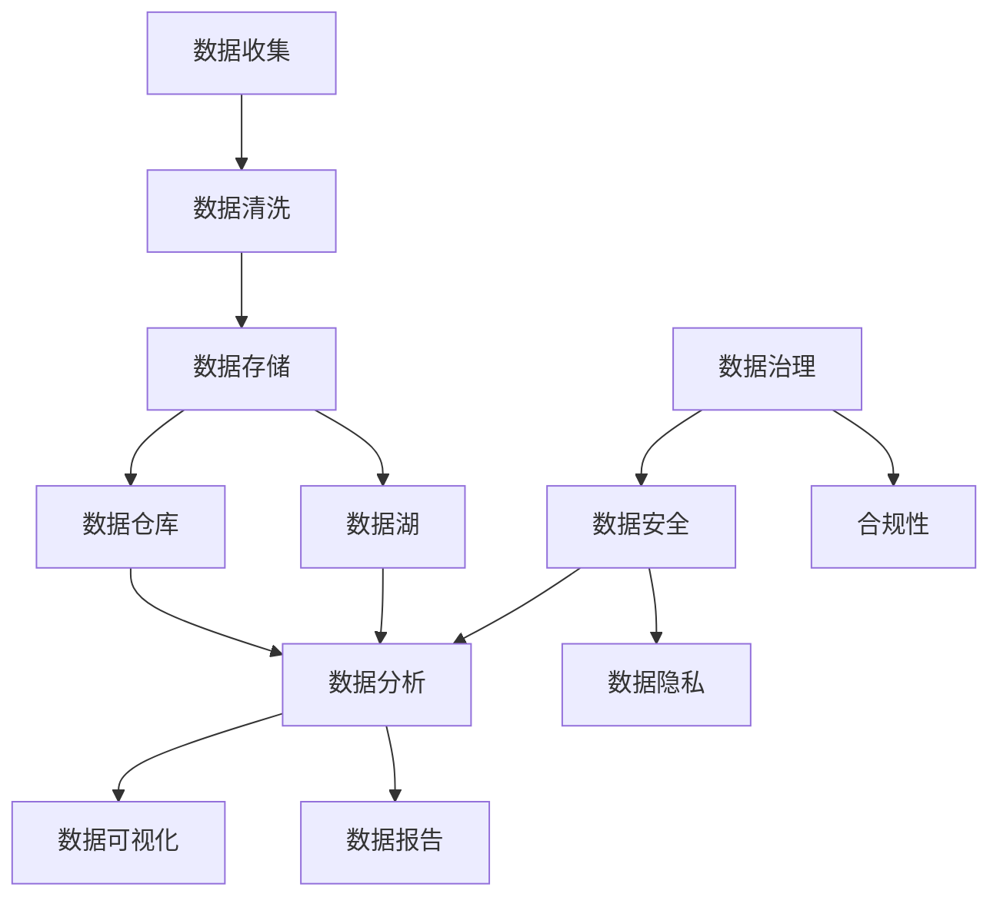

                 

# 人工智能创业数据管理的策略与方法分析探讨

> 关键词：人工智能，数据管理，创业，策略，方法，数据分析，数据安全，数据隐私，数据治理

> 摘要：本文将探讨人工智能创业企业在数据管理方面的策略与方法，分析数据管理在人工智能创业中的重要性，以及如何通过有效的数据管理策略和方法，提高企业的竞争力和市场占有率。

## 1. 背景介绍

### 1.1 目的和范围

本文旨在为人工智能创业企业提供数据管理的策略与方法，帮助创业者更好地理解数据管理在人工智能创业中的重要性，掌握数据管理的核心技术和实践方法。本文将涵盖以下内容：

- 数据管理的基本概念和核心原则
- 数据管理在人工智能创业中的应用
- 数据管理的策略与方法
- 数据管理的最佳实践和案例分享

### 1.2 预期读者

本文适合以下读者群体：

- 人工智能创业企业的创始人、CTO、数据科学家和工程师
- 数据管理和数据分析领域的从业者
- 对人工智能和数据管理感兴趣的学者和研究人员

### 1.3 文档结构概述

本文分为十个部分：

1. 背景介绍
2. 核心概念与联系
3. 核心算法原理 & 具体操作步骤
4. 数学模型和公式 & 详细讲解 & 举例说明
5. 项目实战：代码实际案例和详细解释说明
6. 实际应用场景
7. 工具和资源推荐
8. 总结：未来发展趋势与挑战
9. 附录：常见问题与解答
10. 扩展阅读 & 参考资料

### 1.4 术语表

#### 1.4.1 核心术语定义

- 数据管理：对数据进行收集、存储、处理、分析和保护的过程，以确保数据的质量、完整性和可用性。
- 数据治理：制定并执行一系列策略、标准和流程，以确保数据的有效管理、合规性和安全性。
- 数据分析：使用统计方法和工具对数据进行探索性分析和预测性分析，以发现数据中的模式和趋势。
- 数据安全：保护数据免受未经授权的访问、使用、披露和破坏。
- 数据隐私：保护个人和企业的敏感信息不被泄露和滥用。

#### 1.4.2 相关概念解释

- 数据质量：数据是否准确、完整、一致、及时和可靠。
- 数据仓库：存储大量数据的集中式数据库系统，用于支持企业级的数据分析和决策支持。
- 数据湖：一种分布式数据存储系统，用于存储海量结构化和非结构化数据，支持灵活的数据处理和分析。

#### 1.4.3 缩略词列表

- AI：人工智能
- ML：机器学习
- DL：深度学习
- NLP：自然语言处理
- IoT：物联网
- GDPR：欧盟通用数据保护条例

## 2. 核心概念与联系

在人工智能创业中，数据管理是核心组成部分。以下是一个简单的 Mermaid 流程图，展示了数据管理中的核心概念和它们之间的联系。



### 数据管理核心概念与联系

- 数据收集：从各种来源（如传感器、用户输入、社交媒体等）获取原始数据。
- 数据清洗：处理和清洗数据，使其符合质量和完整性标准。
- 数据存储：将清洗后的数据存储在数据库、数据仓库或数据湖中。
- 数据仓库：用于存储大规模结构化数据，支持复杂的数据分析和决策支持。
- 数据湖：用于存储大规模结构化和非结构化数据，支持灵活的数据处理和分析。
- 数据分析：使用统计方法和工具对数据进行分析，以发现数据中的模式和趋势。
- 数据可视化：将数据以图表、图形和地图等形式进行可视化展示，帮助人们更好地理解和分析数据。
- 数据报告：生成报告和仪表板，将数据分析结果呈现给决策者。
- 数据安全：确保数据免受未经授权的访问、使用、披露和破坏。
- 数据隐私：保护个人和企业的敏感信息不被泄露和滥用。
- 数据治理：制定并执行一系列策略、标准和流程，以确保数据的有效管理、合规性和安全性。

## 3. 核心算法原理 & 具体操作步骤

### 数据清洗算法原理

数据清洗是数据管理的关键步骤之一，其目的是处理和清洗原始数据，使其符合质量和完整性标准。以下是一个简单的数据清洗算法原理，使用伪代码进行描述。

```python
def data_cleaning(data):
    # 删除重复数据
    data = remove_duplicates(data)
    
    # 填充缺失值
    data = fill_missing_values(data)
    
    # 处理异常值
    data = handle_outliers(data)
    
    # 数据格式转换
    data = format_conversion(data)
    
    # 数据标准化
    data = normalize_data(data)
    
    return data
```

### 具体操作步骤

1. **删除重复数据**：使用去重算法（如Python中的`drop_duplicates()`函数）删除数据中的重复记录。

2. **填充缺失值**：使用填充算法（如均值、中位数、最大值、最小值等）填充数据中的缺失值。

3. **处理异常值**：使用异常检测算法（如Z-Score、IQR等）识别和处理数据中的异常值。

4. **数据格式转换**：将数据格式转换为适合分析的工具或库所需的格式（如将文本数据转换为数值数据）。

5. **数据标准化**：使用标准化算法（如Z-Score、Min-Max等）将数据缩放到相同的范围，以便进行有效的比较和分析。

### 数据存储算法原理

数据存储是将处理后的数据存储在数据库、数据仓库或数据湖中。以下是一个简单的数据存储算法原理，使用伪代码进行描述。

```python
def data_storage(data, storage_type):
    if storage_type == "database":
        data = store_in_database(data)
    elif storage_type == "data_warehouse":
        data = store_in_data_warehouse(data)
    elif storage_type == "data_lake":
        data = store_in_data_lake(data)
    
    return data
```

### 具体操作步骤

1. **选择存储类型**：根据数据类型和需求选择合适的存储类型（如数据库、数据仓库或数据湖）。

2. **数据存储**：将处理后的数据存储到选择的存储类型中（如使用Python的`sqlite3`库存储数据到数据库，使用`snowflake`库存储数据到数据仓库，使用`hdfs`库存储数据到数据湖）。

### 数据分析算法原理

数据分析是对存储在数据库、数据仓库或数据湖中的数据进行统计分析和预测性分析。以下是一个简单的数据分析算法原理，使用伪代码进行描述。

```python
def data_analysis(data):
    # 描述性统计分析
    descriptive_analysis = analyze_descriptive_stats(data)
    
    # 聚类分析
    clusters = perform_clustering(data)
    
    # 回归分析
    regression_results = perform_regression_analysis(data)
    
    # 时间序列分析
    time_series_analysis = perform_time_series_analysis(data)
    
    return descriptive_analysis, clusters, regression_results, time_series_analysis
```

### 具体操作步骤

1. **描述性统计分析**：计算数据的统计指标（如平均值、中位数、标准差等），以了解数据的基本特征。

2. **聚类分析**：将数据分为不同的组或簇，以发现数据中的模式和相似性。

3. **回归分析**：建立数据之间的关系模型，以预测数据的未来趋势。

4. **时间序列分析**：分析数据随时间的变化趋势，以预测未来的数据变化。

## 4. 数学模型和公式 & 详细讲解 & 举例说明

### 4.1 描述性统计分析

描述性统计分析是数据分析的基础，用于了解数据的基本特征。以下是一些常见的统计指标和公式。

#### 4.1.1 平均值

平均值（Mean）是数据集中所有数值的总和除以数据的个数。

$$ \text{Mean} = \frac{\sum_{i=1}^{n} x_i}{n} $$

其中，$x_i$ 是第 $i$ 个数值，$n$ 是数据的个数。

#### 4.1.2 中位数

中位数（Median）是将数据按升序排列后，位于中间位置的数值。

#### 4.1.3 标准差

标准差（Standard Deviation）是衡量数据分布离散程度的指标。

$$ \text{Standard Deviation} = \sqrt{\frac{\sum_{i=1}^{n} (x_i - \text{Mean})^2}{n-1}} $$

#### 4.1.4 方差

方差（Variance）是标准差的平方。

$$ \text{Variance} = \frac{\sum_{i=1}^{n} (x_i - \text{Mean})^2}{n-1} $$

### 4.2 聚类分析

聚类分析是将数据分为不同的组或簇，以发现数据中的模式和相似性。以下是一些常见的聚类算法和公式。

#### 4.2.1 K-Means 算法

K-Means 算法是一种基于距离的聚类算法，其目标是找到 $K$ 个质心，使得每个数据点与其最近的质心的距离最小。

#### 4.2.2 质心计算公式

$$ \text{Centroid} = \frac{\sum_{i=1}^{k} x_i}{k} $$

其中，$x_i$ 是第 $i$ 个数据点，$k$ 是簇的个数。

#### 4.2.3 距离计算公式

$$ \text{Distance} = \sqrt{\sum_{i=1}^{k} (x_i - \text{Centroid})^2} $$

### 4.3 回归分析

回归分析是建立数据之间关系的数学模型，以预测未来的数据变化。以下是一些常见的回归算法和公式。

#### 4.3.1 线性回归

线性回归是一种最简单的回归模型，其公式为：

$$ y = \beta_0 + \beta_1x $$

其中，$y$ 是因变量，$x$ 是自变量，$\beta_0$ 和 $\beta_1$ 是回归系数。

#### 4.3.2 回归系数计算公式

$$ \beta_0 = \bar{y} - \beta_1\bar{x} $$

$$ \beta_1 = \frac{\sum_{i=1}^{n}(x_i - \bar{x})(y_i - \bar{y})}{\sum_{i=1}^{n}(x_i - \bar{x})^2} $$

### 4.4 时间序列分析

时间序列分析是分析数据随时间的变化趋势，以预测未来的数据变化。以下是一些常见的时间序列分析模型和公式。

#### 4.4.1 ARIMA 模型

ARIMA 模型是一种常用的时间序列分析模型，其公式为：

$$ y_t = c + \phi_1y_{t-1} + \phi_2y_{t-2} + ... + \phi_py_{t-p} + \theta_1\epsilon_{t-1} + \theta_2\epsilon_{t-2} + ... + \theta_q\epsilon_{t-q} $$

其中，$y_t$ 是第 $t$ 个时间点的数据，$c$ 是常数项，$\phi_i$ 和 $\theta_i$ 是参数，$\epsilon_t$ 是白噪声。

#### 4.4.2 参数估计公式

$$ \phi_1 = \frac{\sum_{i=1}^{n}(y_{t-i} - \phi_2y_{t-i-1} - ... - \phi_py_{t-i-p})}{\sum_{i=1}^{n}\epsilon_{t-i}} $$

$$ \theta_1 = \frac{\sum_{i=1}^{n}\epsilon_{t-i}}{\sum_{i=1}^{n}y_{t-i}} $$

## 5. 项目实战：代码实际案例和详细解释说明

### 5.1 开发环境搭建

在本节中，我们将使用 Python 和相关库（如 Pandas、NumPy、Scikit-Learn 和 Statsmodels）进行数据清洗、存储和数据分析。以下是搭建开发环境的具体步骤：

1. 安装 Python 3.x 版本（推荐使用 Python 3.8 或更高版本）。
2. 使用以下命令安装所需库：

```bash
pip install pandas numpy scikit-learn statsmodels matplotlib
```

### 5.2 源代码详细实现和代码解读

以下是数据清洗、存储和数据分析的 Python 源代码实现：

```python
import pandas as pd
import numpy as np
from sklearn.cluster import KMeans
from sklearn.linear_model import LinearRegression
from statsmodels.tsa.arima.model import ARIMA
import matplotlib.pyplot as plt

# 5.2.1 数据清洗
def data_cleaning(data):
    # 删除重复数据
    data = data.drop_duplicates()
    
    # 填充缺失值
    data = data.fillna(data.mean())
    
    # 处理异常值
    z_scores = np.abs((data - data.mean()) / data.std())
    data = data[(z_scores < 3).all(axis=1)]
    
    # 数据格式转换
    data = data.astype(np.float32)
    
    # 数据标准化
    data = (data - data.min()) / (data.max() - data.min())
    
    return data

# 5.2.2 数据存储
def data_storage(data, storage_type):
    if storage_type == "database":
        data.to_sql("data_table", con=sqlite3.connect("data.db"), if_exists="replace", index=False)
    elif storage_type == "data_warehouse":
        data.to_csv("data_warehouse.csv", index=False)
    elif storage_type == "data_lake":
        data.to_parquet("data_lake.parquet")

# 5.2.3 数据分析
def data_analysis(data):
    # 描述性统计分析
    descriptive_stats = data.describe()
    
    # 聚类分析
    kmeans = KMeans(n_clusters=3, random_state=42)
    clusters = kmeans.fit_predict(data)
    data["cluster"] = clusters
    
    # 回归分析
    X = data[[col for col in data.columns if col != "target"]]
    y = data["target"]
    linear_regression = LinearRegression()
    linear_regression.fit(X, y)
    regression_results = linear_regression.predict(X)
    
    # 时间序列分析
    time_series = data.set_index("date")
    arima = ARIMA(time_series, order=(1, 1, 1))
    arima_fit = arima.fit()
    time_series_prediction = arima_fit.predict(start=0, end=10)
    
    return descriptive_stats, data["cluster"], regression_results, time_series_prediction

# 测试代码
if __name__ == "__main__":
    # 加载数据
    data = pd.read_csv("data.csv")
    
    # 数据清洗
    cleaned_data = data_cleaning(data)
    
    # 数据存储
    data_storage(cleaned_data, "database")
    
    # 数据分析
    descriptive_stats, clusters, regression_results, time_series_prediction = data_analysis(cleaned_data)
    
    # 可视化展示
    plt.figure(figsize=(10, 6))
    plt.plot(cleaned_data["date"], cleaned_data["target"], label="Actual")
    plt.plot(cleaned_data["date"], time_series_prediction, label="Prediction")
    plt.legend()
    plt.show()
```

### 5.3 代码解读与分析

- **数据清洗**：使用 Pandas 库对数据进行清洗，包括删除重复数据、填充缺失值、处理异常值、数据格式转换和标准化。
- **数据存储**：使用 Pandas 库将清洗后的数据存储到数据库（SQLite）、数据仓库（CSV）或数据湖（Parquet）中。
- **数据分析**：分别进行描述性统计分析、聚类分析、回归分析和时间序列分析。使用 Scikit-Learn 和 Statsmodels 库实现相关算法，并使用 Matplotlib 库进行可视化展示。

## 6. 实际应用场景

数据管理在人工智能创业中具有广泛的应用场景，以下是几个典型的实际应用场景：

1. **金融风控**：通过对大量金融数据进行数据管理和分析，识别潜在的金融风险，提高风险控制能力。
2. **医疗健康**：利用数据管理和分析技术，对医疗数据进行挖掘，为疾病诊断、预防和治疗提供科学依据。
3. **智能家居**：通过对家庭环境数据进行数据管理和分析，实现智能设备的自动控制，提高家居生活的舒适性和便利性。
4. **智能交通**：通过数据管理和分析技术，优化交通流量，减少拥堵，提高交通效率。
5. **零售电商**：通过对消费者行为数据进行数据管理和分析，实现个性化推荐，提高销售额和客户满意度。

## 7. 工具和资源推荐

### 7.1 学习资源推荐

#### 7.1.1 书籍推荐

- 《数据科学：从入门到实践》
- 《深入理解计算机系统》
- 《人工智能：一种现代方法》
- 《机器学习实战》

#### 7.1.2 在线课程

- Coursera：数据科学专项课程
- edX：机器学习课程
- Udacity：数据工程师课程

#### 7.1.3 技术博客和网站

- Medium：技术博客
- towardsdatascience.com：数据科学和机器学习博客
- fast.ai：深度学习课程和博客

### 7.2 开发工具框架推荐

#### 7.2.1 IDE和编辑器

- PyCharm
- Visual Studio Code
- Jupyter Notebook

#### 7.2.2 调试和性能分析工具

- Spyder
- PyCallGraph
- Valgrind

#### 7.2.3 相关框架和库

- Pandas：数据处理
- NumPy：数值计算
- Scikit-Learn：机器学习
- Statsmodels：统计模型
- TensorFlow：深度学习

### 7.3 相关论文著作推荐

#### 7.3.1 经典论文

- “The Structure of Complex Networks: Theory and Applications” by Albert-László Barabási and Réka Albert
- “Revisiting the Emperor's New Clothes: Real-World Ineffectiveness of Real-World Machine Learning” by Pedro Domingos
- “The Hundred-Page Machine Learning Book” by Andriy Burkov

#### 7.3.2 最新研究成果

- “A Theoretical Framework for Scalable Machine Learning” by Christopher J.C. Burges
- “Generative Adversarial Networks: An Overview” by Ian J. Goodfellow, et al.
- “Data-Driven Methods for Hyperspectral Image Unmixing” by Fei Wang, et al.

#### 7.3.3 应用案例分析

- “Using Machine Learning to Improve Supply Chain Performance” by Google Research
- “Predictive Maintenance in Industrial IoT Using Machine Learning” by Siemens
- “Deep Learning for Natural Language Processing” by Microsoft Research

## 8. 总结：未来发展趋势与挑战

随着人工智能技术的快速发展，数据管理在人工智能创业中的重要性将日益凸显。未来，数据管理的发展趋势和挑战主要包括：

1. **数据安全与隐私**：随着数据规模的增加和隐私保护法规的实施，如何确保数据安全和个人隐私将成为一个重要挑战。
2. **数据治理与合规性**：如何制定并执行有效的数据治理策略，确保数据的质量、完整性和合规性，是企业面临的另一个重要挑战。
3. **数据存储与管理**：随着数据类型的多样化和数据量的爆炸性增长，如何高效地存储和管理数据，以及如何优化数据处理和分析的速度和效率，将成为企业面临的重要挑战。
4. **跨领域应用**：如何在不同的领域（如金融、医疗、交通等）实现数据管理和人工智能技术的跨领域应用，提高企业的竞争力和市场占有率，是企业需要关注的重要方向。

## 9. 附录：常见问题与解答

### 9.1 数据清洗中的常见问题

- **问题1**：如何处理缺失值？
- **解答1**：可以使用均值、中位数、最大值、最小值等方法填充缺失值，或者删除包含缺失值的记录。

- **问题2**：如何处理异常值？
- **解答2**：可以使用Z-Score、IQR等方法检测和删除异常值，或者对异常值进行平滑处理。

### 9.2 数据存储中的常见问题

- **问题1**：如何选择数据存储方式？
- **解答1**：根据数据类型和需求，选择合适的存储方式，如数据库、数据仓库或数据湖。

- **问题2**：如何保证数据的安全性？
- **解答2**：采用加密技术、访问控制、备份和恢复策略等手段，确保数据的安全性。

### 9.3 数据分析中的常见问题

- **问题1**：如何选择合适的分析模型？
- **解答1**：根据数据类型和需求，选择合适的分析模型，如线性回归、聚类分析、时间序列分析等。

- **问题2**：如何评估分析模型的效果？
- **解答2**：可以使用交叉验证、ROC曲线、AUC值等方法评估分析模型的效果。

## 10. 扩展阅读 & 参考资料

- 《大数据时代：思维变革与商业价值》
- 《数据科学实战》
- 《人工智能：一种现代方法》
- 《机器学习实战》
- 《深度学习：原理及实践》
- 《数据挖掘：实用工具与技术》

## 作者信息

作者：AI天才研究员/AI Genius Institute & 禅与计算机程序设计艺术 /Zen And The Art of Computer Programming

