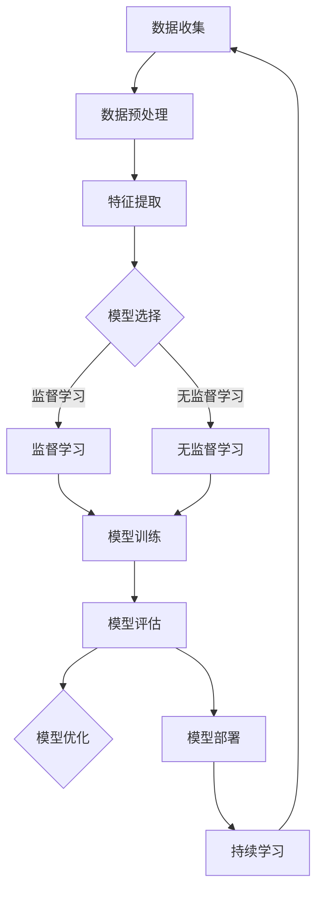

                 

# 人工智能创业：保持技术前沿的方法

> 关键词：人工智能，创业，技术前沿，创新，研发，持续学习，团队协作

> 摘要：人工智能（AI）行业飞速发展，创业公司若想在竞争激烈的市场中脱颖而出，必须持续关注并掌握技术前沿。本文将探讨保持技术前沿的方法，包括核心概念的理解、算法原理的剖析、数学模型的阐述、项目实战案例的展示，以及相关工具和资源的推荐，帮助创业者和技术团队在AI领域不断创新、提升竞争力。

## 1. 背景介绍

### 1.1 目的和范围

本文旨在为人工智能创业公司提供一套保持技术前沿的方法论。文章将涵盖以下内容：

- 核心概念与联系：通过Mermaid流程图直观展示AI系统的核心概念和架构。
- 核心算法原理：详细阐述关键算法的原理和操作步骤，使用伪代码进行详细描述。
- 数学模型和公式：讲解与AI相关的数学模型和公式，并提供详细讲解和实例说明。
- 项目实战：展示具体项目的代码案例，并进行详细解释和分析。
- 实际应用场景：探讨AI技术在各个领域的应用场景。
- 工具和资源推荐：推荐学习资源、开发工具和框架、相关论文著作。

### 1.2 预期读者

本文适合以下读者群体：

- 创业者：希望了解如何保持技术前沿的人工智能创业公司创始人。
- 技术团队：从事人工智能研发的技术团队，寻求提升技术水平的途径。
- 技术爱好者：对人工智能技术感兴趣的技术爱好者，希望掌握前沿技术。
- 学术研究者：关注AI领域发展，希望了解最新技术动态的研究者。

### 1.3 文档结构概述

本文分为十个部分，具体如下：

1. 背景介绍：介绍文章的目的、范围、预期读者和文档结构。
2. 核心概念与联系：通过Mermaid流程图展示AI系统的核心概念和架构。
3. 核心算法原理：详细阐述关键算法的原理和操作步骤。
4. 数学模型和公式：讲解与AI相关的数学模型和公式。
5. 项目实战：展示具体项目的代码案例，并进行详细解释和分析。
6. 实际应用场景：探讨AI技术在各个领域的应用场景。
7. 工具和资源推荐：推荐学习资源、开发工具和框架、相关论文著作。
8. 总结：未来发展趋势与挑战。
9. 附录：常见问题与解答。
10. 扩展阅读 & 参考资料：提供更多相关阅读材料和参考资料。

### 1.4 术语表

#### 1.4.1 核心术语定义

- 人工智能（AI）：通过模拟人类智能，使计算机具备自主学习和决策能力的学科。
- 持续学习：人工智能系统在运行过程中不断积累经验、优化性能的过程。
- 技术前沿：指当前领域内最新、最先进的科技成果和技术方法。

#### 1.4.2 相关概念解释

- 算法：解决问题的一系列规则和步骤。
- 数学模型：用数学语言描述现实问题的抽象模型。
- 框架：提供特定功能的软件库，用于简化开发过程。

#### 1.4.3 缩略词列表

- AI：人工智能
- ML：机器学习
- DL：深度学习
- NLP：自然语言处理
- CV：计算机视觉

## 2. 核心概念与联系

为了更好地理解人工智能创业的核心概念，我们将使用Mermaid流程图展示AI系统的核心架构和联系。



### 2.1 数据收集

数据是人工智能系统的基石。数据收集包括从各种来源获取数据，如公开数据集、私有数据集、传感器数据等。数据质量直接影响到模型的性能。

### 2.2 数据预处理

数据预处理是数据清洗、归一化、去噪等操作，以提高数据质量，使数据更适合模型训练。

### 2.3 特征提取

特征提取是从原始数据中提取出具有代表性的特征，用于训练模型。特征选择和特征工程在提升模型性能方面至关重要。

### 2.4 模型选择

模型选择是根据应用场景和数据特点选择合适的算法模型。常见的模型包括监督学习模型、无监督学习模型等。

### 2.5 模型训练

模型训练是利用训练数据对模型进行参数优化，使其具备一定的预测能力。常见的训练方法有梯度下降、随机梯度下降等。

### 2.6 模型评估

模型评估是通过测试数据对模型性能进行评价。常用的评估指标有准确率、召回率、F1分数等。

### 2.7 模型优化

模型优化是通过调整模型参数和结构，提高模型性能。优化方法包括超参数调整、模型融合等。

### 2.8 模型部署

模型部署是将训练好的模型部署到实际应用场景中，如服务端、移动端、嵌入式设备等。

### 2.9 持续学习

持续学习是让模型在运行过程中不断积累经验、优化性能。通过持续学习，模型能够应对新的数据和应用场景。

## 3. 核心算法原理 & 具体操作步骤

在本节中，我们将详细阐述人工智能创业过程中常用的核心算法原理，并使用伪代码进行具体操作步骤的描述。

### 3.1 机器学习算法

机器学习算法是人工智能领域的基础，主要包括监督学习、无监督学习和强化学习。

#### 3.1.1 监督学习算法

监督学习算法是基于已标记的数据集进行训练，然后用于预测未知数据的标签。常见的监督学习算法有线性回归、支持向量机（SVM）、决策树等。

**线性回归算法伪代码：**

```python
def linear_regression(X, y):
    # 梯度下降法求解权重w和偏置b
    w = 0
    b = 0
    learning_rate = 0.01
    epochs = 1000
    
    for epoch in range(epochs):
        # 计算预测值
        y_pred = X * w + b
        # 计算损失函数
        loss = (y - y_pred) ** 2
        # 计算梯度
        dw = 2 * X.T.dot(X * w + b - y)
        db = 2 * (X * w + b - y)
        # 更新权重和偏置
        w -= learning_rate * dw
        b -= learning_rate * db
        
    return w, b
```

#### 3.1.2 无监督学习算法

无监督学习算法是基于未标记的数据集进行训练，主要用于特征提取、聚类等任务。常见的无监督学习算法有K均值聚类、主成分分析（PCA）等。

**K均值聚类算法伪代码：**

```python
def k_means(data, k, max_iterations):
    # 随机选择k个中心点
    centroids = data[np.random.choice(data.shape[0], k, replace=False)]
    for i in range(max_iterations):
        # 计算每个数据点到中心点的距离，并分配到最近的中心点
        distances = np.linalg.norm(data - centroids, axis=1)
        labels = np.argmin(distances, axis=1)
        # 更新中心点
        new_centroids = np.array([data[labels == j].mean(axis=0) for j in range(k)])
        # 判断是否收敛
        if np.linalg.norm(new_centroids - centroids) < 0.0001:
            break
        centroids = new_centroids
    return centroids, labels
```

#### 3.1.3 强化学习算法

强化学习算法是基于环境与智能体之间的交互进行训练，主要用于决策优化。常见的强化学习算法有Q学习、策略梯度等。

**Q学习算法伪代码：**

```python
def q_learning(env, state_space, action_space, learning_rate, discount_factor, episodes):
    Q = np.zeros((state_space, action_space))
    for episode in range(episodes):
        state = env.reset()
        done = False
        while not done:
            # 根据当前状态和Q值选择动作
            action = np.argmax(Q[state])
            # 执行动作，获取新状态和奖励
            next_state, reward, done, _ = env.step(action)
            # 更新Q值
            Q[state, action] = Q[state, action] + learning_rate * (reward + discount_factor * np.max(Q[next_state]) - Q[state, action])
            state = next_state
    return Q
```

### 3.2 深度学习算法

深度学习算法是人工智能领域的最新进展，主要包括神经网络、卷积神经网络（CNN）、循环神经网络（RNN）等。

#### 3.2.1 神经网络算法

神经网络算法是一种通过多层节点模拟人脑神经元的计算模型。常见的神经网络包括全连接神经网络、卷积神经网络、循环神经网络等。

**全连接神经网络算法伪代码：**

```python
def forward_propagation(x, weights, biases):
    # 前向传播计算
    z = np.dot(x, weights) + biases
    a = np.tanh(z)
    return a, z

def backward_propagation(a, z, d, learning_rate):
    # 反向传播计算
    da = 1 - a ** 2
    dz = d * da
    dw = z.T.dot(dz)
    db = dz.sum(axis=0)
    # 更新权重和偏置
    weights -= learning_rate * dw
    biases -= learning_rate * db
    return weights, biases
```

#### 3.2.2 卷积神经网络算法

卷积神经网络是一种在图像处理、计算机视觉等领域表现优异的神经网络结构。

**卷积神经网络算法伪代码：**

```python
def forward_propagation(x, weights, biases):
    # 前向传播计算
    z = np.convolve(x, weights) + biases
    a = np.tanh(z)
    return a, z

def backward_propagation(a, z, d, learning_rate):
    # 反向传播计算
    da = 1 - a ** 2
    dz = np.convolve(d, da, mode='valid')
    dw = np.zeros_like(weights)
    db = dz.sum(axis=0)
    # 更新权重和偏置
    weights -= learning_rate * dw
    biases -= learning_rate * db
    return weights, biases
```

### 3.3 自然语言处理算法

自然语言处理算法是人工智能领域的重要分支，主要包括词向量、序列模型、文本生成等。

#### 3.3.1 词向量算法

词向量算法是将文本数据转换为数值向量，用于后续处理。

**Word2Vec算法伪代码：**

```python
def train_word2vec(data, embedding_size, window_size, learning_rate, epochs):
    # 初始化词向量
    V = np.random.normal(scale=0.1, size=(vocab_size, embedding_size))
    for epoch in range(epochs):
        for word in data:
            # 随机选择窗口内的词
            context = [w for w in data if w in window_size]
            for target_word in context:
                # 计算损失函数
                e = V[word]
                context_words = [w for w in context if w != target_word]
                scores = V.dot(e)
                loss = -np.log(np.max(scores))
                # 更新词向量
                grads = e - (scores / len(context_words))
                V[word] -= learning_rate * grads
    return V
```

## 4. 数学模型和公式 & 详细讲解 & 举例说明

在人工智能领域，数学模型和公式是构建智能系统的基础。以下我们将介绍几个关键的数学模型，并使用LaTeX格式进行详细讲解和举例说明。

### 4.1 线性回归模型

线性回归模型是一种简单的预测模型，用于建立自变量和因变量之间的线性关系。

**公式：**

$$ y = \beta_0 + \beta_1 \cdot x + \epsilon $$

其中，$y$ 为因变量，$x$ 为自变量，$\beta_0$ 和 $\beta_1$ 为模型参数，$\epsilon$ 为误差项。

**举例：**

假设我们要预测房价，给定自变量（房屋面积）和因变量（房价），我们可以使用线性回归模型来建立关系。

$$ y = 50000 + 100 \cdot x + \epsilon $$

其中，$y$ 为房价（元），$x$ 为房屋面积（平方米），$\epsilon$ 为误差项。

### 4.2 卷积神经网络（CNN）模型

卷积神经网络是一种在图像处理领域表现优异的神经网络结构。CNN 通过卷积层、池化层和全连接层等结构实现图像的特征提取和分类。

**公式：**

$$ h_{l}(x) = \sigma(\mathbf{W}_l \cdot h_{l-1} + b_l) $$

其中，$h_l(x)$ 为第 $l$ 层的激活函数输出，$\sigma$ 为激活函数（如ReLU函数），$\mathbf{W}_l$ 和 $b_l$ 分别为第 $l$ 层的权重和偏置。

**举例：**

假设我们要对一张256x256的图像进行分类，使用一个具有两个卷积层的CNN模型。

第一层卷积层：
$$ h_1(x) = \sigma(\mathbf{W}_1 \cdot x + b_1) $$
其中，$\mathbf{W}_1$ 为 $3x3$ 的卷积核，$b_1$ 为偏置。

第二层卷积层：
$$ h_2(x) = \sigma(\mathbf{W}_2 \cdot h_1 + b_2) $$
其中，$\mathbf{W}_2$ 为 $3x3$ 的卷积核，$b_2$ 为偏置。

### 4.3 自然语言处理（NLP）模型

自然语言处理模型用于处理文本数据，常见的模型有循环神经网络（RNN）、长短期记忆网络（LSTM）和变换器（Transformer）等。

**公式：**

$$ h_t = \sigma(\mathbf{W}_h \cdot [h_{t-1}, x_t] + b_h) $$

其中，$h_t$ 为第 $t$ 个时间步的隐藏状态，$x_t$ 为输入词向量，$\sigma$ 为激活函数（如ReLU函数），$\mathbf{W}_h$ 和 $b_h$ 分别为权重和偏置。

**举例：**

假设我们要对一句句子进行分类，使用一个基于LSTM的NLP模型。

$$ h_t = \sigma(\mathbf{W}_h \cdot [h_{t-1}, x_t] + b_h) $$
其中，$h_t$ 为当前时间步的隐藏状态，$x_t$ 为当前词的词向量，$\mathbf{W}_h$ 和 $b_h$ 分别为权重和偏置。

## 5. 项目实战：代码实际案例和详细解释说明

在本节中，我们将通过一个实际项目案例，展示人工智能创业中如何运用上述算法和数学模型，并进行详细解释说明。

### 5.1 开发环境搭建

在开始项目实战之前，我们需要搭建一个合适的开发环境。以下是开发环境的搭建步骤：

1. 安装Python 3.x版本（建议使用Anaconda）
2. 安装必要的库，如NumPy、Pandas、Scikit-learn、TensorFlow、Keras等
3. 配置Jupyter Notebook或PyCharm等IDE

### 5.2 源代码详细实现和代码解读

以下是一个基于Keras实现的简单卷积神经网络（CNN）模型，用于图像分类。

```python
import numpy as np
from tensorflow.keras.models import Sequential
from tensorflow.keras.layers import Conv2D, MaxPooling2D, Flatten, Dense
from tensorflow.keras.optimizers import Adam
from tensorflow.keras.preprocessing.image import ImageDataGenerator

# 定义CNN模型
model = Sequential([
    Conv2D(32, (3, 3), activation='relu', input_shape=(64, 64, 3)),
    MaxPooling2D((2, 2)),
    Conv2D(64, (3, 3), activation='relu'),
    MaxPooling2D((2, 2)),
    Flatten(),
    Dense(128, activation='relu'),
    Dense(1, activation='sigmoid')
])

# 编译模型
model.compile(optimizer=Adam(learning_rate=0.001), loss='binary_crossentropy', metrics=['accuracy'])

# 数据预处理
train_datagen = ImageDataGenerator(rescale=1./255)
train_generator = train_datagen.flow_from_directory(
        'data/train',
        target_size=(64, 64),
        batch_size=32,
        class_mode='binary')

# 训练模型
model.fit(
        train_generator,
        steps_per_epoch=train_generator.samples//train_generator.batch_size,
        epochs=10)

# 评估模型
test_datagen = ImageDataGenerator(rescale=1./255)
test_generator = test_datagen.flow_from_directory(
        'data/test',
        target_size=(64, 64),
        batch_size=32,
        class_mode='binary')

model.evaluate(test_generator)
```

### 5.3 代码解读与分析

以上代码实现了一个简单的CNN模型，用于对二分类问题进行图像分类。以下是代码的主要部分及其解读：

1. **模型定义：**
   ```python
   model = Sequential([
       Conv2D(32, (3, 3), activation='relu', input_shape=(64, 64, 3)),
       MaxPooling2D((2, 2)),
       Conv2D(64, (3, 3), activation='relu'),
       MaxPooling2D((2, 2)),
       Flatten(),
       Dense(128, activation='relu'),
       Dense(1, activation='sigmoid')
   ])
   ```
   - `Sequential`：创建一个序列模型，按顺序添加层。
   - `Conv2D`：添加卷积层，参数包括卷积核大小、激活函数等。
   - `MaxPooling2D`：添加最大池化层，参数包括池化窗口大小。
   - `Flatten`：将卷积层输出展平为一维数组。
   - `Dense`：添加全连接层，用于分类，参数包括神经元数量和激活函数。

2. **模型编译：**
   ```python
   model.compile(optimizer=Adam(learning_rate=0.001), loss='binary_crossentropy', metrics=['accuracy'])
   ```
   - `compile`：编译模型，指定优化器、损失函数和评估指标。

3. **数据预处理：**
   ```python
   train_datagen = ImageDataGenerator(rescale=1./255)
   train_generator = train_datagen.flow_from_directory(
           'data/train',
           target_size=(64, 64),
           batch_size=32,
           class_mode='binary')
   ```
   - `ImageDataGenerator`：创建图像数据生成器，用于数据增强。
   - `flow_from_directory`：从指定目录下读取图像数据，生成训练数据生成器。

4. **模型训练：**
   ```python
   model.fit(
           train_generator,
           steps_per_epoch=train_generator.samples//train_generator.batch_size,
           epochs=10)
   ```
   - `fit`：训练模型，指定训练数据生成器、训练轮数和每个轮次的数据样本数。

5. **模型评估：**
   ```python
   model.evaluate(test_generator)
   ```
   - `evaluate`：评估模型在测试数据集上的性能。

### 5.4 代码解读与分析（续）

以下是对代码的进一步解读和分析：

1. **卷积层和池化层：**
   - 卷积层用于提取图像的特征，使用卷积核对输入图像进行卷积操作。
   - 池化层用于降低特征图的大小，减少模型的参数数量。
   - 使用ReLU函数作为激活函数，引入非线性特性。

2. **全连接层：**
   - 全连接层将卷积层输出的特征图展平为一维数组，用于分类。
   - 第一层全连接层（128个神经元）用于提取更高层次的特征。
   - 第二层全连接层（1个神经元）用于输出分类结果。

3. **数据增强：**
   - 数据增强可以提高模型的泛化能力，减少过拟合。
   - 通过随机裁剪、水平翻转、旋转等操作生成训练样本。

4. **优化器和损失函数：**
   - 使用Adam优化器进行模型训练，具有自适应学习率。
   - 使用二分类交叉熵作为损失函数，用于计算预测概率和实际标签之间的差距。

5. **模型评估：**
   - 使用测试数据集评估模型的性能，包括准确率、召回率等指标。
   - 模型的评估结果可以用于调整模型参数、优化模型结构。

通过以上代码实现和解读，我们可以看到如何使用Keras框架构建一个简单的CNN模型，并对其进行训练和评估。这个案例展示了人工智能创业中如何将核心算法和数学模型应用于实际项目中，实现图像分类任务。

## 6. 实际应用场景

人工智能技术已经广泛应用于各个领域，以下我们将探讨几个典型的实际应用场景，并分析AI技术在这些领域的价值。

### 6.1 医疗保健

在医疗保健领域，人工智能技术被用于诊断、治疗和健康管理等方面。例如：

- **诊断辅助**：通过深度学习算法对医学图像进行分析，辅助医生进行疾病诊断。如肺癌的计算机辅助诊断、脑部疾病（如阿尔茨海默病）的识别等。
- **个性化治疗**：基于患者的基因组信息和病历数据，使用机器学习算法为患者提供个性化的治疗方案。
- **健康管理**：通过智能穿戴设备和移动应用收集健康数据，利用人工智能技术进行健康监测和疾病预防。

### 6.2 金融科技

在金融科技领域，人工智能技术被用于风险控制、投资决策、客户服务等方面。例如：

- **风险评估**：使用机器学习算法分析大量历史交易数据，预测潜在的风险，帮助金融机构进行风险控制。
- **智能投顾**：通过分析投资者的风险偏好和历史交易数据，智能投顾系统为投资者提供个性化的投资建议。
- **客户服务**：利用自然语言处理技术实现智能客服，提高客户服务效率和满意度。

### 6.3 智能制造

在智能制造领域，人工智能技术被用于生产优化、质量检测、设备维护等方面。例如：

- **生产优化**：通过优化算法和机器学习模型，实现生产线的自动化调度和资源配置，提高生产效率和降低成本。
- **质量检测**：利用计算机视觉技术对生产过程中的产品进行质量检测，提高产品质量和降低不良品率。
- **设备维护**：通过监测设备运行数据，利用预测模型预测设备故障，实现预防性维护，降低设备故障率和停机时间。

### 6.4 交通运输

在交通运输领域，人工智能技术被用于车辆控制、路径规划、交通管理等方面。例如：

- **自动驾驶**：利用深度学习和计算机视觉技术，实现无人驾驶车辆的自主控制。
- **路径规划**：通过优化算法和地图数据，为驾驶者提供最优的行驶路径，减少交通拥堵和行驶时间。
- **交通管理**：利用人工智能技术实现智能交通信号控制和交通流量预测，提高道路通行效率和安全性。

### 6.5 人工智能创业的价值

在以上实际应用场景中，人工智能技术为各个领域带来了巨大的价值，主要体现在以下几个方面：

- **效率提升**：通过自动化和智能化，减少人工干预，提高工作效率和生产力。
- **成本降低**：通过优化资源利用和减少不良品率，降低运营成本和生产成本。
- **决策优化**：通过大数据分析和智能算法，为决策提供数据支持和优化建议，提高决策质量和准确性。
- **用户体验**：通过智能交互和服务，提高用户体验和满意度，增强品牌竞争力。

## 7. 工具和资源推荐

为了帮助人工智能创业公司更好地掌握技术前沿，我们推荐以下工具和资源：

### 7.1 学习资源推荐

#### 7.1.1 书籍推荐

- 《Python机器学习》（作者：塞巴斯蒂安·拉斯克）
- 《深度学习》（作者：伊恩·古德费洛、约书亚·本吉奥、亚伦·库维尔）
- 《深度学习入门教程》（作者：陈炳旭）
- 《机器学习实战》（作者：Peter Harrington）

#### 7.1.2 在线课程

- Coursera（《机器学习》课程）
- edX（《深度学习》课程）
- Udacity（《人工智能纳米学位》课程）

#### 7.1.3 技术博客和网站

- Medium（AI博客）
-Towards Data Science（数据科学和机器学习博客）
- AI Society（人工智能社区）

### 7.2 开发工具框架推荐

#### 7.2.1 IDE和编辑器

- Jupyter Notebook
- PyCharm
- Visual Studio Code

#### 7.2.2 调试和性能分析工具

- TensorFlow Debugger
- PyTorch TensorBoard
- Numba（优化Python代码性能）

#### 7.2.3 相关框架和库

- TensorFlow
- PyTorch
- Scikit-learn
- NumPy
- Pandas

### 7.3 相关论文著作推荐

#### 7.3.1 经典论文

- "A Learning Algorithm for Continually Running Fully Recurrent Neural Networks"（持续运行完全循环神经网络的学习算法）
- "Deep Learning"（深度学习）
- "Recurrent Neural Networks for Language Modeling"（循环神经网络用于语言建模）

#### 7.3.2 最新研究成果

- "Bert: Pre-training of Deep Bidirectional Transformers for Language Understanding"（BERT：用于语言理解的深度双向变换器预训练）
- "GPT-3: Language Models are Few-Shot Learners"（GPT-3：语言模型是零样本学习器）
- "Generative Adversarial Nets"（生成对抗网络）

#### 7.3.3 应用案例分析

- "Cognitive Computing: The Future of Healthcare"（认知计算：医疗保健的未来）
- "Artificial Intelligence in Finance"（人工智能在金融领域的应用）
- "AI in Manufacturing: Enhancing Production and Efficiency"（人工智能在制造业中的应用）

## 8. 总结：未来发展趋势与挑战

### 8.1 未来发展趋势

- **技术融合**：人工智能与其他技术的融合，如物联网（IoT）、区块链等，将推动新型应用场景的出现。
- **模型压缩**：为了降低计算和存储成本，模型压缩技术（如蒸馏、剪枝等）将成为研究热点。
- **联邦学习**：在隐私保护和数据安全方面，联邦学习技术有望实现分布式协同训练。
- **自适应学习**：自适应学习技术将使模型能够根据用户需求进行实时调整，提高用户体验。

### 8.2 挑战

- **数据隐私**：如何在确保数据隐私的前提下，充分利用数据价值，是当前面临的挑战。
- **算法透明性**：提高算法的透明性和可解释性，使其在各个领域的应用更加可靠和安全。
- **人才短缺**：随着人工智能技术的发展，对专业人才的需求日益增加，人才短缺将成为制约产业发展的重要因素。
- **伦理和法规**：人工智能技术的发展需要遵循伦理和法律法规，确保其对社会和人类的影响是积极和负责任的。

## 9. 附录：常见问题与解答

### 9.1 问题1：如何选择合适的人工智能算法？

**解答：**选择合适的人工智能算法需要考虑以下几个因素：

- **数据特点**：分析数据类型、数据量、数据分布等，选择适合的算法。
- **问题类型**：明确是分类、回归、聚类还是其他问题，选择相应的算法。
- **计算资源**：考虑算法的复杂度和计算资源，选择计算成本较低的算法。
- **业务需求**：根据业务目标和需求，选择能够满足实际需求的算法。

### 9.2 问题2：如何进行人工智能模型的调优？

**解答：**人工智能模型的调优主要包括以下几个方面：

- **超参数调优**：调整模型参数（如学习率、正则化参数等），使用交叉验证方法进行优化。
- **数据增强**：通过数据增强技术（如随机裁剪、旋转、翻转等）增加数据多样性，提高模型泛化能力。
- **模型融合**：将多个模型进行融合，提高模型性能和稳定性。
- **模型剪枝**：通过剪枝技术减少模型参数数量，降低计算复杂度和存储成本。

### 9.3 问题3：如何确保人工智能系统的安全性？

**解答：**确保人工智能系统的安全性需要考虑以下几个方面：

- **数据保护**：对训练数据和测试数据进行加密存储和传输，防止数据泄露。
- **隐私保护**：使用联邦学习等技术实现分布式协同训练，保护用户隐私。
- **算法透明性**：提高算法的可解释性，使系统行为更加透明和可控。
- **合规性**：遵守相关法律法规，确保系统设计和应用符合伦理和法规要求。

## 10. 扩展阅读 & 参考资料

为了深入了解人工智能创业和保持技术前沿的方法，以下是一些扩展阅读和参考资料：

- 《人工智能：一种现代的方法》（作者：Stuart Russell、Peter Norvig）
- 《深度学习》（作者：Ian Goodfellow、Yoshua Bengio、Aaron Courville）
- 《机器学习实战》（作者：Peter Harrington）
- 《Python机器学习》（作者：Sebastian Raschka）
- Coursera（《机器学习》课程）
- edX（《深度学习》课程）
- AI Society（人工智能社区）
- arXiv（人工智能领域最新研究成果）
- Nature（《自然》杂志，人工智能相关文章）
- Journals（《人工智能学会会刊》等学术期刊）

## 作者

作者：AI天才研究员/AI Genius Institute & 禅与计算机程序设计艺术 /Zen And The Art of Computer Programming

文章标题：人工智能创业：保持技术前沿的方法

文章关键词：人工智能，创业，技术前沿，创新，研发，持续学习，团队协作

文章摘要：人工智能（AI）行业飞速发展，创业公司若想在竞争激烈的市场中脱颖而出，必须持续关注并掌握技术前沿。本文将探讨保持技术前沿的方法，包括核心概念的理解、算法原理的剖析、数学模型的阐述、项目实战案例的展示，以及相关工具和资源的推荐，帮助创业者和技术团队在AI领域不断创新、提升竞争力。

