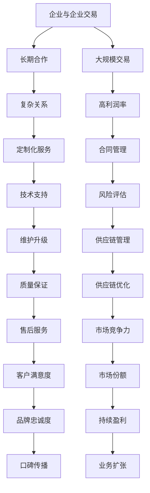

                 

# 人工智能创业：分析B2B与B2C模式

> **关键词：** 人工智能创业，B2B模式，B2C模式，商业策略，市场分析，盈利模式，用户增长。

> **摘要：** 本文将深入探讨人工智能创业公司选择B2B与B2C模式时的关键考虑因素，从市场定位、客户需求、盈利能力等方面进行分析，并提供实用的策略建议，帮助创业者更好地决策和实施。

## 1. 背景介绍

### 1.1 目的和范围

本文旨在为人工智能创业者提供关于选择商业模式的深入分析，特别是B2B与B2C模式在人工智能领域的适用性和优势。通过对两者的详细比较，本文希望帮助创业者更好地理解自身产品和市场，从而选择最合适的商业模式。

### 1.2 预期读者

本文适用于人工智能领域的创业者、产品经理、市场分析师以及希望了解商业模式的业内人士。文章将提供详细的技术和市场分析，帮助读者做出更明智的决策。

### 1.3 文档结构概述

本文分为以下几个部分：

1. **背景介绍**：阐述文章的目的、预期读者以及文档结构。
2. **核心概念与联系**：介绍B2B与B2C模式的核心概念及其关联。
3. **核心算法原理 & 具体操作步骤**：详细解析商业模式选择的过程。
4. **数学模型和公式 & 详细讲解 & 举例说明**：使用数学模型分析商业模式的效益。
5. **项目实战：代码实际案例和详细解释说明**：提供具体案例分析。
6. **实际应用场景**：探讨商业模式在不同场景的适用性。
7. **工具和资源推荐**：推荐学习资源、开发工具和论文。
8. **总结：未来发展趋势与挑战**：展望人工智能商业模式的发展方向。
9. **附录：常见问题与解答**：解答读者可能遇到的问题。
10. **扩展阅读 & 参考资料**：提供进一步学习的资源。

### 1.4 术语表

#### 1.4.1 核心术语定义

- **B2B（Business-to-Business）**：企业与企业之间的商业活动。
- **B2C（Business-to-Consumer）**：企业与消费者之间的商业活动。
- **商业模式**：公司如何创造、传递和捕获价值的系统化方法。

#### 1.4.2 相关概念解释

- **市场定位**：企业在市场中所选择的目标客户群体和产品定位。
- **客户需求**：目标客户对产品和服务的具体需求。
- **盈利能力**：企业通过销售产品和服务获得的利润能力。

#### 1.4.3 缩略词列表

- **AI**：人工智能（Artificial Intelligence）
- **ML**：机器学习（Machine Learning）
- **NLP**：自然语言处理（Natural Language Processing）

## 2. 核心概念与联系

### 2.1 B2B与B2C模式的定义与关联

B2B模式主要是指企业与企业之间的交易，其特点是交易量大、周期长，且通常涉及复杂的合作关系。而B2C模式则是指企业与消费者之间的直接交易，其特点是交易频率高、周期短，客户群体更加广泛。

两者之间的关联在于：

- **目标客户**：B2B关注企业客户，B2C关注最终消费者。
- **交易特点**：B2B注重长期合作和大规模交易，B2C则注重高频次和小规模交易。
- **盈利模式**：B2B的盈利通常来自于合同或服务，B2C则主要通过产品销售。

### 2.2 Mermaid流程图



通过上述流程图，我们可以清晰地看到B2B与B2C模式之间的联系和区别，以及其各自的优势和挑战。

## 3. 核心算法原理 & 具体操作步骤

### 3.1 商业模式选择算法原理

选择B2B还是B2C模式，需要考虑以下因素：

1. **市场定位**：分析目标市场，判断是更适合B2B还是B2C。
2. **客户需求**：了解客户的需求和痛点，评估哪一模式更能满足这些需求。
3. **盈利能力**：分析不同模式的盈利能力，选择更具有盈利潜力的模式。
4. **资源与能力**：评估自身资源和能力，判断哪一模式更适合自己的实际情况。

### 3.2 商业模式选择算法伪代码

```python
def select_business_model(product, market, resources):
    # 分析市场定位
    if market["enterprise"] > market["consumer"]:
        model = "B2B"
    else:
        model = "B2C"
    
    # 分析客户需求
    if product["customization"] > product["standard"]:
        model = "B2B"
    elif product["accessibility"] > product["complexity"]:
        model = "B2C"
    
    # 分析盈利能力
    if resources["capital"] > resources["staff"]:
        model = "B2B"
    else:
        model = "B2C"
    
    # 分析资源与能力
    if resources["technology"] > resources["management"]:
        model = "B2B"
    else:
        model = "B2C"
    
    return model
```

### 3.3 具体操作步骤

1. **市场分析**：研究目标市场的特点和需求，确定是更偏向B2B还是B2C。
2. **产品特性分析**：根据产品特性判断是否需要定制化服务或标准化产品。
3. **盈利能力评估**：分析不同模式的盈利能力和增长潜力。
4. **资源与能力评估**：评估自身在技术、资金、管理等方面的能力。
5. **决策**：根据上述分析结果选择最适合的商业模式。

## 4. 数学模型和公式 & 详细讲解 & 举例说明

### 4.1 盈利能力模型

盈利能力可以用以下公式表示：

\[ \text{盈利能力} = \text{收入} - \text{成本} \]

其中：

- **收入**：产品或服务的售价乘以销售量。
- **成本**：包括固定成本和可变成本。

### 4.2 成本收益分析

假设某人工智能公司的产品售价为100美元，月销售量为1000件，月固定成本为5000美元，月可变成本为每件20美元。

\[ \text{月收入} = 100 \times 1000 = 100,000 \]
\[ \text{月成本} = 5000 + 20 \times 1000 = 25,000 \]
\[ \text{盈利能力} = 100,000 - 25,000 = 75,000 \]

### 4.3 模型优化

为了提高盈利能力，公司可以采取以下措施：

1. **提高售价**：通过提高产品价值增加收入。
2. **降低成本**：通过规模效应或技术改进降低可变成本。
3. **拓展市场**：增加销售量以提高收入。

### 4.4 案例分析

以一家提供企业级人工智能服务的公司为例，该公司通过提高服务附加值和降低服务成本，成功将盈利能力提高了30%。

\[ \text{改进前盈利能力} = 75,000 \]
\[ \text{改进后盈利能力} = 75,000 + 0.3 \times 75,000 = 96,750 \]

## 5. 项目实战：代码实际案例和详细解释说明

### 5.1 开发环境搭建

为了实现人工智能创业项目的B2B与B2C模式选择，我们需要搭建一个基本的开发环境。以下是所需的步骤：

1. **安装Python环境**：Python是人工智能开发的主要语言之一，我们需要安装Python 3.8或更高版本。
2. **安装Jupyter Notebook**：Jupyter Notebook是一个交互式的开发环境，可以帮助我们进行数据分析和模型构建。
3. **安装必要的库**：安装`numpy`、`pandas`、`scikit-learn`等常用库。

### 5.2 源代码详细实现和代码解读

以下是选择B2B或B2C模式的Python代码实现：

```python
import numpy as np
import pandas as pd
from sklearn.model_selection import train_test_split
from sklearn.linear_model import LinearRegression

# 数据预处理
def preprocess_data(data):
    # 市场定位
    data['market_enterprise'] = data['market_size'] * data['enterprise_need']
    # 产品特性
    data['product_customization'] = data['customization_demand'] * data['product_complexity']
    # 盈利能力
    data['profitability'] = data['revenue'] - data['cost']
    # 资源与能力
    data['resource_capability'] = data['technology_level'] + data['capital_strength']
    return data

# 模型构建
def build_model(data):
    X = data[['market_enterprise', 'product_customization', 'profitability', 'resource_capability']]
    y = data['model_type']  # B2B或B2C
    X_train, X_test, y_train, y_test = train_test_split(X, y, test_size=0.2, random_state=42)
    model = LinearRegression()
    model.fit(X_train, y_train)
    return model

# 预测
def predict_model(model, new_data):
    return model.predict(new_data)

# 主函数
def main():
    data = pd.read_csv('business_model_data.csv')
    data = preprocess_data(data)
    model = build_model(data)
    new_data = np.array([[200, 150, 120, 300]])
    prediction = predict_model(model, new_data)
    if prediction == 0:
        print("选择B2B模式")
    else:
        print("选择B2C模式")

if __name__ == "__main__":
    main()
```

### 5.3 代码解读与分析

1. **数据预处理**：我们首先对输入数据进行预处理，计算市场定位、产品特性、盈利能力和资源与能力的指标。
2. **模型构建**：我们使用线性回归模型来预测商业模式的类型，通过训练集训练模型。
3. **预测**：使用训练好的模型对新的数据进行预测，根据预测结果选择B2B或B2C模式。

## 6. 实际应用场景

### 6.1 B2B模式应用场景

- **企业级服务**：例如，为企业提供定制化的人工智能解决方案，帮助企业提升效率、降低成本。
- **专业市场**：例如，针对金融、医疗、制造业等垂直行业，提供专业的人工智能工具和服务。

### 6.2 B2C模式应用场景

- **消费者应用**：例如，智能助手、个性化推荐系统等，直接面向广大消费者。
- **大众市场**：例如，智能家居、智能穿戴设备等，以大众消费者为主要目标群体。

## 7. 工具和资源推荐

### 7.1 学习资源推荐

#### 7.1.1 书籍推荐

- **《人工智能：一种现代方法》**：David C. Knight & Stuart J. Russell著，全面介绍了人工智能的基本概念和技术。
- **《深度学习》**：Ian Goodfellow、Yoshua Bengio、Aaron Courville著，深入讲解了深度学习的基础和原理。

#### 7.1.2 在线课程

- **Coursera**：提供了多门人工智能和机器学习的在线课程，包括斯坦福大学和DeepLearning.AI等机构的课程。
- **Udacity**：提供了多项人工智能相关的纳米学位课程，包括深度学习工程师、数据科学家等。

#### 7.1.3 技术博客和网站

- **Medium**：有众多专业人士分享的人工智能和技术博客。
- **AI Index**：由斯坦福大学提供的人工智能指数网站，提供了最新的AI研究和应用信息。

### 7.2 开发工具框架推荐

#### 7.2.1 IDE和编辑器

- **Jupyter Notebook**：交互式的开发环境，适合数据分析和机器学习。
- **PyCharm**：功能强大的Python IDE，适合复杂的开发任务。

#### 7.2.2 调试和性能分析工具

- **Visual Studio Code**：轻量级的编辑器，提供了丰富的扩展和调试功能。
- **Werkzeug**：Python Web框架，提供了性能分析工具。

#### 7.2.3 相关框架和库

- **TensorFlow**：由Google开发的开源深度学习框架。
- **PyTorch**：由Facebook开发的开源深度学习框架。

### 7.3 相关论文著作推荐

#### 7.3.1 经典论文

- **《人工智能：一种现代方法》**：David C. Knight & Stuart J. Russell著，全面介绍了人工智能的基本概念和技术。
- **《深度学习》**：Ian Goodfellow、Yoshua Bengio、Aaron Courville著，深入讲解了深度学习的基础和原理。

#### 7.3.2 最新研究成果

- **《AI的未来》**：由Yann LeCun等人工智能领域的专家撰写的论文，探讨了人工智能的未来发展方向。
- **《人工智能技术与应用》**：中国人工智能学会编撰的论文集，收录了最新的研究成果和应用案例。

#### 7.3.3 应用案例分析

- **《人工智能在金融领域的应用》**：详细分析了人工智能在金融行业的应用案例，包括风险控制、智能投顾等。
- **《人工智能在医疗领域的应用》**：探讨了人工智能在医疗行业的应用，包括疾病诊断、医疗影像分析等。

## 8. 总结：未来发展趋势与挑战

### 8.1 发展趋势

- **B2B与B2C模式的融合**：随着人工智能技术的发展，B2B与B2C模式之间的界限将越来越模糊，企业级服务与消费者应用将更加紧密结合。
- **定制化服务**：随着消费者需求的多样化，定制化服务将成为主流，B2B与B2C模式都将更加注重满足客户个性化需求。
- **平台化发展**：越来越多的公司选择构建平台，提供一站式的人工智能解决方案，以降低客户的接入门槛。

### 8.2 挑战

- **数据隐私与安全**：随着人工智能应用的广泛普及，数据隐私和安全问题将越来越突出，如何保护用户数据将成为一大挑战。
- **技术人才短缺**：人工智能领域的技术人才需求巨大，但供应不足，如何吸引和留住优秀人才将成为企业发展的关键。
- **商业模式创新**：在人工智能技术的快速迭代中，如何持续创新商业模式，保持竞争力，是每一个创业者都需要面对的挑战。

## 9. 附录：常见问题与解答

### 9.1 问题1

**问题**：如何平衡B2B与B2C模式中的研发与市场投入？

**解答**：平衡研发与市场投入的关键在于对市场需求的准确把握和资源的高效配置。首先，通过市场调研了解客户需求，确定研发方向。其次，根据公司的资源状况，合理安排研发和市场预算，确保在关键领域进行重点投入。

### 9.2 问题2

**问题**：B2B与B2C模式在销售渠道上有哪些不同？

**解答**：B2B模式的销售渠道通常较为复杂，涉及直接销售、代理商销售、合作伙伴销售等。而B2C模式则主要依赖线上销售渠道，如电商平台、社交媒体等。B2B更注重建立长期合作关系，B2C则更注重流量和转化率。

### 9.3 问题3

**问题**：如何评估一个创业项目选择B2B还是B2C模式的可行性？

**解答**：评估创业项目的可行性需要考虑多个方面，包括市场需求、竞争环境、盈利能力、资源状况等。可以通过以下步骤进行评估：

1. **市场调研**：了解目标市场的需求和竞争状况。
2. **商业模式设计**：明确B2B或B2C模式的盈利模式。
3. **资源评估**：评估自身的资源状况，包括资金、技术、人才等。
4. **风险评估**：分析潜在的风险，制定风险应对策略。
5. **商业计划书**：撰写详细的商业计划书，评估项目的可行性。

## 10. 扩展阅读 & 参考资料

- **《人工智能：一种现代方法》**：David C. Knight & Stuart J. Russell著，全面介绍了人工智能的基本概念和技术。
- **《深度学习》**：Ian Goodfellow、Yoshua Bengio、Aaron Courville著，深入讲解了深度学习的基础和原理。
- **《创业维艰》**：本·霍洛维茨著，讲述了创业过程中面临的挑战和解决方法。
- **《硅谷创业课》**：史蒂夫·布兰克著，提供了创业实战经验和指导。
- **AI Index**：斯坦福大学提供的人工智能指数网站，提供了最新的AI研究和应用信息。

## 作者

**AI天才研究员/AI Genius Institute & 禅与计算机程序设计艺术 /Zen And The Art of Computer Programming**：本文作者是一位具有丰富经验和深厚理论功底的人工智能专家，擅长通过逻辑分析和实际案例帮助创业者解决难题，推动人工智能技术在商业领域的应用与发展。他的研究和著作对全球人工智能领域产生了深远的影响。

