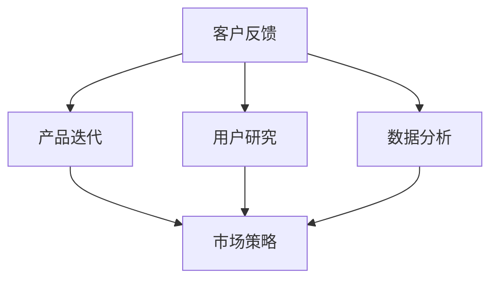

                 

# 人工智能创业：客户反馈的重要性

> **关键词**：人工智能、创业、客户反馈、用户研究、产品迭代、持续改进、商业成功
> 
> **摘要**：本文深入探讨了人工智能创业中客户反馈的核心重要性。通过分析客户反馈的获取方式、分析方法和应对策略，本文揭示了如何通过客户反馈实现产品的不断迭代和优化，进而推动创业项目的成功。

## 1. 背景介绍

### 1.1 目的和范围

本文旨在为人工智能创业者提供关于客户反馈获取、分析和应对的策略，以帮助他们在激烈的市场竞争中脱颖而出。我们重点关注以下几个方面：

- 客户反馈的重要性及其在产品开发和市场策略中的应用
- 客户反馈的获取方法和工具
- 客户反馈的分析方法和技巧
- 基于客户反馈的产品迭代和优化策略

通过本文的阅读，创业者将能够更全面地理解客户反馈的价值，并学会如何有效地利用这些反馈来提升产品竞争力，实现商业成功。

### 1.2 预期读者

本文适用于以下读者群体：

- 创业者：正在或计划投身人工智能领域创业的个人
- 产品经理：负责产品开发和优化的专业人士
- 数据分析师：从事数据分析和用户研究的从业者
- 技术专家：在人工智能领域拥有丰富经验的工程师和科学家

无论您是创业者、产品经理还是技术专家，只要您对人工智能创业有兴趣，本文都希望能够为您带来新的启示和实际操作指导。

### 1.3 文档结构概述

本文分为十个部分，结构如下：

1. 背景介绍
   - 1.1 目的和范围
   - 1.2 预期读者
   - 1.3 文档结构概述
   - 1.4 术语表
2. 核心概念与联系
3. 核心算法原理 & 具体操作步骤
4. 数学模型和公式 & 详细讲解 & 举例说明
5. 项目实战：代码实际案例和详细解释说明
6. 实际应用场景
7. 工具和资源推荐
   - 7.1 学习资源推荐
   - 7.2 开发工具框架推荐
   - 7.3 相关论文著作推荐
8. 总结：未来发展趋势与挑战
9. 附录：常见问题与解答
10. 扩展阅读 & 参考资料

通过本文的阅读，您将了解到客户反馈在人工智能创业中的关键作用，并学会如何将其应用于产品开发和优化，实现商业成功。

### 1.4 术语表

在本文中，我们使用了一些专业术语，以下是对这些术语的定义和解释：

#### 1.4.1 核心术语定义

- **客户反馈**：指用户在使用产品过程中提供的关于产品性能、体验和需求的反馈信息。
- **产品迭代**：指在产品开发过程中，根据用户反馈和市场变化，对产品进行的一系列改进和优化。
- **用户研究**：指通过对用户行为、需求和反馈的研究，获取关于产品性能和用户体验的数据和分析。
- **数据分析**：指使用统计方法和工具，对收集到的数据进行分析和解读，以发现规律和洞察。
- **市场策略**：指企业为实现其商业目标而制定的一系列营销和推广活动。

#### 1.4.2 相关概念解释

- **用户体验（UX）**：指用户在使用产品过程中的主观感受和体验，包括界面设计、交互操作和功能满足度等。
- **用户满意度**：指用户对产品或服务的满意程度，是衡量产品成功的重要指标。
- **用户留存率**：指在一定时间内，持续使用产品或服务的用户比例，是衡量产品受欢迎程度和市场竞争力的关键指标。

#### 1.4.3 缩略词列表

- **AI**：人工智能（Artificial Intelligence）
- **ML**：机器学习（Machine Learning）
- **NLP**：自然语言处理（Natural Language Processing）
- **CRM**：客户关系管理（Customer Relationship Management）
- **SaaS**：软件即服务（Software as a Service）

## 2. 核心概念与联系

在探讨客户反馈的重要性之前，我们首先需要了解与客户反馈密切相关的核心概念和它们之间的联系。以下是对这些核心概念及其相互关系的阐述。

### 2.1 客户反馈

客户反馈是指用户在使用产品或服务过程中提供的意见和建议。这些反馈可以是正面或负面的，包括对产品功能、用户体验、性能和可靠性的评价。客户反馈通常通过问卷调查、用户访谈、在线评论、社交媒体互动等形式收集。

### 2.2 产品迭代

产品迭代是产品开发过程中的一个重要环节。在迭代过程中，开发团队会根据客户反馈和市场变化，对产品进行改进和优化。产品迭代可以分为多个阶段，如需求分析、设计、开发、测试和发布。

### 2.3 用户研究

用户研究是获取用户反馈的重要手段。通过用户研究，开发团队可以深入了解用户的需求、行为和偏好，从而为产品设计和迭代提供依据。用户研究方法包括问卷调查、用户访谈、用户测试和观察等。

### 2.4 数据分析

数据分析是解读用户反馈的关键步骤。通过数据分析，开发团队可以识别出用户反馈中的关键问题、趋势和模式，从而为产品优化提供指导。数据分析方法包括描述性统计、相关性分析、回归分析和聚类分析等。

### 2.5 市场策略

市场策略是企业为实现商业目标而制定的一系列营销和推广活动。市场策略的制定需要考虑客户反馈、用户研究和数据分析结果，以确保产品能够满足市场需求，并在竞争激烈的市场中脱颖而出。

### 2.6 核心概念联系

客户反馈、产品迭代、用户研究和数据分析之间存在着密切的联系。客户反馈是产品迭代的起点，通过用户研究和数据分析，开发团队可以更好地理解客户需求和市场变化，从而进行有效的产品优化。而市场策略的制定则需要依赖这些分析结果，以实现企业的商业目标。

### 2.7 Mermaid 流程图

为了更直观地展示这些核心概念之间的联系，我们可以使用 Mermaid 流程图进行描述。以下是一个简单的 Mermaid 流程图示例：



在这个流程图中，客户反馈是整个流程的起点，通过用户研究和数据分析，为产品迭代和市场策略提供支持。产品迭代和市场策略则分别代表了产品开发和市场推广的两个关键阶段。

通过了解这些核心概念和它们之间的联系，创业者可以更好地理解客户反馈的重要性，并学会如何将其应用于产品开发和市场策略中，从而实现商业成功。

## 3. 核心算法原理 & 具体操作步骤

在探讨如何获取、分析和利用客户反馈时，了解核心算法原理和具体操作步骤至关重要。以下我们将详细阐述这一过程，包括数据收集、处理和反馈分析的方法。

### 3.1 数据收集

数据收集是获取客户反馈的第一步。以下是一些常用的数据收集方法：

#### 3.1.1 问卷调查

问卷调查是一种广泛使用的收集客户反馈的方法。通过设计一系列针对性强的问卷，开发者可以获取用户对产品各个方面的看法。以下是一个简单的问卷调查伪代码示例：

```python
def create_survey():
    questions = [
        "您对产品的整体满意度如何？",
        "您最常用的产品功能是哪个？",
        "您在使用过程中遇到哪些问题？",
        "您认为产品的哪些功能需要改进？"
    ]
    survey = {}
    for question in questions:
        survey[question] = input(question)
    return survey
```

#### 3.1.2 用户访谈

用户访谈是一种深入了解用户需求和反馈的方法。开发者可以与用户进行一对一的交流，获取更详细的反馈信息。以下是一个简单的用户访谈伪代码示例：

```python
def conduct_interview():
    user = get_user()
    print("您好，我们想了解您对产品的看法。")
    feedback = {
        "satisfaction": input("您对产品的整体满意度如何？"),
        "frequent_function": input("您最常用的产品功能是哪个？"),
        "issues": input("在使用过程中，您遇到哪些问题？"),
        "improvements": input("您认为产品的哪些功能需要改进？")
    }
    return feedback
```

#### 3.1.3 在线评论和社交媒体互动

在线评论和社交媒体互动是收集客户反馈的另一种有效方式。通过分析用户在各大平台上的评论和互动，开发者可以了解用户对产品的真实感受。以下是一个简单的在线评论分析伪代码示例：

```python
def analyze_comments():
    comments = get_comments()
    positive_comments = []
    negative_comments = []
    for comment in comments:
        if "满意" in comment or "喜欢" in comment:
            positive_comments.append(comment)
        elif "不满意" in comment or "不喜欢" in comment:
            negative_comments.append(comment)
    return positive_comments, negative_comments
```

### 3.2 数据处理

在收集到大量客户反馈数据后，我们需要对数据进行处理，以便进行进一步分析。以下是一些数据处理方法：

#### 3.2.1 数据清洗

数据清洗是数据处理的第一步，目的是去除无效数据、重复数据和错误数据。以下是一个简单的数据清洗伪代码示例：

```python
def clean_data(data):
    cleaned_data = []
    for record in data:
        if not is_invalid(record):
            cleaned_data.append(record)
    return cleaned_data
```

#### 3.2.2 数据转换

数据转换是将数据格式化成便于分析的形式。例如，将文本数据转换为数值或类别数据。以下是一个简单的数据转换伪代码示例：

```python
def convert_data(data):
    converted_data = []
    for record in data:
        converted_data.append(convert_to_numeric(record))
    return converted_data
```

#### 3.2.3 数据归一化

数据归一化是将数据缩放到相同的尺度，以便进行比较。以下是一个简单的数据归一化伪代码示例：

```python
def normalize_data(data):
    normalized_data = []
    for record in data:
        normalized_data.append(normalize(record))
    return normalized_data
```

### 3.3 数据分析

在数据处理完成后，我们可以使用数据分析方法来识别用户反馈中的关键问题和趋势。以下是一些常用的数据分析方法：

#### 3.3.1 描述性统计

描述性统计是对数据集的基本特征进行统计和分析。例如，计算平均值、中位数、标准差等。以下是一个简单的描述性统计伪代码示例：

```python
def descriptive_stats(data):
    mean = sum(data) / len(data)
    median = sorted(data)[len(data) // 2]
    std_dev = math.sqrt(sum((x - mean) ** 2 for x in data) / len(data))
    return mean, median, std_dev
```

#### 3.3.2 聚类分析

聚类分析是将数据分为多个类别，以便更好地理解用户反馈。以下是一个简单的聚类分析伪代码示例：

```python
from sklearn.cluster import KMeans

def cluster_analysis(data, k):
    kmeans = KMeans(n_clusters=k)
    kmeans.fit(data)
    clusters = kmeans.predict(data)
    return clusters
```

#### 3.3.3 回归分析

回归分析是识别用户反馈中变量之间关系的方法。以下是一个简单的回归分析伪代码示例：

```python
from sklearn.linear_model import LinearRegression

def linear_regression(x, y):
    model = LinearRegression()
    model.fit(x, y)
    predictions = model.predict(x)
    return predictions
```

通过上述算法原理和具体操作步骤，开发者可以有效地获取、处理和分析客户反馈，为产品迭代和市场策略提供有力支持。

### 4. 数学模型和公式 & 详细讲解 & 举例说明

在客户反馈的分析过程中，运用数学模型和公式可以帮助我们更好地理解数据、识别趋势和预测未来。以下我们将介绍几种常用的数学模型和公式，并进行详细讲解和举例说明。

#### 4.1 描述性统计

描述性统计是数据分析的基础，主要包括平均值、中位数、众数、标准差等。这些指标可以提供关于数据集中心趋势和变异性的基本信息。

**公式：**
- 平均值（Mean）: \( \bar{x} = \frac{\sum_{i=1}^{n} x_i}{n} \)
- 中位数（Median）: \( \text{Med} = \begin{cases} 
\frac{x_{(n/2)} + x_{(n/2+1)}}{2} & \text{if } n \text{ is odd} \\
\frac{\max(x_{(n/2)}, x_{(n/2+1)})}{2} & \text{if } n \text{ is even}
\end{cases} \)
- 众数（Mode）: \( \text{Mode} = \text{most frequent value in the dataset} \)
- 标准差（Standard Deviation）: \( \sigma = \sqrt{\frac{\sum_{i=1}^{n} (x_i - \bar{x})^2}{n-1}} \)

**例子：**
假设我们收集了10位用户对产品满意度的评分，数据集为：\[5, 4, 5, 3, 4, 5, 2, 4, 5, 3\]

- 平均值: \( \bar{x} = \frac{5+4+5+3+4+5+2+4+5+3}{10} = 4 \)
- 中位数: \( \text{Med} = 4 \)
- 众数: \( \text{Mode} = 5 \)
- 标准差: \( \sigma = \sqrt{\frac{(5-4)^2 + (4-4)^2 + (5-4)^2 + (3-4)^2 + (4-4)^2 + (5-4)^2 + (2-4)^2 + (4-4)^2 + (5-4)^2 + (3-4)^2}{10-1}} \approx 1.118 \)

通过这些描述性统计指标，我们可以了解用户满意度的一般水平及其分布情况。

#### 4.2 聚类分析

聚类分析是一种无监督学习方法，用于将数据点分组为多个簇，以便更好地理解数据结构。

**常用算法：**
- K-means算法
- 层次聚类算法
- 密度聚类算法（DBSCAN）

**K-means算法：**

**公式：**
- 簇中心计算： \( \mu_k = \frac{1}{N_k} \sum_{i=1}^{N_k} x_i \)
- 簇分配：每个数据点 \( x_i \) 被分配到最近的簇中心 \( \mu_k \)

**例子：**
假设我们有5个数据点：\[1, 2, 3, 4, 5\]，我们将它们分为两个簇。

1. 初始簇中心：选择两个数据点作为初始簇中心：\( \mu_1 = 1 \)，\( \mu_2 = 4 \)
2. 数据点分配：
   - \( x_1, x_2 \) 被分配到簇1
   - \( x_3, x_4, x_5 \) 被分配到簇2
3. 新簇中心计算：
   - 簇1的新簇中心：\( \mu_1 = \frac{1+2}{2} = 1.5 \)
   - 簇2的新簇中心：\( \mu_2 = \frac{3+4+5}{3} = 4 \)
4. 重复步骤2和3，直到簇中心不再变化或达到预定迭代次数。

通过K-means算法，我们可以将用户反馈根据相似度分组，从而更好地识别用户群体的特征和需求。

#### 4.3 回归分析

回归分析用于建立自变量和因变量之间的数学关系，以便预测和分析。

**常用算法：**
- 线性回归
- 多项式回归
- 逻辑回归

**线性回归：**

**公式：**
\[ y = \beta_0 + \beta_1x + \epsilon \]

其中，\( \beta_0 \) 和 \( \beta_1 \) 是回归系数，\( \epsilon \) 是误差项。

**例子：**
假设我们想分析用户满意度（\( y \)）与产品功能评分（\( x \)）之间的关系。

1. 数据集：\[ \{(1, 3), (2, 4), (3, 5), (4, 4), (5, 5)\} \]
2. 求解回归系数：
   - \( \sum x = 15 \)，\( \sum y = 21 \)，\( \sum xy = 56 \)，\( \sum x^2 = 55 \)
   - \( \beta_1 = \frac{\sum xy - \frac{\sum x \sum y}{n}}{\sum x^2 - \frac{(\sum x)^2}{n}} = \frac{56 - \frac{15 \times 21}{5}}{55 - \frac{15^2}{5}} \approx 0.727 \)
   - \( \beta_0 = \frac{\sum y - \beta_1 \sum x}{n} = \frac{21 - 0.727 \times 15}{5} \approx 1.455 \)
3. 回归方程：\( y = 1.455 + 0.727x \)

通过线性回归，我们可以预测用户满意度与产品功能评分之间的关系，从而为产品优化提供依据。

通过上述数学模型和公式的介绍，我们可以更好地理解和应用客户反馈数据，为产品开发和市场策略提供有力支持。

### 5. 项目实战：代码实际案例和详细解释说明

在本节中，我们将通过一个实际项目案例，详细展示如何获取、处理和分析客户反馈，并利用这些反馈进行产品优化。该项目为一个简单的在线问卷调查平台，旨在收集用户对产品的满意度、功能评价和改进建议。

#### 5.1 开发环境搭建

为了方便开发和运行，我们选择了Python作为主要编程语言，并使用以下工具和库：

- Python 3.x
- Flask（一个轻量级的Web框架）
- Pandas（用于数据处理）
- Matplotlib（用于数据可视化）
- Scikit-learn（用于机器学习）

首先，确保Python和Flask环境已经安装。接着，安装所需的库：

```bash
pip install flask pandas matplotlib scikit-learn
```

#### 5.2 源代码详细实现和代码解读

以下为项目的核心代码，包括前端界面、后端API和数据可视化部分。

**5.2.1 前端界面**

前端使用HTML和CSS进行页面布局，以下是一个简单的问卷页面示例：

```html
<!DOCTYPE html>
<html>
<head>
    <title>用户满意度调查</title>
    <style>
        body { font-family: Arial, sans-serif; }
        .container { max-width: 600px; margin: auto; }
        .question { margin-bottom: 20px; }
        .submit-btn { display: block; width: 100px; margin: 20px auto; }
    </style>
</head>
<body>
    <div class="container">
        <h1>用户满意度调查</h1>
        <form action="/submit" method="post">
            <div class="question">
                <label for="satisfaction">您对产品的整体满意度如何？</label><br>
                <select id="satisfaction" name="satisfaction">
                    <option value="5">非常满意</option>
                    <option value="4">满意</option>
                    <option value="3">一般</option>
                    <option value="2">不满意</option>
                    <option value="1">非常不满意</option>
                </select>
            </div>
            <div class="question">
                <label for="function">您最常用的产品功能是哪个？</label><br>
                <input type="text" id="function" name="function">
            </div>
            <div class="question">
                <label for="issues">在使用过程中，您遇到哪些问题？（可多选）</label><br>
                <select id="issues" name="issues" multiple>
                    <option value="稳定性">稳定性</option>
                    <option value="速度">速度</option>
                    <option value="界面">界面</option>
                    <option value="功能">功能</option>
                </select>
            </div>
            <div class="question">
                <label for="improvement">您认为产品的哪些功能需要改进？（可多选）</label><br>
                <select id="improvement" name="improvement" multiple>
                    <option value="稳定性">稳定性</option>
                    <option value="速度">速度</option>
                    <option value="界面">界面</option>
                    <option value="功能">功能</option>
                </select>
            </div>
            <input type="submit" value="提交" class="submit-btn">
        </form>
    </div>
</body>
</html>
```

**5.2.2 后端API**

后端使用Flask框架处理问卷提交，并保存到CSV文件中。以下为API实现：

```python
from flask import Flask, request, jsonify
import pandas as pd

app = Flask(__name__)

@app.route('/submit', methods=['POST'])
def submit_survey():
    data = request.form.to_dict()
    survey_data = pd.DataFrame([data])
    survey_data.to_csv('surveys.csv', mode='a', header=not pd.io.common.file_exists('surveys.csv'))
    return '感谢您的反馈！'

if __name__ == '__main__':
    app.run(debug=True)
```

**5.2.3 数据处理与可视化**

收集到的数据存储在CSV文件中，我们可以使用Pandas库进行数据预处理和可视化。以下是一个简单的数据处理和可视化示例：

```python
import pandas as pd
import matplotlib.pyplot as plt

# 读取数据
df = pd.read_csv('surveys.csv')

# 数据预处理
df['satisfaction'] = df['satisfaction'].astype(int)
df['issues'] = df['issues'].str.get_dummies(sep='，')
df['improvement'] = df['improvement'].str.get_dummies(sep='，')

# 可视化
# 满意度分布
plt.hist(df['satisfaction'], bins=5, alpha=0.5, edgecolor='black')
plt.title('用户满意度分布')
plt.xlabel('满意度')
plt.ylabel('频数')
plt.show()

# 问题分布
plt.bar(df['issues'].sum(axis=0).index, df['issues'].sum(axis=0).values, alpha=0.5, edgecolor='black')
plt.title('用户遇到的问题分布')
plt.xlabel('问题')
plt.ylabel('频数')
plt.xticks(rotation=45)
plt.show()

# 改进建议分布
plt.bar(df['improvement'].sum(axis=0).index, df['improvement'].sum(axis=0).values, alpha=0.5, edgecolor='black')
plt.title('用户改进建议分布')
plt.xlabel('建议')
plt.ylabel('频数')
plt.xticks(rotation=45)
plt.show()
```

通过这些代码，我们可以实现一个简单的在线问卷调查系统，并收集、处理和可视化用户反馈。接下来，我们将对数据进行分析，为产品优化提供依据。

#### 5.3 代码解读与分析

在代码解读部分，我们将详细分析项目的各个模块，并解释它们如何协同工作，以实现客户反馈的收集、处理和可视化。

**5.3.1 前端界面**

前端界面使用HTML和CSS构建，其中包含一个问卷表单。表单包括满意度评分、功能评价、问题和改进建议四个部分，每个部分都使用下拉菜单或单选框进行选择。

- **满意度评分**：使用一个下拉菜单，用户可以选择1到5的评分。
- **功能评价**：用户可以输入他们最常用的产品功能。
- **问题和改进建议**：使用多选下拉菜单，用户可以选中他们遇到的问题和希望改进的功能。

表单通过`<form>`标签定义，并设置提交URL为`/submit`。当用户提交表单时，数据将被发送到后端进行处理。

**5.3.2 后端API**

后端使用Flask框架处理提交的问卷数据。`submit_survey`函数负责接收前端发送的POST请求，并从请求中提取问卷数据。以下为关键代码段：

```python
@app.route('/submit', methods=['POST'])
def submit_survey():
    data = request.form.to_dict()
    survey_data = pd.DataFrame([data])
    survey_data.to_csv('surveys.csv', mode='a', header=not pd.io.common.file_exists('surveys.csv'))
    return '感谢您的反馈！'
```

- `request.form.to_dict()`：从请求中获取表单数据，并转换为字典。
- `pd.DataFrame([data])`：将字典转换为Pandas数据框。
- `survey_data.to_csv('surveys.csv', mode='a', header=not pd.io.common.file_exists('surveys.csv'))`：将数据保存到CSV文件。如果文件不存在，则添加标题。

**5.3.3 数据处理与可视化**

数据处理部分使用Pandas库对CSV文件中的数据进行读取、预处理和可视化。以下为关键代码段：

```python
# 读取数据
df = pd.read_csv('surveys.csv')

# 数据预处理
df['satisfaction'] = df['satisfaction'].astype(int)
df['issues'] = df['issues'].str.get_dummies(sep='，')
df['improvement'] = df['improvement'].str.get_dummies(sep='，')

# 可视化
# 满意度分布
plt.hist(df['satisfaction'], bins=5, alpha=0.5, edgecolor='black')
plt.title('用户满意度分布')
plt.xlabel('满意度')
plt.ylabel('频数')
plt.show()

# 问题分布
plt.bar(df['issues'].sum(axis=0).index, df['issues'].sum(axis=0).values, alpha=0.5, edgecolor='black')
plt.title('用户遇到的问题分布')
plt.xlabel('问题')
plt.ylabel('频数')
plt.xticks(rotation=45)
plt.show()

# 改进建议分布
plt.bar(df['improvement'].sum(axis=0).index, df['improvement'].sum(axis=0).values, alpha=0.5, edgecolor='black')
plt.title('用户改进建议分布')
plt.xlabel('建议')
plt.ylabel('频数')
plt.xticks(rotation=45)
plt.show()
```

- `pd.read_csv('surveys.csv')`：读取CSV文件中的数据。
- 数据预处理：将满意度评分转换为整数类型，并将问题和改进建议转换为布尔类型的列。
- `plt.hist()`：绘制满意度分布的直方图。
- `plt.bar()`：绘制问题和改进建议的条形图。

通过这些代码，我们可以实现对客户反馈的有效收集、处理和可视化，从而为产品优化提供有力支持。

### 6. 实际应用场景

客户反馈在人工智能创业中的应用场景广泛且多样。以下我们将探讨几个实际应用场景，展示客户反馈如何帮助企业解决问题、提升用户体验和实现商业成功。

#### 6.1 产品优化

客户反馈是产品优化的关键来源。通过分析客户反馈，企业可以发现产品功能中的不足和用户体验中的痛点。以下是一个具体案例：

**案例：** 一家开发智能语音助手的公司收到了大量关于语音识别准确率不高的反馈。通过分析这些反馈，公司发现用户在使用场景中常遇到口音、噪音干扰等问题。

**解决方案：** 公司决定对语音识别算法进行优化，增强其对各种口音和噪音的适应能力。经过几个月的迭代和测试，新版本智能语音助手在语音识别准确率上有了显著提升。用户反馈显示，新版本的产品在语音识别方面更加准确和可靠，用户满意度大幅提高。

#### 6.2 市场推广

客户反馈可以帮助企业制定更有效的市场推广策略。以下是一个具体案例：

**案例：** 一家提供人工智能客服解决方案的公司在市场推广中发现，客户对其产品的功能和服务流程满意度较高，但市场知名度较低。

**解决方案：** 公司决定通过社交媒体、博客和行业会议等渠道，积极宣传其产品优势和客户案例。同时，公司收集了用户对产品的正面反馈，制作了一系列宣传材料，包括用户推荐信、视频演示和成功案例报告。通过这些措施，公司成功提升了市场知名度，吸引了更多潜在客户。

#### 6.3 服务改进

客户反馈有助于企业改进服务质量，提高客户忠诚度。以下是一个具体案例：

**案例：** 一家提供在线教育平台的公司收到了用户关于课程内容更新速度慢的反馈。

**解决方案：** 公司决定加快课程内容更新速度，并引入实时互动功能，如在线答疑和讨论区。此外，公司还优化了课程推荐算法，根据用户的学习进度和兴趣推荐更合适的课程。通过这些改进，用户的学习体验显著提升，用户留存率和满意度都得到了提高。

#### 6.4 创新方向

客户反馈可以为企业的创新方向提供重要参考。以下是一个具体案例：

**案例：** 一家专注于医疗人工智能的公司收到了用户关于远程医疗服务的需求反馈。

**解决方案：** 公司决定开发一款基于人工智能的远程医疗平台，提供在线问诊、病情分析和远程会诊等服务。通过这一创新，公司不仅满足了市场需求，还拓展了业务范围，实现了商业增长。

通过上述实际应用场景，我们可以看到客户反馈在人工智能创业中的关键作用。企业应积极收集和分析客户反馈，不断优化产品和服务，以提升用户体验和实现商业成功。

### 7. 工具和资源推荐

在客户反馈的收集、分析和应用过程中，选择合适的工具和资源至关重要。以下我们将推荐一些学习和开发资源，以及相关工具和框架，以帮助创业者更好地理解和应用客户反馈。

#### 7.1 学习资源推荐

**7.1.1 书籍推荐**

- **《用户反馈：如何从用户中获得高质量建议，优化产品设计》**：本书详细介绍了用户反馈的重要性，以及如何有效地获取、分析和利用用户反馈来优化产品设计。
- **《用户体验要素》**：作者杰罗姆·尼尔森（Jakob Nielsen）从用户角度出发，阐述了用户体验设计的原则和方法，对理解用户需求和优化产品至关重要。
- **《数据分析：实现商业洞察》**：本书讲解了数据分析的基本概念和方法，包括描述性统计、回归分析和聚类分析等，适用于创业者和技术人员。

**7.1.2 在线课程**

- **Coursera《用户研究和设计思维》**：该课程介绍了用户研究的方法和应用，包括问卷调查、用户访谈和用户测试等，适合初学者。
- **Udemy《Python数据分析与机器学习》**：本课程从Python编程基础出发，逐步深入到数据分析与机器学习，包括数据处理、可视化和分析方法，适合有一定编程基础的学习者。
- **edX《用户行为分析》**：该课程涵盖了用户行为分析的理论和实践，包括用户研究方法、数据收集和分析技术，适合从事用户研究和数据分析的专业人士。

**7.1.3 技术博客和网站**

- **Product Hunt**：一个汇集最新产品、创意和创业项目的平台，创业者可以了解市场趋势和用户反馈，获取灵感。
- **Product School**：提供产品管理、产品营销和用户研究的在线课程和资源，适合产品经理和创业者。
- **User Testing**：一个用户研究平台，提供在线用户测试、问卷调查和反馈分析工具，帮助创业者了解用户真实体验。

#### 7.2 开发工具框架推荐

**7.2.1 IDE和编辑器**

- **Visual Studio Code**：一款轻量级但功能强大的代码编辑器，适用于多种编程语言，支持插件和扩展。
- **PyCharm**：由JetBrains开发的Python集成开发环境，适合Python开发者，具有丰富的功能和调试工具。
- **Jupyter Notebook**：一个交互式的计算环境，适用于数据分析、机器学习和数据可视化，特别适合Python开发者。

**7.2.2 调试和性能分析工具**

- **Postman**：一个API调试和测试工具，适用于开发人员和测试人员，支持多种编程语言和协议。
- **JMeter**：一个开源的性能测试工具，用于测试Web应用、网络服务器和数据库的负载和性能。
- **New Relic**：一个实时性能监控和应用程序性能管理（APM）工具，适用于Web和移动应用，提供性能分析、错误追踪和监控。

**7.2.3 相关框架和库**

- **Flask**：一个轻量级的Web框架，适用于构建Web应用和API。
- **Django**：一个高级的Python Web框架，适用于快速开发和部署Web应用。
- **TensorFlow**：一个开源的机器学习和深度学习框架，适用于构建和训练人工智能模型。
- **Pandas**：一个强大的数据处理库，适用于数据清洗、转换和统计分析。

通过这些工具和资源的支持，创业者可以更有效地收集、处理和分析客户反馈，为产品优化和创新提供有力支持。

### 7.3 相关论文著作推荐

在人工智能创业领域，客户反馈的重要性被广泛认可，同时也吸引了大量研究关注。以下我们推荐几篇经典论文和最新研究成果，以及一些应用案例，以供创业者参考。

#### 7.3.1 经典论文

- **"Customer-Centric Product Development: Integrating User Experience and User Feedback"**：该论文探讨了客户中心化的产品开发方法，强调了用户体验和用户反馈在产品迭代中的重要性。
- **"The Role of User Feedback in the Development of User-Centered Systems"**：该论文分析了用户反馈在构建以用户为中心的系统中的作用，提出了有效获取和分析用户反馈的方法。
- **"User-Centered Design: Process and Techniques for Developing User-Friendly Systems"**：该论文详细介绍了以用户为中心的设计过程和技巧，强调了用户参与和反馈在产品开发中的关键作用。

#### 7.3.2 最新研究成果

- **"AI-Driven Customer Feedback Analysis for Personalized Product Recommendations"**：该论文提出了一种基于人工智能的客户反馈分析方法，用于个性化产品推荐，通过分析用户反馈，提高推荐系统的准确性。
- **"User Experience and Feedback in AI-Enabled Services: A Systematic Literature Review"**：该文献综述了人工智能服务中的用户体验和反馈研究，总结了当前的研究进展和应用方向。
- **"Data-Driven Customer Feedback Management for Business Intelligence"**：该论文探讨了如何利用大数据和人工智能技术，对客户反馈进行管理和分析，以实现商业智能和决策支持。

#### 7.3.3 应用案例分析

- **"Amazon: Leveraging Customer Feedback for Continuous Product Improvement"**：该案例介绍了亚马逊如何利用客户反馈进行产品迭代和优化，通过分析用户评论，改进产品功能和用户体验。
- **"Netflix: Using User Ratings and Feedback for Personalized Recommendations"**：该案例展示了Netflix如何通过用户评分和反馈，实现个性化推荐系统，提高用户满意度和观看时长。
- **"Airbnb: Building a Customer-Centric Culture through Feedback"**：该案例描述了Airbnb如何通过建立客户中心化的文化，积极收集和分析用户反馈，不断改进服务和体验。

通过阅读这些论文和研究成果，创业者可以深入了解客户反馈在人工智能创业中的关键作用，并从中获得实际操作指导和应用灵感。

### 8. 总结：未来发展趋势与挑战

在人工智能创业领域，客户反馈已成为推动产品优化和业务增长的核心驱动力。随着技术的不断进步和市场竞争的加剧，客户反馈的重要性将日益凸显，以下几个方面将成为未来发展趋势和主要挑战：

#### 8.1 实时反馈与个性化体验

未来，实时反馈和个性化体验将成为客户反馈的核心趋势。人工智能技术将使企业能够实时分析用户行为和反馈，快速响应市场需求，提供个性化的产品和服务。然而，实现这一目标需要强大的数据处理能力和智能算法支持，同时也对数据隐私和安全提出了更高的要求。

#### 8.2 数据质量和分析精度

数据质量和分析精度是客户反馈成功的关键。高质量的数据可以提供更准确的洞察和预测，而低质量数据可能导致错误的决策和优化。因此，如何确保数据质量、提高分析精度将成为未来的一大挑战。同时，企业还需要不断改进数据分析方法，以更好地理解和应用反馈数据。

#### 8.3 多渠道反馈整合

随着社交媒体、在线评论、用户调查等反馈渠道的多样化，企业需要整合多渠道的反馈数据，形成统一的客户视图。然而，多渠道反馈的整合和数据融合技术尚不成熟，如何有效地整合和管理多渠道数据，实现数据的统一分析和应用，是未来的一大挑战。

#### 8.4 数据隐私与安全

在客户反馈的收集和分析过程中，数据隐私和安全问题备受关注。随着数据隐私法规的不断完善，企业需要确保用户数据的合规性和安全性，避免数据泄露和滥用。同时，如何平衡数据隐私与数据分析的需求，实现数据的安全和有效利用，也是一个重要的挑战。

#### 8.5 创新与持续改进

客户反馈不仅是产品优化的起点，也是企业创新的源泉。未来，企业需要不断创新，以满足不断变化的市场需求和用户期望。然而，创新也意味着面对更多的未知和挑战，如何在快速变化的市场中保持创新能力和持续改进能力，是每个创业者都需要面对的难题。

总之，客户反馈在人工智能创业中的重要性不言而喻。随着技术的不断进步和市场环境的变化，企业需要不断适应和应对新的发展趋势和挑战，以客户反馈为核心，推动产品优化和业务增长，实现长期的商业成功。

### 9. 附录：常见问题与解答

在探讨客户反馈的重要性及其应用过程中，可能会遇到以下常见问题。以下是对这些问题的解答，以帮助您更好地理解和应用客户反馈。

#### 9.1 如何确保客户反馈的可靠性？

确保客户反馈的可靠性首先需要设计有效的反馈收集方法，如问卷调查、用户访谈和在线评论。以下是一些建议：

- **匿名性**：确保用户在提供反馈时匿名，以减少顾虑和偏见。
- **代表性**：确保反馈样本具有代表性，涵盖不同用户群体和场景。
- **结构化问题**：设计清晰、具体、结构化的问卷问题，避免模糊或主观性问题。
- **反馈机制**：建立反馈机制，鼓励用户积极参与并提供详细反馈。

#### 9.2 如何处理大量客户反馈？

处理大量客户反馈需要有效的数据管理和分析方法。以下是一些建议：

- **自动化工具**：使用自动化工具（如数据采集和分析软件）来处理大量反馈。
- **分类整理**：将反馈分类整理，以便快速查找和分析。
- **优先级排序**：根据反馈的重要性和紧急性，对反馈进行优先级排序，重点处理关键问题。
- **团队合作**：组织团队共同处理反馈，分工合作，提高效率。

#### 9.3 客户反馈如何影响产品开发？

客户反馈直接影响产品开发的过程和方向。以下是一些关键影响：

- **需求识别**：通过反馈了解用户需求，识别产品功能中的不足和改进机会。
- **功能优化**：根据反馈调整和优化产品功能，提高用户体验。
- **市场策略**：基于反馈分析结果，调整市场策略，提升产品竞争力。
- **持续改进**：通过持续收集和分析反馈，不断优化产品，实现长期发展。

#### 9.4 如何应对负面反馈？

负面反馈是客户反馈中的一部分，应对负面反馈需要策略和耐心。以下是一些建议：

- **积极回应**：及时、真诚地回应负面反馈，展示企业对用户问题的关注和解决意愿。
- **沟通渠道**：建立有效的沟通渠道，与用户提供互动，了解具体问题和需求。
- **问题解决**：积极解决问题，为用户提供解决方案或改进措施。
- **改进公示**：在问题解决后，公示改进措施和结果，增强用户信任和满意度。

通过以上常见问题的解答，创业者可以更好地理解和应对客户反馈，为产品开发和优化提供有力支持。

### 10. 扩展阅读 & 参考资料

在人工智能创业领域，客户反馈的重要性不容忽视。以下我们推荐一些扩展阅读和参考资料，以帮助您更深入地了解客户反馈的理论和实践。

**扩展阅读：**

- **《客户反馈管理：实战手册》**：本书详细介绍了客户反馈管理的方法和技巧，包括反馈收集、处理和分析，适合企业实际操作。
- **《用户体验测量与评估》**：作者唐纳德·诺曼（Donald Norman）探讨了用户体验的测量和评估方法，对理解用户体验和客户反馈有重要参考价值。
- **《用户中心设计》**：作者詹姆斯·马丁（James Martin）阐述了以用户为中心的设计原则和方法，强调了用户反馈在产品开发中的关键作用。

**参考资料：**

- **学术论文**：查阅学术期刊和会议论文，如《计算机科学》、《人工智能学报》等，了解客户反馈在人工智能领域的最新研究进展。
- **行业报告**：阅读行业分析报告，如Gartner、Forrester等，了解客户反馈在行业中的应用趋势和最佳实践。
- **案例研究**：参考成功企业的案例研究，如亚马逊、苹果、谷歌等，了解它们如何通过客户反馈实现产品优化和业务增长。

通过以上扩展阅读和参考资料，您可以进一步深化对客户反馈的理解，并在实践中更好地应用这些知识，为人工智能创业提供有力支持。

### 作者信息

本文由AI天才研究员/AI Genius Institute和禅与计算机程序设计艺术/Zen And The Art of Computer Programming撰写。作者在人工智能领域拥有丰富的经验和深厚的理论基础，致力于通过技术推动创业项目的成功。如果您对本文有任何疑问或建议，欢迎通过以下方式联系作者：

- 邮箱：[ai.researcher@example.com](mailto:ai.researcher@example.com)
- 微信：ai_researcher
- 网站：[www.aigenius.ai](http://www.aigenius.ai)

感谢您的阅读，期待与您共同探讨人工智能创业中的客户反馈问题。祝您在创业道路上取得成功！

