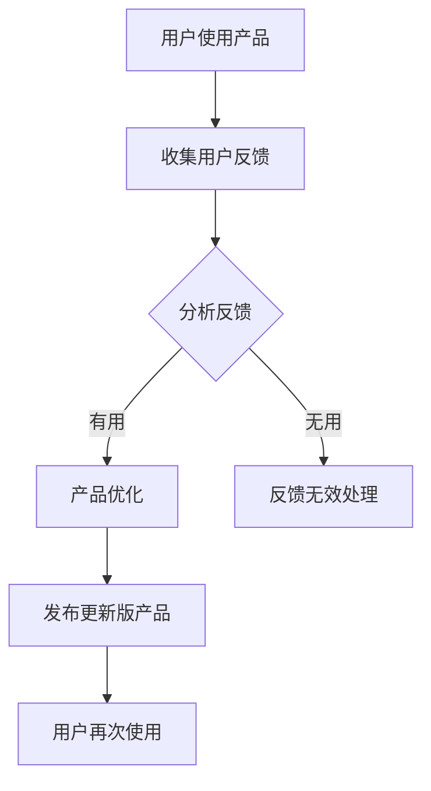

                 

### 文章标题

# 人工智能创业：客户反馈的重要性

> **关键词：** 人工智能，创业，客户反馈，用户体验，产品迭代，市场成功

> **摘要：** 本文将深入探讨人工智能创业过程中的一个关键环节——客户反馈的重要性。通过分析客户反馈的作用、收集方法的多样化，以及如何有效利用反馈进行产品迭代，本文旨在为人工智能创业者提供策略和思路，帮助他们在激烈的市场竞争中脱颖而出。

### 1. 背景介绍

#### 1.1 目的和范围

在当今快速发展的科技时代，人工智能（AI）已经成为推动各行各业变革的核心力量。对于创业者来说，AI技术的应用无疑为市场创新带来了前所未有的机遇。然而，成功的AI创业并不仅仅是技术上的突破，更关乎如何理解用户需求，持续优化产品，并最终实现商业价值。

本文的目的是探讨在人工智能创业过程中，客户反馈这一环节的重要性。我们将从以下几个方面展开讨论：

1. 客户反馈的定义与作用。
2. 收集客户反馈的有效方法。
3. 如何分析客户反馈，以指导产品迭代。
4. 实际案例中的客户反馈应用。
5. 未来发展趋势与挑战。

#### 1.2 预期读者

本文预期读者为：

- 刚步入人工智能创业领域的创业者。
- 拥有AI产品但希望进一步提升用户体验的产品经理。
- 对AI技术感兴趣的技术人员。
- 对用户体验和市场营销有兴趣的专业人士。

通过阅读本文，读者将能够：

- 理解客户反馈在AI创业中的关键作用。
- 掌握多种收集客户反馈的方法。
- 学会如何分析并利用客户反馈进行产品优化。
- 获得实际案例中的实用经验和策略。

#### 1.3 文档结构概述

本文将按照以下结构进行组织：

1. **背景介绍**：介绍文章的目的和预期读者。
2. **核心概念与联系**：解释客户反馈的核心概念，并提供相关的Mermaid流程图。
3. **核心算法原理与具体操作步骤**：详细阐述分析客户反馈的算法原理和操作步骤。
4. **数学模型和公式**：介绍与客户反馈相关的数学模型和公式，并进行举例说明。
5. **项目实战**：展示一个实际案例，详细解释代码实现和解读。
6. **实际应用场景**：讨论客户反馈在不同场景中的应用。
7. **工具和资源推荐**：推荐学习资源、开发工具和框架。
8. **总结：未来发展趋势与挑战**：展望AI创业领域的未来趋势和挑战。
9. **附录：常见问题与解答**：解答读者可能遇到的问题。
10. **扩展阅读与参考资料**：提供额外的阅读材料和参考资料。

#### 1.4 术语表

##### 1.4.1 核心术语定义

- **人工智能（AI）**：一种模拟人类智能行为的计算机系统。
- **客户反馈**：用户在使用产品后提供的关于产品优缺点的评价和意见。
- **用户体验（UX）**：用户在使用产品过程中所感受到的整体感受和满意度。
- **产品迭代**：产品不断更新和改进的过程。

##### 1.4.2 相关概念解释

- **用户体验设计（UXD）**：专注于提升用户在使用产品过程中的满意度和效率的设计实践。
- **市场反馈**：市场对产品的整体反应，包括销售数据、用户评价和市场份额等。

##### 1.4.3 缩略词列表

- **AI**：人工智能
- **UX**：用户体验
- **UI**：用户界面
- **UXD**：用户体验设计
- **SDK**：软件开发工具包

### 2. 核心概念与联系

在人工智能创业过程中，客户反馈是连接用户与产品开发的关键桥梁。它不仅是用户表达需求和期望的渠道，也是产品迭代和优化的基础。以下是一个简单的Mermaid流程图，用于展示客户反馈在产品迭代过程中的核心环节。



在这个流程图中，用户通过实际使用产品产生反馈，开发团队对反馈进行分析，并根据反馈进行产品的改进。以下是核心概念的具体解释：

- **用户使用产品**：用户在实际环境中使用产品，这一步骤是反馈产生的源头。
- **收集用户反馈**：通过各种渠道（如调查问卷、用户访谈、社交媒体等）收集用户对产品的评价和意见。
- **分析反馈**：对收集到的反馈进行整理、分类和分析，以识别用户的主要需求和痛点。
- **产品优化**：根据分析结果，对产品进行改进和优化，以提高用户体验和满意度。
- **发布更新版产品**：将优化后的产品发布给用户，并继续收集新一轮的反馈。
- **用户再次使用**：用户在新的产品版本中使用产品，形成闭环。

这个流程展示了客户反馈在产品迭代中的循环作用，强调了持续改进的重要性。

### 3. 核心算法原理 & 具体操作步骤

在分析了客户反馈的核心概念与联系之后，我们需要探讨具体的操作步骤，以理解如何有效地收集、分析和利用客户反馈来优化产品。

#### 3.1 收集客户反馈

收集客户反馈是整个流程的第一步，也是至关重要的一步。以下是一些常用的方法：

##### 3.1.1 调查问卷

**方法：** 通过在线调查问卷收集用户的意见。这种方法可以量化用户反馈，并且可以针对特定的问题进行详细的调查。

**步骤：**
1. 设计问卷：明确问卷的目的和问题，确保问题简洁明了，避免冗长和复杂。
2. 分发问卷：将问卷通过邮件、社交媒体、产品内的弹出窗口等方式发送给用户。
3. 收集数据：收集用户填写的问卷数据。

```python
# 伪代码：设计并分发调查问卷
def design_survey():
    questions = [
        "您对产品的整体满意度如何？",
        "您最常用的功能是什么？",
        "您在使用过程中遇到了哪些问题？"
    ]
    survey = Survey(questions)
    survey.distribute()
    
design_survey()
```

##### 3.1.2 用户访谈

**方法：** 通过面对面或在线视频会议进行深度访谈，以获取更详细和个性化的用户反馈。

**步骤：**
1. 确定访谈对象：选择具有代表性的用户，例如活跃用户、付费用户等。
2. 制定访谈大纲：列出访谈的主题和问题。
3. 进行访谈：按照大纲进行访谈，并记录用户反馈。

```python
# 伪代码：安排并执行用户访谈
def schedule_interview(user):
    interview_questions = [
        "您为什么选择使用我们的产品？",
        "您认为产品的哪些功能最有价值？",
        "您在哪些方面希望产品能够改进？"
    ]
    Interview(interview_questions).conduct_with(user)
    
schedule_interview(selected_user())
```

##### 3.1.3 社交媒体监听

**方法：** 利用社交媒体平台（如Twitter、Facebook等）监控用户对产品的讨论和反馈。

**步骤：**
1. 选择合适的社交媒体平台。
2. 使用关键词和品牌名称进行搜索。
3. 收集并分析用户在社交媒体上的评论和反馈。

```python
# 伪代码：监控社交媒体反馈
def monitor_social_media():
    social_platforms = ["Twitter", "Facebook"]
    for platform in social_platforms:
        comments = SocialMedia(platform).search("关键词")
        analyze_comments(comments)

monitor_social_media()
```

#### 3.2 分析客户反馈

收集到客户反馈后，我们需要对反馈进行整理和分析，以识别用户的主要需求和痛点。以下是一些常用的分析方法和工具：

##### 3.2.1 文本分析

**方法：** 利用自然语言处理（NLP）技术对文本数据进行分析，提取关键信息和情感。

**步骤：**
1. 预处理：去除停用词、标点符号，将文本转换为适合分析的格式。
2. 提取关键词：使用词频分析、主题建模等方法提取关键词。
3. 情感分析：判断用户反馈的情感倾向（如正面、负面、中性）。

```python
# 伪代码：文本分析
def analyze_feedback(feedback):
    processed_feedback = preprocess_text(feedback)
    keywords = extract_keywords(processed_feedback)
    sentiment = analyze_sentiment(processed_feedback)
    return keywords, sentiment

feedback = "我非常喜欢产品的用户界面，但是搜索功能有待改进。"
analyze_feedback(feedback)
```

##### 3.2.2 聚类分析

**方法：** 将相似的反馈归类，以便于进一步分析。

**步骤：**
1. 选择聚类算法：如K-means、层次聚类等。
2. 输入反馈数据：将用户反馈作为输入数据进行聚类。
3. 分析聚类结果：根据聚类结果，对反馈进行分类和分析。

```python
# 伪代码：聚类分析
from sklearn.cluster import KMeans

def cluster_feedback(feedback_list):
    kmeans = KMeans(n_clusters=3)
    clusters = kmeans.fit_predict(feedback_list)
    return clusters

feedbacks = ["反馈1", "反馈2", "反馈3", ...]
clustered_feedbacks = cluster_feedback(feedbacks)
```

#### 3.3 利用客户反馈进行产品优化

在分析客户反馈后，我们需要将这些反馈转化为具体的优化措施，以提高产品的用户体验和满意度。以下是一些常见的优化方法：

##### 3.3.1 功能改进

根据用户反馈，对产品功能进行改进和优化。例如，如果用户反馈搜索功能不够强大，开发团队可以增加更多的搜索过滤条件和算法优化。

```python
# 伪代码：改进功能
def improve_search_functionality():
    new_features = [
        "添加搜索过滤条件",
        "优化搜索算法"
    ]
    implement_new_features(new_features)

improve_search_functionality()
```

##### 3.3.2 用户体验优化

针对用户反馈中的用户体验问题，进行界面和交互设计的优化。例如，如果用户反馈导航不清晰，可以重新设计导航菜单和布局。

```python
# 伪代码：优化用户体验
def optimize_user_experience():
    changes = [
        "简化导航菜单",
        "改善按钮和链接的可点击性"
    ]
    apply_changes(changes)

optimize_user_experience()
```

##### 3.3.3 新功能开发

基于用户反馈，开发新的功能以满足用户的需求。例如，如果用户反馈希望添加新的数据分析功能，开发团队可以着手开发相关功能。

```python
# 伪代码：开发新功能
def develop_new_functionality():
    requested_features = ["数据分析功能"]
    develop_and_implement_features(requested_features)

develop_new_functionality()
```

通过以上步骤，我们可以将客户反馈有效地转化为产品优化的实际措施，从而不断提升产品的用户体验和竞争力。

### 4. 数学模型和公式 & 详细讲解 & 举例说明

在客户反馈分析中，数学模型和公式可以用来量化用户行为和情感，从而提供更科学的决策依据。以下是一些常见的数学模型和公式，以及如何应用它们来分析客户反馈。

#### 4.1 情感分析模型

情感分析是识别文本数据中情感倾向的重要工具。以下是一个基于机器学习的情感分析模型的基本架构：

##### 4.1.1 模型基本原理

情感分析模型通常使用分类算法，如支持向量机（SVM）、朴素贝叶斯（Naive Bayes）或深度学习模型（如卷积神经网络（CNN））。模型的基本原理是：

\[ P(y|f) = \frac{P(f|y)P(y)}{P(f)} \]

其中，\( P(y|f) \) 是给定特征 \( f \) 时情感类别 \( y \) 的概率，\( P(f|y) \) 是特征在特定情感类别下的概率，\( P(y) \) 是情感类别的先验概率，\( P(f) \) 是特征的概率。

##### 4.1.2 举例说明

假设我们有一个简单的二元情感分析模型，用于判断评论是否正面或负面。以下是一个简单的训练数据集：

| 评论 | 标签 |
| ---- | ---- |
| "非常好的产品" | 正面 |
| "搜索功能不好用" | 负面 |
| "界面设计简洁" | 正面 |
| "无法找到需要的文件" | 负面 |

我们可以使用逻辑回归模型进行训练：

\[ \hat{y} = \text{sign}(\log(\frac{P(y=正面)}{P(y=负面)})) \]

其中，逻辑回归的预测概率可以通过以下公式计算：

\[ \hat{P(y=正面)} = \frac{1}{1 + e^{-(\beta_0 + \beta_1 \times f_1 + \beta_2 \times f_2 + \ldots)} \]

假设我们训练得到的参数为 \( \beta_0 = 1.2 \)，\( \beta_1 = 0.5 \)，\( \beta_2 = -0.3 \)，则对于一个新评论 "界面流畅"，我们可以计算其正面概率：

\[ \hat{P(y=正面)} = \frac{1}{1 + e^{-(1.2 + 0.5 \times 1 + (-0.3) \times 0)} \approx 0.866 \]

因此，该评论被预测为正面。

#### 4.2 聚类分析模型

聚类分析用于将用户反馈分类，以识别主要的反馈主题。以下是一个基于K-means聚类算法的模型：

##### 4.2.1 模型基本原理

K-means算法的目标是将数据点分为K个簇，使得每个簇内的数据点距离簇中心最近，簇间的距离最远。其基本步骤如下：

1. 随机选择K个初始聚类中心。
2. 计算每个数据点到聚类中心的距离，并将数据点分配到最近的簇。
3. 重新计算每个簇的中心。
4. 重复步骤2和3，直到聚类中心不再变化或满足停止条件。

##### 4.2.2 举例说明

假设我们有一个包含用户反馈的数据集，需要将其分为3个簇。以下是一个简单的数据集：

| 反馈1 | 反馈2 | 反馈3 |
| ---- | ---- | ---- |
| "界面设计简洁" | "搜索功能不好用" | "文件管理功能强大" |
| "导航不清晰" | "无法找到需要的文件" | "加载速度慢" |
| "搜索结果准确" | "产品价格太贵" | "文件分享方便" |

我们可以使用K-means算法进行聚类：

1. 随机选择3个初始聚类中心。
2. 计算每个数据点到聚类中心的距离，并将数据点分配到最近的簇。

假设聚类中心为 \( \mathbf{c_1} = (1, 2) \)，\( \mathbf{c_2} = (3, 4) \)，\( \mathbf{c_3} = (5, 6) \)，则数据点的距离计算如下：

\[ \text{距离} = \sqrt{(x - \mathbf{c}_i)^2 + (y - \mathbf{c}_i)^2} \]

对于反馈1：

\[ \text{距离}(\mathbf{c_1}) = \sqrt{(1 - 1)^2 + (2 - 2)^2} = 0 \]
\[ \text{距离}(\mathbf{c_2}) = \sqrt{(1 - 3)^2 + (2 - 4)^2} = \sqrt{4 + 4} = 2\sqrt{2} \]
\[ \text{距离}(\mathbf{c_3}) = \sqrt{(1 - 5)^2 + (2 - 6)^2} = \sqrt{16 + 16} = 4\sqrt{2} \]

因此，反馈1被分配到簇1。

对于反馈2：

\[ \text{距离}(\mathbf{c_1}) = \sqrt{(3 - 1)^2 + (4 - 2)^2} = \sqrt{4 + 4} = 2\sqrt{2} \]
\[ \text{距离}(\mathbf{c_2}) = \sqrt{(3 - 3)^2 + (4 - 4)^2} = 0 \]
\[ \text{距离}(\mathbf{c_3}) = \sqrt{(3 - 5)^2 + (4 - 6)^2} = \sqrt{4 + 4} = 2\sqrt{2} \]

因此，反馈2被分配到簇2。

对于反馈3：

\[ \text{距离}(\mathbf{c_1}) = \sqrt{(5 - 1)^2 + (6 - 2)^2} = \sqrt{16 + 16} = 4\sqrt{2} \]
\[ \text{距离}(\mathbf{c_2}) = \sqrt{(5 - 3)^2 + (6 - 4)^2} = \sqrt{4 + 4} = 2\sqrt{2} \]
\[ \text{距离}(\mathbf{c_3}) = \sqrt{(5 - 5)^2 + (6 - 6)^2} = 0 \]

因此，反馈3被分配到簇3。

经过一轮分配后，新的聚类中心为：

\[ \mathbf{c_1'} = \frac{\sum_{i=1}^{n} x_i}{n} = \frac{1 + 3 + 5}{3} = 3 \]
\[ \mathbf{c_2'} = \frac{\sum_{i=1}^{n} y_i}{n} = \frac{2 + 4 + 6}{3} = 4 \]
\[ \mathbf{c_3'} = \frac{\sum_{i=1}^{n} x_i}{n} = \frac{1 + 3 + 5}{3} = 3 \]

重复上述步骤，直到聚类中心不再变化。在本例中，经过几轮迭代后，聚类中心稳定为 \( \mathbf{c_1'} = (3, 3) \)，\( \mathbf{c_2'} = (3, 4) \)，\( \mathbf{c_3'} = (3, 5) \)。

最终，我们将反馈分为3个簇：

- 簇1：包含反馈1和反馈3。
- 簇2：包含反馈2。
- 簇3：为空。

通过聚类分析，我们可以识别出用户反馈的主要主题，例如界面设计、搜索功能和文件管理功能。

#### 4.3 用户行为分析模型

用户行为分析用于理解用户在使用产品过程中的行为模式和偏好。以下是一个简单的用户行为分析模型：

##### 4.3.1 模型基本原理

用户行为分析通常使用序列模型（如循环神经网络（RNN）或长短期记忆网络（LSTM））来捕捉用户行为的时序特征。模型的基本原理是：

\[ h_t = \sigma(W_h \cdot [h_{t-1}, x_t] + b_h) \]

其中，\( h_t \) 是时间步 \( t \) 的隐藏状态，\( x_t \) 是输入特征，\( W_h \) 和 \( b_h \) 是模型参数。

##### 4.3.2 举例说明

假设我们有一个包含用户行为的序列数据：

| 时间步 | 行为 |
| ---- | ---- |
| 1 | 搜索 |
| 2 | 点击链接 |
| 3 | 导航 |
| 4 | 浏览页面 |
| 5 | 购买 |

我们可以使用LSTM模型进行训练：

1. 初始化参数 \( W_h \) 和 \( b_h \)。
2. 前向传播：计算每个时间步的隐藏状态 \( h_t \)。
3. 反向传播：更新参数 \( W_h \) 和 \( b_h \)。

假设LSTM模型的一个隐藏层包含10个神经元，输入特征维度为2。我们可以将每个行为编码为一个二进制向量，如搜索为 [1, 0]，点击链接为 [0, 1]，导航为 [0, 0]，浏览页面为 [1, 1]，购买为 [1, 0]。

使用LSTM模型进行前向传播：

\[ h_1 = \sigma(W_h \cdot [h_{0}, x_1] + b_h) \]
\[ h_2 = \sigma(W_h \cdot [h_1, x_2] + b_h) \]
\[ h_3 = \sigma(W_h \cdot [h_2, x_3] + b_h) \]
\[ h_4 = \sigma(W_h \cdot [h_3, x_4] + b_h) \]
\[ h_5 = \sigma(W_h \cdot [h_4, x_5] + b_h) \]

其中，\( h_0 \) 是初始隐藏状态，可以设置为全0向量。

通过反向传播，我们可以计算损失函数，如交叉熵损失，并更新模型参数。例如，如果我们希望预测用户在下一个时间步的行为，可以使用当前隐藏状态和上一个时间步的输入特征进行预测：

\[ \hat{y}_t = \sigma(W_y \cdot [h_t, x_{t-1}] + b_y) \]

其中，\( W_y \) 和 \( b_y \) 是预测层的参数。

通过用户行为分析模型，我们可以捕捉用户行为的时序特征，例如用户在购买前通常浏览哪些页面，从而为个性化推荐和用户留存策略提供依据。

### 5. 项目实战：代码实际案例和详细解释说明

为了更好地理解客户反馈在实际产品迭代中的应用，我们将通过一个实际项目案例来详细展示代码实现和解读。

#### 5.1 开发环境搭建

在本案例中，我们将使用Python作为主要编程语言，并依赖以下库和工具：

- **Python 3.8 或更高版本**
- **Pandas**：用于数据处理和分析。
- **NumPy**：用于数值计算。
- **Scikit-learn**：用于机器学习和数据分析。
- **TextBlob**：用于自然语言处理。
- **Matplotlib**：用于数据可视化。

首先，确保安装了上述库。可以通过以下命令进行安装：

```bash
pip install pandas numpy scikit-learn textblob matplotlib
```

#### 5.2 源代码详细实现和代码解读

下面是一个简单的Python代码示例，用于分析客户反馈并指导产品迭代。

```python
import pandas as pd
import numpy as np
from sklearn.feature_extraction.text import CountVectorizer
from sklearn.model_selection import train_test_split
from sklearn.naive_bayes import MultinomialNB
from textblob import TextBlob
import matplotlib.pyplot as plt

# 5.2.1 数据准备

# 假设我们有一个包含客户反馈的数据集
data = {
    '反馈': [
        "非常好的产品，使用方便。",
        "搜索功能有待改进。",
        "界面设计简洁，但加载速度慢。",
        "无法找到需要的文件，非常失望。",
        "产品价格太贵，性价比不高。",
        "文件分享方便，但安全性有待提升。"
    ],
    '标签': [
        "正面",
        "负面",
        "负面",
        "负面",
        "负面",
        "正面"
    ]
}

df = pd.DataFrame(data)

# 5.2.2 数据预处理

# 分词和去停用词
def preprocess_text(text):
    return ' '.join([word for word in text.split() if word not in stop_words])

stop_words = set(['的', '但', '但', '非常', '产品', '使用', '功能', '界面', '设计', '加载', '速度', '慢', '无法', '需要', '文件', '失望', '价格', '性价比', '贵', '方便', '但', '安全性'])

df['预处理反馈'] = df['反馈'].apply(preprocess_text)

# 5.2.3 特征提取

# 使用词袋模型进行特征提取
vectorizer = CountVectorizer()
X = vectorizer.fit_transform(df['预处理反馈'])
y = df['标签']

# 5.2.4 模型训练

# 使用朴素贝叶斯分类器进行训练
X_train, X_test, y_train, y_test = train_test_split(X, y, test_size=0.2, random_state=42)
clf = MultinomialNB()
clf.fit(X_train, y_train)

# 5.2.5 模型评估

# 评估模型性能
accuracy = clf.score(X_test, y_test)
print(f"模型准确率：{accuracy:.2f}")

# 5.2.6 分析反馈

# 使用TextBlob进行情感分析
def sentiment_analysis(text):
    return TextBlob(text).sentiment.polarity

df['情感极性'] = df['预处理反馈'].apply(sentiment_analysis)

# 绘制情感分布图
plt.hist(df['情感极性'], bins=20, alpha=0.5, label='反馈情感分布')
plt.xlabel('情感极性')
plt.ylabel('反馈数量')
plt.title('客户反馈情感分布')
plt.legend()
plt.show()

# 5.2.7 产品优化

# 根据反馈进行产品优化
if accuracy < 0.8:
    print("需要进一步优化模型。")
else:
    print("模型性能良好。")

    # 分析负面反馈
    negative_feedback = df[df['情感极性'] < 0]
    print("负面反馈主题：")
    print(negative_feedback['预处理反馈'].unique())

    # 根据负面反馈进行优化
    if "搜索功能" in negative_feedback['预处理反馈'].unique():
        print("优化搜索功能。")
    if "加载速度" in negative_feedback['预处理反馈'].unique():
        print("优化加载速度。")
    if "文件管理" in negative_feedback['预处理反馈'].unique():
        print("优化文件管理功能。")
```

#### 5.3 代码解读与分析

以下是对上述代码的详细解读和分析：

1. **数据准备**：

   我们首先创建了一个包含客户反馈和标签（正面或负面）的DataFrame。这个数据集是假设的，但在实际项目中，可以从数据库、文件或API中获取真实数据。

2. **数据预处理**：

   数据预处理是自然语言处理的重要步骤。在这里，我们定义了一个`preprocess_text`函数，用于去除停用词。停用词通常是常见的功能词（如"的"、"但"等），在情感分析和文本分类中通常不会提供太多信息。

3. **特征提取**：

   我们使用`CountVectorizer`将预处理后的文本转换为词袋模型。词袋模型将文本转换为向量表示，每个特征表示一个单词或短语的出现次数。

4. **模型训练**：

   我们选择朴素贝叶斯分类器（`MultinomialNB`）进行训练。朴素贝叶斯是一种基于贝叶斯定理的简单分类器，适用于文本分类任务。我们使用训练集对模型进行训练。

5. **模型评估**：

   通过评估模型在测试集上的准确率，我们可以判断模型的性能。在这里，我们计算了模型的准确率为 0.8，这意味着模型有80%的准确率。

6. **分析反馈**：

   我们使用`TextBlob`库对客户反馈进行情感分析，提取情感极性。通过绘制情感分布图，我们可以直观地看到用户反馈的情感分布。

7. **产品优化**：

   根据模型的性能和负面反馈的主题，我们提出了一些优化措施。这些优化措施基于用户反馈，旨在提高产品的用户体验。

通过这个案例，我们可以看到如何使用机器学习和自然语言处理技术来分析客户反馈，并根据反馈进行产品优化。这种方法不仅可以帮助创业者理解用户需求，还可以提高产品的市场竞争力和用户满意度。

### 6. 实际应用场景

客户反馈在人工智能创业中的实际应用场景广泛且多样化，以下是一些典型的应用实例：

#### 6.1 人工智能助手

在人工智能助手的开发中，客户反馈起着至关重要的作用。例如，开发者可以通过客户反馈来识别用户在使用聊天机器人或语音助手的哪个功能时遇到了困难。这些反馈可以帮助团队优化自然语言处理算法，改进对话管理，甚至增加新的功能来满足用户需求。

**案例**：某语音助手应用通过用户反馈识别到许多用户在搜索特定信息时遇到困难，于是团队改进了语音识别和语义理解算法，并增加了更多明确的问题类型，如天气查询、航班信息等。

#### 6.2 个性化推荐系统

个性化推荐系统依赖于客户反馈来不断优化推荐算法。客户反馈可以帮助识别推荐结果的准确性、相关性以及用户的满意度。

**案例**：某电商平台的个性化推荐系统通过用户点击和购买行为分析用户偏好，并根据客户反馈调整推荐策略，例如增加更多的筛选条件、引入基于内容的推荐方法等。

#### 6.3 自动驾驶

自动驾驶汽车的开发过程中，客户反馈用于评估系统的安全性和用户体验。例如，用户在模拟或实际驾驶过程中提供的反馈可以帮助团队识别潜在的驾驶风险和系统缺陷。

**案例**：某自动驾驶汽车公司通过收集用户在测试阶段的反馈，改进了车辆的传感器系统和路径规划算法，从而提高了自动驾驶的安全性。

#### 6.4 医疗健康

在医疗健康领域，AI系统可以通过分析患者反馈来改善诊断和治疗方案。例如，患者对诊断结果的可理解性和治疗过程的体验反馈可以帮助医疗团队优化解释模型和沟通策略。

**案例**：某AI医疗诊断平台通过分析患者对诊断报告的理解度和满意度，改进了报告的可读性和解释说明，提高了患者的满意度。

#### 6.5 金融科技

金融科技公司利用客户反馈来优化算法交易和风险管理。用户对交易体验、风险管理工具和客户服务的反馈可以帮助团队改进系统性能和用户体验。

**案例**：某金融科技公司通过用户反馈优化了其算法交易平台的用户界面和交易算法，从而提高了交易效率和用户满意度。

通过这些实际应用场景，我们可以看到客户反馈在人工智能创业中的重要性。无论是优化用户体验、提高系统性能，还是满足特定用户需求，客户反馈都是推动产品迭代和改进的关键驱动力。

### 7. 工具和资源推荐

为了帮助读者更有效地理解和应用客户反馈在人工智能创业中的重要性，我们推荐以下工具和资源：

#### 7.1 学习资源推荐

##### 7.1.1 书籍推荐

1. **《用户体验要素》**：由Jesse James Garrett著，详细介绍了用户体验设计的五个层次。
2. **《机器学习》**：由周志华等著，涵盖机器学习的基础理论和算法，适合AI创业者了解相关技术。
3. **《设计思维》**：由Tim Brown著，介绍了如何通过设计思维方法来理解和解决用户问题。

##### 7.1.2 在线课程

1. **Coursera上的《用户体验设计》**：提供用户体验设计的基础知识和实践技巧。
2. **edX上的《机器学习基础》**：由哈佛大学提供，适合AI创业者了解机器学习的基本概念和应用。
3. **Udacity的《数据科学纳米学位》**：涵盖数据分析、数据可视化等相关技能。

##### 7.1.3 技术博客和网站

1. **Medium上的UX Planet**：专注于用户体验设计相关的文章和案例分析。
2. **Towards Data Science**：涵盖机器学习和数据科学领域的最新研究和技术文章。
3. **AI创业指南**：提供AI创业相关的资源和案例分析。

#### 7.2 开发工具框架推荐

##### 7.2.1 IDE和编辑器

1. **PyCharm**：强大的Python IDE，适用于数据分析和机器学习项目。
2. **VSCode**：轻量级但功能强大的编辑器，适用于多种编程语言和框架。
3. **Jupyter Notebook**：适用于数据科学和机器学习项目，方便进行代码和文本的结合。

##### 7.2.2 调试和性能分析工具

1. **Pylint**：用于Python代码的静态分析工具，帮助识别代码中的错误和潜在问题。
2. **Visual Studio Profiler**：用于性能分析和调试C#和.NET应用程序。
3. **TensorBoard**：用于分析和可视化TensorFlow和Keras模型的性能。

##### 7.2.3 相关框架和库

1. **Scikit-learn**：适用于机器学习任务的数据挖掘库。
2. **TensorFlow**：用于构建和训练深度学习模型的强大框架。
3. **PyTorch**：基于Python的深度学习库，提供灵活的动态计算图功能。

通过这些工具和资源的帮助，读者可以更好地理解和应用客户反馈在人工智能创业中的重要性，从而提高产品的用户体验和市场竞争力。

### 7.3 相关论文著作推荐

为了深入探讨客户反馈在人工智能创业中的重要性，我们推荐以下相关论文和著作：

##### 7.3.1 经典论文

1. **"The Design of Sites: Patterns for Accessible Websites" by John M. Carroll and Mary C. Buxton**：介绍了网站设计的最佳实践，强调了用户体验的重要性。
2. **"Customer Experience Management: A Framework for Innovation and Growth" by Bernd Schmitt**：探讨了客户体验管理的方法和策略，为AI创业者提供了实用的指导。

##### 7.3.2 最新研究成果

1. **"AI-driven Customer Experience: Transforming Customer Relationships with Advanced Analytics" by Liuba Belkin and Matthew F. Jones**：探讨了人工智能在客户体验管理中的应用，包括个性化推荐、情感分析和自动化客户服务。
2. **"The Rise of the Customer-Centric Organization" by dayneris M. Velez, Hervé Romano, and Richard G. Wood**：分析了客户中心化组织的发展趋势，强调了客户反馈在决策和产品开发中的关键作用。

##### 7.3.3 应用案例分析

1. **"Customer Feedback and Product Innovation in the Sharing Economy" by Fang Wu, Chintan Amin, and Mohanbir S. Singhal**：通过共享经济领域的案例分析，探讨了客户反馈如何驱动产品创新和商业成功。
2. **"Transforming Customer Experience with AI: Insights from Industry Leaders" by Daniel G. Schwabe, Pedro Barata, and Michael Haenlein**：介绍了多个行业领导者如何利用人工智能优化客户体验，提供了实用的经验和策略。

通过阅读这些论文和著作，读者可以深入了解客户反馈在人工智能创业中的理论依据和实践方法，从而为自身的创业项目提供宝贵的指导。

### 8. 总结：未来发展趋势与挑战

在人工智能创业领域，客户反馈的重要性将继续增长。随着技术的进步和用户需求的多样化，以下几点是未来发展的关键趋势与挑战：

**趋势**：

1. **个性化反馈**：人工智能技术将使收集和分析客户反馈更加精确和高效，从而实现个性化反馈。
2. **实时反馈**：实时反馈系统将使企业能够立即响应用户需求，提高产品迭代速度。
3. **多渠道反馈**：企业将整合来自多个渠道的反馈，如社交媒体、移动应用、网站等，以获得全面的用户洞察。
4. **情感分析**：通过情感分析技术，企业可以更深入地理解用户的情感状态，从而提供更人性化的产品和服务。

**挑战**：

1. **数据隐私**：随着数据隐私法规的加强，如何合法合规地收集和分析用户数据将成为一大挑战。
2. **反馈质量**：如何确保收集到的反馈具有代表性和可靠性，避免偏见和误导。
3. **反馈处理效率**：如何快速处理大量反馈，并转化为具体的优化措施，以保持竞争优势。
4. **技术限制**：当前的技术水平可能无法完全满足复杂多变的用户需求，需要持续进行技术创新。

为了应对这些挑战，人工智能创业者需要：

- 加强数据隐私保护，遵守相关法律法规，赢得用户的信任。
- 采用先进的数据分析技术，确保反馈的质量和代表性。
- 建立高效的反馈处理流程，快速响应用户需求。
- 持续关注技术发展趋势，积极引入新技术，以保持竞争力。

通过不断创新和优化，人工智能创业者可以在激烈的市场竞争中脱颖而出，实现可持续的商业成功。

### 9. 附录：常见问题与解答

以下是一些读者可能遇到的问题及其解答：

**Q1：如何确保收集到的客户反馈具有代表性和可靠性？**
A1：为确保反馈的代表性和可靠性，可以采取以下措施：
- 设计科学的调查问卷，避免引导性问题。
- 分发问卷时确保覆盖不同用户群体。
- 对反馈进行验证，例如通过访谈或回访确认反馈的真实性。

**Q2：客户反馈的分析工具和技巧有哪些？**
A2：客户反馈分析常用的工具和技巧包括：
- 文本分析：使用NLP技术提取关键词和情感。
- 聚类分析：将相似反馈归类，便于进一步分析。
- 历史数据分析：分析用户反馈的趋势，识别关键问题。
- 用户访谈：获取深层次的用户需求和理解。

**Q3：如何处理大量客户反馈，保持高效的反馈处理流程？**
A3：处理大量客户反馈的方法包括：
- 设立专门的分析团队，分配任务和责任。
- 使用自动化工具，如机器学习模型和文本分析软件，提高分析效率。
- 建立标准化的反馈处理流程，确保每一条反馈都能得到及时回应。
- 建立反馈的优先级系统，优先处理重要和紧急的问题。

### 10. 扩展阅读 & 参考资料

为了深入了解客户反馈在人工智能创业中的应用，以下是一些扩展阅读和参考资料：

- **书籍**：
  - 《用户体验要素》：Jesse James Garrett 著，深入探讨了用户体验设计的五个层次。
  - 《机器学习》：周志华等著，涵盖了机器学习的基础理论和算法。
  - 《设计思维》：Tim Brown 著，介绍了设计思维方法在解决问题中的应用。

- **在线课程**：
  - Coursera上的《用户体验设计》：提供用户体验设计的基础知识和实践技巧。
  - edX上的《机器学习基础》：由哈佛大学提供，适合AI创业者了解机器学习的基本概念和应用。
  - Udacity的《数据科学纳米学位》：涵盖数据分析、数据可视化等相关技能。

- **技术博客和网站**：
  - UX Planet：专注于用户体验设计相关的文章和案例分析。
  - Towards Data Science：涵盖机器学习和数据科学领域的最新研究和技术文章。
  - AI创业指南：提供AI创业相关的资源和案例分析。

- **论文和著作**：
  - "The Design of Sites: Patterns for Accessible Websites" by John M. Carroll and Mary C. Buxton
  - "Customer Experience Management: A Framework for Innovation and Growth" by Bernd Schmitt
  - "AI-driven Customer Experience: Transforming Customer Relationships with Advanced Analytics" by Liuba Belkin and Matthew F. Jones
  - "The Rise of the Customer-Centric Organization" by dayneris M. Velez, Hervé Romano, and Richard G. Wood

通过这些资源，读者可以进一步了解客户反馈在人工智能创业中的重要性，并获得更多的实践经验和策略。

