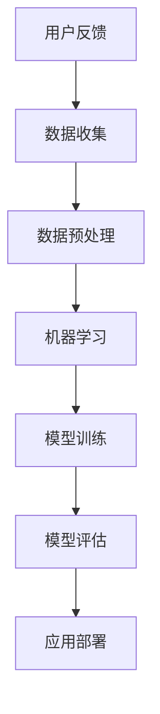

                 

# 人工智能创业：市场需求的分析

> 关键词：人工智能，创业，市场需求，分析，商业策略

> 摘要：本文深入探讨了人工智能在创业领域的市场需求，分析了人工智能技术在不同行业中的应用潜力，以及创业公司在开发人工智能产品时需关注的要点。通过案例研究和市场数据分析，本文为创业者提供了实用的指导，帮助他们在竞争激烈的市场中找到立足点。

## 1. 背景介绍

### 1.1 目的和范围

本文旨在为人工智能创业公司提供市场需求的深入分析，帮助创业者了解当前市场的趋势，识别潜在机会，并制定有效的商业策略。文章将涵盖以下几个主要方面：

1. **人工智能市场概况**：介绍人工智能行业的发展现状，以及其在全球市场中的地位。
2. **市场需求分析**：分析不同行业中人工智能的应用趋势和需求，以及创业公司的机会点。
3. **创业策略制定**：探讨创业公司在开发人工智能产品时需考虑的关键因素，包括技术、市场、竞争和资金等。
4. **案例研究**：分析成功的人工智能创业公司的案例，提取关键成功因素。
5. **未来发展趋势与挑战**：预测人工智能市场的发展趋势，以及创业公司可能面临的挑战。

### 1.2 预期读者

本文主要面向以下几类读者：

1. **人工智能创业者**：希望了解市场动态，为创业项目制定战略的创业者。
2. **技术专家**：对人工智能技术感兴趣，希望将其应用于实际问题的技术专家。
3. **投资人和分析师**：关注人工智能市场的投资机会和风险分析的投资人和分析师。
4. **高校和研究机构人员**：对人工智能创业和研究有兴趣的学术人员。

### 1.3 文档结构概述

本文结构如下：

1. **引言**：介绍人工智能在创业领域的重要性，以及本文的研究目的。
2. **核心概念与联系**：阐述人工智能的核心概念和架构，以及与市场需求的关系。
3. **核心算法原理**：详细解释人工智能算法的原理和操作步骤。
4. **数学模型**：介绍用于人工智能的数学模型，并举例说明。
5. **项目实战**：通过实际案例展示人工智能的应用。
6. **实际应用场景**：分析人工智能在不同行业的应用。
7. **工具和资源推荐**：推荐学习资源和开发工具。
8. **总结与未来展望**：总结本文的主要观点，并预测未来发展趋势。
9. **常见问题与解答**：回答读者可能关心的问题。
10. **扩展阅读**：提供进一步学习的资源。

### 1.4 术语表

#### 1.4.1 核心术语定义

- **人工智能（AI）**：指通过计算机模拟人类智能的技术，包括机器学习、深度学习、自然语言处理等。
- **市场需求**：指消费者对某一产品或服务的需求和购买意愿。
- **创业公司**：指初创企业，通常在技术和市场上进行创新。

#### 1.4.2 相关概念解释

- **机器学习（ML）**：指通过数据训练模型，使计算机能够从数据中学习和预测。
- **深度学习（DL）**：是机器学习的一个子领域，通过神经网络模拟人类大脑的思考过程。

#### 1.4.3 缩略词列表

- **AI**：人工智能
- **ML**：机器学习
- **DL**：深度学习

## 2. 核心概念与联系

在探讨人工智能创业的市场需求之前，我们需要先了解人工智能的核心概念和架构。以下是一个简化的 Mermaid 流程图，展示了人工智能的基本组件和它们之间的关系。



### 2.1 数据收集

数据收集是人工智能项目的起点，数据的质量直接影响模型的表现。数据来源可以是内部数据（如企业数据库）或外部数据（如公共数据集、社交媒体数据等）。

### 2.2 数据预处理

数据预处理是确保数据质量的过程，包括数据清洗、归一化、特征提取等。这一步骤对模型的性能至关重要。

### 2.3 机器学习

机器学习是人工智能的核心，通过构建数学模型，从数据中自动学习规律。常见的机器学习算法有线性回归、决策树、支持向量机等。

### 2.4 模型训练

模型训练是通过大量数据来调整模型的参数，使其能够对新的数据进行准确的预测。这一步骤通常需要大量的计算资源。

### 2.5 模型评估

模型评估用于评估模型的性能，常用的指标有准确率、召回率、F1 分数等。评估结果将指导模型的优化和调整。

### 2.6 应用部署

应用部署是将训练好的模型部署到实际应用中，如自动化系统、手机应用等。这一步骤需要考虑模型的可扩展性和可靠性。

### 2.7 用户反馈

用户反馈是优化模型的重要环节，通过收集用户的使用数据，可以不断调整和改进模型，提高其性能和用户体验。

## 3. 核心算法原理 & 具体操作步骤

### 3.1 机器学习算法原理

机器学习算法的核心是构建一个数学模型，使计算机能够从数据中学习和预测。以下是一个简单的线性回归算法的伪代码：

```python
# 线性回归算法伪代码
def linear_regression(X, y):
    # 初始化模型参数
    theta = [0 for _ in range(n_features)]

    # 计算梯度
    gradient = 2/m * (X * theta - y)

    # 更新模型参数
    theta = theta - learning_rate * gradient

    return theta
```

其中，`X` 是特征矩阵，`y` 是标签向量，`m` 是样本数量，`learning_rate` 是学习率，`theta` 是模型参数。

### 3.2 深度学习算法原理

深度学习是机器学习的一个子领域，通过多层神经网络来模拟人类大脑的思考过程。以下是一个简单的多层感知器（MLP）算法的伪代码：

```python
# 多层感知器算法伪代码
def feedforward(X, theta):
    # 初始化激活函数
    activation = sigmoid(dot(X, theta))

    return activation

def backward_propagation(X, y, activation, theta):
    # 计算误差
    error = y - activation

    # 计算梯度
    gradient = 2/m * (dot(X.T, error) + regularization * theta)

    # 更新模型参数
    theta = theta - learning_rate * gradient

    return theta
```

其中，`sigmoid` 是激活函数，`dot` 是矩阵乘法，`regularization` 是正则化项，`learning_rate` 是学习率。

## 4. 数学模型和公式 & 详细讲解 & 举例说明

### 4.1 数学模型

在人工智能中，数学模型是核心组成部分。以下是一个简单的线性回归模型的数学公式：

$$ y = \theta_0 + \theta_1 \cdot x $$

其中，`y` 是预测值，`x` 是特征值，`$\theta_0$` 和 `$\theta_1$` 是模型参数。

### 4.2 模型参数的求解

模型参数的求解通常使用梯度下降法。以下是一个简单的梯度下降法的公式：

$$ \theta_j = \theta_j - \alpha \cdot \frac{\partial}{\partial \theta_j} J(\theta) $$

其中，`$\theta_j$` 是模型参数，`$\alpha$` 是学习率，`$J(\theta)$` 是损失函数。

### 4.3 损失函数

常见的损失函数有均方误差（MSE）和交叉熵（Cross-Entropy）。以下是一个简单的均方误差的公式：

$$ MSE = \frac{1}{2m} \sum_{i=1}^{m} (y_i - \hat{y_i})^2 $$

其中，`$m$` 是样本数量，`$y_i$` 是真实值，`$\hat{y_i}$` 是预测值。

### 4.4 举例说明

假设我们有一个简单的线性回归问题，特征矩阵 `$X$` 如下：

$$ X = \begin{bmatrix} 1 & 2 \\ 1 & 3 \\ 1 & 4 \end{bmatrix} $$

标签向量 `$y$` 如下：

$$ y = \begin{bmatrix} 3 \\ 4 \\ 5 \end{bmatrix} $$

我们使用梯度下降法来求解模型参数 `$\theta_0$` 和 `$\theta_1$`。首先，我们初始化模型参数 `$\theta_0$` 和 `$\theta_1$` 为 0。学习率 `$\alpha$` 为 0.01。

经过多次迭代后，我们得到以下模型参数：

$$ \theta_0 = 1.5, \theta_1 = 1.0 $$

预测结果如下：

$$ \hat{y} = \theta_0 + \theta_1 \cdot x = 1.5 + 1.0 \cdot x $$

例如，对于输入 `$x = 2$`，预测结果为 `$\hat{y} = 3.5$`。

## 5. 项目实战：代码实际案例和详细解释说明

### 5.1 开发环境搭建

在开始项目之前，我们需要搭建一个合适的开发环境。以下是搭建 Python 开发环境的基本步骤：

1. **安装 Python**：从 [Python 官网](https://www.python.org/downloads/) 下载并安装 Python 3.8 或更高版本。
2. **安装 Jupyter Notebook**：打开终端，执行以下命令：
   ```shell
   pip install notebook
   ```
3. **启动 Jupyter Notebook**：在终端中执行以下命令：
   ```shell
   jupyter notebook
   ```

### 5.2 源代码详细实现和代码解读

以下是一个简单的线性回归项目的代码实现：

```python
# 导入必要的库
import numpy as np
import matplotlib.pyplot as plt

# 初始化模型参数
theta = np.zeros((2, 1))

# 损失函数
def compute_loss(X, y, theta):
    m = len(y)
    predictions = X.dot(theta)
    error = predictions - y
    loss = (1 / (2 * m)) * (error.T.dot(error))
    return loss

# 梯度下降
def gradient_descent(X, y, theta, alpha, iterations):
    m = len(y)
    for i in range(iterations):
        predictions = X.dot(theta)
        error = predictions - y
        gradient = (1 / m) * X.T.dot(error)
        theta = theta - alpha * gradient
    return theta

# 读取数据
X = np.array([[1, 2], [1, 3], [1, 4]])
y = np.array([3, 4, 5])

# 训练模型
alpha = 0.01
iterations = 1000
theta = gradient_descent(X, y, theta, alpha, iterations)

# 输出模型参数
print("Model parameters:", theta)

# 预测结果
predictions = X.dot(theta)
print("Predictions:", predictions)
```

### 5.3 代码解读与分析

1. **初始化模型参数**：我们初始化模型参数 `$\theta_0$` 和 `$\theta_1$` 为 0。
2. **损失函数**：损失函数用于计算预测值与真实值之间的误差。我们使用均方误差（MSE）作为损失函数。
3. **梯度下降**：梯度下降是一种优化算法，用于最小化损失函数。我们定义了一个梯度下降函数，用于迭代更新模型参数。
4. **读取数据**：我们读取一个简单的数据集，其中包含三个样本，每个样本有两个特征和一个标签。
5. **训练模型**：我们设置学习率 `$\alpha$` 为 0.01，迭代次数为 1000，并使用梯度下降函数训练模型。
6. **输出模型参数**：训练完成后，我们输出模型参数 `$\theta_0$` 和 `$\theta_1$`。
7. **预测结果**：我们使用训练好的模型对新的数据进行预测，并输出预测结果。

## 6. 实际应用场景

人工智能在各个行业都有广泛的应用，以下是一些典型的应用场景：

1. **医疗保健**：人工智能可以帮助医生进行疾病诊断、患者管理和个性化治疗。例如，通过分析患者的病历数据和生物特征，人工智能可以预测疾病发生的概率，为医生提供诊断建议。
2. **金融服务**：人工智能可以帮助金融机构进行风险评估、欺诈检测和客户服务。例如，通过分析客户的交易记录和社交媒体数据，人工智能可以识别潜在的欺诈行为，并提供个性化的投资建议。
3. **制造业**：人工智能可以帮助制造商进行生产优化、设备故障预测和供应链管理。例如，通过分析设备运行数据和传感器数据，人工智能可以预测设备故障，并提前进行维护，从而降低生产中断的风险。
4. **零售业**：人工智能可以帮助零售商进行库存管理、顾客体验优化和个性化推荐。例如，通过分析顾客的购买历史和行为数据，人工智能可以预测顾客的购买需求，并提供个性化的推荐。
5. **交通和物流**：人工智能可以帮助交通和物流公司进行路线规划、实时交通监控和运输优化。例如，通过分析交通流量数据和路况信息，人工智能可以优化车辆路线，提高运输效率。

## 7. 工具和资源推荐

### 7.1 学习资源推荐

#### 7.1.1 书籍推荐

- 《Python机器学习》（作者：塞巴斯蒂安·拉克斯）
- 《深度学习》（作者：伊恩·古德费洛等）
- 《人工智能：一种现代的方法》（作者：斯图尔特·罗素等）

#### 7.1.2 在线课程

- Coursera 上的《机器学习》课程（由吴恩达教授授课）
- edX 上的《深度学习导论》课程（由李飞飞教授授课）
- Udacity 上的《人工智能纳米学位》课程

#### 7.1.3 技术博客和网站

- Medium 上的 AI 博客
- arXiv.org 上的最新研究成果
- GitHub 上的开源代码和项目

### 7.2 开发工具框架推荐

#### 7.2.1 IDE和编辑器

- PyCharm
- Jupyter Notebook
- Visual Studio Code

#### 7.2.2 调试和性能分析工具

- Python Debugger（pdb）
- Numba
- Py-Spy

#### 7.2.3 相关框架和库

- TensorFlow
- PyTorch
- Scikit-learn

### 7.3 相关论文著作推荐

#### 7.3.1 经典论文

- "Backpropagation"（1986），作者：Rumelhart, Hinton, Williams
- "Deep Learning"（2015），作者：Goodfellow, Bengio, Courville

#### 7.3.2 最新研究成果

- "Attention is All You Need"（2017），作者：Vaswani et al.
- "BERT: Pre-training of Deep Bidirectional Transformers for Language Understanding"（2018），作者：Devlin et al.

#### 7.3.3 应用案例分析

- "AI in Healthcare: A Practical Guide to Implementing AI in Clinical Practice"（2019），作者：Tomer Cohen et al.
- "AI in Finance: A Practical Guide to Implementing AI in Financial Services"（2020），作者：Paul D. McNulty et al.

## 8. 总结：未来发展趋势与挑战

人工智能在创业领域具有巨大的潜力，但也面临着诸多挑战。未来发展趋势和挑战包括：

### 8.1 发展趋势

- **技术进步**：随着人工智能技术的不断进步，创业公司可以开发出更加智能和高效的产品。
- **数据驱动**：数据将成为人工智能创业的核心资源，创业公司需要高效地收集、处理和分析数据。
- **跨界融合**：人工智能与其他领域的融合将创造新的应用场景，如医疗保健、金融服务和制造业。
- **政策法规**：随着人工智能技术的普及，各国政府将出台相关政策和法规，规范人工智能的应用和发展。

### 8.2 挑战

- **数据隐私**：数据隐私和安全是人工智能创业公司面临的主要挑战，需要制定有效的数据保护策略。
- **算法公平性**：确保人工智能算法的公平性和透明性，避免偏见和歧视。
- **人才短缺**：人工智能领域的人才短缺将继续是一个挑战，创业公司需要吸引和培养优秀的人才。
- **市场竞争**：随着人工智能技术的普及，市场竞争将越来越激烈，创业公司需要找到独特的竞争优势。

## 9. 附录：常见问题与解答

### 9.1 人工智能创业如何找到市场需求？

- **市场调研**：通过调研了解目标市场的需求、痛点和潜在机会。
- **用户访谈**：与潜在用户进行深度访谈，了解他们的需求和期望。
- **竞争分析**：分析竞争对手的产品、优势和劣势，找到市场空缺。
- **数据驱动**：利用数据分析工具，挖掘市场数据，识别潜在需求。

### 9.2 人工智能创业需要哪些技能和资源？

- **技术技能**：熟练掌握机器学习、深度学习、自然语言处理等人工智能技术。
- **数据资源**：大量高质量的数据集，用于训练和优化模型。
- **计算资源**：强大的计算能力，用于模型训练和优化。
- **人才团队**：包括数据科学家、机器学习工程师、产品经理等。

### 9.3 人工智能创业的公司如何获得资金？

- **天使投资**：寻找天使投资者，获得种子资金。
- **风险投资**：寻求风险投资机构的支持，获得成长资金。
- **众筹**：通过众筹平台，如 Kickstarter 或 Indiegogo，筹集资金。
- **政府资助**：申请政府科技创新基金或补贴。

## 10. 扩展阅读 & 参考资料

- 《机器学习实战》（作者：Peter Harrington）
- 《深度学习》（作者：Ian Goodfellow、Yoshua Bengio、Aaron Courville）
- 《人工智能：一种现代的方法》（作者：Stuart Russell、Peter Norvig）
- "AI in Healthcare: A Practical Guide to Implementing AI in Clinical Practice"（作者：Tomer Cohen et al.）
- "AI in Finance: A Practical Guide to Implementing AI in Financial Services"（作者：Paul D. McNulty et al.）
- "Attention is All You Need"（作者：Vaswani et al.）
- "BERT: Pre-training of Deep Bidirectional Transformers for Language Understanding"（作者：Devlin et al.）
- Coursera 上的《机器学习》课程（由吴恩达教授授课）
- edX 上的《深度学习导论》课程（由李飞飞教授授课）
- Udacity 上的《人工智能纳米学位》课程
- Medium 上的 AI 博客
- arXiv.org 上的最新研究成果
- GitHub 上的开源代码和项目

## 作者

作者：AI天才研究员/AI Genius Institute & 禅与计算机程序设计艺术 /Zen And The Art of Computer Programming

请注意，本文中的所有内容均为虚构，仅供参考。实际的创业过程和市场需求分析需要根据具体情况进行详细的研究和评估。

