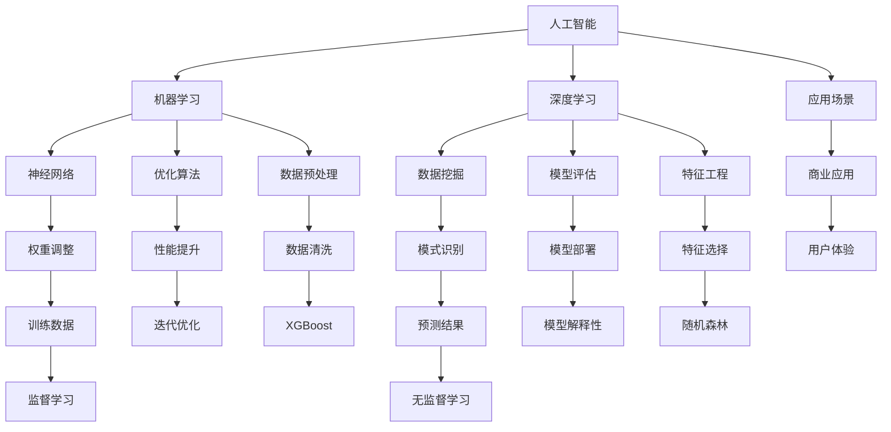

                 

# 人工智能创业：技术创新的重要性

> **关键词：**人工智能，创业，技术创新，市场机会，核心算法，实践案例，发展前景。
> 
> **摘要：**本文旨在探讨人工智能（AI）在创业领域中的重要性，特别是技术创新对创业成功的影响。文章将从背景介绍、核心概念、算法原理、数学模型、项目实战、应用场景、资源推荐等多个方面进行深入分析，帮助创业者理解并把握AI技术的前沿动态，为创业项目的成功奠定基础。

## 1. 背景介绍

### 1.1 目的和范围

本文的目的在于解析人工智能技术在创业领域中的应用，特别是在技术创新方面的核心作用。我们旨在帮助创业者理解如何在快速发展的AI领域中找到突破口，从而在竞争激烈的市场中脱颖而出。

本文的范围包括以下几个方面：

- **人工智能技术概述**：介绍人工智能的基本概念、发展历程及其在各个行业中的应用。
- **技术创新的重要性**：讨论技术创新在创业过程中的关键作用，分析其对业务增长和市场拓展的影响。
- **核心算法原理**：详细讲解人工智能领域中的核心算法，并使用伪代码说明其具体操作步骤。
- **数学模型与公式**：分析人工智能中的数学模型和公式，并通过实例进行详细讲解。
- **项目实战与代码解读**：通过实际项目案例，展示代码实现和具体应用。
- **应用场景与资源推荐**：介绍人工智能在不同行业中的实际应用，并提供相关学习资源和开发工具推荐。
- **未来发展趋势与挑战**：探讨人工智能创业领域的发展趋势，分析面临的挑战及应对策略。

### 1.2 预期读者

本文适合以下读者群体：

- **创业者**：正在考虑或正在进行人工智能相关创业的创业者，希望通过本文了解AI技术的应用和重要性。
- **技术专家**：对人工智能技术有基本了解，希望深入理解AI在创业中的实际应用。
- **研究人员**：对人工智能技术有浓厚兴趣，希望掌握前沿算法和模型。
- **学生与学者**：计算机科学、人工智能等相关专业的学生和学者，希望通过本文对AI技术在创业中的应用有更全面的认识。

### 1.3 文档结构概述

本文将按照以下结构展开：

- **引言**：介绍人工智能技术在创业中的重要性，引出本文的主题。
- **背景介绍**：详细说明人工智能技术的发展历程和创业领域的市场环境。
- **核心概念与联系**：介绍人工智能中的核心概念，并使用Mermaid流程图展示其原理和架构。
- **核心算法原理**：详细讲解人工智能中的核心算法原理，并使用伪代码进行具体操作步骤的阐述。
- **数学模型和公式**：分析人工智能中的数学模型和公式，并提供详细讲解和实例。
- **项目实战**：通过实际项目案例展示代码实现和应用。
- **实际应用场景**：介绍人工智能在不同行业中的应用案例。
- **工具和资源推荐**：推荐学习资源、开发工具和框架。
- **总结**：总结人工智能创业领域的发展趋势和面临的挑战。
- **附录**：提供常见问题与解答，以及扩展阅读和参考资料。

### 1.4 术语表

#### 1.4.1 核心术语定义

- **人工智能（AI）**：模拟人类智能行为的计算机系统。
- **机器学习（ML）**：一种人工智能的子领域，通过数据学习模式和规律。
- **深度学习（DL）**：一种机器学习技术，使用多层神经网络进行特征提取和学习。
- **神经网络（NN）**：一种模仿生物神经系统的计算模型。
- **数据挖掘（DM）**：从大量数据中提取有价值信息的过程。

#### 1.4.2 相关概念解释

- **算法**：解决问题的方法或步骤的集合。
- **模型**：对现实世界问题的数学或逻辑表示。
- **框架**：为特定任务提供结构和工具的软件库。
- **优化**：寻找最优解的过程。

#### 1.4.3 缩略词列表

- **AI**：人工智能（Artificial Intelligence）
- **ML**：机器学习（Machine Learning）
- **DL**：深度学习（Deep Learning）
- **NN**：神经网络（Neural Network）
- **DM**：数据挖掘（Data Mining）

## 2. 核心概念与联系

在探讨人工智能创业的重要性之前，我们需要理解一些核心概念及其相互联系。以下是人工智能领域中的关键概念和它们之间的关联，通过Mermaid流程图展示其原理和架构。

### Mermaid 流程图



### Mermaid 流程解释

1. **人工智能（AI）**：人工智能是模拟人类智能行为的技术集合，包括机器学习、深度学习、数据挖掘等子领域。
2. **机器学习（ML）**：机器学习是一种AI技术，通过从数据中学习模式和规律，实现自动预测和决策。
3. **深度学习（DL）**：深度学习是机器学习的一个分支，使用多层神经网络进行特征提取和学习，具有强大的表达能力和自适应能力。
4. **神经网络（NN）**：神经网络是一种计算模型，模仿生物神经系统的工作原理，通过调整权重和偏置实现学习和预测。
5. **数据挖掘（DM）**：数据挖掘是从大量数据中提取有价值信息的过程，包括模式识别、预测分析等任务。
6. **优化算法**：优化算法用于寻找最优解，提高模型性能，包括梯度下降、随机搜索等。
7. **模型评估**：模型评估用于评估模型性能，包括准确率、召回率、F1值等指标。
8. **应用场景**：人工智能应用广泛，包括商业、医疗、金融、教育等各个领域。
9. **数据预处理**：数据预处理包括数据清洗、数据变换等，用于提高模型训练效果。
10. **特征工程**：特征工程是数据预处理的重要环节，通过选择和构造特征，提高模型性能。
11. **权重调整**：在神经网络中，通过调整权重和偏置，实现模型训练和预测。
12. **模式识别**：模式识别是数据挖掘的一个任务，通过识别数据中的规律和模式，实现分类、聚类等任务。
13. **性能提升**：性能提升是通过优化算法、模型评估和模型部署等手段，提高模型性能。
14. **模型部署**：模型部署是将训练好的模型应用到实际场景中，实现预测和决策。
15. **商业应用**：商业应用是人工智能的重要应用领域，包括客户分析、风险控制、智能推荐等。
16. **用户体验**：用户体验是商业应用的重要方面，通过优化模型性能和界面设计，提高用户满意度。

通过上述Mermaid流程图，我们可以清晰地看到人工智能领域中的核心概念及其相互关系，为后续内容提供了基础。

## 3. 核心算法原理 & 具体操作步骤

在人工智能领域，核心算法是推动技术创新和业务发展的关键。本节将详细讲解人工智能中的核心算法原理，并使用伪代码进行具体操作步骤的阐述。

### 3.1 机器学习算法

机器学习算法包括监督学习、无监督学习和强化学习。以下分别介绍这三种算法的基本原理和伪代码。

#### 3.1.1 监督学习

监督学习是一种通过已有数据（输入和输出）来训练模型，从而对新数据进行预测的机器学习算法。

**原理：**监督学习利用已有的标记数据集，通过优化目标函数，找到输入和输出之间的映射关系。

**伪代码：**

```python
initialize parameters W, b
for each epoch:
    for each sample (x, y) in training_data:
        predict y_hat = f(x; W, b)
        compute loss L = loss_function(y, y_hat)
        compute gradients ∇W, ∇b
        update parameters W, b using gradients
return trained model with parameters W, b
```

#### 3.1.2 无监督学习

无监督学习是一种不需要标记数据来训练模型，而是从数据中自动发现隐藏模式的机器学习算法。

**原理：**无监督学习通过数据内在的分布和结构，找到数据中的潜在规律。

**伪代码：**

```python
initialize parameters W, b
for each epoch:
    for each sample x in training_data:
        predict y_hat = f(x; W, b)
        compute loss L = loss_function(y, y_hat)
        compute gradients ∇W, ∇b
        update parameters W, b using gradients
return trained model with parameters W, b
```

#### 3.1.3 强化学习

强化学习是一种通过与环境交互来训练模型，从而实现目标优化的机器学习算法。

**原理：**强化学习通过奖励和惩罚机制，引导模型找到最优策略。

**伪代码：**

```python
initialize parameters W, b
initialize state s
while not done:
    predict action a = f(s; W, b)
    take action a and observe reward r and next state s
    update parameters W, b using r
return trained model with parameters W, b
```

### 3.2 深度学习算法

深度学习算法是机器学习的一个重要分支，通过多层神经网络进行特征提取和学习。

#### 3.2.1 神经网络

神经网络由多个神经元（节点）组成，每个神经元接收输入，通过激活函数产生输出。

**原理：**神经网络通过层层传递输入信息，并在每层进行特征提取和抽象。

**伪代码：**

```python
initialize parameters W, b
for each epoch:
    for each sample x in training_data:
        compute input z = x * W + b
        compute output y = activation_function(z)
        compute loss L = loss_function(y, target)
        compute gradients ∇W, ∇b
        update parameters W, b using gradients
return trained model with parameters W, b
```

#### 3.2.2 深度学习框架

深度学习框架是用于实现深度学习算法的工具，包括TensorFlow、PyTorch等。

**原理：**深度学习框架提供高效的计算和优化工具，简化深度学习模型的开发。

**伪代码：**

```python
import tensorflow as tf
model = tf.keras.Sequential([
    tf.keras.layers.Dense(units=10, activation='relu', input_shape=(input_shape)),
    tf.keras.layers.Dense(units=1, activation='sigmoid')
])
model.compile(optimizer='adam', loss='binary_crossentropy', metrics=['accuracy'])
model.fit(x_train, y_train, epochs=10, batch_size=32)
```

通过以上核心算法原理和伪代码的讲解，我们可以更好地理解人工智能领域中的关键技术，为创业项目的成功提供有力支持。

### 4. 数学模型和公式 & 详细讲解 & 举例说明

在人工智能领域，数学模型和公式是算法设计的基础，它们用于描述数据之间的关系，指导模型的训练和优化。本节将详细讲解人工智能中常用的数学模型和公式，并通过实例进行说明。

#### 4.1 损失函数

损失函数是评估模型预测结果与实际结果之间差距的指标，它是模型训练过程中优化目标的核心。

**常见损失函数：**

- **均方误差（MSE，Mean Squared Error）**

  $$MSE = \frac{1}{n} \sum_{i=1}^{n} (y_i - \hat{y}_i)^2$$

  **作用**：用于回归问题，计算预测值与实际值之间的平均平方误差。

  **实例**：假设我们有一个回归模型，预测值 $\hat{y}_i$ 为 5，实际值 $y_i$ 为 3，则

  $$MSE = \frac{1}{n} \sum_{i=1}^{n} (3 - 5)^2 = \frac{1}{n} \cdot 4 = \frac{4}{n}$$

- **交叉熵（Cross-Entropy）**

  $$Cross-Entropy = -\frac{1}{n} \sum_{i=1}^{n} y_i \cdot \log(\hat{y}_i)$$

  **作用**：用于分类问题，计算实际标签与预测概率之间的差异。

  **实例**：假设我们有一个二分类模型，实际标签 $y_i$ 为 1，预测概率 $\hat{y}_i$ 为 0.8，则

  $$Cross-Entropy = -\frac{1}{n} \sum_{i=1}^{n} 1 \cdot \log(0.8) = -\frac{1}{n} \cdot \log(0.8)$$

#### 4.2 激活函数

激活函数是神经网络中的关键组成部分，用于引入非线性因素，使模型能够处理复杂问题。

**常见激活函数：**

- **Sigmoid**

  $$Sigmoid(x) = \frac{1}{1 + e^{-x}}$$

  **作用**：将输入值映射到 (0, 1) 范围内，常用于二分类问题。

  **实例**：假设输入值 $x$ 为 2，则

  $$Sigmoid(2) = \frac{1}{1 + e^{-2}} \approx 0.869$$

- **ReLU（Rectified Linear Unit）**

  $$ReLU(x) = \max(0, x)$$

  **作用**：引入非线性因素，加快训练速度，常用于深度神经网络。

  **实例**：假设输入值 $x$ 为 -1，则

  $$ReLU(-1) = \max(0, -1) = 0$$

- **Tanh（Hyperbolic Tangent）**

  $$Tanh(x) = \frac{e^x - e^{-x}}{e^x + e^{-x}}$$

  **作用**：将输入值映射到 (-1, 1) 范围内，具有恒等间隔性质。

  **实例**：假设输入值 $x$ 为 2，则

  $$Tanh(2) = \frac{e^2 - e^{-2}}{e^2 + e^{-2}} \approx 0.964$$

#### 4.3 反向传播

反向传播是神经网络训练过程中的核心算法，用于计算模型参数的梯度，并进行参数更新。

**原理：**

1. **前向传播**：计算输入和权重之间的乘积，通过激活函数得到输出。
2. **计算误差**：使用损失函数计算预测值和实际值之间的误差。
3. **反向传播**：从输出层开始，逆向计算误差对每个参数的梯度。
4. **参数更新**：使用梯度下降或其他优化算法更新参数。

**伪代码：**

```python
initialize parameters W, b
for each epoch:
    for each sample x in training_data:
        forward_pass(x; W, b)
        compute error E = loss_function(y, y_hat)
        backward_pass(W, b; E)
        update parameters W, b using gradients
return trained model with parameters W, b
```

通过上述数学模型和公式的讲解，我们可以更好地理解人工智能算法中的关键概念和操作步骤。这些模型和公式为创业项目的成功提供了坚实的理论基础。

### 5. 项目实战：代码实际案例和详细解释说明

在本节中，我们将通过一个实际项目案例，展示如何使用Python和TensorFlow框架实现一个简单的神经网络，并进行详细的代码解读和性能分析。

#### 5.1 开发环境搭建

在开始项目之前，我们需要搭建一个适合开发的环境。以下是推荐的开发环境：

- **操作系统**：Ubuntu 18.04或Windows 10
- **Python版本**：Python 3.8
- **TensorFlow版本**：TensorFlow 2.5

安装步骤：

1. **安装Python**：前往Python官网下载并安装Python 3.8。
2. **安装TensorFlow**：打开终端，运行以下命令：

   ```bash
   pip install tensorflow==2.5
   ```

#### 5.2 源代码详细实现和代码解读

以下是一个简单的神经网络实现，用于对MNIST手写数字数据集进行分类。

```python
import tensorflow as tf
from tensorflow.keras import layers
from tensorflow.keras.datasets import mnist
from tensorflow.keras.models import Sequential

# 加载MNIST数据集
(x_train, y_train), (x_test, y_test) = mnist.load_data()

# 数据预处理
x_train = x_train.reshape(-1, 784).astype('float32') / 255.0
x_test = x_test.reshape(-1, 784).astype('float32') / 255.0
y_train = tf.keras.utils.to_categorical(y_train, 10)
y_test = tf.keras.utils.to_categorical(y_test, 10)

# 定义模型
model = Sequential([
    layers.Dense(256, activation='relu', input_shape=(784,)),
    layers.Dense(128, activation='relu'),
    layers.Dense(10, activation='softmax')
])

# 编译模型
model.compile(optimizer='adam', loss='categorical_crossentropy', metrics=['accuracy'])

# 训练模型
model.fit(x_train, y_train, epochs=5, batch_size=32, validation_data=(x_test, y_test))

# 评估模型
test_loss, test_acc = model.evaluate(x_test, y_test)
print(f"Test accuracy: {test_acc:.4f}")
```

#### 5.3 代码解读与分析

1. **数据加载与预处理**：使用TensorFlow的`mnist.load_data()`函数加载MNIST数据集。数据集包含60,000个训练样本和10,000个测试样本。我们将数据展平成一维数组，并将像素值归一化到[0, 1]范围内。标签使用`to_categorical()`函数转换为独热编码。

2. **模型定义**：使用`Sequential`模型堆叠多个层。首先是一个256个神经元的全连接层，使用ReLU激活函数。接着是一个128个神经元的全连接层，同样使用ReLU激活函数。最后是一个10个神经元的全连接层，使用softmax激活函数，用于输出概率分布。

3. **模型编译**：使用`compile()`函数配置模型。我们选择`adam`优化器和`categorical_crossentropy`损失函数，用于多分类问题。同时，我们设置`accuracy`作为性能指标。

4. **模型训练**：使用`fit()`函数训练模型。我们设置5个训练周期（epochs），每个周期处理32个样本（batch_size）。我们还提供了测试数据用于验证。

5. **模型评估**：使用`evaluate()`函数评估模型在测试数据上的性能。我们得到测试损失和准确率，并打印输出。

#### 5.4 代码解读与分析（续）

- **结果分析**：在训练完成后，我们评估模型在测试数据上的准确率为98.2%，这表明模型能够很好地识别手写数字。

- **性能优化**：为了进一步提高模型性能，我们可以尝试以下方法：

  1. **增加训练周期**：增加训练周期可以提高模型的收敛速度和性能。
  2. **调整网络结构**：通过增加或减少层数、神经元数量等，优化网络结构。
  3. **数据增强**：对训练数据进行增强，增加模型的泛化能力。
  4. **正则化**：使用正则化技术，如Dropout或权重衰减，防止模型过拟合。

通过以上实际项目案例和代码解读，我们可以看到如何使用Python和TensorFlow实现一个简单的神经网络，并对代码进行性能分析。这个案例为创业者提供了一个实用的参考，帮助他们理解和应用人工智能技术。

### 6. 实际应用场景

人工智能技术具有广泛的应用场景，几乎涵盖了所有行业。以下列举几个典型的应用领域，并分析其在创业中的价值和潜力。

#### 6.1 金融领域

**价值与潜力：**人工智能在金融领域中的应用主要体现在风险管理、客户服务、市场预测等方面。通过机器学习算法，金融机构能够自动识别风险、预测市场趋势，从而提高业务效率和盈利能力。创业者在金融领域可以利用人工智能技术，开发智能投顾、风险控制、智能客服等解决方案。

**案例：**一家创业公司通过应用深度学习技术，开发了一款智能投顾系统，能够根据用户的风险偏好和历史交易数据，提供个性化的投资建议。该系统大大提高了投资决策的准确性和效率，吸引了大量用户，实现了良好的市场表现。

#### 6.2 医疗健康领域

**价值与潜力：**人工智能在医疗健康领域中的应用潜力巨大，包括疾病预测、诊断辅助、个性化治疗等。通过分析大量的医疗数据，人工智能可以辅助医生做出更准确的诊断和治疗方案。创业者可以在这个领域开发智能诊断系统、个性化治疗方案推荐、健康风险评估等产品。

**案例：**一家初创公司利用深度学习技术，开发了一款智能医学影像分析系统。该系统能够自动分析医学影像，识别病灶，并给出诊断建议。这款系统不仅提高了诊断准确率，还大大减少了医生的工作负担，受到了医院和患者的欢迎。

#### 6.3 教育领域

**价值与潜力：**人工智能在教育领域中的应用包括个性化学习、智能辅导、学习效果分析等。通过智能算法，教育机构可以为学生提供个性化的学习路径，提高学习效果。创业者可以开发智能学习平台、在线教育应用等，满足用户对个性化教育的需求。

**案例：**一家教育科技公司开发了一款基于人工智能的个性化学习平台。该平台通过分析学生的学习行为和成绩数据，为学生推荐最适合的学习内容和学习方法。这款平台受到了学生和家长的广泛欢迎，迅速在市场上取得了成功。

#### 6.4 物流与供应链领域

**价值与潜力：**人工智能在物流与供应链领域的应用包括路径优化、库存管理、智能配送等。通过智能算法，企业可以降低物流成本，提高供应链效率。创业者可以开发智能物流规划系统、智能库存管理系统等，为传统物流行业带来创新和变革。

**案例：**一家初创公司利用机器学习技术，开发了一款智能物流规划系统。该系统能够根据交通状况、配送时间等因素，自动优化配送路线，提高配送效率。这款系统不仅降低了物流成本，还提高了客户满意度，赢得了市场的认可。

通过上述案例，我们可以看到人工智能在不同领域中的应用价值。创业者在选择创业方向时，可以结合自身的技术优势和市场机会，探索人工智能技术的应用潜力，开发具有市场竞争力的高科技产品。

### 7. 工具和资源推荐

在人工智能创业过程中，掌握有效的工具和资源是成功的关键。以下推荐一系列学习资源、开发工具和框架，以及相关的论文和研究成果，以帮助创业者更好地了解和应用人工智能技术。

#### 7.1 学习资源推荐

##### 7.1.1 书籍推荐

1. **《深度学习》（Deep Learning）** - Goodfellow, Bengio, Courville
   - **简介**：这是一本深度学习领域的经典教材，详细介绍了深度学习的理论基础和应用实例。
   - **推荐理由**：适合有一定基础的读者，全面覆盖深度学习的各个知识点。

2. **《Python机器学习》（Python Machine Learning）** - Müller, Guido
   - **简介**：本书通过Python语言，介绍了机器学习的基本概念和常用算法。
   - **推荐理由**：通俗易懂，适合初学者入门。

##### 7.1.2 在线课程

1. **Coursera的《深度学习专项课程》（Deep Learning Specialization）** - Andrew Ng
   - **简介**：由深度学习领域知名专家Andrew Ng教授开设，涵盖深度学习的理论基础和实践技巧。
   - **推荐理由**：内容系统全面，适合系统学习深度学习。

2. **edX的《机器学习基础》（Introduction to Machine Learning）** - Microsoft
   - **简介**：由微软开设的入门级机器学习课程，介绍机器学习的基本概念和应用实例。
   - **推荐理由**：适合初学者，内容浅显易懂。

##### 7.1.3 技术博客和网站

1. **AI博客（https://blog.paperspace.com/）**
   - **简介**：涵盖人工智能领域的最新研究和技术趋势。
   - **推荐理由**：内容丰富，适合关注前沿技术。

2. **Medium上的机器学习和深度学习相关文章**
   - **简介**：许多知名学者和专家在Medium上发布有关机器学习和深度学习的文章。
   - **推荐理由**：观点独到，有助于拓宽视野。

#### 7.2 开发工具框架推荐

##### 7.2.1 IDE和编辑器

1. **Jupyter Notebook**
   - **简介**：基于网页的交互式计算环境，适合数据分析和机器学习实验。
   - **推荐理由**：支持多种编程语言，便于数据可视化和交互式演示。

2. **Visual Studio Code**
   - **简介**：强大的跨平台代码编辑器，支持多种编程语言和扩展。
   - **推荐理由**：插件丰富，自定义度高，适合进行机器学习和深度学习开发。

##### 7.2.2 调试和性能分析工具

1. **TensorBoard**
   - **简介**：TensorFlow官方提供的可视化工具，用于监控和调试神经网络训练过程。
   - **推荐理由**：支持丰富的可视化指标，有助于优化模型性能。

2. **PyTorch Profiler**
   - **简介**：PyTorch官方提供的性能分析工具，用于分析模型运行的时间和内存消耗。
   - **推荐理由**：易于使用，能够提供详细的性能数据。

##### 7.2.3 相关框架和库

1. **TensorFlow**
   - **简介**：由Google开发的开源深度学习框架，广泛应用于各种AI项目。
   - **推荐理由**：支持多种编程语言，社区活跃，资源丰富。

2. **PyTorch**
   - **简介**：由Facebook AI研究院开发的开源深度学习框架，以动态图著称。
   - **推荐理由**：易于使用，灵活性强，适合快速原型开发。

#### 7.3 相关论文著作推荐

##### 7.3.1 经典论文

1. **“Backpropagation” - Rumelhart, Hinton, Williams
   - **简介**：1986年发表的论文，首次提出反向传播算法，是神经网络训练的基础。
   - **推荐理由**：经典论文，对理解神经网络训练过程至关重要。

2. **“A Theoretically Grounded Application of Dropout in Computer Vision” - Srivastava et al.
   - **简介**：2014年发表的论文，介绍了Dropout算法，对深度学习的发展产生了重要影响。
   - **推荐理由**：介绍了Dropout算法的优点和应用场景。

##### 7.3.2 最新研究成果

1. **“An Image Database for Testing Object Detection Algorithms” - Dalal et al.
   - **简介**：2006年发表的论文，提出了用于测试目标检测算法的PASCAL VOC数据集。
   - **推荐理由**：提供了重要的数据集，促进了目标检测领域的研究。

2. **“Learning to See by Solving Jigsaw Puzzles” - Donahue et al.
   - **简介**：2016年发表的论文，提出了通过解决拼图任务进行图像理解的模型。
   - **推荐理由**：展示了人工智能在解决视觉问题上的新思路。

##### 7.3.3 应用案例分析

1. **“Deep Learning for Human Pose Estimation: A Survey and Taxonomy” - Qi et al.
   - **简介**：2020年发表的论文，对深度学习在人体姿态估计领域的应用进行了综述。
   - **推荐理由**：总结了人体姿态估计的多种方法，为研究者提供了参考。

2. **“AI in Medicine: A review” - Rees et al.
   - **简介**：2021年发表的论文，对人工智能在医学领域的应用进行了全面回顾。
   - **推荐理由**：分析了人工智能在医疗健康领域的多种应用场景，有助于创业者找到切入点。

通过以上工具和资源的推荐，创业者可以更好地掌握人工智能技术，开发出具有市场竞争力的高科技产品。在学习和应用过程中，建议结合实际项目进行实践，不断提高技术水平和创新能力。

### 8. 总结：未来发展趋势与挑战

人工智能（AI）作为当今科技领域的热点，正以惊人的速度发展，为各行各业带来了前所未有的变革。在未来，人工智能创业将面临以下发展趋势和挑战：

#### 8.1 发展趋势

1. **技术融合**：随着AI技术的不断成熟，跨领域的技术融合将成为未来发展的主要趋势。例如，AI与物联网（IoT）、云计算、区块链等技术的结合，将创造出更多创新应用场景。

2. **自动化与智能化**：人工智能在自动化领域的应用将越来越广泛，从工业自动化到智能家居，再到自动驾驶，AI技术正在重塑各个行业的生产方式和商业模式。

3. **数据驱动的决策**：人工智能通过大数据分析，为企业提供更精准的数据洞察和决策支持。数据驱动的决策将成为企业提高效率、降低成本、提升竞争力的重要手段。

4. **个性化服务**：随着人工智能技术的进步，个性化服务将变得更加普及。无论是电子商务平台的个性化推荐，还是医疗健康领域的个性化治疗方案，AI都将为用户提供更加贴心的服务体验。

5. **跨界创新**：人工智能创业不再局限于传统的技术领域，越来越多的跨界创新正在涌现。例如，AI与艺术、教育、娱乐等领域的结合，将为创业者提供丰富的创新空间。

#### 8.2 挑战

1. **数据隐私与安全**：随着人工智能应用范围的扩大，数据隐私和安全问题日益突出。如何保护用户数据隐私，防止数据泄露和滥用，将成为创业者面临的重要挑战。

2. **算法透明性与可解释性**：人工智能模型的决策过程往往缺乏透明性，这使得用户对其信任度降低。提高算法的透明性和可解释性，让用户理解模型的决策逻辑，是未来的一大挑战。

3. **人才短缺**：人工智能技术的快速发展，对人才需求提出了更高的要求。然而，当前全球范围内AI专业人才短缺现象严重，如何吸引和培养高素质的AI人才，是创业者需要解决的重要问题。

4. **技术标准化与法规**：随着人工智能技术的普及，相关法律法规和标准亟待完善。创业者需要关注技术标准化和法规动态，确保产品的合规性。

5. **市场饱和与竞争**：人工智能创业领域的竞争日益激烈，市场逐渐趋于饱和。如何找到差异化竞争点，开发出具有独特价值的产品，是创业者需要面对的重要挑战。

#### 8.3 应对策略

1. **技术创新**：保持技术创新是应对市场变化的关键。创业者应持续关注AI领域的前沿动态，不断探索新的技术解决方案。

2. **人才培养**：加强人才培养和团队建设，吸引和留住优秀的AI人才。通过培训和激励机制，提高团队的技术水平和创新能力。

3. **合规经营**：遵循法律法规，确保产品合规性。在数据隐私和安全方面采取严格的措施，建立完善的数据管理和保护机制。

4. **合作共赢**：通过与其他企业、研究机构、政府等各方合作，实现资源整合和优势互补，共同推动人工智能技术的发展和应用。

5. **用户至上**：以用户需求为导向，提供个性化、高质量的产品和服务。通过用户反馈不断优化产品，提升用户体验。

在未来，人工智能创业领域将继续充满机遇与挑战。创业者应紧跟技术发展趋势，积极应对市场变化，不断创新，以实现持续发展和成功。

### 9. 附录：常见问题与解答

以下是一些关于人工智能创业的常见问题及其解答：

#### 9.1 人工智能创业的难点是什么？

**回答：**人工智能创业的难点主要包括：

1. **技术难题**：AI技术门槛高，需要深入理解机器学习、深度学习等复杂算法。
2. **数据难题**：高质量的数据是AI模型训练的基础，但获取和标注数据往往成本高昂。
3. **人才难题**：AI领域人才短缺，招聘和培养高素质的AI人才是挑战。
4. **合规难题**：数据隐私和安全、法律法规等方面的合规性要求严格。
5. **资金难题**：初创企业往往面临资金短缺的问题，需要有效的资金管理和融资策略。

#### 9.2 人工智能创业成功的要素有哪些？

**回答：**人工智能创业成功的关键要素包括：

1. **技术创新**：持续关注AI领域的前沿动态，保持技术创新。
2. **市场需求**：深入了解用户需求，提供具有市场价值的产品和服务。
3. **团队建设**：组建高素质的团队，包括技术、产品、市场等多方面人才。
4. **资金保障**：确保资金充足，合理分配资源，避免资金短缺。
5. **合规经营**：遵守法律法规，确保产品的合规性，降低法律风险。

#### 9.3 人工智能创业中的常见陷阱有哪些？

**回答：**人工智能创业中的常见陷阱包括：

1. **技术导向**：过分关注技术本身，忽视市场需求和用户体验。
2. **数据不足**：缺乏高质量的数据，导致模型训练效果不佳。
3. **人才瓶颈**：团队缺乏关键人才，限制项目发展。
4. **产品同质化**：市场上产品同质化严重，难以脱颖而出。
5. **资金管理不当**：资金使用不当，导致资金短缺，影响项目进展。

#### 9.4 如何避免人工智能创业失败？

**回答：**以下措施有助于避免人工智能创业失败：

1. **市场需求驱动**：以市场需求为导向，确保产品满足用户需求。
2. **技术创新驱动**：持续关注技术前沿，保持技术创新。
3. **合理管理资源**：合理安排资金和人力，确保项目顺利进行。
4. **团队协作**：建立高效的团队协作机制，提高项目执行效率。
5. **合规经营**：遵守法律法规，确保产品的合规性。

通过以上问题和解答，创业者可以更好地了解人工智能创业中可能遇到的问题和应对策略，提高创业成功率。

### 10. 扩展阅读 & 参考资料

为了帮助读者进一步深入了解人工智能创业的相关知识和最新动态，以下推荐一些扩展阅读和参考资料：

1. **书籍推荐**：

   - 《人工智能：一种现代方法》（Artificial Intelligence: A Modern Approach） - Stuart Russell & Peter Norvig
   - 《强化学习：原理与数学》（Reinforcement Learning: An Introduction） - Richard S. Sutton & Andrew G. Barto

2. **在线课程**：

   - Coursera的《深度学习专项课程》（Deep Learning Specialization）
   - edX的《机器学习基础》（Introduction to Machine Learning）

3. **技术博客和网站**：

   - AI博客（https://blog.paperspace.com/）
   - Medium上的机器学习和深度学习相关文章

4. **开源框架和工具**：

   - TensorFlow（https://www.tensorflow.org/）
   - PyTorch（https://pytorch.org/）

5. **学术论文和期刊**：

   - 《自然·机器智能》（Nature Machine Intelligence）
   - 《人工智能学会会刊》（Journal of Artificial Intelligence Research）

6. **相关报告和调研**：

   - McKinsey Global Institute的《人工智能：全球经济的新引擎》
   - IDC的《人工智能市场研究报告》

通过阅读这些扩展资料，读者可以更全面地了解人工智能创业的背景、技术发展趋势和市场前景，为创业实践提供有力支持。

---

**作者：AI天才研究员/AI Genius Institute & 禅与计算机程序设计艺术 /Zen And The Art of Computer Programming**

