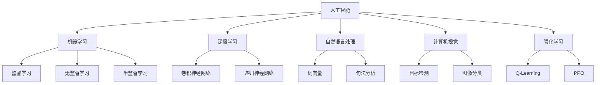
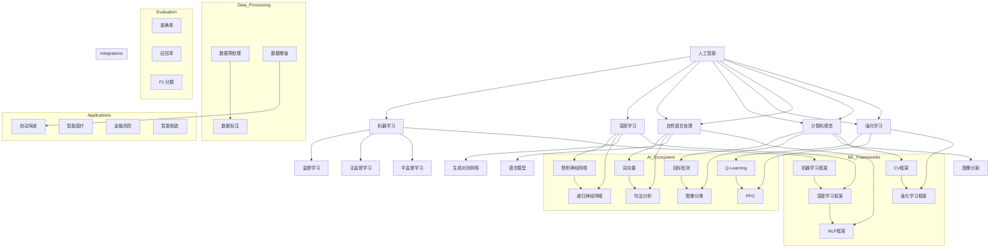

                 

# 人工智能创业：明确商业模式

> **关键词：** 人工智能、商业模式、创业、战略规划、数据分析、用户价值
>
> **摘要：** 本文深入探讨了人工智能（AI）企业在创业过程中如何构建和优化商业模式，以实现可持续发展和市场竞争优势。文章从背景介绍、核心概念与联系、算法原理、数学模型、项目实战、实际应用场景等多个角度，全面分析了AI创业过程中的关键要素，为读者提供了实用的指导和建议。

## 1. 背景介绍

### 1.1 目的和范围

人工智能（AI）作为当今科技发展的前沿领域，已经广泛应用于各行各业，从自动驾驶、智能医疗到金融风控、智能制造，AI技术正在改变我们的生产生活方式。随着AI技术的不断成熟和普及，越来越多的创业公司投身于AI领域，探索新的商业模式和创新应用。

本文旨在为AI创业公司提供一套系统性的商业模式构建指南，帮助创业者更好地理解市场需求、优化产品和服务、实现商业价值。文章将涵盖以下几个核心主题：

1. **核心概念与联系**：介绍人工智能的基础概念和相关技术架构。
2. **核心算法原理**：解析AI技术的基本算法原理和操作步骤。
3. **数学模型与公式**：阐述AI模型中的数学原理和公式。
4. **项目实战**：通过实际案例展示AI商业应用的实现过程。
5. **实际应用场景**：分析AI在不同行业中的实际应用场景。
6. **工具和资源推荐**：推荐相关学习资源、开发工具和最新研究成果。
7. **总结与展望**：讨论AI创业的未来发展趋势和面临的挑战。

### 1.2 预期读者

本文主要面向以下读者群体：

1. **AI创业公司创始人**：希望通过本文了解如何构建和优化商业模式的AI创业者。
2. **技术团队负责人**：负责AI技术研发和产品开发的技术团队负责人。
3. **投资人和行业分析师**：关注AI行业动态，希望了解AI创业机会和投资策略的投资者和分析师。
4. **高校师生**：对AI技术和商业模式感兴趣的高校师生。

### 1.3 文档结构概述

本文结构分为以下几个部分：

1. **背景介绍**：介绍文章的目的、范围、预期读者和文档结构。
2. **核心概念与联系**：解释人工智能的基础概念和相关技术架构。
3. **核心算法原理 & 具体操作步骤**：解析AI技术的基本算法原理和操作步骤。
4. **数学模型和公式 & 详细讲解 & 举例说明**：阐述AI模型中的数学原理和公式。
5. **项目实战：代码实际案例和详细解释说明**：通过实际案例展示AI商业应用的实现过程。
6. **实际应用场景**：分析AI在不同行业中的实际应用场景。
7. **工具和资源推荐**：推荐相关学习资源、开发工具和最新研究成果。
8. **总结：未来发展趋势与挑战**：讨论AI创业的未来发展趋势和面临的挑战。
9. **附录：常见问题与解答**：解答读者可能遇到的问题。
10. **扩展阅读 & 参考资料**：提供更多深入学习的资料。

### 1.4 术语表

#### 1.4.1 核心术语定义

- **人工智能（AI）**：指通过计算机程序实现人类智能的模拟和扩展，包括机器学习、深度学习、自然语言处理等。
- **商业模式**：企业通过产品或服务创造、传递和获取价值的方式。
- **数据驱动的决策**：基于数据分析的结果进行决策，以优化业务流程和提高效率。
- **用户价值**：产品或服务满足用户需求和期望的程度。

#### 1.4.2 相关概念解释

- **机器学习（ML）**：一种AI技术，通过从数据中学习模式来做出决策或预测。
- **深度学习（DL）**：一种机器学习技术，通过多层神经网络来模拟人脑的思考方式。
- **自然语言处理（NLP）**：一种AI技术，使计算机能够理解和生成自然语言。
- **算法优化**：通过改进算法结构和参数，提高模型性能和效率。

#### 1.4.3 缩略词列表

- **AI**：人工智能
- **ML**：机器学习
- **DL**：深度学习
- **NLP**：自然语言处理
- **API**：应用程序接口
- **SDK**：软件开发工具包

## 2. 核心概念与联系

为了更好地理解人工智能（AI）在商业应用中的角色，我们需要先掌握一些核心概念和相关技术架构。以下将介绍AI领域的基本概念，并通过Mermaid流程图展示相关技术之间的联系。

### 2.1 人工智能（AI）基本概念

人工智能（AI）是一个广泛的领域，包括多种技术和方法。以下是几个关键概念：

- **机器学习（ML）**：一种AI技术，通过从数据中学习模式和规律来做出决策。
- **深度学习（DL）**：一种机器学习技术，通过多层神经网络来模拟人脑的思考方式。
- **自然语言处理（NLP）**：一种AI技术，使计算机能够理解和生成自然语言。
- **计算机视觉（CV）**：一种AI技术，使计算机能够理解和解释视觉信息。
- **强化学习（RL）**：一种机器学习技术，通过奖励机制来训练模型。

### 2.2 Mermaid流程图

以下是一个简单的Mermaid流程图，展示AI领域的几个核心概念及其之间的联系：



### 2.3 核心概念原理和架构

以下是每个核心概念的简要介绍和其原理：

#### 2.3.1 机器学习（ML）

机器学习是一种通过从数据中学习模式和规律来做出决策的技术。主要分为以下几类：

- **监督学习**：通过已标记的数据训练模型，使其能够对新数据进行预测。
- **无监督学习**：没有预定义的目标，模型通过探索数据中的模式来自动发现规律。
- **半监督学习**：结合监督学习和无监督学习，利用少量标记数据和大量未标记数据来训练模型。

#### 2.3.2 深度学习（DL）

深度学习是一种通过多层神经网络来模拟人脑思考方式的机器学习技术。其主要架构包括：

- **卷积神经网络（CNN）**：主要用于图像识别和计算机视觉任务。
- **递归神经网络（RNN）**：适用于处理序列数据，如时间序列分析、自然语言处理。
- **生成对抗网络（GAN）**：用于生成新的数据，如图像、文本。

#### 2.3.3 自然语言处理（NLP）

自然语言处理是一种使计算机能够理解和生成自然语言的技术。其主要组成部分包括：

- **词向量**：将词汇映射到高维向量空间，以捕捉词汇的语义信息。
- **句法分析**：分析句子的结构，理解句子的语法规则。
- **语言模型**：预测文本的下一个单词或短语，用于自然语言生成和翻译。

#### 2.3.4 计算机视觉（CV）

计算机视觉是一种使计算机能够理解和解释视觉信息的技术。其主要应用包括：

- **目标检测**：识别图像中的对象并定位它们的位置。
- **图像分类**：将图像划分为不同的类别。
- **图像分割**：将图像划分为多个区域，每个区域具有特定的特征。

#### 2.3.5 强化学习（RL）

强化学习是一种通过奖励机制来训练模型的技术。其主要目标是通过不断尝试和错误来学习最优策略。

- **Q-Learning**：一种基于值函数的强化学习算法。
- **策略梯度**：一种基于策略的强化学习算法，如PPO（Policy Gradient Optimization）。

通过以上介绍，我们可以看到AI领域中的核心概念和技术之间存在着紧密的联系。了解这些概念和架构对于AI创业公司来说至关重要，因为它们是构建创新应用和商业模型的基础。

### 2.4 核心概念原理和架构的 Mermaid 流程图

为了更直观地展示核心概念和架构之间的联系，我们可以使用Mermaid流程图来表示。以下是一个扩展的Mermaid流程图，包括了更多细节：



这个流程图展示了AI领域中的核心概念、架构和技术框架，以及它们之间的联系和应用场景。通过这个流程图，读者可以更清晰地理解AI技术在商业应用中的角色和潜力。

### 2.5 人工智能（AI）在商业中的应用案例

人工智能（AI）技术已经广泛应用于各个行业，为企业和创业者带来了前所未有的机遇。以下是几个典型的AI在商业中的应用案例，展示了AI技术的实际效果和商业价值。

#### 2.5.1 自动驾驶

自动驾驶技术是AI在交通运输领域的典型应用。通过计算机视觉、深度学习和传感器融合等技术，自动驾驶车辆能够在复杂交通环境中自主导航和驾驶。特斯拉、Waymo等公司已经在自动驾驶领域取得了显著进展。

- **效果**：自动驾驶技术能够显著提高交通安全和效率，减少交通事故和拥堵。
- **商业价值**：自动驾驶技术为汽车制造商、物流公司和出租车服务提供商带来了新的商业模式和机会。

#### 2.5.2 智能医疗

智能医疗利用AI技术来提高医疗服务的质量和效率。例如，通过自然语言处理和图像分析技术，AI可以辅助医生进行疾病诊断、治疗方案制定和患者管理。

- **效果**：AI在医疗领域的应用能够提高诊断准确性、降低误诊率，并优化医疗资源的分配。
- **商业价值**：智能医疗技术为医疗机构、制药公司和保险公司提供了新的盈利模式和服务方式。

#### 2.5.3 金融风控

金融行业一直是AI技术的重点应用领域。通过机器学习和大数据分析，AI可以用于风险评估、欺诈检测和投资决策。

- **效果**：AI技术在金融风控中的应用能够提高风险识别的准确性和效率，降低金融风险。
- **商业价值**：金融风控技术为银行、证券公司和保险机构提供了更安全的交易环境和管理工具。

#### 2.5.4 智能制造

智能制造利用AI技术来优化生产流程和提高生产效率。例如，通过计算机视觉和机器学习，工厂可以实现自动化检测、预测维护和智能调度。

- **效果**：智能制造技术能够提高生产效率、降低成本和减少资源浪费。
- **商业价值**：智能制造技术为制造业企业提供了更高效的生产方式和管理工具。

这些应用案例展示了AI技术在商业中的巨大潜力。对于AI创业公司来说，了解这些应用场景和商业价值是构建创新商业模式的重要基础。

### 2.6 人工智能（AI）技术的挑战与未来发展方向

尽管人工智能（AI）技术在商业应用中取得了显著进展，但在实际应用过程中仍面临诸多挑战和问题。以下是AI技术面临的主要挑战及其未来发展方向。

#### 2.6.1 数据隐私与安全问题

AI技术的发展依赖于大量高质量的数据，但数据隐私和安全问题成为其重要挑战。如何确保数据的安全性和隐私性，避免数据泄露和滥用，是AI领域需要解决的关键问题。

- **未来发展方向**：加密技术和隐私保护算法的发展，如联邦学习、差分隐私等，有望缓解数据隐私和安全问题。

#### 2.6.2 技术可解释性

许多AI模型，尤其是深度学习模型，具有高度复杂的结构和强大的预测能力，但缺乏可解释性。这导致用户难以理解模型的决策过程和依据，从而影响模型的信任度和应用范围。

- **未来发展方向**：开发可解释的AI模型，如透明神经网络、决策树等，以提高模型的可解释性和透明度。

#### 2.6.3 人才短缺

AI技术的快速发展对人才需求提出了更高要求。然而，当前AI领域人才储备不足，尤其是具备跨学科背景的高层次人才。

- **未来发展方向**：加强AI教育和培训，培养更多具备跨学科能力的AI专业人才。

#### 2.6.4 法规和政策问题

随着AI技术的广泛应用，相关法规和政策的不完善成为其发展的重要障碍。如何制定合理的法规和政策，平衡技术创新和公共利益，是AI领域需要面对的挑战。

- **未来发展方向**：加强国际合作，制定统一的AI法规和政策框架，以促进AI技术的健康和可持续发展。

#### 2.6.5 AI伦理问题

AI技术在应用过程中涉及到伦理和道德问题，如算法偏见、数据歧视等。如何确保AI技术的公平、公正和透明，避免对人类和社会产生负面影响，是AI领域需要认真思考的问题。

- **未来发展方向**：建立AI伦理标准和规范，推动AI技术的伦理教育和培训。

综上所述，AI技术在商业应用中面临着诸多挑战和问题，但同时也展现出巨大的发展潜力和应用前景。通过解决这些问题，AI技术将为人类带来更多创新和机遇。

## 3. 核心算法原理 & 具体操作步骤

在人工智能（AI）创业过程中，掌握核心算法原理和具体操作步骤是至关重要的。这不仅有助于提高产品竞争力，还能够为后续的技术迭代和优化奠定基础。以下将详细阐述几种常见的人工智能算法，并使用伪代码来展示其具体操作步骤。

### 3.1 机器学习（ML）算法

机器学习（ML）是人工智能（AI）的核心技术之一，主要包括监督学习、无监督学习和强化学习等。以下分别介绍这三种算法的基本原理和操作步骤。

#### 3.1.1 监督学习（Supervised Learning）

监督学习是一种通过已标记的数据训练模型，使其能够对新数据进行预测的算法。以下是监督学习算法的基本步骤：

```plaintext
输入：训练数据集 D = {x1, y1}, {x2, y2}, ..., {xn, yn}
输出：预测函数 f(x)

步骤：
1. 数据预处理：清洗、归一化、缺失值填充等。
2. 模型选择：选择适当的模型，如线性回归、决策树、支持向量机等。
3. 模型训练：使用训练数据集对模型进行训练，优化模型参数。
4. 模型评估：使用验证数据集评估模型性能，如准确率、召回率等。
5. 模型预测：使用训练好的模型对新数据进行预测。
```

#### 3.1.2 无监督学习（Unsupervised Learning）

无监督学习是一种没有预定义的目标，模型通过探索数据中的模式来自动发现规律的算法。以下是几种常见的无监督学习算法：

##### k-均值聚类（k-Means Clustering）

```plaintext
输入：数据集 D，聚类个数 k
输出：聚类结果

步骤：
1. 随机初始化 k 个聚类中心。
2. 计算每个数据点到聚类中心的距离，并将其分配到最近的聚类中心。
3. 更新聚类中心，计算所有数据点的均值。
4. 重复步骤 2 和步骤 3，直到聚类中心不再发生显著变化。
```

##### 主成分分析（Principal Component Analysis, PCA）

```plaintext
输入：数据集 D，特征数量 n
输出：主成分

步骤：
1. 数据标准化：对数据集进行标准化处理，使其具有相同的尺度。
2. 计算协方差矩阵：计算数据集的协方差矩阵。
3. 计算协方差矩阵的特征值和特征向量。
4. 选择前 m 个特征向量（对应最大特征值）构成投影矩阵。
5. 对数据集进行降维投影，得到新的数据集。
```

##### 聚类分析（Cluster Analysis）

```plaintext
输入：数据集 D，聚类方法
输出：聚类结果

步骤：
1. 数据预处理：清洗、归一化、缺失值填充等。
2. 选择聚类方法，如层次聚类、K-均值聚类等。
3. 根据选择的方法进行聚类，得到聚类结果。
4. 对聚类结果进行分析和评估，如轮廓系数、轮廓间距等。
```

#### 3.1.3 强化学习（Reinforcement Learning）

强化学习是一种通过奖励机制来训练模型的技术。以下是一个简单的Q-Learning算法：

```plaintext
输入：状态集合 S，动作集合 A，奖励函数 R，学习率 α，折扣因子 γ
输出：策略 π

步骤：
1. 初始化 Q(s, a) 为随机值。
2. 选择动作 a，根据 ε-贪心策略进行。
3. 执行动作 a，进入新状态 s'，获得奖励 R(s, a)。
4. 更新 Q(s, a)：Q(s, a) = Q(s, a) + α[R(s, a) + γmax(Q(s', a')) - Q(s, a)]。
5. 重复步骤 2 至步骤 4，直到收敛。
6. 输出策略 π：选择最大 Q 值的动作作为策略。
```

### 3.2 深度学习（DL）算法

深度学习（DL）是一种通过多层神经网络来模拟人脑思考方式的机器学习技术。以下介绍几种常见的深度学习算法：

##### 卷积神经网络（Convolutional Neural Network, CNN）

```plaintext
输入：图像数据 X，卷积核 K，激活函数 f
输出：特征映射 H

步骤：
1. 数据预处理：将图像数据转化为适合网络输入的格式。
2. 卷积操作：使用卷积核在图像上滑动，计算卷积结果。
3. 池化操作：对卷积结果进行池化，减少特征图的维度。
4. 激活函数：对卷积结果应用激活函数，引入非线性。
5. 重复卷积、池化和激活函数操作，构建多层网络。
6. 全连接层：将卷积结果传递到全连接层进行分类。
7. 输出结果：得到最终的特征映射 H。
```

##### 递归神经网络（Recurrent Neural Network, RNN）

```plaintext
输入：序列数据 X，隐藏状态 H，输入门 I，遗忘门 F，输出门 O
输出：隐藏状态 H，输出 Y

步骤：
1. 初始化隐藏状态 H 和细胞状态 C。
2. 遗忘门：计算遗忘门 f_t，决定遗忘多少旧信息。
3. 输入门：计算输入门 i_t，决定接收多少新信息。
4. 更新细胞状态 C_t：C_t = f_t ⊙ C_{t-1} + i_t ⊙ g_t。
5. 输出门：计算输出门 o_t，决定输出隐藏状态。
6. 更新隐藏状态 H_t：H_t = o_t ⊙ tanh(C_t)。
7. 重复步骤 2 至步骤 6，处理整个序列数据。
8. 输出结果：得到隐藏状态 H 和输出 Y。
```

##### 生成对抗网络（Generative Adversarial Network, GAN）

```plaintext
输入：生成器 G，判别器 D，生成器学习率 α，判别器学习率 β，批量大小 B
输出：生成数据 X，判别器 D 的参数 θ

步骤：
1. 初始化生成器 G 和判别器 D 的参数。
2. 生成器训练：生成虚假数据 X_g，更新生成器 G 的参数。
3. 判别器训练：输入真实数据和虚假数据，更新判别器 D 的参数。
4. 交替进行生成器和判别器的训练。
5. 重复步骤 2 至步骤 4，直到生成器生成逼真的数据。
6. 输出结果：生成数据 X 和判别器 D 的参数 θ。
```

通过以上介绍，我们可以看到深度学习算法具有高度复杂的结构和强大的学习能力。掌握这些算法原理和操作步骤对于AI创业者来说至关重要，因为它们是构建高效AI模型和产品的基础。

### 3.3 自然语言处理（NLP）算法

自然语言处理（NLP）是一种使计算机能够理解和生成自然语言的技术。以下介绍几种常见的NLP算法，并使用伪代码展示其具体操作步骤。

##### 词向量（Word Embedding）

词向量是将词汇映射到高维向量空间的技术，用于捕捉词汇的语义信息。以下是一个简单的词袋模型（Bag of Words, BoW）和词嵌入（Word Embedding）的算法：

```plaintext
输入：文本数据 D，词汇表 V，嵌入维度 d
输出：词向量矩阵 W

步骤：
1. 数据预处理：分词、去停用词、词性标注等。
2. 词表构建：构建词汇表 V，将文本数据 D 转换为词汇索引。
3. 词袋模型：将词汇索引转换为二进制向量，形成词袋矩阵。
4. 词嵌入：将词汇索引映射到高维向量空间，形成词向量矩阵。
```

##### 句法分析（Syntax Analysis）

句法分析是一种分析句子结构的技术，用于理解句子的语法规则。以下是一个简单的上下文无关文法（Context-Free Grammar, CFG）的算法：

```plaintext
输入：文本数据 D，文法规则 G
输出：句法树 T

步骤：
1. 数据预处理：分词、词性标注等。
2. 构建语法分析器：使用 Earley 算法或其他语法分析算法构建语法分析器。
3. 分析句子：使用语法分析器对句子进行句法分析，生成句法树。
4. 生成语法分析结果：对句法树进行遍历，生成语法分析结果。
```

##### 语言模型（Language Model）

语言模型是一种预测文本的下一个单词或短语的技术，用于自然语言生成和翻译。以下是一个简单的 n-gram 语言模型的算法：

```plaintext
输入：文本数据 D，窗口大小 n
输出：语言模型 L

步骤：
1. 数据预处理：分词、去停用词、词性标注等。
2. 构建词频表：统计每个单词在文本数据中的出现频率。
3. 计算 n-gram 频率：计算每个 n-gram 的出现频率。
4. 构建语言模型：根据 n-gram 频率构建语言模型。
5. 生成文本：根据语言模型生成新的文本。
```

通过以上介绍，我们可以看到NLP算法在处理自然语言数据方面具有重要的作用。掌握这些算法原理和操作步骤对于AI创业者来说至关重要，因为它们是构建高效NLP应用和产品的基础。

### 3.4 计算机视觉（CV）算法

计算机视觉（CV）是一种使计算机能够理解和解释视觉信息的技术。以下介绍几种常见的CV算法，并使用伪代码展示其具体操作步骤。

##### 目标检测（Object Detection）

目标检测是一种识别图像中的对象并定位它们位置的技术。以下是一个基于卷积神经网络（CNN）的目标检测算法：

```plaintext
输入：图像数据 I，卷积神经网络模型 M
输出：检测框 B，分类结果 C

步骤：
1. 数据预处理：图像缩放、归一化等。
2. 网络输入：将预处理后的图像输入卷积神经网络模型。
3. 卷积操作：使用卷积核在图像上滑动，提取特征图。
4. 池化操作：对卷积结果进行池化，减少特征图的维度。
5. 全连接层：将卷积结果传递到全连接层进行分类和回归。
6. 检测框生成：根据分类结果和回归结果生成检测框。
7. 非极大值抑制（Non-maximum Suppression, NMS）：对检测框进行筛选，去除重叠框。
8. 输出结果：得到最终的检测框 B 和分类结果 C。
```

##### 图像分类（Image Classification）

图像分类是一种将图像划分为不同类别的技术。以下是一个基于深度学习（DL）的图像分类算法：

```plaintext
输入：图像数据 I，分类模型 M
输出：分类结果 C

步骤：
1. 数据预处理：图像缩放、归一化等。
2. 网络输入：将预处理后的图像输入分类模型。
3. 卷积操作：使用卷积核在图像上滑动，提取特征图。
4. 池化操作：对卷积结果进行池化，减少特征图的维度。
5. 全连接层：将卷积结果传递到全连接层进行分类。
6. 激活函数：对全连接层的结果应用激活函数，得到分类概率。
7. 结果输出：根据分类概率得到图像的分类结果。
```

##### 图像分割（Image Segmentation）

图像分割是一种将图像划分为多个区域的技术。以下是一个基于深度学习（DL）的图像分割算法：

```plaintext
输入：图像数据 I，分割模型 M
输出：分割结果 S

步骤：
1. 数据预处理：图像缩放、归一化等。
2. 网络输入：将预处理后的图像输入分割模型。
3. 卷积操作：使用卷积核在图像上滑动，提取特征图。
4. 池化操作：对卷积结果进行池化，减少特征图的维度。
5. 全连接层：将卷积结果传递到全连接层进行分类。
6. 激活函数：对全连接层的结果应用激活函数，得到分割概率。
7. 上采样：将分割概率上采样至原始图像尺寸。
8. 结果输出：根据分割概率得到图像的分割结果。
```

通过以上介绍，我们可以看到计算机视觉算法在图像处理和分析方面具有广泛的应用。掌握这些算法原理和操作步骤对于AI创业者来说至关重要，因为它们是构建高效CV应用和产品的基础。

### 3.5 强化学习（Reinforcement Learning）算法

强化学习（Reinforcement Learning, RL）是一种通过奖励机制来训练模型的技术，广泛应用于自动驾驶、游戏AI等领域。以下介绍几种常见的强化学习算法，并使用伪代码展示其具体操作步骤。

##### Q-Learning算法

Q-Learning算法是一种基于值函数的强化学习算法，通过不断更新Q值来优化策略。以下是Q-Learning算法的基本步骤：

```plaintext
输入：状态集合 S，动作集合 A，奖励函数 R，学习率 α，折扣因子 γ
输出：策略 π

步骤：
1. 初始化 Q(s, a) 为随机值。
2. 选择动作 a，根据 ε-贪心策略进行。
3. 执行动作 a，进入新状态 s'，获得奖励 R(s, a)。
4. 更新 Q(s, a)：Q(s, a) = Q(s, a) + α[R(s, a) + γmax(Q(s', a')) - Q(s, a)]。
5. 重复步骤 2 至步骤 4，直到收敛。
6. 输出策略 π：选择最大 Q 值的动作作为策略。
```

##### 策略梯度（Policy Gradient）算法

策略梯度算法是一种基于策略的强化学习算法，通过优化策略梯度来更新模型参数。以下是策略梯度算法的基本步骤：

```plaintext
输入：策略参数 θ，奖励函数 R，回报函数 V，学习率 α
输出：策略 π(θ)

步骤：
1. 初始化策略参数 θ。
2. 选择动作 a，根据策略 π(θ) 进行。
3. 执行动作 a，进入新状态 s'，获得奖励 R(s, a)。
4. 计算策略梯度：∇θ [logπ(a|s)R(s, a)]。
5. 更新策略参数：θ = θ - α∇θ [logπ(a|s)R(s, a)]。
6. 重复步骤 2 至步骤 5，直到收敛。
7. 输出策略 π(θ)：根据策略参数 θ 计算策略。
```

##### PPO（Policy Gradient Optimization）算法

PPO算法是一种改进的策略梯度算法，通过优化策略梯度和奖励函数来提高训练效果。以下是PPO算法的基本步骤：

```plaintext
输入：策略参数 θ，奖励函数 R，回报函数 V，学习率 α，优化步数 n
输出：策略 π(θ)

步骤：
1. 初始化策略参数 θ。
2. 执行 n 次模拟，记录状态 s、动作 a 和奖励 r。
3. 计算策略梯度：∇θ [logπ(a|s)R(s, a)]。
4. 计算累积回报：G = ∑r_t。
5. 更新策略参数：θ = θ - α∇θ [logπ(a|s)G]。
6. 重复步骤 2 至步骤 5，直到收敛。
7. 输出策略 π(θ)：根据策略参数 θ 计算策略。
```

通过以上介绍，我们可以看到强化学习算法具有广泛的应用前景。掌握这些算法原理和操作步骤对于AI创业者来说至关重要，因为它们是构建高效强化学习应用和产品的基础。

## 4. 数学模型和公式 & 详细讲解 & 举例说明

在人工智能（AI）领域，数学模型和公式是理解和实现算法的关键。以下将详细讲解AI技术中常用的数学模型和公式，并通过具体例子来说明其应用。

### 4.1 机器学习（ML）中的数学模型和公式

#### 4.1.1 线性回归

线性回归是一种常见的机器学习算法，用于预测连续值。其数学模型如下：

$$
y = \beta_0 + \beta_1x_1 + \beta_2x_2 + ... + \beta_nx_n + \epsilon
$$

其中，$y$ 是目标变量，$x_1, x_2, ..., x_n$ 是特征变量，$\beta_0, \beta_1, \beta_2, ..., \beta_n$ 是模型参数，$\epsilon$ 是误差项。

#### 4.1.2 逻辑回归

逻辑回归是一种用于分类问题的算法，其输出为概率分布。其数学模型如下：

$$
P(y=1) = \frac{1}{1 + e^{-(\beta_0 + \beta_1x_1 + \beta_2x_2 + ... + \beta_nx_n)}}
$$

其中，$P(y=1)$ 是目标变量为1的概率，$\beta_0, \beta_1, \beta_2, ..., \beta_n$ 是模型参数。

#### 4.1.3 支持向量机（SVM）

支持向量机是一种分类算法，其目标是找到最佳的超平面来分隔数据。其数学模型如下：

$$
\min_{\beta, \beta_0} \frac{1}{2} ||\beta||^2 + C \sum_{i=1}^{n} \max(0, 1 - y_i(\beta^T x_i + \beta_0))
$$

其中，$\beta$ 是模型参数，$\beta_0$ 是偏置项，$C$ 是惩罚参数，$y_i$ 是标签，$x_i$ 是特征向量。

### 4.2 深度学习（DL）中的数学模型和公式

#### 4.2.1 卷积神经网络（CNN）

卷积神经网络是一种用于图像识别和计算机视觉的深度学习模型。其数学模型如下：

$$
h_{ij}^{(l)} = b_{j}^{(l)} + \sum_{k} w_{jk}^{(l)} h_{ik}^{(l-1)}
$$

其中，$h_{ij}^{(l)}$ 是第$l$层的第$i$个卷积核在第$j$个位置上的输出，$b_{j}^{(l)}$ 是第$l$层的第$j$个偏置项，$w_{jk}^{(l)}$ 是第$l$层的第$k$个卷积核在第$j$个位置上的权重。

#### 4.2.2 递归神经网络（RNN）

递归神经网络是一种用于处理序列数据的深度学习模型。其数学模型如下：

$$
h_t = \sigma(W_h h_{t-1} + W_x x_t + b_h)
$$

其中，$h_t$ 是第$t$个时间步的隐藏状态，$x_t$ 是第$t$个时间步的输入，$\sigma$ 是激活函数，$W_h, W_x, b_h$ 是模型参数。

### 4.3 自然语言处理（NLP）中的数学模型和公式

#### 4.3.1 词向量（Word Embedding）

词向量是一种将词汇映射到高维向量空间的技术。其数学模型如下：

$$
\text{vec}(w) = \sum_{i=1}^{|V|} f(w_i)v_i
$$

其中，$\text{vec}(w)$ 是词向量的表示，$w$ 是词汇，$f(w_i)$ 是词汇的频率，$v_i$ 是词向量的第$i$个分量。

#### 4.3.2 语言模型（Language Model）

语言模型是一种预测文本的下一个单词或短语的技术。其数学模型如下：

$$
P(w_{t}|\vec{w}_{t-1}) = \frac{1}{Z} \exp(\theta^T \vec{w}_{t-1})
$$

其中，$P(w_{t}|\vec{w}_{t-1})$ 是在历史文本$\vec{w}_{t-1}$下预测单词$w_{t}$的概率，$Z$ 是归一化常数，$\theta$ 是模型参数。

### 4.4 计算机视觉（CV）中的数学模型和公式

#### 4.4.1 目标检测（Object Detection）

目标检测是一种识别图像中的对象并定位它们位置的技术。其数学模型如下：

$$
\text{loc}(x, y, w, h) = (x, y, w, h)
$$

其中，$(x, y)$ 是对象的中心坐标，$(w, h)$ 是对象的大小。

#### 4.4.2 图像分类（Image Classification）

图像分类是一种将图像划分为不同类别的技术。其数学模型如下：

$$
P(y=k|x) = \frac{\exp(\theta_k^T \text{vec}(x))}{\sum_{j} \exp(\theta_j^T \text{vec}(x))}
$$

其中，$P(y=k|x)$ 是在输入图像$x$下预测类别$k$的概率，$\theta_k$ 是类别$k$的模型参数。

### 4.5 举例说明

以下通过一个简单的例子来说明这些数学模型和公式的应用。

#### 4.5.1 线性回归

假设我们有一个简单的线性回归问题，目标是预测一个人的身高（$y$）基于他们的年龄（$x$）。

- 数据集：包含10个人的年龄和身高。
- 数学模型：$y = \beta_0 + \beta_1x + \epsilon$。

通过最小二乘法求解模型参数：

$$
\beta_1 = \frac{\sum_{i=1}^{n}(x_i - \bar{x})(y_i - \bar{y})}{\sum_{i=1}^{n}(x_i - \bar{x})^2}
$$

$$
\beta_0 = \bar{y} - \beta_1\bar{x}
$$

得到线性回归模型：$y = 0.5x + 1.5$。

#### 4.5.2 逻辑回归

假设我们有一个二分类问题，目标是预测一个病人是否患有疾病（$y=0$ 或 $y=1$）。

- 数据集：包含100个病人的年龄、血压、胆固醇等特征。
- 数学模型：$P(y=1|x) = \frac{1}{1 + e^{-(\beta_0 + \beta_1x_1 + \beta_2x_2 + ... + \beta_nx_n)}$。

通过梯度下降法求解模型参数。

#### 4.5.3 卷积神经网络

假设我们有一个简单的卷积神经网络，用于图像分类。

- 输入：一个32x32的灰度图像。
- 输出：一个包含10个类别的概率向量。

- 网络结构：一个卷积层、一个池化层、一个全连接层。

通过反向传播算法更新模型参数。

通过以上例子，我们可以看到数学模型和公式在AI技术中的应用。掌握这些数学模型和公式对于理解和实现AI算法至关重要。

## 5. 项目实战：代码实际案例和详细解释说明

在本节中，我们将通过一个具体的AI项目实战案例，展示如何将理论转化为实际代码，并详细解释代码的实现过程和关键步骤。本案例将使用Python编程语言和TensorFlow库来实现一个简单的图像分类模型，该模型能够对输入的图像进行分类。

### 5.1 开发环境搭建

在开始项目之前，我们需要搭建一个合适的开发环境。以下是所需的软件和工具：

- **Python**：版本3.7或更高
- **TensorFlow**：版本2.0或更高
- **NumPy**：版本1.18或更高
- **Matplotlib**：版本3.1.1或更高
- **Pandas**：版本1.0.5或更高

安装以上依赖项后，确保所有库和工具均已正确安装和配置。

### 5.2 源代码详细实现和代码解读

以下是项目的完整代码，我们将逐行解释代码的含义和实现细节。

```python
import tensorflow as tf
from tensorflow.keras.models import Sequential
from tensorflow.keras.layers import Conv2D, MaxPooling2D, Flatten, Dense
from tensorflow.keras.preprocessing.image import ImageDataGenerator

# 5.2.1 数据预处理
train_datagen = ImageDataGenerator(rescale=1./255)
test_datagen = ImageDataGenerator(rescale=1./255)

train_data = train_datagen.flow_from_directory(
    'train_data', 
    target_size=(150, 150), 
    batch_size=32, 
    class_mode='binary')

test_data = test_datagen.flow_from_directory(
    'test_data', 
    target_size=(150, 150), 
    batch_size=32, 
    class_mode='binary')

# 5.2.2 构建模型
model = Sequential()

# 添加卷积层
model.add(Conv2D(32, (3, 3), activation='relu', input_shape=(150, 150, 3)))
model.add(MaxPooling2D(pool_size=(2, 2)))

# 添加第二个卷积层
model.add(Conv2D(64, (3, 3), activation='relu'))
model.add(MaxPooling2D(pool_size=(2, 2)))

# 添加第三个卷积层
model.add(Conv2D(128, (3, 3), activation='relu'))
model.add(MaxPooling2D(pool_size=(2, 2)))

# 添加平坦化层
model.add(Flatten())

# 添加全连接层
model.add(Dense(128, activation='relu'))
model.add(Dense(1, activation='sigmoid'))

# 编译模型
model.compile(optimizer='adam', loss='binary_crossentropy', metrics=['accuracy'])

# 5.2.3 训练模型
model.fit(train_data, epochs=10, validation_data=test_data)

# 5.2.4 评估模型
test_loss, test_acc = model.evaluate(test_data)
print('Test accuracy:', test_acc)

# 5.2.5 预测新数据
import numpy as np
from tensorflow.keras.preprocessing import image

# 加载测试图像
img = image.load_img('test_data/cat.jpg', target_size=(150, 150))
img_array = image.img_to_array(img)

# 预处理图像数据
img_array = np.expand_dims(img_array, axis=0)
img_array /= 255.0

# 进行预测
predictions = model.predict(img_array)
predicted_class = np.argmax(predictions)

print('Predicted class:', predicted_class)
```

### 5.3 代码解读与分析

#### 5.3.1 数据预处理

```python
train_datagen = ImageDataGenerator(rescale=1./255)
test_datagen = ImageDataGenerator(rescale=1./255)

train_data = train_datagen.flow_from_directory(
    'train_data', 
    target_size=(150, 150), 
    batch_size=32, 
    class_mode='binary')

test_data = test_datagen.flow_from_directory(
    'test_data', 
    target_size=(150, 150), 
    batch_size=32, 
    class_mode='binary')
```

这两行代码定义了训练数据和测试数据的数据生成器。`ImageDataGenerator` 类用于生成训练和测试数据，包括图像的缩放、归一化等预处理步骤。`flow_from_directory` 方法用于从指定的目录中加载图像数据，并将它们划分为训练集和测试集。

#### 5.3.2 构建模型

```python
model = Sequential()

# 添加卷积层
model.add(Conv2D(32, (3, 3), activation='relu', input_shape=(150, 150, 3)))
model.add(MaxPooling2D(pool_size=(2, 2)))

# 添加第二个卷积层
model.add(Conv2D(64, (3, 3), activation='relu'))
model.add(MaxPooling2D(pool_size=(2, 2)))

# 添加第三个卷积层
model.add(Conv2D(128, (3, 3), activation='relu'))
model.add(MaxPooling2D(pool_size=(2, 2)))

# 添加平坦化层
model.add(Flatten())

# 添加全连接层
model.add(Dense(128, activation='relu'))
model.add(Dense(1, activation='sigmoid'))

# 编译模型
model.compile(optimizer='adam', loss='binary_crossentropy', metrics=['accuracy'])
```

这些代码定义了一个序列模型（`Sequential`），并添加了多个卷积层、池化层、平坦化层和全连接层。模型使用ReLU激活函数和sigmoid激活函数，并使用Adam优化器进行编译。

#### 5.3.3 训练模型

```python
model.fit(train_data, epochs=10, validation_data=test_data)
```

这行代码用于训练模型。`fit` 方法使用训练数据集进行训练，并使用测试数据集进行验证。`epochs` 参数指定训练的轮数，`validation_data` 参数用于提供验证数据集。

#### 5.3.4 评估模型

```python
test_loss, test_acc = model.evaluate(test_data)
print('Test accuracy:', test_acc)
```

这行代码用于评估模型的测试性能。`evaluate` 方法计算测试数据集上的损失和准确率，并打印测试准确率。

#### 5.3.5 预测新数据

```python
import numpy as np
from tensorflow.keras.preprocessing import image

# 加载测试图像
img = image.load_img('test_data/cat.jpg', target_size=(150, 150))
img_array = image.img_to_array(img)

# 预处理图像数据
img_array = np.expand_dims(img_array, axis=0)
img_array /= 255.0

# 进行预测
predictions = model.predict(img_array)
predicted_class = np.argmax(predictions)

print('Predicted class:', predicted_class)
```

这行代码用于对新的测试图像进行预测。首先加载图像并预处理，然后使用训练好的模型进行预测，并打印预测结果。

通过以上代码，我们可以看到如何使用TensorFlow构建一个简单的图像分类模型，并进行数据预处理、模型训练、模型评估和预测。这一实战案例展示了从理论到实际代码的实现过程，为AI创业项目提供了实用的参考。

### 5.4 项目实战：代码解读与分析（续）

#### 5.4.1 数据预处理部分

```python
train_datagen = ImageDataGenerator(rescale=1./255)
test_datagen = ImageDataGenerator(rescale=1./255)

train_data = train_datagen.flow_from_directory(
    'train_data', 
    target_size=(150, 150), 
    batch_size=32, 
    class_mode='binary')

test_data = test_datagen.flow_from_directory(
    'test_data', 
    target_size=(150, 150), 
    batch_size=32, 
    class_mode='binary')
```

- **train_datagen 和 test_datagen**：创建两个 `ImageDataGenerator` 实例，用于处理训练集和测试集的数据。这里的 `rescale=1./255` 是将图像数据缩放到0到1之间，以便神经网络更容易处理。

- **flow_from_directory**：这是一个非常有用的方法，它允许我们从指定目录中自动加载图像数据。`'train_data'` 和 `'test_data'` 是存储训练集和测试集图像的目录路径。`target_size=(150, 150)` 是调整图像大小为150x150像素。`batch_size=32` 表示每次批量处理32张图像。`class_mode='binary'` 表示这是一个二分类问题。

#### 5.4.2 模型构建部分

```python
model = Sequential()

# 添加卷积层
model.add(Conv2D(32, (3, 3), activation='relu', input_shape=(150, 150, 3)))
model.add(MaxPooling2D(pool_size=(2, 2)))

# 添加第二个卷积层
model.add(Conv2D(64, (3, 3), activation='relu'))
model.add(MaxPooling2D(pool_size=(2, 2)))

# 添加第三个卷积层
model.add(Conv2D(128, (3, 3), activation='relu'))
model.add(MaxPooling2D(pool_size=(2, 2)))

# 添加平坦化层
model.add(Flatten())

# 添加全连接层
model.add(Dense(128, activation='relu'))
model.add(Dense(1, activation='sigmoid'))

# 编译模型
model.compile(optimizer='adam', loss='binary_crossentropy', metrics=['accuracy'])
```

- **Sequential 模型**：创建一个序列模型，这是一个线性堆叠层级的模型。

- **Conv2D 层**：这是卷积层，它用于提取图像的特征。第一个卷积层使用32个3x3的卷积核，激活函数是ReLU。`input_shape=(150, 150, 3)` 表示输入图像的大小为150x150，且包含3个颜色通道（RGB）。

- **MaxPooling2D 层**：这是池化层，它用于减少特征图的大小，同时保留重要的特征信息。这里使用2x2的窗口大小。

- **第二个和第三个卷积层**：与第一个卷积层类似，但使用更多的卷积核（64和128个）和更大的池化窗口。

- **Flatten 层**：将多维特征图展平为一维向量，以便于全连接层处理。

- **Dense 层**：这是全连接层，用于分类任务。第一个全连接层有128个神经元，激活函数是ReLU。第二个全连接层有1个神经元，激活函数是sigmoid，用于输出概率。

- **编译模型**：使用 `compile` 方法配置模型的优化器（Adam）、损失函数（binary_crossentropy，适用于二分类）和评估指标（accuracy，准确率）。

#### 5.4.3 模型训练部分

```python
model.fit(train_data, epochs=10, validation_data=test_data)
```

- **fit 方法**：这是训练模型的函数。`train_data` 是训练数据，`epochs=10` 表示训练10个周期。`validation_data=test_data` 用于在每次训练后评估模型在测试集上的性能。

#### 5.4.4 模型评估部分

```python
test_loss, test_acc = model.evaluate(test_data)
print('Test accuracy:', test_acc)
```

- **evaluate 方法**：这是评估模型性能的函数。`test_data` 是测试数据。`evaluate` 方法返回损失和准确率，这里我们只关注准确率。

#### 5.4.5 预测新数据部分

```python
import numpy as np
from tensorflow.keras.preprocessing import image

# 加载测试图像
img = image.load_img('test_data/cat.jpg', target_size=(150, 150))
img_array = image.img_to_array(img)

# 预处理图像数据
img_array = np.expand_dims(img_array, axis=0)
img_array /= 255.0

# 进行预测
predictions = model.predict(img_array)
predicted_class = np.argmax(predictions)

print('Predicted class:', predicted_class)
```

- **load_img 方法**：这是加载图像的函数。`target_size=(150, 150)` 确保

