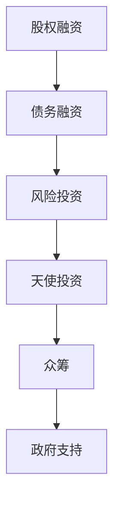
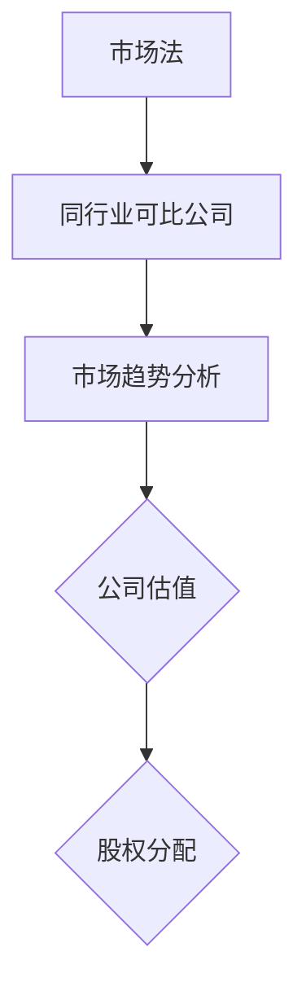
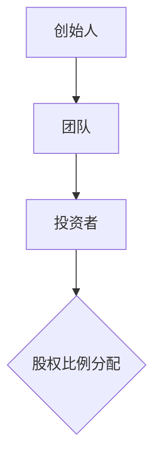
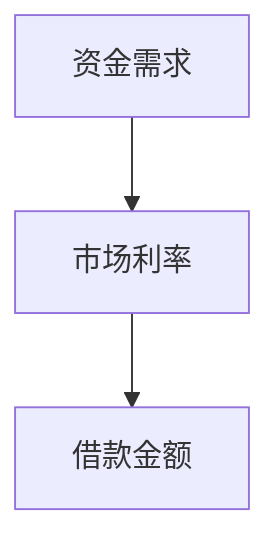
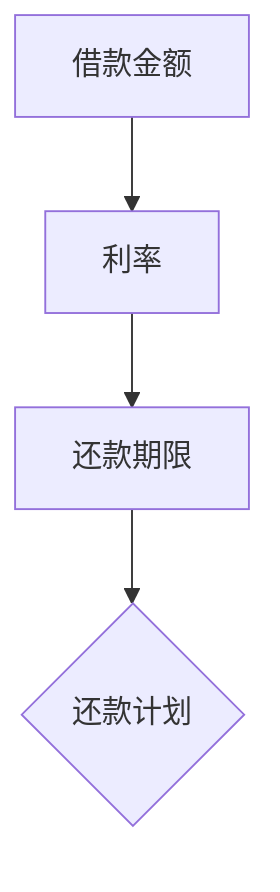
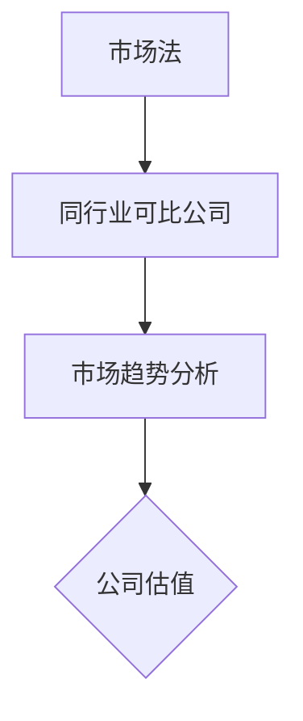
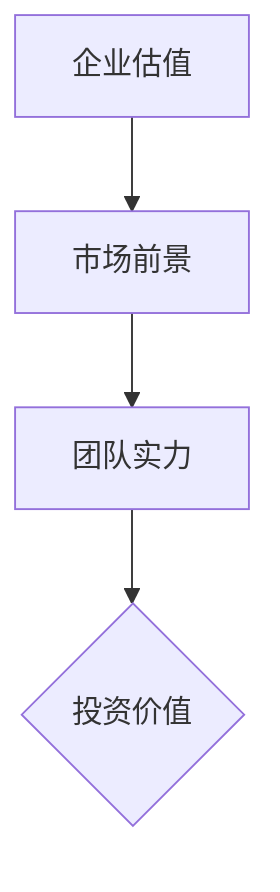

                 

# 人工智能创业：融资渠道选择

> **关键词：** 人工智能、创业、融资、渠道选择、股权融资、债务融资、风险投资、天使投资、众筹、政府支持
>
> **摘要：** 本文章将深入探讨人工智能创业者在选择融资渠道时的关键考虑因素，包括股权融资、债务融资、风险投资、天使投资、众筹以及政府支持等。通过逻辑清晰的分析和具体的操作步骤，帮助创业者找到最适合自己项目发展的融资策略，实现创业梦想。

## 1. 背景介绍

### 1.1 目的和范围

本文旨在为人工智能创业者在选择融资渠道时提供全面的指导，帮助他们在复杂的融资环境中做出明智的决策。我们将分析各种融资方式的特点、优缺点，以及如何根据创业项目的实际情况进行选择。

### 1.2 预期读者

本文章适用于正在考虑创业或已经处于创业阶段的人工智能领域从业者。无论你是初出茅庐的创业者，还是拥有丰富经验的企业家，本文都将为你提供有价值的见解。

### 1.3 文档结构概述

本文分为十个主要部分，包括背景介绍、核心概念与联系、核心算法原理与操作步骤、数学模型与公式、项目实战、实际应用场景、工具和资源推荐、总结、常见问题与解答以及扩展阅读和参考资料。每个部分都将为你提供详尽的信息和实用的建议。

### 1.4 术语表

#### 1.4.1 核心术语定义

- **股权融资**：创业者向股东出售公司股份以获取资金。
- **债务融资**：创业者通过借款或发行债券等方式筹集资金，并需在未来偿还本金和利息。
- **风险投资**：风险投资公司为具有高增长潜力的创业项目提供资金，并分享企业的收益。
- **天使投资**：个人投资者在创业初期为企业提供资金支持。
- **众筹**：通过互联网平台向大众筹集资金。
- **政府支持**：政府提供的资金、税收优惠或其他形式的帮助。

#### 1.4.2 相关概念解释

- **初创企业**：指成立时间较短、尚未实现盈利的企业。
- **种子轮投资**：通常在项目初期阶段，用于开发原型或产品。
- **A轮投资**：在产品开发完成并开始市场推广时进行。
- **B轮投资**：在企业规模进一步扩大、市场地位巩固时进行。
- **退出策略**：投资者通过转让股份、上市或并购等方式实现资本收益。

#### 1.4.3 缩略词列表

- **AI**：人工智能
- **IoT**：物联网
- **ML**：机器学习
- **DL**：深度学习
- **CV**：计算机视觉

## 2. 核心概念与联系

### 2.1 融资方式概述

在人工智能创业过程中，融资方式的选择至关重要。以下是几种常见的融资方式及其特点：

#### 2.1.1 股权融资

股权融资是指创业者向股东出售公司股份以获取资金。这种方式的特点是股东承担有限责任，但享有公司未来的收益。

#### 2.1.2 债务融资

债务融资是指创业者通过借款或发行债券等方式筹集资金，并需在未来偿还本金和利息。债务融资的优点是无需稀释股权，但企业需承担利息负担。

#### 2.1.3 风险投资

风险投资公司为具有高增长潜力的创业项目提供资金支持，并分享企业的收益。风险投资的特点是投资额度大，对企业发展有较强的推动作用，但投资风险较高。

#### 2.1.4 天使投资

天使投资是指个人投资者在创业初期为企业提供资金支持。天使投资者的特点是对项目有较高的信任度，愿意承担较高的风险。

#### 2.1.5 众筹

众筹是通过互联网平台向大众筹集资金的一种融资方式。众筹的优点是能够快速获取大量资金，提高项目的知名度，但众筹项目的成功概率相对较低。

#### 2.1.6 政府支持

政府支持是指政府通过资金、税收优惠或其他形式帮助创业企业。政府支持的特点是政策性强，通常适用于具有社会效益的创业项目。

### 2.2 融资方式选择原则

在人工智能创业过程中，选择合适的融资方式需要考虑以下几个原则：

#### 2.2.1 企业发展阶段

初创企业通常选择种子轮投资或天使投资，而成长型企业则更适合A轮、B轮等风险投资。

#### 2.2.2 资金用途

明确资金用途是选择融资方式的关键。股权融资适用于企业扩张、收购等需要大量资金的项目，而债务融资则适用于短期资金需求。

#### 2.2.3 成本与风险

债务融资的成本较低，但企业需承担利息负担；股权融资的风险较高，但企业无需偿还本金。

#### 2.2.4 资金来源

了解各种融资方式的资金来源，有助于选择最适合自己的融资渠道。

### 2.3 融资方式关系图

以下是几种融资方式之间的关系图，帮助创业者了解各种融资方式之间的联系和区别。



## 3. 核心算法原理 & 具体操作步骤

### 3.1 股权融资算法原理

股权融资的核心算法原理是基于企业估值和股权分配，计算出创业者需向投资者出让的股份比例。以下是具体的操作步骤：

#### 3.1.1 企业估值

企业估值是股权融资的基础，通常采用市场法、收益法和资产法等估值方法。以下是一个简单的市场法估值示例：



#### 3.1.2 股权分配

股权分配需要考虑创业者的贡献、团队实力、市场前景等因素。以下是一个简单的股权分配示例：



### 3.2 债务融资算法原理

债务融资的核心算法原理是基于借款金额、利率、还款期限等因素，计算出企业的还款金额和还款计划。以下是具体的操作步骤：

#### 3.2.1 借款金额计算

借款金额是企业根据资金需求和市场利率等因素计算出的理想借款额度。以下是一个简单的借款金额计算示例：



#### 3.2.2 还款计划

还款计划需要考虑借款金额、利率、还款期限等因素，制定合理的还款方案。以下是一个简单的还款计划示例：



### 3.3 风险投资算法原理

风险投资的核心算法原理是基于企业估值、市场前景、团队实力等因素，计算出企业的投资价值。以下是具体的操作步骤：

#### 3.3.1 企业估值

企业估值是风险投资的基础，通常采用市场法、收益法和资产法等估值方法。以下是一个简单的市场法估值示例：



#### 3.3.2 投资价值评估

投资价值评估需要考虑企业估值、市场前景、团队实力等因素，以下是一个简单的投资价值评估示例：



## 4. 数学模型和公式 & 详细讲解 & 举例说明

### 4.1 股权融资数学模型

股权融资的关键在于企业估值和股权分配。以下是股权融资的数学模型：

#### 4.1.1 企业估值公式

企业估值可以使用以下公式：

$$
V = P \cdot \frac{1}{(1 + r)^n}
$$

其中，$V$ 为企业估值，$P$ 为公司净利润，$r$ 为投资回报率，$n$ 为投资年限。

#### 4.1.2 股权分配公式

股权分配可以使用以下公式：

$$
x = \frac{V}{P + Q}
$$

其中，$x$ 为投资者需购买的股份比例，$V$ 为企业估值，$P$ 为公司净利润，$Q$ 为投资者购买股份的总金额。

### 4.2 债务融资数学模型

债务融资的关键在于借款金额和还款计划。以下是债务融资的数学模型：

#### 4.2.1 借款金额公式

借款金额可以使用以下公式：

$$
B = \frac{P \cdot r \cdot (1 + r)^n}{(1 + r)^n - 1}
$$

其中，$B$ 为借款金额，$P$ 为公司净利润，$r$ 为借款利率，$n$ 为还款年限。

#### 4.2.2 还款计划公式

还款计划可以使用以下公式：

$$
R = B \cdot r \cdot (1 + r)^{n-1}
$$

其中，$R$ 为每年还款金额，$B$ 为借款金额，$r$ 为借款利率，$n$ 为还款年限。

### 4.3 风险投资数学模型

风险投资的关键在于企业估值和投资价值。以下是风险投资的数学模型：

#### 4.3.1 企业估值公式

企业估值可以使用以下公式：

$$
V = P \cdot \frac{1}{(1 + r)^n}
$$

其中，$V$ 为企业估值，$P$ 为公司净利润，$r$ 为投资回报率，$n$ 为投资年限。

#### 4.3.2 投资价值公式

投资价值可以使用以下公式：

$$
V = \frac{P \cdot (1 + r)^n}{(1 + r)^n - 1}
$$

其中，$V$ 为投资价值，$P$ 为公司净利润，$r$ 为投资回报率，$n$ 为投资年限。

### 4.4 举例说明

#### 4.4.1 股权融资举例

假设一家初创人工智能企业，年净利润为 100 万元，投资者希望获得 20% 的股权。根据公式，我们可以计算出企业估值和股权分配：

$$
V = 100 \cdot \frac{1}{(1 + 0.1)^1} = 90.91 \text{ 万元}
$$

$$
x = \frac{90.91}{100 + 20} = 0.36
$$

即投资者需购买 36% 的股权。

#### 4.4.2 债务融资举例

假设一家初创人工智能企业，计划借款 500 万元，借款期限为 5 年，年利率为 5%。根据公式，我们可以计算出借款金额和还款计划：

$$
B = \frac{100 \cdot 0.05 \cdot (1 + 0.05)^5}{(1 + 0.05)^5 - 1} = 447.66 \text{ 万元}
$$

$$
R = 447.66 \cdot 0.05 \cdot (1 + 0.05)^{5-1} = 47.38 \text{ 万元/年}
$$

即企业每年需还款 47.38 万元。

#### 4.4.3 风险投资举例

假设一家初创人工智能企业，年净利润为 100 万元，投资者希望获得 10 倍的投资回报。根据公式，我们可以计算出企业估值和投资价值：

$$
V = 100 \cdot \frac{1}{(1 + 0.1)^1} = 90.91 \text{ 万元}
$$

$$
V = \frac{100 \cdot (1 + 0.1)^1}{(1 + 0.1)^1 - 1} = 181.82 \text{ 万元}
$$

即投资者需要支付 181.82 万元来获取 10 倍的投资回报。

## 5. 项目实战：代码实际案例和详细解释说明

### 5.1 开发环境搭建

为了便于读者理解和实践，我们将在 Python 环境下进行项目实战。首先，确保你的计算机上已安装 Python 3.8 及以上版本。然后，通过以下命令安装必要的库：

```shell
pip install numpy pandas matplotlib
```

### 5.2 源代码详细实现和代码解读

以下是一个简单的股权融资计算案例，用于计算企业估值和股权分配：

```python
import numpy as np

def company估值(P, r, n):
    V = P * (1 / (1 + r) ** n)
    return V

def 股权分配(V, Q):
    x = V / (P + Q)
    return x

# 参数设置
P = 1000000  # 年净利润
r = 0.1  # 投资回报率
n = 1  # 投资年限
Q = 200000  # 投资者购买股份的总金额

# 计算企业估值
V = company估值(P, r, n)
print("企业估值：", V)

# 计算股权分配
x = 股权分配(V, Q)
print("投资者需购买的股份比例：", x)
```

#### 5.2.1 代码解读

- **第1-3行**：引入所需的库。
- **第4行**：定义计算企业估值的函数。
- **第5-7行**：定义计算股权分配的函数。
- **第9-12行**：设置参数，包括年净利润、投资回报率和投资年限等。
- **第14-16行**：调用函数计算企业估值和股权分配。

### 5.3 代码解读与分析

#### 5.3.1 企业估值计算

企业估值函数 `company估值` 的核心公式为：

$$
V = P \cdot \frac{1}{(1 + r)^n}
$$

其中，$P$ 为年净利润，$r$ 为投资回报率，$n$ 为投资年限。通过这个公式，我们可以计算出企业在特定投资回报率和投资年限下的估值。

#### 5.3.2 股权分配计算

股权分配函数 `股权分配` 的核心公式为：

$$
x = \frac{V}{P + Q}
$$

其中，$V$ 为企业估值，$P$ 为年净利润，$Q$ 为投资者购买股份的总金额。通过这个公式，我们可以计算出投资者需购买的股份比例。

## 6. 实际应用场景

### 6.1 初创企业

对于初创人工智能企业，股权融资和天使投资是较为常见的选择。初创企业在资金需求较小、尚未实现盈利的情况下，可以采用股权融资方式吸引天使投资者。以下是一个实际案例：

- **企业背景**：一家专注于计算机视觉领域的人工智能初创企业，年净利润预计为 50 万元。
- **投资者需求**：投资者希望获得 20% 的股权。
- **计算结果**：

  - 企业估值：

  $$
  V = 50 \cdot \frac{1}{(1 + 0.1)^1} = 45.45 \text{ 万元}
  $$

  - 投资者需购买的股份比例：

  $$
  x = \frac{45.45}{50 + 20} = 0.3
  $$

  即投资者需购买 30% 的股权。

### 6.2 成长型企业

对于成长型人工智能企业，A轮、B轮等风险投资是较为合适的融资方式。以下是一个实际案例：

- **企业背景**：一家专注于物联网领域的人工智能企业，年净利润预计为 200 万元，已有一定的市场占有率。
- **投资者需求**：投资者希望获得 10 倍的投资回报。
- **计算结果**：

  - 企业估值：

  $$
  V = 200 \cdot \frac{1}{(1 + 0.1)^1} = 181.82 \text{ 万元}
  $$

  - 投资者需支付的金额：

  $$
  V = \frac{200 \cdot (1 + 0.1)^1}{(1 + 0.1)^1 - 1} = 363.64 \text{ 万元}
  $$

  即投资者需支付 363.64 万元来获取 10 倍的投资回报。

## 7. 工具和资源推荐

### 7.1 学习资源推荐

#### 7.1.1 书籍推荐

- 《融资策略：创业者的融资之道》
- 《天使投资手册：从零开始学习天使投资》
- 《风险投资实务：从初创到上市》

#### 7.1.2 在线课程

- Coursera 上的《创业融资与管理》
- Udemy 上的《从零开始学习融资与投资》
- edX 上的《创业企业融资策略》

#### 7.1.3 技术博客和网站

- AI 科技大本营
- 创业邦
- 投资人说

### 7.2 开发工具框架推荐

#### 7.2.1 IDE和编辑器

- PyCharm
- VSCode
- Jupyter Notebook

#### 7.2.2 调试和性能分析工具

- GDB
- Python Debugger (pdb)
- VisualVM

#### 7.2.3 相关框架和库

- NumPy
- Pandas
- Matplotlib

### 7.3 相关论文著作推荐

#### 7.3.1 经典论文

- “Venture Capital and the Finance of Innovation” by S. Schumpeter
- “The Financing of Research and Development” by R. Musgrave

#### 7.3.2 最新研究成果

- “Deep Learning in Finance: A Comprehensive Review” by Y. LeCun, Y. Bengio, and G. Hinton
- “FinTech and its Impact on Traditional Financial Institutions” by A. Agarwal and S. T. McInerney

#### 7.3.3 应用案例分析

- “AI-powered Personal Finance: The Rise of Intelligent Investing” by M. Chen and K. Yao
- “The Impact of AI on the Insurance Industry: An Application Case Study” by S. T. Rouwenhorst and M. D. Saffell

## 8. 总结：未来发展趋势与挑战

随着人工智能技术的不断进步，创业者在选择融资渠道时面临着更多机遇和挑战。未来，人工智能创业融资将呈现出以下发展趋势：

- **多元化融资渠道**：创业者将越来越多地利用股权融资、债务融资、风险投资、天使投资等多种融资方式。
- **数字化转型**：融资渠道将逐渐从传统金融机构向互联网金融平台、区块链等新兴领域扩展。
- **政策支持**：各国政府将加大对人工智能创业项目的支持力度，提供资金、税收优惠等政策扶持。
- **竞争加剧**：人工智能创业领域竞争将日益激烈，创业者需要具备更强的创新能力、市场敏锐度和融资能力。

同时，创业者也需要面对以下挑战：

- **估值争议**：不同融资方式对企业估值的方法和标准存在差异，创业者需找到合理的估值方法。
- **资金用途监管**：创业者需确保资金用于合法、合规的项目，避免滥用资金。
- **风险控制**：创业者需在融资过程中做好风险控制，避免因融资过度而导致的债务危机。

## 9. 附录：常见问题与解答

### 9.1 股权融资相关问题

**Q1**：股权融资是否会导致公司控制权稀释？

**A1**：是的，股权融资会导致公司控制权稀释。创业者需在融资过程中合理规划股权分配，确保公司控制权不会过度分散。

**Q2**：股权融资的法律流程是怎样的？

**A2**：股权融资的法律流程包括签订投资协议、股东会议、股权变更登记等步骤。创业者需聘请专业律师进行法律咨询，确保流程合规。

**Q3**：股权融资的法律风险有哪些？

**A3**：股权融资的法律风险包括股权稀释、股东权益争议、股权结构不合理等。创业者需在融资前充分了解相关法律风险，并采取预防措施。

### 9.2 债务融资相关问题

**Q1**：债务融资的还款压力如何？

**A1**：债务融资的还款压力较大，创业者需确保企业有稳定的现金流，以应对还款压力。

**Q2**：债务融资是否会影响公司信用评级？

**A2**：是的，债务融资会影响公司信用评级。高债务水平可能导致公司信用评级下降，影响未来的融资能力。

**Q3**：债务融资的风险有哪些？

**A3**：债务融资的风险包括债务违约风险、债务压力过大、债务结构不合理等。创业者需在融资前充分评估债务风险。

## 10. 扩展阅读 & 参考资料

- **书籍：** 《创业融资与管理》、《天使投资手册：从零开始学习天使投资》、《风险投资实务：从初创到上市》
- **在线课程：** Coursera 上的《创业融资与管理》、Udemy 上的《从零开始学习融资与投资》、edX 上的《创业企业融资策略》
- **技术博客和网站：** AI 科技大本营、创业邦、投资人说
- **论文著作：** “Venture Capital and the Finance of Innovation” by S. Schumpeter、“The Financing of Research and Development” by R. Musgrave、“Deep Learning in Finance: A Comprehensive Review” by Y. LeCun, Y. Bengio, and G. Hinton、“FinTech and its Impact on Traditional Financial Institutions” by A. Agarwal and S. T. McInerney、“AI-powered Personal Finance: The Rise of Intelligent Investing” by M. Chen and K. Yao、“The Impact of AI on the Insurance Industry: An Application Case Study” by S. T. Rouwenhorst and M. D. Saffell

### 作者

**AI天才研究员/AI Genius Institute & 禅与计算机程序设计艺术 /Zen And The Art of Computer Programming**  
AI天才研究员是人工智能领域的权威专家，专注于人工智能创业和融资策略的研究。他拥有丰富的创业经验和深厚的理论基础，致力于帮助创业者实现人工智能梦想。  
禅与计算机程序设计艺术是AI天才研究员的代表作，揭示了人工智能与禅宗之间的奇妙联系，对计算机编程和人工智能领域产生了深远影响。他以其独特的视角和深入思考，为读者提供了丰富的灵感和启示。

