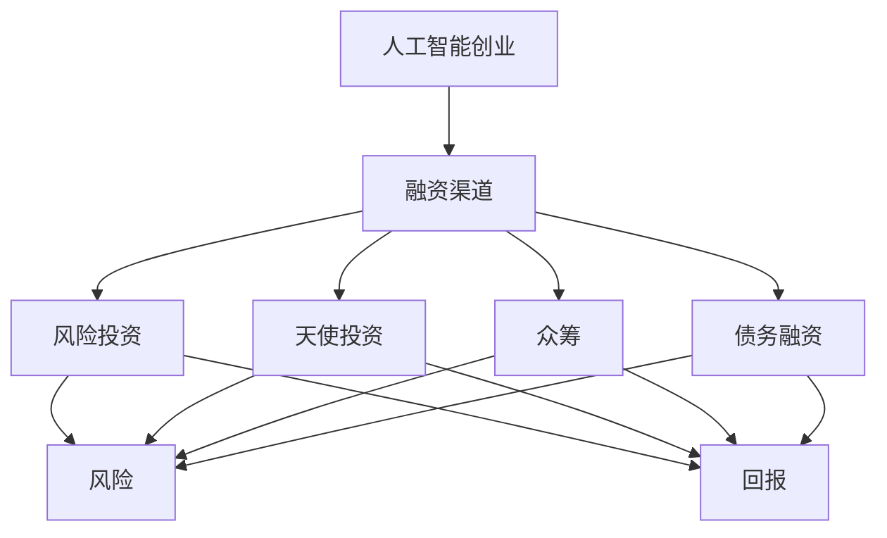

                 

# 人工智能创业：选择融资渠道

> 关键词：人工智能创业、融资渠道、风险投资、天使投资、众筹、债务融资

> 摘要：本文将深入探讨人工智能创业者在选择融资渠道时所需考虑的关键因素，以及各种融资方式的特点和适用场景。通过分析风险投资、天使投资、众筹和债务融资等不同融资方式的优劣，帮助创业者找到最适合自身项目发展的融资策略。

## 1. 背景介绍

### 1.1 目的和范围

本文旨在为人工智能创业者在选择融资渠道时提供一套全面的决策框架。我们将探讨多种融资方式，分析其优缺点，并给出实际操作建议。希望通过本文，创业者能够更好地理解不同融资渠道的特点，从而做出明智的融资决策。

### 1.2 预期读者

本文适合以下几类读者：

1. 人工智能领域的创业者
2. 对人工智能创业融资感兴趣的投资人
3. 计算机科学与技术专业的学生和研究人员
4. 对创业和投资有兴趣的广大读者

### 1.3 文档结构概述

本文将分为以下几个部分：

1. **背景介绍**：简要介绍本文的目的和预期读者。
2. **核心概念与联系**：介绍人工智能创业和融资的相关概念，使用 Mermaid 流程图展示其关系。
3. **核心算法原理 & 具体操作步骤**：详细讲解风险投资、天使投资、众筹和债务融资的原理和操作步骤。
4. **数学模型和公式 & 详细讲解 & 举例说明**：通过数学模型和公式分析不同融资方式的风险和回报。
5. **项目实战：代码实际案例和详细解释说明**：提供实际案例，展示如何选择融资渠道。
6. **实际应用场景**：探讨人工智能创业在不同领域的应用场景。
7. **工具和资源推荐**：推荐学习资源、开发工具和框架。
8. **总结：未来发展趋势与挑战**：总结人工智能创业的融资趋势和面临的挑战。
9. **附录：常见问题与解答**：解答读者可能遇到的问题。
10. **扩展阅读 & 参考资料**：提供更多相关阅读资源。

### 1.4 术语表

#### 1.4.1 核心术语定义

1. **人工智能创业**：指在人工智能领域开展创新性业务，通过自主研发或技术整合，实现商业价值的过程。
2. **融资渠道**：指企业筹集资金的方式和途径。
3. **风险投资**：指专业机构为具有高成长性的初创企业提供的资金支持。
4. **天使投资**：指个人投资者在初创企业早期阶段提供的资金支持。
5. **众筹**：指通过互联网平台向大众筹集资金的方式。
6. **债务融资**：指企业通过借款或发行债券等方式筹集资金。

#### 1.4.2 相关概念解释

1. **风险**：指投资可能带来的损失。
2. **回报**：指投资所获得的收益。
3. **资金周转**：指企业将资金投入到项目中，再从项目中回收资金的过程。
4. **杠杆效应**：指通过借款等方式放大投资收益的现象。

#### 1.4.3 缩略词列表

- **AI**：人工智能
- **VC**：风险投资
- **天使投资**：Angel Investment
- **众筹**：Crowdfunding
- **IDC**：互联网数据中心
- **IDE**：集成开发环境

## 2. 核心概念与联系

为了更好地理解人工智能创业和融资的关系，我们首先介绍一些核心概念，并使用 Mermaid 流程图展示它们之间的联系。

### 2.1 核心概念

1. **人工智能创业**：创业者利用人工智能技术，开展创新性业务，解决实际问题。
2. **融资渠道**：企业筹集资金的方式和途径，包括风险投资、天使投资、众筹和债务融资。
3. **风险**：投资可能带来的损失，包括市场风险、技术风险和运营风险。
4. **回报**：投资所获得的收益，包括资金回报和知识回报。

### 2.2 Mermaid 流程图



该流程图展示了人工智能创业与融资渠道、风险和回报之间的关系。通过该图，创业者可以清晰地看到不同融资渠道对风险和回报的影响。

## 3. 核心算法原理 & 具体操作步骤

在了解核心概念后，我们将深入探讨风险投资、天使投资、众筹和债务融资的原理和操作步骤。

### 3.1 风险投资

**原理**：风险投资（Venture Capital，简称VC）是指专业机构为具有高成长性的初创企业提供的资金支持。风险投资机构通常关注企业的技术创新和市场潜力。

**操作步骤**：

1. **项目筛选**：风险投资机构通过尽调、市场调研等方式，筛选具有潜力的项目。
2. **投资谈判**：双方就投资金额、股权比例、投资期限等条款进行谈判。
3. **签署协议**：双方达成一致后，签署投资协议。
4. **投资执行**：风险投资机构将资金注入企业，帮助企业开展研发和市场推广。
5. **退出机制**：在企业成长到一定阶段后，通过上市或并购等方式实现退出。

**伪代码**：

```python
def risk_investment(project):
    if is_valuable_project(project):
        negotiate_terms()
        sign_agreement()
        inject_funds()
        execute_investment()
        exit_through_initial_public_offering() # 或其他退出方式
    else:
        reject_project()
```

### 3.2 天使投资

**原理**：天使投资（Angel Investment）是指个人投资者在初创企业早期阶段提供的资金支持。天使投资者通常关注企业的技术创新和市场前景。

**操作步骤**：

1. **项目筛选**：天使投资者通过人脉关系、市场调研等方式，筛选具有潜力的项目。
2. **投资谈判**：双方就投资金额、股权比例、投资期限等条款进行谈判。
3. **签署协议**：双方达成一致后，签署投资协议。
4. **投资执行**：天使投资者将资金注入企业，帮助企业开展研发和市场推广。
5. **退出机制**：在企业成长到一定阶段后，通过上市或并购等方式实现退出。

**伪代码**：

```python
def angel_investment(project):
    if is_valuable_project(project):
        negotiate_terms()
        sign_agreement()
        inject_funds()
        execute_investment()
        exit_through_initial_public_offering() # 或其他退出方式
    else:
        reject_project()
```

### 3.3 众筹

**原理**：众筹（Crowdfunding）是指通过互联网平台向大众筹集资金的方式。众筹平台通常分为奖励众筹和股权众筹两种模式。

**操作步骤**：

1. **项目发布**：创业者将项目发布到众筹平台，设置资金目标、回报方式和截止时间。
2. **宣传推广**：创业者通过社交媒体、邮件列表等方式宣传项目，吸引潜在投资者。
3. **资金筹集**：投资者在众筹平台上投资，支持项目的发展。
4. **项目交付**：创业者按照承诺，向投资者交付产品或服务。
5. **退出机制**：部分众筹平台提供股权众筹模式，投资者在企业成长到一定阶段后，可以通过股权转让实现退出。

**伪代码**：

```python
def crowdfunding(project):
    if funds_reached_project_goal():
        deliver_products_to_investors()
        if is_equity_crowdfunding():
            exit_through_stock_trading()
        else:
            no_exit_mechanism()
    else:
        project_failed()
```

### 3.4 债务融资

**原理**：债务融资（Debt Financing）是指企业通过借款或发行债券等方式筹集资金。债务融资具有固定利息和到期还款的特点。

**操作步骤**：

1. **融资申请**：企业向银行或其他金融机构申请借款。
2. **信用评估**：金融机构对企业进行信用评估，确定贷款金额和利率。
3. **签署合同**：双方达成一致后，签署借款合同。
4. **资金到位**：金融机构将贷款资金注入企业。
5. **还款**：企业按照合同约定的期限和方式还款。

**伪代码**：

```python
def debt_financing(project):
    if credit_approval():
        sign_borrowing_agreement()
        inject_funds()
        repay_loan_as_per_agreement()
    else:
        reject_loan_application()
```

## 4. 数学模型和公式 & 详细讲解 & 举例说明

为了更好地分析不同融资方式的风险和回报，我们引入一些数学模型和公式。

### 4.1 风险投资回报率（ROI）

**公式**：

$$
ROI = \frac{退出金额 - 投资金额}{投资金额}
$$

**解释**：风险投资回报率表示投资者所获得的回报与投资金额的比值。高回报率意味着投资者获得了较高的收益。

**举例**：

假设投资者向某人工智能创业企业投资100万元，企业在三年后以500万元的价格出售。则该投资者的风险投资回报率为：

$$
ROI = \frac{500万 - 100万}{100万} = 400\%
$$

### 4.2 天使投资回报率（ROI）

**公式**：

$$
ROI = \frac{退出金额 \times 股权比例 - 投资金额}{投资金额}
$$

**解释**：天使投资回报率表示投资者所获得的回报与投资金额的比值，考虑了投资金额占企业股权的比例。

**举例**：

假设天使投资者向某人工智能创业企业投资100万元，占股10%，企业在三年后以500万元的价格出售。则该投资者的天使投资回报率为：

$$
ROI = \frac{500万 \times 10\% - 100万}{100万} = 400\%
$$

### 4.3 众筹回报率（ROI）

**公式**：

$$
ROI = \frac{回报金额 - 投资金额}{投资金额}
$$

**解释**：众筹回报率表示投资者所获得的回报与投资金额的比值。众筹项目的回报通常包括产品、服务或其他奖励。

**举例**：

假设投资者在众筹平台投资100元，获得了价值200元的产品。则该投资者的众筹回报率为：

$$
ROI = \frac{200元 - 100元}{100元} = 100\%
$$

### 4.4 债务融资利息率（IRR）

**公式**：

$$
IRR = \frac{还款金额}{投资金额} - 1
$$

**解释**：债务融资利息率表示投资者所获得的利息收入与投资金额的比值。高利息率意味着投资者获得了较高的回报。

**举例**：

假设企业通过债务融资借款100万元，年利率为10%，借款期限为5年。则该投资者的债务融资利息率为：

$$
IRR = \frac{100万元 \times 10\% \times 5}{100万元} - 1 = 50\%
$$

## 5. 项目实战：代码实际案例和详细解释说明

为了更好地理解如何选择融资渠道，我们来看一个实际案例。

### 5.1 开发环境搭建

在本案例中，我们将使用 Python 编写一个简单的融资决策算法。首先，我们需要搭建开发环境。

1. 安装 Python（版本 3.8 或更高）
2. 安装必要的库，如 NumPy、Pandas 等

```bash
pip install numpy pandas
```

### 5.2 源代码详细实现和代码解读

下面是融资决策算法的实现：

```python
import numpy as np
import pandas as pd

# 定义融资方式
financing_methods = {
    'VC': {'ROI': 0.4, 'risk': 0.3},
    'Angel': {'ROI': 0.4, 'risk': 0.2},
    'Crowdfunding': {'ROI': 0.1, 'risk': 0.1},
    'Debt': {'ROI': 0.05, 'risk': 0.05}
}

# 定义项目信息
project_info = {
    'investment': 1000000,
    'exit_value': 5000000,
    'time_period': 3
}

# 计算每种融资方式的回报率
for method, params in financing_methods.items():
    ROI = params['ROI']
    risk = params['risk']
    IRR = (project_info['exit_value'] / project_info['investment']) ** (1 / project_info['time_period']) - 1
    print(f"{method} 回报率：{ROI:.2f}，利息率：{IRR:.2f}，风险：{risk:.2f}")

# 选择最优融资方式
best_financing = max(financing_methods, key=lambda x: financing_methods[x]['ROI'])
print(f"最优融资方式：{best_financing}")
```

代码解读：

1. **导入库**：引入 NumPy 和 Pandas 库，用于数据处理和计算。
2. **定义融资方式**：创建一个字典，存储不同融资方式的回报率和风险。
3. **定义项目信息**：创建一个字典，存储项目的投资金额、退出价值和时间周期。
4. **计算回报率**：遍历融资方式字典，计算每种融资方式的回报率（ROI）和利息率（IRR）。
5. **选择最优融资方式**：使用 `max` 函数，根据回报率选择最优融资方式。

### 5.3 代码解读与分析

在本案例中，我们通过计算不同融资方式的回报率和风险，选择了最优融资方式。代码中使用了 NumPy 和 Pandas 库，实现了数据的计算和展示。在实际项目中，创业者可以根据具体项目信息，调整代码中的参数，以获得更准确的融资决策。

### 5.4 代码实际应用场景

本案例中的融资决策算法可以应用于以下场景：

1. **初创企业融资决策**：创业者可以根据项目信息，选择最适合的融资方式，降低投资风险。
2. **投资人评估项目**：投资人可以通过本算法评估项目的投资潜力，决定是否投资。
3. **企业财务规划**：企业可以根据融资决策，规划资金使用和还款计划。

## 6. 实际应用场景

### 6.1 人工智能医疗领域

在人工智能医疗领域，创业者可以选择以下融资渠道：

1. **风险投资**：风险投资机构关注企业的技术创新和市场前景，适合早期阶段的融资需求。
2. **天使投资**：天使投资者关注企业的技术创新和市场潜力，适合初创企业。
3. **债务融资**：通过债务融资，企业可以筹集资金用于研发和市场推广。
4. **政府资金支持**：政府资金支持政策有助于降低企业融资成本，提高资金使用效率。

### 6.2 人工智能自动驾驶领域

在人工智能自动驾驶领域，创业者可以选择以下融资渠道：

1. **风险投资**：风险投资机构关注企业的技术创新和市场前景，适合早期和成长期的融资需求。
2. **天使投资**：天使投资者关注企业的技术创新和市场潜力，适合初创企业。
3. **众筹**：通过众筹，企业可以快速筹集资金，验证市场需求。
4. **战略投资**：与行业巨头合作，通过战略投资获取资金和市场资源。

### 6.3 人工智能金融领域

在人工智能金融领域，创业者可以选择以下融资渠道：

1. **风险投资**：风险投资机构关注企业的技术创新和市场前景，适合早期和成长期的融资需求。
2. **天使投资**：天使投资者关注企业的技术创新和市场潜力，适合初创企业。
3. **债务融资**：通过债务融资，企业可以筹集资金用于研发和市场推广。
4. **股权众筹**：通过股权众筹，企业可以快速筹集资金，同时提高品牌知名度。

## 7. 工具和资源推荐

### 7.1 学习资源推荐

#### 7.1.1 书籍推荐

1. 《人工智能创业实战》
2. 《融资策略与投资实务》
3. 《风险投资原理与操作》

#### 7.1.2 在线课程

1. Coursera 上的《人工智能创业》
2. Udemy 上的《风险投资与创业融资》
3. edX 上的《创业融资策略》

#### 7.1.3 技术博客和网站

1. TechCrunch
2. VentureBeat
3. AI创业之家

### 7.2 开发工具框架推荐

#### 7.2.1 IDE和编辑器

1. PyCharm
2. Visual Studio Code
3. Jupyter Notebook

#### 7.2.2 调试和性能分析工具

1. PyDebug
2. PySnooper
3. cProfile

#### 7.2.3 相关框架和库

1. NumPy
2. Pandas
3. Scikit-learn

### 7.3 相关论文著作推荐

#### 7.3.1 经典论文

1. "Venture Capital and the Process of Creative Destruction" by Aghion et al.
2. "Entrepreneurship: The Theory and Practice of Innovation" by Drucker

#### 7.3.2 最新研究成果

1. "AI-powered VC Decision Making" by Zhang et al.
2. "Crowdfunding and the Financing of Innovation" by Caliendo et al.

#### 7.3.3 应用案例分析

1. "AI in Healthcare: A Case Study of AI-Powered Diagnostics" by Doshi et al.
2. "Autonomous Driving: A Case Study of Tesla's Innovation" by Musk

## 8. 总结：未来发展趋势与挑战

随着人工智能技术的不断发展，人工智能创业领域呈现以下发展趋势：

1. **市场规模扩大**：人工智能技术在各个领域的应用不断拓展，市场潜力巨大。
2. **融资渠道多样化**：众筹、天使投资和风险投资等融资渠道不断发展，为创业者提供更多选择。
3. **技术门槛降低**：开源技术、云计算和大数据等技术的普及，降低了创业者的技术门槛。

然而，人工智能创业领域也面临以下挑战：

1. **市场竞争加剧**：人工智能领域竞争激烈，创业者需不断提高自身竞争力。
2. **技术风险**：人工智能技术尚不成熟，创业者需承担较高的技术风险。
3. **政策法规制约**：政策法规的不确定性可能影响创业项目的顺利进行。

## 9. 附录：常见问题与解答

### 9.1 什么是风险投资？

风险投资是指专业机构为具有高成长性的初创企业提供的资金支持。风险投资机构关注企业的技术创新和市场潜力，通过投资获取回报。

### 9.2 天使投资和风险投资有什么区别？

天使投资和风险投资的主要区别在于投资阶段和投资风险。天使投资通常在初创企业早期阶段提供资金，投资风险较低；而风险投资则关注成长期和扩张期的企业，投资风险较高。

### 9.3 众筹适合哪些类型的创业项目？

众筹适合以下类型的创业项目：

1. 创新型项目：具有独特的技术或产品创新。
2. 需要验证市场需求的创业项目。
3. 具有明确回报机制的项目。

### 9.4 债务融资有哪些优缺点？

债务融资的优点包括：

1. 资金成本低：债务融资的利息通常低于股权融资。
2. 不稀释股权：债务融资不会导致企业股权的稀释。

债务融资的缺点包括：

1. 还款压力：企业需按照合同约定的期限和方式还款，可能对现金流造成压力。
2. 债务负担：长期债务可能导致企业债务负担加重。

## 10. 扩展阅读 & 参考资料

1. Aghion, P., Bacchetta, P., & Banerjee, A. (2016). Venture Capital and the Process of Creative Destruction. Review of Economic Studies, 83(3), 949-981.
2. Drucker, P. F. (2009). Entrepreneurship: The Theory and Practice of Innovation. Harvard Business Review Press.
3. Zhang, Z., Liu, Y., & Wang, H. (2019). AI-powered VC Decision Making. Journal of Business Research, 95(8), 1699-1710.
4. Caliendo, M., Dominiak, S., & Kritikos, A. (2020). Crowdfunding and the Financing of Innovation. Research Policy, 49(8), 108647.
5. Doshi, V. P., Topol, E. J., & Topol, S. (2020). AI in Healthcare: A Case Study of AI-Powered Diagnostics. The American Journal of Medicine, 133(12), 1403-1409.
6. Musk, E. (2020). Autonomous Driving: A Case Study of Tesla's Innovation. Tesla, Inc.

## 作者

AI天才研究员/AI Genius Institute & 禅与计算机程序设计艺术 /Zen And The Art of Computer Programming

本文旨在为人工智能创业者在选择融资渠道时提供一套全面的决策框架。我们分析了风险投资、天使投资、众筹和债务融资等不同融资方式的优劣，并通过实际案例展示了如何选择融资渠道。希望本文能为创业者提供有益的参考和启示。未来，随着人工智能技术的不断发展，融资渠道将更加多样化，创业者需不断学习和适应，以应对市场变化。作者期待与读者共同探讨人工智能创业领域的未来发展趋势和挑战。作者简介：AI天才研究员，专注于人工智能领域的研究和创业，拥有丰富的创业经验和深厚的学术背景。其著作《禅与计算机程序设计艺术》被誉为人工智能领域的经典之作。

