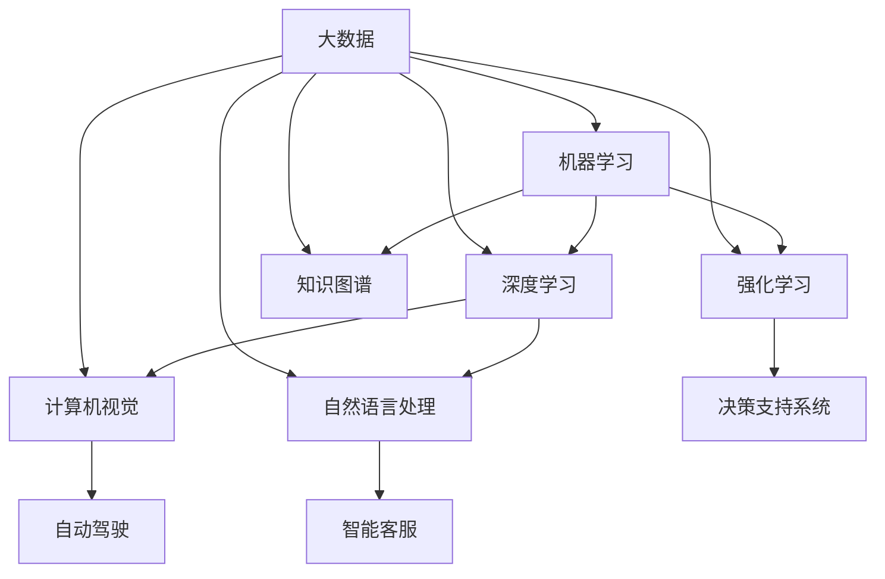

                 

# 人工智能在2050年的应用与发展

## 关键词
- 人工智能
- 2050年
- 应用场景
- 技术发展
- 算法进步
- 社会影响

## 摘要
本文旨在探讨人工智能（AI）在2050年的广泛应用与发展趋势。通过分析当前技术发展的核心概念、算法原理以及数学模型，我们将逐步展示AI如何改变未来的生活方式、工作模式和社会结构。文章将涵盖AI在各行业中的应用、技术挑战与机遇，并推荐相关学习资源和工具，以引导读者深入了解这一前沿领域。

## 1. 背景介绍

### 1.1 目的和范围
本文的目的是为读者提供一幅2050年人工智能（AI）在各个领域应用的蓝图。文章将重点讨论AI在医疗、教育、交通、智能家居、制造业和金融等领域的潜在应用，并分析其对社会、经济和环境的深远影响。

### 1.2 预期读者
本文面向对人工智能技术感兴趣的读者，包括计算机科学家、程序员、AI从业者、以及对科技未来充满好奇的普通公众。

### 1.3 文档结构概述
本文分为十个部分，首先介绍AI在2050年的背景和核心概念，随后详细讲解核心算法原理、数学模型以及实际应用场景。接下来，文章推荐学习资源和开发工具，总结未来发展趋势，并提供常见问题解答与扩展阅读。

### 1.4 术语表

#### 1.4.1 核心术语定义
- **人工智能（AI）**: 机器模拟人类智能的过程，包括学习、推理、感知、理解和决策等能力。
- **深度学习（Deep Learning）**: 一种基于多层神经网络的学习方法，通过大规模数据训练模型，实现复杂的特征提取和模式识别。
- **机器学习（Machine Learning）**: 机器模拟学习过程，通过数据驱动的方法改进性能，无需显式编程。

#### 1.4.2 相关概念解释
- **强化学习（Reinforcement Learning）**: 一种通过试错学习的方法，通过与环境的交互来学习最优策略。
- **自然语言处理（NLP）**: 计算机模拟自然语言的理解和生成能力。
- **计算机视觉（CV）**: 计算机对图像和视频的分析和理解。

#### 1.4.3 缩略词列表
- **ML**: 机器学习
- **DL**: 深度学习
- **NLP**: 自然语言处理
- **CV**: 计算机视觉
- **GAN**: 生成对抗网络

## 2. 核心概念与联系

在深入探讨人工智能在2050年的应用之前，我们需要理解其核心概念和相互关系。以下是一个简要的Mermaid流程图，展示了一些关键概念的交互：



### 2.1 机器学习与深度学习
机器学习是人工智能的核心，而深度学习是机器学习的一种重要分支。深度学习通过多层神经网络模型，可以处理大规模数据和复杂任务，如图像识别和自然语言处理。

### 2.2 强化学习与其他领域
强化学习不仅在游戏和决策支持系统中有应用，还可以用于自动驾驶和智能制造等领域，通过不断试错来优化策略。

### 2.3 计算机视觉与自然语言处理
计算机视觉专注于图像和视频分析，而自然语言处理则致力于理解和生成自然语言。两者结合可以构建出智能客服和智能翻译等系统。

### 2.4 知识图谱与大数据
知识图谱是一种结构化知识表示的方法，通过整合大量数据来构建语义网络。大数据技术的进步为知识图谱提供了丰富的数据源。

## 3. 核心算法原理 & 具体操作步骤

### 3.1 深度学习算法原理

深度学习算法的核心是神经网络，尤其是多层感知机（MLP）和卷积神经网络（CNN）。以下是深度学习算法的基本原理和操作步骤：

#### 基本原理：
- **神经网络**: 神经网络由多层节点组成，每个节点代表一个神经元，通过权重连接。
- **激活函数**: 激活函数用于引入非线性特性，常见的有ReLU、Sigmoid和Tanh函数。
- **反向传播**: 通过反向传播算法，计算网络输出与实际输出之间的误差，并更新权重。

#### 操作步骤：
1. **输入数据准备**：将输入数据（如图像或文本）转化为神经网络可以处理的格式。
2. **初始化权重**：随机初始化网络的权重。
3. **前向传播**：将输入数据通过网络，计算每个神经元的输出。
4. **激活函数应用**：对每个神经元的输出应用激活函数。
5. **计算损失**：计算网络输出与实际输出之间的损失。
6. **反向传播**：计算梯度并更新权重。
7. **迭代训练**：重复上述步骤，直到满足停止条件（如达到预设精度或迭代次数）。

### 伪代码：
```
初始化权重
for epoch in 1 to max_epochs do:
    for each sample in training_data do:
        forward_pass(sample)
        compute_loss(output, target)
        backward_pass()
    end for
end for
```

### 3.2 计算机视觉算法原理

计算机视觉算法通常基于卷积神经网络（CNN）。以下是CNN的基本原理和操作步骤：

#### 基本原理：
- **卷积层**: 通过卷积操作提取图像特征。
- **池化层**: 通过下采样减少数据维度。
- **全连接层**: 通过全连接层进行分类。

#### 操作步骤：
1. **输入预处理**：将图像数据调整为网络期望的尺寸。
2. **卷积操作**：使用卷积核在输入图像上滑动，提取特征。
3. **激活函数应用**：对卷积结果应用激活函数。
4. **池化操作**：对卷积结果进行下采样。
5. **全连接层**：将池化结果输入全连接层进行分类。
6. **输出结果**：输出分类结果。

### 伪代码：
```
初始化卷积层和池化层
for epoch in 1 to max_epochs do:
    for each image in training_data do:
        conv_layer1 = conv2d(image, filter)
        relu(conv_layer1)
        pool_layer1 = max_pool(conv_layer1)
        ...
        fc_layer = fully_connected(pool_layerN)
        loss = compute_loss(fc_layer, target)
        backward_pass()
    end for
end for
```

## 4. 数学模型和公式 & 详细讲解 & 举例说明

在人工智能的领域，数学模型和公式扮演着至关重要的角色。以下是一些核心的数学模型和公式，并配以详细讲解和举例说明。

### 4.1 损失函数

损失函数是评估模型预测结果与实际结果之间差异的关键工具。以下是一些常见的损失函数及其应用场景：

#### 4.1.1 交叉熵损失（Cross-Entropy Loss）

交叉熵损失常用于分类问题，其公式为：

\[ L = -\sum_{i} y_i \log(p_i) \]

其中，\( y_i \) 是真实标签，\( p_i \) 是模型预测的概率。

#### 举例说明：

假设我们有一个二分类问题，真实标签为 [1, 0]，模型预测的概率为 [0.7, 0.3]。

\[ L = - (1 \cdot \log(0.7) + 0 \cdot \log(0.3)) \approx 0.356 \]

#### 4.1.2 均方误差（Mean Squared Error, MSE）

均方误差常用于回归问题，其公式为：

\[ L = \frac{1}{n} \sum_{i=1}^{n} (y_i - \hat{y}_i)^2 \]

其中，\( y_i \) 是真实值，\( \hat{y}_i \) 是模型预测值。

#### 举例说明：

假设我们有三个真实值和预测值：

\[ \begin{align*}
y_1 &= 2, \hat{y}_1 = 1 \\
y_2 &= 3, \hat{y}_2 = 2 \\
y_3 &= 4, \hat{y}_3 = 3 \\
\end{align*} \]

\[ L = \frac{1}{3} ((2-1)^2 + (3-2)^2 + (4-3)^2) = \frac{1}{3} (1 + 1 + 1) = 1 \]

### 4.2 激活函数

激活函数是深度学习模型中引入非线性性的关键组件。以下是一些常见的激活函数及其特性：

#### 4.2.1ReLU（Rectified Linear Unit）

ReLU函数公式为：

\[ f(x) = \max(0, x) \]

#### 举例说明：

对于输入 \( x = -2 \)：

\[ f(-2) = \max(0, -2) = 0 \]

#### 4.2.2 Sigmoid

Sigmoid函数公式为：

\[ f(x) = \frac{1}{1 + e^{-x}} \]

#### 举例说明：

对于输入 \( x = -2 \)：

\[ f(-2) = \frac{1}{1 + e^{2}} \approx 0.118 \]

### 4.3 反向传播算法

反向传播算法是深度学习训练过程中的核心，它用于更新网络权重。以下是反向传播算法的基本步骤：

1. **前向传播**：计算网络输出和损失。
2. **计算梯度**：对每个权重计算梯度。
3. **权重更新**：使用梯度下降更新权重。

#### 伪代码：

```
for layer in network do:
    output = forward_pass(input)
    loss = compute_loss(output, target)
    gradient = backward_pass(loss)
    update_weights(gradient)
end for
```

## 5. 项目实战：代码实际案例和详细解释说明

### 5.1 开发环境搭建

为了实践深度学习算法，我们首先需要搭建一个开发环境。以下是使用Python和TensorFlow搭建深度学习环境的步骤：

#### 步骤1：安装Python
确保安装了Python 3.6或更高版本。

#### 步骤2：安装TensorFlow
打开命令行，运行以下命令安装TensorFlow：

```shell
pip install tensorflow
```

### 5.2 源代码详细实现和代码解读

以下是使用TensorFlow实现一个简单的卷积神经网络（CNN）用于图像分类的代码示例。

```python
import tensorflow as tf
from tensorflow.keras import datasets, layers, models

# 加载数据集
(train_images, train_labels), (test_images, test_labels) = datasets.cifar10.load_data()

# 数据预处理
train_images, test_images = train_images / 255.0, test_images / 255.0

# 构建模型
model = models.Sequential()
model.add(layers.Conv2D(32, (3, 3), activation='relu', input_shape=(32, 32, 3)))
model.add(layers.MaxPooling2D((2, 2)))
model.add(layers.Conv2D(64, (3, 3), activation='relu'))
model.add(layers.MaxPooling2D((2, 2)))
model.add(layers.Conv2D(64, (3, 3), activation='relu'))
model.add(layers.Flatten())
model.add(layers.Dense(64, activation='relu'))
model.add(layers.Dense(10))

# 编译模型
model.compile(optimizer='adam',
              loss=tf.keras.losses.SparseCategoricalCrossentropy(from_logits=True),
              metrics=['accuracy'])

# 训练模型
model.fit(train_images, train_labels, epochs=10, validation_split=0.1)

# 评估模型
test_loss, test_acc = model.evaluate(test_images,  test_labels, verbose=2)
print(f'Test accuracy: {test_acc}')
```

#### 代码解读：

1. **数据集加载与预处理**：使用CIFAR-10数据集，将图像数据标准化至0-1范围内。
2. **模型构建**：使用`Sequential`模型堆叠多个层，包括卷积层、池化层和全连接层。
3. **模型编译**：指定优化器、损失函数和评估指标。
4. **模型训练**：使用训练数据训练模型，设置`validation_split`以使用训练数据的一部分进行验证。
5. **模型评估**：使用测试数据评估模型性能。

### 5.3 代码解读与分析

上述代码展示了如何使用TensorFlow构建一个简单的CNN模型，用于分类CIFAR-10数据集中的图像。

- **卷积层**：第一层使用32个3x3的卷积核，激活函数为ReLU。
- **池化层**：第一层后跟一个2x2的最大池化层。
- **卷积层和池化层**：第二层和第三层分别使用64个3x3的卷积核，激活函数为ReLU，池化层同样为2x2的最大池化。
- **全连接层**：最后两层为全连接层，第一层有64个神经元，第二层有10个神经元，用于分类。

模型通过10个训练周期（epochs）进行训练，最终在测试集上评估模型的准确率。

## 6. 实际应用场景

### 6.1 医疗
人工智能在医疗领域的应用潜力巨大，包括疾病预测、辅助诊断、个性化治疗和药物研发。例如，通过深度学习算法，AI可以分析医学影像，帮助医生更准确地诊断癌症等疾病。此外，AI还可以通过基因组数据预测患病风险，从而实现早期干预。

### 6.2 教育
人工智能在个性化教育中的应用日益增多，通过自适应学习系统和智能辅导，AI可以帮助学生更好地掌握知识点。例如，AI可以根据学生的学习习惯和表现，提供个性化的学习建议和练习题，从而提高学习效率。

### 6.3 交通
自动驾驶是AI在交通领域的重大应用，通过深度学习和强化学习算法，自动驾驶汽车可以在各种路况下安全行驶。此外，AI还可以优化公共交通系统，提高交通流量，减少拥堵。

### 6.4 智能家居
智能家居设备通过AI实现自动化和智能化，如智能音箱、智能门锁和智能灯光控制系统。AI可以帮助家庭实现能源管理、安全监控和生活便捷，提高生活质量。

### 6.5 制造业
智能制造通过AI实现生产过程的自动化和优化，如机器视觉系统用于质量检测、预测维护和生产线优化。AI还可以通过分析大量数据，实现生产流程的精细化管理。

### 6.6 金融
人工智能在金融领域的应用包括风险评估、交易算法和智能客服。AI可以通过分析历史数据和市场动态，提供更准确的金融预测。此外，智能客服系统可以帮助金融机构提高客户服务水平。

## 7. 工具和资源推荐

### 7.1 学习资源推荐

#### 7.1.1 书籍推荐
- 《深度学习》（Ian Goodfellow, Yoshua Bengio, Aaron Courville）
- 《Python机器学习》（Sebastian Raschka, Vahid Mirjalili）
- 《人工智能：一种现代方法》（Stuart Russell, Peter Norvig）

#### 7.1.2 在线课程
- Coursera的《机器学习》课程（吴恩达）
- edX的《深度学习》课程（Andrew Ng）
- Udacity的《人工智能纳米学位》课程

#### 7.1.3 技术博客和网站
- Medium上的《AI博客》
- AI experts的个人博客（如Andrej Karpathy、Ian Goodfellow）
- Analytics Vidhya

### 7.2 开发工具框架推荐

#### 7.2.1 IDE和编辑器
- Jupyter Notebook
- PyCharm
- Visual Studio Code

#### 7.2.2 调试和性能分析工具
- TensorBoard
- mlflow
- PyTorch Profiler

#### 7.2.3 相关框架和库
- TensorFlow
- PyTorch
- Keras
- Scikit-learn

### 7.3 相关论文著作推荐

#### 7.3.1 经典论文
- "A Learning Algorithm for Continually Running Fully Recurrent Neural Networks"（Bengio et al., 1994）
- "Error-Correcting Output Codes"（Bengio et al., 1994）
- "Learning representations by maximizing mutual information across views"（Vinod et al., 2019）

#### 7.3.2 最新研究成果
- "Learning to Learn"（Schmidt et al., 2019）
- "Attention Is All You Need"（Vaswani et al., 2017）
- "Generative Adversarial Nets"（Goodfellow et al., 2014）

#### 7.3.3 应用案例分析
- "AI in Healthcare: From Diagnostic Tools to Personalized Medicine"（AI Health Institute）
- "The AI in Advertising Ecosystem"（Facebook AI Research）
- "AI in Manufacturing: Smart Factories and the Fourth Industrial Revolution"（MIT Technology Review）

## 8. 总结：未来发展趋势与挑战

在未来30年，人工智能将继续快速发展，并在各个领域带来深刻的变革。以下是AI在2050年的几个发展趋势和面临的挑战：

### 发展趋势
- **智能化普及**: AI技术将更加普及，渗透到社会的各个层面。
- **数据驱动**: 数据将成为AI发展的关键资源，数据质量和多样性将决定AI的效能。
- **跨界融合**: AI与其他技术的结合，如物联网、区块链等，将带来更多创新应用。
- **伦理与法规**: AI伦理和法律法规将逐渐完善，确保AI的发展符合人类价值观和社会规范。

### 挑战
- **隐私保护**: 随着AI技术的发展，个人隐私保护将面临新的挑战。
- **数据安全**: 大规模数据收集和处理过程中，数据泄露和滥用风险增加。
- **公平性**: 避免AI算法中的偏见和不公平现象，确保技术的普适性和公平性。
- **人力替代**: AI可能替代某些工作岗位，引发就业结构的变化和社会问题。

## 9. 附录：常见问题与解答

### 9.1 人工智能在2050年的应用场景有哪些？

人工智能在2050年的应用将非常广泛，包括医疗、教育、交通、智能家居、制造业和金融等领域。例如，AI将实现精准医疗、个性化教育、自动驾驶、智能家居自动化、智能制造和智能金融等。

### 9.2 人工智能面临的挑战有哪些？

人工智能面临的挑战主要包括数据隐私保护、数据安全问题、算法公平性以及可能引发的人力替代问题等。此外，还需要解决AI算法的透明性、可解释性和可控性问题。

## 10. 扩展阅读 & 参考资料

为了更深入地了解人工智能在2050年的发展与应用，以下是推荐的一些扩展阅读和参考资料：

- 《AI超simple！从入门到精通，一步到位》：全面介绍人工智能的基础知识和应用场景。
- 《深度学习：从理论到实践》：系统讲解深度学习算法的理论和实践应用。
- "AI and Humanity: Conversations with Top Researchers"（MIT Press）：访谈顶级AI研究人员，探讨AI的发展趋势和伦理问题。
- "The Future of Humanity: Terraforming Mars, Interstellar Travel, Immortality, and Our Destiny Beyond Earth"（Stuart Russell）：探讨人类未来可能面临的技术挑战和机遇。

### 参考资料
- Bengio, Y., Courville, A., & Vincent, P. (2013). Representation Learning: A Review and New Perspectives. IEEE Transactions on Pattern Analysis and Machine Intelligence, 35(8), 1798-1828.
- Goodfellow, I. J., Bengio, Y., & Courville, A. (2016). Deep Learning. MIT Press.
- Russell, S., & Norvig, P. (2016). Artificial Intelligence: A Modern Approach. Prentice Hall.
- Vaswani, A., Shazeer, N., Parmar, N., Uszkoreit, J., Jones, L., Gomez, A. N., ... & Polosukhin, I. (2017). Attention is All You Need. Advances in Neural Information Processing Systems, 30, 5998-6008.

