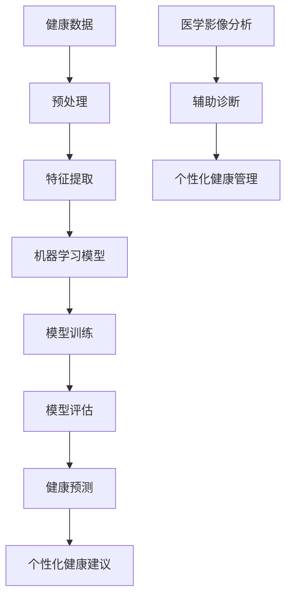

                 

# 人工智能在个性化健康管理中的应用

> **关键词：** 个性化健康，健康管理，人工智能，机器学习，深度学习，健康数据，数据分析，医学影像，健康预测

> **摘要：** 本文旨在探讨人工智能在个性化健康管理中的应用，通过介绍核心概念、算法原理、数学模型以及实际案例，解析如何利用AI技术提高健康管理效率与精准度，从而为个人健康提供更优质的保障。

## 1. 背景介绍

### 1.1 目的和范围

随着科技的不断进步，人工智能（AI）在医疗健康领域的应用越来越广泛。个性化健康管理作为人工智能在医疗领域的一个重要分支，通过分析个体的健康数据，提供针对性的健康建议和治疗方案，极大地提升了健康管理的效率和准确性。本文将深入探讨人工智能在个性化健康管理中的应用，旨在为读者提供一份全面的指南。

本文将涵盖以下内容：

1. 核心概念与联系
2. 核心算法原理与具体操作步骤
3. 数学模型和公式
4. 项目实战：代码实际案例
5. 实际应用场景
6. 工具和资源推荐
7. 总结：未来发展趋势与挑战
8. 附录：常见问题与解答
9. 扩展阅读与参考资料

### 1.2 预期读者

本文主要面向对人工智能在医疗健康领域感兴趣的读者，包括：

1. 医疗健康专业人员
2. 人工智能研究者
3. 对健康管理有深入关注的人士
4. 信息技术和软件开发人员

### 1.3 文档结构概述

本文的结构如下：

1. **背景介绍**：介绍人工智能在个性化健康管理中的应用背景、目的和范围。
2. **核心概念与联系**：阐述个性化健康管理中的核心概念，并提供Mermaid流程图。
3. **核心算法原理与具体操作步骤**：详细讲解核心算法的原理和操作步骤，使用伪代码辅助理解。
4. **数学模型和公式**：介绍用于个性化健康管理中的数学模型和公式，并提供举例说明。
5. **项目实战：代码实际案例**：通过具体代码实现展示如何应用AI技术进行健康管理。
6. **实际应用场景**：分析人工智能在个性化健康管理中的实际应用。
7. **工具和资源推荐**：推荐学习资源、开发工具框架和相关论文著作。
8. **总结**：探讨未来发展趋势与挑战。
9. **附录**：提供常见问题与解答。
10. **扩展阅读与参考资料**：推荐进一步阅读的材料。

### 1.4 术语表

#### 1.4.1 核心术语定义

- **个性化健康管理**：根据个体的健康数据，提供定制化的健康建议和服务。
- **健康数据**：包括个体生物特征、生活习惯、医疗记录等数据。
- **机器学习**：利用数据或以往的知识，使计算机系统能够识别规律、进行预测或决策。
- **深度学习**：一种特殊的机器学习方法，通过构建深度神经网络进行特征学习和模式识别。
- **健康预测**：利用历史健康数据和模型，预测个体未来的健康状况。

#### 1.4.2 相关概念解释

- **数据挖掘**：从大量数据中发现规律、关联性和趋势。
- **数据可视化**：通过图表、图形等方式展示数据，帮助理解和分析数据。
- **医学影像分析**：利用计算机视觉技术，对医学影像进行自动分析，以辅助诊断。

#### 1.4.3 缩略词列表

- **AI**：人工智能（Artificial Intelligence）
- **ML**：机器学习（Machine Learning）
- **DL**：深度学习（Deep Learning）
- **FDA**：食品和药物管理局（Food and Drug Administration）
- **EMR**：电子健康记录（Electronic Medical Record）

## 2. 核心概念与联系

在个性化健康管理中，核心概念包括健康数据、机器学习、深度学习、健康预测等。以下是一个用于描述这些概念及其相互关系的Mermaid流程图。



### 2.1 健康数据

健康数据是个性化健康管理的基石。这些数据可以从多种来源获取，包括但不限于：

- **电子健康记录（EMR）**：包括患者的医疗历史、诊断结果、治疗方案等。
- **生物特征数据**：如身高、体重、血压、心率等生理指标。
- **生活习惯数据**：如饮食、运动、睡眠习惯等。
- **环境数据**：如居住地区、气候变化等。

### 2.2 预处理与特征提取

在获取健康数据后，需要进行预处理和特征提取。预处理包括数据清洗、数据归一化、缺失值处理等，以确保数据质量。特征提取则是从原始数据中提取出有助于建模的特征。

### 2.3 机器学习模型

机器学习模型是用于分析健康数据和预测健康状况的核心工具。常见的机器学习模型包括：

- **监督学习**：利用标注数据进行模型训练。
- **无监督学习**：在没有标注数据的情况下，通过发现数据中的隐藏结构进行学习。
- **半监督学习**：利用少量标注数据和大量未标注数据。

### 2.4 模型训练与评估

模型训练是机器学习过程中的关键步骤，通过调整模型参数以优化预测性能。模型评估用于衡量模型在未知数据上的性能，常见评估指标包括准确率、召回率、F1分数等。

### 2.5 健康预测与个性化健康建议

健康预测是基于训练好的模型，对个体的未来健康状况进行预测。个性化健康建议则是根据预测结果，为个体提供针对性的健康建议，如饮食建议、运动方案、药物调整等。

### 2.6 医学影像分析

医学影像分析利用计算机视觉技术，对医学影像进行自动分析，以辅助医生进行诊断。深度学习在医学影像分析中有着广泛应用，如肿瘤检测、骨折诊断等。

## 3. 核心算法原理与具体操作步骤

在个性化健康管理中，常用的核心算法包括机器学习和深度学习。以下将详细讲解这些算法的原理，并提供具体的操作步骤和伪代码。

### 3.1 机器学习算法

#### 3.1.1 算法原理

机器学习算法通过从数据中学习规律，实现对未知数据的预测或分类。常见的机器学习算法有：

- **线性回归**：用于预测连续值。
- **逻辑回归**：用于分类问题。
- **决策树**：通过一系列规则对数据进行分类或回归。
- **支持向量机（SVM）**：通过找到最佳分隔超平面进行分类。

#### 3.1.2 操作步骤

1. **数据收集与预处理**：收集个体健康数据，并进行预处理。
2. **特征提取**：从预处理后的数据中提取特征。
3. **选择模型**：根据问题类型选择合适的机器学习模型。
4. **模型训练**：使用训练数据对模型进行训练。
5. **模型评估**：使用测试数据评估模型性能。
6. **模型优化**：根据评估结果调整模型参数。

#### 3.1.3 伪代码

```python
# 机器学习算法伪代码

# 数据收集与预处理
data = preprocess_data(raw_data)

# 特征提取
features = extract_features(data)

# 选择模型
model = select_model(problem_type)

# 模型训练
model.train(features, labels)

# 模型评估
performance = model.evaluate(test_data)

# 模型优化
model.optimize(performance)
```

### 3.2 深度学习算法

#### 3.2.1 算法原理

深度学习是一种基于多层神经网络的学习方法，通过逐层提取特征，实现对复杂数据的建模。常见的深度学习算法有：

- **卷积神经网络（CNN）**：用于图像和视频处理。
- **循环神经网络（RNN）**：用于序列数据处理，如文本和语音。
- **生成对抗网络（GAN）**：用于生成复杂数据。

#### 3.2.2 操作步骤

1. **数据收集与预处理**：收集个体健康数据，并进行预处理。
2. **特征提取**：从预处理后的数据中提取特征。
3. **构建神经网络模型**：设计神经网络结构，包括输入层、隐藏层和输出层。
4. **模型训练**：使用训练数据对模型进行训练。
5. **模型评估**：使用测试数据评估模型性能。
6. **模型优化**：根据评估结果调整模型参数。

#### 3.2.3 伪代码

```python
# 深度学习算法伪代码

# 数据收集与预处理
data = preprocess_data(raw_data)

# 特征提取
features = extract_features(data)

# 构建神经网络模型
model = build_neural_network(input_size, hidden_size, output_size)

# 模型训练
model.train(features, labels)

# 模型评估
performance = model.evaluate(test_data)

# 模型优化
model.optimize(performance)
```

## 4. 数学模型和公式

在个性化健康管理中，数学模型和公式是核心算法的基础。以下将详细介绍常用的数学模型和公式，并提供详细讲解和举例说明。

### 4.1 线性回归

线性回归是一种用于预测连续值的统计方法，其公式为：

\[ y = \beta_0 + \beta_1 \cdot x \]

其中，\( y \) 是预测值，\( x \) 是自变量，\( \beta_0 \) 和 \( \beta_1 \) 是模型参数。

#### 4.1.1 详细讲解

- **模型参数估计**：通过最小化残差平方和来估计模型参数。
- **残差分析**：分析残差以评估模型的拟合效果。

#### 4.1.2 举例说明

假设我们要预测一个人的体重（\( y \)）与其身高（\( x \)）之间的关系。使用线性回归模型，我们得到公式：

\[ y = 50 + 0.5 \cdot x \]

根据这个公式，我们可以预测一个人的体重，例如，当身高为170厘米时，体重约为65公斤。

### 4.2 逻辑回归

逻辑回归是一种用于分类问题的统计方法，其公式为：

\[ P(y=1) = \frac{1}{1 + e^{-(\beta_0 + \beta_1 \cdot x)}} \]

其中，\( P(y=1) \) 是目标变量为1的概率，\( x \) 是自变量，\( \beta_0 \) 和 \( \beta_1 \) 是模型参数。

#### 4.2.1 详细讲解

- **模型参数估计**：通过最大似然估计法来估计模型参数。
- **阈值设定**：根据预测概率设定分类阈值。

#### 4.2.2 举例说明

假设我们要预测一个人是否患有心脏病（\( y \)），根据其年龄（\( x \)）和胆固醇水平。使用逻辑回归模型，我们得到公式：

\[ P(y=1) = \frac{1}{1 + e^{-(5 + 0.1 \cdot x)}} \]

当预测概率大于0.5时，我们将其分类为患有心脏病。

### 4.3 卷积神经网络（CNN）

卷积神经网络是一种用于图像处理的深度学习模型，其核心是卷积操作。以下是一个简单的CNN模型结构：

\[ h_l = \sigma(W_l \odot h_{l-1} + b_l) \]

其中，\( h_l \) 是第 \( l \) 层的输出，\( W_l \) 和 \( b_l \) 是卷积核和偏置，\( \odot \) 表示卷积操作，\( \sigma \) 表示激活函数。

#### 4.3.1 详细讲解

- **卷积操作**：通过卷积核在输入数据上滑动，提取特征。
- **激活函数**：常用的激活函数有ReLU、Sigmoid和Tanh。
- **池化操作**：用于降低特征图的维度。

#### 4.3.2 举例说明

假设我们要构建一个简单的CNN模型，用于识别手写数字。输入数据是一个 \( 28 \times 28 \) 的图像，卷积核大小为 \( 3 \times 3 \)。使用ReLU作为激活函数，我们得到以下模型结构：

\[ h_1 = \sigma(W_1 \odot X + b_1) \]
\[ h_2 = \sigma(W_2 \odot h_1 + b_2) \]
\[ \text{输出} = \text{softmax}(W_3 \odot h_2 + b_3) \]

其中，\( X \) 是输入图像，\( W_1 \)，\( W_2 \) 和 \( W_3 \) 是卷积核和全连接层的权重，\( b_1 \)，\( b_2 \) 和 \( b_3 \) 是偏置。

## 5. 项目实战：代码实际案例和详细解释说明

### 5.1 开发环境搭建

为了实现个性化健康管理，我们需要搭建一个开发环境。以下是一个简单的Python环境搭建过程：

```bash
# 安装Python
pip install python

# 安装TensorFlow和Keras
pip install tensorflow
pip install keras

# 安装其他依赖库
pip install numpy
pip install pandas
pip install scikit-learn
```

### 5.2 源代码详细实现和代码解读

以下是一个使用Keras构建的深度学习模型，用于预测个体未来的健康状况。代码中包含详细的注释，以便于理解。

```python
# 导入必要的库
import numpy as np
import pandas as pd
from sklearn.model_selection import train_test_split
from sklearn.preprocessing import StandardScaler
from keras.models import Sequential
from keras.layers import Dense, Dropout, Conv2D, MaxPooling2D, Flatten
from keras.optimizers import Adam

# 加载数据
data = pd.read_csv('health_data.csv')

# 数据预处理
X = data.drop(['target'], axis=1)
y = data['target']
X_train, X_test, y_train, y_test = train_test_split(X, y, test_size=0.2, random_state=42)

# 数据标准化
scaler = StandardScaler()
X_train = scaler.fit_transform(X_train)
X_test = scaler.transform(X_test)

# 构建模型
model = Sequential()
model.add(Conv2D(32, (3, 3), activation='relu', input_shape=(X_train.shape[1], X_train.shape[2], X_train.shape[3])))
model.add(MaxPooling2D((2, 2)))
model.add(Flatten())
model.add(Dense(128, activation='relu'))
model.add(Dropout(0.5))
model.add(Dense(1, activation='sigmoid'))

# 编译模型
model.compile(optimizer=Adam(), loss='binary_crossentropy', metrics=['accuracy'])

# 训练模型
model.fit(X_train, y_train, epochs=10, batch_size=32, validation_split=0.2)

# 评估模型
loss, accuracy = model.evaluate(X_test, y_test)
print(f'测试集损失：{loss}, 测试集准确率：{accuracy}')

# 预测健康状态
predictions = model.predict(X_test)
predicted_labels = (predictions > 0.5).astype(int)

# 代码解读
# 1. 数据预处理：加载数据并进行标准化处理。
# 2. 模型构建：构建一个卷积神经网络模型，包括卷积层、池化层、全连接层和输出层。
# 3. 模型编译：编译模型，设置优化器和损失函数。
# 4. 模型训练：使用训练数据进行模型训练。
# 5. 模型评估：使用测试数据评估模型性能。
# 6. 预测健康状态：使用训练好的模型预测测试数据的健康状态。
```

### 5.3 代码解读与分析

- **数据预处理**：数据预处理是深度学习模型训练的重要步骤。在本例中，我们首先加载数据，然后将其分为特征和标签两部分。接着，使用`train_test_split`函数将数据划分为训练集和测试集，使用`StandardScaler`进行数据标准化处理，以消除不同特征之间的尺度差异。

- **模型构建**：在本例中，我们使用Keras构建了一个简单的卷积神经网络模型。模型包括卷积层、池化层、全连接层和输出层。卷积层用于提取图像特征，池化层用于降低特征图的维度，全连接层用于分类，输出层使用sigmoid激活函数进行二分类。

- **模型编译**：在模型编译阶段，我们设置优化器和损失函数。在本例中，我们使用Adam优化器和二分类交叉熵损失函数。

- **模型训练**：使用训练数据对模型进行训练。在训练过程中，模型通过反向传播算法不断调整权重，以最小化损失函数。

- **模型评估**：使用测试数据评估模型性能。在本例中，我们计算了测试集的损失和准确率。

- **预测健康状态**：使用训练好的模型预测测试数据的健康状态。通过设置阈值（例如0.5），我们可以将预测概率转换为二分类结果。

## 6. 实际应用场景

人工智能在个性化健康管理中具有广泛的应用场景，以下是一些典型的应用案例：

### 6.1 健康风险评估

通过分析个体的健康数据，如生物特征、生活习惯和医疗记录，人工智能可以预测个体患某种疾病的风险。这种预测有助于医生制定个性化的预防和治疗方案。

### 6.2 智能诊断

利用深度学习算法，人工智能可以对医学影像进行分析，辅助医生进行诊断。例如，在肿瘤检测中，人工智能可以自动识别和标注肿瘤区域，提高诊断的准确性和效率。

### 6.3 健康管理建议

基于个体的健康数据和偏好，人工智能可以提供个性化的健康管理建议。例如，根据饮食记录和健康目标，人工智能可以为个体推荐合适的饮食方案。

### 6.4 药物个性化

人工智能可以通过分析个体基因、健康状况和药物反应数据，为个体推荐最合适的药物剂量和治疗方案。这种个性化药物管理有助于提高治疗效果，减少副作用。

### 6.5 健康监测

通过可穿戴设备和移动应用，人工智能可以实时监测个体的生理参数，如心率、血压和血糖等。这些数据可以用于早期发现健康问题，并提供及时的干预建议。

## 7. 工具和资源推荐

为了更好地理解和应用人工智能在个性化健康管理中的技术，以下推荐一些学习资源、开发工具框架和相关论文著作。

### 7.1 学习资源推荐

#### 7.1.1 书籍推荐

- 《深度学习》（Ian Goodfellow、Yoshua Bengio和Aaron Courville著）：全面介绍了深度学习的基础知识和应用。
- 《Python机器学习》（Sebastian Raschka著）：详细介绍了Python在机器学习中的应用，包括数据处理、模型训练和评估等。
- 《人工智能：一种现代方法》（Stuart Russell和Peter Norvig著）：全面介绍了人工智能的基础理论和应用。

#### 7.1.2 在线课程

- Coursera上的《机器学习》（吴恩达）：提供了丰富的机器学习和深度学习教程。
- edX上的《深度学习导论》（Helen Stone）：介绍了深度学习的基础知识和应用。
- Udacity的《深度学习纳米学位》：通过实践项目学习深度学习的应用。

#### 7.1.3 技术博客和网站

- Medium上的《AI Health Tech》：关于人工智能在医疗健康领域的最新研究和应用。
- Towards Data Science：提供了大量的数据科学和机器学习教程和案例分析。
- AI Health：专注于人工智能在医疗健康领域的应用，包括论文、新闻和案例分析。

### 7.2 开发工具框架推荐

#### 7.2.1 IDE和编辑器

- PyCharm：一款功能强大的Python IDE，适用于深度学习和机器学习项目。
- Jupyter Notebook：一款流行的交互式编程环境，适用于数据分析和可视化。
- VS Code：一款轻量级的跨平台编辑器，支持多种编程语言和扩展。

#### 7.2.2 调试和性能分析工具

- TensorBoard：TensorFlow的官方可视化工具，用于分析和调试深度学习模型。
- Profiler：Python内置的性能分析工具，用于分析程序运行时间。
- PyTorch Profiler：PyTorch的官方性能分析工具，用于分析和优化深度学习模型。

#### 7.2.3 相关框架和库

- TensorFlow：一款流行的开源深度学习框架，适用于构建和训练深度学习模型。
- Keras：一款基于TensorFlow的高层次神经网络API，简化了深度学习模型的构建和训练。
- PyTorch：一款流行的开源深度学习框架，适用于研究者和开发者。

### 7.3 相关论文著作推荐

#### 7.3.1 经典论文

- “Deep Learning” by Yoshua Bengio, Ian Goodfellow, and Aaron Courville：深度学习领域的经典综述。
- “Stochastic Gradient Descent” by Bottou：介绍随机梯度下降算法的论文。
- “Deep Neural Networks for Speech Recognition” by Hinton et al.：介绍深度神经网络在语音识别中的应用。

#### 7.3.2 最新研究成果

- “Deep Learning for Healthcare” by Qualcomm Institute：关于深度学习在医疗健康领域应用的研究论文。
- “AI in Healthcare: A Survey” by Wu et al.：关于人工智能在医疗健康领域应用的研究综述。
- “Generative Adversarial Networks for Medical Image Analysis” by Kingma et al.：关于生成对抗网络在医学影像分析中的应用研究。

#### 7.3.3 应用案例分析

- “AI-powered Personalized Healthcare” by NVIDIA：介绍NVIDIA在个性化健康管理中的应用案例。
- “AI-powered Health Analytics” by IBM：介绍IBM在医疗健康数据分析中的应用案例。
- “AI-powered Cancer Diagnosis” by Google：介绍Google在癌症诊断中的应用案例。

## 8. 总结：未来发展趋势与挑战

随着人工智能技术的不断进步，个性化健康管理有望在未来实现更高水平的发展。以下是一些未来发展趋势和面临的挑战：

### 8.1 发展趋势

1. **数据处理能力提升**：随着计算能力的提升和大数据技术的发展，个性化健康管理将能够处理和分析更大量的健康数据。
2. **深度学习应用深化**：深度学习在个性化健康管理中的应用将进一步深化，如医学影像分析、基因测序和个性化药物推荐等。
3. **跨学科融合**：个性化健康管理将与其他领域（如生物医学、心理学、社会学等）深度融合，推动健康管理向更全面、更个性化的方向发展。
4. **可解释性增强**：随着用户对人工智能信任度的提高，增强模型的可解释性将变得越来越重要，有助于用户更好地理解和接受AI健康管理方案。

### 8.2 挑战

1. **数据隐私保护**：个性化健康管理需要大量健康数据，如何保护用户的隐私成为一个重要挑战。
2. **数据质量和多样性**：高质量和多样化的健康数据是个性化健康管理的基础，当前数据质量和多样性尚需提升。
3. **模型解释性和可解释性**：尽管深度学习模型在性能上具有优势，但其解释性较差，如何提高模型的可解释性是一个亟待解决的问题。
4. **法律法规和伦理问题**：随着人工智能在医疗健康领域的应用，相关的法律法规和伦理问题也需要得到充分考虑和解决。

## 9. 附录：常见问题与解答

### 9.1 个性化健康管理是什么？

个性化健康管理是一种利用人工智能技术，根据个体的健康数据提供定制化健康建议和治疗方案的方法。它旨在提高健康管理的效率和精准度，为个人健康提供更好的保障。

### 9.2 个性化健康管理与传统健康管理有什么区别？

个性化健康管理基于个体的健康数据，通过分析个体差异，提供更加精准和个性化的健康建议。而传统健康管理往往采用通用化的方法，无法充分考虑个体差异。

### 9.3 个性化健康管理中的核心算法有哪些？

个性化健康管理中的核心算法包括机器学习、深度学习、数据挖掘和统计学方法。这些算法用于分析健康数据、预测健康状况和提供个性化健康建议。

### 9.4 如何保护用户隐私？

为了保护用户隐私，个性化健康管理需要采取以下措施：

1. **数据匿名化**：对用户数据进行匿名化处理，以消除个人身份信息。
2. **加密技术**：对传输和存储的数据进行加密，确保数据安全。
3. **数据访问控制**：限制对用户数据的访问权限，确保只有授权人员可以访问。
4. **透明度和用户同意**：向用户明确告知其数据将被如何使用，并获得用户同意。

## 10. 扩展阅读 & 参考资料

为了深入了解人工智能在个性化健康管理中的应用，以下推荐一些扩展阅读和参考资料：

- 《深度学习在医疗健康中的应用》：详细介绍了深度学习在医疗健康领域的应用案例和技术。
- 《人工智能医疗健康政策与法规研究》：探讨了人工智能在医疗健康领域的法律法规和伦理问题。
- 《人工智能与健康管理》：分析了人工智能在健康管理中的应用前景和挑战。
- 《深度学习与医疗影像分析》：介绍了深度学习在医学影像分析中的应用和技术。
- 《个性化健康管理实践指南》：提供了个性化健康管理的实际操作方法和案例。

通过这些扩展阅读和参考资料，读者可以进一步深入了解人工智能在个性化健康管理中的应用和技术。

### 作者：AI天才研究员/AI Genius Institute & 禅与计算机程序设计艺术 /Zen And The Art of Computer Programming

感谢您的阅读，希望本文能帮助您更好地了解人工智能在个性化健康管理中的应用。如果您有任何疑问或建议，请随时与我交流。

