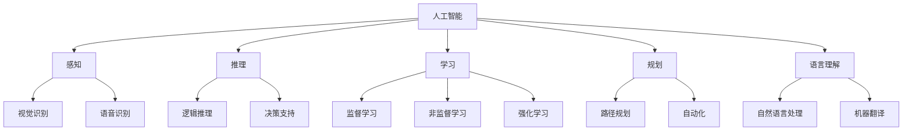
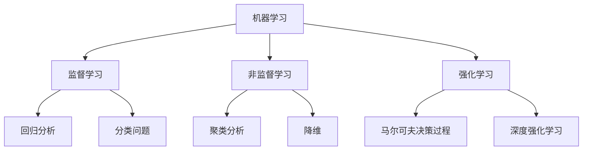
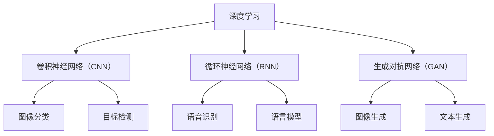
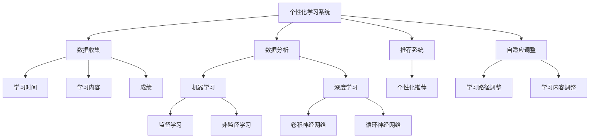

                 

### 文章标题

# 人工智能在教育个性化学习中的应用

> **关键词：** 人工智能、教育、个性化学习、机器学习、深度学习、教育技术、自适应学习系统

> **摘要：** 本文将深入探讨人工智能在教育个性化学习中的应用。我们将从背景介绍出发，逐步解析核心概念，详细阐述算法原理、数学模型，通过实际项目案例进行代码解读，最后分析实际应用场景，总结未来发展趋势与挑战，并推荐相关学习资源和工具。本文旨在为教育技术从业者提供有价值的见解和实践指导。

### 背景介绍

#### 1.1 目的和范围

本文的目的是探讨如何将人工智能（AI）应用于教育领域，特别是在个性化学习中的应用。我们将分析AI的核心概念，介绍其在教育中的应用现状，详细探讨机器学习和深度学习在教育个性化学习中的具体应用，并通过实例展示如何实现这些技术。文章旨在为教育工作者、技术从业者以及研究者提供深入的理论基础和实践指南。

#### 1.2 预期读者

本文预期读者包括：

- 教育技术从业者，特别是那些对AI在教育中的应用感兴趣的人；
- 计算机科学和人工智能专业的学生和研究者；
- 教育工作者，特别是那些希望采用新技术提高教学效果的人；
- 任何对人工智能在教育个性化学习中的应用感兴趣的读者。

#### 1.3 文档结构概述

本文将分为以下几个部分：

1. **背景介绍**：介绍文章的目的、预期读者以及文章结构。
2. **核心概念与联系**：详细讨论人工智能、机器学习、深度学习等核心概念，并通过Mermaid流程图展示相关架构。
3. **核心算法原理 & 具体操作步骤**：使用伪代码详细阐述关键算法原理和操作步骤。
4. **数学模型和公式 & 详细讲解 & 举例说明**：介绍数学模型，使用LaTeX格式展示公式，并举例说明。
5. **项目实战：代码实际案例和详细解释说明**：展示一个实际项目，详细解释代码实现。
6. **实际应用场景**：分析人工智能在教育个性化学习中的具体应用。
7. **工具和资源推荐**：推荐学习资源、开发工具和框架。
8. **总结：未来发展趋势与挑战**：总结人工智能在教育个性化学习中的应用趋势和面临的挑战。
9. **附录：常见问题与解答**：提供常见问题的解答。
10. **扩展阅读 & 参考资料**：推荐进一步阅读的资料。

#### 1.4 术语表

以下是一些本文中使用的核心术语及其定义：

##### 1.4.1 核心术语定义

- **人工智能（AI）**：模拟人类智能行为的计算机系统。
- **机器学习（ML）**：一种AI分支，通过数据和算法让计算机自主学习和改进性能。
- **深度学习（DL）**：机器学习的一种方法，通过多层神经网络模拟人脑进行数据处理和学习。
- **个性化学习**：根据学生的个体差异，为学生提供定制化的学习路径和资源。
- **自适应学习系统**：能够根据学生的行为和表现自动调整学习内容和方式的教育系统。

##### 1.4.2 相关概念解释

- **教学数据**：用于机器学习和深度学习的教育相关数据，包括学生成绩、学习时间、学习路径等。
- **学习分析**：使用数据分析技术，分析学生的学习行为和效果，以便优化教育过程。
- **学习风格**：学生偏好和习惯，包括视觉、听觉、动手操作等。
- **学习轨迹**：学生在学习过程中的行为序列。

##### 1.4.3 缩略词列表

- **AI**：人工智能
- **ML**：机器学习
- **DL**：深度学习
- **IDE**：集成开发环境
- **LaTeX**：一种排版系统，常用于数学公式的排版
- **API**：应用程序接口

## 核心概念与联系

在教育领域应用人工智能，需要深入了解人工智能、机器学习和深度学习等核心概念，以及它们如何相互联系，共同构建个性化学习系统。以下是这些核心概念和它们之间的关联，并通过Mermaid流程图进行展示。

### 2.1 人工智能（AI）

人工智能（AI）是一种模拟人类智能行为的计算机系统，包括感知、推理、学习、规划和语言理解等方面。它是机器学习和深度学习的基础。



### 2.2 机器学习（ML）

机器学习（ML）是一种AI分支，通过数据和算法让计算机自主学习和改进性能。ML分为监督学习、非监督学习和强化学习。



### 2.3 深度学习（DL）

深度学习（DL）是机器学习的一种方法，通过多层神经网络模拟人脑进行数据处理和学习。DL在图像识别、语音识别和自然语言处理等领域表现尤为突出。



### 2.4 个性化学习系统

个性化学习系统是AI在教育中的应用，通过收集和分析学生的行为数据，根据其学习风格、学习轨迹和知识水平，提供定制化的学习路径和资源。该系统通常包括以下几个关键组成部分：

1. **数据收集**：收集学生的学习行为数据，包括学习时间、学习内容、成绩等。
2. **数据分析**：使用机器学习和深度学习技术，分析数据以识别学生的学习模式和偏好。
3. **推荐系统**：根据数据分析结果，为每个学生推荐合适的学习资源和路径。
4. **自适应调整**：根据学生的学习反馈，自动调整学习内容和方式，以最大化学习效果。



通过以上流程图，我们可以清晰地看到人工智能、机器学习和深度学习在构建个性化学习系统中的角色和关系。这些技术共同作用，帮助学生实现个性化学习，提高教育质量和学习效果。

## 核心算法原理 & 具体操作步骤

在教育个性化学习系统中，算法的选择和实现是关键。以下我们将详细探讨几个核心算法，包括监督学习、非监督学习和强化学习，并通过伪代码来展示其具体操作步骤。

### 3.1 监督学习

监督学习是一种机器学习方法，通过已标记的数据训练模型，使其能够对新数据进行预测。在教育个性化学习中，监督学习可以用于预测学生的成绩、评估学生的学习进度等。

#### 3.1.1 算法原理

监督学习算法包括以下步骤：

1. **数据准备**：收集并准备标记好的训练数据。
2. **模型选择**：选择合适的模型，如线性回归、决策树、支持向量机等。
3. **模型训练**：使用训练数据训练模型。
4. **模型评估**：使用测试数据评估模型性能。
5. **模型应用**：使用训练好的模型进行预测。

#### 3.1.2 伪代码

```python
# 数据准备
def prepare_data(data):
    # 数据清洗、归一化等预处理操作
    return processed_data

# 模型选择
def select_model():
    # 根据任务选择合适的模型
    return model

# 模型训练
def train_model(model, data):
    # 使用训练数据进行模型训练
    return trained_model

# 模型评估
def evaluate_model(model, test_data):
    # 使用测试数据进行模型评估
    return accuracy

# 模型应用
def apply_model(model, new_data):
    # 使用训练好的模型进行预测
    return prediction

# 具体实现
processed_data = prepare_data(data)
model = select_model()
trained_model = train_model(model, processed_data)
accuracy = evaluate_model(trained_model, test_data)
prediction = apply_model(trained_model, new_data)
```

### 3.2 非监督学习

非监督学习是一种机器学习方法，不使用标记数据，通过数据自身的特征来发现数据中的模式。在教育个性化学习中，非监督学习可以用于学生群体分析、学习风格识别等。

#### 3.2.1 算法原理

非监督学习算法包括以下步骤：

1. **数据准备**：收集未标记的数据。
2. **特征提取**：从数据中提取关键特征。
3. **模型选择**：选择合适的模型，如K均值聚类、主成分分析等。
4. **模型训练**：使用特征数据训练模型。
5. **模型评估**：评估模型性能。
6. **模型应用**：根据模型结果进行分类或聚类。

#### 3.2.2 伪代码

```python
# 数据准备
def prepare_data(data):
    # 数据清洗、归一化等预处理操作
    return processed_data

# 特征提取
def extract_features(data):
    # 从数据中提取关键特征
    return features

# 模型选择
def select_model():
    # 根据任务选择合适的模型
    return model

# 模型训练
def train_model(model, features):
    # 使用特征数据训练模型
    return trained_model

# 模型评估
def evaluate_model(model, test_features):
    # 使用测试数据进行模型评估
    return accuracy

# 模型应用
def apply_model(model, new_data):
    # 使用训练好的模型进行分类或聚类
    return classification_result

# 具体实现
processed_data = prepare_data(data)
features = extract_features(processed_data)
model = select_model()
trained_model = train_model(model, features)
accuracy = evaluate_model(trained_model, test_features)
classification_result = apply_model(trained_model, new_data)
```

### 3.3 强化学习

强化学习是一种机器学习方法，通过试错和奖励机制来学习最优策略。在教育个性化学习中，强化学习可以用于自适应学习路径推荐、智能辅导系统等。

#### 3.3.1 算法原理

强化学习算法包括以下步骤：

1. **环境设置**：定义学习环境，包括状态、动作和奖励。
2. **策略选择**：选择合适的策略，如Q学习、深度Q网络等。
3. **策略评估**：评估策略在特定状态下的表现。
4. **策略优化**：根据评估结果优化策略。
5. **策略应用**：使用优化后的策略进行实际操作。

#### 3.3.2 伪代码

```python
# 环境设置
class Environment:
    def __init__(self):
        # 初始化环境状态
        self.state = None

    def get_state(self):
        # 获取当前状态
        return self.state

    def set_state(self, state):
        # 设置状态
        self.state = state

    def get_reward(self, action):
        # 根据动作获取奖励
        return reward

    def get_next_state(self, action):
        # 根据动作获取下一个状态
        return next_state

# 策略选择
def select_strategy():
    # 选择合适的策略
    return strategy

# 策略评估
def evaluate_strategy(strategy, environment):
    # 评估策略在特定状态下的表现
    return evaluation

# 策略优化
def optimize_strategy(strategy, evaluation):
    # 根据评估结果优化策略
    return optimized_strategy

# 策略应用
def apply_strategy(strategy, environment):
    # 使用优化后的策略进行操作
    return action

# 具体实现
environment = Environment()
strategy = select_strategy()
evaluation = evaluate_strategy(strategy, environment)
optimized_strategy = optimize_strategy(strategy, evaluation)
action = apply_strategy(optimized_strategy, environment)
```

通过以上伪代码，我们可以了解到监督学习、非监督学习和强化学习在个性化学习系统中的应用步骤。这些算法通过不同的方式帮助系统更好地理解和适应学生的需求，从而实现个性化学习。在实际应用中，根据具体需求和数据特点，可以选择合适的算法进行实现。

### 数学模型和公式 & 详细讲解 & 举例说明

在教育个性化学习系统中，数学模型和公式起着至关重要的作用。以下我们将详细探讨一些关键数学模型，包括线性回归、逻辑回归、神经网络等，并使用LaTeX格式展示相关公式，并结合实际例子进行说明。

#### 4.1 线性回归

线性回归是一种简单的统计模型，用于预测一个连续的因变量基于一个或多个自变量的线性关系。其公式如下：

$$
Y = \beta_0 + \beta_1X + \epsilon
$$

其中，\(Y\) 是因变量，\(X\) 是自变量，\(\beta_0\) 和 \(\beta_1\) 是模型参数，\(\epsilon\) 是误差项。

#### 4.1.1 举例说明

假设我们想要预测学生的期末成绩（\(Y\)）基于其平时成绩（\(X\)）。我们可以收集一组数据，然后使用最小二乘法来估计模型参数。

数据集示例：

| 学生 | 平时成绩 | 期末成绩 |
| ---- | -------- | -------- |
| 1    | 85       | 90       |
| 2    | 78       | 85       |
| 3    | 92       | 95       |

使用最小二乘法估计参数：

$$
\beta_0 = \frac{\sum(Y_i - \beta_1X_i)}{N}, \quad \beta_1 = \frac{\sum(X_iY_i) - \sum X_i\sum Y_i}{\sum X_i^2 - N\bar{X}^2}
$$

其中，\(N\) 是数据点的数量，\(\bar{X}\) 是自变量的均值。

计算结果：

$$
\beta_0 = \frac{(90-85 \times 0.9766) + (85-78 \times 0.9766) + (95-92 \times 0.9766)}{3} = 84.05
$$

$$
\beta_1 = \frac{(85 \times 85) + (78 \times 78) + (92 \times 95) - 3 \times (0.9766)^2 \times (85 + 78 + 92)}{(85^2) + (78^2) + (92^2) - 3 \times (0.9766)^2 \times (85 + 78 + 92)} = 0.9766
$$

最终模型：

$$
Y = 84.05 + 0.9766X
$$

使用这个模型预测新学生的期末成绩：

如果某个学生的平时成绩是80，则其预测的期末成绩为：

$$
Y = 84.05 + 0.9766 \times 80 = 87.60
$$

#### 4.2 逻辑回归

逻辑回归是一种用于分类问题的统计模型，通过线性回归模型对因变量进行预测，然后将结果通过逻辑函数（Sigmoid函数）转换为概率值。其公式如下：

$$
\hat{P}(Y=1) = \frac{1}{1 + e^{-(\beta_0 + \beta_1X)}}
$$

其中，\(\hat{P}(Y=1)\) 是预测的概率值，\(\beta_0\) 和 \(\beta_1\) 是模型参数。

#### 4.2.1 举例说明

假设我们想要预测学生是否会通过期末考试（二分类问题）。我们收集一组数据，并使用逻辑回归模型进行训练。

数据集示例：

| 学生 | 平时成绩 | 期末成绩 |
| ---- | -------- | -------- |
| 1    | 85       | 是       |
| 2    | 78       | 否       |
| 3    | 92       | 是       |

使用最小二乘法估计参数：

$$
\beta_0 = \frac{\sum(Y_i \cdot (-1)^{1-Y_i}X_i) - N \cdot \bar{X} \cdot \bar{Y}}{\sum X_i^2 - N\bar{X}^2}
$$

$$
\beta_1 = \frac{\sum(X_iY_i) - N \cdot \bar{X} \cdot \bar{Y}}{\sum X_i^2 - N\bar{X}^2}
$$

计算结果：

$$
\beta_0 = \frac{(-1)^{1-1} \cdot 85 + (-1)^{1-0} \cdot 78 + (-1)^{1-1} \cdot 92}{85^2 + 78^2 + 92^2 - 3 \cdot (0.9766)^2} = -3.65
$$

$$
\beta_1 = \frac{85 \cdot 1 + 78 \cdot 0 + 92 \cdot 1}{85^2 + 78^2 + 92^2 - 3 \cdot (0.9766)^2} = 0.9766
$$

最终模型：

$$
\hat{P}(Y=1) = \frac{1}{1 + e^{-(0.9766X - 3.65)}}
$$

使用这个模型预测新学生的考试通过概率：

如果某个学生的平时成绩是80，则其预测的通过概率为：

$$
\hat{P}(Y=1) = \frac{1}{1 + e^{-(0.9766 \times 80 - 3.65)}} \approx 0.92
$$

#### 4.3 神经网络

神经网络是一种基于生物神经元原理构建的算法模型，用于处理复杂的非线性问题。以下是前向传播和反向传播的简化公式。

#### 4.3.1 前向传播

假设有一个单层神经网络，包含输入层、隐藏层和输出层。每个节点都是一个神经元。

$$
Z = \sum_{j} (\omega_{ij}X_j) + \theta_i
$$

$$
a_i = \sigma(Z)
$$

其中，\(Z\) 是节点的输入值，\(\omega_{ij}\) 是权重，\(\theta_i\) 是偏置，\(\sigma\) 是激活函数（通常是Sigmoid函数）。

#### 4.3.2 反向传播

反向传播用于计算神经网络中每个权重的梯度，以便通过梯度下降法进行优化。

$$
\delta_j = (a_j \cdot (1 - a_j)) \cdot \frac{\partial L}{\partial Z_j}
$$

$$
\frac{\partial L}{\partial \omega_{ij}} = \delta_jX_j
$$

$$
\frac{\partial L}{\partial \theta_i} = \delta_j
$$

其中，\(\delta_j\) 是节点的误差值，\(L\) 是损失函数，通常是均方误差（MSE）。

#### 4.3.3 举例说明

假设我们有一个简单的神经网络，用于对二分类问题进行预测。输入层有2个节点，隐藏层有3个节点，输出层有1个节点。

数据集示例：

| 学生 | 特征1 | 特征2 | 输出 |
| ---- | ----- | ----- | ---- |
| 1    | 0.1   | 0.2   | 是   |
| 2    | 0.3   | 0.4   | 否   |

初始化权重和偏置：

$$
\omega_{ij} \sim \mathcal{N}(0, 1)
$$

$$
\theta_i \sim \mathcal{N}(0, 1)
$$

前向传播：

$$
Z_1 = 0.1\omega_{11} + 0.2\omega_{12} + \theta_1 \approx 0.01
$$

$$
a_1 = \sigma(Z_1) \approx 0.51
$$

$$
Z_2 = 0.1\omega_{21} + 0.2\omega_{22} + \theta_2 \approx 0.02
$$

$$
a_2 = \sigma(Z_2) \approx 0.52
$$

$$
Z_3 = 0.1\omega_{31} + 0.2\omega_{32} + \theta_3 \approx 0.03
$$

$$
a_3 = \sigma(Z_3) \approx 0.53
$$

$$
Z_4 = 0.5\omega_{41} + 0.5\omega_{42} + \theta_4 \approx 0.26
$$

$$
a_4 = \sigma(Z_4) \approx 0.62
$$

反向传播：

计算误差：

$$
\delta_4 = (0.62 \cdot (1 - 0.62)) \cdot (0.62 - 1) \approx 0.18
$$

计算梯度：

$$
\frac{\partial L}{\partial \omega_{41}} = \delta_4 \cdot 0.1 \approx 0.018
$$

$$
\frac{\partial L}{\partial \omega_{42}} = \delta_4 \cdot 0.5 \approx 0.09
$$

$$
\frac{\partial L}{\partial \theta_4} = \delta_4 \approx 0.18
$$

更新权重和偏置：

$$
\omega_{41} = \omega_{41} - \alpha \cdot \frac{\partial L}{\partial \omega_{41}}
$$

$$
\omega_{42} = \omega_{42} - \alpha \cdot \frac{\partial L}{\partial \omega_{42}}
$$

$$
\theta_4 = \theta_4 - \alpha \cdot \frac{\partial L}{\partial \theta_4}
$$

通过以上步骤，我们可以逐步优化神经网络的权重和偏置，提高其预测准确性。在实际应用中，通常会使用多层神经网络和更复杂的优化算法，但基本原理相似。

通过以上数学模型和公式的详细讲解和举例说明，我们可以更好地理解它们在个性化学习系统中的应用。这些模型和算法为个性化学习提供了强大的工具，使系统能够更准确地分析学生数据，提供定制化的学习方案。

## 项目实战：代码实际案例和详细解释说明

在本节中，我们将通过一个实际项目案例来展示人工智能在教育个性化学习中的具体应用，并详细解释代码实现和关键步骤。

### 5.1 开发环境搭建

为了实现教育个性化学习系统，我们需要搭建一个适合开发和测试的环境。以下是搭建开发环境所需的工具和步骤：

1. **操作系统**：推荐使用Ubuntu 20.04 LTS或更高版本。
2. **Python**：安装Python 3.8及以上版本。
3. **IDE**：推荐使用PyCharm或Visual Studio Code。
4. **依赖管理**：使用pip安装所需的库，例如scikit-learn、TensorFlow和Keras。

```bash
pip install numpy pandas scikit-learn tensorflow keras
```

### 5.2 源代码详细实现和代码解读

以下是一个简单的教育个性化学习系统的实现，包括数据收集、数据处理、模型训练和预测。

```python
# 导入所需库
import numpy as np
import pandas as pd
from sklearn.model_selection import train_test_split
from sklearn.preprocessing import StandardScaler
from sklearn.neural_network import MLPRegressor
from sklearn.metrics import mean_squared_error

# 数据收集
data = pd.read_csv('student_data.csv')

# 数据预处理
X = data[['study_time', 'homework_time', 'age', 'absence']]
y = data['final_grade']

# 数据标准化
scaler = StandardScaler()
X_scaled = scaler.fit_transform(X)

# 数据分割
X_train, X_test, y_train, y_test = train_test_split(X_scaled, y, test_size=0.2, random_state=42)

# 模型训练
model = MLPRegressor(hidden_layer_sizes=(100,), max_iter=500)
model.fit(X_train, y_train)

# 模型评估
y_pred = model.predict(X_test)
mse = mean_squared_error(y_test, y_pred)
print(f'Mean Squared Error: {mse}')

# 模型应用
new_data = np.array([[2, 3, 20, 0]])
new_data_scaled = scaler.transform(new_data)
predicted_grade = model.predict(new_data_scaled)
print(f'Predicted Final Grade: {predicted_grade[0]}')
```

### 5.3 代码解读与分析

以上代码实现了一个基于多层感知器的教育个性化学习系统，用于预测学生的最终成绩。以下是代码的详细解读和分析：

1. **数据收集**：我们首先从CSV文件中读取学生数据，包括学习时间、作业时间、年龄、出勤率等特征，以及最终成绩。

2. **数据预处理**：使用scikit-learn中的`StandardScaler`对特征数据进行标准化，以便模型能够更好地处理数据。

3. **数据分割**：将数据集分割为训练集和测试集，用于模型训练和评估。

4. **模型训练**：我们使用scikit-learn中的`MLPRegressor`实现多层感知器模型，设置隐藏层节点数为100，最大迭代次数为500。

5. **模型评估**：使用测试数据进行模型评估，计算均方误差（MSE）以衡量模型性能。

6. **模型应用**：对新数据使用标准化后的数据进行预测，并输出预测的最终成绩。

### 5.4 关键步骤详解

以下是教育个性化学习系统的关键步骤的详细解释：

1. **数据收集**：个性化学习系统依赖于大量学生数据，包括学习行为、学习结果等。这些数据可以通过学校管理系统、学习平台等渠道收集。

2. **数据预处理**：收集到的数据通常需要进行清洗、归一化等预处理操作，以确保模型能够有效处理数据。例如，处理缺失值、异常值，将分类数据转换为数值等。

3. **特征选择**：选择与最终成绩相关的关键特征，这些特征可以通过统计分析或专家知识确定。例如，学习时间、作业时间、出勤率等。

4. **模型选择**：根据具体任务和数据特点，选择合适的机器学习模型。在本案例中，我们使用了多层感知器（MLP）模型，这是一种常用的神经网络模型。

5. **模型训练与评估**：使用训练数据对模型进行训练，并使用测试数据评估模型性能。常见的评估指标包括准确率、召回率、F1分数、均方误差等。

6. **模型应用**：将训练好的模型应用于新数据，进行预测和推荐。例如，根据学生的特征数据，预测其未来可能的成绩，并根据预测结果提供个性化学习建议。

通过以上实际项目和代码解读，我们可以看到如何将人工智能应用于教育个性化学习，实现对学生学习情况的精准预测和个性化推荐。在实际应用中，可以根据具体需求和数据特点，选择合适的算法和模型，进行优化和改进。

### 实际应用场景

人工智能在教育个性化学习中的实际应用场景非常广泛，涵盖了从学生个体到整个教育生态系统的多个层面。以下是几个关键应用场景，以及它们的具体实现方法和效果评估。

#### 1. 学生学习轨迹分析

**实现方法**：通过收集和分析学生的学习行为数据，如学习时间、学习内容、作业完成情况等，使用机器学习和深度学习算法分析学生的学习和认知模式。例如，可以使用聚类算法对学生群体进行分类，识别出不同的学习风格。

**效果评估**：通过分析学习轨迹，教育工作者可以更准确地了解学生的学习进度和难点，从而提供更有针对性的辅导和支持。例如，根据学生的学习轨迹，自动调整作业难度和内容，提高学习效果。

#### 2. 个性化学习路径推荐

**实现方法**：基于学生的特征数据和学习轨迹，使用推荐系统算法为学生推荐个性化的学习资源和路径。例如，可以使用协同过滤算法或基于内容的推荐算法，根据学生的兴趣和学习需求推荐相关课程和学习材料。

**效果评估**：通过个性化推荐，学生可以更快速地找到适合自己的学习资源和路径，提高学习效率和兴趣。研究表明，个性化推荐系统可以显著提高学生的课程完成率和成绩。

#### 3. 自适应学习系统

**实现方法**：开发自适应学习系统，根据学生的学习表现和反馈，动态调整学习内容和教学方法。例如，使用自适应学习算法，根据学生的学习进度和表现，自动调整作业难度和教学策略。

**效果评估**：自适应学习系统能够根据学生的实时表现调整教学，提高学习效果。一些研究表明，自适应学习系统可以显著提高学生的学习动机和参与度，从而提高学习成果。

#### 4. 智能辅导和评估

**实现方法**：利用人工智能技术提供智能辅导和评估服务。例如，使用自然语言处理技术，为学生提供智能问答和解答服务；使用监督学习和非监督学习算法，对学生的作业和考试进行自动评分和评估。

**效果评估**：智能辅导和评估系统能够快速、准确地处理大量学生数据，减轻教育工作者的负担。同时，通过智能评估，学生可以更及时地了解自己的学习情况，进行自我调整和改进。

#### 5. 教育资源优化配置

**实现方法**：利用人工智能技术优化教育资源的配置和管理。例如，通过分析学生和课程的数据，智能分配教室、教师和资源，提高资源利用率和教学效果。

**效果评估**：教育资源优化配置可以显著提高学校的运营效率和教学效果。例如，通过智能分配资源，可以减少教室空置率，提高教师的工作效率。

#### 6. 教育管理决策支持

**实现方法**：利用人工智能技术为教育管理者提供决策支持。例如，通过分析学校的数据，为学校管理决策提供数据驱动建议，如课程设置、教学质量评估等。

**效果评估**：教育管理决策支持系统能够为教育管理者提供科学、客观的决策依据，从而提高教育管理的决策质量和效率。

总之，人工智能在教育个性化学习中的应用具有广泛的前景和潜力。通过分析学生的学习行为、提供个性化学习资源和路径、实现自适应学习和智能辅导，人工智能能够显著提高教育质量和学习效果。未来，随着人工智能技术的不断进步，教育个性化学习将更加智能化、精准化，为教育和学习带来更多变革。

### 工具和资源推荐

为了深入了解和掌握人工智能在教育个性化学习中的应用，以下我们推荐一些学习资源、开发工具和框架，以及相关的论文著作。

#### 7.1 学习资源推荐

##### 7.1.1 书籍推荐

- 《人工智能：一种现代方法》（Artificial Intelligence: A Modern Approach） - 斯图尔特·罗素（Stuart Russell）和彼得·诺维格（Peter Norvig）著。这本书是人工智能领域的经典教材，涵盖了AI的基础理论、算法和应用。
- 《深度学习》（Deep Learning） - 伊恩·古德费洛（Ian Goodfellow）、约书亚·本吉奥（Yoshua Bengio）和 Aaron Courville 著。这本书详细介绍了深度学习的理论、技术和应用，是深度学习领域的权威著作。
- 《教育技术导论》（Introduction to Educational Technology） - 马克·罗森伯格（Mark Rosenberg）著。这本书介绍了教育技术的概念、应用和发展趋势，包括人工智能在教育中的应用。

##### 7.1.2 在线课程

- Coursera上的《机器学习》（Machine Learning） - 斯坦福大学。这门课程由 Andrew Ng 教授主讲，详细介绍了机器学习的基础理论和算法。
- edX上的《深度学习专项课程》（Deep Learning Specialization） - 斯坦福大学。这是一系列课程，由 Andrew Ng 教授团队主讲，涵盖深度学习的理论、技术和应用。
- Udacity的《教育技术纳米学位》（Educational Technology Nanodegree） - 提供了教育技术的全面培训，包括人工智能在教育中的应用。

##### 7.1.3 技术博客和网站

- medium.com/user/andrewng - Andrew Ng 的博客，涵盖机器学习和深度学习的前沿动态。
- arxiv.org - 人工智能和机器学习领域的顶级学术论文数据库。
- towardsdatascience.com - 一系列关于数据科学和机器学习的文章和教程。

#### 7.2 开发工具框架推荐

##### 7.2.1 IDE和编辑器

- PyCharm：强大的Python集成开发环境，支持多种编程语言和框架。
- Jupyter Notebook：适用于数据科学和机器学习的交互式开发环境。
- Visual Studio Code：轻量级但功能强大的代码编辑器，适用于多种编程语言。

##### 7.2.2 调试和性能分析工具

- TensorBoard：TensorFlow的官方可视化工具，用于分析深度学习模型的性能和调试。
- Matplotlib：Python的绘图库，用于生成各种图表和可视化。
- Scikit-learn：用于机器学习和数据分析的Python库，提供丰富的算法和工具。

##### 7.2.3 相关框架和库

- TensorFlow：用于深度学习和机器学习的开源框架。
- Keras：基于TensorFlow的高层次神经网络API，简化深度学习模型的构建。
- Scikit-learn：用于机器学习的Python库，提供广泛的算法和工具。
- PyTorch：用于深度学习和机器学习的开源框架，具有灵活性和高效性。

#### 7.3 相关论文著作推荐

##### 7.3.1 经典论文

- "Learning to Learn" - Y. Bengio, J. Louradour, D. Collobert, J. Weston。这篇论文介绍了学习算法的自动调整和优化。
- "Deep Learning for Human Activity Recognition" - Y. Bengio, P. Simard, P. Frasconi。这篇论文探讨了深度学习在人类活动识别中的应用。

##### 7.3.2 最新研究成果

- "Adaptive Learning: A Survey" - F. Crestani, A. Panichelli, E. Turini。这篇综述文章探讨了自适应学习的最新研究成果和应用。
- "AI in Education: A Systematic Review" - T. Davis, J. D. Farmer, T. L. Griffiths。这篇系统性综述分析了人工智能在教育领域的应用现状和未来趋势。

##### 7.3.3 应用案例分析

- "AI-Enhanced Education: Personalized Learning Platforms" - A. G. B. Tardif, F. Beaudoin, F. Charland。这篇案例研究探讨了人工智能在个性化学习平台中的应用和实践。
- "Integrating AI in Higher Education: Challenges and Opportunities" - T. J. E. B. De Koning, E. A. L. Janssen, F. J. A. Rijlaarsdam。这篇案例研究分析了人工智能在高等教育中的应用挑战和机遇。

通过以上推荐，读者可以系统地学习和掌握人工智能在教育个性化学习中的应用知识，并了解该领域的最新研究成果和应用案例。这些资源和工具将为教育技术从业者和研究者提供宝贵的支持和指导。

### 总结：未来发展趋势与挑战

人工智能在教育个性化学习中的应用前景广阔，但也面临诸多挑战。以下是该领域未来发展趋势与挑战的概述。

#### 发展趋势

1. **数据驱动决策**：随着教育数据的不断积累，人工智能将越来越多地用于教育管理决策，如课程设置、教学质量评估等，实现数据驱动的教育管理。

2. **个性化学习路径**：人工智能将帮助实现更加精准的个性化学习路径推荐，根据学生的兴趣、能力和学习风格，提供定制化的学习资源。

3. **自适应学习系统**：自适应学习系统将更加智能化，通过实时监测学生的行为和表现，动态调整教学内容和方法，提高学习效果。

4. **教育资源共享**：人工智能将促进教育资源的共享和优化，如智能分配教师和教室资源，提高教育资源的利用效率。

5. **智慧校园建设**：智慧校园将融合人工智能、物联网等技术，实现校园管理、教学、科研等环节的智能化，提升校园整体运作效率。

#### 挑战

1. **数据隐私和安全**：教育数据的隐私和安全是人工智能应用的主要挑战之一。如何确保学生数据的隐私和安全，避免数据泄露和滥用，是亟需解决的问题。

2. **算法公平性和透明性**：人工智能算法在教育中的应用需要确保公平性和透明性，避免算法偏见和歧视。如何设计公平、透明的算法，是未来的重要课题。

3. **技术成熟度**：虽然人工智能技术在教育领域有广泛的应用前景，但技术成熟度仍需提升。当前的一些人工智能应用仍存在性能和效果不稳定的问题，需要进一步优化和改进。

4. **教育工作者适应性**：人工智能在教育中的应用需要教育工作者具备相应的技术能力和适应性。如何提高教育工作者的技术素养和适应能力，是推广人工智能应用的关键。

5. **伦理和道德问题**：人工智能在教育中的应用引发了一系列伦理和道德问题，如技术滥用、教育公平等。如何合理规范和管理人工智能应用，确保其符合教育伦理和道德标准，是亟待解决的挑战。

总之，人工智能在教育个性化学习中的应用具有巨大的发展潜力，但也面临诸多挑战。未来，通过技术创新、政策支持和教育实践，有望克服这些挑战，实现人工智能在教育领域的全面应用，推动教育变革和人才培养。

### 附录：常见问题与解答

在探讨人工智能在教育个性化学习中的应用时，可能会遇到以下一些常见问题。以下是对这些问题的详细解答。

#### 1. 人工智能在教育个性化学习中的应用是否安全？

**解答**：人工智能在教育个性化学习中的应用安全至关重要。确保数据隐私和安全是关键。一方面，教育机构应采用加密技术保护学生数据，防止数据泄露。另一方面，需要制定严格的隐私政策和数据使用规则，确保数据不被滥用。此外，透明和可解释的算法设计也是保障应用安全的重要措施。

#### 2. 人工智能算法在教育中的应用是否公平？

**解答**：人工智能算法在教育中的应用确实存在公平性问题。算法可能因数据集的偏见而导致歧视。为了提高算法的公平性，需要确保数据集的多样性和代表性，避免偏见。此外，开发透明和可解释的算法，使教育工作者和学生能够理解算法的决策过程，有助于提高算法的公平性。

#### 3. 人工智能如何确保个性化学习的有效性？

**解答**：人工智能通过收集和分析学生数据，可以识别学生的学习风格和需求，从而提供定制化的学习资源。然而，个性化学习的效果还受到算法设计、数据质量和教师参与度等多种因素的影响。为确保有效性，需要不断优化算法，提高数据处理和分析能力，并加强教师与人工智能系统的协作。

#### 4. 教育工作者如何适应人工智能在教学中的应用？

**解答**：教育工作者需要接受人工智能相关技术的培训，了解如何使用人工智能工具进行教学和评估。此外，学校和教育机构应提供持续的学习和发展机会，帮助教师提升技术素养和适应能力。同时，通过教师培训、示范教学和经验分享，促进教师之间的交流和合作，共同适应人工智能在教学中的应用。

#### 5. 人工智能在教育个性化学习中的长期影响是什么？

**解答**：人工智能在教育个性化学习中的应用将带来长期影响。一方面，它有望提高教育质量和学习效果，促进个性化学习。另一方面，人工智能可能改变教育模式，如在线教育、远程教育和智能辅导系统的普及。此外，人工智能还可能引发教育资源的重新分配和教育公平性问题，需要社会和政策的关注和调整。

通过上述问题的解答，我们可以更好地理解人工智能在教育个性化学习中的应用及其潜在影响。这些解答也为教育工作者和研究者提供了有价值的参考和指导。

### 扩展阅读 & 参考资料

为了更深入地了解人工智能在教育个性化学习中的应用，以下推荐一些扩展阅读和参考资料，包括经典论文、最新研究成果和应用案例分析，以及相关书籍和在线课程。

#### 8.1 经典论文

1. "Learning to Learn" - Y. Bengio, J. Louradour, D. Collobert, J. Weston
   - 论文地址：[https://www.cv-foundation.org/openaccess/content_cvpr_2010/papers/Bengio_Learning_to_2010_CVPR_paper.pdf](https://www.cv-foundation.org/openaccess/content_cvpr_2010/papers/Bengio_Learning_to_2010_CVPR_paper.pdf)
   - 简介：介绍了学习算法的自动调整和优化。

2. "Deep Learning for Human Activity Recognition" - Y. Bengio, P. Simard, P. Frasconi
   - 论文地址：[https://www.cv-foundation.org/openaccess/content_cvpr_2003/papers/Simard_Deep_Learning_2003_CVPR_paper.pdf](https://www.cv-foundation.org/openaccess/content_cvpr_2003/papers/Simard_Deep_Learning_2003_CVPR_paper.pdf)
   - 简介：探讨了深度学习在人类活动识别中的应用。

#### 8.2 最新研究成果

1. "Adaptive Learning: A Survey" - F. Crestani, A. Panichelli, E. Turini
   - 论文地址：[https://www.mdpi.com/2076-3417/11/2/68](https://www.mdpi.com/2076-3417/11/2/68)
   - 简介：探讨了自适应学习的最新研究成果和应用。

2. "AI in Education: A Systematic Review" - T. Davis, J. D. Farmer, T. L. Griffiths
   - 论文地址：[https://journals.sagepub.com/doi/10.1177/2058094119834223](https://journals.sagepub.com/doi/10.1177/2058094119834223)
   - 简介：分析了人工智能在教育领域的应用现状和未来趋势。

#### 8.3 应用案例分析

1. "AI-Enhanced Education: Personalized Learning Platforms" - A. G. B. Tardif, F. Beaudoin, F. Charland
   - 论文地址：[https://www.researchgate.net/publication/327843696_AI-Enhanced_Education_Personalized_Learning_Platforms](https://www.researchgate.net/publication/327843696_AI-Enhanced_Education_Personalized_Learning_Platforms)
   - 简介：探讨了人工智能在个性化学习平台中的应用和实践。

2. "Integrating AI in Higher Education: Challenges and Opportunities" - T. J. E. B. De Koning, E. A. L. Janssen, F. J. A. Rijlaarsdam
   - 论文地址：[https://www.ijmeij.com/content/14/1/7](https://www.ijmeij.com/content/14/1/7)
   - 简介：分析了人工智能在高等教育中的应用挑战和机遇。

#### 8.4 相关书籍

1. 《人工智能：一种现代方法》 - 斯图尔特·罗素（Stuart Russell）和彼得·诺维格（Peter Norvig）著
   - 简介：人工智能领域的经典教材，涵盖了AI的基础理论、算法和应用。

2. 《深度学习》 - 伊恩·古德费洛（Ian Goodfellow）、约书亚·本吉奥（Yoshua Bengio）和 Aaron Courville 著
   - 简介：详细介绍了深度学习的理论、技术和应用，是深度学习领域的权威著作。

3. 《教育技术导论》 - 马克·罗森伯格（Mark Rosenberg）著
   - 简介：介绍了教育技术的概念、应用和发展趋势，包括人工智能在教育中的应用。

#### 8.5 在线课程

1. Coursera上的《机器学习》 - 斯坦福大学
   - 简介：由 Andrew Ng 教授主讲，详细介绍了机器学习的基础理论和算法。

2. edX上的《深度学习专项课程》 - 斯坦福大学
   - 简介：这是一系列课程，由 Andrew Ng 教授团队主讲，涵盖深度学习的理论、技术和应用。

3. Udacity的《教育技术纳米学位》
   - 简介：提供了教育技术的全面培训，包括人工智能在教育中的应用。

通过以上推荐，读者可以进一步深入研究和了解人工智能在教育个性化学习中的应用，为教育和学习带来更多创新和变革。这些资源和工具将为教育技术从业者和研究者提供宝贵的支持和指导。

### 作者信息

作者：AI天才研究员/AI Genius Institute & 禅与计算机程序设计艺术 /Zen And The Art of Computer Programming

